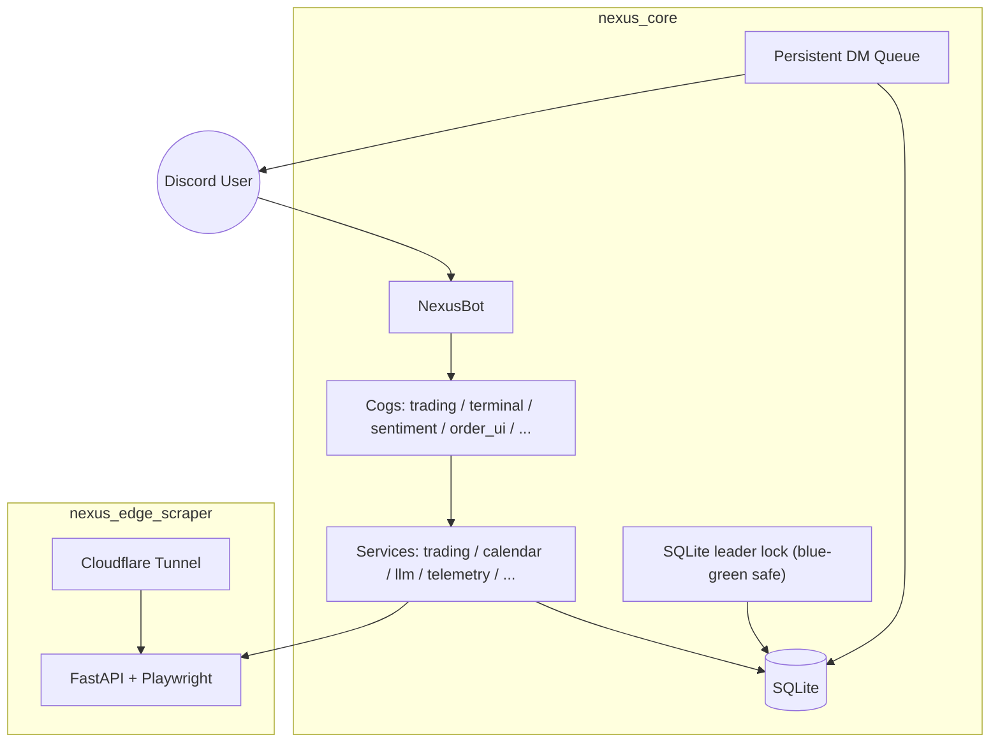

# 🌌 Nexus Seeker

[](https://www.python.org/)
[](nexus_core/docker-compose.yml)
[](LICENSE)

Nexus Seeker 是一個 **Discord-first 的選擇權風控與交易營運平台**：把 watchlist 半小時心跳、期權結構判讀、事件風險防禦、委託單管理與 LLM 輔助解讀，收斂成一套可長期運行、可主動推播、適合實盤節奏的工作流。

> 核心版本（nexus_core）：**v1.7.18**

---

## 你會拿到什麼（核心價值）

- **📡 Watchlist 半小時心跳（盤中）**：每 30 分鐘逐使用者、逐標的推送戰報（技術/波動率/偏斜/事件風控/持倉指引/可執行策略）。
- **🛡️ 衍生流動性與極限壓力測試**：提供 `/stress_test` 指令，動態計算所有活躍 GTC 網格買單的最大現金赤字，對照 BOXX 清算極限（$21,000）與安全賠付閾值（$13,000）進行預警，並無縫整合至 `/dash` 看板中。
- **📊 實時指數微觀結構與 Gamma 避險**：
  - 邊緣服務會利用 Playwright 前往 Yahoo Finance 抓取實時 SPY 選擇權鏈（Option Chain）數據。
  - **計算邏輯**：基於 **Black-Scholes 歐式期權 Gamma 計算公式**，動態計算各履約價的 GEX (Gamma Exposure)。
  - **指標推導**：
    - **Put Wall (最大賣權支持牆)**：取 Put 未平倉量 (OI) 最大之履約價。
    - **Gamma Flip Line (零 Gamma 線)**：對現貨價格上下 20% 範圍進行網格搜索，找出總 Net GEX 改變正負號之臨界價格點。
  - **風控聯動**：當 VIX > 20 且大盤跌破零 Gamma 線進入 `SHORT_GAMMA_CRITICAL` 狀態時，自動將網格間距放大 $1.5\times$，防止踩踏行情中資金過早耗盡。
- **🔮 CME FedWatch 利率概率與逃頂窗口**：
  - 邊緣服務透過 Playwright 強制使用 HTTP/1.1 繞過 Cloudflare WAF 協議保護，抓取 Investing.com 的 Fed Rate Monitor。
  - **計算邏輯**：定位 `Meeting Time:` 錨點以精確隔離下一次 FOMC 會議的預估數據，讀取當前 Fed 基本利率後，將所有大於或等於維持利率區間的預估值加總，計算出「維持或加息機率」。
  - **風控聯動**：於盤前簡報中自動依據此概率與通膨壓力，將使用者自訂的「反彈逃頂窗口」（支援動態判定上/中/下旬）自動前移或後推 5 個交易日，降低事件風控盲區。
- **🔑 均價成本 Covered Call 解鎖**：自動依據「現有持倉加權活躍網格買單」重新計算新均價成本（New Cost Basis），並尋找 DTE 30-50 天、Strike > 新均價成本且 Delta < 0.15 的 Covered Call 合約進行收租解鎖（需滿足年化收益率 >= 10.0% 或單次收租權利金大於現貨 1.0%）。
- **🧾 Strike 對齊的「可執行」期權策略**：策略建議會對齊系統計算的「適合買入/賣出價」，讓現股與選擇權計畫一致。
- **📥 委託單面板 + 互動 Modal**：`/order_panel` 建單、`/list_orders` 管理、`/telemetry_alert` 模擬遙測偏離；並支援一鍵套用遙測建議價與安全倉位。
- **🔔 通知偏好中心**：`/notif_settings` 針對 18+ 種推播開關精細控管（預設大多開啟，但允許針對噪音項目預設關閉）。
- **🗓️ 事件日曆快取**：財報 / CPI / FOMC / NFP 等高衝擊事件走 SQLite 快取（按月宏觀、按標的財報），避免重複打 API。
- **💾 持久化 DM 佇列**：推播先入庫再發送，重啟後可補發，避免 Discord DM 丟失。
- **🧱 低 RAM VPS 友善**：LRU BoundedCache + 記憶體安全閘門（RAM > 85% 時自動降級重計算/LLM）。

---

## 服務與架構（兩個服務，職責分離）

- **`nexus_core/`**：主 Discord bot（slash commands、排程、量化引擎、推播、SQLite、Embed 產出）
- **`nexus_edge_scraper/`**：FastAPI + Playwright 邊緣服務，專責 Reddit 社群輿情爬取、SPY 選擇權鏈抓取與 GEX 演算，以及 Investing.com 的 CME FedWatch 利率機率解析，將耗能的網頁渲染與 WAF 繞過機制與 Bot 主執行緒完全隔離。



---

## 重要執行路徑（避免誤會的關鍵區分）

### 1) Watchlist 半小時心跳（= trading scheduler）

- 入口：`nexus_core/cogs/trading.py` → `SchedulerCog.dynamic_market_scanner()`
- 行為：**只在盤中**（`market_time.is_market_open()`）每 30 分鐘觸發
- 流程：先推送 watchlist heartbeat，再做盤中掃描邏輯

### 2) Analyst Agent（= 獨立報告家族）

- 入口：`nexus_core/cogs/analyst_agent.py`
- 行為：盤前 / 盤中（每 120 分鐘）/ 盤後的報告流程
- **注意**：啟用/停用 Analyst Agent 並不等於啟用/停用 watchlist 心跳；兩條路徑是分離的。

### 3) 產出集中化（Embed 單一真相來源）

- 所有 production embed 都集中在：`nexus_core/cogs/embed_builder.py`
- 這個規則由測試保護（避免 cogs 自行亂建 Embed，導致版面與欄位結構分裂）。

---

## 🚀 5 分鐘啟動（Docker）

### 先決條件

- Docker / Docker Compose
- Discord Bot Token
- （建議）Finnhub API Key（市場資料與事件日曆）
- （選用）OpenAI-compatible LLM endpoint（若要啟用 LLM 解讀/報告）
- （必要）Edge Scraper + Cloudflare Tunnel（若要啟用 Reddit 與大盤總經抓取）

### 1) 啟動核心 Bot（nexus_core）

```bash
git clone https://github.com/cosmo-chang-1701/nexus-seeker.git
cd nexus-seeker/nexus_core
cp .env.example .env
# 編輯 .env
docker compose up -d --build
```

`nexus_core/docker-compose.yml` 會建立 named volume `nexus_data`，SQLite DB 預設落在容器內 `/app/data`（可持久化）。

### 2) 啟動 Edge Scraper（nexus_edge_scraper）

```bash
cd ../nexus_edge_scraper
cp .env.example .env
# 編輯 .env 設定 CF_TUNNEL_TOKEN
docker compose up -d --build
```

Edge API 預設在 `:8000`。請把 **公開的 HTTPS URL** 填回 core 的 `TUNNEL_URL`，讓 bot 可以透過 `TUNNEL_URL/scrape/reddit/{symbol}` 取得 Reddit 資料，以及呼叫大盤與總經數據。

---

## 環境變數（與 `.env.example` 對齊）

> 本專案同時支援 **Docker Secrets**：若環境變數不存在，會嘗試讀取 `/run/secrets/<KEY>`。

### nexus_core（必要/常用）

| Key | 必要 | 用途 |
|---|---:|---|
| `DISCORD_TOKEN` | ✅ | Discord bot token |
| `DISCORD_ADMIN_USER_ID` | ✅ | 管理員 ID（允許 admin 指令） |
| `FINNHUB_API_KEY` | 建議 | Finnhub 市場資料 / 事件日曆 |
| `LLM_API_BASE` | 選用 | OpenAI-compatible base URL |
| `LLM_MODEL_NAME` | 選用 | 模型名稱 |
| `API_KEY` | 選用 | LLM API key |
| `TUNNEL_URL` | ✅ | Edge Scraper 公開 URL（用於大盤、總經與輿情抓取） |
| `LOG_LEVEL` | 選用 | 預設 `WARNING` |
| `NEXUS_DB_NAME` | 選用 | SQLite DB 路徑（預設 `data/nexus_data.db`） |

### nexus_edge_scraper（必要）

| Key | 必要 | 用途 |
|---|---:|---|
| `CF_TUNNEL_TOKEN` | ✅ | Cloudflare Tunnel token（用於將邊緣服務安全暴露至公網） |

---

## Discord 指令快速索引（常用）

> 指令會在 bot 啟動時自動 sync。

- **/settings**：帳戶核心參數面板（資金、風險、VTR/PSQ 等開關）
- **/notif_settings**：通知偏好中心（定時推播 / 即時警報 / Polymarket 類別）
- **/x**：標的分析中心（支援單一標的深度分析，以及持倉/掛單/期權/自選(Watchlist)/ALL 的批次量化雷達掃描。首層雷達採用盤前快取與本地規則引擎，響應時間 <100ms）
- **/dash**：交易員看板（持倉、跑道、績效、風控摘要與極限壓力測試結果）
- **/stress_test**：委託單極限壓力測試與現金赤字預警面板
- **/market**：市場情報中心（事件日曆與市場狀態）
- **/skew_scan**：期權偏斜/IV/PCR/UOA/Max Pain 掃描
- **/order_panel**：委託單面板（動態 Modal 建單）
- **/list_orders**：列出活躍委託單（支援標的篩選：symbol） + 取消/編輯互動
- **/telemetry_alert**：遙測偏離對齊（模擬/提示用）
- **/force_macro_update**：[Admin] 立即手動更新大盤與總經數據 (GEX & FedWatch) 快取

---

## 🛠️ CLI 工具使用說明

本專案提供 `cli.py` 工具，供開發者在伺服器本地端進行行情查詢、手動執行全站掃描或強制更新總經數據。

在 `nexus_core/` 目錄下，您可以使用以下指令：
* **即時報價查詢**：
  ```bash
  python cli.py mkt quote AAPL
  ```
* **手動進行 Watchlist 技術指標與風控檢查**（會觸發爬蟲更新 GEX 數據）：
  ```bash
  python cli.py mkt watchlist_check
  ```
* **立即觸發 Davis Double Play 掃描**：
  ```bash
  python cli.py mkt ddp
  ```
* **[管理員] 立即執行全站掃描**：
  ```bash
  python cli.py admin force-scan
  ```
* **[管理員] 立即強制更新大盤與總經數據 (GEX & FedWatch)**：
  ```bash
  python cli.py admin force-macro-update
  ```

---

## 🧩 開發與測試（給貢獻者）

核心程式位於 `nexus_core/`：

- `bot.py`：bot 啟動、leader lock、持久化 DM queue、服務生命週期
- `cogs/`：slash commands 與背景排程（trading / analyst / terminal / order_ui / ...）
- `market_analysis/`：watchlist 評估、期權策略/腿位計畫、量化引擎
- `services/`：資料、LLM、calendar、trading orchestration
- `database/`：SQLite schema、migration、快取 helpers
- `ui/`：ANSI panel / layout helpers

### 執行測試

本專案以 **Docker 內 pytest** 為準：

```bash
cd nexus_core
docker compose run --rm nexus-seeker python -m pytest tests
```

常用的聚焦測試：

```bash
cd nexus_core
docker compose run --rm nexus-seeker python -m pytest tests/unit/test_intraday_pipeline.py
docker compose run --rm nexus-seeker python -m pytest tests/unit/test_embed_builder.py
docker compose run --rm nexus-seeker python -m pytest tests/unit/test_output_centralization.py
docker compose run --rm nexus-seeker python -m pytest tests/unit/test_order_ui.py
docker compose run --rm nexus-seeker python -m pytest tests/unit/test_macro_risk_upgrade.py
```

---

## 📄 授權條款

本專案採用 [MIT License](LICENSE)。
