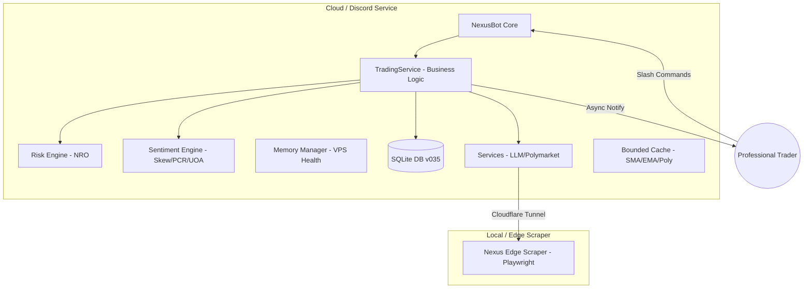
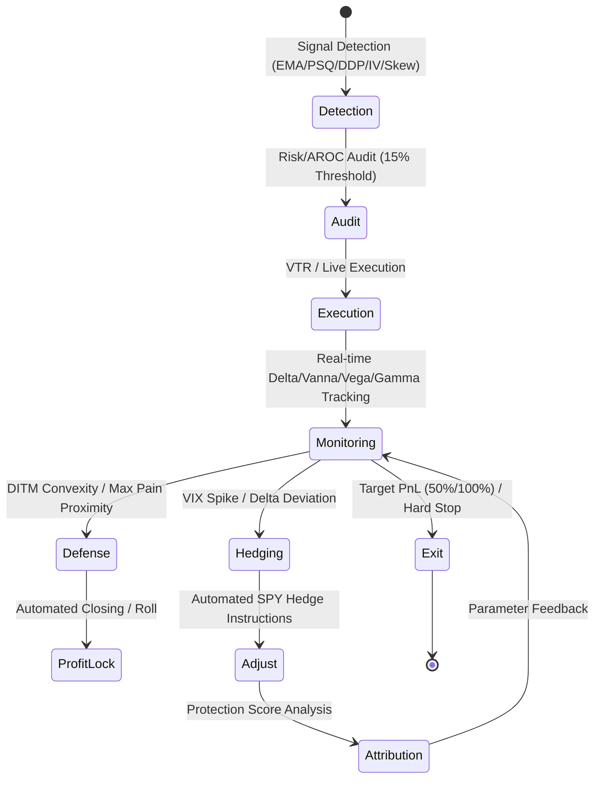

# 🌌 Nexus Seeker: Professional Liquidity & Risk Management Terminal

  

**針對全職投資者打造的關鍵任務執行環境 — 專注於資產保護與系統性風險對沖**

> **Nexus Seeker** 是一款專為專業選擇權交易者設計的高效能終端，核心設計圍繞 **Financial Runway (財務跑道)**、**Greeks Integrity (希臘字母完整性)** 與 **Cross-Market Edge Detection (跨市場邊緣偵測)**。透過 **Black-Scholes-Merton** 精算、**Nexus Risk Optimizer (NRO)** 與 **Sentiment Engine**，本系統提供從信號偵測到自動化對沖的完整專業風控管線。

---

## 🛠 Technical Specifications

| 類別 | 技術規格 (Specifications) |
|---|---|
| **Runtime 環境** | Dockerized Python 3.12 (Low-RAM VPS 最佳化) |
| **量化定價引擎** | Black-Scholes-Merton (via `py_vollib`, 含股息率校正) |
| **風險精算核心** | Nexus Risk Optimizer (NRO) - 二階 Beta-Weighted 曝險模型 (含 Vanna 修正) |
| **情緒分析中心** | Sentiment Engine - Skew 偏斜、PCR、Max Pain 與 UOA 偵測 |
| **驗證與品質** | `pre-commit` (Ruff, Docker-test, Semgrep), Zero-Downtime Swarm CD |
| **數據源 (Feeds)** | Finnhub (Real-time), yfinance (Options), Polymarket (WS L2), Reddit (Edge) |
| **持久化層** | SQLite 搭配自動化 Migration Engine (v035+) |
| **智能層** | Structured LLM Output (Pydantic Schema) 具備 Memory Safety Gates |
| **訊息傳遞** | Discord.py (持久化非同步訊息佇列，支援多租戶隔離) |

---

## 🏗 System Architecture

系統採用分散式雙服務架構，確保雲端執行效率與邊緣爬蟲的隱私性。最新版本針對 **1GB RAM 環境** 進行了深度優化，引入 LRU Bounded Cache 與緊急記憶體閘門。

---

## 🏁 Financial Intelligence

針對全職投資者量身打造的生存與效率指標：

*   **財務生存與跑道分析 (Financial Survival & Runway)**：
    系統自動對照使用者的 **Cash Reserve (現金儲備)** 與 **Monthly Expenses (每月支出)**，利用投資組合的 **Total Theta (每日總 Theta 收租額)** 動態估算「財務生存天數」。
*   **對沖歸因與自我進化 (Self-Evolving Attribution)**：
    系統會追蹤每一筆虛擬對沖 (VTR Hedge) 的 **Protection Score (保護評分)**。若保護效率偏低，AI 將自動建議調整 NRO 觸發閾值或相關性 Proxy，實現策略的動態迭代。

---

## 🛡️ Functional Pillars

### 1. Risk Integrity (NRO 引擎)
*   **Vanna-Adjusted Delta (隱含 Delta 修正)**：
    考慮 IV 劇烈變動對 Delta 的非線性影響 ($d\Delta/d\sigma$)。在 VIX 飆升時，系統會自動估算 **"Hidden Delta"**，並主動於「盤中量化指引」中推送精確的避險口數建議。
*   **Automated Hedging Pipeline (自動化對沖管線)**：
    系統每 30 分鐘執行一次心跳掃描，當 VIX 觸發戰情階梯跳級或單日移動 > 10% 時，主動推送 **「緊急對沖指令」**（如：建議 BUY X 單位 SPY 對沖 Delta 偏離）。使用者可透過 `/settle_hedge` 一鍵記錄執行結果。
*   **VIX 戰情階梯 (Battle Ladder)**：
    6 階段自適應風險調控系統，根據即時波動率動態縮放 **Kelly Criterion** 比例。

### 2. Market Sentiment (市場情緒引擎)
*   **Option Skew Strategist (偏斜策略家)**：
    監控 OTM Put 與 Call 的 IV 差值。當 Skew 進入 90th 百分位時，發出 **"Pre-emptive Hedge" (預警性對沖)** 訊號。
*   **UOA & Whale Intent Mapping (巨鯨意圖映射)**：
    將 Polymarket 的巨鯨交易與選擇權市場的 **Unusual Options Activity (UOA)** 進行關聯分析。內建 **PolymarketWhaleFilter** 高信號過濾管線：
    1. **Category Hard Gate**: 僅限經濟、政治、加密、聯準會、科技與 AI。
    2. **Semantic Ticker Validator**: 基於實體識別的代碼映射，防止語義幻覺（如誤將體育人名當作股票）。
    3. **Capital Efficiency Gate**: 計算預期 ROI 與 $\Delta P$，過濾低效套利噪音。
    4. **Cross-Market Validation**: 僅在標的 Skew > 90th 或 IV Rank > 70 時觸發預警。
*   **Max Pain Analysis (最大痛點分析)**：
    計算結算日前夕的 Max Pain 價格，評估標的是否趨於收斂以鎖定最終利潤。

### 3. Execution Automation & Active Reporting
*   **Intra-day Active Execution Guide (盤中動態量化指引)**：
    取代傳統靜態報告。每 30 分鐘主動評估 Vanna 曝險與財務跑道 (Financial Runway)，並依據時段 (Phase A: 開盤流動性 / Phase B: 板塊輪動 / Phase C: 尾盤對沖) 動態調整關注焦點與對沖指令。
*   **Beautified Macro Scan (美化巨觀掃描)**：
    提供結構化的 Discord Embed 報告，整合美元指數、公債殖利率與 VIX 實時指標，並具備多因子風險告警 (Multi-factor Risk Alerts)。
*   **VPS Performance Guard (1GB RAM 優化)**：
    針對低配 VPS 引入 **BoundedCache (max 500)** 與 **Memory Safety Gates**。當系統 RAM > 85% 時，自動延後非核心 AI 分析，優先確保 NRO 核心風險計算與警報發送。
*   **System Health & Disk Diagnostics (硬碟與系統診斷)**：
    提供視覺化健康評級，包含 RAM 與快取消耗統計。

---

## 🔄 Contract Lifecycle

系統管理期權合約從「偵測」到「對沖結算」的完整專業流程：

---

## 👨‍💻 Professional Investor Workflow (全職投資者實戰流程)

Nexus Seeker 的設計初衷是為了讓全職投資者能從繁瑣的數據整理中解放，專注於決策執行。以下是一個典型的「專業風控交易日」：

*   **盤前情報與生存檢查 (08:30 - 09:30)**
    *   使用 `/dash` 檢查 **Financial Runway** 與 **NRO Integrity**，確認 Theta 收益覆蓋率與組合 Vanna 敏感度，檢視整體 Delta 曝險。
    *   使用 `/market` 查看今日重大財經事件與 Polymarket 上的巨鯨方向性押注。
2.  **盤中動態監測與標的分層 (09:30 - 15:30)**
    *   接收系統每 30 分鐘自動推送的 **「盤中動態量化指引」**，關注當前時段的 Vanna 曝險變動。
    *   針對感興趣的標的，使用 `/x [symbol]` 進入 **「標的分析中心」**，分析 Skew 分位點、DDP 訊號與 Reddit/Polymarket 情緒背離。
3.  **危機防禦與自動化對沖 (隨時觸發)**

    *   當 VIX 劇烈波動或標的跌破關鍵支撐，系統主動發出 **「緊急對沖指令」**。
    *   投資者依據指令執行 SPY 避險後，輸入 `/settle_hedge` 記錄操作。系統隨即更新 **Protection Score** 並重新計算 Greeks 完整性。
4.  **盤後歸因與策略迭代 (16:30+)**
    *   使用 `/vtr_stats` 審視今日對沖的保護效率 (Attribution)，分析 AI 建議的閾值調整。
    *   使用 `/add_holding` 更新現貨持倉，確保明早的 Beta-Weighted Delta 計算基準精確無誤。

---

## ⌨️ Command Matrix (Unified Hubs)

| Command | Description | Interactive Tabs / Buttons |
|---|---|---|
| **`/x [symbol]`** | **🌌 標的分析中心 (Actionable Intelligence)** | 🏠主頁(DDP/Skew), 📰新聞, 💬Reddit, 📐情緒, 🎯MaxPain |
| **`/dash`** | **📊 交易員看板 (Strategic Dashboard)** | 🏠戰略看板, 📋實單持倉, 📦現貨持倉, 🏁財務跑道, 👻VTR績效 |
| **`/market`** | **📅 市場情報中心** | 📅市場日曆, 🐋預測市場, 🔥高波動掃描, 🌌DDP掃描 |

---

## ⌨️ Operational Commands (Legacy & Tools)

| Command | Description | Input Schema (Summary) |
|---|---|---|
| `/settings` | 配置全域資產、風險、生存支出與 **三段式警報開關** | `capital`, `risk_limit`, `alert_mode` |
| `/runway_check` | 執行財務生存跑道分析 | — |
| `/skew_scan` | 執行期權偏斜 (Skew) 與市場情緒掃描 | `symbol` |
| `/max_pain` | 計算特定標的之最大痛點與收斂狀態 | `symbol`, `expiry` |
| `/vtr_stats` | 檢視 VTR 績效統計與 **對沖效能歸因** | — |
| `/settle_hedge` | **[New]** 確認並記錄已執行的對沖操作 (維持 Delta 中性) | `alert_id`, `qty` |
| `/hedge_list` | **[New]** 查看最近的對沖警報與執行狀態 | — |
| `/sys_health` | **[New]** [Hidden] 檢查 VPS 資源狀態與快取健康度 | — |
| `/list_trades` | 列出目前資料庫中的所有實單持倉與即時未實現損益 | — |
| `/scan` | 手動執行量化掃描與 What-if 曝險模擬 | `symbol` |
| `/ddp_scan` | 對觀察清單執行 Davis Double Play (DDP) 掃描 | — |
| `/add_holding` | 登錄實際現貨持倉 (納入 Beta-Delta 計算) | `symbol`, `quantity`, `avg_cost` |
| `/list_holdings` | 列出目前所有現貨持倉與分配比例 | — |
| `/poly_list` | 顯示 Polymarket 活躍市場清單與巨鯨意圖 | — |
| `/quote` | 獲取標的之即時報價與漲跌資訊 | `symbol` |
| `/scan_news` | 掃描特定標的之最新官方新聞 | `symbol` |
| `/scan_reddit` | 掃描特定標的之 Reddit 散戶情緒 | `symbol` |
| `/calendar` | 顯示影響目前投資組合的即時重大事件 | — |
| `/iv_rank` | 掃描觀察清單中具備高 IV Rank 或財報前夕的標的 | — |
| `/event_impact` | 針對特定即時事件進行 Greeks (Delta, Vanna) 模擬 | `symbol`, `vol_move` |

---

## 🚀 Getting Started

### Prerequisites
*   Docker & Docker Compose
*   Finnhub API Key & Discord Bot Token
*   OpenAI-compatible API Key (用於智能分析)

### Quick Deployment
1.  `cp .env.example .env` (填寫 API Keys)
2.  `docker compose up -d --build`
3.  進入 Discord 使用 `/settings` 初始化配置。

---

## 📄 License
本專案採用 [MIT 授權條款](LICENSE)。

*由 [Cosmo Chang](https://github.com/cosmo-chang-1701) 以 ❤️ 打造，追求量化自由。*

