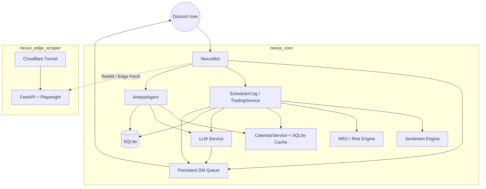

# 🌌 Nexus Seeker

<div align="center">
  
</div>

**Discord 驅動的多租戶選擇權風控、交易監控與主動推播平台。**

[](https://www.python.org/)
[](nexus_core/docker-compose.yml)
[](nexus_core/pyproject.toml)

Nexus Seeker 以 **Financial Runway**、**Greeks Integrity**、**Skew / IV 結構判讀** 與 **事件風險防禦** 為核心，整合 Black-Scholes-Merton、Nexus Risk Optimizer (NRO)、Sentiment Engine、Polymarket 與 LLM 結構化分析，提供從 watchlist 心跳、盤中對沖、盤前財報掃描到盤後風險結算的完整工作流。

---

## 🧭 Current System Snapshot

| 項目 | 現況 |
|---|---|
| **核心服務** | `nexus_core` Discord Bot + `nexus_edge_scraper` 可選 Edge Scraper |
| **執行環境** | Python 3.12 / Docker / SQLite |
| **版本** | `1.6.14` |
| **量化核心** | BSM Greeks、NRO、Sentiment Engine、Execution Router |
| **事件快取** | SQLite 月度總經事件快取 + rolling earnings cache |
| **推播骨幹** | 持久化 DM queue，支援 Discord 長訊息切分 |
| **Discord 輸出** | `cogs/embed_builder.py` 統一管理所有 embeds |
| **LLM 安全閘門** | RAM > 85% 時自動降級非核心 LLM 分析 |

---

## 🏗 Runtime Architecture



### 核心結論

1. **Watchlist 半小時心跳** 目前由 `cogs/trading.py` 的 `SchedulerCog.dynamic_market_scanner()` 實際發送。
2. **Analyst Agent** 是另一條獨立推播線，負責盤前 / 盤中 / 盤後分析報告，不是 watchlist 心跳的開關。
3. **`market_analysis/intraday_pipeline.py`** 目前主要提供 watchlist 評估、選約、事件風控與量化引擎 helper；其中的模型與邏輯被 `SchedulerCog` 重用。

---

## ⏱️ Active Background Loops

| 任務 | 實際來源 | 頻率 / 時點 | 作用 |
|---|---|---|---|
| Reddit 情緒快取 | `SchedulerCog.daily_reddit_update` | 08:30 ET | 預抓 watchlist Reddit 情緒 |
| 盤前財報警報 | `SchedulerCog.pre_market_risk_monitor` | 09:00 ET | 發送財報 / 事件風險預警 |
| Watchlist 半小時心跳 | `SchedulerCog.dynamic_market_scanner` | 開盤時每 30 分鐘 | 逐檔推送 watchlist embed + 量化掃描 |
| 真實持倉風險審計 | `SchedulerCog.monitor_real_portfolio_task` | 開盤時每 30 分鐘 | 利潤鎖定 / Gamma fragility |
| 盤後風險結算 | `SchedulerCog.dynamic_after_market_report` | 16:15 ET | 盤後風險結算報告 |
| 週報 | `SchedulerCog.weekly_vtr_report_task` | 週五 17:05 ET | VTR 績效摘要 |
| Analyst 盤前掃描 | `AnalystAgent.pre_market_loop` | 開盤前 30 分鐘 | Macro scan + earnings report |
| Analyst 盤中指引 | `AnalystAgent.intra_day_loop` | 開盤時每 120 分鐘 | Active execution guide |
| Analyst 盤後分析 | `AnalystAgent.post_market_loop` | 盤後排程 | sector flow / macro summary / next-day strategy |

---

## 📡 Watchlist Half-Hour Heartbeat

目前半小時心跳的實際邏輯如下：

- 由 `SchedulerCog.dynamic_market_scanner()` 在 **市場開盤期間每 30 分鐘** 啟動
- 以 **每個 watchlist ticker 各自一則 embed** 發送
- 透過 `market_analysis.intraday_pipeline` 的 helper 完成：
  - `evaluate_watchlist_symbol()`
  - `derive_watchlist_option_guidance()`
  - `build_watchlist_option_plan()`
- 事件風控會先經過 `CalendarService` 與 SQLite 快取
- skew 補充說明透過 `services.llm_service.generate_watchlist_skew_commentary()` 生成

### 目前心跳 embed 內容

`create_watchlist_signal_embed()` 目前包含：

1. **📊 技術 / 期權快照**：ANSI 格式的技術位階、IV Rank、Skew、GEX Put Wall、Vanna、買賣區等
2. **📐 Skew 與市場判讀**：skew 狀態 + 期權策略 rationale
3. **🤖 LLM Skew 解說**：針對單一標的當下 heartbeat 快照生成簡短繁中判讀
4. **🗓️ 事件風控**：財報 / CPI / FOMC / NFP 等事件摘要
5. **🎯 執行建議**：現股或期權切入建議
6. **🧾 可執行期權合約**：策略、權利金型態、腿位、strike、expiry、mid、建議口數、最大風險

### 事件防禦邏輯

- 財報前幾天：自動降風險
- 財報前 72 小時：避免賣方收租，優先 `Debit Spread` / 保護性結構
- CPI / FOMC / NFP 前：自動縮口數
- 高風險事件下：優先定義風險結構，而非裸賣方

---

## 🧠 Analyst Agent

`cogs/analyst_agent.py` 目前是獨立於 watchlist heartbeat 的分析報告系統：

- **盤前**：Macro scan + `盤前財報與估值調整`
- **盤中**：每 120 分鐘一次的 `盤中量化掃描 & 避險執行指南`
- **盤後**：`收盤資金流向與板塊輪動報告`、`盤後風險結算` 類型報告

### 目前的重要行為

- Analyst 報告會經過 `split_embed_by_fields()`，將多區塊報告拆成 **多則訊息**，避免 Discord embed 長度超限
- 記憶體壓力高時，會自動降級非必要 LLM 分析，優先保留核心風控運算

---

## 🛡️ Risk, Quant, and Sentiment Stack

### Risk / NRO

- Vanna-adjusted delta / hidden delta 估算
- 依 VIX Battle Ladder 縮放 Kelly sizing
- Protection Score 盤後歸因回饋
- SHIELD / SPEAR 戰術路由

### Sentiment / Options Structure

- Skew、PCR、Max Pain、UOA 偵測
- IV / IV Rank / IV Percentile / Expected Move
- Polymarket whale filtering 與跨市場驗證

### Calendar-Aware Guard

- 月度 macro cache：先讀 SQLite，再補抓 API
- rolling earnings cache：symbol 級別更新
- watchlist heartbeat、盤前財報、日曆檢視與 analyst flows 共用同一來源

---

## ✉️ Notification Delivery

`nexus_core/bot.py` 目前的通知層有兩個重要特性：

1. **持久化 DM queue**：通知先入 SQLite，再由 worker 補發
2. **Discord 長訊息安全切分**：
   - 自動處理超過 `2000` 字元的 content
   - 支援 code block 保留與切分
   - 避免 `Invalid Form Body / In content: Must be 2000 or fewer in length`

---

## 🎨 Discord UI Conventions

- 所有 cog 的 embed 都集中在 `nexus_core/cogs/embed_builder.py`
- `tests/unit/test_output_centralization.py` 會防止 cog 直接建 `discord.Embed`
- 複雜表格統一放入 ` ```ansi ` 區塊
- CJK 對齊依賴 `_visual_len()` / `_pad_string()`
- 新的推播類訊息優先採用 **field-based embed**，不要把整段報告塞進 description

---

## 🧱 Repository Layout

```text
.
├── README.md
├── AGENTS.md
├── Dockerfile.test
├── nexus_core/
│   ├── bot.py
│   ├── cli.py
│   ├── config.py
│   ├── cogs/
│   ├── database/
│   ├── market_analysis/
│   ├── models/
│   ├── services/
│   ├── tests/
│   └── docker-compose.yml
└── nexus_edge_scraper/
    ├── local_api.py
    ├── docker-compose.yml
    └── Dockerfile
```

---

## ⌨️ Main User Surfaces

### Discord

- `/x`：標的分析中心
- `/dash`：策略儀表板 / 跑道 / 持倉
- `/market`：市場脈搏 / 日曆 / Polymarket / DDP
- `/settings`：資金、風險、支出、模式設定
- `/settle_hedge`、`/hedge_list`：對沖警報與執行記錄
- `/ddp_scan`、`/iv_scan`、`/calendar`、`/skew_scan`、`/max_pain`

### CLI

`nexus_core/cli.py` 提供與 Discord 對應的 CLI：

- `sys`：health / settings
- `watch`：watchlist CRUD
- `pf`：portfolio / runway
- `mkt`：quote / ddp / skew
- `admin`：手動掃描與系統控制

---

## 🚀 Getting Started

### Core Bot

```bash
cd nexus_core
cp .env.example .env
docker compose up -d --build
```

### Edge Scraper (Optional)

```bash
cd nexus_edge_scraper
cp .env.example .env
docker compose up -d --build
```

---

## 🧪 Testing

測試全部位於 `nexus_core/tests/`，並以容器內 `pytest` 為準：

```bash
cd nexus_core
docker compose run --rm nexus-seeker python -m pytest tests
```

常見驗證：

```bash
cd nexus_core
docker compose run --rm nexus-seeker python -m pytest tests/unit/test_embed_builder.py
docker compose run --rm nexus-seeker python -m pytest tests/unit/test_intraday_pipeline.py
docker compose run --rm nexus-seeker python -m pytest --cov=market_analysis --cov=services --cov-report=term-missing
```

---

## 🔐 Development Rules

- 所有使用者可見文案使用 **繁體中文**
- DB schema 一律透過 migration engine 更新
- 新事件 / 財報邏輯優先接 `services/calendar_service.py`
- 不要在 cog 內自行建 embed
- 不要用動態 SQL 字串拼接參數
- 請優先維持低 RAM VPS 的可運行性

---

## 📄 License

本專案採用 [MIT License](LICENSE)。

<div align="center">

*Built by [Cosmo Chang](https://github.com/cosmo-chang-1701) for disciplined options risk operations.*

</div>
