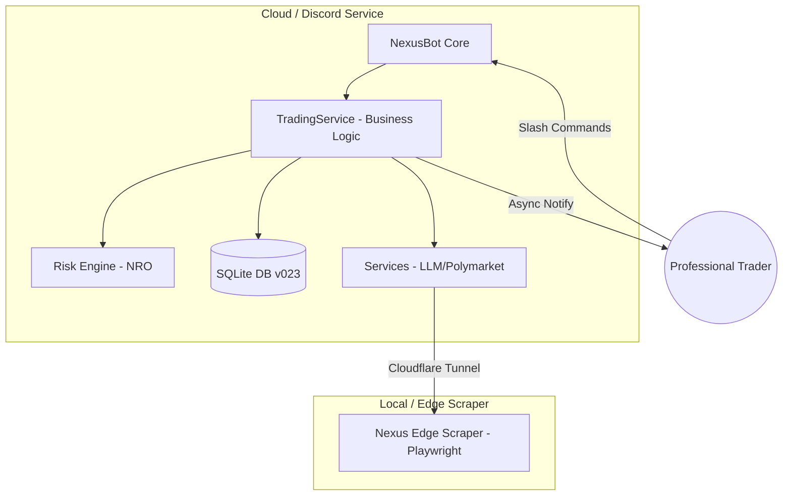

# 🌌 Nexus Seeker: Professional Liquidity & Risk Management Terminal

  

**針對全職投資者打造的關鍵任務執行環境 — 專注於資產保護與系統性風險對沖**

> **Nexus Seeker** 是一款專為專業選擇權交易者設計的高效能終端，核心設計圍繞 **Financial Runway (財務跑道)**、**Gamma Integrity (Gamma 完整性)** 與 **Cross-Market Edge Detection (跨市場邊緣偵測)**。透過 **Black-Scholes-Merton** 精算與 **Nexus Risk Optimizer (NRO)**，本系統提供從信號偵測到自動化對沖的完整風控管線。

---

## 🛠 Technical Specifications

| 類別 | 技術規格 (Specifications) |
|---|---|
| **Runtime 環境** | Python 3.12 (WSL2 / Windows 11 最佳化) |
| **量化定價引擎** | Black-Scholes-Merton (via `py_vollib`, 含股息率校正) |
| **風險精算核心** | Nexus Risk Optimizer (NRO) - 二階 Beta-Weighted 曝險模型 |
| **數據源 (Feeds)** | Finnhub (Real-time), yfinance (Chain), Polymarket (WS L2), Reddit (Edge) |
| **持久化層** | SQLite 搭配自動化 Migration Engine (v023+) |
| **智能層** | Structured LLM Output (Pydantic Schema) via OpenAI-compatible API |
| **訊息傳遞** | Discord.py (非同步訊息佇列，支援多租戶隔離) |

---

## 🏗 System Architecture

系統採用分散式雙服務架構，確保雲端執行效率與邊緣爬蟲的隱私性。

---

## 🏁 Financial Intelligence

針對全職投資者量身打造的生存與效率指標：

*   **Financial Survival & Runway (財務生存跑道)**：
    系統自動對照使用者的 **Cash Reserve (現金儲備)** 與 **Monthly Expenses (每月支出)**，利用投資組合的 **Total Theta (每日時間價值收益)** 動態估算「財務生存天數」。透過 `/runway_check` 隨時掌握現金流健康度。
*   **Capital Efficiency (AROC 門檻)**：
    嚴格執行 **15% Annualized Return on Capital (AROC)** 准入制度。所有 **STO (Sell-to-Open)** 訊號若年化回報率低於 15%，將被系統過濾器直接攔截，確保保證金利用率極大化。

---

## 🛡️ Functional Pillars

### 1. Risk Integrity (NRO 引擎)
*   **Gamma Fragility Assessment (Gamma 脆性評估)**：
    利用二階 Beta-Weighted 平方加權監控投資組合的淨 Gamma。當偵測到非線性風險加速時（淨 Gamma < −20），自動發出脆性警告。
*   **DITM Convexity Guard (Profit Lock)**：
    針對買方部位，當 **Delta ≥ 0.85** 且獲利豐厚時，偵測到部位喪失 **Convexity (凸性)** 並轉化為合成現股。系統會發出 **"Profit Lock"** 優先指令，強制執行資本回收。
*   **VIX Battle Ladder (戰情階梯)**：
    6 階段自適應風險調控系統，根據即時波動率動態縮放 **Kelly Criterion (凱利準則)** 比例與 **Target Delta (目標曝險)**。

### 2. Market Intelligence (邊緣偵測)
*   **Polymarket Whale Tracking**：
    透過 WebSocket 即時監控預測市場 **L2 Order Book**。結合 LLM 進行 **Taker Intent Mapping (主動意圖映射)**，識別機構級巨鯨建倉動機。
*   **Reddit Edge Scraper**：
    透過 Cloudflare Tunnel 於本地端擷取散戶共識指標，精準識別 **Retail Sentiment Shift (散戶情緒轉向)**。

### 3. Execution Automation
*   **NYSE Dynamic Scheduler**：
    精準對齊交易所交易時鐘，以 30 分鐘為心跳進行全自動化掃描，避開造市商無報價時段。
*   **GhostTrader (VTR)**：
    全功能虛擬交易室，支援自動化策略回測與實時績效歸因，提供每週勝率、損益比專業報表。

---

## 🔄 Contract Lifecycle

系統管理期權合約從「偵測」到「對沖結算」的完整專業流程：

---

## ⌨️ Command Matrix (CLI)

| Command | Description | Input Schema (Summary) | Level |
|---|---|---|---|
| `/settings` | 配置全域資產、風險、生存支出與推播開關 | `capital`, `risk_limit`, `expense`, `cash_reserve` | User |
| `/runway_check` | 執行財務生存跑道與 Theta 收益分析 | — | User |
| `/add_trade` | 登錄實單部位至 NRO 監控管線 | `symbol`, `opt_type`, `strike`, `qty`, `cost` | User |
| `/scan` | 手動執行量化掃描與 What-if 曝險模擬 | `symbol` | User |
| `/vtr_stats` | 檢視虛擬交易室勝率與盈虧歸因週報 | — | User |
| `/transition_sim` | 模擬投機部位向 Core Equity/Covered Call 演進 | `symbol`, `target_price`, `realized_pnl` | User |
| `/force_scan` | [Admin] 立即驅動全站同步掃描與私訊分發 | — | Admin |
| `/poly_list` | 檢視 Polymarket 巨鯨監控中的活躍市場 | — | User |

> **策略邏輯與 VIX 戰情細節：** 關於詳細的量化濾網規則與 VIX 階梯係數，請參閱 [docs/STRATEGY.md](docs/STRATEGY.md)。

---

## 🚀 Getting Started

### Prerequisites
*   Docker & Docker Compose
*   Finnhub API Key (Mission Critical)
*   Discord Bot Token

### Quick Deployment
1.  `cp .env.example .env` (填寫 API Keys)
2.  `docker compose up -d --build`
3.  進入 Discord 使用 `/settings` 初始化您的交易配置。

---

## 📄 License
本專案採用 [MIT 授權條款](LICENSE)。

*由 [Cosmo Chang](https://github.com/cosmo-chang-1701) 以 ❤️ 打造，追求量化自由。*

