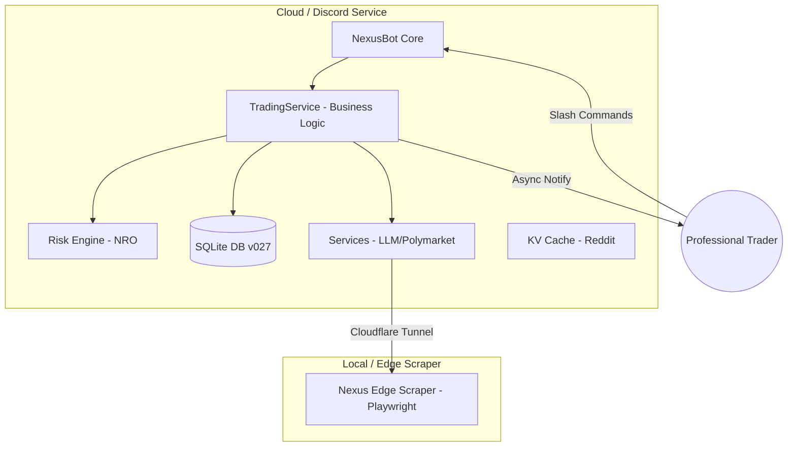
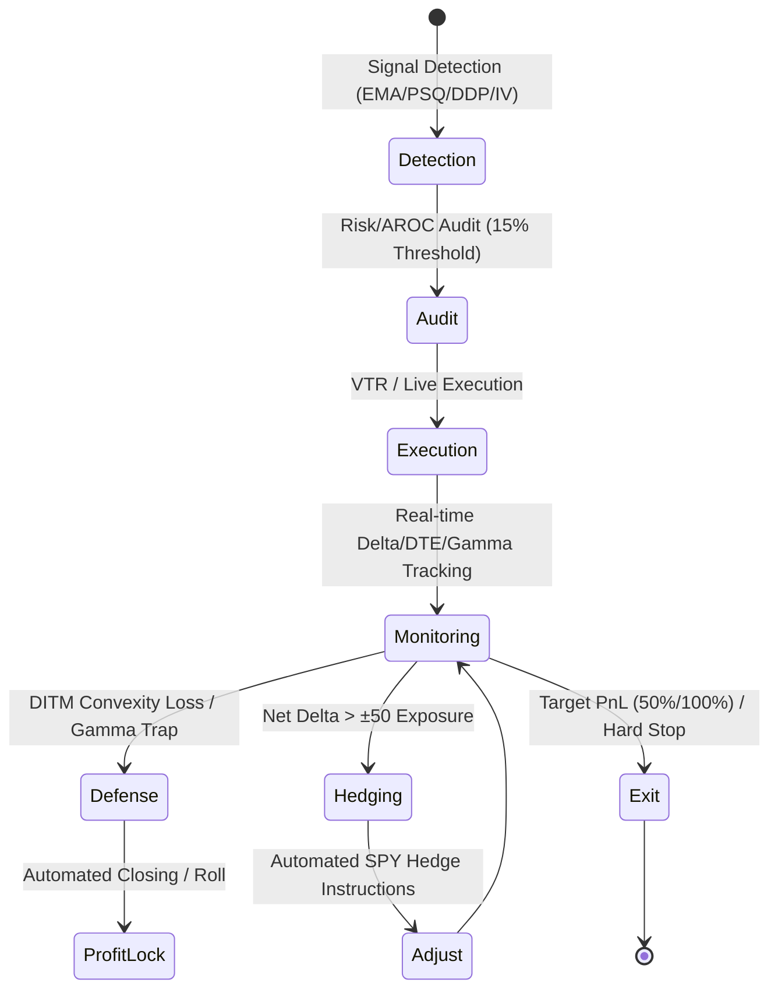

# 🌌 Nexus Seeker: Professional Liquidity & Risk Management Terminal

  

**針對全職投資者打造的關鍵任務執行環境 — 專注於資產保護與系統性風險對沖**

> **Nexus Seeker** 是一款專為專業選擇權交易者設計的高效能終端，核心設計圍繞 **Financial Runway (財務跑道)**、**Gamma Integrity (Gamma 完整性)** 與 **Cross-Market Edge Detection (跨市場邊緣偵測)**。透過 **Black-Scholes-Merton** 精算與 **Nexus Risk Optimizer (NRO)**，本系統提供從信號偵測到自動化對沖的完整風控管線。

---

## 🛠 Technical Specifications

| 類別 | 技術規格 (Specifications) |
|---|---|
| **Runtime 環境** | Python 3.12 (WSL2 / Windows 11 最佳化) |
| **量化定價引擎** | Black-Scholes-Merton (via `py_vollib`, 含股息率校正) |
| **風險精算核心** | Nexus Risk Optimizer (NRO) - 二階 Beta-Weighted 曝險模型 |
| **數據源 (Feeds)** | Finnhub (Real-time), yfinance (Chain), Polymarket (WS L2), Reddit (Edge) |
| **持久化層** | SQLite 搭配自動化 Migration Engine (v027+) |
| **智能層** | Structured LLM Output (Pydantic Schema) via OpenAI-compatible API |
| **訊息傳遞** | Discord.py (持久化非同步訊息佇列，支援多租戶隔離) |

---

## 🏗 System Architecture

系統採用分散式雙服務架構，確保雲端執行效率與邊緣爬蟲的隱私性。Reddit 數據現在以每日非同步方式抓取並快取，極大化掃描響應速度。

---

## 🏁 Financial Intelligence

針對全職投資者量身打造的生存與效率指標：

*   **財務生存與跑道分析 (Financial Survival & Runway)**：
    系統自動對照使用者的 **Cash Reserve (現金儲備)** 與 **Monthly Expenses (每月支出)**，利用投資組合的 **Total Theta (每日總 Theta 收租額)** 動態估算「財務生存天數」。透過 `/runway_check` 隨時掌握現金流健康度。
    *   **收益支出比 (Income/Expense Ratio)**：採用百分比格式渲染（如 `0.48%`），精確追蹤微小現金流貢獻。
*   **Capital Efficiency (AROC 門檻)**：
    嚴格執行 **15% Annualized Return on Capital (AROC)** 准入制度。所有 **STO (Sell-to-Open)** 訊號若年化回報率低於 15%，將被系統過濾器直接攔截 (Blocked)，確保保證金利用率極大化。

---

## 🛡️ Functional Pillars

### 1. Risk Integrity (NRO 引擎)
*   **Gamma Fragility Warning (Gamma 脆弱性警告)**：
    利用二階 Beta-Weighted 平方加權監控投資組合的淨 Gamma。當偵測到非線性風險加速時（淨 Gamma < −20），自動發出脆弱性警告。
*   **DITM 凸性防護 (Convexity Guard)**：
    針對買方部位，當 **Delta ≥ 0.85** 且獲利豐厚時，偵測到部位喪失 **Convexity (凸性)** 並轉化為合成現股。系統會發出 **"Profit Lock" (獲利鎖定)** 優先指令，強制執行資本回收。
*   **VIX 戰情階梯 (Battle Ladder)**：
    6 階段自適應風險調控系統，根據即時波動率動態縮放 **Kelly Criterion (凱利準則)** 比例與 **Target Delta (目標曝險)**。

### 2. Market Intelligence (邊緣偵測)
*   **Volatility Strategist (波動率優勢偵測)**：
    偵測「廉價波動率」機會。當 IV 處於 252 日歷史低位 (IVP < 25%) 且低於歷史波動率 (IV < HV)，結合價格動能發出 BTO 或牛市價差建議。
*   **Davis Double Play (戴維斯雙擊引擎)**：
    量化偵測盈餘增長與估值擴張的共振機會。要求 YoY EPS 成長 > 15% 且 P/E 處於 3 年歷史低位 (25th Percentile)，並經由營收加速狀態確認。
*   **Polymarket 巨鯨意圖圖譜 (Whale Intent Mapping)**：
    透過 WebSocket 即時監控預測市場 **L2 Order Book**。結合 LLM 進行 **吃單者意圖映射 (Taker Intent Mapping)** 識別機構級巨鯨建倉動機。

### 3. Execution Automation
*   **NYSE 動態調度器 (Dynamic Scheduler)**：
    精準對齊交易所交易時鐘，以 30 分鐘為心跳 (Heartbeat) 進行全自動化掃描，避開造市商無報價時段。
*   **盤前財報雷達 (Pre-market Earnings Radar)**：
    每日 09:00 自動掃描持倉與觀察清單，依據距離財報天數**升冪排序**（0天優先），提供即時風險預警。
*   **優雅關閉與持久化私訊佇列 (Graceful Handoff)**：
    部署新版本時，系統會自動將未送出的警報存入 SQLite 佇列，並由新實例在啟動後接力補發。
*   **獨立現貨持倉系統 (Independent Holdings System)**：
    解耦觀察清單與實際資產會計。透過 `/add_holding` 獨立管理長期股權，並將其 Beta-Weighted Delta 自動納入 NRO 全局風險精算。
*   **零停機部署 (Zero-Downtime Deployment)**：
    採用 Docker Swarm `start-first` 藍綠部屬策略，維持服務 24/7 不中斷。

---

## 🔄 Contract Lifecycle

系統管理期權合約從「偵測」到「對沖結算」的完整專業流程：

---

## ⌨️ Command Matrix (CLI)

| Command | Description | Input Schema (Summary) | Level |
|---|---|---|---|
| `/settings` | 配置全域資產、風險、生存支出與推播開關 | `capital`, `risk_limit`, `expense`, `cash_reserve` | User |
| `/runway_check` | 執行財務生存跑道與 Theta 收益分析 | — | User |
| `/add_holding` | 登錄實際現貨持倉 (用於資產會計與 Delta 曝險精算) | `symbol`, `quantity`, `avg_cost` | User |
| `/list_holdings` | 列出目前所有現貨持倉、分配比例與即時損益估計 | — | User |
| `/remove_holding` | 從資產清單中移除特定的現貨紀錄 | `symbol` | User |
| `/add_trade` | 登錄實單部位至 NRO 監控管線 (含 YYYY-MM-DD 驗證) | `symbol`, `opt_type`, `strike`, `qty`, `expiry`, `cost` | User |
| `/scan` | 手動執行量化掃描與 What-if 曝險模擬 | `symbol` | User |
| `/ddp_scan` | 立即對觀察清單執行 Davis Double Play (DDP) 深度掃描 | — | User |
| `/iv_scan` | 立即對觀察清單執行波動率優勢 (Cheap IV) 偵測 | — | User |
| `/vtr_stats` | 檢視虛擬交易室勝率與盈虧歸因週報 | — | User |
| `/vtr_list` | 列出虛擬交易室中的所有持倉與歷史紀錄 | — | User |
| `/add_watch` | 將標的加入自動化量化監控清單 | `symbol`, `use_llm` | User |
| `/edit_watch` | 修改觀察清單中的標的參數 | `symbol`, `use_llm` | User |
| `/remove_watch` | 將標的從觀察清單中移除 | `symbol` | User |
| `/list_watch` | 列出您的雷達觀察清單 | — | User |
| `/list_trades` | 列出目前資料庫中的所有實單持倉 | — | User |
| `/remove_trade` | 將部位從監控管線中移除 | `trade_id` | User |
| `/poly_list` | 顯示 Polymarket 活躍市場清單與巨鯨意圖 | — | User |
| `/quote` | 獲取標的之即時報價與漲跌資訊 | `symbol` | User |
| `/scan_news` | 掃描特定標的之最新官方新聞 | `symbol` | User |
| `/scan_reddit` | 掃描特定標的之 Reddit 散戶情緒 | `symbol` | User |
| `/force_scan` | [Admin] 立即驅動全站同步掃描與私訊分發 | — | Admin |
| `/poly_status` | [Admin] 查看 Polymarket WebSocket 連線狀態 | — | Admin |

> **策略邏輯與 VIX 戰情細節：** 關於詳細的量化濾網規則與 VIX 階梯係數，請參閱 [docs/STRATEGY.md](docs/STRATEGY.md)。

---

## 🚀 Getting Started

### Prerequisites
*   Docker & Docker Compose
*   Finnhub API Key (Mission Critical)
*   Discord Bot Token

### Quick Deployment
1.  `cp .env.example .env` (填寫 API Keys)
2.  `docker compose up -d --build`
3.  進入 Discord 使用 `/settings` 初始化您的交易配置。

---

## 📄 License
本專案採用 [MIT 授權條款](LICENSE)。

*由 [Cosmo Chang](https://github.com/cosmo-chang-1701) 以 ❤️ 打造，追求量化自由。*

