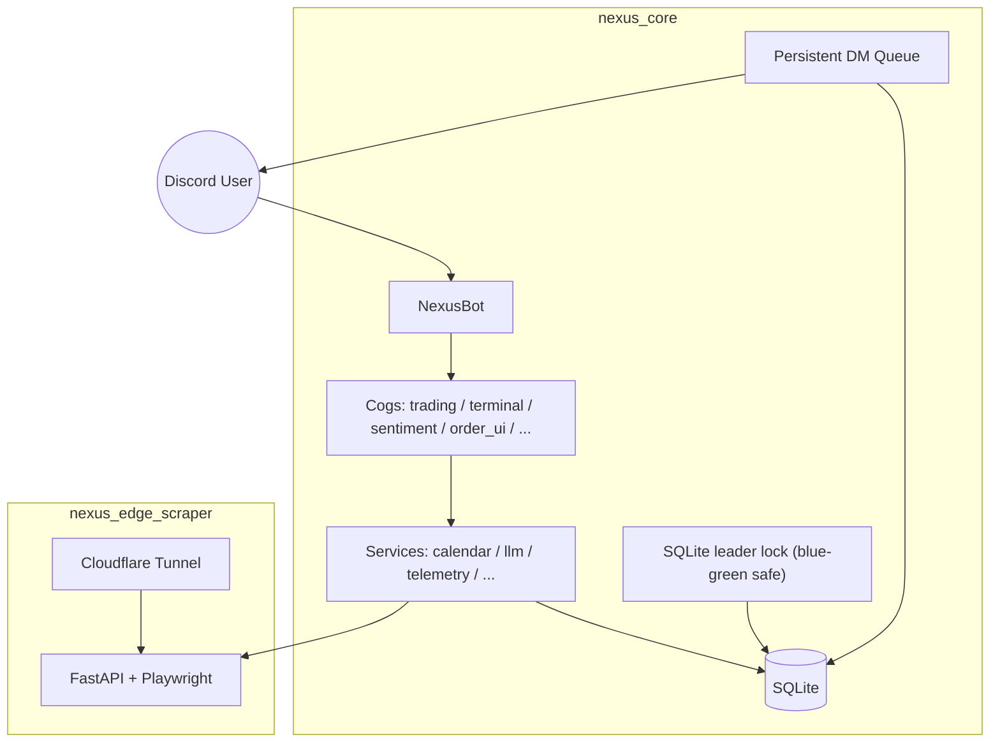

# 🌌 Nexus Seeker

[](https://www.python.org/)
[](nexus_core/docker-compose.yml)
[](LICENSE)

Nexus Seeker 是一個 **Discord-first 的多租戶選擇權風控與交易營運平台**。本平台深度結合了技術指標分析、Black-Scholes-Merton 期權定價、希臘字母（Greeks）投資組合風險管理、事件日曆防禦及大型語言模型（LLM）輔助分析，旨在低內存 VPS 部署環境下，為實盤交易者提供最即時、可持續、自動化的高勝率風控操作指南。

> 核心版本（nexus_core）：**v1.10.11**

---

## 💎 核心功能架構與量化防護邏輯

### 1. 📡 Watchlist 盤中半小時心跳
於美股交易時段內，由 `SchedulerCog.dynamic_market_scanner()` 驅動，每 30 分鐘針對每位使用者訂閱的自選標的，主動推送深度戰報。其 Embed 戰報最上方標題會動態注入該標的的專屬標籤 (e.g. `🏷️ TECH | CORE`)，並固定包含以下七大區塊：
- **📊 技術 / 期權快照**：包含價格、IV Rank / Percentile、及當日掃描之異動期權 (Unusual Option Activity, UOA)。系統會自動區分大宗交易（🔥 `SWEEP` / 📦 `BLOCK`）並計算當日 Open Interest (OI) 淨變化量。另外也會掃描近期最大暗池大宗成交 (Dark Pool Block Prints) 及其支撐點位。
- **📐 Skew 與市場判讀**：期權波動率偏斜與偏斜百分位數（Skew Percentile）判讀，並整合暗池偏斜度 (Dark Pool Skew) 作為高勝率反轉點或派發的依據。
- **🤖 LLM Skew 解說**：串接 OpenAI 相容 API 產出精簡繁體中文分析（受系統 85% RAM 安全門檻保護，記憶體超限時自動降級）。
- **🗓️ 事件風控**：彙整即將發生的重要總經事件與財報時間。
- **💼 持倉與操作指引**：
  - **未持倉標的**：依據 RSI 與 Skew（下行恐慌貼水因子）動態算出建議買入價 (`suitable_buy_price`)，並結合使用者設定的資金與風險上限，提供建議配置股數。若現價跌破做市商底牆 (PutWall) 並進入負 Gamma 禁區，將啟動「全域風控戒嚴 (Textual Martial Law)」，強制將建議價鎖定為 N/A，並阻斷任何「向上磁吸」等樂觀敘事陷阱 (Narrative Trap)，避免左側接刀。
  - **已持倉標的**：動態計算建議賣出價 (`suitable_sell_price`) 與分批出場比例（25%、33%、50%、100%）。
- **🎯 執行建議**：推薦對齊建議價位之期權履約價。若暗池呈現強烈派發跡象 (Dark Pool Skew < -0.3) 或觸發底牆危機，執行路由 (Execution Router) 將自動強制降級為 `SHIELD` 網格防禦，封鎖所有激進的單腿看多期權策略。
- **🧾 可執行期權合約**：列出精確的期權開倉合約推薦。

### 2. 📊 大盤微觀結構與零 Gamma 避險 (GEX & VIX)
- **Regime 評估**：依據 VIX 波動率與大盤流動性進行動態市場分級。
- **零 Gamma 線（Gamma Flip Line）**：邊緣服務（Edge Scraper）使用 Playwright 解析實時 SPY 期權鏈，依據 Black-Scholes 算式求得各履約價之 Gamma 曝險（GEX），並對現貨價上下 20% 範圍進行網格搜索，定位出 Net GEX 正負變化的零 Gamma 臨界線。
- **個股 Gamma 曝險 (GEX Profile)**：透過 KV 快取機制 (4 小時 TTL) 儲存個股的做市商底牆 (Put Wall) 與各履約價 GEX 熱力圖，提升終端掃描效率並避免過度消耗 Edge 爬蟲資源。
- **防禦機制 (`SHORT_GAMMA_CRITICAL`)**：當 $VIX > 20$ 且大盤跌破零 Gamma 線（即進入 Backwardation 狀態與負 Gamma 區），系統判定市場進入極度脆弱狀態，將自動在 watchlist 掃描中將 GTC 網格買單的間距（`dynamic_grid_step`）拉大 **1.5 倍**，以減緩大盤崩跌時的資金損耗速度。

### 3. 🔮 總經與事件日曆防護 (CME FedWatch, FRED & Calendar)
- **利率概率預測**：邊緣爬蟲負責獲取 CME FedWatch 利率概率 (由 Atlanta Fed 解析)。
- **核心總經數據爬蟲**：透過無金鑰 (Keyless) 邊緣爬蟲即時擷取 FRED (聖路易斯聯邦準備銀行) 關鍵數據：聯準會逆回購 (RRP) 及 30 天變化率、資產負債表總規模、失業率 (UER) 與薩姆規則衰退指標 (Sahm Rule)；並同步擷取 CNN 恐懼與貪婪指數 (Fear & Greed Index)，徹底取代靜態備援數值。
- **逃頂窗口動態調整**：系統若偵測到 Fed 利率維持高位（維持或升息機率 $> 70\%$），盤前 Analyst Loop 將自動把使用者自訂的「反彈逃頂窗口（上/中/下旬）」前移 **5 個交易日** 以规避風險；若預期降息則窗口後推 5 天以增強風險偏好。
- **共享快取與動態日曆**：總經事件（以「月」快取）與個股財報（以「標的」快取）統一透過 SQLite 持久化快取，避免因重複調用外部 API 導致被封禁或增加延遲。面板上的 CPI 與 NFP 日期亦由底層事件引擎即時運算渲染。

### 4. 🛡️ 活躍委託單極限壓力測試 (`/stress_test`)
- **赤字演算**：計算系統中所有活躍 GTC 網格買單的最大可能現金赤字：
  $$\text{Total Cash Deficit} = \sum (\text{Active Buy Grid Limit Price} \times \text{Quantity})$$
- **資金預警**：比對帳戶可用現金與 $BOXX$ 避險部位清算極限（預設上限 180 股 $\approx \$21,000$）。當最大赤字大於 $BOXX$ 清算限額時，系統發出紅色緊急警報，提醒賠付安全閾值（$13,000$）已受威脅。壓力測試結果會無縫嵌入 `/dash` 交易員看板中。

### 5. 🔑 均價成本 Covered Call 解鎖 (CC Recovery)
- **加權均價重算**：當現股套牢且有掛單買入計畫時，系統自動將「現有持倉」與「活躍網格買單」進行加權重算，得出預期新均價成本：
  $$\text{New Cost Basis} = \frac{(\text{Current Shares} \times \text{Current Cost}) + \sum (\text{GTC Grid Shares} \times \text{Limit Price})}{\text{Current Shares} + \sum \text{GTC Grid Shares}}$$
- **Covered Call 策略解鎖推薦**：篩選 DTE 30-50 天、履約價大於新均價成本、且 Delta < 0.15 的 Covered Call 合約，並需滿足年化收益率 $\ge 10.0\%$ 或單次收租權利金大於現貨價 $1.0\%$ 之條件，以在套牢期間穩健收租、降低均價。
- **手動篩選指令**：交易者也可以透過獨立的 `/cc_recovery [symbol]` 斜線指令，在不依賴特定持倉的情況下，為任何指定標的篩選並排序前 3 個最優防禦性收租 Covered Call 期權合約。

### 6. 📊 暗池與成交量分佈 (Dark Pool & Volume Profile) 與 TDP 估值三擊
- **V-POC 與 DP-POC 計算**：系統自動獲取歷史 K 線與成交量分佈，計算出最高密集的成交量控制點 (Volume Point of Control)，同時爬取邊緣服務的暗池資金磁吸重心 (Dark Pool POC)。
- **絕對防禦共振 (Absolute Support)**：當暗池磁吸價與期權做市商的 PutWall 點位高度重疊 (誤差小於 1%) 時，觸發絕對防禦共振標籤，宣告此價位具有極強大的機構護盤意願。
- **TDP (Triple Discount Pricing) 三擊信號**：原先的 DDP 雙擊系統迎來重大升級。當標的現價同時低於 EMA 21、期權 Max Pain、V-POC 以及新加入的 DP-POC 四大支撐水位時，終端機會觸發升級版的「TDP 估值三擊」青色燈號信號，提示這是一個由價值與暗池大資金背書的極佳長線佈局點。

### 7. 💰 凱利公式 (Kelly Criterion) 動態倉位風控
- **安全建倉口數推算**：在使用者自訂的「風險預算」及「可用資金」限制下，依據 Kelly Criterion 模型結合 IV/VIX，推算單筆期權買方部位的理論安全口數（Suggested Contracts）。
- **極端風險縮放**：當系統偵測到 VIX 處於高壓階梯時，系統自動將 Kelly 的安全分配再進行打折（例如 0.5x 縮放），顯示於戰術雷達「結算與目標 (Target Lock)」面板，確保用戶不因貪婪而爆倉。

### 8. ⚖️ 買賣點差 (Bid-Ask Spread) 流動性防禦
- **滑價保護機制**：在執行量化掃描與挑選期權合約（Covered Call 或現金擔保 Put）時，動態檢查合約的 Bid/Ask 點差比率 (Spread Ratio = Spread / Mid Price)。
- **拒絕路由閘門**：當點差大於 15% 時，系統會標記 `is_illiquid = True`，於終端機面板疊加 `⚠️ 流動性警告`，並將自動執行計畫強制變更為 `WAIT (期權鏈流動性不足，點差過大，拒絕路由)`，防止使用者以市價單下單遭逢鉅額滑價損失。

### 9. 🩹 容錯與優雅降級機制
- **自癒 Max Pain 與成交量降級**：計算 Max Pain 時，若其與現貨價偏離度大於 30%，自動觸發異步快取重置；若 yfinance 之未平倉量（OI）資料毀損（有效合約數 <= 3 或佔比 < 2%），系統自動降級為 **成交量（Volume）權重** 計算 Max Pain，保證盤中決策可用性。
- **盤前 IV 退化 (Pre-market IV Fallback)**：盤前無實時 IV 時，自動查詢 SQLite 昨日收盤 IV 作為 proxy。若昨日收盤數據亦缺失，則以 30 日歷史波動率（HV）代替。若皆無法取得，則自動在 Embed 標題提示 `[盤前數據未更新]` 並以 `--%` 展示。
- **記憶體防線**：當 VPS 系統 RAM 使用率大於 85% 時，自動跳過 LLM 分析與重度計算，保證 Bot Runtime 穩定不崩潰。

---

## 🏗️ 服務架構與運行機制

本專案由兩個獨立服務組成，兩者職責分離、通過 API 進行非同步通信：

- **`nexus_core/`**：主 Discord Bot。擁有所有 slash commands、背景排程、量化策略引擎、主動推播佇列與 SQLite 資料庫（含 leader lock 藍綠部署安全鎖）。
- **`nexus_edge_scraper/`**：基於 FastAPI + Playwright 的邊緣爬蟲服務。負責 Reddit 輿情監控、大盤 SPY 選擇權鏈 GEX 抓取與 CME FedWatch 利率概率抓取，隔離耗能的 Playwright 渲染程序，避免干擾 Bot 的即時響應。



### ⚠️ 重要執行路徑區分
1. **Watchlist 半小時心跳**：由 `cogs/trading.py` 的 `SchedulerCog.dynamic_market_scanner()` 於盤中每 30 分鐘觸發，包含技術指標、波動率偏斜、動態現股與期權指引。
2. **Analyst Agent 報告家族**：由 `cogs/analyst_agent.py` 驅動，分為盤前簡報、盤中每 120 分鐘更新、及盤後報告。
> **注意**：啟用/停用 Analyst Agent 並不會影響 Watchlist 的半小時心跳，兩者在代碼中為完全分離的邏輯路徑。

---

## ⚙️ 互動式設定與通知偏好中心

本專案採用無 slash 參數的純互動式 UI 設計，完全通過 Discord Buttons / Select Menu / Modal 進行配置：

- **`/settings` 帳戶核心參數面板**：
  - 設定資本額（`capital`）、風險上限（`risk_limit`，限 1.0% - 50.0%）、虛擬交易室（`enable_vtr`）與擠壓追蹤（`enable_psq_watchlist`）、月開支（`monthly_expense`）、備用金（`cash_reserve`）及保留稅率（`tax_reserve_rate`）。
  - **自選標籤管理**：可透過面板上的「🏷️ 編輯自選標籤」按鈕，快速為 Watchlist 標的設定分類標籤（如 `TECH`, `CORE`）。
  - Modal 提交時具備嚴格的用戶輸入清洗（Sanitization），例如輸入 `20` ％ 會自動校正為 `0.20` 浮點數，確保資料庫一致性。
- **`/notif_settings` 通知偏好中心**：
  - 精細控制 16 項獨立的通知推送開關（預設大多開啟）。提供「⚡ 全部開啟」與「💤 全部關閉」一鍵批次設定按鈕。
  - **戰場心跳模組化**：包含 4 大精細開關（基礎現價、期權結構、UOA 穿透、操盤風控），允許依據個人需求獨立開關半小時推送的各個區塊。
  - Polymarket 監控設定（巨鯨警報、金額閾值、LLM 分析開關等）已完全遷移至 `/notif_settings` 以落實參數職責分離。

---

## 🚀 5 分鐘快速啟動 (Docker)

### 1) 啟動核心 Bot (`nexus_core`)
```bash
git clone https://github.com/cosmo-chang-1701/nexus-seeker.git
cd nexus-seeker/nexus_core
cp .env.example .env
# 編輯 .env 設定您的 Discord Token 與 Finnhub API Key
docker compose up -d --build
```
*資料庫預設落在 Named Volume `nexus_data` 中，確保重啟不丟失資料。*

### 2) 啟動 Edge Scraper (`nexus_edge_scraper`)
```bash
cd ../nexus_edge_scraper
cp .env.example .env
# 編輯 .env 設定您的 CF_TUNNEL_TOKEN
docker compose up -d --build
```
將 Edge 服務在公網上生成的 HTTPS URL 填回 `nexus_core` 的 `.env` 中的 `TUNNEL_URL`，以利 bot 跨服務抓取大盤 GEX 與總經數據。

---

## 🔑 環境變數配置說明

### nexus_core (.env)
| 環境變數 | 必要 | 預設值 | 說明 |
|---|---|---|---|
| `DISCORD_TOKEN` | ✅ | - | Discord 機器人 Token |
| `DISCORD_ADMIN_USER_ID` | ✅ | - | 系統管理員的 Discord 用戶 ID（擁有 admin 指令權限） |
| `FINNHUB_API_KEY` | 建議 | - | Finnhub 數據源 API Key |
| `TUNNEL_URL` | ✅ | - | 邊緣 Scraper 的公開 API URL |
| `LLM_API_BASE` | 選用 | - | OpenAI 相容 LLM API 的網址 |
| `LLM_MODEL_NAME` | 選用 | - | 使用的 LLM 模型名稱 |
| `API_KEY` | 選用 | - | LLM API Key |
| `LOG_LEVEL` | 選用 | `WARNING` | 日誌等級 (`DEBUG`, `INFO`, `WARNING`, `ERROR`) |
| `NEXUS_DB_NAME` | 選用 | `data/nexus_data.db` | SQLite 資料庫儲存路徑 |

### nexus_edge_scraper (.env)
| 環境變數 | 必要 | 說明 |
|---|---|---|
| `CF_TUNNEL_TOKEN` | ✅ | Cloudflare Tunnel token（用以將 Scraper 安全暴露於公網） |

---

## 🔌 Discord 指令與本地 CLI 快速索引

### Discord 斜線指令表
- **`/settings`**：帳戶核心參數面板（資本、風險、虛擬交易室等開關與數值修改，並包含 **🏷️ 編輯自選標籤** 功能）。
- **`/notif_settings`**：自訂推送 preference、Polymarket 警報及一鍵開關。
- **`/x`**：批次量化雷達掃描。留空則展開 Unified Radar Panel (互動式控制面板)，其整合單一下拉選單提供多層次漏斗過濾 (包含防護類：暗池派發防護、規避大事件靜默期；訊號類：TDP 三擊、動能擠壓、UOA 追蹤等)，並支援動態標籤。進階用戶亦可直接帶入 `scan_type` 參數快速 bypass 面板執行掃描。首層雷達基於快取與本地規則引擎運作，響應時間 `<100ms`。
- `/dash`：交易員主控板（持倉、備用流動性與極限跑道天數、Theta 每日收租額度及 `/stress_test` 摘要）。
- `/stress_test`：委託單壓力測試與現金赤字警報。
- `/market`：大盤事件日曆與當日宏觀狀態。
- `/calendar`：當月總經與個股財報事件日曆，具備 FedWatch 利率降息/升息防護聯動與警報。總經事件由 Edge Scraper 從 TradingView 自動抓取與過濾（僅保留高影響力數據）並快取。
- `/skew_scan`：期權波動率偏斜、PCR、UOA 與 Max Pain 當前解析。
- `/order_panel`：彈出動態 Modal 以新增現股/期權委託單。
- `/list_orders`：列出當前活躍委託單，支援 symbol 篩選，並附帶「編輯」與「取消」按鈕。
- `/list_watch`：列出目前所有監控中的自選標的清單。支援分頁顯示，並內建「🏷️ 原地編輯標籤」捷徑按鈕，可直接於清單面板進行無痕化多標籤設定與更新。
- `/edit_order`：編輯指定的待成交委託單。支援以引數直接修改所有欄位（標的、數量、類型、效期、方向、價格），或留空喚起互動式表單進行編輯。
- `/cc_recovery [symbol]`：為指定標的篩選並展示前 3 個最優防禦性收租 Covered Call 期權合約 (篩選條件為 DTE 30-50, Delta < 0.15, 年化收益率 >= 10.0%)。
- `/telemetry_alert`：遙測偏離提醒，支援「一鍵套用遙測建議價與安全倉位」，自動於極端 Skew 下打 75 折並微調掛單價格。
- `/force_macro_update`：`[Admin]` 強制爬蟲重爬並更新大盤 GEX 與 FedWatch 快取。
- `/poly_list` / `/poly_status`：顯示與管理 Polymarket 活躍市場與連線狀態。
- `/scan_news` / `/scan_reddit`：掃描標的最新新聞與散戶情緒。
- `/quote`：獲取標的即時報價。
- `/settle_hedge` / `/hedge_list`：確認並記錄已執行的對沖操作，查看對沖警報狀態。

### 開發者本地 CLI (`cli.py`) 指令
於伺服器主機的 `nexus_core/` 目錄下，可以直接執行以下指令：
```bash
# 1. 查詢 AAPL 的即時報價
python cli.py mkt quote AAPL

# 2. 手動觸發 Watchlist 技術指標與風控規則自檢
python cli.py mkt watchlist_check

# 3. 立即執行 Davis Double Play 掃描
python cli.py mkt ddp

# 4. [Admin] 立即強制全站掃描
python cli.py admin force-scan

# 5. [Admin] 強制更新大盤微觀結構與總經數據 (GEX & FedWatch)
python cli.py admin force-macro-update
```

---

## 🧩 貢獻與開發指南

### 1. 模組結構速覽
- `bot.py`：Bot 入口、Leader Lock 競爭、持久化 DM 佇列管理、健康監控。
- `cogs/`：Discord 交互入口與背景排程。其中 `cogs/unified_terminal/` 已將終端雷達與各類看板拆分為模組化架構。UI 相關元件已進一步拆分，例如 `order_ui.py` 已分離出 `order_views.py` 與 `order_modals.py`。新增了 `intelligence.py` 處理情報與輿情，`hedging.py` 處理對沖紀錄。
- `market_analysis/`：核心量化引擎，包括 `IntradayScanPipeline`、`NexusGammaSqueezeEngine`。其中 `sentiment_engine.py` 採 Facade 模式，底層實作已拆分至 `sentiment/` 子目錄（包含 IV、Max Pain、UOA 等模組）。
- `services/`：外部 API 封裝與服務（`calendar_service.py` 共享事件快取、`llm_service.py` 等）。
- `database/`：SQLite schema 與 migrations 引擎，所有資料庫變更皆需在此撰寫 migration 腳本。
- `ui/`：ANSI 字符格式化與表格渲染。

### 2. 開發規範與型別安全
- **中央化 Embed 輸出防線**：為了避免輸出版面混亂，所有 Cogs、Views、Modals 不得直接宣告 `discord.Embed`。必須統一經由 `cogs/embed_builders/` 套件構造（`cogs/embed_builder.py` 僅保留作為向後相容的轉接層 Shim），且所有 Embed 皆需繼承 `NexusEmbed` 類，確保色彩風格（如 `0x3498DB` 資訊藍、`0xE74C3C` 警報紅）與頁尾標註一致。
- **持久化 DM 佇列**：主動推送訊息必須透過 `queue_dm` 進行。此佇列會自動對超過 2000 字元的超長訊息進行程式碼區塊（code block）友善的拆分，並在 Bot 啟動/關閉時保存與復原隊列，以確保高可靠交付。
- **型別自我檢測 (Mypy Check)**：在提交代碼前，請務必在 Docker 中運行：
  ```bash
  docker compose run --rm nexus-seeker python -m mypy --config-file pyproject.toml .
  ```
  務必做好 Union 與 Nullability 安全檢查（例如使用 `if interaction.message is not None:`），避免 `union-attr` check 失敗。

---

## 🧪 測試執行

所有測試必須在 Docker 容器內運行以確保依賴一致：

```bash
cd nexus_core

# 執行所有測試
docker compose run --rm nexus-seeker python -m pytest tests

# 針對特定功能進行聚焦測試
docker compose run --rm nexus-seeker python -m pytest tests/unit/test_intraday_pipeline.py
docker compose run --rm nexus-seeker python -m pytest tests/unit/test_embed_builder.py
docker compose run --rm nexus-seeker python -m pytest tests/unit/test_output_centralization.py
docker compose run --rm nexus-seeker python -m pytest tests/unit/test_order_ui.py
docker compose run --rm nexus-seeker python -m pytest tests/unit/test_settings_interactive.py
docker compose run --rm nexus-seeker python -m pytest tests/unit/test_notification_toggles.py
docker compose run --rm nexus-seeker python -m pytest tests/unit/test_macro_risk_upgrade.py
```

---

## 📄 授權條款

本專案採用 [MIT License](LICENSE) 授權。
