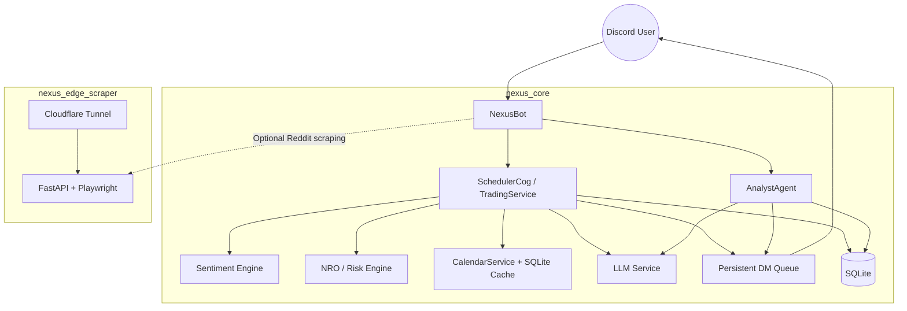

# 🌌 Nexus Seeker

[](https://www.python.org/)
[](nexus_core/docker-compose.yml)
[](LICENSE)

Nexus Seeker 是一個 **Discord 驅動的選擇權風控與交易營運平台**，把 watchlist 監控、期權結構判讀、事件風險防禦、盤中對沖與盤後報告整合進同一套工作流。

它要解決的核心痛點很直接：**把分散的市場監控、風險計算與交易提示，收斂成一套可持續運行、可主動推播、適合實盤節奏的作業系統。**

> **目標族群**
> - 全職或高頻關注市場的選擇權交易者
> - 需要盤中主動風控提醒的多標的投資人
> - 想把 Discord 當成交易營運面板的量化 / 半量化使用者

<!-- Add Demo GIF/Screenshot Here -->



---

## ✨ 核心特點

- **📡 主動式 Watchlist 心跳與動態買賣點演算**：開盤期間每 30 分鐘逐檔推送 watchlist 戰報，**並依據現價、RSI 與期權偏斜（Option Skew）自動演算未持倉標的的適合買入價與股數，以及已持倉標的的適合賣出價與減碼比例**，實現現貨與期權交易計畫的高度對稱，不必手動輪流查圖、查鏈。
- **🧾 可執行期權合約建議與履約價對齊**：不只顯示訊號，還直接給出策略、腿位、strike、expiry、mid、建議口數與最大風險。**特別是期權策略的履約價（Strike）會與計算出的現股適合買入/賣出價位高度對齊**（例如：在適合買入價附近賣出 Cash-Secured Put 承接，或在適合賣出價附近建立 Covered Call 鎖利），實現股期雙向立體化操盤。
- **📥 交易委託單設定面板與動態彈出表單**：提供 `/order_panel` 交易委託單設定面板，使用者在下拉選單選擇訂單類型（市價、限價、停損價、停損限價、追蹤停損 $ 或 %）後，系統將動態彈出對應的輸入表單（Modal），整合輸入驗證與資料庫持久化（DAY、EXT_DAY、NIGHT、GTC_90 等有效期限映射）。
- **📋 待成交委託單管理與交互操作按鈕**：使用 `/orders` 列出當前活躍的待成交委託單，並附帶 `❌ 取消委託` 與 `⚙️ 快速微調價格` 交互按鈕，可直接於 Discord 彈出對應微調 Modal 進行對應的資料庫異動，實現低延遲快速互動。
- **⚡ 盤中每半小時 Telemetry 價格對齊防線**：提供 `/telemetry_alert` 偏離度對齊模擬，或與每半小時心跳（Heartbeat）整合，動態結合「期權籌碼引力面（Max Pain）」、「數學統計邊界面（Expected Move、IV Spike）」、「技術與流動性結構面（心理整數關卡、Gap Fill）」演算出最佳安全對齊價，並附加 `⚡ 一鍵套用遙測建議價` 按鈕，點擊後自動安全調降/調升限價，防守財務大後方。
- **⚙️ 全互動式帳戶全域參數設定面板**：使用 `/settings` 喚起無參數的全互動式帳戶全域參數配置面板（AccountSettingsView）。使用者可以對布林設定（如：VTR 虛擬跟單、PowerSqueeze 戰情追蹤）進行一鍵選單切換，對數值參數（如：總資金、基準風險上限、每月支出預算、稅務預留比例、現金儲備金額）則透過 Discord TextInput Modal 彈出視窗進行直觀輸入。內建精準的數值範圍邊界驗證與自動防錯（如 `tax_reserve_rate > 1` 的百分比自動轉換與 `capital > 0` 驗證），大幅簡化配置流程。
- **🔔 集中式自訂通知與偏好設定中心**：提供 `/notif_settings` 喚起專屬的通知偏好設定中心，支援對 18+ 個自訂通知開關進行 Ephemeral（隱密）的精細控制。分為「定時與掃描背景通知」、「即時風險與事件警報」以及「Polymarket 巨鯨與 AI 監控」三大類獨立下拉選單，並支援 `⚡ 全部開啟` 與 `💤 全部關閉` 的一鍵全域設定；Polymarket 巨鯨監控門檻金額、AI 深度分析開關、滑價判定門檻亦已全數整合至此，與 `/settings` 進行完美的職責分離，使財務參數與推播偏好各歸其位。
- **🧠 LLM 輔助分析與 Skew 解讀**：自動進行 IV 泡沫與多空背離數學交叉驗證，並生成 100% 繁中金融級分析。
- **📊 盤前 IV 情緒與波動率掃描優化**：在非交易時段（盤前/盤後）執行 `/skew_scan` 時，系統會自動切換至盤前優化工作流，利用資料庫前日收盤歷史 IV（或歷史波動率代理）進行計算並附帶 `[盤前/前日收盤]` 標記；若完全無數據則以 `--%` 佔位符優雅顯示，避免回傳誤導性的 `0.0%` 或錯誤。
- **🧬 盤前財報與估值調整深度對接**：盤前財報掃描自動對接 `evaluate_watchlist_symbol` 深度量化評估、期權 PCR 情緒數據與 Finnhub 行業板塊資料庫。首創「緊迫度分級掃描（Triage Scan）」與 Token 上下文修剪，在極致節約 VPS 記憶體與 AI 推論 Token 的同時，完美支援大盤 IV 泡沫與多空背離的數學交叉驗證，提供高精準度的財報板塊傳導與估值對沖策略。
- **🗓️ 事件風險內建防禦**：財報、CPI、FOMC、NFP 會先經過事件快取與風控邏輯，避免在錯誤時機硬開倉。
- **🛡️ 盤中風控與對沖指引**：依 VIX、Vanna、Greeks、與 sectoral ETF 的相對強度 (Relative Strength) 與偏離度，支援 SHIELD / SPEAR 戰術路由，強勢股過度超買時優先轉入期權攻擊（如信用價差或備兌策略）。
- **📦 盤前到盤後的一致工作流**：從盤前財報掃描、盤中執行建議，到盤後風險結算與板塊輪動報告，全都在同一個 bot 裡完成。
- **💾 持久化 DM 佇列**：通知先寫入資料庫再發送，重啟後也能補發，避免 Discord 推播遺失。
- **🧱 低 RAM VPS 友善**：SQLite 快取、bounded cache、記憶體安全閘門讓系統能在 1GB RAM 級別環境穩定運行。

---

## 🚀 快速上手

### 先決條件

啟動 `nexus_core` 前，請先準備：

- **Docker** 與 **Docker Compose**
- **Python 3.12**（若你要直接在容器外執行程式）
- **Discord Bot Token**
- **Discord Admin User ID**
- **Finnhub API Key**
- **OpenAI-compatible LLM endpoint**
  - `LLM_API_BASE`
  - `LLM_MODEL_NAME`
  - `API_KEY`
- **可選**：Cloudflare Tunnel Token（若要啟動 `nexus_edge_scraper`）

### 安裝步驟

#### 1. 啟動核心 Bot

```bash
git clone https://github.com/cosmo-chang-1701/nexus-seeker.git
cd nexus-seeker/nexus_core
cp .env.example .env
docker compose up -d --build
```

核心 Bot 使用：

- `discord.py`
- SQLite
- `docker-compose.yml`
- `.env` 環境變數

#### 2. 啟動可選的 Edge Scraper

如果你要使用本地 / 邊緣 Reddit scraping：

```bash
cd ../nexus_edge_scraper
cp .env.example .env
docker compose up -d --build
```

這個服務使用：

- `FastAPI`
- `Playwright`
- `BeautifulSoup`
- optional `cloudflared` sidecar

### 最簡可行範例

下面這段是最小可啟動的核心 Bot 範例流程。填好 token 與 API 金鑰後可直接執行：

```bash
cd nexus-seeker/nexus_core

cat > .env <<'EOF'
DISCORD_TOKEN=your_discord_bot_token_here
DISCORD_ADMIN_USER_ID=123456789012345678
LLM_API_BASE=https://your-llm-endpoint.example.com/v1
LLM_MODEL_NAME=your-model-name
API_KEY=your_api_key_here
TUNNEL_URL=https://your-edge-api.example.com
FINNHUB_API_KEY=your_finnhub_api_key_here
LOG_LEVEL=WARNING
EOF

docker compose up -d --build
```

啟動後：

1. Bot 會載入核心 cogs 與背景排程
2. 建立 / 初始化 SQLite 資料庫
3. 啟動 DM queue、記憶體管理、對沖監控與 Polymarket 服務
4. 你可以在 Discord 內使用 `/settings`、`/x`、`/dash`、`/market`

> **提示**
> 若只想先驗證 bot 能啟動，`nexus_edge_scraper` 可以稍後再接；它不是核心 bot 的必要條件。

---

## 🛠️ 開發與貢獻

### 本地開發

核心程式位於 `nexus_core/`，主要組成如下：

- `bot.py`：Bot 啟動、DM queue、服務生命週期
- `cogs/`：Discord commands 與背景 scheduler
- `market_analysis/`：量化分析、watchlist 心跳、風控引擎
- `services/`：資料、LLM、calendar、trading orchestration
- `database/`：SQLite schema、migration、cache helpers

### 執行測試

目前專案的測試是以 **Docker 內 pytest** 為準：

```bash
cd nexus_core
docker compose run --rm nexus-seeker python -m pytest tests
```

若只想跑局部：

```bash
cd nexus_core
docker compose run --rm nexus-seeker python -m pytest tests/unit/test_intraday_pipeline.py
docker compose run --rm nexus-seeker python -m pytest tests/unit/test_embed_builder.py
docker compose run --rm nexus-seeker python -m pytest tests/unit/test_output_centralization.py
docker compose run --rm nexus-seeker python -m pytest tests/unit/test_order_ui.py
```

### 貢獻流程

1. Fork 這個 repository
2. 建立你的功能分支
3. 完成修改並確認測試通過
4. 推送到你的 fork
5. 建立 Pull Request，說明：
   - 改了什麼
   - 為什麼要改
   - 影響哪些使用者流程或推播內容

建議 branch naming：

```bash
git checkout -b feat/your-change-name
```

或：

```bash
git checkout -b fix/your-bug-name
```

---

## 📄 授權條款

本專案採用 [MIT License](LICENSE)。
