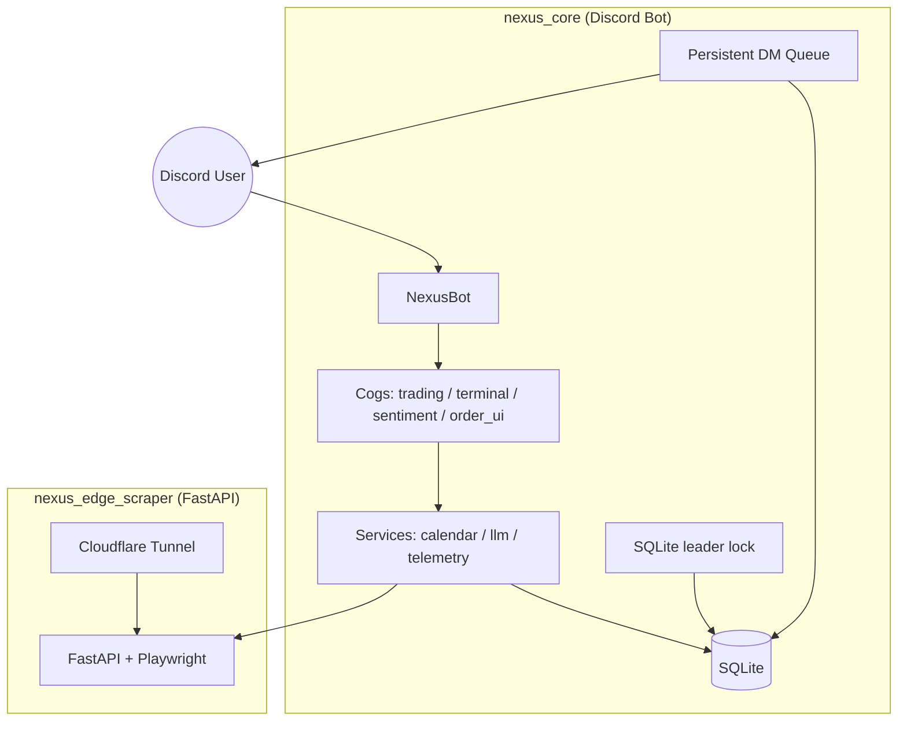

# 🌌 Nexus Seeker

[](https://www.python.org/)
[](nexus_core/docker-compose.yml)
[](LICENSE)

Nexus Seeker 是一個 **Discord-first 的多租戶選擇權風控與交易營運平台**。本平台深度結合了技術指標分析、Black-Scholes-Merton 期權定價、希臘字母（Greeks）投資組合風險管理、事件日曆防禦及大型語言模型（LLM）輔助分析，旨在低內存 VPS 部署環境下，為實盤交易者提供最即時、可持續、自動化的高勝率風控操作指南。

> 核心版本（nexus_core）：**v1.12.17** (請參考最新 Release)


---

## ✨ 核心特色 (Key Features)

- **自動化戰場心跳 (Watchlist Heartbeat)**：盤中每半小時主動推送自選標的之技術與期權快照，預設完整整合 UOA 巨鯨異動大單、暗池 (Dark Pool) 磁吸點位（已整合 5% 髒數據過濾）、100% 確定性量化 Skew 解析與動態買賣定價指引。
- **4 大戰術維度通知中樞與快捷情境 (Tactical Notifications & 1-Click Presets)**：`/notif_settings` 全面收斂為 4 大戰術維度（定時戰報、盤中遙測、持倉防禦、Alpha 策略）與 10 大核心通知頻道，並提供「🛡️ 戰備全開」、「🎯 精準交易」、「🔕 盤中靜音」三大 1-Click Preset 情境模式，徹底告別零碎雜訊。
- **盤後綜合風險與 AI 策略報告 (Post-Market Intelligence)**：每日收盤後主動推送盤後結算報告，全面支援**現貨持倉 (`HOLDING`) 與期權 (`TRADE`) 混合結算**。搭載 Target Center 2.0 樹狀 ANSI 儀表板、財務生存跑道 (Financial Runway)、對沖績效 Brinson 歸因 (OPTIMAL 狀態標註)、板塊焦點矩陣 (Top Inflows vs Outflows) 與 100% 現金空狀態行動引導。
- **戰場情境轉折警報與進階雷達 (Market Scenario & Advanced Radar)**：整合獨立事件驅動引擎（6 階 GEX 決策矩陣，新增「巨鯨護航共振」）與進階雷達過濾器 (UOA Barrier, Gravity Filter, Divergence Gate)。全新量化雷達支援 `G/P-Wall(±)`（完整展示頂部 Call Wall 與底牆 Put Wall，支援現價跌破負 Gamma 動態極性連動與 N/A 容錯退路）、`IV 策略` 負 Gamma 踩踏區風控熔斷（強制阻斷賣方開倉並標記 `🔴賣方禁售`）、標的偏離度 `⚠️` 強視覺連動、`Skw%`（真實期權偏斜數值與歷史分位點）、`SQZ向量`（動能數值、方向與擠壓計時器，連動 UOA Barrier 硬封頂降級）、`Neg-GEX`、`STO 鎖死`（Short-to-Open 關鍵履約價鎖死）、`EM Z-Score`、`Top UOA` 單一最強巨鯨異動大單、暗池 $\ge \$5\text{M}$ 大宗水泥牆買盤警示，並具備 **$PutWall - 1.5 \times ATR_{14}$ 防洗盤絕對防守位**、15 分鐘實體 K 線收盤離場鐵律與多維度灰階戰術決策樹（多重正 Gamma 護航網支撐現貨續抱），精準防範二元停損與盲目接刀。
- **動態轉倉與防洗盤風控 (Dynamic Rollover & Anti-Washout Defense)**：搭載全新「防洗盤動態停損引擎」與「GEX 做市商意圖映射引擎」，動態鎖定支撐錨定牆並給予 1.5x 15m ATR 緩衝；現貨 (SPOT) 必須經 15 分鐘實體 K 線跌破才確認清倉（高 IVR 啟動收盤價防守），選擇權合約 (OPTIONS) 則於高 IVR 啟動降槓桿平倉。支援透過 `/verify_thesis` 手動觸發，並新增**互動式 SEC 財報選擇介面**，讓使用者自由選擇近期 (10-K, 10-Q, 8-K) 進行分析。Edge Scraper 現具備 **SEC 財報結構化區塊擷取** 能力，若基本面破滅，將無條件攔截量化買入訊號，強制執行清算與轉倉。
- **Polymarket 巨鯨意圖圖譜與美股預測搜尋 (Polymarket Intelligence 2.0)**：搭載全域抽象之 `StockAliasMatrix` 與 4 層自動補齊架構（靜態庫 ➔ 記憶體快取 ➔ SQLite 持久化 ➔ Finnhub/yfinance 動態推導），徹底解決冷門標的別名維護負擔。精準重構黑白名單過濾閘門，消除正牌美股誤殺，並整合 Gamma API 即時在線搜尋。支援 `/poly_list [query]` 代碼即時檢索、成交量標籤與 `/x` 量化雷達雙向別名撮合。多頁結果採用 `PolymarketPaginatedView`（◀ 頁碼 ▶）單訊息就地翻頁，取代舊有多訊息洗版模式。
- **Reddit 散戶輿情與社群優勢 (Reddit Sentiment Boolean Search)**：全面升級為精確 Boolean OR 搜尋字串（如 `("NVDA" OR "$NVDA" OR "NVIDIA")`），精準鎖定標的品牌與代碼討論串，徹底杜絕單字切分產生的語意雜訊。
- **總體經濟與事件日曆防護**：自動抓取 CME FedWatch 利率機率、FRED 關鍵總經數據與財報日曆（已擴展至 14 日前瞻預警並深度整併至 `/market` 總經風險情報中心與盤前報告），結合避險邏輯進行動態逃頂窗口前置與 4 小時自動快取維護。
- **大盤微觀結構解析**：計算零 Gamma 線 (Gamma Flip Line) 與 GEX 分佈，在市場進入高壓 $VIX > 20$ 時動態縮小合約建倉口數（Kelly Criterion 調節）與拉大網格距離。
- **互動式 UI 介面**：所有交易參數（資本、風險上限、虛擬交易室、Polymarket 巨鯨門檻等）與推送偏好均透過 Discord 內建的 Buttons / Select Menu / Modal 進行管理。


> 💡 **進階量化策略與運作邏輯**：關於 TDP 估值三擊、暗池防禦共振、動態均價 Covered Call 解鎖等深度架構細節，請參閱專案內的 [`AGENTS.md`](AGENTS.md) 說明文件。

---

## 🏗️ 系統架構 (Architecture)

本專案採用雙服務（Microservices）架構，透過 API 與資料庫非同步通信：

- **`nexus_core/`**：主 Discord Bot。管理所有的 slash commands、背景排程、量化策略引擎、主動推播佇列與 SQLite 資料庫。
- **`nexus_edge_scraper/`**：邊緣爬蟲服務 (FastAPI + Playwright)。負責隔離高耗能的網頁渲染與容易遭受防火牆封鎖的作業（如 Reddit RSS 輿情監控、SEC 財報抽取），並提供**優雅降級方案 (Graceful Degradation)**（當核心端 `yfinance` 遭遇機房 IP 封鎖時，自動將歷史 K 線與期權鏈抓取任務轉交給 Edge 端突破防護），最後透過 Cloudflare Tunnel 安全地暴露給 Core 調用。


```mermaid
graph TD
    User((Discord User))

    subgraph Core["nexus_core (Discord Bot)"]
        Bot["NexusBot"]
        Cogs["Cogs: trading / terminal / sentiment / order_ui"]
        Services["Services: calendar / llm / telemetry"]
        Queue["Persistent DM Queue"]
        Leader["SQLite leader lock"]
        DB[(SQLite)]
    end

    subgraph Edge["nexus_edge_scraper (FastAPI)"]
        EdgeAPI["FastAPI + Playwright"]
        Tunnel["Cloudflare Tunnel"]
    end

    User --> Bot
    Bot --> Cogs
    Cogs --> Services
    Services --> DB
    Queue --> DB
    Leader --> DB
    Queue --> User

    Services --> EdgeAPI
    Tunnel --> EdgeAPI
```

---

## 📂 專案結構 (Project Structure)

```text
nexus-seeker/
├── nexus_core/              # 核心 Discord Bot 服務
│   ├── bot.py               # Bot 進入點與健康監控
│   ├── cogs/                # Discord 交互指令、背景排程與 UI 元件
│   ├── market_analysis/     # 核心量化引擎 (Scan Pipeline, Gamma Squeeze)
│   ├── services/            # 外部 API 封裝 (Calendar, LLM 等)
│   ├── database/            # SQLite Schema 與 Migrations
│   ├── risk_engine/         # SDDM 戰術路由與風險控制 (NRO)
│   ├── formatters/          # Embed 格式化與輸出模組
│   ├── ui/                  # ANSI 字符格式化與表格渲染
│   └── tests/               # 單元與整合測試
├── nexus_edge_scraper/      # 邊緣爬蟲服務 (Playwright)
│   ├── local_api.py         # FastAPI 應用程式路由
│   ├── section_extractor.py # SEC 財報結構化區塊擷取邏輯
│   └── tests/               # 爬蟲端測試
├── scripts/                 # 輔助腳本與部署工具
├── docs/                    # 附加文件
└── README.md                # 專案主說明檔
```

---

## 🚀 快速上手 (Getting Started)

專案支援 Docker 容器化部署，預設資料庫將存在 Named Volume 中以確保資料不遺失。

### 1. 必備條件
- Docker 與 Docker Compose
- Discord Bot Token
- Finnhub API Key
- Cloudflare Tunnel Token (用於邊緣爬蟲)

### 2. 啟動 `nexus_edge_scraper` (邊緣爬蟲服務)
```bash
git clone https://github.com/cosmo-chang-1701/nexus-seeker.git
cd nexus-seeker/nexus_edge_scraper

# 設定環境變數
cp .env.example .env
# 編輯 .env 設定您的 CF_TUNNEL_TOKEN

# 啟動容器
docker compose up -d --build
```

### 3. 啟動 `nexus_core` (主機器人服務)
取得 `nexus_edge_scraper` 在公網上的 HTTPS URL 後，填入 Core 的 `.env` 中。
```bash
cd ../nexus_core

# 設定環境變數
cp .env.example .env
# 編輯 .env 填入 DISCORD_TOKEN, FINNHUB_API_KEY, 以及 TUNNEL_URL

# 啟動容器
docker compose up -d --build
```

---

## ⚙️ 環境變數設定

### `nexus_core/.env`
| 變數名稱 | 必填 | 說明 |
|---|---|---|
| `DISCORD_TOKEN` | ✅ | Discord 機器人 Token |
| `DISCORD_ADMIN_USER_ID` | ✅ | 系統管理員的 Discord 帳號 ID（允許使用 admin 指令） |
| `FINNHUB_API_KEY` | 建議 | Finnhub 數據源 API Key |
| `TUNNEL_URL` | ✅ | Edge Scraper 的公開 API URL |
| `LLM_API_BASE` | 選用 | OpenAI 相容的 LLM API 網址 |
| `LLM_MODEL_NAME` | 選用 | LLM 模型名稱 |
| `API_KEY` | 選用 | LLM 驗證金鑰 |
| `LOG_LEVEL` | 選用 | 預設為 `WARNING` (`DEBUG`, `INFO`, `WARNING`, `ERROR`) |

### `nexus_edge_scraper/.env`
| 變數名稱 | 必填 | 說明 |
|---|---|---|
| `CF_TUNNEL_TOKEN` | ✅ | Cloudflare Tunnel token（用以將 API 安全暴露於公網） |

---

## 🔌 常用指令與操作 (Usage)

透過 Discord 頻道輸入斜線指令即可與機器人互動：

- **`/settings`**：帳戶全域參數配置中心（資本、風險上限設定、虛擬交易室、Polymarket 巨鯨門檻與 AI 分析開關等）。
- **`/notif_settings`**：戰術型通知管理中控台，支援以 4 大戰術維度（定時戰報、盤中遙測、持倉防禦、Alpha 策略）自訂 10 項核心通知頻道，並提供 3 大 1-Click Preset 模式（🛡️ 戰備全開、🎯 精準交易、🔕 盤中靜音）。
- **`/x`**：批次量化雷達掃描，支援統一雷達面板進行多層次過濾 (現已升級為高 Alpha 精簡 Markdown 報表，直擊 G/P-Wall(±) 動態極性與 N/A 容錯、IV 策略負 Gamma 熔斷、⚠️ 異常標的視覺連動、Skw%、SQZ向量、Neg-GEX、STO 鎖死、EM Z-Score 與 Top UOA)。
- **`/dash`**：交易員主控板，檢視持倉、備用流動性與極限跑道天數。
- **`/stress_test`**：委託單壓力測試與現金赤字警報。
- **`/list_orders` / `/order_panel`**：檢視活躍委託單與新增委託單。
- **`/cc_recovery`**：根據現有持倉自動過濾與顯示最佳的 OTM Covered Call 合約 (收租解套策略)。
- **`/calendar`**：總經與自選股財報事件時間軸日曆，支援 TTE 倒數與發布日程查詢。
- **`/market`**：全局宏觀風控情報中心，深度整合 SPX、VIX、US10Y、零 Gamma 翻轉線、FedWatch 利率定價、RRP 逆回購、Fed 資產負債表與利率逃頂窗口防禦。
- **`/sys_health`**：`(Hidden)` 系統健康診斷面板，檢視主節點與邊緣節點的即時硬體資源 (RAM, CPU, RSS, Swap) 與快取狀態。
- **`/force_macro_update`**：`(Admin 專用)` 強制更新大盤 GEX 與 FedWatch 數據快取。

> 在主機本機端也提供 `cli.py` 開發者工具，供管理員手動觸發爬蟲或強制執行掃描任務。

---

## 🛠️ 開發與測試 (Development & Testing)

本專案啟用 Mypy 嚴格模式，所有提交皆應維持型別安全與通過單元測試。請務必在 Docker 環境中執行以確保依賴一致。

**執行型別檢查 (Mypy)**：
```bash
cd nexus_core
docker compose run --rm nexus-seeker python -m mypy --config-file pyproject.toml .
```

**執行單元與整合測試 (Pytest)**：
```bash
# 執行所有測試
docker compose run --rm nexus-seeker python -m pytest tests

# 執行特定功能測試
docker compose run --rm nexus-seeker python -m pytest tests/unit/test_intraday_pipeline.py
```

---

## 📄 授權條款 (License)

本專案採用 [MIT License](LICENSE) 授權。
