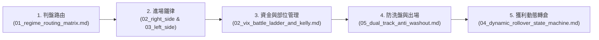
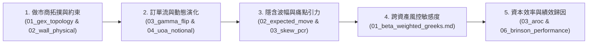
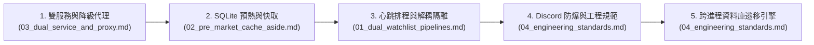

# 🌌 Nexus Seeker 量化架構與交易策略技術全景導讀

> **版本**：v1.13.22 ｜ **系統核心**：Production Quant Engine ｜ **語言**：100% 繁體中文規範
> **單一真實來源 (SSOT)**：本全景導讀與 29 篇專業技術規格書為 Nexus Seeker 核心量化模型、做市商微觀結構、期權定價、投資組合風控與事件防衛體系之最高權威技術規格定義。

---

## 1. 架構願景與核心定位

Nexus Seeker 是一套專為低延遲、高資訊密度美股期權風險控制與量化交易運作打造的生產級非同步架構。系統以做市商庫存對沖微觀結構為基石，深度融合 Black-Scholes-Merton 定價模型、高階希臘字母敏感度推導、事件驅動日曆防衛以及大語言模型（LLM）結構化推論輔助。

本技術文檔庫（Documentation Suite）嚴格遵循模組化量化架構設計，劃分為 **6 大專業子系統**，共計 **29 篇深度技術規格書**。每一篇規格書均包含嚴謹的數學模型公式推導、Mermaid 決策狀態機流程圖、具名常數與物理邊界約束表、風控熔斷處理機制，並精確對應至專案生產環境原始碼路徑。

---

## 2. 系統即時互動全景架構圖

Nexus Seeker 內部 6 大量化子系統並非孤立運作，而是在毫秒至分鐘級的排程與事件驅動下，形成緊密耦合的閉環反饋網路：

```mermaid
flowchart TB
    subgraph External_Feeds["外部數據輸入層 (Market Data & External Feeds)"]
        FD_OP["期權鏈與即時報價<br/>(CBOE / yfinance / Polygon)"]
        FD_MC["宏觀與利率期貨<br/>(CME 30-Day Fed Funds ZQ)"]
        FD_COMM["大宗商品期貨<br/>(NYMEX WTI 原油 CL)"]
        FD_POLY["去中心化預測市場<br/>(Polymarket Orderbook)"]
        FD_SEC["監管與基本面申報<br/>(SEC EDGAR 10-K/10-Q/8-K)"]
    end

    subgraph Architecture_Layer["6. 系統運行管線與工程規範 (architecture/)"]
        direction TB
        A03["雙服務架構與三階式降級代理<br/>(03_dual_service_and_proxy.md)"]
        A02["盤前 08:45 預熱與 SQLite Cache-Aside<br/>(02_pre_market_cache_aside.md)"]
        A01["雙自選標的心跳管線架構與排程隔離<br/>(01_dual_watchlist_pipelines.md)"]
        A04["量化系統工程規範與 Discord 防爆分頁<br/>(04_engineering_standards.md)"]
    end

    subgraph Macro_Sentiment_Layer["5. 總體經濟與輿情預測 (macro_sentiment/)"]
        direction TB
        M01["宏觀逃頂推演矩陣與流動性退潮<br/>(01_macro_escape_top_matrix.md)"]
        M02["SEC 財報護城河自動掃描與排除條款<br/>(02_sec_filing_moat_scanner.md)"]
        M03["WTI 原油期貨 24/7 監控與板塊衝擊<br/>(03_wti_crude_oil_monitor.md)"]
        M04["Polymarket VWBP 加權與雙頁籤輿情雷達<br/>(04_polymarket_vwbp_sentiment_radar.md)"]
    end

    subgraph Valuation_Pricing_Layer["3. 定價模型與波動率策略 (valuation_pricing/)"]
        direction TB
        V01["TDP 估值三擊與 DDP 雙重折價定價模型<br/>(01_tdp_valuation_model.md)"]
        V02["預期波幅 (EM) 與多 DTE 最大痛點重力<br/>(02_expected_move_and_max_pain.md)"]
        V03["Skew 偏斜與 Volume PCR 瀑布流背離<br/>(03_skew_pcr_divergence_confluence.md)"]
        V04["IVR 波動率位階與做市商賣方禁售閘門<br/>(04_ivr_regime_and_seller_lockout.md)"]
    end

    subgraph Microstructure_Layer["2. 做市商微觀結構與訂單流 (microstructure/)"]
        direction TB
        U01["做市商 Net GEX 拓撲與三階牆體體系<br/>(01_gex_topology_and_walls.md)"]
        U02["做市商底牆現價物理約束定理 (K < Spot)<br/>(02_wall_physical_constraints.md)"]
        U03["個股與大盤 Gamma Flip 翻轉線估算<br/>(03_gamma_flip_estimation.md)"]
        U04["異常期權活動 (UOA) 權利金排序與進度正規化<br/>(04_uoa_notional_and_paced_ratio.md)"]
        U05["成交量分佈 (VP) 與暗池 DP-POC 磁吸模型<br/>(05_volume_profile_and_dp_poc.md)"]
        U06["Gamma Squeeze 引擎與 SPEAR 進攻訊號<br/>(06_gamma_squeeze_engine_and_spear.md)"]
    end

    subgraph Strategies_Layer["1. 交易策略與進出場體系 (strategies/)"]
        direction TB
        S01["4-Regime 市場環境動態路由矩陣<br/>(01_regime_routing_matrix.md)"]
        S02["右側動能突破進場六重鐵律<br/>(02_right_side_momentum_ironclad.md)"]
        S03["左側均值回歸接刀六重鐵律<br/>(03_left_side_mean_reversion_ironclad.md)"]
        S04["動態轉倉 8 大情境狀態機<br/>(04_dynamic_rollover_state_machine.md)"]
        S05["雙軌防洗盤動態停損與出場決策矩陣<br/>(05_dual_track_anti_washout_stop_loss.md)"]
    end

    subgraph Risk_Portfolio_Layer["4. 投資組合風控與數學模型 (risk_portfolio/)"]
        direction TB
        R01["Beta 加權 Delta 與二階 Gamma 曝險推導<br/>(01_beta_weighted_greeks.md)"]
        R02["VIX 戰情階梯 6 階矩陣與動態分數凱利公式<br/>(02_vix_battle_ladder_and_kelly.md)"]
        R03["年化資本回報率 (AROC) 效率與硬鎖閘門<br/>(03_aroc_capital_efficiency.md)"]
        R04["DITM 深價內凸性防護與獲利鎖定階梯<br/>(04_ditm_convexity_profit_lock.md)"]
        R05["財務生存跑道分析與 Theta 現金流防禦<br/>(05_financial_runway_and_liquidity.md)"]
        R06["對沖績效 Brinson 歸因與動態 Tau 自我進化<br/>(06_brinson_performance_attribution.md)"]
    end

    %% 連線拓撲 (跨系統資料流)
    External_Feeds --> A03
    A03 --> A02 --> A01

    A01 --> Macro_Sentiment_Layer
    A01 --> Microstructure_Layer
    A01 --> Valuation_Pricing_Layer

    Macro_Sentiment_Layer -.->|"逃頂分數 / 原油衝擊 / 財報靜默"| S01
    Valuation_Pricing_Layer -->|"TDP 折價 / 痛點重力 / IVR 策略閘門"| S01
    Microstructure_Layer -->|"Net GEX / 實體牆約束 / UOA 大單"| S01

    S01 --> S02
    S01 --> S03
    S02 --> S04
    S03 --> S04
    S04 --> S05

    S05 --> Risk_Portfolio_Layer
    Risk_Portfolio_Layer -->|"凱利倉位縮放 / AROC 硬鎖 / 凸性平倉"| S01
    Risk_Portfolio_Layer -->|"Brinson 歸因 / Tau 閉環回饋"| A01
    Strategies_Layer --> A04
```



---

## 3. 六大專業技術領域全景索引

### 3.1 交易策略與進出場體系 (`docs/strategies/`)

本模組定義 Nexus Seeker 的核心戰術執行層，將市場微觀結構與估值特徵轉換為確定性的進出場決策狀態機。

| 序號 | 技術規格書檔案 | 核心主題與量化突破 | 關鍵量化門檻與約束 | 核心對應程式碼 |
|:---|:---|:---|:---|:---|
| 01 | [`01_regime_routing_matrix.md`](strategies/01_regime_routing_matrix.md) | 4-Regime 市場環境動態路由矩陣 | `VTS >= 1.10`, `Call Wall 空間 < 5%`, `RegimeMarketData` 快照複用 | `market_analysis/intraday_pipeline/pipeline.py` |
| 02 | [`02_right_side_momentum_ironclad.md`](strategies/02_right_side_momentum_ironclad.md) | 右側動能突破進場六重鐵律 | 15m 實體陽線放量 1.5x, 站穩 VWAP, 底牆 $K < \text{Spot}$, 主力買盤 DTE $\ge 7$ | `market_analysis/dynamic_rollover/opportunity_cost.py` |
| 03 | [`03_left_side_mean_reversion_ironclad.md`](strategies/03_left_side_mean_reversion_ironclad.md) | 左側均值回歸接刀六重鐵律 | 負乖離 $\le -1.5\text{ATR}$, RSI $\le 30$, Put Wall 密著帶 $[-1.0\%, +1.5\%]$, 回歸空間 $\ge 3.5\%$ | `market_analysis/dynamic_rollover/mean_reversion_entry.py` |
| 04 | [`04_dynamic_rollover_state_machine.md`](strategies/04_dynamic_rollover_state_machine.md) | 動態轉倉 8 大情境全景狀態機 | 涵蓋 Core/Satellite/Margin/Macro/DTE $\le 1$ 等 8 大轉倉情境, Delta $\ge 0.85$ 硬鎖 | `market_analysis/dynamic_rollover/` |
| 05 | [`05_dual_track_anti_washout_stop_loss.md`](strategies/05_dual_track_anti_washout_stop_loss.md) | 雙軌防洗盤動態停損與出場決策矩陣 | 軌道一 $0.5\times\text{ATR}$ 實體 K 收盤撤退線, 軌道二 $3.0\times\text{ATR}$ 瞬時硬熔斷 | `market_analysis/dynamic_rollover/constants.py` |

---

### 3.2 做市商微觀結構與訂單流 (`docs/microstructure/`)

本模組揭示選擇權做市商（Market Maker）在 Delta 對沖過程中的機械化部位暴露，捕捉市場 Gamma 拓撲結構與主力異常金流。

| 序號 | 技術規格書檔案 | 核心主題與量化突破 | 關鍵量化門檻與約束 | 核心對應程式碼 |
|:---|:---|:---|:---|:---|
| 06 | [`01_gex_topology_and_walls.md`](microstructure/01_gex_topology_and_walls.md) | 做市商 Net GEX 拓撲與三階牆體體系 | Long Gamma 自穩定 vs Short Gamma 助漲助跌, 深度單薄紙牆 $< 500\text{k}$ | `market_analysis/structural_signals.py` |
| 07 | [`02_wall_physical_constraints.md`](microstructure/02_wall_physical_constraints.md) | 做市商底牆現價物理約束定理 | 支撐底牆強制限制於現價下方 ($K < \text{Spot}$), 帶符號 Call Wall 空間判定 | `market_analysis/structural_signals.py` |
| 08 | [`03_gamma_flip_estimation.md`](microstructure/03_gamma_flip_estimation.md) | 個股與大盤 Gamma Flip 翻轉線估算模型 | 六步零交叉點演算法, $\pm 30\%$ Bracket 雜訊過濾, Regime 方向一致性校驗 | `market_analysis/index_microstructure.py` |
| 09 | [`04_uoa_notional_and_paced_ratio.md`](microstructure/04_uoa_notional_and_paced_ratio.md) | 異常期權活動 (UOA) 權利金排序與時段正規化 | 名目價值排序 (`trade_price * vol * 100`), 時段進度正規化 `paced_ratio`, SWEEP/BLOCK/CROSS | `market_analysis/uoa_detector.py` |
| 10 | [`05_volume_profile_and_dp_poc.md`](microstructure/05_volume_profile_and_dp_poc.md) | 成交量分佈 (VP) 與暗池 DP-POC 磁吸模型 | 20 日 50-Bin 等寬分箱演算法, HVN/LVN 識別, 1% 共振磁吸底牆 | `market_analysis/volume_profile_utils.py` |
| 11 | [`06_gamma_squeeze_engine_and_spear.md`](microstructure/06_gamma_squeeze_engine_and_spear.md) | Gamma Squeeze 引擎與 SPEAR 進攻訊號體系 | 四階段硬性戰術門檻 (流動性/財報/OTM 權利金/IVR), SDDM 狀態機, Vanna 隱含對沖 | `market_analysis/gamma_squeeze_engine.py` |

---

### 3.3 定價模型與波動率策略 (`docs/valuation_pricing/`)

本模組涵蓋基本面折價定價模型、期權隱含波幅預期、期限結構偏斜與做市商負 Gamma 賣方禁售防禦。

| 序號 | 技術規格書檔案 | 核心主題與量化突破 | 關鍵量化門檻與約束 | 核心對應程式碼 |
|:---|:---|:---|:---|:---|
| 12 | [`01_tdp_valuation_model.md`](valuation_pricing/01_tdp_valuation_model.md) | TDP 估值三擊與 DDP 雙重折價定價模型 | DDP 戴維斯雙擊 $P = \text{EPS} \times (P/E)$, EPS YoY $\ge 15\%$, TDP 四重折價共振 | `market_analysis/ddp_inspector.py` |
| 13 | [`02_expected_move_and_max_pain.md`](valuation_pricing/02_expected_move_and_max_pain.md) | 預期波幅 (EM) 與多 DTE 最大痛點重力過濾體系 | ATM Straddle 0.85 經驗因子, $\max(7.0, \text{DTE})$ 分母約束, 痛點最小化損失函數 | `market_analysis/sentiment/iv_metrics.py` |
| 14 | [`03_skew_pcr_divergence_confluence.md`](valuation_pricing/03_skew_pcr_divergence_confluence.md) | Skew 偏斜與 Volume PCR 瀑布流背離及三重結構性風險合流閘門 | Skew 252 交易日百分位數, Volume PCR $\ge 1.2$ 破位順向殺盤, 三重結構風險合流 | `market_analysis/insights_engine.py` |
| 15 | [`04_ivr_regime_and_seller_lockout.md`](valuation_pricing/04_ivr_regime_and_seller_lockout.md) | IVR 波動率位階、做市商負 Gamma 賣方禁售與期權策略匹配閘門 | 252 日 IVR 四階矩陣, 期限結構倒掛 $\text{Term Ratio} > 1.05$, 做市商負 Gamma 賣方一票否決 | `market_analysis/ivr_strategy_gate.py` |

---

### 3.4 投資組合風控與數學模型 (`docs/risk_portfolio/`)

本模組建構多標的、跨到期日之投資組合整體曝險度量，以數學推導保證資金生存與動態成長。

| 序號 | 技術規格書檔案 | 核心主題與量化突破 | 關鍵量化門檻與約束 | 核心對應程式碼 |
|:---|:---|:---|:---|:---|
| 16 | [`01_beta_weighted_greeks.md`](risk_portfolio/01_beta_weighted_greeks.md) | Beta 加權 Delta 與投資組合二階 Gamma 曝險數學模型 | SPY 基準 60 日對數協方差 Beta, 二階連鎖律 $\Gamma_{\text{SPY}, i} = \Gamma_i \cdot (w_i)^2$ 推導證明 | `market_analysis/portfolio.py` |
| 17 | [`02_vix_battle_ladder_and_kelly.md`](risk_portfolio/02_vix_battle_ladder_and_kelly.md) | VIX 戰情階梯 6 階矩陣與動態分數凱利資金配置公式 | 6 階 VIX 戰情梯次, 純凱利期望增長率微分推導, 分數凱利縮放與動態線性插值 | `market_analysis/risk_engine.py` |
| 18 | [`03_aroc_capital_efficiency.md`](risk_portfolio/03_aroc_capital_efficiency.md) | 年化資本回報率 (AROC) 資本效率衡量與進場硬鎖閘門 | 監管保證金模型, STO AROC 15.0% 進場硬鎖, BTO AROC 30.0% 進場硬鎖 | `market_analysis/strategy/liquidity_risk.py` |
| 19 | [`04_ditm_convexity_profit_lock.md`](risk_portfolio/04_ditm_convexity_profit_lock.md) | DITM 深價內凸性防護與獲利鎖定決策階梯 | 伊藤引理證明極限深價內 $\lim \Gamma = 0$ 凸性衰竭, DTE 7 天與 21 天轉倉/平倉狀態機 | `market_analysis/risk_engine.py` |
| 20 | [`05_financial_runway_and_liquidity.md`](risk_portfolio/05_financial_runway_and_liquidity.md) | 財務生存跑道分析與 Theta 現金流防禦緩衝模型 | 淨月度現金消耗率, 核心生存跑道公式, $\text{Burn} \le 0$ 輸出 9999.0 天鐵血不破 | `market_analysis/pro_management.py` |
| 21 | [`06_brinson_performance_attribution.md`](risk_portfolio/06_brinson_performance_attribution.md) | 對沖績效 Brinson 歸因分析與動態 Tau 自我進化閉環 | Alpha vs Hedge 正交分解, 對沖有效性公式, 7 日線性加權動態 Tau 自我調適閉環 | `market_analysis/hedging.py` |

---

### 3.5 總體經濟、事件日曆與輿情預測 (`docs/macro_sentiment/`)

本模組跨越傳統純技術分析視角，整合利率期貨隱含降息機率、SEC 監管申報、商品期貨與預測市場訊號。

| 序號 | 技術規格書檔案 | 核心主題與量化突破 | 關鍵量化門檻與約束 | 核心對應程式碼 |
|:---|:---|:---|:---|:---|
| 22 | [`01_macro_escape_top_matrix.md`](macro_sentiment/01_macro_escape_top_matrix.md) | 宏觀逃頂推演矩陣與流動性退潮防禦 | CME ZQ 30 天期聯邦基金期貨反推, 利率倒掛壓縮模型, 情境 6 逃頂 25% BOXX 輪動 | `nexus_edge_scraper/local_api/macro.py` |
| 23 | [`02_sec_filing_moat_scanner.md`](macro_sentiment/02_sec_filing_moat_scanner.md) | SEC 財報護城河自動掃描器與嚴格排除條款 | 每日 08:00 ET 持倉掃描, RAM > 85% 防護, 5 大主題關鍵字錨點, 14 天事件靜默期 | `cogs/trading/fundamental_filing_monitor.py` |
| 24 | [`03_wti_crude_oil_monitor.md`](macro_sentiment/03_wti_crude_oil_monitor.md) | WTI 原油期貨 24/7 監控與板塊衝擊矩陣 | 24/7 半小時 48 時點對齊, 00:00–06:00 ET 靜默保護, 階梯油價風險權重 $w_{\text{oil}}$ | `cogs/trading/wti_monitor.py` |
| 25 | [`04_polymarket_vwbp_sentiment_radar.md`](macro_sentiment/04_polymarket_vwbp_sentiment_radar.md) | Polymarket VWBP 加權勝率與雙頁籤輿情共振雷達 | 13 組看跌語義反轉, 保底名義流動性加權 VWBP, 雙頁籤就地切換與四維共振雷達 | `cogs/unified_terminal/utils.py` |

---

### 3.6 系統運行管線與工程規範 (`docs/architecture/`)

本模組定義 Nexus Seeker 分散式非同步架構、低記憶體快取策略、降級代理機制與 Discord API 防爆規範。

| 序號 | 技術規格書檔案 | 核心主題與量化突破 | 關鍵量化門檻與約束 | 核心對應程式碼 |
|:---|:---|:---|:---|:---|
| 26 | [`01_dual_watchlist_pipelines.md`](architecture/01_dual_watchlist_pipelines.md) | 雙自選標的心跳管線架構與排程隔離 | 15m 批次雷達心跳 (3-Pass 複雜度優化) 與 30m 深度分析心跳完全解耦 | `cogs/trading/heartbeat.py` |
| 27 | [`02_pre_market_cache_aside.md`](architecture/02_pre_market_cache_aside.md) | 盤前 08:45 預熱與 SQLite Cache-Aside 機制 | 08:45 ET 盤前全標的預熱, 30s 冷卻, 2% 價格偏離度重算, SingleFlight 併發摺疊 | `cogs/trading/pre_market.py` |
| 28 | [`03_dual_service_and_proxy.md`](architecture/03_dual_service_and_proxy.md) | 雙服務架構與三階式降級代理 | 第 1 階 Edge 快照 $\to$ 第 2 階 Playwright 實時 Scrape $\to$ 第 3 階 本地 yfinance 直連 | `services/market_data_service/options.py` |
| 29 | [`04_engineering_standards.md`](architecture/04_engineering_standards.md) | 量化系統工程規範與 Discord 防爆分頁原則 | 10 標的分頁 (37.7% 安全裕度), `chunk_embeds` 雙約束背包, 單訊息就地換頁 | `cogs/embed_builders/market_embeds.py` |

---

## 4. 三大多維專業導讀路徑

為協助不同專業背景之讀者快速建立完整的知識圖譜，本技術文檔庫精心設計了 3 條專業導讀路徑：

### 路徑一：實盤操盤手與交易執行路徑 (Trader / Execution Path)
*目標客群：日間交易員、美股期權實盤操盤手、宏觀對沖決策者。*



1. **宏觀環境辨識**：先閱讀 [`01_regime_routing_matrix.md`](strategies/01_regime_routing_matrix.md)，掌握當前市場處於四大 Regime 的哪一個狀態。
2. **戰術進場過濾**：
   - 若為動能突破態，依循 [`02_right_side_momentum_ironclad.md`](strategies/02_right_side_momentum_ironclad.md) 執行右側動能六重檢核。
   - 若為超跌接刀態，依循 [`03_left_side_mean_reversion_ironclad.md`](strategies/03_left_side_mean_reversion_ironclad.md) 執行左側均值回歸六重檢核。
3. **資金配置與下注**：參閱 [`02_vix_battle_ladder_and_kelly.md`](risk_portfolio/02_vix_battle_ladder_and_kelly.md)，依據 VIX 戰情階梯與分數凱利公式計算最佳名義部位。
4. **即時持倉防守**：依循 [`05_dual_track_anti_washout_stop_loss.md`](strategies/05_dual_track_anti_washout_stop_loss.md)，落實實體 15m K 線收盤防守線與 3.0x ATR 瞬時熔斷線。
5. **終局管理與轉倉**：參閱 [`04_dynamic_rollover_state_machine.md`](strategies/04_dynamic_rollover_state_machine.md) 與 [`04_ditm_convexity_profit_lock.md`](risk_portfolio/04_ditm_convexity_profit_lock.md)，實現利潤鎖定與合約到期前主動展期。

---

### 路徑二：做市商微觀結構與量化風控研究員路徑 (Microstructure & Quant Risk Path)
*目標客群：金融工程師 (MFE)、期權做市商策略研究員、風險管理總監 (CRO)。*



1. **微觀結構物理邊界**：研讀 [`01_gex_topology_and_walls.md`](microstructure/01_gex_topology_and_walls.md) 與 [`02_wall_physical_constraints.md`](microstructure/02_wall_physical_constraints.md)，理解做市商機械化避險原理與 $K < \text{Spot}$ 底牆定理。
2. **零交叉點與機構金流**：研讀 [`03_gamma_flip_estimation.md`](microstructure/03_gamma_flip_estimation.md) 與 [`04_uoa_notional_and_paced_ratio.md`](microstructure/04_uoa_notional_and_paced_ratio.md)，掌握 Gamma 翻轉演算法與盤中累積時間進度正規化。
3. **波動率偏斜與風險共振**：研讀 [`02_expected_move_and_max_pain.md`](valuation_pricing/02_expected_move_and_max_pain.md) 與 [`03_skew_pcr_divergence_confluence.md`](valuation_pricing/03_skew_pcr_divergence_confluence.md)，剖析末日對沖磁吸與三重結構性風險合流。
4. **投資組合二階連鎖律**：研讀 [`01_beta_weighted_greeks.md`](risk_portfolio/01_beta_weighted_greeks.md)，推導跨資產二階 Gamma 平方加權證明。
5. **資本效率與閉環優化**：研讀 [`03_aroc_capital_efficiency.md`](risk_portfolio/03_aroc_capital_efficiency.md) 與 [`06_brinson_performance_attribution.md`](risk_portfolio/06_brinson_performance_attribution.md)，掌握 AROC 門檻與動態 Tau 參數演進閉環。

---

### 路徑三：系統架構師與量化工程師路徑 (System Architecture & Engineering Path)
*目標客群：分散式後端工程師、量化系統架構師、網站可靠性工程師 (SRE)。*



1. **微服務邊界與降級策略**：研讀 [`03_dual_service_and_proxy.md`](architecture/03_dual_service_and_proxy.md)，理解 `nexus_core` 與 `nexus_edge_scraper` 職責分離及三階式降級穿透機制。
2. **快取穿透防護與預熱**：研讀 [`02_pre_market_cache_aside.md`](architecture/02_pre_market_cache_aside.md)，掌握盤前 08:45 ET 批次計算、SingleFlight 併發請求摺疊與價格偏離快取自癒。
3. **高併發定時任務排程**：研讀 [`01_dual_watchlist_pipelines.md`](architecture/01_dual_watchlist_pipelines.md)，掌握 15m 與 30m 心跳管線在資料來源、記憶體快取與通知頻道的完全隔離。
4. **前端交互與防爆分頁**：研讀 [`04_engineering_standards.md`](architecture/04_engineering_standards.md)，掌握 Discord API 4096 字元限制下之雙約束背包演算法、單訊息就地換頁以及 SQLite 遷移引擎自癒。

---

## 5. 跨模組核心量化不變量與防禦鐵律

在 Nexus Seeker 的整個系統生命週期中，以下 5 項核心量化不變量貫穿各模組，構成無法被任何單一訊號覆蓋的最高風控約束：

1. **做市商支撐底牆物理約束 (Support Wall Physical Constraint)**：
   $$\text{Support Wall} = \operatorname{argmax}_{K < \text{Spot}} \left( \text{Net GEX}(K) \right)$$
   任何高於當前現價之巨額正 GEX 峰值僅能被歸類為阻力牆（Call Wall），嚴禁誤判為支撐底牆。

2. **異常訂單流時段正規化 (UOA Paced Ratio Normalization)**：
   $$\text{Notional} = \text{Trade Price} \times \text{Volume} \times 100, \quad \text{paced\_ratio} = \frac{\text{Volume} / \text{OI}}{\max(\tau_{\text{elapsed}}, 0.05)}$$
   以全日外推異常倍數消除盤中時間累積所帶來的假異常或漏判。

3. **雙軌動態防洗盤停損機制 (Dual-Track Anti-Washout Framework)**：
   - **結構性防守軌道**：$P_{\text{stop1}} = \text{Support Wall} - 0.5 \times \text{ATR}_{15m}$（現貨嚴守 15 分鐘實體 K 線收盤價；期權即時貫穿）。
   - **極端熔斷軌道**：$P_{\text{stop2}} = \text{Support Wall} - 3.0 \times \text{ATR}_{15m}$（無條件市價清倉熔斷）。

4. **跨資產投資組合二階連鎖律 (Beta-Weighted Second-Order Portfolio Greeks)**：
   $$\Gamma_{\text{SPY}, i} = \Gamma_i \cdot \left(\beta_i \frac{S_i}{S_{\text{SPY}}}\right)^2$$
   個股期權二階 Gamma 換算至基準資產 SPY 時，其換算因子必須平方，確保大盤極端波動下對沖組合的凸性精確度。

5. **做市商負 Gamma 踩踏賣方一票否決 (Short Gamma Seller Lockout Gate)**：
   $$\text{Net GEX} < 0 \quad \lor \quad \text{Spot} < \text{PutWall} \implies \text{LOCKOUT\_ALL\_SELLERS}$$
   當做市商落入助跌踩踏之負 Gamma 泥淖時，一票否決所有期權賣方開倉指令（包含 CSP 與 Naked STO），防範極端流動性枯竭風險。

---

## 6. 文件版本與維護指引

- **品質核銷保證**：本文件庫已透過專案專屬之自動化完整性檢核腳本進行嚴格驗證：
  ```bash
  python3 scripts/verify_docs_integrity.py
  ```
- **代碼同步維護合約**：任何對 `nexus_core` 內部具名常數、量化門檻、排程週期或資料庫結構之修改，均須同步更新對應之技術規格書，並通過 7 大自動化完整性檢查電池（Batteries），以確保量化系統的一致性與生產安全。

---

## 7. 平台工程與使用者體驗系統 (`docs/platform/`)

本節為**補充性文件**，涵蓋非量化模型、但同樣重要的平台功能與使用者體驗系統（Discord 互動介面、排程報告、通知偏好、委託單管理等）。這些文件**不計入**上方「29 篇」核心量化規格書 SSOT，格式較自由（不強制 LaTeX／Mermaid／具名常數表三件套），但同樣要求 100% 繁體中文與有效的內部連結。

| 檔案 | 核心主題 |
|:---|:---|
| [`platform/01_analyst_agent_reporting.md`](platform/01_analyst_agent_reporting.md) | Analyst Agent 報告排程：盤前財報／估值調整、盤後綜合風險結算、正式路徑與孤兒路徑辨識 |
| [`platform/02_order_management_and_telemetry.md`](platform/02_order_management_and_telemetry.md) | 委託單管理資料庫與 UI、遙測定價對齊引擎三向量 |
| [`platform/03_notification_center.md`](platform/03_notification_center.md) | 互動設定架構、4 大戰術維度 13 頻道通知偏好中心、Preset 快捷鍵 |
| [`platform/04_calendar_translation_engine.md`](platform/04_calendar_translation_engine.md) | 事件日曆共用閘道、150+ 總經事件中英對照與聯準會官員演講解析引擎 |
| [`platform/05_embed_architecture_and_dm_queue.md`](platform/05_embed_architecture_and_dm_queue.md) | Embed 輸出集中化規範、`NexusEmbed` 視覺一致性、持久化 DM 佇列投遞層 |
| [`platform/06_price_volume_alert_system.md`](platform/06_price_volume_alert_system.md) | 個股 15 分鐘價量突破警報系統、K 棒完整性防呆、雙模警報支援 |
