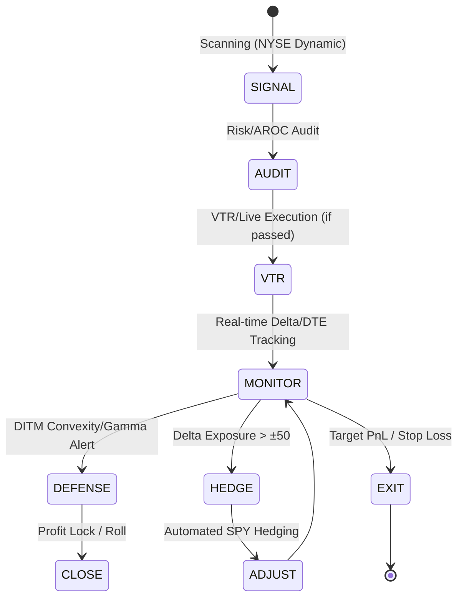

# 📈 Nexus Seeker Quantitative Strategy & Workflow

This document provides a detailed breakdown of the quantitative filters, the **VIX Battle Ladder** risk system, and the professional contract lifecycle managed by the Nexus Seeker terminal.

---

## 🔄 Contract Lifecycle & Portfolio Workflow

The terminal manages the entire lifecycle of an options contract, from initial signal detection to automated defense and closing.

### Decision Matrix (Seller vs. Buyer)

| Role | Trigger Condition | Action Required |
|---|---|---|
| **Seller** | Profit ≥ 50% | ✅ **Buy to Close** (Take Profit) |
| **Seller** | Put Delta ≤ −0.40 | 🚨 **Roll Down and Out** |
| **Seller** | Call Delta ≥ +0.40 | 🚨 **Roll Up and Out** |
| **Seller** | DTE ≤ 21 | ⚠️ **Gamma Risk Mitigation** (Close or Roll) |
| **Seller** | Loss ≥ 150% | ☠️ **Systemic Failure** (Hard Stop Loss) |
| **Buyer** | Profit ≥ 100% | ✅ **Sell to Close** (Take Profit) |
| **Buyer** | Delta ≥ 0.85 & PnL > 150% | 🚨 **Profit Lock (DITM Defense)** (Close or Roll) |
| **Buyer** | DTE ≤ 21 | 🚨 **Momentum Decay** (Harvest Residual Value) |
| **Buyer** | Principal Drawdown ≥ 50% | ⚠️ **Stop Loss Warning** |

---

## 📈 Quantitative Filter Pipeline

Every signal detected by the strategy engine must pass through a multi-stage rigorous quantitative audit before being presented to the user or entered into the VTR.

### Core Noise Reduction (Alert Filter)
To prevent signal fatigue, the following filters are applied at the service layer:
*   **Dynamic Trend Filter (EMA 8/21)**: Active rejection of BTO Call / STO Put during strong bearish regimes.
*   **Multi-Timeframe Alignment (MTF)**: EMA crossovers must be confirmed by the Daily (D1) EMA 21 trend.
*   **Anti-Whipsaw Mechanism**: 4-hour cooldown on directional signals and rejection of low-volatility price action (< 1.5% swings).

### Global Quantitative Audit
| # | Filter | Professional Rule | Applied To |
|---|---|---|---|
| 1 | **HV Rank** | HV Rank ≥ 30 (Trailing 1-year) | STO Put / STO Call |
| 2 | **Term Structure** | Ratio 30D/60D IV ≥ 1.05 (Backwardation) | All |
| 3 | **VIX Regime** | VTS (VIX/VIX3M) ≥ 1.0 → Global Defensive Mode | All |
| 4 | **VIX Z-Score** | Z30 > 0.5 & Z60 > 0 (Vol Expansion) → Reject Long Bias | BTO Call / STO Put |
| 5 | **SPY Alignment** | Price < SMA 20 → Bearish Regime Declared | BTO Call / STO Put |
| 6 | **Vertical Skew** | 25Δ Put/Call IV Ratio ≥ 1.50 → Reject STO Put | STO Put |
| 7 | **Liquidity** | Abs Spread > $0.20 **AND** % Spread > 10% → REJECT | All |
| 8 | **VRP (Seller)** | IV < HV (VRP < 0) → REJECT | STO Put / STO Call |
| 9 | **VRP (Buyer)** | VRP > 3% (Overpriced Premium) → REJECT | BTO Call / BTO Put |
| 10 | **Prob. Cone** | Breakeven must be outside 1σ Expected Move | STO Put / STO Call |
| 11 | **AROC (Seller)** | Annualized Return on Capital < 15% → REJECT | STO Put / STO Call |
| 12 | **AROC (Buyer)** | Annualized Return on Capital < 30% → REJECT | BTO Call / BTO Put |
| 13 | **¼ Kelly** | Tail Risk detected → Max Position 2.5% | STO Put / STO Call |
| 14 | **VIX Ladder** | VIX < 15 → Hard Reject all STO signals | All |

---

## 🏅 VIX Battle Ladder

The VIX Battle Ladder is a 6-stage adaptive system that governs risk appetite based on realized and implied market volatility.

| VIX Range | Tier Name | STO Delta Cap | Sizing Multiplier | Kelly Override | VTR Entry |
|---|---|---|---|---|---|
| < 15.0 | 🧊 **Dormant** | — | 0.0x | — | ❌ Forbidden |
| 15.0 – 18.0 | ⚠️ **Caution** | -0.12 | 0.5x | — | ✅ Allowed |
| 18.0 – 24.0 | 🟡 **Ready** | -0.20 | 1.0x | — | ✅ Allowed |
| 24.0 – 30.0 | 🟠 **Aggressive** | -0.20 | 1.2x | — | ✅ Allowed |
| 30.0 – 35.0 | 🔴 **Heavy** | -0.25 | 1.5x | 1/3 Kelly | ✅ Allowed |
| ≥ 35.0 | ⚫ **Extreme** | -0.35 | 2.0x | 1/2 Kelly | ✅ Allowed |

---

## ⚡ PowerSqueeze (PSQ) Labels
Independent of option signals, the PSQ engine provides momentum context:
*   `OVEREXTENDED_RISK`: Bullish breakout in a low VIX (< 15) environment. Likely a bull trap.
*   `HIGH_CONVICTION_RECOVERY`: Bearish deceleration in a high VIX (> 24.6) environment. Potential reversal opportunity.
