# 雙自選標的心跳管線架構與排程隔離規格書

---

## 1. 核心哲學與適用市場環境

### 1.1 核心哲學
在多租戶的即時金融量化監控系統中，交易員對即時警報的需求可分為兩大維度：
1. **高頻率、低延遲的廣度快照（Breadth Snapshot）**：快速掃描全體自選股之 Greeks 牆體、最大痛點、Skew 偏斜與主力 UOA，提供即時動能與風險 triage。
2. **低頻率、高深度的戰術操盤藍圖（In-Depth Tactical Plan）**：計算 15 分鐘微觀結構、動態買賣點、1.5 倍 ATR 防洗盤緩衝停損、選擇權具體到期日履約價組合以及 Gamma Squeeze SPEAR 攻擊訊號。

若將兩者混同於單一排程迴圈，重度量化計算將嚴重阻塞輕量雷達的定時投遞，並因 API 併發過載觸發外部數據源（Finnhub, yfinance）之限流封鎖。

Nexus Seeker 確立了**「雙管線物理排程隔離 ＋ 數據快取共用 ＋ 通知頻道獨立解耦」**之核心架構，將系統劃分為：
- **15 分鐘雷達心跳管線（15-Minute Radar Heartbeat）**
- **30 分鐘「標的分析中心 2.0」深度心跳管線（30-Minute Deep Tactical Pipeline）**

### 1.2 雙心跳管線核心架構對比

| 特性維度 | 15 分鐘雷達心跳 (Radar Heartbeat) | 30 分鐘標的分析中心 2.0 深度心跳 |
| :--- | :--- | :--- |
| **進入點** | `SchedulerCog.dynamic_market_scanner()` $\to$ `cogs/trading/heartbeat.py` | `IntradayScanPipeline._run_loop()` $\to$ `market_analysis/intraday_pipeline/` |
| **排程調度機制** | 盤中時鐘嚴格對齊（`:00`, `:15`, `:30`, `:45`） 透過 `discord.ext.tasks.loop` | 獨立 `asyncio.Task` 背景常駐迴圈， 每輪執行後 `await asyncio.sleep(30 * 60)`（時間漂移） |
| **數據抓取層** | `RadarDataMixin._fetch_sym_radar_data_slow()` | `evaluate_watchlist_symbol()` |
| **Embed 渲染模組** | `build_radar_scan_embed()`（10 檔分頁） | `create_watchlist_signal_embed()` |
| **主動推送過濾門檻** | 無（每 15 分鐘定時推送完整自選雷達面板） | **僅當 `tactical.alert_level != "green"` 時發送** （非綠色警報才推送，杜絕無效打擾） |
| **通知控制頻道** | `/notif_settings` $\to$ `heartbeat_watchlist` | `/notif_settings` $\to$ `heartbeat_symbol_deep` （migration `v070` 獨立分離） |
| **進階進攻模組** | 無 | `NexusGammaSqueezeEngine`（受 `enable_analyst_agent` 閘門控制） |
| **進場顧問獨立推播** | 無 | `_dispatch_entry_advisor_alert()`：**僅在心跳為 green 時**評估，六重鐵律通過才推播（含進場／停損／目標／盈虧比）。獨立通知頻道 `advisory_entry_signal`、**不受 `enable_analyst_agent` 約束**，不新增 `scenario`、不覆寫 `tactical`。預設乾跑（`WATCHLIST_ADVISOR_DRY_RUN`） |

---

## 2. 數學模型與量化推導

### 2.1 3-Pass 批次去重複雜度最佳化推導
設系統中註冊用戶數為 $U$，平均每位用戶自選清單包含 $K$ 檔標的。所有用戶的自選標的聯集為 $S$：
$$S = \bigcup_{u=1}^U \text{Watchlist}_u, \quad |S| \le U \times K$$

傳統天真演算法逐一為每位使用者抓取其自選標的，時間與網路 I/O 複雜度為 $O(U \times K)$。當多位使用者關注同檔熱門股（如 NVDA、TSLA）時，重複的網路請求將迅速耗盡 API 配額。

Nexus Seeker 15 分鐘雷達實施 **3-Pass 批次架構**：
1. **Pass 1 (記憶體篩選與去重)**：遍歷所有用戶，檢查 `heartbeat_watchlist` 通知權限與 `option_alert_mode`（模式 2 僅推播有持倉標的），提取唯一標的集合 $S_{fetch} \subseteq S$，複雜度為 $O(U \times K)$（純記憶體運算）。
2. **Pass 2 (併發限流慢速抓取)**：針對去重後的標的 $s \in S_{fetch}$，透過 `asyncio.Semaphore(3)` 併發執行 `_fetch_sym_radar_data_slow(s)`。實體 API 呼叫次數嚴格降為 $|S_{fetch}|$。計算結果同步快取至 `bot._latest_radar_data_cache`。
   網路請求節省效率公式：
   $$\text{Efficiency Gain} = \frac{U \times K - |S_{fetch}|}{U \times K} \times 100\%$$
3. **Pass 3 (分頁組裝與佇列派發)**：由快取中讀取數據，依照每頁最多 10 檔標的分組組裝 Embed，加入 `bot.queue_dm` 投遞佇列。

### 2.2 30 分鐘動態買賣點與 1.5x ATR 防洗盤停損模型
30 分鐘深度心跳調用 `calculate_dynamic_trading_signals`，計算絕對防守線，過濾下影線流動性獵殺（Liquidity Grab）：
$$StopLoss_{\text{anti\_washout}} = PutWall - 1.5 \times ATR_{14}$$

買進與賣出參考價位：
$$Price_{\text{buy}} = \max\left(PutWall, Spot \times (1 - 0.5 \times EM_{\%})\right)$$
$$Price_{\text{sell}} = \min\left(CallWall, Spot \times (1 + 0.5 \times EM_{\%})\right)$$

### 2.3 交易時段 Phase A/B/C 三態劃分模型
30 分鐘管線依據 NYSE 行事曆即時劃分當前盤中階段：
$$\text{Phase} = \begin{cases}
\text{Phase A (開盤衝擊與價格發現)} & t_{\text{open}} \le t_{\text{now}} < t_{\text{open}} + 60 \text{ 分鐘} \\
\text{Phase B (盤中趨勢與結構均衡)} & t_{\text{open}} + 60 \text{ 分鐘} \le t_{\text{now}} < t_{\text{close}} - 60 \text{ 分鐘} \\
\text{Phase C (尾盤結算與做市商對沖)} & t_{\text{close}} - 60 \text{ 分鐘} \le t_{\text{now}} \le t_{\text{close}} \\
\text{Closed (閉市待機)} & \text{其他時段}
\end{cases}$$
當 $\text{Phase} = \text{Closed}$ 時，管線自動進入 600 秒休眠循環。

---

## 3. 決策邏輯與狀態機 / 流程圖

### 3.1 雙心跳管線並行運行拓撲

```mermaid
flowchart TD
    subgraph Pipeline1 ["管線一：15 分鐘雷達批次心跳 (廣度快照)"]
        CronTrigger(["Cron 排程: :00, :15, :30, :45"]) --> P1_Leader{是否為 Leader 實例?}
        P1_Leader -- 否 --> P1_End([略過])
        P1_Leader -- 是 --> Pass1["Pass 1: 用戶通知過濾 (heartbeat_watchlist)<br/>與全域標的去重集合 S"]
        Pass1 --> Pass2["Pass 2: Semaphore(3) 併發抓取<br/>寫入 bot._latest_radar_data_cache"]
        Pass2 --> Pass3["Pass 3: 每頁 10 檔分頁組裝<br/>build_radar_scan_embed"]
        Pass3 --> P1_Queue["呼叫 bot.queue_dm 批次推送"]
    end

    subgraph Pipeline2 ["管線二：30 分鐘深度戰術心跳 (深度決策)"]
        LoopTrigger(["獨立 Task: sleep(30m) 循環"]) --> P2_Leader{"動態檢查 Leader 狀態<br/>getattr(bot, '_is_leader_instance')"}
        P2_Leader -- 否 --> SleepLeader["休眠 600 秒等待選舉"] --> LoopTrigger
        P2_Leader -- 是 --> CheckMarket{美股開盤中?}
        CheckMarket -- 否 --> SleepClosed["休眠 600 秒待機"] --> LoopTrigger
        CheckMarket -- 是 --> EvalPhase["計算 Phase A/B/C 時段"]

        EvalPhase --> EvalSymbol["evaluate_watchlist_symbol()<br/>計算微觀結構, Greeks, ATR"]
        EvalSymbol --> CheckAlert{"tactical.alert_level != 'green'?"}
        CheckAlert -- 否 (綠色常態) --> SkipPush["靜默不推送 (杜絕打擾)"]
        CheckAlert -- 是 (非綠色警報) --> CheckDeepNotif{"用戶開啟<br/>heartbeat_symbol_deep?"}

        CheckDeepNotif -- 是 --> BuildDeepEmbed["組裝 create_watchlist_signal_embed<br/>(含 1.5x ATR 停損與資金藍圖)"]
        CheckDeepNotif -- 否 --> SkipPush
        BuildDeepEmbed --> P2_Queue["呼叫 bot.queue_dm 推送"]

        SkipPush --> AdvisorGate{"alert_level == 'green'<br/>且開啟 advisory_entry_signal?"}
        P2_Queue --> AdvisorGate
        AdvisorGate -- 否 --> CheckSPEAR
        AdvisorGate -- 是 --> AdvisorRadar["_resolve_candidate_radar()<br/>共享雷達快取(300s 保鮮) 或 Semaphore(3) 補抓"]
        AdvisorRadar --> AdvisorEval["evaluate_entry_advice()<br/>策略分派 + 六重鐵律 + 價位<br/>(記憶化於 strategy:symbol:15m bar)"]
        AdvisorEval --> AdvisorDry{"通過且三個乾跑旗標皆已關閉<br/>且當日 Regime 去重未命中?"}
        AdvisorDry -- 是 --> AdvisorQueue["create_entry_rules_embed → queue_dm<br/>寫入 advisory_entry_ 去重旗標"]
        AdvisorDry -- 否 --> CheckSPEAR
        AdvisorQueue --> CheckSPEAR
        CheckSPEAR{開啟 enable_analyst_agent?}
        CheckSPEAR -- 是 --> SqueezeEngine["NexusGammaSqueezeEngine.analyze_ticker()<br/>發送 SPEAR 進攻訊號"]
        CheckSPEAR -- 否 --> LoopSleep["await asyncio.sleep(1800)"]
        SqueezeEngine --> LoopSleep
        LoopSleep --> LoopTrigger
    end
```

---

## 4. 關鍵具名常數與物理約束

| 常數名稱 | 數值 / 門檻 | 物理約束與代碼意涵 | 程式碼檔案路徑 |
| :--- | :--- | :--- | :--- |
| `RADAR_CONCURRENCY` | `3` (Semaphore) | 15 分鐘雷達標的併發抓取最大連線數 | `nexus_core/cogs/trading/heartbeat.py:102` |
| `RADAR_CHUNK_SIZE` | `10` 檔 / 頁 | 雷達批次掃描 Embed 每頁封裝上限（防 4096 溢位） | `nexus_core/cogs/embed_builders/market_embeds.py:387` |
| `DEEP_PIPELINE_INTERVAL` | `1800` 秒 (30 分鐘) | 深度心跳每輪執行完畢後的非阻塞休眠間隔 | `nexus_core/market_analysis/intraday_pipeline/pipeline.py:45` |
| `CLOSED_STANDBY_INTERVAL` | `600` 秒 (10 分鐘) | 休市或非 Leader 實例時的待機探測間隔 | `nexus_core/market_analysis/intraday_pipeline/pipeline.py:409` |
| `ANTI_WASHOUT_ATR_MULT` | `1.50` (1.5x) | 自選標的心跳的買賣點 ATR 緩衝（**與持倉停損無關**，見下方消歧義） | `nexus_core/market_analysis/signal_calculator.py` |
| `NOTIF_CHANNEL_RADAR` | `"heartbeat_watchlist"` | 15 分鐘雷達通知開關名稱 | `nexus_core/database/notifications.py` |
| `NOTIF_CHANNEL_DEEP` | `"heartbeat_symbol_deep"` | 30 分鐘深度心跳通知開關名稱（migration v070） | `nexus_core/database/notifications.py` |
| `NOTIF_CHANNEL_ADVISORY_ENTRY` | `"advisory_entry_signal"` | 進場顧問通知開關名稱（migration `v078` 以 `heartbeat_symbol_deep` 回填，避免已靜音者被自動訂閱） | `nexus_core/database/notifications.py` |
| `WATCHLIST_ADVISOR_DRY_RUN` | `true`（預設） | 進場顧問乾跑：只寫 log 與前向紀錄、不推播、**不寫去重旗標**。另須同時滿足 `REGIME_III_B_DRY_RUN`（III-B 確認）與 `SHORT_ENTRY_DRY_RUN`（做空方向）已關閉才會推播——本路徑不經持倉監控的派發迴圈，三道閘門由派發函式自行檢查 | `nexus_core/config.py` |
| `_RADAR_FRESH_WINDOW_SECONDS` | `300.0` 秒 | 進場顧問取用 `bot._latest_radar_data_cache` 的保鮮窗；超過即經 `_fetch_sym_radar_data_slow` 補抓（Semaphore(3)）。15 分鐘雷達與本管線 `sleep(1800)` 會時間漂移，補抓是常態 | `nexus_core/market_analysis/intraday_pipeline/entry_advisor.py` |
| `_ADVICE_CACHE_MAX_SIZE` | `256` | 進場顧問結果記憶（鍵 `(strategy:symbol, 15 分鐘 bar)`，必含 strategy），`BoundedCache` LRU | `nexus_core/market_analysis/intraday_pipeline/entry_advisor.py` |

---

## 5. 邊界條件、風控熔斷與例外處理

### ⚠️ 三個 ATR 倍數的消歧義（刻意分歧，不得合併）

系統中有三個外觀相近、語意完全不同的 ATR 倍數，過去已有人嘗試「去重」而險些改錯：

| 常數 | 值 | 語意 | 檔案 |
| :--- | :--- | :--- | :--- |
| `ANTI_WASHOUT_ATR_MULT` | `1.5` | **自選標的心跳**的建議買/賣點緩衝（`suitable_buy -= 1.5 × ATR`）。這是給尚未持倉的觀察標的算進場價位用的，不是停損 | `market_analysis/signal_calculator.py` |
| `_MICROSTRUCTURE_SL_STRUCTURAL_ATR_MULT` | `0.5` | **既有持倉**雙軌停損的軌道一實際停損（`anchor ∓ 0.5 × ATR₁₅ₘ`） | `dynamic_rollover/constants.py` |
| `_ROOM_STOP_ATR_15M_MULTIPLIER` | `0.5` | **動態空間門檻**推導 `Risk_actual` 用的停損墊片 | `market_analysis/room_threshold.py` |

後兩者**必須恆等**（見 [`../strategies/06_dynamic_adaptive_room_threshold.md`](../strategies/06_dynamic_adaptive_room_threshold.md) §5.4 的同步不變式，有單元測試鎖定）；第一個與它們**無關**，改動任一個都不該連動其餘兩個。此處的處理原則比照本專案對三種 `gamma_cliff_level` 公式的既有慣例：概念不同的模型不應為了去重而強行統一。

### 5.1 動態 Leader Election 實例鎖定禁忌
- **嚴禁在 `__init__` 建構時鎖定**：Discord Bot 的 Cogs 載入於 `setup_hook` 階段，而分散式叢集的 Leader 選舉是在 `on_ready` 事件後由 `bot._leader_lock_loop` 動態確立。若在建構時進行 `if not bot._is_leader_instance: return`，將導致管線永遠無法啟動。
- **逐輪動態檢查**：必須在 `_run_loop` 每一輪迴圈開頭檢查 `getattr(self.bot, "_is_leader_instance", True)`。若非 Leader 實例，進入 600 秒休眠，若運行中 Leader 身分轉移，管線可自適應接管或讓出。

### 5.2 Analyst Agent 開關隔離原則
- 舊架構曾錯誤將整條 30 分鐘心跳嵌套在 `if not ctx.enable_analyst_agent: continue` 條件下，由於該欄位資料庫預設為 0 且無前端指令可配置，導致深度心跳長期遭全域靜默。
- 現行架構徹底解耦：`enable_analyst_agent` 僅作為 `NexusGammaSqueezeEngine`（SPEAR 訊號）的選配閘門；深度戰術心跳本體一律只受 `/notif_settings` 中的 `heartbeat_symbol_deep` 通道控制。

### 5.3 綠色常態過濾（Alert Level Gating）
- 為防止交易員在行情平淡時遭受資訊疲勞，30 分鐘深度心跳設有嚴格過濾：當且僅當 `tactical.alert_level != "green"`（例如出現超跌磁吸、需防壓回、突破阻力或負 Gamma 警戒）時，才啟動 Embed 建構與 DM 發送。
- 心跳本體的三個出口（SHIELD／premium-harvest／WAIT）**沒有「進場」路由**，標的正常上漲時一律是 green、永不推播。進場買點改由**獨立的進場顧問派發**送達（見下 §5.4），兩者互斥：心跳非 green 時（防禦或收租訊號）進場顧問**不評估**，避免進場訊號蓋過防禦訊號。

### 5.4 進場顧問（`_dispatch_entry_advisor_alert`）的邊界條件
- **不動心跳契約**：`WatchlistTacticalPlan.scenario` Literal（`premium-harvest` / `hard-hedge` / `wait`）與 `nro.py` 零改動；進場顧問是與 `_dispatch_gamma_squeeze_alert` 並列的獨立派發。
- **位置**：呼叫點在使用者／標的迴圈內、`if not engine_enabled ... continue` **之前**；放在其後則預設 `enable_analyst_agent=0` 下永遠執行不到。
- **策略分派與 `/x` 一致**：沿用 `/settings` 的 `trading_strategy`（`RIGHT_SIDE`／`LEFT_SIDE`／`SHORT_SIDE`／`DYNAMIC`），`DYNAMIC` 依 Regime 路由（III／III-B → 右側、I → 左側、V → 做空、II／IV → 不進場）。要收到左側接刀買點須先把 `/settings` 切成 `DYNAMIC`。
- **價位沿用單一定義**：停損 `compute_reference_stop()`（牆 ∓ 0.5×ATR₁₅ₘ，**不是**心跳的 `ANTI_WASHOUT_ATR_MULT=1.5`，見 §5 ATR 消歧義）、目標 `resolve_effective_target()`（公式 D）、做空價位 `build_short_entry_levels()`；缺資料時該欄位顯示 N/A，做空價位不合法則 fail-closed 不推播。
- **去重與乾跑**：去重鍵 `advisory_entry_{uid}_{SYMBOL}_{Regime 或策略}_{YYYYMMDD}`，Regime III-B 升級為 III 是新訊號、會再發一次；任何擋下（非 green、頻道關閉、鐵律未過、乾跑）**都不寫旗標**，否則正式開啟當天所有標的都被當日旗標鎖住。
- **前向蒐集**：評估包在 `evaluation_source("WATCHLIST_ADVISOR")`，乾跑期間照常記錄，作為觀察期的資料來源。
- **觀察指標與放行判讀**：主判準是**去重後的實際 DM 總量**而非鐵律通過次數（乾跑期間去重結構性失效，直接計數會高估 4～13 倍）；單檔每週 0–2 次僅為次要的異常偵測指標。完整的 SQL 查詢、判定門檻（$\le 5$ 放行／$5\sim15$ 收緊／$>15$ 不放行）與部署前檢查清單見 [`05_calibration_harness_and_forward_collection.md`](05_calibration_harness_and_forward_collection.md) §5.11。

---

## 6. 核心程式碼檔案路徑關聯

- `nexus_core/cogs/trading/heartbeat.py`
  - `dispatch_watchlist_heartbeat`: 15 分鐘雷達批次心跳 3-Pass 核心分發函式
- `nexus_core/market_analysis/intraday_pipeline/pipeline.py`
  - `IntradayScanPipeline`: 30 分鐘深度監控管道類別與 `_run_loop` 調度狀態機
  - `_dispatch_entry_advisor_alert` / `_resolve_candidate_radar`: 進場顧問獨立派發與 radar 取得（共享快取優先、Semaphore(3) 補抓）
- `nexus_core/market_analysis/intraday_pipeline/entry_advisor.py`
  - `evaluate_entry_advice`: 策略分派、六重鐵律確認、價位計算與跨使用者記憶化
- `nexus_core/cogs/embed_builders/portfolio_embeds.py`
  - `create_entry_rules_embed`: 進場鐵律 Embed（進場顧問追加「價位建議」欄位；`/x` 頁籤共用）
- `nexus_core/market_analysis/signal_calculator.py`
  - `calculate_dynamic_trading_signals`: 動態買賣點與 1.5x ATR 防洗盤緩衝停損計算
- `nexus_core/market_analysis/option_guidance.py`
  - `derive_watchlist_option_guidance`, `build_watchlist_option_plan`: 選擇權推薦合約規劃
- `nexus_core/cogs/embed_builders/watchlist_embeds.py`
  - `create_watchlist_signal_embed`: 30 分鐘標的分析中心 2.0 專屬 Embed 建構器
- `nexus_core/cogs/embed_builders/market_embeds.py`
  - `build_radar_scan_embed`: 15 分鐘雷達 10 檔分頁 Embed 建構器
