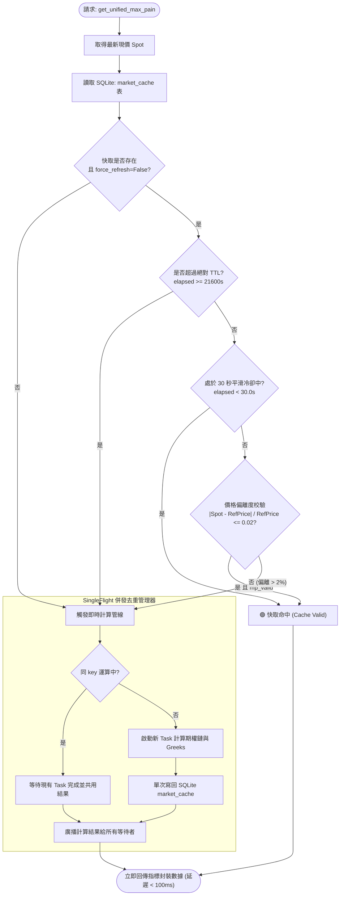

# 盤前 08:45 預熱與 SQLite Cache-Aside 機制規格書

---

## 1. 核心哲學與適用市場環境

### 1.1 核心哲學
美股選擇權做市商結構計算（如 Net GEX、Call/Put Wall、未平倉合約最大痛點 Max Pain 與預期波幅 Expected Move）涉及龐大的期權鏈（Option Chain）解析與 Black-Scholes 敏感度 Greeks 運算。若將所有計算推遲至盤中用戶發起指令或心跳推播當下即時運算，將引發兩大架構性崩潰：
1. **Discord 3 秒互動逾時（Interaction Timeout）**：Discord API 要求所有 Slash 指令必須在 3000 毫秒內給予初始回應，否則回傳 `40060 Unknown interaction` 錯誤。
2. **驚群效應與資料庫寫入競爭（Thundering Herd & Lock Contention）**：當多位用戶在開盤瞬間同時查詢熱門標的時，重複的即時運算將迅速耗盡外部 API 限流，並造成 SQLite 寫入鎖死。

Nexus Seeker 確立**「盤前 08:45 ET 全域預熱 ＋ SQLite 本地持久化 ＋ 雙重偏離與時間失效判定 ＋ SingleFlight 併發去重」**之 Cache-Aside 架構，使盤中雷達終端回應時間嚴格壓制在 100ms 內。

### 1.2 適用市場環境與制度角色
- **每日盤前預熱（Pre-Market Pre-warming）**：美東時間 08:45（開盤前 45 分鐘），背景排程全自動彙整所有使用者關注資產，提前完成全鏈 Greeks 與痛點運算。
- **盤中零延遲查詢（Zero-LLM Latency）**：盤中 `/x` 指令與 15 分鐘心跳優先讀取 SQLite 本地快照，以微秒級速度就地渲染。
- **行情劇烈突破之動態自癒刷新**：當現價相較於快取參考價偏離超過 2% 且已跨越 30 秒冷卻期時，系統自動啟動非阻塞動態重算，無縫刷新快取。

---

## 2. 數學模型與量化推導

### 2.1 盤前預熱標的聯集模型
每日 08:45 ET，排程器從資料庫三張核心業務表中提取全站唯一標的聯集：
$$S_{\text{warm}} = \left( \bigcup_{u=1}^U \text{Watchlist}_u \right) \cup \left( \bigcup_{u=1}^U \text{Holdings}_u \right) \cup \left( \bigcup_{u=1}^U \text{ActiveOrders}_u \right)$$

將去重後的標的集合 $S_{\text{warm}}$ 排序，透過 `asyncio.Semaphore(3)` 併發執行期權指標預熱。

### 2.2 SQLite `market_cache` 複合主鍵資料表結構
資料表採用 `(symbol, expiry)` 複合主鍵架構（依據 migration `v052`）：
```sql
CREATE TABLE IF NOT EXISTS market_cache (
    symbol TEXT NOT NULL,
    expiry TEXT NOT NULL,
    max_pain REAL,
    expected_move_lower REAL,
    expected_move_upper REAL,
    reference_spot_price REAL,
    is_stale INTEGER DEFAULT 0,
    calculation_mode TEXT DEFAULT 'OI',
    is_degraded INTEGER DEFAULT 0,
    circuit_breaker_triggered INTEGER DEFAULT 0,
    call_wall REAL,
    previous_call_wall REAL,
    updated_at TIMESTAMP DEFAULT CURRENT_TIMESTAMP,
    PRIMARY KEY (symbol, expiry)
);
```

### 2.3 Cache-Aside 有效性檢核四重閘門
當呼叫 `get_unified_max_pain(symbol, expiry)` 時，系統自 `market_cache` 讀取快照數據，並對比即時現價 $Spot$。

設快取記錄之更新時間戳記為 $t_{\text{updated}}$，當前時間為 $t_{\text{now}}$。快取存續時間（Elapsed Seconds）為：
$$\Delta t = t_{\text{now}} - t_{\text{updated}}$$

現價相對於快取錨定參考價 $RefPrice$ 之相對偏離度為：
$$Deviation = \frac{|Spot - RefPrice|}{RefPrice}$$

快取判定為有效的四重充要條件：
$$\text{is\_cache\_valid} = \begin{cases}
\text{True} & \text{若 } \Delta t < _MARKET\_CACHE\_MAX\_AGE\_SECONDS \land \text{is\_stale} = 0 \land \\
             & [(\Delta t < 30.0\text{s}) \lor (\text{is\_mp\_valid} \land Deviation \le 0.02)] \\
\text{False} & \text{否則 (超過 6 小時絕對 TTL，或冷卻期後價格偏離度 > 2%)}
\end{cases}$$

其中：
- **30 秒平滑冷卻期（`MIN_TTL = 30.0`）**：在快取寫入後的 30 秒內，無論價格如何波動，一律強制視為有效，杜絕高頻重複重算。
- **2% 價格偏離度校驗（`Deviation <= 0.02`）**：在 30 秒冷卻期後，若現價波動維持在 $\pm 2\%$ 區間內，快取持續有效。
- **6 小時絕對 TTL 後盾（`_MARKET_CACHE_MAX_AGE_SECONDS = 21600`）**：防範長期橫盤標的因偏離度未超標而導致快取無限期凍結，強制每 6 小時失效重算一次。

### 2.4 SingleFlight 併發去重演算法
當快取失效或發生 Cache Miss 時，若多個協程（例如 15 分鐘雷達心跳與用戶即時點擊）同時請求同檔標的，系統利用 `SingleFlightManager` 進行並行請求摺疊：
$$\text{FlightKey} = \text{symbol} + \text{"\_"} + \text{expiry}$$

```python
# 概念實作邏輯
async def execute_single_flight(key, compute_func):
    if key in self._flying_tasks:
        return await self._flying_tasks[key]
    task = asyncio.create_task(compute_func())
    self._flying_tasks[key] = task
    try:
        res = await task
        return res
    finally:
        self._flying_tasks.pop(key, None)
```
所有併發協程共享單次期權鏈抓取與 Greeks 計算結果，並由第一個協程完成單次 SQLite 寫回，徹底杜絕資料庫寫入衝突與算力浪費。

---

## 3. 決策邏輯與狀態機 / 流程圖

### 3.1 Cache-Aside 讀取、校驗與 SingleFlight 刷新流程



---

## 4. 關鍵具名常數與物理約束

| 常數名稱 | 數值 / 門檻 | 物理約束與代碼意涵 | 程式碼檔案路徑 |
| :--- | :--- | :--- | :--- |
| `_MARKET_CACHE_MAX_AGE_SECONDS` | `21600` 秒 (6 小時) | 快取絕對生命週期後盾（強制逾期重算） | `nexus_core/market_analysis/sentiment/max_pain.py:21` |
| `MIN_TTL_COOLDOWN` | `30.0` 秒 | 平滑防護最小冷卻時間（冷卻期內不重算） | `nexus_core/market_analysis/sentiment/max_pain.py:206` |
| `DEVIATION_THRESHOLD` | `0.02` (2.0%) | 價格偏離度容許上限（超過則非阻塞重算） | `nexus_core/market_analysis/sentiment/max_pain.py:216` |
| `PRE_WARM_TIME` | `08:45 ET` | 盤前全域標的預熱任務觸發時間點 | `nexus_core/cogs/trading/pre_market.py:34` |
| `PRE_WARM_CONCURRENCY` | `3` (Semaphore) | 盤前預熱併發抓取連線數上限 | `nexus_core/cogs/trading/pre_market.py:98` |
| `COMPOSITE_KEY` | `(symbol, expiry)` | 快取表唯一複合主鍵定義 | `nexus_core/database/migrations/v052_update_market_cache_composite_key.py` |

---

## 5. 邊界條件、風控熔斷與例外處理

### 5.1 熔斷保護標記（Circuit Breaker Triggered）
- 若某標的的期權鏈數據嚴重異常（例如深度價外未平倉量失真導致痛點計算發散），底層算法會標記 `circuit_breaker_triggered = 1`。
- 當 Cache-Aside 讀取到熔斷旗標時，系統安全將 `max_pain` 設為 `None`，並在前端雷達顯示 `--`，嚴禁向交易員輸出未經校準的失真痛點價位。

### 5.2 降級模式（Degraded Calculation Mode）
- 當即時成交量（Volume）不足或缺失時，算法自動切換至純未平倉量模式（`calculation_mode = 'OI'`），並在快取中標註 `is_degraded = 1`。
- 前端 Embed 依此標籤呈現降級狀態，提示交易員該指標主要依賴昨日收盤籌碼分佈。

### 5.3 歷史 Call Wall 位移追蹤（Wall Shift Tracking）
- 每次寫入新快取時，系統保留前次阻力牆價位至 `previous_call_wall` 欄位。
- 透過 $\Delta CallWall = CallWall_{new} - CallWall_{previous}$，系統可直接辨識做市商阻力牆是否發生上移（Call Wall Migration），提供主力資金向上突破或壓制撤除的前瞻信號。

---

## 6. 核心程式碼檔案路徑關聯

- `nexus_core/cogs/trading/pre_market.py`
  - `pre_market_risk_monitor`: 08:45 ET 盤前全域標的預熱排程器
  - `_pre_warm_all_targets`: 提取 Watchlist, Holdings, Orders 並以 `Semaphore(3)` 預熱
- `nexus_core/market_analysis/sentiment/max_pain.py`
  - `get_unified_max_pain`: Cache-Aside 檢核、偏離校驗與調度核心
  - `_MARKET_CACHE_MAX_AGE_SECONDS`: 6 小時絕對過期常數
- `nexus_core/services/single_flight.py`
  - `SingleFlightManager`: 併發去重與防範驚群效應管理器
- `nexus_core/database/market_cache.py`
  - `get_market_cache`, `save_market_cache`: SQLite 快取讀寫持久化介面
- `nexus_core/database/migrations/v052_update_market_cache_composite_key.py`
  - 遷移腳本：建立 `(symbol, expiry)` 複合主鍵結構
