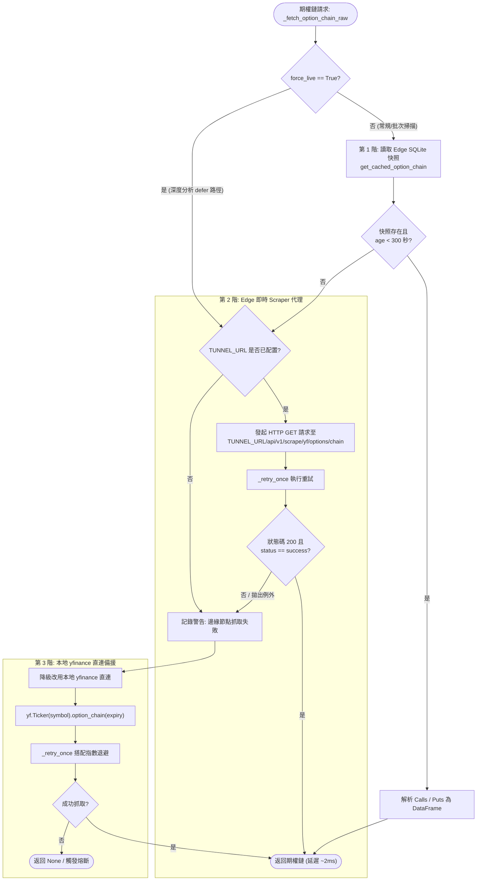

# 雙服務架構與三階式降級代理規格書

---

## 1. 核心哲學與適用市場環境

### 1.1 核心哲學
在雲端環境（如 DigitalOcean, AWS, Linode 等資料中心 VPS）部署量化期權交易機器人時，架構設計面臨兩大天然死穴：
1. **資料中心 IP 被金融數據源高頻封鎖（IP Blockade）**：Yahoo Finance 與特定金融 API 會主動偵測主流雲端主機供應商的 ASN 網段，對其請求直接回傳 `HTTP 403 Forbidden` 或 `HTTP 429 Too Many Requests`，導致行情與期權鏈抓取全面癱瘓。
2. **重度運算與事件循環阻塞（Event Loop Starvation）**：動態網頁渲染（Playwright 瀏覽器引擎）、SEC EDGAR 數萬字元之 HTML/正則段落解析以及 Reddit 即時爬取均屬於高 CPU / 高記憶體消耗任務。若直接與 Discord Bot 運行在同一進程中，將導致 Bot 心跳超時（Discord Gateway Heartbeat ACK Missed）而頻繁斷線重連。

Nexus Seeker 確立了**「雙服務微服務解耦（Dual-Service Microservices）＋ Cloudflare Tunnel 穿透 ＋ 三階式優雅降級代理（3-Tier Graceful Degradation Proxy）」**之核心架構，徹底解決 IP 封鎖並確保系統在任何單點失效下皆能維持穩健運行。

### 1.2 雙服務職責邊界矩陣

| 服務模組 | 運行環境與技術棧 | 核心職責與邊界約束 | 外部連線暴露方式 |
| :--- | :--- | :--- | :--- |
| **`nexus_core`** | Python 3.12, `discord.py`, SQLite | 運行主 Discord Bot、Slash 指令互動、量化風險與 Greeks 運算引擎、九大動態轉倉狀態機、持久化私訊佇列（`queue_dm`） | 不對公網開放任何傳入端口；透過 Client 連線 Discord Gateway 與 Tunnel |
| **`nexus_edge_scraper`** | FastAPI, Playwright (Chromium) | 爬取動態渲染網頁（CME FedWatch、TradingView 總經日曆、Reddit RSS）、執行 SEC EDGAR 結構化段落擷取、作為 Yahoo Finance 代理節點 | 透過 Cloudflare Tunnel (`TUNNEL_URL`) 進行受保護的端點暴露 |

---

## 2. 數學模型與量化推導

### 2.1 三階式降級代理管線之延遲與高可用性推導
在抓取選擇權到期日清單（`get_option_expiries`）與完整期權鏈（`_fetch_option_chain_raw`）時，系統實施嚴格的三階式降級代理機制：

設：
- **第 1 階（Edge Snapshot 快照）**：成功率 $P_1$，響應延遲 $T_1 \approx 2\text{ms}$（本地 SQLite 毫秒級讀取）。
- **第 2 階（Edge 即時 Scraper 代理）**：成功率 $P_2$，響應延遲 $T_2 \approx 800\text{ms}$（經由 Tunnel 呼叫邊緣 FastAPI）。
- **第 3 階（本地 `yfinance` 直連備援）**：成功率 $P_3$，響應延遲 $T_3 \approx 2500\text{ms}$（主進程直連外網並帶重試）。

全系統總體可用性（System Availability）模型為：
$$A_{\text{system}} = 1 - (1 - P_1)(1 - P_2)(1 - P_3)$$

若單一節點可用性分別為 $P_1 = 0.85, P_2 = 0.90, P_3 = 0.70$（受 IP 封鎖影響），則三階級聯後的系統可用性為：
$$A_{\text{system}} = 1 - (0.15 \times 0.10 \times 0.30) = 1 - 0.0045 = 99.55\%$$

系統平均查詢期望延遲 $E[T]$ 為：
$$E[T] = P_1 T_1 + (1 - P_1) P_2 T_2 + (1 - P_1)(1 - P_2) P_3 T_3$$
代入數值：
$$E[T] = (0.85 \times 2) + (0.15 \times 0.90 \times 800) + (0.15 \times 0.10 \times 0.70 \times 2500) = 1.7 + 108.0 + 26.25 \approx 135.95\text{ms}$$
這證明了第 1 階快照的大量命中能將平均查詢耗時拉低至遠低於 Discord 3 秒超時門檻的水準。

### 2.2 快照新鮮度門檻與 `force_live` 深度旁路判定
在第 1 階讀取時，快取資料的有效性嚴格受限於新鮮度門檻：
$$\text{is\_snapshot\_valid} = (\text{edge\_age} < \text{\_EDGE\_SNAPSHOT\_MAX\_AGE\_SECONDS} = 300\text{s})$$

然而，在單一標的深度分析指令（`/x symbol:`）中，交易員需要絕對即時的即時盤口。系統在已執行 `interaction.response.defer()` 的條件下，顯式傳入 `force_live = True`：
$$\text{Skip Tier 1} \iff force\_live = \text{True}$$
此時系統強制略過第 1 階快照，直接發起第 2 階邊緣代理即時抓取；若邊緣不可用，則降級至第 3 階直連，確保深度報告所消費的 Greeks 與報價具備最高即時性。

### 2.3 持倉標的 Priority 優先級同步協議
為了防止邊緣爬蟲輪詢全體標的時造成持倉標的數據陳舊，系統實施優先級同步機制：
設自選標的集合為 $S_{\text{watch}}$，全體持倉標的（現貨 HOLDINGS ＋ 期權 TRADES）集合為 $S_{\text{priority}}$。
在每次 15 分鐘心跳觸發前，`nexus_core` 透過 `edge_cache_client.sync_watchlist_symbols` 將兩份清單同步給邊緣節點：
$$S_{\text{priority}} = \left\{ \text{sym} \mid \text{sym} \in \text{database.get\_all\_portfolio()} \land \text{sym} \neq \emptyset \right\}$$
邊緣節點的排程器對 $S_{\text{priority}}$ 實施高頻循環，使其數據延遲上限從常規的 30 分鐘壓縮至單一輪詢週期（約 5 分鐘）：
$$\Delta t_{\text{delay, priority}} \le 5 \text{ 分鐘} \ll \Delta t_{\text{delay, normal}} \approx 30 \text{ 分鐘}$$

### 2.4 GEX 快照歷史 (前向蒐集)
`gex_snapshot` 是 upsert、只保留每個標的的最新值，使 GEX 相關門檻無法回測。邊緣節點在**同一交易內**另寫入 `gex_snapshot_history`，以 15 分鐘分桶、每桶只留第一筆：

$$\text{bucket\_ts} = \Big\lfloor \frac{t_{\text{UTC}}}{15\text{ 分鐘}} \Big\rfloor \times 15\text{ 分鐘}, \qquad \text{PK} = (\text{symbol}, \text{bucket\_ts}), \quad \text{INSERT OR IGNORE}$$

優先標的每 5 分鐘輪詢一次，每標的每日至多 $26$ 列。GEX Profile 只保留現價 $\pm 25\%$ 內的履約價並以 zlib 壓縮，估計約 $30 \text{ 標的} \times 26 \times 1\text{KB} \approx 0.8\text{MB/日}$、保留 180 天約 $140\text{MB}$。保留期清理每個美東日期最多執行一次。

⚠️ 邊緣服務是選用元件；離線時 core 即時計算 GEX、不會有歷史累積。因此 core 的 `regime_evaluation_log`（記錄每次評估**實際使用**的 GEX 數值）才是校準的主要資料源，本表只是補充（見 [`05_calibration_harness_and_forward_collection.md`](05_calibration_harness_and_forward_collection.md)）。

---

## 3. 決策邏輯與狀態機 / 流程圖

### 3.1 三階式降級代理期權鏈抓取流程

---

## 4. 關鍵具名常數與物理約束

| 常數名稱 | 數值 / 門檻 | 物理約束與代碼意涵 | 程式碼檔案路徑 |
| :--- | :--- | :--- | :--- |
| `_EDGE_SNAPSHOT_MAX_AGE_SECONDS` | `300.0` 秒 (5 分鐘) | Edge SQLite 快照新鮮度門檻（超過則視為失效） | `nexus_core/services/market_data_service/options.py:22` |
| `_OPTION_EXPIRIES_CACHE_TTL` | `1800.0` 秒 (30 分鐘) | 期權到期日清單之記憶體快取存活時間 | `nexus_core/services/market_data_service/options.py:23` |
| `TUNNEL_URL` | 組態參數 (Config / Tunnel Endpoint) | Cloudflare Tunnel 安全穿透端點網址 | `nexus_core/config.py` |
| `MAX_RETRY_COUNT` | `1` 次 (`_retry_once`) | 外部請求失敗時的快速重試次數（避免阻塞過久） | `nexus_core/services/market_data_service/_utils.py` |
| `PRIORITY_SYNC_INTERVAL` | 15 分鐘（隨心跳同步） | 持倉標的 Priority 清單同步頻率 | `nexus_core/cogs/trading/heartbeat.py:51` |
| `GEX_HISTORY_ENABLED` | `true`（環境變數） | 是否寫入 GEX 快照歷史 | `nexus_edge_scraper/database.py` |
| `GEX_HISTORY_RETENTION_DAYS` | `180`（環境變數） | GEX 快照歷史保留天數 | `nexus_edge_scraper/database.py` |
| `_GEX_HISTORY_BUCKET_MINUTES` | `15` | 歷史分桶粒度 | `nexus_edge_scraper/database.py` |
| `_GEX_HISTORY_STRIKE_BAND` | `0.25` ($\pm 25\%$) | 歷史保留的履約價範圍 | `nexus_edge_scraper/database.py` |
| `_GEX_HISTORY_MAX_LIMIT` | `500` | `GET /api/v1/cache/gex/history/{symbol}` 單頁上限 | `nexus_edge_scraper/database.py` |

---

## 5. 邊界條件、風控熔斷與例外處理

### 5.1 Cloudflare Tunnel 斷線容錯
- 若 `TUNNEL_URL` 未配置，或 Cloudflare Tunnel 發生網路中斷（HTTP 502/504 Bad Gateway），`nexus_core` 內部以 `try...except` 捕捉異常並記錄 `logger.warning`，隨即毫秒級切換至第 3 階本地 `yfinance` 直連，保證主機器人服務永不因微服務通訊異常而崩潰。

### 5.2 403 / 429 封鎖狀態碼自適應識別
- 當本地 `yfinance` 直連遭遇 Yahoo Finance 403 Forbidden 封鎖時，`_retry_once` 會在重試失敗後精確記錄異常類型。
- 下一輪請求將自動提高對第 1 階與第 2 階邊緣節點的依賴，防止盲目重複發送無效請求導致 IP 封鎖期被延長。

### 5.3 異步連線池洩漏防護
- 呼叫邊緣服務時，一律透過 `async with get_edge_client() as client:` 語法管理 `httpx.AsyncClient` 實例，確保在請求逾時或拋出例外時，底層 TCP Socket 連線能被及時釋放，防止 VPS 出現連線洩漏（Socket Leak）。

---

## 6. 核心程式碼檔案路徑關聯

- `nexus_core/services/market_data_service/options.py`
  - `get_option_expiries`: 支援三階降級代理之期權到期日獲取
  - `_fetch_option_chain_raw`: 三階式期權鏈抓取核心邏輯與 `force_live` 旁路實作
- `nexus_core/services/edge_cache_client.py`
  - `get_cached_option_chain`: 讀取 Edge 背景寫入之 SQLite 期權鏈快照
  - `sync_watchlist_symbols`: 同步自選與 Priority 持倉清單至邊緣節點
  - `get_gex_history`: 分頁讀取 GEX 快照歷史（僅供離線校準工具，bot 執行期不呼叫）
- `nexus_edge_scraper/database.py`
  - `save_gex_snapshot`（同交易寫入歷史）、`get_gex_history`、`prune_gex_history`
- `nexus_edge_scraper/scheduler.py`
  - `_maybe_prune_gex_history`: 每個美東日期最多一次的保留期清理
- `nexus_edge_scraper/local_api/cache_and_sync.py`
  - `GET /api/v1/cache/gex/history/{symbol}`（`since`／`until`／`limit`，以 `next_since` 分頁）
- `nexus_edge_scraper/local_api/`
  - 邊緣 FastAPI 微服務實作端點（Yahoo Finance 代理與數據快照維護）
- `nexus_core/config.py`
  - `TUNNEL_URL` 配置管理
