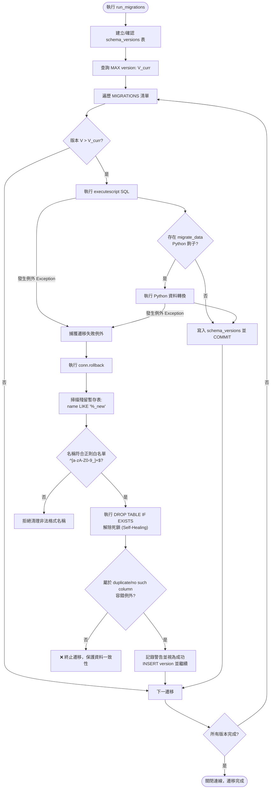
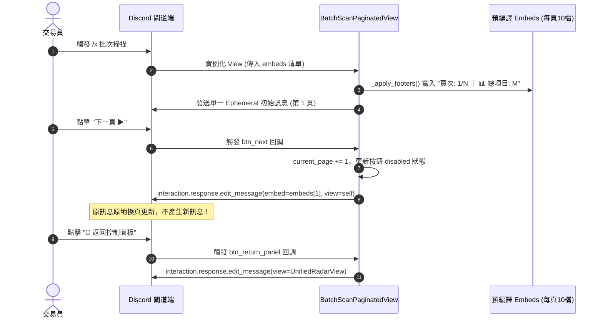

# 量化系統工程規範與 Discord 防爆分頁原則規格書

---

## 1. 核心哲學與適用市場環境

### 1.1 核心哲學
Nexus Seeker 是一套在低記憶體雲端 VPS（1GB–2GB RAM）上 24/7 全年無休運行的生產級 Discord 期權量化風控系統。在極度受限的運算資源與高頻外部 API 互動下，任何微小的工程瑕疵均可能導致災難性後果：
- 一個未做 `if obj is not None:` 檢查的 Nullable 存取，會使 Discord 互動指令中斷，導致用戶端看見「應用程式沒有回應」。
- 一個未經防護的資料庫欄位遷移腳本，會導致 SQLite 資料庫永久鎖死，Bot 無法啟動。
- 一次自選清單超過 20 檔的批次掃描，若直接將文字塞入單一 Embed，會瞬間觸發 Discord API `400 Bad Request (50035 Invalid Form Body: embed.description: Must be 4096 or fewer in length)` 錯誤，導致推播失敗。
- 為了顯示多頁結果而連續呼叫 `followup.send()`，會觸發 Discord 40094 限制。

為此，專案確立了**「嚴格靜態型別安全 ＋ 自我修復資料庫遷移引擎 ＋ 10 檔標的分頁封裝 ＋ In-Place 就地換頁視圖」**四大工程防禦支柱。

---

## 2. 數學模型與量化推導

### 2.1 Discord API 幾何字元約束數學邊界
Discord API 對訊息與 Embed 實施嚴格的字元計數邊界條件：
- **單一 Embed 描述字元上限**：$L_{\text{desc}} \le 4096$ 字元。
- **單一 Embed 總字元上限**：
  $$\sum \text{len}(\text{Field}) + \text{len}(\text{Title}) + \text{len}(\text{Desc}) + \text{len}(\text{Footer}) \le 6000 \text{ 字元}$$
- **單一 Field Value 上限**：$L_{\text{field\_val}} \le 1024$ 字元。
- **單一訊息容納 Embed 總數**：$N_{\text{embeds}} \le 10$ 個。
- **單一純文字訊息上限**：$L_{\text{msg}} \le 2000$ 字元。

### 2.2 批次雷達 10 檔標的分段與安全裕度推導
在量化雷達終端中，每檔標的輸出包含現價、GEX 牆體、Skew 偏斜、SQZ 向量、STO 履約價與灰階戰術建議。每檔標的在 ANSI 格式化表格中平均消耗字元數約為 $C_{\text{sym}} \approx 240$ 字元。

若批次掃描標的總數為 $N$，系統採用每頁最多 10 檔標的之分組策略（`chunk_size = 10`）：
$$\text{TotalPages} = \left\lceil \frac{N}{10} \right\rceil$$
第 $p$ 頁的標的子集合為：
$$Chunk_p = \{ s_i \mid i \in [(p - 1) \times 10, \min(N, p \times 10)) \}$$

單頁 Embed 描述之預期字元長度為：
$$E[L_{\text{page}}] \approx 10 \times C_{\text{sym}} + L_{\text{header}} \approx (10 \times 240) + 150 = 2550 \text{ 字元}$$

相較於 Discord 4096 字元硬性上限，該設計具備顯著的工程安全裕度（Safety Margin）：
$$\text{Safety Margin} = \frac{4096 - 2550}{4096} \times 100\% \approx 37.7\%$$
即便特定標的附帶冗長的警報備註（如 LVN 真空暴跌或三重風險合流），依然絕不可能跨越 4096 字元紅線。

### 2.3 `chunk_embeds` 雙約束背包演算法
在批次告警派發時，輔助函式 `chunk_embeds` 採用貪婪雙約束背包演算法，將一組 Embeds 切分為多個合法子列表：
$$\text{Chunk}_k = \{ E_1, E_2, \dots, E_m \}$$
約束條件：
$$\sum_{j=1}^m \text{Length}(E_j) \le \text{max\_size} = 5500 \quad \land \quad m \le \text{max\_count} = 10$$
任何超過限制的累積均自動切入下一個 Chunk，保證每一包向 Discord API 投遞的 Embed 列表均 100% 合法。

---

## 3. 決策邏輯與狀態機 / 流程圖

### 3.1 SQLite 遷移自我修復狀態機

### 3.2 BatchScanPaginatedView 就地換頁架構

---

## 4. 關鍵具名常數與物理約束

| 常數名稱 | 數值 / 門檻 | 物理約束與代碼意涵 | 程式碼檔案路徑 |
| :--- | :--- | :--- | :--- |
| `RADAR_CHUNK_SIZE` | `10` 檔 / 頁 | 批次量化雷達單頁封裝上限 | `nexus_core/cogs/embed_builders/market_embeds.py:387` |
| `EMBED_CHUNK_MAX_SIZE` | `5500` 字元 | `chunk_embeds` 單包累積字元安全上限（小於 6000） | `nexus_core/cogs/embed_builders/_embed_helpers.py:1010` |
| `EMBED_CHUNK_MAX_COUNT`| `10` 個 | `chunk_embeds` 單包 Embed 數量硬上限 | `nexus_core/cogs/embed_builders/_embed_helpers.py:1010` |
| `TEMP_TABLE_PATTERN` | `^[a-zA-Z0-9_]+$` | SQLite 殘留暫存表名稱安全白名單正則 | `nexus_core/database/core.py:72` |
| `VIEW_TIMEOUT` | `300.0` 秒 | 批次分頁 View 之互動存活逾時限制 | `nexus_core/cogs/unified_terminal/batch_scan_view.py:141` |
| `QUEUE_DM_SPLIT_LIMIT` | `2000` 字元 | 持久化 DM 佇列純文字切割安全門檻（程式碼區塊友善） | `nexus_core/bot.py` |

---

## 5. 邊界條件、風控熔斷與例外處理

### 5.1 靜態型別約束規範
- **Mypy Strict Enforcement**：全儲存庫嚴格遵守 `disallow_untyped_defs = true` 與 `check_untyped_defs = true`。
- **空集合顯式註解規範**：初始化空集合時，嚴禁使用無標註的 `_my_set = set()`，必須顯式標註型別（例如 `_my_set: set[str] = set()`），防止型別推斷為 `set[Any]` 導致下游隱性 Bug。
- **Union 安全性**：所有可能為 `None` 的屬性（如 `interaction.message`、`ctx.author`）在存取其子屬性前，必須執行顯式存在性判定。

### 5.2 SQLite 遷移防死鎖自癒機制（Self-Healing Deadlock Breaker）
- 當執行包含 `ALTER TABLE ... RENAME TO ...` 的複合遷移時，若在重建表過程中崩潰，SQLite 內部會遺留名為 `*_new` 的暫存表。次日重啟時，`CREATE TABLE *_new` 會拋出表已存在的死鎖例外。
- `run_migrations` 在捕捉到例外時，透過正則白名單過濾出合法的 `*_new` 表名稱，強制執行 `DROP TABLE IF EXISTS` 清理殘留結構，並在 rollback 後解除鎖定。

### 5.3 併發請求合併（Single-Flight）不變式

所有 TTL 記憶體快取的寫入都發生在網路 `await` **之後**，因此「查快取 → 發請求 → 寫快取」之間隔著一整段等待。在 $t=0$ 一起建立的多個 task 會雙雙 miss 快取並發出完全相同的請求。**TTL 快取消除的是「跨輪次」重複，Single-Flight 消除的是「同輪次併發」重複，兩者不互相取代**——例如 `/x symbol` 的並行池曾讓同一標的的期權到期日被重複抓取最多 7 次（`expiries_task` 本身，加上 `iv_metrics` / `max_pain` / `uoa_detector` / `options_flow` 在各自的 task 內又各呼叫一次）。

調度一律經 `services/single_flight.py::SingleFlightManager.run()`，**不得自造 in-flight 表**。該實作受兩條不變式約束：

1. **共享任務一律以 `asyncio.shield` 包裹後等待。** 「取消某個呼叫端」的語意是「我不等了」，**不是**「中止這件事」。若直接 `await task`，對 Task 的 await 被取消時會反向取消該 Task，等於一個呼叫端消失就把其他仍在等待同一個 key 的呼叫端資料一起拉掉，並讓已付出的網路成本與「完成後寫回快取」的副作用全部白費。
2. **已完成的任務不得被共乘。** `add_done_callback` 由 event loop 以 `call_soon` 呼叫，任務完成到回呼執行之間有一個 loop 迭代的空窗；`run()` 因此顯式以 `task.done()` 排除已完成的任務，讓正確性不依賴回呼時序。否則落在該空窗內的後續呼叫會取得**上一次**的結果（快取被刻意清除或繞過時即為實質錯誤）。同理，清理必須是**同步** `done_callback`，不可再排一層 cleanup task。

衍生約束：

- 該類別**刻意不使用 `asyncio.Lock`**。`run()` 的臨界區（查表 → 建立 task → 寫回表）內部完全沒有 `await`，在單執行緒 event loop 上已是不可分割的操作；類別層級的 `asyncio.Lock` 一旦真的發生競爭就會綁定到當時的 event loop，之後在別的 loop 使用會拋「is bound to a different event loop」。
- 表中若殘留**屬於其他 event loop** 的任務（單元測試每個 case 各自建 loop），一律忽略並重新執行，而非拋出難以追查的錯誤。
- `done_callback` 須主動取走例外，避免所有呼叫端都被取消時 asyncio 在 GC 期印出 `Task exception was never retrieved`。
- 決定 Single-Flight key 時，**凡會改變抓取語意的參數都必須併入 key**：`get_option_chain` 的 `force_live`（切換 Edge Snapshot / 直連資料源分層）與 `get_quote` 的 `allow_stale`（是否接受時間戳過舊的 Finnhub 報價）皆入 key；而 `get_history_df` 的 `force_refresh` **刻意不入 key**——它只略過快取讀取，抓取目標與資料源完全相同，飛行中那一次本身就是「現在」發出的請求。

### 5.4 集中化 Embed 渲染禁令
- 為了杜絕 Discord API 長度錯誤與風格割裂，專案嚴厲禁止任何業務模組（Cogs, Views, Services）直接調用 `discord.Embed(...)`。
- 所有輸出必須透過 `cogs/embed_builders/` 模組，並封裝於 `NexusEmbed` 類別中，自動繼承調色盤、字元邊界防禦與標準化頁尾。

---

## 6. 核心程式碼檔案路徑關聯

- `nexus_core/cogs/embed_builders/market_embeds.py`
  - `build_radar_scan_embed`: 每頁 10 檔分組封裝與分頁 Embed 建構器
- `nexus_core/cogs/embed_builders/_embed_helpers.py`
  - `chunk_embeds`: 5500 字元 / 10 個 Embed 雙約束背包切片器
- `nexus_core/cogs/unified_terminal/batch_scan_view.py`
  - `BatchScanPaginatedView`: 單一訊息就地換頁視圖控制器（防 40094 限制）
- `nexus_core/database/core.py`
  - `run_migrations`: 70+ 版本 SQLite 遷移引擎與 `*_new` 暫存表自癒清理
- `nexus_core/bot.py`
  - `NexusBot.queue_dm`: 持久化私訊佇列與代碼區塊友善的 2000 字元分段投遞
- `nexus_core/services/single_flight.py`
  - `SingleFlightManager.run`: 併發請求合併入口（一律 shield、排除已完成任務）
  - `SingleFlightManager._reusable` / `_discard`: 可共乘性判定與同步清理
- `nexus_core/services/market_data_service/`
  - `history.py::get_history_df`、`quote.py::get_quote`、`options.py::get_all_option_expiries` / `get_option_chain`: 四個套用 Single-Flight 的市場資料抓取入口
- `nexus_core/tests/unit/test_concurrency_robustness.py`
  - Single-Flight 兩條不變式的迴歸測試（取消隔離、不共乘已完成任務、跨 loop 殘跡、例外傳播）
