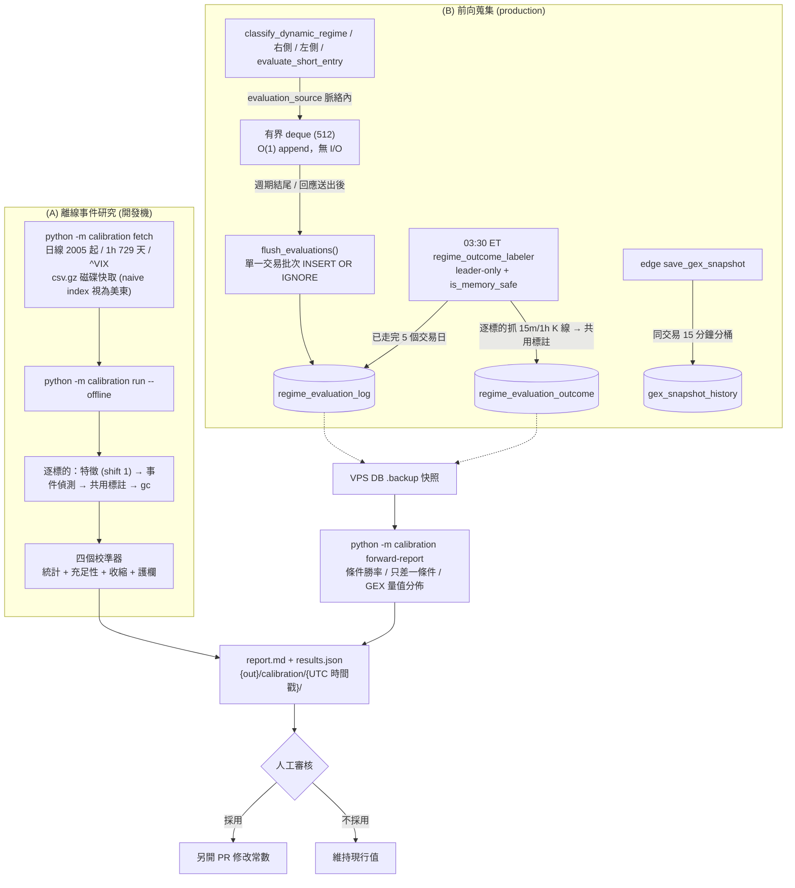

# 回測校準工具與前向蒐集管線規格書

---

## 1. 核心哲學與適用市場環境

### 1.1 為什麼需要兩條路徑
本系統大量門檻是「推導值」而非「校準值」：做空 VIX 倒 U 形乘數、做空凱利勝率先驗、`_REGIME_V_RSI_MAX = 45`（對 Regime III 的 55 以 50 為軸鏡像）、空間門檻的 ATR 倍數。它們需要歷史證據，但證據的可得性分成兩類：

| 條件類型 | 例子 | 可否回測 | 原因 |
| :--- | :--- | :--- | :--- |
| 純價格／量能／VIX | RSI、VWAP、放量、ATR、掃描器訊號、VIX 階梯 | **現在就能回測** | yfinance 日線數十年、1h 約 730 天、`^VIX` 日線數十年 |
| GEX 相關 | Put Wall、Call Wall、Gamma Flip、次級負 GEX 節點、$2.2 \times \text{Risk}$ | **無法回測** | edge `gex_snapshot` 與 core `kv_cache gex_metrics_*` 全是 upsert、只留最新值；Regime 分類與進場評估從未被記錄 |

因此校準分成兩條互補的路徑：

1. **(A) 離線事件研究** (`nexus_core/calibration/`)：以純價格代理 GEX 條件，立即對價格／VIX 相關參數產出建議。
2. **(B) 前向蒐集** (production)：從現在開始記錄每次評估「當下實際使用」的 GEX 數值，由離峰排程回填事後走勢；資料累積數週後，GEX 相關門檻才有真正的證據。

### 1.2 工具永不自動改參數
兩條路徑的輸出**只有報告**（`report.md` / `results.json`）。任何常數變更都必須人工審核後另開 PR；工具不寫入程式碼、不寫入資料庫（`test_calibration_report_and_offline.py` 以 AST 掃描強制）。統計上「建議值」與「應採用值」之間隔著倖存者偏差、代理薄弱、多重比較與未模擬選擇權損益，這個判斷必須由人做。

### 1.3 適用環境
- (A) 在**開發機**執行，不在 1GB VPS 上跑。啟動時檢查 `is_memory_safe()`，逐標的處理、以 float32 載入快取，目標峰值 < 300MB。
- (B) 在 production 常駐：熱路徑只做 O(1) 緩衝區 append，標註排程 03:30 ET、leader-only、記憶體閘門保護。

---

## 2. 數學模型與量化推導

### 2.1 事件定義與無前視約束
事件在 K 棒 $t$ 收盤時成立，**進場價為次一根開盤** $O_{t+1}$；VIX 取進場前最後一個已收盤交易日。日線特徵一律 `shift(1)` 後才對應到交易日 $D$。純價格代理：

$$
\begin{aligned}
\text{PutWall} &\approx \min_{i \in [D-10, D-1]} \text{Low}_i, \qquad \text{CallWall} \approx \max_{i \in [D-10, D-1]} \text{High}_i\\
\text{GammaFlip} &\approx \text{SMA}_{20}(D-1), \qquad \text{NextPutPeak} \approx \min_{i \in [D-60, D-1]} \text{Low}_i\\
\text{ATR}_{15m} &\approx \text{ATR}_{1h} / 2, \qquad \text{RSI}_{15m} \approx \text{RSI}_{1h}
\end{aligned}
$$

事件類型：`SCANNER_BTO_PUT`／`SCANNER_BTO_CALL`（日線，**精確複製** `_determine_strategy_signal`，連續訊號只取第一天）、`REGIME_V_PROXY`／`REGIME_III_PROXY`／`REGIME_I_PROXY`（1h）、`RANDOM_CONTROL`（同數量隨機抽樣，量測 lift）。

### 2.2 方向中性的事後走勢標註
兩條路徑共用 `market_analysis/outcome_labeling.py`。只使用 index **嚴格晚於**進場時點的 K 棒，窗口為進場日與其後 $N = 5$ 個交易日。對 $k \in \{1.0, 1.5, 2.0\}$：

$$\text{touch}_k = \begin{cases}
+1 & \text{High} \ge E + k \cdot \text{ATR}_{1D} \text{ 先發生}\\
-1 & \text{Low} \le E - k \cdot \text{ATR}_{1D} \text{ 先發生}\\
\ \ 2 & \text{同一根 K 棒兩側皆觸及}\\
\ \ 0 & \text{窗口內皆未觸及}
\end{cases}$$

方向由分析端套用：$\text{outcome} = +1$（有利帶先觸及）、$-1$（不利帶先觸及，**同根雙觸一律算不利**）、$0$（逾時）。R 倍數：

$$R = \begin{cases} \text{outcome} & \text{outcome} \ne 0\\ \text{clip}\Big(d \cdot \dfrac{r_{5d}}{k \cdot \text{ATR}_{1D} / E},\ -1,\ 1\Big) & \text{逾時}\end{cases}, \qquad d = \begin{cases}+1 & \text{LONG}\\ -1 & \text{SHORT}\end{cases}$$

凱利先驗改用 $1.8 : 1$ 非對稱屏障（目標 $1.8\,\text{ATR}_{1D}$、停損 $1.0\,\text{ATR}_{1D}$），且**只用已分勝負的樣本**——凱利假設的是二元賭局，把逾時當輸會系統性壓低勝率。

### 2.3 統計推論
**Wilson 區間**（勝率）：

$$\hat p \pm \text{CI} = \frac{\hat p + \frac{z^2}{2n} \pm z\sqrt{\frac{\hat p(1-\hat p)}{n} + \frac{z^2}{4n^2}}}{1 + \frac{z^2}{n}}, \qquad z = 1.96$$

**依交易日叢集的 bootstrap**（期望值）：同一天橫斷面上的事件高度相關，逐筆重抽會嚴重低估區間。以交易日 $c$ 為重抽單位，$B = 2000$、固定 seed：

$$\bar R^{*(b)} = \frac{\sum_{c \in S^{(b)}} \sum_{j \in c} R_j}{\sum_{c \in S^{(b)}} |c|}, \qquad \text{CI}_{95} = [\bar R^*_{2.5\%},\ \bar R^*_{97.5\%}]$$

**充足性**：$n \ge 100$、交易日數 $\ge 30$、且樣本外期望值與樣本內同號。樣本外切點：切點前樣本占比在 $[40\%, 85\%]$ 時用固定切點 `2024-01-01`，否則用事件日期 70% 分位數（1h 資料只有約兩年）。

**收縮估計**（向現行值靠攏）：

$$\theta_{\text{proposed}} = \theta_{\text{current}} + \frac{n}{n + n_0}\big(\hat\theta - \theta_{\text{current}}\big), \qquad n_0 = 200$$

### 2.4 各校準器的估計與護欄
| 參數 | 估計 | 護欄 |
| :--- | :--- | :--- |
| 做空 VIX 乘數 | $\text{clip}\big(\bar R_{\text{tier}} / \bar R_{\text{all short}},\ 0,\ 1\big)$；全體做空期望值 $\le 0$ 時整組不提案 | 夾在 $[0, 1]$；Extreme 永遠維持 $0$，即使 $n \ge 300$ 且 CI 下界 $> 0$ 也只標「需人工政策覆核」 |
| 凱利勝率先驗 | 1.8:1 屏障已分勝負勝率，提案用 Wilson 下界再收縮 | 做空提案 $\le$ 同 RSI 桶做多提案 |
| `_REGIME_V_RSI_MAX` | 訓練期 $\arg\max_\theta \text{CI}_{\text{lo}}(\bar R)$，$\theta \in \{30, 32.5, \dots, 55\}$ | 樣本外期望值須 $> 0$；揭露比較次數 |
| 空間 ATR 倍數 | 最小 $m$ 使 $\text{EV}_{\text{lo}}(m) = p_{\text{lo}} \cdot r - (1 - p_{\text{lo}}) > 0$，$r = m\,\text{ATR}_{1D} / (2.5\,\text{ATR}_{15m})$ | 啟發式，報告列出整條曲線 |
| `_ROOM_ABSOLUTE_FLOOR_PCT` | — | 風險政策，只報告不提案 |

### 2.5 前向蒐集的資料量
每個 15 分鐘週期約 10 列評估（去重鍵 $(\text{symbol}, \text{evaluator}, \text{source}, \text{bar\_ts})$，不含 user_id）：

$$\approx 10 \times 26 = 260 \text{ 列/日} \approx 0.3\text{MB/日}, \qquad \text{保留 365 天} \approx 100\text{MB}$$

標註截點採不依賴交易日曆的保守下限：評估時間早於 $\text{now} - (\lceil 5 \times 7/5 \rceil + 1)$ 日曆日才標註。

---

## 3. 決策邏輯與狀態機 / 流程圖



---

## 4. 關鍵具名常數與物理約束

| 常數名稱 | 數值 / 門檻 | 物理約束與代碼意涵 | 程式碼檔案路徑 |
| :--- | :--- | :--- | :--- |
| `min_events` / `min_dates` | `100` / `30` | 單一參數桶的充足性下限 | `nexus_core/calibration/config.py` |
| `shrinkage_n0` | `200` | 收縮估計的先驗強度 | `nexus_core/calibration/config.py` |
| `n_boot` | `2000` | 叢集 bootstrap 重抽次數（固定 seed） | `nexus_core/calibration/config.py` |
| `oos_split` | `"2024-01-01"` | 預設樣本外切點（占比不合理時改 70% 分位數） | `nexus_core/calibration/config.py` |
| `_SPLIT_MIN_TRAIN_SHARE` / `_SPLIT_MAX_TRAIN_SHARE` | `0.40` / `0.85` | 固定切點可沿用的訓練期占比範圍 | `nexus_core/calibration/stats.py` |
| `hourly_period` | `"729d"` | yfinance 1h 上限 730 天，取 729 避開邊界拒絕 | `nexus_core/calibration/config.py` |
| `KELLY_TARGET_ATR` / `KELLY_STOP_ATR` | `1.8` / `1.0` | 凱利先驗校準的非對稱屏障（對應先驗賠率 1.8） | `nexus_core/calibration/labeling.py` |
| `ROOM_STOP_ATR15_MULT` | `2.5` | 空間倍數校準的停損代理（條件二緩衝下界） | `nexus_core/calibration/labeling.py` |
| `_EXTREME_REVIEW_MIN_N` | `300` | Extreme 做空正期望值「需人工政策覆核」的樣本門檻 | `nexus_core/calibration/calibrators/vix_short.py` |
| `DEFAULT_K_GRID` / `DEFAULT_MAX_SESSIONS` | `(1.0, 1.5, 2.0)` / `5` | 共用標註的屏障倍數與窗口 | `nexus_core/market_analysis/outcome_labeling.py` |
| `LABEL_VERSION` | `1` | 標註定義版本（變更定義時遞增） | `nexus_core/market_analysis/outcome_labeling.py` |
| `_BUFFER_MAXLEN` | `512` | 前向蒐集緩衝上限（flush 長期失敗時丟最舊） | `nexus_core/market_analysis/evaluation_recorder.py` |
| `_REASON_DIGEST_MAX` / `_FEATURES_JSON_MAX` | `512` / `2048` | 單列文字欄位上限（不存完整 GEX Profile） | `nexus_core/market_analysis/evaluation_recorder.py` |
| `ENABLE_REGIME_EVALUATION_LOG` | `true`（環境變數） | 前向蒐集總開關 | `nexus_core/config.py` |
| `_INTRADAY_15M_MAX_AGE_DAYS` | `55` | 超過即改抓 1h K 線標註（15m 上限 60 天） | `nexus_core/services/regime_outcome_labeler.py` |
| `retention_days` / `no_data_days` | `365` / `30` | 評估紀錄與 NO_DATA 標註保留期 | `nexus_core/database/regime_evaluation_log.py` |
| `FORWARD_MIN_ROWS` | `100` | 前向報告每決策類「資料累積中」門檻 | `nexus_core/calibration/forward_log.py` |

---

## 5. 邊界條件、風控熔斷與例外處理

### 5.1 時區陷阱
`services.market_data_service.get_history_df` 回傳的 index 是**去掉時區的美東時間**（例如 1h K 棒 `09:30`）。若當成 UTC：日線日期錯一天、日內時點偏 4–5 小時，直接造成前視或落後。`outcome_labeling._to_utc_index()` 與 `calibration/data_store.to_utc_index()` 一律把 naive index 視為美東；DB 的 `evaluated_at`（`CURRENT_TIMESTAMP`）則為 UTC。兩者皆有迴歸測試。

### 5.2 記錄器永不影響交易路徑
- 只有在 `evaluation_source()` 脈絡內才記錄；單元測試、臨時腳本的呼叫一律略過。
- 所有記錄函式包在 `try/except` 內，失敗只記 debug log。
- 寫入走 `execute_write_many_async` 單一交易；不在持有寫入交易時 `await`，符合單一寫入者不變式。
- `classify_dynamic_regime` 拆成公開包裝與 `_classify_dynamic_regime_impl`，既有 `patch("...classify_dynamic_regime")` 仍命中公開函式。
- 進場鐵律的條件遮罩以正則解析 `條件X✅/❌/⏭️`，屬 best-effort；做空評估直接讀 `ShortEntryEvaluation.conditions`。

### 5.3 容器權限
核心服務映像以 uid 1001 執行，無法寫入 bind-mount 的 repo（通常 uid 1000）。離線工具須以宿主使用者的 uid／gid 執行容器並把 `HOME` 指向可寫目錄（實際指令見貢獻者文件 `AGENTS.md`）；權限不足時 CLI 會印出正確的執行方式並以代碼 2 結束。快取 `nexus_core/.calibration_cache/` 與報告 `nexus_core/reports/` 皆已 gitignore，且刻意不放在 production 的 `/app/data` named volume。

### 5.4 前向報告只讀快照
`forward-report` 透過 `database.connection.get_read_connection()` 讀取 `NEXUS_DB_NAME` 指向的**複製快照**（VPS 上以 `sqlite3 ... ".backup"` 產生），絕不直接讀 production 資料庫檔。

### 5.5 已知限制（報告必須揭露）
1. **倖存者偏差**：標的池取自現在的 watchlist／持倉與固定流動性清單。
2. **GEX 代理薄弱**：(A) 的 GEX 相關建議僅供參考；正式調整須等待 (B) 的資料。
3. **週期代理**：1h RSI 代理 15m RSI；ATR₁₅ₘ 以 ATR₁ₕ/2 近似。
4. **未模擬選擇權損益**：只標註標的價格路徑，不含權利金、Theta、IV Crush 與滑價。
5. **多重比較**：RSI 門檻掃描的訓練期最佳值有偏高傾向。
6. **edge 為選用服務**：離線時 `gex_snapshot_history` 不累積，core 的評估紀錄才是主要資料源。

### 5.6 決定性
`python -m calibration run --offline --seed 7` 在同一份快取上重跑，`results.json`（除 `git_sha` 與產出時間外）必須完全相同；測試以合成資料與 socket 守衛驗證離線流程不發動任何網路連線。

### 5.7 上線後觀察清單
部署後依下表檢查前向紀錄與做空訊號是否正常運作。查詢皆為唯讀，可直接對 VPS 上的資料庫執行（或對 `.backup` 快照執行）。

| 項目 | 何時看 | 正常範圍 | 異常代表什麼 |
| :--- | :--- | :--- | :--- |
| 評估紀錄寫入量 | 部署後第一個交易日收盤 | 每交易日約 $260$ 列（隨做空／動態使用者與候選數增減） | $0$ 列：記錄器未 flush——檢查 `ENABLE_REGIME_EVALUATION_LOG`、log 中的 `[EvalRecorder]` 錯誤 |
| 評估器分佈 | 同上 | 有 `DYNAMIC` 使用者才有 `REGIME_CLASSIFIER`；有 `SHORT_SIDE`／`DYNAMIC` 使用者才有 `ENTRY_SHORT` | 有對應使用者卻為 $0$：評估來源脈絡未設定，或候選來源一直是空的 |
| 結果標註 | 部署後第 6–8 個交易日 03:30 ET 之後 | 出現 `regime_evaluation_outcome` 列，`LABELED` 占比 $\ge 90\%$ | `NO_DATA` 偏高：K 線抓取失敗（yfinance 被擋、edge 離線），或紀錄的 `spot`／ATR 為空 |
| 做空訊號觸發頻率 | 每週 | 稀疏：平均每位做空使用者每週數筆以內 | 每天多筆：閘門過鬆；連續數週為 $0$：確認使用者策略模式、通知頻道與 log 中的 `[SHORT_ENTRY]` 略過原因 |
| VIX 極端區閘門 | 每週 | VIX $\ge 35$ 的交易日沒有任何 `SHORT_ENTRY` 稽核列 | 有：做空乘數閘門失效，立即調查 |
| edge GEX 歷史 | 部署 edge 後第一個交易日 | 每標的每日 $\le 26$ 列 | 超過：分桶去重失效；$0$：edge 離線或 `GEX_HISTORY_ENABLED` 關閉 |
| 資料庫成長 | 每月 | core 約 $0.3\text{MB}$／日、edge 約 $0.8\text{MB}$／日，保留期清理後趨於平穩 | 持續線性成長不回落：03:30 ET 標註任務的保留期清理未執行 |

常用查詢：

```sql
-- 每日寫入量與評估器分佈
SELECT date(evaluated_at) AS d, evaluator, source, COUNT(*) AS n, SUM(decision) AS passed
FROM regime_evaluation_log GROUP BY d, evaluator, source ORDER BY d DESC LIMIT 40;

-- 標註進度與 NO_DATA 占比
SELECT l.evaluator, o.label_status, COUNT(*) AS n
FROM regime_evaluation_log l LEFT JOIN regime_evaluation_outcome o ON o.evaluation_id = l.id
GROUP BY l.evaluator, o.label_status;

-- 做空訊號觸發頻率
SELECT date(created_at) AS d, COUNT(*) AS n, COUNT(DISTINCT user_id) AS users
FROM rollover_audit_log WHERE scenario = 'SHORT_ENTRY' GROUP BY d ORDER BY d DESC LIMIT 30;

-- 做空確認時的 VIX 分佈 (VIX >= 35 應只出現在 decision = 0 或根本不出現在稽核紀錄)
SELECT CASE WHEN vix_spot IS NULL THEN 'unknown' WHEN vix_spot >= 35 THEN '>=35'
            WHEN vix_spot >= 30 THEN '30-35' ELSE '<30' END AS vix_band,
       decision, COUNT(*) AS n
FROM regime_evaluation_log WHERE evaluator = 'ENTRY_SHORT' GROUP BY vix_band, decision;
```

### 5.8 決策準則
工具只產出證據，下列決定一律由人做，並以 PR 落地。原則是**不對稱**：往保守方向調整（降低係數、提高門檻）可以只憑離線證據；往激進方向調整（提高係數、放寬門檻、開啟推播）必須有**前向紀錄**支持，因為離線研究無法驗證 GEX 條件。

**A. 開啟做空訊號推播（`SHORT_ENTRY_DRY_RUN` 改為 `false`）**，須同時成立：

1. `ENTRY_SHORT` 且 `decision = 1` 的已標註紀錄 $\ge 100$ 筆、橫跨 $\ge 30$ 個交易日（`forward-report` 該區段狀態為 `OK`）。
2. 這些紀錄以自身停損／目標計算的結果（`plan_outcome`）勝率，高於其 R:R 中位數對應的損益兩平勝率 $\frac{1}{1 + \text{R:R}}$。
3. `forward-report` 的期望值為正，且高於 §5.9 基準中「隨機做空」的 $-0.089\text{R}$ 至少一個區間寬度的一半——只贏過零還不夠，要贏過「隨便放空」。
4. §5.7 的觸發頻率與 VIX 極端區閘門檢查皆正常。

**B. 修改可校準常數**：

| 參數 | 可以只憑離線報告 | 需要前向紀錄 | 備註 |
| :--- | :--- | :--- | :--- |
| 做空 VIX 乘數 | 調降 | 調升 | Extreme ($\ge 35$) 維持 $0$ 屬政策決定，工具不提案放寬 |
| 凱利勝率先驗 | 調降 | 調升 | 若調降後做空凱利值恆 $\le 0$，等同關閉做空進場——應明確決定是否停用，而不是悄悄改常數 |
| `_REGIME_V_RSI_MAX` | 僅限報告「充足」時 | 是（真實 15m RSI 與 GEX 條件） | 1h RSI 只是代理 |
| 空間 ATR 倍數 | 調高 | 調低 | GEX 牆體在離線研究中只有價格代理 |
| `_ROOM_ABSOLUTE_FLOOR_PCT` | 否 | 否 | 風險政策 |

離線報告的建議值僅在「充足」欄為 ✅ 時才納入考慮；並應以至少 40 檔、涵蓋非多頭年份的標的池重跑確認，而不是只用當下的強勢自選清單。

**D. 開啟 Regime III-B 趨勢延續推播（`REGIME_III_B_DRY_RUN` 改為 `false`）**，須同時成立：

1. `ENTRY_RIGHT_B` 且 `decision = 1` 的已標註紀錄 $\ge 100$ 筆、橫跨 $\ge 30$ 個交易日。該路徑刻意使用**獨立的 evaluator 名稱**（而非沿用 `ENTRY_RIGHT`）：`regime_evaluation_log` 的去重鍵為 `(symbol, evaluator, source, bar_ts)`，同名會讓同一根 K 棒的嚴格／放寬兩套判定互相覆蓋，A/B 分離統計即不可能。
2. `ENTRY_RIGHT_B` 的期望值**高於同期 `ENTRY_RIGHT`**。只贏過零不夠——若放寬後的期望值低於嚴格版，代表多出來的那些進場機會是負向的。
3. `scripts/run_rollover_backtest_2025.py --ab-compare --ab-feature iii_b` 的**索提諾比率不下降**，且「超額報酬 vs 減碼 B&H（下行差對齊）」一列差異為正。總報酬上升但這一列下降，代表 III-B 只是把曝險加回去而未創造 alpha——那用調高 `max_satellite_budget_pct` 就能達成，不需要一條新的進場路徑。
4. `uoa_history` 已累積 $\ge 5$ 個交易日（否則條件四的回看窗實質等同未放寬，樣本代表的不是放寬後的行為）。

> ⚠️ 回測的兩項已知侷限必須計入判讀：回測引擎只有 1h K 線，III-B 的「持續站穩」以 4 根 1h 代理 6 根 15m；且回測引擎**完全沒有 UOA 條件**，因此量測不到條件四回看窗放寬的效果。兩者都使回測**低估** production 的實際觸發頻率，結論應往保守方向折扣。

**2026-09-19 A/B 結果：無法判定，條件 3 視為尚未成立。**（下表為舊判準的總波動對齊數字；2026-09-23 以 Sortino 判準重跑見 §5.12：aggressive Sortino $+0.01$、defensive $-0.02$，結論不變。）

| 模式 | 右側開倉（基準 → III-B） | 超額報酬 vs 減碼 B&H | 獲利因子 |
| :--- | :--- | :---: | :---: |
| aggressive | III 5 次 → III 4 + III-B 1 次（總數不變） | −4.14 → −4.04 pp（**+0.09 pp**） | 1.85 → 1.88 |
| defensive | III 3 次 → III 1 + III-B 3 次（+1 次） | −1.76 → −1.92 pp（**−0.16 pp**） | 3.28 → 3.48 |

- 樣本是個位數；aggressive 的 III-B 並未新增進場，而是比 Regime III 早一根觸發、**取代**了原本的進場。
- 兩個模式方向相反，只看 aggressive 宣稱通過屬於挑選結果。
- 唯一值得記下的訊號是兩個模式的獲利因子都上升（defensive 勝率下降而獲利因子上升），符合「賺賠比改善」的期待形狀，但 n=1~3 只能列為待前向資料驗證的假設。
- 階段 2 是在階段 0／1／3 上線同日提交的（2026-09-18），原本「觀察 4 週前向資料後才開工」的節奏未被遵循。程式碼先行是刻意取捨（乾跑旗標使其對使用者零行為變化），但**上列四項判準一項都不放寬**。

**F. 開啟順勢金字塔加碼推播（`PYRAMID_ADD_DRY_RUN` 改為 `false`）**，須同時成立：

1. 乾跑期累積 $\ge 20$ 個獨立加碼事件。**資料來源是 `rollover_audit_log`（`scenario = 'PYRAMID_ADD'`），不是 `regime_evaluation_log`**——本情境沒有接前向蒐集記錄器，`forward-report` 看不到它，也沒有自動標註。
2. 計數以「同一部位的首次觸發」為單位，而非列數。乾跑時推播被抑制，`dynamic_state_patch` 依設計不會提交（`pyramid_count`／`last_pyramid_at` 永不前進），因此同一部位只要條件持續成立，每個交易日都會被每日去重鍵放行一次、重複入列；次數上限與冷卻在乾跑期**觀察不到**。
3. 以人工比對每個事件之後 5 個交易日的走勢：加碼價位之後先觸及原停損（`ratchet_stop`）的比例，必須低於「風險預算 ÷ 停損距離」模型隱含的損益兩平勝率。條件二不變式保證原始部位無本金風險，所以要驗證的只有**新增那一筆**的期望值。
4. `scripts/run_rollover_backtest_2025.py --ab-compare --ab-feature pyramid` 兩個模式的索提諾比率皆不下降，且「超額報酬 vs 減碼 B&H」差異皆不為負（2026-09-23：aggressive Sortino **1.13 → 1.87**、超額 **+5.45 pp**／defensive $+0.00$、+0.03 pp，加碼僅 4／2 次，屬個位數樣本，見 §5.12，不能單獨構成證據）。

> 若 1~3 項因人工比對成本過高而難以持續，應先把 `PYRAMID_ADD` 接上 `evaluation_recorder`（比照 §5.12 的 `EXIT_*`），讓 03:30 labeler 自動標註，而不是降低門檻。

**E. 檢視週期**：每 4 週跑一次 `forward-report`；每季以同一標的池重跑離線研究，與 §5.9 基準比較。若修改了標註定義，須遞增 `LABEL_VERSION`，新舊結果不可直接比較。

### 5.9 基準：2026-09-16 試跑結果
作為日後比較的起點。條件：使用者自選清單 36 檔（含 TZA、SOXL 等槓桿／反向 ETF 與 IBIT、ETHA 加密 ETF）、日線自 2005 年或上市日起、1h 為 2023-10 至 2026-09、seed $7$、期望值以 $1.5 \times \text{ATR}_{1D}$ 為 $\pm 1\text{R}$。

| 事件 | n | 期望值 R [95% CI] | 相對同方向隨機對照 |
| :--- | :--- | :--- | :--- |
| 隨機對照 LONG | 1082 | $+0.072$ [$+0.010$, $+0.125$] | — |
| 隨機對照 SHORT | 568 | $-0.089$ [$-0.163$, $-0.009$] | — |
| `SCANNER_BTO_CALL` | 5803 | $+0.070$ [$+0.042$, $+0.096$] | $\approx 0$ |
| `SCANNER_BTO_PUT` | 5062 | $-0.031$ [$-0.061$, $-0.002$] | $+0.06$ |
| `REGIME_I_PROXY` | 467 | $+0.107$ [$+0.011$, $+0.200$] | $+0.035$ |
| `REGIME_III_PROXY` | 638 | $+0.001$ [$-0.091$, $+0.102$] | $-0.07$ |
| `REGIME_V_PROXY` | 588 | $-0.176$ [$-0.267$, $-0.082$] | $-0.09$ |

做空期望值依 VIX 階梯（`SCANNER_BTO_PUT` 與 `REGIME_V_PROXY` 合併）：

| 階梯 | 休兵 | 少買 | 摩拳擦掌 | 大買 | 重砲 | All-in |
| :--- | :--- | :--- | :--- | :--- | :--- | :--- |
| n | 1657 | 1493 | 1613 | 554 | 207 | 126 |
| 期望值 R | $-0.018$ | $-0.037$ | $-0.043$ | $-0.060$ | $-0.168$ | $-0.302$ |
| 95% CI | [$-0.071$, $+0.028$] | [$-0.089$, $+0.021$] | [$-0.099$, $+0.013$] | [$-0.150$, $+0.025$] | [$-0.323$, $+0.015$] | [$-0.470$, $-0.134$] |

凱利勝率（$1.8:1$ 屏障、排除逾時）：做多 RSI $\ge 50$ 為 $0.350$ [$0.336$, $0.364$]、做空 RSI $< 50$ 為 $0.280$ [$0.266$, $0.295$]，皆低於 $1.8:1$ 的損益兩平 $0.357$。Regime V 的 RSI 上限在 $30$–$55$ 間期望值皆為負；兩個空間倍數在 $0.5$–$3.0$ 格點內皆無期望值下界為正的設定。排除槓桿／反向／加密 ETF 與上市未滿半年標的（29 檔）後，所有結論方向不變。

**基準解讀**：
- VIX $\ge 35$ 做空乘數為 $0$ 有明確證據（區間完全在零以下）；「中段乘數 $1.0$」的倒 U 形沒有證據支持——做空期望值隨 VIX 單調惡化。
- 現行凱利先驗（做多 $0.55$／$0.45$、做空 $0.45$／$0.40$）以此定義衡量明顯偏樂觀。
- 當時未採用任何建議值、維持 `SHORT_ENTRY_DRY_RUN=true`。理由：標的池偏多頭強勢股、1h 資料全落在多頭年份、GEX 條件僅為價格代理、未模擬選擇權損益。
- 下一步的關鍵證據是前向紀錄中 `ENTRY_SHORT` 真實 GEX 條件的結果，依 §5.8 A 判定。

### 5.10 2025 全年度多資產動態轉倉回測基準
除了單一事件研究外，本模組於 `backtest_engine_2025.py` 與 `scripts/run_rollover_backtest_2025.py` 擴展了投資組合層級的動態轉倉回測架構，以 2025 年（249 交易日 / 1,731 小時 K 線）涵蓋 Alpha（`NVDA`）、Beta（`SPY`）、Other（`GLD`）三類資產，驗證 9 大情境的狀態機流轉，並支援「穩健防禦型（Defensive）」與「動能進攻型（Aggressive Momentum）」雙模式：

- **回測結論**：
  - **穩健防禦型**：實現 +14.61% 總報酬率，最大回撤 13.76%（相較靜態持有基準 16.80% 降低 18.1%），已實現勝率 79.4%、獲利因子 2.43。
  - **動能進攻型**：解鎖晴空萬里（ATH）阻力目標動態擴展（$\max(H_{60}, Spot + 3.0 \times ATR_{1D})$）、5% 現金儲備與 TP1 30% 平倉（保留 70% 衝刺破牆 TP2/TP3），總報酬提升至 **+16.64%**，最大回撤進一步降至 **11.81%**（回撤顯著降低 **29.7%**），已實現勝率達 **83.9%**，獲利因子暴增至 **3.77**（此為引擎早期版本數字；2026-09-23 以現行程式碼與 Sortino 判準重跑：defensive Sortino 1.45、aggressive 1.13，B&H 1.73——**以 Sortino 判讀 defensive 優於 aggressive**，見 `docs/strategies/04` §2.10.1）。
- **微觀結構驗證**：實證 2025-01-10 SL1 結構破位平倉 NVDA，成功避開隨後至 2025 年 4 月達 -37% 的深幅下殺；5 月中旬 GLD 動能衰退（PSQ=5）時資金順利輪動至突破標的 NVDA（PSQ=95, $\Delta\text{EV}=+6.5\%$），5 月下旬再次輪動回 GLD 鎖定總經牛市波段。
- **報告產出**：全量指標與月度損益紀錄輸出於 `nexus_core/reports/report_2025_rollover.md`。

---

### 5.11 自選標的進場顧問 (`WATCHLIST_ADVISOR_DRY_RUN`) 上線觀察與判讀準則

本節衡量的是**投遞品質**（觸發頻率是否在可接受範圍），不是引擎的決策品質；
判讀原則沿用 §5.8 的不對稱性——往保守方向（不放行、收緊門檻）可只憑觀察期
資料，往激進方向（放行推播）須先確認觸發頻率落在合理區間。

**陷阱一：乾跑期的去重是結構性失效的。** 乾跑期間 `save_kv_cache` 從不執行
$\Rightarrow$ `get_kv_cache` 永遠回 `None` $\Rightarrow$ 去重不會抑制任何東西
（與乾跑閘門和去重檢查的先後順序無關）。因此原始紀錄是「鐵律通過次數」而非
「會送出的 DM 數」。盤中 09:30–16:00 共 13 個 30 分鐘週期，一個成立一整天的
setup 會留下最多 13 筆紀錄但只會送 1 則 DM——**直接計數會高估 4～13 倍**，必須
依下方查詢 1 以 (symbol, 日期, evaluator) 離線去重後再判讀。

**陷阱二：不要用 `docker logs` 當主要來源。** `docker-compose.yml` 的
`max-size: "10m"` / `max-file: "3"`（總計 30MB）會在一週內把日誌輪替掉，撈到的
可能只剩最後一兩天。**主要來源是 `regime_evaluation_log`**（見 §6），它是結構化
的且附帶當下實際使用的牆體／ATR／條件遮罩，可直接診斷觸發原因。

**主判準（去重後的實際 DM 總量，非鐵律通過次數）**：

| 去重後 DM／週（全標的加總） | 判定 |
| :--- | :--- |
| $\le 5$ | **放行**（`WATCHLIST_ADVISOR_DRY_RUN` 改為 `false`） |
| $5 \sim 15$ | 收緊後再觀察一週。優先收緊條件三的空間門檻，**不要動去重鍵** |
| $> 15$ | **不放行** |

錨定依據：2025 回測三檔標的全年僅觸發右側 3 次、III-B 0 次、左側 4 次，合計
7 次 $\Rightarrow$ 2.33 次/檔/年，外推至 88 檔約 **3.9 則／週**。該回測未實作
UOA 條件、且以 1h K 線代理 15m，會**低估** production 頻率，5 則/週的放行線
已含餘裕。

**次要指標**：單檔觸發頻率每檔每週 0–2 次（抓「單一標的天天觸發」的異常，
非主判準，見 [`01_dual_watchlist_pipelines.md`](01_dual_watchlist_pipelines.md)
§5.4）；訊號後 5 日前向報酬（`source='WATCHLIST_ADVISOR'` → `forward-report`，
見下方時間軸）；通知關閉率（`advisory_entry_signal` 是否被使用者關掉）；每輪
管線耗時（派發掛在 `for ticker in watchlist` 內逐檔序列評估，88 檔各自發動
六重鐵律的多次網路往返，`_resolve_candidate_radar` 的 `Semaphore(3)` 在序列
呼叫下拿不到併發效益，應遠低於 1800 秒）。

**evaluator → Regime／策略對照表**（`record_gate_reason()` 不寫 `regime` 欄位，
但 `evaluator` 是忠實代理）：

| `evaluator` | 對應 Regime／策略 |
| :--- | :--- |
| `ENTRY_RIGHT` | `REGIME_III_RIGHT_MOMENTUM` / `RIGHT_SIDE` |
| `ENTRY_RIGHT_B` | `REGIME_III_B_TREND_CONTINUATION` |
| `ENTRY_LEFT` | `REGIME_I_LEFT_CATCH` / `LEFT_SIDE` |
| `ENTRY_SHORT` | `REGIME_V_BREAKDOWN_CHASE` / `SHORT_SIDE` |
| `REGIME_CLASSIFIER` | 僅分類，不代表鐵律通過，查詢須排除 |

> ⚠️ 上述 evaluator 同時被 `PORTFOLIO_MONITOR`（持倉監控）與 `SYMBOL_VIEW`
> （`/x` 手動檢核）寫入，下列查詢的 `source = 'WATCHLIST_ADVISOR'` 過濾**不可省**，
> 混在一起算會嚴重高估。

```sql
-- 1. 主判準：去重後的實際 DM 則數
SELECT COUNT(*) AS dm_per_week FROM (
  SELECT DISTINCT symbol, substr(bar_ts, 1, 10) AS d, evaluator
  FROM regime_evaluation_log
  WHERE source = 'WATCHLIST_ADVISOR' AND decision = 1
    AND evaluator IN ('ENTRY_RIGHT', 'ENTRY_RIGHT_B', 'ENTRY_LEFT', 'ENTRY_SHORT')
);

-- 2. 次要：單檔排行（抓「單一標的天天觸發」的異常）
SELECT symbol, COUNT(*) AS n FROM (
  SELECT DISTINCT symbol, substr(bar_ts, 1, 10) AS d, evaluator
  FROM regime_evaluation_log
  WHERE source = 'WATCHLIST_ADVISOR' AND decision = 1
    AND evaluator IN ('ENTRY_RIGHT', 'ENTRY_RIGHT_B', 'ENTRY_LEFT', 'ENTRY_SHORT')
) GROUP BY symbol ORDER BY n DESC LIMIT 15;

-- 3. 健全性：管線確實有在跑（decision=0 的拒絕紀錄應遠多於 decision=1）
SELECT evaluator, decision, COUNT(*) FROM regime_evaluation_log
WHERE source = 'WATCHLIST_ADVISOR' GROUP BY 1, 2 ORDER BY 1, 2;

-- 4. 健全性：乾跑期絕不可燒去重旗標，本列必須為 0
SELECT COUNT(*) FROM kv_cache WHERE key LIKE 'advisory_entry_%';
```

**部署前必做（否則整週觀察空手而回）**：在 VPS 確認 `v075` 確實套用
（`SELECT name FROM sqlite_master WHERE name LIKE 'regime_evaluation%';` 須印出
`regime_evaluation_log` 與 `regime_evaluation_outcome` 兩張表），
`ENABLE_REGIME_EVALUATION_LOG` 未被關閉，且 `/notif_settings` 的
`advisory_entry_signal` 為開啟狀態——關閉時派發在第二道閘門就 `return`，連
前向紀錄都不會寫。

**一週後判讀不了前向報酬**：`regime_outcome_labeler`（03:30 ET）要等已走完
5 個交易日才回填走勢標註，跑滿一週只有第 1～2 天的訊號會被標註；
`forward_log.py` 的 `FORWARD_MIN_ROWS = 100` 會讓樣本不足 100 筆的分組只印
「資料累積中」。**這不阻塞放行決策**——放行閘門本來就只看觸發頻率（上表）；
前向報酬是後續調參與翻轉 `REGIME_III_B_DRY_RUN` 用的，需累積一個月以上才有
統計意義。

**上線閘門**：`pytest tests` 全綠 + 嚴格 mypy 全綠 + `verify_docs_integrity.py`
全綠 + 乾跑滿一週後依上表主判準人工（Opus）判讀。


### 5.12 出場分層前向蒐集 (`EXIT_*`) 與回測功能開關

**為什麼需要**：`SATELLITE_REBALANCE` 在 2025 回測的勝率只有 54.2%，代表結構性停損有近半數可能是被洗盤掃出。
要找出是哪一層在製造假訊號，必須分層統計「觸發後的走勢」。但 `regime_evaluation_log` 原本只記錄 Regime 分類與
進場鐵律，**從未記錄出場分層**；`rollover_audit_log` 也只存 scenario/action，沒有分層、現價與停損價，且只記已推播的指令。

**前向記錄點**：`anti_washout.py::check_satellite_rebalancing_impl` 在 `_generate_rule_based_rebalance_report()`
決定 `exit_tier` 之後、**顧問模式轉換之前**呼叫 `_record_exit_tier()` → `evaluation_recorder.record_exit_signal()`。
記錄的是引擎的原始訊號而非推播結果：B&H 顧問持倉的分層多半被丟棄或改寫為位階告知，但要評估的是訊號本身準不準，
因此照樣記錄，並在 `features_json.advisory` 標記。

| 欄位 | 內容 | 理由 |
| :--- | :--- | :--- |
| `evaluator` | `EXIT_<tier>`，空頭部位加 `_SHORT` 後綴 | 去重鍵不含 user_id；共用 evaluator 會讓同一根 K 棒不同使用者的不同分層互相覆蓋 |
| `direction` | 平倉類分層＝與部位**相反**；`SL_TRAILING_BREAKEVEN`／`TP1_TREND_EXEMPT`＝與部位**相同** | `direction` 是「訊號押注方向」，讓 `forward-report` 的 win 維持「訊號正確」單一語意 |
| `sub_mode` | 分層名稱 | 便於 SQL 篩選 |
| `stop_price` | **刻意留空**，停損價放 `features_json.stop_level` | labeler 的 `plan_outcome` 會把 `stop_price` 當進場計畫的停損解讀，對出場訊號語意不符 |
| `decision` | 恆為 1 | 只記錄觸發事件，不記錄未觸發 |

`forward-report` 新增「出場分層洗盤率」表（`forward_log.py::build_exit_tier_breakdown`），依 evaluator × 顧問旗標分組：
**訊號正確率**（先觸及訊號方向的 1.5×ATR₁D 帶）、**洗盤率**（反向先觸及）、逾時率、5 日報酬中位數。
`EXIT_*` 列會從 GEX 量值四分位分析中排除（win 的語意與進場相反，混入會失真）。

**判讀準則**：
1. 同一分層、`advisory=否` 的已標註紀錄 $\ge 100$ 筆前，只能用來排定觀察優先序，不得調整 SL 常數。
2. 洗盤率顯著高於訊號正確率（Wilson 區間不重疊）的分層，才列為候選調整對象；調整走 `calibration/` 報告 → 人工審核 → PR。
3. 被顧問模式丟棄的分層 (`advisory=是`) 不影響任何使用者，其統計只用來佐證同一分層在指令持倉上的結論。

**回測功能開關（離線先行）**：`backtest_engine_2025.py` 是 production 的獨立複刻，階段 1A／1B／3 上線時沒有同步進來，
因此**跨 commit 對照量不到它們**——舊版與新版回測引擎唯一的差異是 `_MACRO_TOP_ESCAPE_TRIM_RATIO`（0.25 → 0.50，
回測以 VIX ≥ 28 代理 CRITICAL）。現改為在同一版程式碼上以開關做 A/B：

| CLI 旗標 | 複刻內容 | 代理與限制 |
| :--- | :--- | :--- |
| `--enable-tp1-trend-exempt` | TP1 前評估豁免；豁免時不減碼、停損上推至 anchor_base | 牆遷移＝昨日 vs 前日的 10 日高點 |
| `--enable-pyramid-add` | 八項條件；倉位直接呼叫 production `compute_pyramid_add_sizing()` | 冷卻 8 根 15m 換算為 2 根 1h |
| `--enable-escape-tiers` | 以 production `evaluate_macro_top_escape_score()` 分級，取代 VIX ≥ 28 單級減碼；WATCH 以 BSM 定價買 SPY Put | VTS＝VIX/VIX3M、負 Gamma＝SPY 開盤 < SMA20；Fear & Greed 與 FedWatch 無歷史資料恆不計分 |
| `--ab-compare --ab-feature {iii_b,tp1_exempt,pyramid,escape_tiers,stage_1_3}` | 同一版程式碼各跑一次（關／開），輸出兩份報告與摘要 | — |

開關全關時與改動前的引擎逐位元相同（施工時以 HEAD 版引擎對照兩種模式的逐日 NAV 與全部交易紀錄驗證）。
每份回測報告另附「出場分層洗盤率」段落，是前向資料足量前的離線先行版（只有 SL1／SL2，沒有 SL3 主力對沖）。

**2026-09-23 A/B 結果**（判讀依 Sortino 為主、超額報酬 vs 下行差對齊減碼 B&H、MDD／CVaR95 為輔；Sharpe、Calmar 不參與判讀——見 [`../risk_portfolio/07_downside_risk_sortino_var_cvar.md`](../risk_portfolio/07_downside_risk_sortino_var_cvar.md)）。基準線：aggressive Sortino 1.13、defensive 1.45；B&H 1.73。

| 功能 | aggressive：ΔSortino／Δ超額／ΔMDD／ΔCVaR95 | defensive：ΔSortino／Δ超額／ΔMDD／ΔCVaR95 | 判讀 |
| :--- | :---: | :---: | :--- |
| 1A TP1 趨勢豁免 | −0.01／−0.06 pp／0／0 | −0.02／−0.12 pp／+0.01 pp／0 | 個位數觸發，無法判定 |
| 1B PYRAMID_ADD | **+0.74**／**+5.45 pp**／0／+0.02 pp（加碼 4 次） | +0.00／+0.03 pp／0／0（加碼 2 次） | aggressive + 1B 是**唯一在 Sortino 上超越 B&H 的組合**（1.87 > 1.73，超額 +1.01 pp）；仍是個位數觸發，是前向觀察的第一優先 |
| 3 逃頂三級階梯 | **−0.92**／−2.39 pp／−3.54 pp／−0.63 pp | −0.05／+0.18 pp／−1.71 pp／−0.45 pp | 以截斷上行換取低回撤：MDD 與 CVaR 改善，但主指標 Sortino 下降；代理過鬆（WATCH 全年 122–137 天成立、權利金淨損約 $4–5k） |
| 1A + 1B + 3 合併 | −0.08／+1.28 pp／−3.54 pp／−0.58 pp | −0.14／−0.84 pp／−1.71 pp／−0.21 pp | 由 1B 與 3 的交互作用主導；3 抵銷了 1B 的 Sortino 增益 |

> 以舊判準（總波動對齊、Sharpe 參考）時，逃頂分級的「MDD −3.54 pp」曾被視為部分正面；在 Sortino 判準下它是本表最大的負向項，因為它主要砍掉的是上行。

逃頂分級的負向結果主要反映**代理**的問題而非 production 設計：回測的負 Gamma 代理（SPY < SMA20）遠比 production 的
`SHORT_GAMMA_CRITICAL` 寬鬆，而 Fear & Greed 恆不計分又讓「過熱」訊號缺席，逃頂評分在回測中退化成「回檔偵測」。
但它指出一個 production 需要監看的風險：**若 WATCH 在 production 的成立天數也接近一半，保護性 Put 的權利金會持續流失**。
逃頂分級本身沒有被前向蒐集（`regime_evaluation_log.macro_regime` 欄位目前無任何寫入端），上線後以已推播指令的稽核紀錄
追蹤各級動作的實際發生天數（只涵蓋送達的指令，被通知開關或去重抑制者不在內）：
`SELECT action, COUNT(DISTINCT date(created_at)) FROM rollover_audit_log WHERE scenario = 'MACRO_TOP_ESCAPE_DEFENSE' GROUP BY action;`
（`BUY_PROTECTIVE_PUT` = WATCH）。

### 5.13 微結構與 Skew 門檻校準研究 (`micro-snapshot` / `micro-report` / `skew-proxy`)

GEX 牆體深度（D-04）與 Skew 分位門檻都**無法回測**：GEX 快取全是 upsert，歷史期權鏈與個股 25-Delta Skew 歷史都拿不到。這三個子命令在開發機上取得替代資料，只寫 `.calibration_cache/` 與 `reports/calibration/`，不寫 DB、不改程式碼。

| 子命令 | 資料 | 用途 |
|---|---|---|
| `micro-snapshot` | 標的池最近一檔**未到期**（DTE ≥ 1）的期權鏈（與 edge 相同公式重算 GEX：$t \ge 2$ 天、$|\Delta| < 0.02$ 雜訊過濾、$OI \times 100 \times \Gamma \times S^2$），外加 20 日平均成交額、ATR、各到期日推算的週 EM。經 `market_data_service` 抓取（edge 快照 → edge 即時 → 本地 yfinance），期權鏈不裁減履約價 | 每個交易日收盤後跑一次，逐日累積 `microstructure/snapshot_YYYY-MM-DD.jsonl`（以美東日期命名） |
| `micro-report` | 所有快照 + 快照日**之後**的日線 | 牆體深度比分布、新舊薄牆門檻通過率、週 EM 到期日偏差、支撐牆守住率 × 深度四分位（觀察期 5 個交易日，未走完的快照不標註） |
| `skew-proxy` | CBOE ^SKEW × SPY 日線（2000 年起） | 以「日級、252 交易日、只用過去資料的 midrank」計算分位，統計各門檻的觸發率、5 日報酬（bootstrap CI）與 5 日內跌幅 > 3% 的機率 |

執行方式與其他子命令相同（`python -m calibration micro-snapshot --max-symbols 200`、`micro-report`、`skew-proxy`，容器內執行參數見 `AGENTS.md` 的 Testing 段落）。標的池為 watchlist ∪ 固定流動性清單，讀取 watchlist 時 `NEXUS_DB_NAME` 應指向複製的快照。

**`micro-snapshot` 的排程保護**（`snapshot_skip_reason()`，`--any-time` 可略過）：美東當天不是 NYSE 交易日、尚未收盤（半日市以 13:00 ET 為界），或當天快照已存在時直接結束，因此 cron 可以在週一至週五固定時間執行、重跑也安全。另有兩道資料品質保護：
- 當天到期（DTE = 0）的合約在收盤後已結算，不用來算 GEX 牆。
- 期權鏈未平倉量全為 0 的標的不寫入。Yahoo 約在美東午夜到開盤前重置期權鏈（未平倉量歸 0、IV 1e-5），這個時段的資料不代表當日收盤的牆體結構；排程必須在美東當天午夜前完成。

**資料來源的分工**：Droplet 只執行 Discord bot，不跑任何校準任務（1GB RAM，且 Yahoo 封鎖資料中心 IP）。校準資料一律由 edge 服務蒐集：

| 資料 | 蒐集者 | 內容 |
|---|---|---|
| `gex_snapshot_history` | edge 盤中輪詢（每 15 分鐘一個分桶） | bot 實際使用的 GEX 剖面（現價 ±25% 內的履約價）、現價、淨 GEX、Call／Put Wall。保留 180 天 |
| `em_snapshot_history` | edge 收盤後任務 `record_em_snapshot_once()`，美東平日 16:20～20:00 之間每天一次 | 追蹤標的在 DTE 1～14 各到期日（最多 6 檔）的價平跨式：取 Call 與 Put 都有報價、最接近收盤價的共同履約價，mid 定義與 core 相同。每個 (標的, 交易日, 到期日) 只保留第一筆；以 DB 判斷當天是否已完成，服務重啟不重抓；完全沒抓到資料時 5 分鐘後重試。保留 180 天 |

edge 不處理國定假日（維持輕量、不引入 NYSE 行事曆），假日與盤外的紀錄由 `calibration/edge_history.py` 依 NYSE 行事曆濾除。時間窗在美東 20:00 結束，避開 Yahoo 的夜間重置。

**`micro-report --source edge`（預設）**：經 `TUNNEL_URL` 呼叫 edge 的 `/api/v1/cache/history/symbols`、`/api/v1/cache/gex/history/{symbol}`、`/api/v1/cache/em/history/{symbol}`（皆分頁讀完），或以 `--edge-db` 直接讀取從 edge 主機複製來的 `edge_cache.db`（以 `connect_external_readonly()` 唯讀開啟）。每個標的、每個交易日取盤中最後一個 15 分鐘分桶作為當日收盤的牆體結構，支撐牆取現價下方淨 GEX 最大正值；20 日平均成交額與 ATR 以快照日當天（含）之前的日線計算，無前視偏差。由於 edge 的 GEX 歷史自前向蒐集上線起就在累積，報告不必從零開始等待，已走完 5 個交易日觀察期的日期可以直接標註守住率。`--source snapshot` 讀取 `micro-snapshot` 的快取，保留給開發機臨時量測使用。

**前向蒐集新欄位**：`regime_evaluation_log.features_json` 於 `REGIME_CLASSIFIER` 與右側／左側進場閘門紀錄中加入 `support_wall`、`support_gex`（現價下方淨 GEX 最大正值，不套薄牆門檻）、`put_wall_gex`、`adv_dollar_20d`，以及閘門紀錄的 `skew_percentile`、`skew_percentile_source`（`CANONICAL`／`INTRADAY_FALLBACK`，雷達快速路徑可能為空，可由 `sentiment_daily_canonical` 在該日之前的筆數離線推回）。有了這些欄位，production 資料就能以事後走勢驗證牆體深度比與 Skew 門檻。

**基準結果（2026-09-22 單日快照，106 檔；^SKEW 2000-01 ~ 2026-09，6,586 個交易日）**：

- **D-03 週 EM**：以 1-DTE 推算的週 EM 中位數比直接量測的約 7-DTE 高 26%、3-DTE 高 20%，4–14 DTE 約 5%。已改為取最接近 7 DTE 的到期日（見 `valuation_pricing/02_expected_move_and_max_pain.md`）。
- **D-04 牆體深度比**：94 面支撐牆的深度比中位數約 $1.6\times10^{-4}$，p10 約 $10^{-6}$；$< 10^{-5}$ 的牆幾乎都距現價 8–66%。舊 500k 絕對門檻通過率 81.9%，新門檻 76.6%。差異全部落在 ADV \$500M–\$5B 組（84.3% → 74.5%，剔除 ORCL／CRM／XOM／COST 等遠處薄牆）；ADV > \$5B 與 < \$500M 兩組不變。
- **Skew 門檻（指數層級代理）**：日級母體下 ≥98 分位的觸發率為 4.9%（連續觸發算一次則為 146 段），高於「2%」的直覺值，因為分位序列有趨勢。高分位日之後 SPY 的 5 日跌幅 > 3% 機率（≥98：10.3%、≥90：9.9%、≥85：9.4%）**不高於**基準的 11.6%，5 日報酬 CI 都與基準重疊；反而低分位日（≤5：18.4%）的下跌風險較高（低 SKEW 常與高 VIX 的恐慌期重疊）。**結論：代理資料不支持 handoff 提議的 97.5／88／82 調降**（調降只會增加觸發、沒有預測力依據），現行門檻維持不變；是否調整以個股日級母體的前向蒐集資料為準。

**`forward-report` 的門檻前向驗證**：報告新增「門檻前向驗證」段落（`forward_log.build_threshold_studies()`），從 `features_json` 取出上述欄位，輸出兩張表：
- 牆體深度比（`support_gex × 0.01 ÷ adv_dollar_20d`）四分位 × 勝率／逆向先觸及率；
- Skew 分位依現行門檻區間（$<15$、15–85、85–90、90–98、$\ge 98$）× 勝率，並依母體來源（`CANONICAL`／`INTRADAY_FALLBACK`）分開統計——兩者的分位語意不同，混在一起無法判讀。

每組 $n < 100$ 時標示「資料累積中」。EXIT_* 紀錄不納入（其勝率語意與進場相反）。

**上線檢查清單**（部署 v080 與本節功能時）：
1. 部署前先備份 production DB：03:00 ET 的保留期清理首次執行時會刪除 60 個交易日以前的 `sentiment_history`，刪除後無法復原（v080 回填在 migration 階段執行，順序上不受影響）。
2. 部署後以 `.backup` 取得快照，確認 `sentiment_daily_canonical` 回填了多少標的、每標的多少個交易日；回填 0 筆代表舊資料都落在盤外時段或只有舊 `SKEW` 序列，屬預期情形，由每日排程累積。
3. 次一交易日確認 16:15 ET 的 `📸 [Canonical 日級快照]` 與 08:45 ET 的補寫日誌都有出現。
4. 部署新版 edge 後，第一個交易日收盤後確認 edge 日誌出現 `[em_snapshot] … 寫入 N 筆到期日跨式`。edge 離線的日子不會有 EM 與 GEX 歷史，只會少樣本，不影響其他日的標註。

**判讀準則**：
- `GEX_WALL_MIN_DEPTH_RATIO`：累積 ≥ 20 個快照日後看 `micro-report` 的守住率 × 深度四分位。若 Q1（最淺）與 Q2 的守住率相近且顯著高於「未測試」基準，代表門檻過嚴、可下調；若 Q2 仍明顯低於 Q3/Q4，代表門檻應上調到 Q2/Q3 分界。每組至少 30 次 tested 才下結論。
- Skew 門檻：日級母體成熟（`skew_is_canonical`）的標的累積 ≥ 60 個交易日後，以 `features_json.skew_percentile` 分組比較閘門紀錄的事後走勢（`regime_evaluation_outcome`）。高分位組的逆向觸碰率須顯著高於基準（bootstrap CI 不重疊）才有調整依據。

### 5.14 通知成效前向評估 (`notification_dispatch_log` / `notif-report`)

**問題**：每個通知頻道「讓使用者照做」究竟改善還是傷害了 B&H 投組的下行風險表現，過去沒有任何資料可以回答。回測只能評估引擎，看不到使用者實際收到、實際可能照做的訊號。

**資料流**：
1. `services/notification_dispatcher.notify()` / `notify_many()` 的呼叫端對**帶標的且可行動**的推播傳入 `record=DispatchRecord(...)`（動態轉倉指令經 `rollover_dispatch_record()` 映射、DITM 獲利鎖定、Covered Call 解套、自選進場顧問、SEC 論點破滅、價量突破）。只有**實際入列之後**才記錄：頻道關閉、去重擋下、乾跑抑制、入列失敗都不記錄；只有 leader 實例記錄（`bot._is_leader_instance is True`，單元測試的 mock bot 不會污染資料）。
2. 紀錄進有界 deque，於各排程週期結尾一次批次寫入 `notification_dispatch_log`（v083，唯一鍵：使用者／頻道／標的／情境／動作／交易日）。`ENABLE_NOTIFICATION_DISPATCH_LOG=false` 時完全 no-op。
3. 03:30 ET `run_dispatch_outcome_labeling()`：送達已滿 20 個交易日（`market_time.get_trading_days_ago_utc(21)` 截點）且非 INFO 的紀錄，以日線計算「照做」與「持有不動」兩條逐日報酬路徑（`market_analysis/notification_outcome.py`），寫入 `notification_dispatch_outcome`。資料不足時延後重試，超過 90 天仍不足才標 `NO_DATA`。**延伸視窗**：已以 20 日標註者，滿 60 個交易日後以 60 日路徑覆寫同一列（送達後 150 天內持續重試；逾期則保留 20 日結果）。20 日路徑恰為 60 日路徑的前 21 期，兩個視窗可直接並列比較。
4. 開發機以 `python -m calibration notif-report --snapshot-db <快照>` 產出報告；**只讀快照、不寫 DB、不改參數**。

**反事實建構**（每則通知獨立、1 單位名目部位；現金報酬為 $R_f = 4.5\%$）：

| 訊號 | 持有不動曝險 | 照做曝險 | 來源 |
| :--- | :---: | :---: | :--- |
| ENTRY | $0$ | $\pm$ratio | 進場顧問、`OPEN_PYRAMID`、`OPEN_SHORT`、價量向上突破 |
| REDUCE | $1$ | $1 - $ratio | 轉倉 `REDUCE`（`sell_ratio`）、Covered Call 解套（ratio = 0.3，典型價外 call 的 Delta） |
| EXIT | $1$ | $0$ | `LIQUIDATE`、結構失效類顧問告知（`SL*`）、DITM 獲利鎖定、SEC 論點破滅、價量向下跌破、保護性 Put（上限近似） |
| INFO | — | — | `HOLD`、`BTC`、目標區顧問告知、所有期權部位指令（標的價格路徑無法近似期權損益） |

路徑起點無前視：送達於美東 16:00 前，當日收盤為第一個觀測；之後則從下一個交易日開始。參考價優先用送達當下價格，缺值時用第一個觀測日之前最後一根收盤。

**報告合併**：同一 (頻道, 情境, 視窗) 內把所有事件的逐日報酬**串接成一條序列**再計算 Sortino（MAR = $R_f$）與 CVaR95，而不是逐筆計算後平均——單一事件只有 21 個觀測，逐筆 Sortino 會被下行差接近 0 的極端小樣本主導，也不足以估計 95% 尾部。MDD 與總報酬由截斷後的序列重算，取逐事件差的平均。信賴區間以事件為單位 bootstrap 重抽樣（保留事件內的時間相關性；固定 seed，可重現）。

**雙視窗**：報告並列 20 日（全部已標註事件，取前 21 期）與 60 日（已延伸者）。防護類訊號（停損、逃頂、基本面出場）的價值常在更長期間才顯現——2025 年 NVDA 在 SL1 結構失效出場後三個月才跌到 −37%——只看 20 日會系統性低估它們；減碼類訊號的機會成本同樣可能在 60 日才完整顯現。**兩個視窗結論相反時視為無法判定。**

**判讀準則**（Sortino 為主，見 [`../risk_portfolio/07_downside_risk_sortino_var_cvar.md`](../risk_portfolio/07_downside_risk_sortino_var_cvar.md)）：

| 條件 | 結論 |
| :--- | :--- |
| 該組已標註事件 $< 20$ | 樣本不足，只描述不判讀 |
| ΔSortino 95% CI 上界 $\le 0$，且 ΔCVaR95 $\ge 0$（照做沒有降低尾部損失） | **建議該頻道（或該情境）在 B&H 預設情境下關閉**——人工審核後另開 PR 調整註冊表，工具不自動改 |
| ΔSortino 95% CI 下界 $> 0$ | 照做顯著改善 Sortino，維持開啟 |
| 其他 | 無法判定，繼續累積 |

ΔMDD 與 Δ總報酬只作輔助描述：B&H 使用者最在意的是「照做是否以截斷上行換取低回撤」，這正是 Sortino 會抓出、而 MDD 單獨看不出的情形。

**已知限制**：反事實忽略交易成本與稅；轉倉類指令（機會成本、核心資金部署）只評估「賣出來源標的」這一腿，不含買進目標標的；ENTRY 以 1 單位計，與實際倉位模型不同；保護性 Put 以「完全出場」近似會高估其效果；空頭部位的 REDUCE／EXIT 需指令帶 `direction == "SHORT"` 才會取負號（目前只有做空進場指令帶此欄位）。

---

## 6. 核心程式碼檔案路徑關聯

- **離線事件研究** (`nexus_core/calibration/`)
  - `nexus_core/calibration/__main__.py`：CLI（`fetch | run | forward-report | all | micro-snapshot | micro-report | skew-proxy | notif-report`）
  - `nexus_core/calibration/notif_report.py`：通知成效「照做 vs 持有」報告（§5.14）
  - `nexus_core/calibration/microstructure.py`：GEX 牆體深度與週 EM 統計、守住率標註（§5.13）
  - `nexus_core/calibration/edge_history.py`：讀取 edge 的 GEX／EM 歷史並轉成每日快照（§5.13）
  - `nexus_core/calibration/skew_proxy.py`：^SKEW 代理的 Skew 分位門檻研究（§5.13）
  - `nexus_core/calibration/pipeline.py`：`fetch_all()`、`process_symbol()`、`run_event_study()`
  - `nexus_core/calibration/features.py`、`nexus_core/calibration/events.py`：特徵與事件偵測（`scanner_signal()` 複製版）
  - `nexus_core/calibration/labeling.py`、`nexus_core/calibration/stats.py`：方向化標註與統計
  - `nexus_core/calibration/parameter_registry.py`：可校準參數登錄表
  - `nexus_core/calibration/calibrators/vix_short.py`、`kelly_priors.py`、`rsi_threshold.py`、`room_atr.py`
  - `nexus_core/calibration/forward_log.py`：前向蒐集報告
  - `nexus_core/calibration/report.py`：報告輸出與路徑限制
  - `nexus_core/calibration/backtest_engine_2025.py`：2025 全年度多資產動態轉倉回測引擎
  - `nexus_core/scripts/run_rollover_backtest_2025.py`：回測執行入口腳本（`--enable-trend-continuation`／`--enable-tp1-trend-exempt`／`--enable-pyramid-add`／`--enable-escape-tiers` 啟用各功能複刻；`--ab-compare --ab-feature <功能>` 在同一版程式碼上跑出基準線／啟用兩份報告與差異摘要，見 §5.12）
  - `nexus_core/reports/report_2025_rollover.md`：2025 全量回測報告
- **共用標註**：`nexus_core/market_analysis/outcome_labeling.py`
- **前向蒐集 (core)**
  - `nexus_core/market_analysis/evaluation_recorder.py`：熱路徑記錄器。`_LONG_ENTRY_REGIMES` 是「會放行多頭新開倉」的 Regime 白名單——新增這類 Regime 時必須同步加入，否則它會被記成 `direction=None` / `decision=0`，該路徑的校準資料靜默歸零。`record_exit_signal()`／`HOLD_EXIT_TIERS` 為出場分層記錄（§5.12）
  - `nexus_core/market_analysis/dynamic_rollover/anti_washout.py`：`_record_exit_tier()` 出場分層記錄點（顧問模式轉換之前）
  - `nexus_core/database/migrations/v075_add_regime_evaluation_log.py`：資料表定義
  - `nexus_core/database/regime_evaluation_log.py`：存取層
  - `nexus_core/services/regime_outcome_labeler.py`：事後走勢標註；`run_dispatch_outcome_labeling()` 為通知送達紀錄的反事實標註（§5.14）
  - `nexus_core/services/notification_dispatch_recorder.py`：通知送達記錄器（`DispatchRecord`、`rollover_dispatch_record()`、`flush_dispatch_records()`）
  - `nexus_core/market_analysis/notification_outcome.py`：「照做 vs 持有」反事實路徑（純函式，labeler 與報告共用）
  - `nexus_core/database/migrations/v083_add_notification_dispatch_log.py`、`nexus_core/database/notification_dispatch_log.py`：通知送達紀錄資料表與存取層
  - `nexus_core/cogs/trading/scheduler.py`：`regime_outcome_labeler`（03:30 ET）
  - `nexus_core/cogs/trading/portfolio_monitor.py`、`nexus_core/cogs/unified_terminal/symbol_view.py`：評估來源標記與 flush
- **前向蒐集 (edge)**：`nexus_edge_scraper/database.py`（`gex_snapshot_history`、`em_snapshot_history`）、`nexus_edge_scraper/scheduler.py`（盤中 GEX 輪詢、收盤後 `record_em_snapshot_once()`）、`nexus_edge_scraper/local_api/cache_and_sync.py`（歷史端點）
- **測試**：`nexus_core/tests/unit/test_outcome_labeling.py`、`test_regime_evaluation_forward_collection.py`、`test_calibration_events.py`、`test_calibration_stats.py`、`test_calibration_registry.py`、`test_calibration_report_and_offline.py`、`test_calibration_backtest_feature_flags.py`、`test_exit_tier_forward_collection.py`、`test_calibration_microstructure.py`、`test_calibration_edge_history.py`、`test_notification_dispatch_outcome.py`、`nexus_edge_scraper/tests/test_em_snapshot.py`、`nexus_core/tests/unit/test_rollover_backtest_2025.py`
