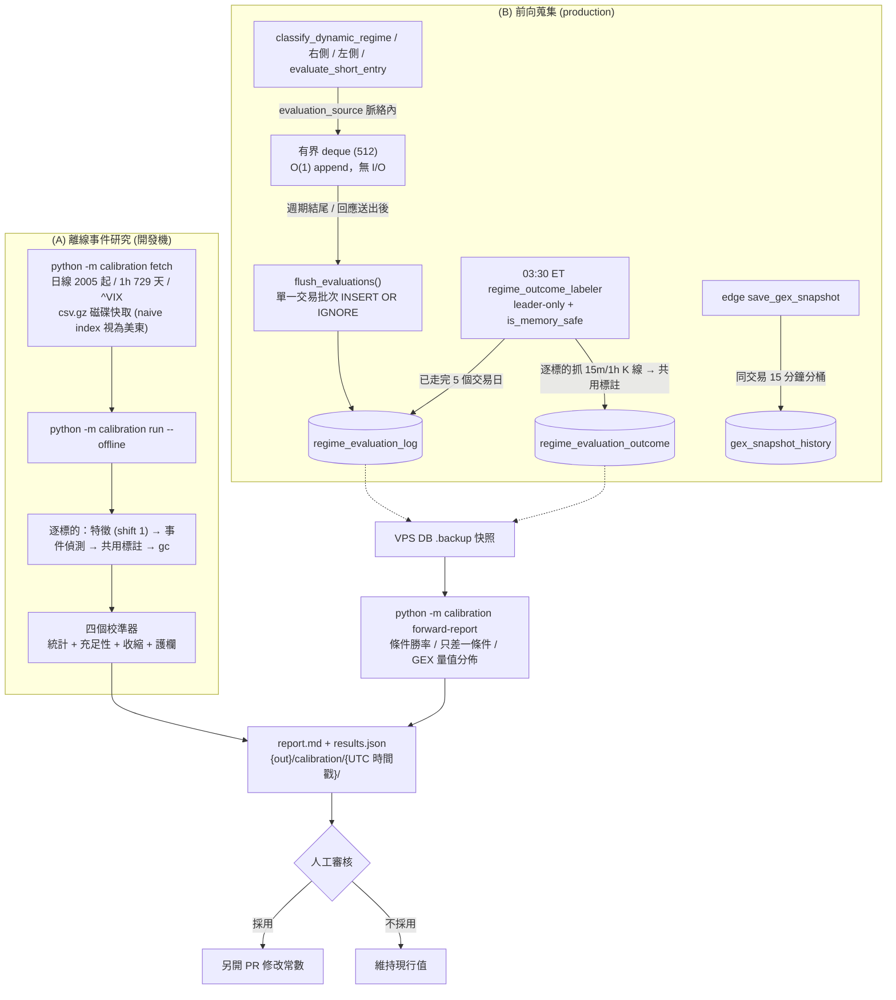

# 回測校準工具與前向蒐集管線規格書

---

## 1. 核心哲學與適用市場環境

### 1.1 為什麼需要兩條路徑
本系統大量門檻是「推導值」而非「校準值」：做空 VIX 倒 U 形乘數、做空凱利勝率先驗、`_REGIME_V_RSI_MAX = 45`（對 Regime III 的 55 以 50 為軸鏡像）、空間門檻的 ATR 倍數。它們需要歷史證據，但證據的可得性分成兩類：

| 條件類型 | 例子 | 可否回測 | 原因 |
| :--- | :--- | :--- | :--- |
| 純價格／量能／VIX | RSI、VWAP、放量、ATR、掃描器訊號、VIX 階梯 | **現在就能回測** | yfinance 日線數十年、1h 約 730 天、`^VIX` 日線數十年 |
| GEX 相關 | Put Wall、Call Wall、Gamma Flip、次級負 GEX 節點、$2.2 \times \text{Risk}$ | **無法回測** | edge `gex_snapshot` 與 core `kv_cache gex_metrics_*` 全是 upsert、只留最新值；Regime 分類與進場評估從未被記錄 |

因此校準分成兩條互補的路徑：

1. **(A) 離線事件研究** (`nexus_core/calibration/`)：以純價格代理 GEX 條件，立即對價格／VIX 相關參數產出建議。
2. **(B) 前向蒐集** (production)：從現在開始記錄每次評估「當下實際使用」的 GEX 數值，由離峰排程回填事後走勢；資料累積數週後，GEX 相關門檻才有真正的證據。

### 1.2 工具永不自動改參數
兩條路徑的輸出**只有報告**（`report.md` / `results.json`）。任何常數變更都必須人工審核後另開 PR；工具不寫入程式碼、不寫入資料庫（`test_calibration_report_and_offline.py` 以 AST 掃描強制）。統計上「建議值」與「應採用值」之間隔著倖存者偏差、代理薄弱、多重比較與未模擬選擇權損益，這個判斷必須由人做。

### 1.3 適用環境
- (A) 在**開發機**執行，不在 1GB VPS 上跑。啟動時檢查 `is_memory_safe()`，逐標的處理、以 float32 載入快取，目標峰值 < 300MB。
- (B) 在 production 常駐：熱路徑只做 O(1) 緩衝區 append，標註排程 03:30 ET、leader-only、記憶體閘門保護。

---

## 2. 數學模型與量化推導

### 2.1 事件定義與無前視約束
事件在 K 棒 $t$ 收盤時成立，**進場價為次一根開盤** $O_{t+1}$；VIX 取進場前最後一個已收盤交易日。日線特徵一律 `shift(1)` 後才對應到交易日 $D$。純價格代理：

$$
\begin{aligned}
\text{PutWall} &\approx \min_{i \in [D-10, D-1]} \text{Low}_i, \qquad \text{CallWall} \approx \max_{i \in [D-10, D-1]} \text{High}_i\\
\text{GammaFlip} &\approx \text{SMA}_{20}(D-1), \qquad \text{NextPutPeak} \approx \min_{i \in [D-60, D-1]} \text{Low}_i\\
\text{ATR}_{15m} &\approx \text{ATR}_{1h} / 2, \qquad \text{RSI}_{15m} \approx \text{RSI}_{1h}
\end{aligned}
$$

事件類型：`SCANNER_BTO_PUT`／`SCANNER_BTO_CALL`（日線，**精確複製** `_determine_strategy_signal`，連續訊號只取第一天）、`REGIME_V_PROXY`／`REGIME_III_PROXY`／`REGIME_I_PROXY`（1h）、`RANDOM_CONTROL`（同數量隨機抽樣，量測 lift）。

### 2.2 方向中性的事後走勢標註
兩條路徑共用 `market_analysis/outcome_labeling.py`。只使用 index **嚴格晚於**進場時點的 K 棒，窗口為進場日與其後 $N = 5$ 個交易日。對 $k \in \{1.0, 1.5, 2.0\}$：

$$\text{touch}_k = \begin{cases}
+1 & \text{High} \ge E + k \cdot \text{ATR}_{1D} \text{ 先發生}\\
-1 & \text{Low} \le E - k \cdot \text{ATR}_{1D} \text{ 先發生}\\
\ \ 2 & \text{同一根 K 棒兩側皆觸及}\\
\ \ 0 & \text{窗口內皆未觸及}
\end{cases}$$

方向由分析端套用：$\text{outcome} = +1$（有利帶先觸及）、$-1$（不利帶先觸及，**同根雙觸一律算不利**）、$0$（逾時）。R 倍數：

$$R = \begin{cases} \text{outcome} & \text{outcome} \ne 0\\ \text{clip}\Big(d \cdot \dfrac{r_{5d}}{k \cdot \text{ATR}_{1D} / E},\ -1,\ 1\Big) & \text{逾時}\end{cases}, \qquad d = \begin{cases}+1 & \text{LONG}\\ -1 & \text{SHORT}\end{cases}$$

凱利先驗改用 $1.8 : 1$ 非對稱屏障（目標 $1.8\,\text{ATR}_{1D}$、停損 $1.0\,\text{ATR}_{1D}$），且**只用已分勝負的樣本**——凱利假設的是二元賭局，把逾時當輸會系統性壓低勝率。

### 2.3 統計推論
**Wilson 區間**（勝率）：

$$\hat p \pm \text{CI} = \frac{\hat p + \frac{z^2}{2n} \pm z\sqrt{\frac{\hat p(1-\hat p)}{n} + \frac{z^2}{4n^2}}}{1 + \frac{z^2}{n}}, \qquad z = 1.96$$

**依交易日叢集的 bootstrap**（期望值）：同一天橫斷面上的事件高度相關，逐筆重抽會嚴重低估區間。以交易日 $c$ 為重抽單位，$B = 2000$、固定 seed：

$$\bar R^{*(b)} = \frac{\sum_{c \in S^{(b)}} \sum_{j \in c} R_j}{\sum_{c \in S^{(b)}} |c|}, \qquad \text{CI}_{95} = [\bar R^*_{2.5\%},\ \bar R^*_{97.5\%}]$$

**充足性**：$n \ge 100$、交易日數 $\ge 30$、且樣本外期望值與樣本內同號。樣本外切點：切點前樣本占比在 $[40\%, 85\%]$ 時用固定切點 `2024-01-01`，否則用事件日期 70% 分位數（1h 資料只有約兩年）。

**收縮估計**（向現行值靠攏）：

$$\theta_{\text{proposed}} = \theta_{\text{current}} + \frac{n}{n + n_0}\big(\hat\theta - \theta_{\text{current}}\big), \qquad n_0 = 200$$

### 2.4 各校準器的估計與護欄
| 參數 | 估計 | 護欄 |
| :--- | :--- | :--- |
| 做空 VIX 乘數 | $\text{clip}\big(\bar R_{\text{tier}} / \bar R_{\text{all short}},\ 0,\ 1\big)$；全體做空期望值 $\le 0$ 時整組不提案 | 夾在 $[0, 1]$；Extreme 永遠維持 $0$，即使 $n \ge 300$ 且 CI 下界 $> 0$ 也只標「需人工政策覆核」 |
| 凱利勝率先驗 | 1.8:1 屏障已分勝負勝率，提案用 Wilson 下界再收縮 | 做空提案 $\le$ 同 RSI 桶做多提案 |
| `_REGIME_V_RSI_MAX` | 訓練期 $\arg\max_\theta \text{CI}_{\text{lo}}(\bar R)$，$\theta \in \{30, 32.5, \dots, 55\}$ | 樣本外期望值須 $> 0$；揭露比較次數 |
| 空間 ATR 倍數 | 最小 $m$ 使 $\text{EV}_{\text{lo}}(m) = p_{\text{lo}} \cdot r - (1 - p_{\text{lo}}) > 0$，$r = m\,\text{ATR}_{1D} / (2.5\,\text{ATR}_{15m})$ | 啟發式，報告列出整條曲線 |
| `_ROOM_ABSOLUTE_FLOOR_PCT` | — | 風險政策，只報告不提案 |

### 2.5 前向蒐集的資料量
每個 15 分鐘週期約 10 列評估（去重鍵 $(\text{symbol}, \text{evaluator}, \text{source}, \text{bar\_ts})$，不含 user_id）：

$$\approx 10 \times 26 = 260 \text{ 列/日} \approx 0.3\text{MB/日}, \qquad \text{保留 365 天} \approx 100\text{MB}$$

標註截點採不依賴交易日曆的保守下限：評估時間早於 $\text{now} - (\lceil 5 \times 7/5 \rceil + 1)$ 日曆日才標註。

---

## 3. 決策邏輯與狀態機 / 流程圖



---

## 4. 關鍵具名常數與物理約束

| 常數名稱 | 數值 / 門檻 | 物理約束與代碼意涵 | 程式碼檔案路徑 |
| :--- | :--- | :--- | :--- |
| `min_events` / `min_dates` | `100` / `30` | 單一參數桶的充足性下限 | `nexus_core/calibration/config.py` |
| `shrinkage_n0` | `200` | 收縮估計的先驗強度 | `nexus_core/calibration/config.py` |
| `n_boot` | `2000` | 叢集 bootstrap 重抽次數（固定 seed） | `nexus_core/calibration/config.py` |
| `oos_split` | `"2024-01-01"` | 預設樣本外切點（占比不合理時改 70% 分位數） | `nexus_core/calibration/config.py` |
| `_SPLIT_MIN_TRAIN_SHARE` / `_SPLIT_MAX_TRAIN_SHARE` | `0.40` / `0.85` | 固定切點可沿用的訓練期占比範圍 | `nexus_core/calibration/stats.py` |
| `hourly_period` | `"729d"` | yfinance 1h 上限 730 天，取 729 避開邊界拒絕 | `nexus_core/calibration/config.py` |
| `KELLY_TARGET_ATR` / `KELLY_STOP_ATR` | `1.8` / `1.0` | 凱利先驗校準的非對稱屏障（對應先驗賠率 1.8） | `nexus_core/calibration/labeling.py` |
| `ROOM_STOP_ATR15_MULT` | `2.5` | 空間倍數校準的停損代理（條件二緩衝下界） | `nexus_core/calibration/labeling.py` |
| `_EXTREME_REVIEW_MIN_N` | `300` | Extreme 做空正期望值「需人工政策覆核」的樣本門檻 | `nexus_core/calibration/calibrators/vix_short.py` |
| `DEFAULT_K_GRID` / `DEFAULT_MAX_SESSIONS` | `(1.0, 1.5, 2.0)` / `5` | 共用標註的屏障倍數與窗口 | `nexus_core/market_analysis/outcome_labeling.py` |
| `LABEL_VERSION` | `1` | 標註定義版本（變更定義時遞增） | `nexus_core/market_analysis/outcome_labeling.py` |
| `_BUFFER_MAXLEN` | `512` | 前向蒐集緩衝上限（flush 長期失敗時丟最舊） | `nexus_core/market_analysis/evaluation_recorder.py` |
| `_REASON_DIGEST_MAX` / `_FEATURES_JSON_MAX` | `512` / `2048` | 單列文字欄位上限（不存完整 GEX Profile） | `nexus_core/market_analysis/evaluation_recorder.py` |
| `ENABLE_REGIME_EVALUATION_LOG` | `true`（環境變數） | 前向蒐集總開關 | `nexus_core/config.py` |
| `_INTRADAY_15M_MAX_AGE_DAYS` | `55` | 超過即改抓 1h K 線標註（15m 上限 60 天） | `nexus_core/services/regime_outcome_labeler.py` |
| `retention_days` / `no_data_days` | `365` / `30` | 評估紀錄與 NO_DATA 標註保留期 | `nexus_core/database/regime_evaluation_log.py` |
| `FORWARD_MIN_ROWS` | `100` | 前向報告每決策類「資料累積中」門檻 | `nexus_core/calibration/forward_log.py` |

---

## 5. 邊界條件、風控熔斷與例外處理

### 5.1 時區陷阱
`services.market_data_service.get_history_df` 回傳的 index 是**去掉時區的美東時間**（例如 1h K 棒 `09:30`）。若當成 UTC：日線日期錯一天、日內時點偏 4–5 小時，直接造成前視或落後。`outcome_labeling._to_utc_index()` 與 `calibration/data_store.to_utc_index()` 一律把 naive index 視為美東；DB 的 `evaluated_at`（`CURRENT_TIMESTAMP`）則為 UTC。兩者皆有迴歸測試。

### 5.2 記錄器永不影響交易路徑
- 只有在 `evaluation_source()` 脈絡內才記錄；單元測試、臨時腳本的呼叫一律略過。
- 所有記錄函式包在 `try/except` 內，失敗只記 debug log。
- 寫入走 `execute_write_many_async` 單一交易；不在持有寫入交易時 `await`，符合單一寫入者不變式。
- `classify_dynamic_regime` 拆成公開包裝與 `_classify_dynamic_regime_impl`，既有 `patch("...classify_dynamic_regime")` 仍命中公開函式。
- 進場鐵律的條件遮罩以正則解析 `條件X✅/❌/⏭️`，屬 best-effort；做空評估直接讀 `ShortEntryEvaluation.conditions`。

### 5.3 容器權限
核心服務映像以 uid 1001 執行，無法寫入 bind-mount 的 repo（通常 uid 1000）。離線工具須以宿主使用者的 uid／gid 執行容器並把 `HOME` 指向可寫目錄（實際指令見貢獻者文件 `AGENTS.md`）；權限不足時 CLI 會印出正確的執行方式並以代碼 2 結束。快取 `nexus_core/.calibration_cache/` 與報告 `nexus_core/reports/` 皆已 gitignore，且刻意不放在 production 的 `/app/data` named volume。

### 5.4 前向報告只讀快照
`forward-report` 透過 `database.connection.get_read_connection()` 讀取 `NEXUS_DB_NAME` 指向的**複製快照**（VPS 上以 `sqlite3 ... ".backup"` 產生），絕不直接讀 production 資料庫檔。

### 5.5 已知限制（報告必須揭露）
1. **倖存者偏差**：標的池取自現在的 watchlist／持倉與固定流動性清單。
2. **GEX 代理薄弱**：(A) 的 GEX 相關建議僅供參考；正式調整須等待 (B) 的資料。
3. **週期代理**：1h RSI 代理 15m RSI；ATR₁₅ₘ 以 ATR₁ₕ/2 近似。
4. **未模擬選擇權損益**：只標註標的價格路徑，不含權利金、Theta、IV Crush 與滑價。
5. **多重比較**：RSI 門檻掃描的訓練期最佳值有偏高傾向。
6. **edge 為選用服務**：離線時 `gex_snapshot_history` 不累積，core 的評估紀錄才是主要資料源。

### 5.6 決定性
`python -m calibration run --offline --seed 7` 在同一份快取上重跑，`results.json`（除 `git_sha` 與產出時間外）必須完全相同；測試以合成資料與 socket 守衛驗證離線流程不發動任何網路連線。

### 5.7 上線後觀察清單
部署後依下表檢查前向紀錄與做空訊號是否正常運作。查詢皆為唯讀，可直接對 VPS 上的資料庫執行（或對 `.backup` 快照執行）。

| 項目 | 何時看 | 正常範圍 | 異常代表什麼 |
| :--- | :--- | :--- | :--- |
| 評估紀錄寫入量 | 部署後第一個交易日收盤 | 每交易日約 $260$ 列（隨做空／動態使用者與候選數增減） | $0$ 列：記錄器未 flush——檢查 `ENABLE_REGIME_EVALUATION_LOG`、log 中的 `[EvalRecorder]` 錯誤 |
| 評估器分佈 | 同上 | 有 `DYNAMIC` 使用者才有 `REGIME_CLASSIFIER`；有 `SHORT_SIDE`／`DYNAMIC` 使用者才有 `ENTRY_SHORT` | 有對應使用者卻為 $0$：評估來源脈絡未設定，或候選來源一直是空的 |
| 結果標註 | 部署後第 6–8 個交易日 03:30 ET 之後 | 出現 `regime_evaluation_outcome` 列，`LABELED` 占比 $\ge 90\%$ | `NO_DATA` 偏高：K 線抓取失敗（yfinance 被擋、edge 離線），或紀錄的 `spot`／ATR 為空 |
| 做空訊號觸發頻率 | 每週 | 稀疏：平均每位做空使用者每週數筆以內 | 每天多筆：閘門過鬆；連續數週為 $0$：確認使用者策略模式、通知頻道與 log 中的 `[SHORT_ENTRY]` 略過原因 |
| VIX 極端區閘門 | 每週 | VIX $\ge 35$ 的交易日沒有任何 `SHORT_ENTRY` 稽核列 | 有：做空乘數閘門失效，立即調查 |
| edge GEX 歷史 | 部署 edge 後第一個交易日 | 每標的每日 $\le 26$ 列 | 超過：分桶去重失效；$0$：edge 離線或 `GEX_HISTORY_ENABLED` 關閉 |
| 資料庫成長 | 每月 | core 約 $0.3\text{MB}$／日、edge 約 $0.8\text{MB}$／日，保留期清理後趨於平穩 | 持續線性成長不回落：03:30 ET 標註任務的保留期清理未執行 |

常用查詢：

```sql
-- 每日寫入量與評估器分佈
SELECT date(evaluated_at) AS d, evaluator, source, COUNT(*) AS n, SUM(decision) AS passed
FROM regime_evaluation_log GROUP BY d, evaluator, source ORDER BY d DESC LIMIT 40;

-- 標註進度與 NO_DATA 占比
SELECT l.evaluator, o.label_status, COUNT(*) AS n
FROM regime_evaluation_log l LEFT JOIN regime_evaluation_outcome o ON o.evaluation_id = l.id
GROUP BY l.evaluator, o.label_status;

-- 做空訊號觸發頻率
SELECT date(created_at) AS d, COUNT(*) AS n, COUNT(DISTINCT user_id) AS users
FROM rollover_audit_log WHERE scenario = 'SHORT_ENTRY' GROUP BY d ORDER BY d DESC LIMIT 30;

-- 做空確認時的 VIX 分佈 (VIX >= 35 應只出現在 decision = 0 或根本不出現在稽核紀錄)
SELECT CASE WHEN vix_spot IS NULL THEN 'unknown' WHEN vix_spot >= 35 THEN '>=35'
            WHEN vix_spot >= 30 THEN '30-35' ELSE '<30' END AS vix_band,
       decision, COUNT(*) AS n
FROM regime_evaluation_log WHERE evaluator = 'ENTRY_SHORT' GROUP BY vix_band, decision;
```

### 5.8 決策準則
工具只產出證據，下列決定一律由人做，並以 PR 落地。原則是**不對稱**：往保守方向調整（降低係數、提高門檻）可以只憑離線證據；往激進方向調整（提高係數、放寬門檻、開啟推播）必須有**前向紀錄**支持，因為離線研究無法驗證 GEX 條件。

**A. 開啟做空訊號推播（`SHORT_ENTRY_DRY_RUN` 改為 `false`）**，須同時成立：

1. `ENTRY_SHORT` 且 `decision = 1` 的已標註紀錄 $\ge 100$ 筆、橫跨 $\ge 30$ 個交易日（`forward-report` 該區段狀態為 `OK`）。
2. 這些紀錄以自身停損／目標計算的結果（`plan_outcome`）勝率，高於其 R:R 中位數對應的損益兩平勝率 $\frac{1}{1 + \text{R:R}}$。
3. `forward-report` 的期望值為正，且高於 §5.9 基準中「隨機做空」的 $-0.089\text{R}$ 至少一個區間寬度的一半——只贏過零還不夠，要贏過「隨便放空」。
4. §5.7 的觸發頻率與 VIX 極端區閘門檢查皆正常。

**B. 修改可校準常數**：

| 參數 | 可以只憑離線報告 | 需要前向紀錄 | 備註 |
| :--- | :--- | :--- | :--- |
| 做空 VIX 乘數 | 調降 | 調升 | Extreme ($\ge 35$) 維持 $0$ 屬政策決定，工具不提案放寬 |
| 凱利勝率先驗 | 調降 | 調升 | 若調降後做空凱利值恆 $\le 0$，等同關閉做空進場——應明確決定是否停用，而不是悄悄改常數 |
| `_REGIME_V_RSI_MAX` | 僅限報告「充足」時 | 是（真實 15m RSI 與 GEX 條件） | 1h RSI 只是代理 |
| 空間 ATR 倍數 | 調高 | 調低 | GEX 牆體在離線研究中只有價格代理 |
| `_ROOM_ABSOLUTE_FLOOR_PCT` | 否 | 否 | 風險政策 |

離線報告的建議值僅在「充足」欄為 ✅ 時才納入考慮；並應以至少 40 檔、涵蓋非多頭年份的標的池重跑確認，而不是只用當下的強勢自選清單。

**C. 檢視週期**：每 4 週跑一次 `forward-report`；每季以同一標的池重跑離線研究，與 §5.9 基準比較。若修改了標註定義，須遞增 `LABEL_VERSION`，新舊結果不可直接比較。

### 5.9 基準：2026-09-16 試跑結果
作為日後比較的起點。條件：使用者自選清單 36 檔（含 TZA、SOXL 等槓桿／反向 ETF 與 IBIT、ETHA 加密 ETF）、日線自 2005 年或上市日起、1h 為 2023-10 至 2026-09、seed $7$、期望值以 $1.5 \times \text{ATR}_{1D}$ 為 $\pm 1\text{R}$。

| 事件 | n | 期望值 R [95% CI] | 相對同方向隨機對照 |
| :--- | :--- | :--- | :--- |
| 隨機對照 LONG | 1082 | $+0.072$ [$+0.010$, $+0.125$] | — |
| 隨機對照 SHORT | 568 | $-0.089$ [$-0.163$, $-0.009$] | — |
| `SCANNER_BTO_CALL` | 5803 | $+0.070$ [$+0.042$, $+0.096$] | $\approx 0$ |
| `SCANNER_BTO_PUT` | 5062 | $-0.031$ [$-0.061$, $-0.002$] | $+0.06$ |
| `REGIME_I_PROXY` | 467 | $+0.107$ [$+0.011$, $+0.200$] | $+0.035$ |
| `REGIME_III_PROXY` | 638 | $+0.001$ [$-0.091$, $+0.102$] | $-0.07$ |
| `REGIME_V_PROXY` | 588 | $-0.176$ [$-0.267$, $-0.082$] | $-0.09$ |

做空期望值依 VIX 階梯（`SCANNER_BTO_PUT` 與 `REGIME_V_PROXY` 合併）：

| 階梯 | 休兵 | 少買 | 摩拳擦掌 | 大買 | 重砲 | All-in |
| :--- | :--- | :--- | :--- | :--- | :--- | :--- |
| n | 1657 | 1493 | 1613 | 554 | 207 | 126 |
| 期望值 R | $-0.018$ | $-0.037$ | $-0.043$ | $-0.060$ | $-0.168$ | $-0.302$ |
| 95% CI | [$-0.071$, $+0.028$] | [$-0.089$, $+0.021$] | [$-0.099$, $+0.013$] | [$-0.150$, $+0.025$] | [$-0.323$, $+0.015$] | [$-0.470$, $-0.134$] |

凱利勝率（$1.8:1$ 屏障、排除逾時）：做多 RSI $\ge 50$ 為 $0.350$ [$0.336$, $0.364$]、做空 RSI $< 50$ 為 $0.280$ [$0.266$, $0.295$]，皆低於 $1.8:1$ 的損益兩平 $0.357$。Regime V 的 RSI 上限在 $30$–$55$ 間期望值皆為負；兩個空間倍數在 $0.5$–$3.0$ 格點內皆無期望值下界為正的設定。排除槓桿／反向／加密 ETF 與上市未滿半年標的（29 檔）後，所有結論方向不變。

**基準解讀**：
- VIX $\ge 35$ 做空乘數為 $0$ 有明確證據（區間完全在零以下）；「中段乘數 $1.0$」的倒 U 形沒有證據支持——做空期望值隨 VIX 單調惡化。
- 現行凱利先驗（做多 $0.55$／$0.45$、做空 $0.45$／$0.40$）以此定義衡量明顯偏樂觀。
- 當時未採用任何建議值、維持 `SHORT_ENTRY_DRY_RUN=true`。理由：標的池偏多頭強勢股、1h 資料全落在多頭年份、GEX 條件僅為價格代理、未模擬選擇權損益。
- 下一步的關鍵證據是前向紀錄中 `ENTRY_SHORT` 真實 GEX 條件的結果，依 §5.8 A 判定。

### 5.10 2025 全年度多資產動態轉倉回測基準
除了單一事件研究外，本模組於 `backtest_engine_2025.py` 與 `scripts/run_rollover_backtest_2025.py` 擴展了投資組合層級的動態轉倉回測架構，以 2025 年（249 交易日 / 1,731 小時 K 線）涵蓋 Alpha（`NVDA`）、Beta（`SPY`）、Other（`GLD`）三類資產，驗證 9 大情境的狀態機流轉，並支援「穩健防禦型（Defensive）」與「動能進攻型（Aggressive Momentum）」雙模式：

- **回測結論**：
  - **穩健防禦型**：實現 +14.61% 總報酬率，最大回撤 13.76%（相較靜態持有基準 16.80% 降低 18.1%），已實現勝率 79.4%、獲利因子 2.43。
  - **動能進攻型**：解鎖晴空萬里（ATH）阻力目標動態擴展（$\max(H_{60}, Spot + 3.0 \times ATR_{1D})$）、5% 現金儲備與 TP1 30% 平倉（保留 70% 衝刺破牆 TP2/TP3），總報酬提升至 **+16.64%**，最大回撤進一步降至 **11.81%**（回撤顯著降低 **29.7%**），夏普比率升至 **1.14**，已實現勝率達 **83.9%**，獲利因子暴增至 **3.77**。
- **微觀結構驗證**：實證 2025-01-10 SL1 結構破位平倉 NVDA，成功避開隨後至 2025 年 4 月達 -37% 的深幅下殺；5 月中旬 GLD 動能衰退（PSQ=5）時資金順利輪動至突破標的 NVDA（PSQ=95, $\Delta\text{EV}=+6.5\%$），5 月下旬再次輪動回 GLD 鎖定總經牛市波段。
- **報告產出**：全量指標與月度損益紀錄輸出於 `nexus_core/reports/report_2025_rollover.md`。

---

## 6. 核心程式碼檔案路徑關聯

- **離線事件研究** (`nexus_core/calibration/`)
  - `nexus_core/calibration/__main__.py`：CLI（`fetch | run | forward-report | all`）
  - `nexus_core/calibration/pipeline.py`：`fetch_all()`、`process_symbol()`、`run_event_study()`
  - `nexus_core/calibration/features.py`、`nexus_core/calibration/events.py`：特徵與事件偵測（`scanner_signal()` 複製版）
  - `nexus_core/calibration/labeling.py`、`nexus_core/calibration/stats.py`：方向化標註與統計
  - `nexus_core/calibration/parameter_registry.py`：可校準參數登錄表
  - `nexus_core/calibration/calibrators/vix_short.py`、`kelly_priors.py`、`rsi_threshold.py`、`room_atr.py`
  - `nexus_core/calibration/forward_log.py`：前向蒐集報告
  - `nexus_core/calibration/report.py`：報告輸出與路徑限制
  - `nexus_core/calibration/backtest_engine_2025.py`：2025 全年度多資產動態轉倉回測引擎
  - `nexus_core/scripts/run_rollover_backtest_2025.py`：回測執行入口腳本
  - `nexus_core/reports/report_2025_rollover.md`：2025 全量回測報告
- **共用標註**：`nexus_core/market_analysis/outcome_labeling.py`
- **前向蒐集 (core)**
  - `nexus_core/market_analysis/evaluation_recorder.py`：熱路徑記錄器
  - `nexus_core/database/migrations/v075_add_regime_evaluation_log.py`：資料表定義
  - `nexus_core/database/regime_evaluation_log.py`：存取層
  - `nexus_core/services/regime_outcome_labeler.py`：事後走勢標註
  - `nexus_core/cogs/trading/scheduler.py`：`regime_outcome_labeler`（03:30 ET）
  - `nexus_core/cogs/trading/portfolio_monitor.py`、`nexus_core/cogs/unified_terminal/symbol_view.py`：評估來源標記與 flush
- **前向蒐集 (edge)**：`nexus_edge_scraper/database.py`（`gex_snapshot_history`）、`nexus_edge_scraper/local_api/cache_and_sync.py`（歷史端點）
- **測試**：`nexus_core/tests/unit/test_outcome_labeling.py`、`test_regime_evaluation_forward_collection.py`、`test_calibration_events.py`、`test_calibration_stats.py`、`test_calibration_registry.py`、`test_calibration_report_and_offline.py`、`nexus_core/tests/unit/test_rollover_backtest_2025.py`
