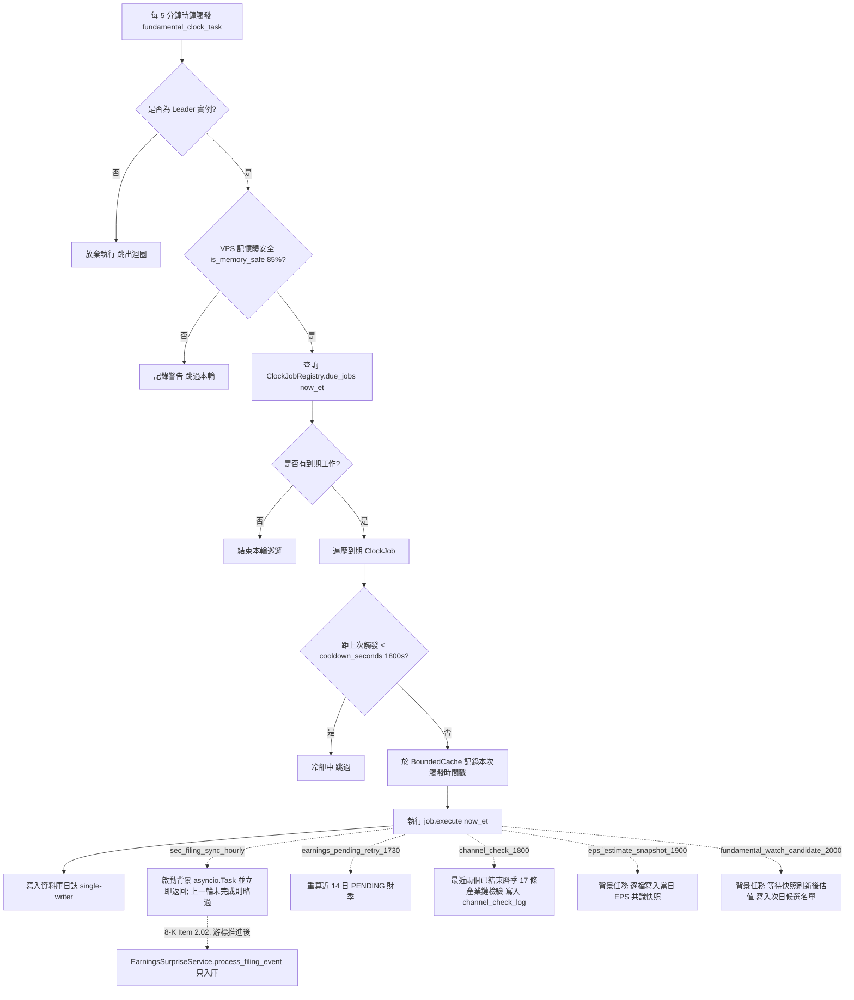

# 基本面分析管線與事件時鐘架構規格書

---

## 1. 核心哲學與適用市場環境

### 1.1 核心哲學
Nexus Seeker 本質為選擇權風險控制與營運決策顧問系統（Zero-Execution Invariant），不直接對接實體券商下單接口，純粹映射為「事件捕捉 → 訊號記錄 → 顧問式提示」。
在低資源 VPS（1GB–2GB RAM）環境中，基本面與宏觀資料更新具備高度的離散性與異步性（如每月發布之 CPI、非農就業、每週四聯準會 H.4.1 資產負債表）。為避免傳統多個定時定點迴圈（Cron Jobs）爭搶記憶體與 SQLite 寫入鎖，本架構引入**事件時鐘與註冊器模式（Event Clock & ClockJobRegistry）**。

事件時鐘遵循**開閉原則（Open-Closed Principle）**：主排程 Cog 以 5 分鐘固定步長巡邏全域時鐘註冊表，各業務模組（宏觀流動性、SEC 申報、財務預期差、產業鏈檢驗等）僅需向註冊器註冊其所屬的 `ClockJob`，無需修改主迴圈排程核心。

> **目前已註冊的 `ClockJob`**（`cogs/trading/fundamental_pipeline_monitor.py`）：`macro_surprise_0830`、`macro_surprise_1000`、`liquidity_regime_1615`、`sec_filing_sync_hourly`、`earnings_pending_retry_1730`、`channel_check_1800`、`eps_estimate_snapshot_1900` 與 `fundamental_watch_candidate_2000`（priority 依序 10–80）。`sec_filing_sync_hourly` 於平日 07:00–20:00 ET 每整點以背景任務執行 SEC 申報同步（`services/filing_event_service.py`，Form 4 內部人交易、8-K 治理旗標，並對結構化 13D 呼叫激進投資人閘門、只記日誌）；規格見 [`06_sec_event_stream_and_governance_gate.md`](../macro_sentiment/06_sec_event_stream_and_governance_gate.md) §3.1。同步發現的 8-K Item 2.02 會在游標推進後交給注入的 `EarningsSurpriseService.process_filing_event`（財報預期差與管理層指引，只入庫不推播）；`earnings_pending_retry_1730` 於 NYSE 交易日 17:30 ET 重算仍為 `PENDING` 的財季。規格見 [`05_earnings_surprise_and_guidance_delta.md`](../valuation_pricing/05_earnings_surprise_and_guidance_delta.md) §2.9。`channel_check_1800` 於 NYSE 交易日 18:00 ET（`nyse_trading_day_at(18, 0, window_minutes=15)`，每日一次）以 `AltDataService.run_all_channel_checks(persist=True)` 檢驗最近兩個已結束曆季的 17 條產業鏈，每個期別前再檢查 `is_memory_safe()`，經 SingleFlight 合併，只寫入 `channel_check_log`、不推播；規格見 [`07_alt_data_and_channel_checks.md`](../macro_sentiment/07_alt_data_and_channel_checks.md)。SEC 申報同步與產業鏈檢驗的 SEC XBRL 驅動端都依賴 `SEC_USER_AGENT`：未設定時前者只記一次 error 後每輪略過，後者把 SEC 端指標判為資料不足（`INSUFFICIENT`），兩者互不影響。兩者共用同一個 `SecEdgarClient`（同一個 8 req/s 限速器），18:00 同時執行時合計仍不超過 SEC 10 req/s 上限。`eps_estimate_snapshot_1900` 於 NYSE 交易日 19:00 ET 以背景任務逐檔寫入當日分析師 EPS 共識快照（帶財期），`fundamental_watch_candidate_2000` 於 NYSE 交易日 20:00 ET 以背景任務執行估值、修正動能與次日候選名單（快照刷新仍在執行時先等待其完成），兩者只入庫、不推播；規格見 [`06_revision_momentum_and_fair_value.md`](../valuation_pricing/06_revision_momentum_and_fair_value.md) §5.5。

### 1.2 適用市場環境與系統邊界
- **低頻總經發布與非同步數據攝取**：涵蓋每週 H.4.1、芝加哥聯準會 NFCI、每週四初領失業金及每月 CPI、NFP、ISM PMI 發布。
- **前向無偏乾跑（Dry-Run Invariant）**：初期全面執行乾跑記錄（`FUNDAMENTAL_PIPELINE_DRY_RUN=true`），所有計算產物均寫入 SQLite 資料庫日誌，預設不推播 Discord DM。
- **嚴格單一寫入器原則**：所有持久化動作必須透過 `database.connection` 提供的非同步寫入隊列執行，禁止模組內部自行呼叫 `sqlite3.connect()`。

---

## 2. 數學模型與量化推導

### 2.1 事件時鐘時間步長與離散視窗匹配模型
設事件發布基準時間為 $t_{\text{target}}$（例如 08:30:00 ET 或 16:15:00 ET），時鐘巡邏步長為 $\Delta t_{\text{tick}} = 5 \text{ min}$。
為了確保在分散式伺服器延遲或藍綠部署熱重啟時不遺漏任何事件，時鐘定義前向容許觸發時間視窗 $W$：
$$t_{\text{target}} \le t_{\text{curr}} < t_{\text{target}} + W$$
其中預設 $W = 15 \text{ min}$。

為防止在視窗 $W$ 內的連續 $\lceil W / \Delta t_{\text{tick}} \rceil$ 次輪詢中重複觸發同一任務，以 `job_id` 為鍵記錄最近一次觸發時間戳 $t_{\text{last}}(job\_id)$，並以每個 `ClockJob` 的冷卻秒數 $T_{\text{cool}}$（`cooldown_seconds`，預設 $1800\text{s}$）判定是否可再次執行：
$$\text{Run}(job\_id, t) = \begin{cases}
\text{True} & \text{若 } t_{\text{last}} \text{ 不存在} \lor (t - t_{\text{last}}) \ge T_{\text{cool}} \\
\text{False} & \text{其他}
\end{cases}$$
由於 $T_{\text{cool}} = 1800\text{s} > W = 900\text{s}$，同一視窗內至多觸發一次；觸發前即寫入時間戳，執行失敗亦不於同視窗重試。時間戳存放於行程內記憶體：
$$C_{\text{dedup}} = \text{BoundedCache}(\text{max\_size} = 300)$$
（無 TTL，容量上限以 LRU 淘汰；Bot 重啟後冷卻狀態歸零。）

### 2.1.1 觸發日曆
- **宏觀預期差（08:30 / 10:00 ET）**：`weekday_at`，週一至週五觸發，刻意**不**排除 NYSE 休市日——總經數據可能在休市日照常公布（例如耶穌受難日的非農就業）。
- **流動性體制（16:15 ET）**：`nyse_trading_day_at`，先以 `weekday_at` 判定時間視窗，再以 `market_time.is_nyse_trading_day()`（`pandas_market_calendars` NYSE 行事曆）排除國定休市日；行事曆查詢失敗時退回平日判定。
- **SEC 申報同步（平日 07:00–20:00 ET 每整點）**：`weekday_hourly_between(7, 20, window_minutes=10)`，週一至週五每個整點的前 10 分鐘到期；採平日而非 NYSE 交易日（SEC 依聯邦營業日受理申報）。$W = 10\text{ min} < T_{\text{cool}} = 1800\text{s} < 60\text{ min}$，每個整點恰觸發一次。處理器 `SecFilingSyncRunner.trigger` 只啟動背景 `asyncio.Task` 即返回（不阻塞同一輪的其他工作），上一輪未完成時略過；缺少 `SEC_USER_AGENT` 時只記一次 error。8-K Item 2.02 事件在同一個背景任務內、游標推進後交給 `EarningsSurpriseService.process_filing_event`（盡力而為，例外只記 warning）。
- **財報預期差 PENDING 重試（17:30 ET）**：`nyse_trading_day_at(17, 30, window_minutes=15)`，NYSE 交易日觸發。處理器 `EarningsPendingRetryRunner.run` 複檢 leader 與 `is_memory_safe()` 後，對近 14 個日曆日內仍為 `PENDING` 的財季逐一呼叫 `evaluate_symbol_surprise`（只查 Finnhub、不呼叫 LLM，通常僅數檔，同步執行）；單一標的例外隔離。
- **產業鏈交叉驗證（18:00 ET）**：`nyse_trading_day_at(18, 0, window_minutes=15)`，NYSE 交易日觸發；資料為月／季頻，每日一次已足夠，盤後執行避開盤中 API 負載。priority 60 排在同一輪的 SEC 申報同步（priority 40）之後。
- **分析師 EPS 共識快照（19:00 ET）**：`nyse_trading_day_at(19, 0, window_minutes=30)`，NYSE 交易日觸發，`cooldown_seconds = 3600`。處理器 `EstimateSnapshotRunner.trigger`（`services/fundamental_clock_service.py`）複檢 leader、防重疊與 `is_memory_safe()` 後啟動背景 `asyncio.Task` 即返回；任務內逐檔呼叫 `ValuationService.refresh_estimate_snapshots`，每檔開始前複檢 leader 與記憶體，單一標的例外只計數。Finnhub 背景限流（窗口 50 次／60 秒，背景最多 35 次，見 [`07_outbound_rate_gate.md`](07_outbound_rate_gate.md)）的等待只卡住這個背景任務，不阻塞時鐘輪詢。priority 70 排在同一輪的 SEC 申報同步（priority 40）之後。
- **估值與次日候選名單（20:00 ET）**：`nyse_trading_day_at(20, 0, window_minutes=30)`，NYSE 交易日觸發，`cooldown_seconds = 3600`。處理器 `ValuationJobRunner.trigger` 同樣以背景任務執行；19:00 快照刷新若仍在執行，先等待其完成（上限 `SNAPSHOT_WAIT_TIMEOUT_SECONDS = 3600`，逾時則以既有最新快照估值），再逐檔估值，每檔前複檢 leader 與記憶體，超標即中止本輪且不寫不完整的候選名單。priority 80。

### 2.2 標的池優先級過濾模型
設系統所有持倉標的集合為 $\mathcal{H}$，使用者自選清單標的集合為 $\mathcal{W}$，排除標的集合（指數與各類 ETF）為 $\mathcal{E}$。
過濾後的有效個股全集 $\mathcal{U}$ 定義為：
$$\mathcal{U}_{\text{raw}} = (\mathcal{H} \setminus \mathcal{E}) \oplus (\mathcal{W} \setminus \mathcal{E})$$
其中 $\oplus$ 代表保持持倉優先的有序串接（Holdings First），並依序截斷至最大容量上限：
$$|\mathcal{U}| \le N_{\max} = 80$$

---

## 3. 決策邏輯與狀態機 / 流程圖

---

## 4. 關鍵具名常數與物理約束

| 具名常數 | 數值 / 類型 | 物理意義與約束說明 |
|---|---|---|
| `FUNDAMENTAL_UNIVERSE_MAX_SYMBOLS` | `80` (int) | 基本面分析管線掃描標的池物理上限，優先保證持倉標的 |
| `DEFAULT_CLOCK_WINDOW_MINUTES` | `15` (int) | 事件時鐘容許到期觸發窗口寬度（分鐘） |
| `CLOCK_TICK_MINUTES` | `5` (int) | 時鐘巡邏背景循環間隔週期 |
| `MEMORY_SAFE_THRESHOLD` | `85.0` (float) | VPS 記憶體使用率門檻百分比，超標則強制熔斷非核心工作 |
| `MAX_DEDUP_CACHE_SIZE` | `300` (int) | 時鐘去重快取最大容量，防止記憶體洩漏 |
| `ClockJob.cooldown_seconds` | `1800.0` (float) | 同一 `job_id` 兩次觸發的最小間隔秒數，須大於觸發視窗 $W$ 以確保同視窗僅執行一次 |
| `SNAPSHOT_WAIT_TIMEOUT_SECONDS` | `3600.0` (float) | 20:00 估值等待 19:00 共識快照刷新完成的上限秒數；逾時改以既有最新快照估值 |

---

## 5. 邊界條件、風控熔斷與例外處理
- **藍綠部署競爭防護**：非 Leader 節點強制略過所有時鐘工作，避免雙節點重複對 FRED 與日曆來源發出大量重複請求。
- **記憶體熔斷機制**：若 VPS 總體 RAM 使用率超過 85%，時鐘巡邏立即跳過本輪所有未執行工作，並於日誌輸出警告，優先保障 Discord Bot 連線與訂單處理核心。
- **單一任務例外隔離**：單一 `ClockJob` 的執行異常（如網路超時、解析失敗）必須在內部捕捉並記錄日誌，絕不中斷同輪次中其他已到期的工作。
- **標的池空值安全**：若資料庫內無任何持倉與自選標的，標的池自動回退為空串列，不引發例外。
- **標的池資料來源**：持倉與自選皆讀自 `assets` 表（重用 `database.portfolio.get_all_portfolio()` 與 `database.watchlist.get_all_watchlist()`）；`HOLDING` / `TRADE` 以 JSON `metadata.quantity != 0` 篩選（空單為負數，同樣納入），`WATCH` 直接取代號。
- **總經日曆強制刷新與延遲**：`economic_calendar_events` 的一般快取新鮮度為 24 小時，08:30 / 10:00 預期差任務執行前會以 `CalendarService.prefetch_monthly_macro_cache(force_fetch=True)` 強制重抓當月日曆（SingleFlight 合併同月份併發刷新）。未設定 `TUNNEL_URL` 或 Edge 無有效回應時沿用既有 SQLite 快取（SWR）並照常計算，此時當日實際值可能缺漏，待下一次成功刷新（同日 10:00 或次一平日 08:30）後補算。任務在視窗內首次輪詢（約發布後 0–5 分鐘）觸發一次，若 TradingView 尚未更新實際值，08:30 發布會由同日 10:00 任務補上，10:00 發布則延至次一平日 08:30。

---

## 6. 核心程式碼檔案路徑關聯
- `nexus_core/market_analysis/fundamental_pipeline/event_clock.py`
- `nexus_core/market_analysis/fundamental_pipeline/models.py`
- `nexus_core/services/fundamental_universe.py`
- `nexus_core/cogs/trading/fundamental_pipeline_monitor.py`
- `nexus_core/config.py`
