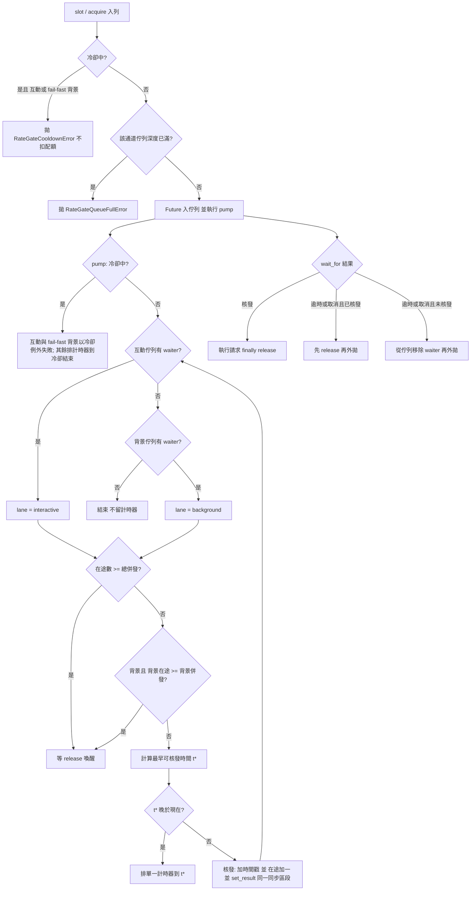

# 對外 API 統一限流閘門（RateGate）規格書

---

## 1. 核心哲學與適用市場環境

### 1.1 核心哲學
Nexus Seeker 對外部資料源（Finnhub、Yahoo、SEC EDGAR、LLM、FRED、Polymarket 等）的呼叫量，直接決定系統在盤中能否取得即時資料。早期各來源的限流各做各的，留下四類缺口：

1. **配額在送出前就被扣掉**：背景請求先取得全域令牌、再排背景次級令牌，排隊中途被取消或熔斷時，已扣的令牌無法歸還（`AsyncLimiter` 的先天限制）。
2. **重試睡眠佔著併發名額**：429 或連線錯誤的退避睡眠發生在併發信號量之內，睡覺時其他請求照樣排不進來。
3. **沒有排隊上限，也看不到佇列深度**：背景任務可以無限等待，無從觀測「為什麼今天的批次變慢」。
4. **部分來源完全沒有閘門**：SEC 限速器每個實例各一個、LLM 沒有併發上限且 SDK 逾時預設 600 秒、FRED／TSA／TWSE／TPEx／Polymarket／Alpaca REST 沒有 429 冷卻。

`RateGate` 把這些來源收斂為「每個來源一個具名閘門」，閘門內含：雙通道（互動、背景）優先佇列、滑動窗口配額、每秒 burst 上限、最小核發間隔、總併發與背景併發池、互動保留額、全域冷卻、排隊逾時與佇列深度上限。**配額只在核發當下才扣**：熔斷、逾時、取消都不浪費配額。

> 設計原則：對外限流 API 一律經過 `services/rate_gate.py`；`tests/unit/test_rate_gate_centralization.py` 以 AST 掃描強制（`AsyncLimiter(` 與直接的 `chat.completions` 呼叫僅允許出現在 allowlist，`finnhub.Client(` 僅允許出現在 `_core.py`）。

### 1.2 適用市場環境與系統邊界
- **互動優先於背景**：`/x` 面板批次掃描最多 15 個標的併發，使用者正在等結果；15 分鐘巡邏與 30 分鐘深度掃描、19:00／20:00 基本面批次屬背景。互動通道永遠先於背景通道核發，且窗口中的最後 $R$ 次額度背景不得動用。
- **429 是全域事件**：同一來源任何一個請求被限流，整個 process 的後續請求都應避開該來源直到冷卻結束（Yahoo 尤其：資料中心 IP 被封會拖累所有路徑）。
- **範圍外**：edge scraper 容器內自己發出的 Yahoo／SEC／FRED 流量（另一個 process）、Discord DM 佇列（由 discord.py 內建限流處理）、離線的 `calibration/` 呼叫、Alpaca WebSocket（有自己的重連退避）。
- **狀態範圍（已知限制）**：佇列、窗口、在途數與計時器為「每個 event loop 一份」；冷卻與統計為 process 全域。若 DB writer 執行緒等額外的 loop 也呼叫閘門，該 loop 會有自己的窗口（與舊 `AsyncLimiter` 行為相同），但冷卻仍全域共享。

---

## 2. 數學模型與量化推導

### 2.1 滑動窗口與互動保留額
設閘門窗口長度為 $T_w$（`window_seconds`）、窗口上限為 $W$（`window_limit`）、互動保留額為 $R$（`interactive_reserve`，$0 \le R < W$）。時刻 $t$ 的窗口內已核發次數為：
$$N(t) = \left|\{\, s \in \mathcal{G} : t - T_w < s \le t \,\}\right|$$
其中 $\mathcal{G}$ 為歷次核發時間戳集合（核發當下才加入，熔斷／逾時／取消者不在其中）。互動請求與背景請求的核發條件為：
$$\text{Grant}_{\text{inter}}(t) \iff N(t) < W$$
$$\text{Grant}_{\text{bg}}(t) \iff N(t) < W - R \;\land\; I_{\text{bg}}(t) < C_{\text{bg}}$$
其中 $I_{\text{bg}}$ 為背景在途數、$C_{\text{bg}}$ 為背景併發上限（`background_concurrency`）。因此背景在任何窗口內最多動用 $W - R$ 次，互動永遠保有至少 $R$ 次。以 Finnhub 為例 $W = 50,\ R = 15$，背景上限 $35$ 次/分（舊制硬上限 12 次/分）；Yahoo $W = 60,\ R = 30$，背景仍 $\le 30$ 次/分。

### 2.2 burst、最小間隔與總併發
設每秒 burst 上限為 $B$（`burst_limit`）、最小核發間隔為 $\delta$（`min_interval`）、總併發上限為 $C$（`max_concurrency`）、目前在途數為 $I(t)$、上次核發時間為 $s_{\text{last}}$。請求可核發的完整條件為：
$$\text{Grant}(t) \iff I(t) < C \;\land\; \left|\{\, s \in \mathcal{G} : t - 1 < s \le t \,\}\right| < B \;\land\; t \ge s_{\text{last}} + \delta \;\land\; \text{Grant}_{\text{lane}}(t)$$
條件不成立時，閘門以各限制的到期時間取最大值，算出最早可核發時間 $t^{*}$ 並排單一計時器：
$$t^{*} = \max\left(s_{\text{last}} + \delta,\; s_{(B)} + 1,\; s_{(N-W')+1} + T_w\right)$$
其中 $s_{(B)}$ 為最近第 $B$ 筆核發時間、$s_{(N-W'+1)}$ 為使窗口計數降到上限以下的那一筆最舊核發時間、$W'$ 為通道可用上限（互動 $W$、背景 $W-R$）。

### 2.3 全域冷卻的指數退避
設冷卻起點為 $D_0$（`cooldown_initial`）、上限為 $D_{\max}$（`cooldown_max`）、第 $k$ 次連續限流（兩次之間未發生成功回應）的冷卻秒數為 $D_k$。有 `Retry-After` 值 $\rho$ 時以其為準，否則指數退避：
$$D_k = \begin{cases}
\min(\rho,\ D_{\max}) & \text{若有 } \rho \\
D_0 & \text{若 } k = 1 \\
\min(2\,D_{k-1},\ D_{\max}) & \text{其他}
\end{cases}$$
已在冷卻中（同一波多個在途請求各自 429）時**不升級倍數**，僅在 $\rho$ 指向更晚的時間時延長冷卻。成功回應重置退避，但僅當「請求送出時間晚於最近一次限流記錄」且「目前不在冷卻中」才重置，避免 429 之前送出、較晚回來的成功請求把退避歸零。

### 2.4 排隊逾時
排隊等待時間定義為 $w = t_{\text{grant}} - t_{\text{enqueue}}$（**不含**請求執行時間）。互動與背景各有上限 $w_{\max}^{\text{inter}}$、$w_{\max}^{\text{bg}}$；超過即拋 `RateGateTimeoutError`。Finnhub 互動上限 15 秒的依據：`/x` 批次最多 15 個標的併發，每秒 burst $B = 3$，15 秒約可核發 $3 \times 15 = 45$ 次，足以容納一批；超時時呼叫端改用 yfinance，面板不會留白。

---

## 3. 決策邏輯與狀態機 / 流程圖

### 3.1 入列與 pump 狀態機

`pump()` 在三個時機執行：入列時、`release` 時、單一計時器到期時（另外 `trip()` 會經 `call_soon_threadsafe` 通知所有已註冊 loop）。每次執行先取消舊計時器，結束時至多重新排程一個。

### 3.2 冷卻通知與跨執行緒喚醒
`trip(retry_after)` 可從任何執行緒呼叫（例如 DB writer 執行緒內的 `asyncio.run` 走到 `call_yf`）：更新 process 全域冷卻狀態後，對每個已註冊且未關閉的 loop 呼叫 `loop.call_soon_threadsafe(state.pump)`，主 loop 的 pump 發現冷卻後讓排隊中的互動 waiter（以及 `background_fail_fast_in_cooldown` 為真的背景 waiter）以 `RateGateCooldownError` 失敗；Finnhub 與 LLM 的背景 waiter 則留在佇列，由計時器在冷卻結束時喚醒。

### 3.3 呼叫端的錯誤對應
| 閘門例外 | Finnhub（`_execute_api_call`） | Yahoo（`yahoo_slot`） |
|---|---|---|
| `RateGateCooldownError` | 互動：外拋，訊息 `Finnhub rate limited, fast-circuit to fallback`，呼叫端降級至 yfinance | 轉為 `YahooRateLimitedError`（不得改用資料中心直連） |
| `RateGateTimeoutError` | 外拋，呼叫端降級或回空 | 轉為 `YahooEdgeBusyError`（暫時性失敗，不冷卻、不直連） |
| `RateGateQueueFullError` | 外拋，呼叫端降級或回空 | 轉為 `YahooEdgeBusyError` |

Finnhub 429：`trip(retry_after)`；互動請求直接外拋，背景請求**離開 slot 後重新排隊**（最多重試 3 次，每次重新受 max_wait 限制）；連線錯誤（兩個通道皆然）於 slot 外睡 $2^{k} + \text{jitter}$ 秒後重試，睡眠期間不佔併發名額。

---

## 4. 關鍵具名常數與物理約束

### 4.1 `POLICIES` 常數表（`services/rate_gate.py`）

| 閘門 | 窗口 | burst／最小間隔 | 併發（總／背景） | 互動保留 | max_wait 互動／背景 | 冷卻 起點→上限 | 背景冷卻快速熔斷 |
|---|---|---|---|---|---|---|---|
| `finnhub` | 50／60s | 3／s，0.05s | 5／2 | 15 | 15s／180s | 5→60s | 否（排隊等） |
| `yahoo` | 60／60s | 無 | 7／2 | 30 | 20s／180s | 60→900s | 是 |
| `sec` | 8／1s | 無 | 4／4 | 0 | 30s／180s | 600→1800s | 是 |
| `llm` | 30／60s | 無 | 2／2 | 0 | 60s／600s | 20→300s | 否 |
| `fred` | 30／60s | 無 | 2／2 | 0 | 15s／180s | 60→600s | 是 |
| `tsa`／`twse`／`tpex` | 各 20／60s | 無 | 2／2 | 0 | 15s／180s | 60→600s | 是 |
| `polymarket` | 120／60s | 0.1s | 3／3 | 0 | 10s／180s | 30→300s | 是 |
| `alpaca_rest` | 150／60s | 無 | 3／3 | 0 | 15s／180s | 30→300s | 是 |

佇列深度上限（`max_queue_depth_interactive`／`max_queue_depth_background`）預設為 $50$／$200$。

### 4.2 其他具名常數

| 具名常數 | 數值 / 類型 | 物理意義與約束說明 |
|---|---|---|
| `Lane` | `Literal["interactive", "background"]` | 通道由 ContextVar `_is_interactive_request` 決定；`mark_interactive_request()`／`@interactive` 標記 `/x` 指令入口 |
| `_WAIT_SAMPLES_MAX` | `2048` (int) | 排隊等待樣本上限（有上限的 deque），用於計算每小時摘要的 p95 |
| `api_budget._WINDOW_SECONDS` | `3600` (int) | 每小時配額摘要窗口；摘要同時輸出各來源的排隊 p95／最大值、逾時、滿載與冷卻次數 |
| leaf 模組約束 | — | `rate_gate` 不 import 任何 service、不寫 DB、不開背景 task（`test_rate_gate_is_a_leaf_module` 強制） |

LLM 用戶端另設 `AsyncOpenAI(timeout=120.0, max_retries=0)`：逾時由 SDK 預設 600 秒縮為 120 秒，並關閉 SDK 內建重試，使每一次實際送出的請求都經過閘門計數。HTTP 類來源（SEC、FRED、TSA、TWSE、TPEx、Polymarket、Alpaca REST）共用 `services/http_gate.py`：取得 slot → `api_budget.record_call` → 送出 → 429／限流型 403 時 `trip(Retry-After)`、2xx 時 `mark_ok`，回應原樣回傳。

### 4.3 各閘門接線點
| 閘門 | 接線位置 | 429／冷卻行為 |
|---|---|---|
| `finnhub` | `market_data_service/_core.py::_execute_api_call` | 見 §3.3 |
| `yahoo` | `market_data_service/_core.py::yahoo_slot`（`call_yf`、`edge_get_yahoo`、`/x` 深度分析的 volume profile） | 見 §3.3；冷卻 60→900 秒，429 不走資料中心直連 |
| `sec` | `services/sec_edgar_client.py` 的四個請求點，經 `services/http_gate.py` 的 `gated_request`／`gated_stream` | HTTP 429，或 HTTP 403 且內文含 `Request Rate Threshold` → `trip()`；其他 403 不算限流；冷卻中 `RateGateCooldownError` 由 `filing_event_service` 等呼叫端既有的例外隔離接住；閘門主動拒絕（冷卻／逾時／滿載）經 `rate_gate.failure_log_level()` 記 WARNING，其他例外維持 ERROR |
| `fred` | `services/macro_signal_service.py::_download_fred`（`gated_request("fred", …)`） | HTTP 429 → `trip()`；冷卻中 `fetch_fred_series` 拋 `RateGateCooldownError`，由 `refresh_fred_observations`／`AltDataService.get_fred_period_yoy` 既有的例外隔離接住（回空或「抓取失敗」原因） |
| `tsa`／`twse`／`tpex` | `services/alt_data_service.py`（TSA 客流頁、TWSE／TPEx 月營收 OpenAPI，依來源各走一個閘門） | 各自獨立冷卻；取代原本三者共用的 `asyncio.Semaphore(3)`；失敗一律回空 dict，不中斷其他產業鏈 |
| `polymarket` | `services/polymarket_service.py`（`public-search`、CLOB `book`、Gamma `markets` 分頁與單筆查詢）與 `market_analysis/analyst_runners/sector_runner.py` | HTTP 429 → `trip()`；`min_interval=0.1s` 取代原本 `_initialize_order_books` 內的 `asyncio.sleep(0.1)`；冷卻中既有 `except Exception` 路徑回空或沿用快取。WebSocket 不納管（有自己的重連退避） |
| `alpaca_rest` | `services/alpaca_stream_service.py::fetch_historical_bars` 的分頁請求 | HTTP 429 → `trip()`；`fetch_historical_bars` 既有 `except Exception` 回傳 `None`。WebSocket 不納管 |
| `llm` | `services/llm_service.py` 的 `llm_parse`／`llm_create`（`attribution`、`fundamental_thesis`、`earnings_surprise_service`、`hedge_monitor_service` 與 `llm_service` 內 5 處皆已遷移） | `openai.RateLimitError` → `trip()`（Retry-After 取自回應標頭）；`RateLimitError`／`APIConnectionError`／`InternalServerError` 離開 slot 後重新排隊重試 1 次；`APITimeoutError` 不重試 |

---

## 5. 邊界條件、風控熔斷與例外處理
- **取消與逾時的競態**：`wait_for` 逾時或任務取消時，若 pump 已在同一輪核發（`ticket.granted`），必須先 `release()` 歸還在途名額再外拋，否則 slot 永久洩漏；未核發則把 waiter 從佇列移除。pump 只對 `not fut.done()` 的 future 呼叫 `set_result`／`set_exception`。
- **配額原子性**：核發時間戳、在途數 +1 與 `set_result` 在同一個同步區段完成（無 `await`），因此熔斷、逾時、取消的請求不會佔用窗口額度。
- **單一計時器**：每個 loop 狀態至多一個 `TimerHandle`；每次 `pump()` 先取消舊的再視需要重排，避免計時器堆疊。無等待者時不留計時器。
- **關閉的 loop**：`trip()` 通知時略過已關閉的 loop，`call_soon_threadsafe` 的 `RuntimeError` 被吞下。
- **互動熔斷訊息相容**：`RateGateCooldownError` 的訊息固定為 `<Name> rate limited, fast-circuit to fallback`，`fundamentals.py` 等以字串判斷限流的呼叫端不需改動；`is_finnhub_rate_limit_error()` 另外以 `isinstance(exc, RateGateError)` 判斷 finnhub 來源的閘門例外。
- **行為變更（上線後須用每小時 `📈 [API 配額]` 摘要確認）**：Finnhub 背景吞吐由 12 次/分提高到最多 35 次/分（總量仍 $\le 50$ 次/分）；背景排隊超過上限改拋例外（原本無限等待），呼叫端已有 except 路徑退回快取或回空；Finnhub 互動排隊超過 15 秒改用 yfinance，Yahoo 互動排隊超過 20 秒回傳 `None`；`/x` 深度分析的 volume profile 開始受 Yahoo 預算節流。目標：各來源 429 為 0、背景排隊 p95 小於 30 秒、逾時與滿載次數接近 0。
- **測試輔助**：`rate_gate.reset_for_tests()` 清空所有閘門、冷卻與統計；`tests/conftest.py` 以 autouse fixture 於每個測試前後呼叫。測試以 `rate_gate._clock` 假時鐘搭配手動 `pump()` 驅動時間相關案例。

---

## 6. 核心程式碼檔案路徑關聯
- `nexus_core/services/rate_gate.py`
- `nexus_core/services/api_budget.py`
- `nexus_core/services/http_gate.py`
- `nexus_core/services/sec_edgar_client.py`
- `nexus_core/services/llm_service.py`
- `nexus_core/services/macro_signal_service.py`
- `nexus_core/services/alt_data_service.py`
- `nexus_core/services/polymarket_service.py`
- `nexus_core/services/alpaca_stream_service.py`
- `nexus_core/market_analysis/analyst_runners/sector_runner.py`
- `nexus_core/config.py`
- `nexus_core/services/market_data_service/_core.py`
- `nexus_core/cogs/unified_terminal/symbol_deep_dive.py`
- `nexus_core/market_analysis/volume_profile.py`
- `nexus_core/tests/unit/test_rate_gate.py`
- `nexus_core/tests/unit/test_rate_gate_centralization.py`
- `nexus_core/tests/unit/test_rate_gate_low_freq.py`
