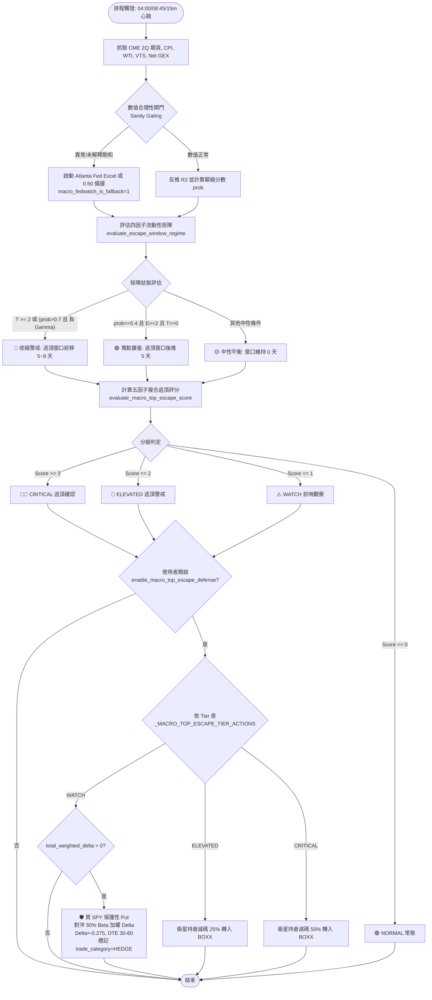

# 宏觀逃頂推演矩陣與流動性退潮防禦規格書

---

## 1. 核心哲學與適用市場環境

### 1.1 核心哲學
在現代美股選擇權市場中，做市商（Market Makers）的流動性供應與 Gamma 曝險水位，根本性地受到總體經濟貨幣政策與資金利率定價的制約。傳統技術分析的擇時指標（例如均線死叉或超買振盪器指標）屬於落後指標，當個股價格確認向下破位時，做市商往往早已因流動性退潮而撤除流動性買單，引發買賣價差（Bid-Ask Spread）擴大與滑價衝擊。

Nexus Seeker 確立**「宏觀流動性引導窗口平移，微觀微結構確認踩踏臨界」**之核心哲學，建構兩套互為表裡的宏觀防禦引擎：
1. **即時流動性窗口平移矩陣（Escape Window Regime Matrix）**：監控 FOMC 聯準會利率期貨、通膨/能源（CPI/WTI）、VIX 期限結構與大盤 Net GEX，動態計算轉倉與防禦窗口的平移天數（前移收縮 vs 後推擴張）。
2. **五因子複合逃頂評分階梯（Macro Top-Escape Score）**：疊加極端市場情緒（CNN Fear & Greed 指數）與使用者衛星持倉的亢奮廣度（Euphoria Breadth），形成多頭極致過熱的領先量化預警階梯，依 WATCH／ELEVATED／CRITICAL 三級分別聯動動態轉倉引擎之情境 6（Scenario 6）採取強度遞增的動作——前哨階段買保護性 Put 保留上檔，警戒與確認階段才實際減碼（見 §2.5）。

### 1.2 適用市場環境與制度角色
- **牛市末期極度亢奮**：當市場指數屢創新高、零售情緒陷入極度貪婪，但利率期貨已悄然隱含鷹派緊縮、或 VIX 期限結構出現倒掛時，系統提前收緊持倉窗口。
- **降息預期落空與流動性再定價**：在 FOMC 會議前夕，若利率定價發生劇烈階梯位移，系統主動提前逃頂防禦窗口，防範流動性踩踏。
- **大盤負 Gamma 踩踏加速區間**：當大盤微觀結構跌入負 Gamma 區間時，做市商將由「逢低買進逆向穩定」轉為「順向追殺放量對沖」，系統將緊縮閥門調至最高警戒。

---

## 2. 數學模型與量化推導

### 2.1 CME 30 天聯邦基金期貨 (ZQ) 官方階梯定價反推模型
聯邦公開市場委員會（FOMC）利率決策定價由芝加哥商業交易所（CBOT）30 天期聯邦基金期貨合約（合約代號格式 `ZQ{MonthCode}{YearSuffix}.CBT`）即時反推。

期貨報價 $P_{ZQ}$ 反映該月份隔夜有效聯邦基金利率（EFFR）的日曆日算術平均值：
$$\bar{R} = 100.0 - P_{ZQ}$$

設當前目標 FOMC 會議月份的總日曆天數為 $N$。會議召開於該月第 $d_{prior}$ 天，則會議前維持舊利率 $R_1$ 之天數為 $d_{prior}$ 天，會議後新基準利率 $R_2$ 之生效天數為：
$$d_{post} = \max(1, N - d_{prior})$$

其中舊基準利率 $R_1$ 由前一月份連續期貨合約報價錨定：$R_1 = 100.0 - P_{prior}$；若無前月報價，則以 13 週美國國庫券利率（`^IRX`）動態推導之利率區間中位數作為錨點。

根據日曆加權平均等式：
$$N \cdot \bar{R} = d_{prior} \cdot R_1 + d_{post} \cdot R_2$$

推導出會議後隱含目標利率 $R_2$ 與利率變動預期 $\Delta R$：
$$R_2 = \frac{N \cdot \bar{R} - d_{prior} \cdot R_1}{d_{post}}$$
$$\Delta R = R_2 - R_1$$

以聯準會標準 25 個基點（25 bp = 0.25%）為一階梯單位，進行多桶階梯分解（Ladder Decomposition）：
$$\text{steps} = \frac{|\Delta R|}{0.25}$$
$$\text{floor\_steps} = \lfloor \text{steps} \rfloor$$
$$\text{frac\_pct} = \operatorname{round}\left( (\text{steps} - \text{floor\_steps}) \times 100.0, 1 \right)$$
$$\text{ladder\_saturated} = (\text{floor\_steps} \ge 1)$$

在降息情境（$\Delta R < 0$）下的離散機率分佈推導如下：
$$P_{\text{cut}} = \begin{cases} \text{frac\_pct} & \text{floor\_steps} = 0 \\ 100.0 & \text{floor\_steps} \ge 1 \end{cases}$$
$$P_{\text{cut\_25}} = \begin{cases} \text{frac\_pct} & \text{floor\_steps} = 0 \\ 100.0 - \text{frac\_pct} & \text{floor\_steps} = 1 \\ 0.0 & \text{floor\_steps} \ge 2 \end{cases}$$
$$P_{\text{cut\_50}} = \begin{cases} 0.0 & \text{floor\_steps} = 0 \\ \text{frac\_pct} & \text{floor\_steps} = 1 \\ 100.0 & \text{floor\_steps} \ge 2 \end{cases}$$
$$P_{\text{maintain}} = 100.0 - P_{\text{cut}}$$

在升息情境（$\Delta R \ge 0$）下的機率分佈採對稱推導。

### 2.2 鷹派傾向純量壓縮分數 (Hawkish Intensity Probability)
為了將離散的升息/降息百分比轉化為可納入全域風控矩陣的連續純量 $prob \in [0.05, 0.95]$，系統實施以下分段壓縮映射：
$$prob = \begin{cases}
\min\left(0.95, \frac{50.0 + P_{\text{hike}} / 2.0}{100.0}\right) & \text{若 } P_{\text{hike}} \ge 50.0 \lor (P_{\text{hike}} \ge 30.0 \land P_{\text{hike}} > P_{\text{cut}} \land P_{\text{hike}} > P_{\text{maintain}}) \\
\max\left(0.05, \frac{50.0 - P_{\text{cut}} / 2.0}{100.0}\right) & \text{若 } P_{\text{cut}} \ge 50.0 \lor (P_{\text{cut}} \ge 30.0 \land P_{\text{cut}} > P_{\text{hike}} \land P_{\text{cut}} > P_{\text{maintain}}) \\
\operatorname{clamp}\left(0.05, 0.95, \frac{50.0 + (P_{\text{hike}} - P_{\text{cut}}) / 2.0}{100.0}\right) & \text{其餘中性維持或分歧情境}
\end{cases}$$

### 2.3 四因子宏觀流動性矩陣與窗口平移推導
`evaluate_escape_window_regime` 整合四項宏觀總經與微觀結構因子：
1. **因子 1：FedWatch 利率定價**
   $$\text{緊縮評分 } T_1 = \mathbb{I}(prob > 0.70), \quad \text{寬鬆評分 } E_1 = \mathbb{I}(prob \le 0.40)$$
2. **因子 2：通膨與原油衝擊 (CPI / WTI)**
   $$\text{緊縮評分 } T_2 = \mathbb{I}(cpi\_dev > 0.1 \lor wti > 85.0), \quad \text{寬鬆評分 } E_2 = \mathbb{I}(cpi\_dev \le 0.0 \land wti \le 80.0)$$
3. **因子 3：VIX 期限結構比例 (VTS Ratio)**
   $$VTS = \frac{VIX}{VIX3M}$$
   $$\text{緊縮評分 } T_3 = \mathbb{I}(VTS \ge 1.0), \quad \text{寬鬆評分 } E_3 = \mathbb{I}(VTS < 0.90)$$
4. **因子 4：大盤微觀結構 Net GEX 狀態**
   $$\text{緊縮評分 } T_4 = \mathbb{I}(is\_negative\_gamma = \text{True}), \quad \text{寬鬆評分 } E_4 = \mathbb{I}(is\_negative\_gamma = \text{False})$$

加總總緊縮分 $T = \sum_{i=1}^4 T_i$ 與總寬鬆分 $E = \sum_{i=1}^4 E_i$。窗口位移天數 $\Delta D_{shift}$ 與狀態分級遵循：
$$\Delta D_{shift} = \begin{cases}
-8 \text{ 天 (前移)} & \text{若 } T \ge 3 \\
-5 \text{ 天 (前移)} & \text{若 } T = 2 \lor (prob > 0.70 \land is\_negative\_gamma) \\
+5 \text{ 天 (後推)} & \text{若 } prob \le 0.40 \land E \ge 2 \land T = 0 \\
0 \text{ 天 (維持)} & \text{其餘中性平衡情況}
\end{cases}$$

### 2.4 五因子複合逃頂評分階梯 (Macro Top-Escape Score)
`evaluate_macro_top_escape_score` 計算逃頂綜合評分 $S_{esc} \in [0, 5]$，融合持倉端微觀過熱廣度：
$$S_{esc} = \mathbb{I}(VTS \ge 1.0) + \mathbb{I}(FearGreed \ge 75.0) + \mathbb{I}(prob > 0.70) + \mathbb{I}(is\_negative\_gamma) + \mathbb{I}(Ratio_{sat} \ge 0.50)$$

其中衛星持倉亢奮比例 $Ratio_{sat}$ 計算如下：
$$Ratio_{sat} = \frac{\sum_{k \in \text{Satellite}} \left[ \mathbb{I}(Spot_k \ge CallWall_k \lor \frac{|Spot_k - CallWall_k|}{CallWall_k} < 0.005) \lor \mathbb{I}(Skew_k < 0 \land SkewPct_k \le 20.0\%) \right]}{N_{\text{Satellite}}}$$

若使用者未持有任何衛星持倉，則該項傳入 `None`，不參與評分。分級判斷：
$$\text{Tier} = \begin{cases}
\text{CRITICAL (🚨🚨 逃頂確認)} & S_{esc} \ge 3 \\
\text{ELEVATED (🚨 逃頂警戒)} & S_{esc} = 2 \\
\text{WATCH (⚠️ 前哨觀察)} & S_{esc} = 1 \\
\text{NORMAL (🟢 常態)} & S_{esc} = 0
\end{cases}$$

### 2.5 聯動情境 6 宏觀逃頂防禦：三級階梯化動作強度

情境 6 的動作強度不再是「CRITICAL 才動、其餘不動」的二元判定，而是依 $\text{Tier}$ 對照表 $\_MACRO\_TOP\_ESCAPE\_TIER\_ACTIONS$ 決定動作種類與強度：

$$
(\text{trim\_ratio},\ \text{action\_kind}) = \begin{cases}
(0.00,\ \text{PROTECTIVE\_PUT}) & \text{Tier} = \text{WATCH} \\
(0.25,\ \text{TRIM}) & \text{Tier} = \text{ELEVATED} \\
(0.50,\ \text{TRIM}) & \text{Tier} = \text{CRITICAL} \\
\text{（無動作）} & \text{Tier} = \text{NORMAL}
\end{cases}
$$

**WATCH：買保護性 Put，不減碼**——前哨訊號初現、尚不足以判定真正逃頂，減碼會放棄上檔曝險；改買大盤 ETF 保護性 Put，保留 100% 上檔曝險，只付出權利金成本，是唯一能同時滿足「不錯過上漲」與「暴跌前出場」兩個需求的機制：

$$
Q_{\text{put}} = \left\lceil \frac{\Delta_{\beta\text{-weighted}} \times \_WATCH\_TIER\_HEDGE\_RATIO}{|\Delta_{\text{put}}| \times 100} \right\rceil, \qquad \_WATCH\_TIER\_HEDGE\_RATIO = 0.30
$$

$\Delta_{\beta\text{-weighted}}$ 直接複用 `user_ctx.total_weighted_delta`（[`01_beta_weighted_greeks.md`](../risk_portfolio/01_beta_weighted_greeks.md) 的單一權威來源，`hedging.py` 對沖建議引擎已採同一欄位）；標的固定為 $\_MACRO\_TOP\_ESCAPE\_HEDGE\_SYMBOL = \text{SPY}$（沿用 `hedging.py` 既有以 SPY 作為組合對沖代理的慣例——逃頂訊號是系統性的，指數 Put 的流動性與價差優於個股）；建議合約 Delta $\approx -0.275$（範圍 $-0.25 \sim -0.30$）、DTE $30\sim60$ 天。組合已淨平/淨空（$\Delta_{\beta\text{-weighted}} \le 0$）時無下檔方向性曝險可對沖，fail-safe 不建議一筆語意矛盾的「加碼防護」。

**ELEVATED／CRITICAL：減碼轉入 BOXX**（沿用既有機制，僅比例依級距遞增）：
$$V_{trim} = \text{trim\_ratio} \times V_{satellite}$$
去化目的地嚴格限制為無風險現金等價物 `BOXX`，嚴禁轉入股票大盤 ETF（如 VOO），防範系統性系統風險下股債同跌。CRITICAL 由既有的 $25\%$ 提高至 $50\%$——既然 WATCH／ELEVATED 已各自承擔前哨與初階防禦，CRITICAL 應對應更果斷的動作，否則三級階梯只是把同一個 $25\%$ 拆成三次發送。

⚠️ **WATCH 級指令必須標記 `trade_category = "HEDGE"`**：`hedging._sum_hedge_only_delta` 以此欄位區分「對沖」與「刻意建立的方向性部位」，標記錯誤會導致對沖績效引擎誤判、在多頭共振訊號出現時建議使用者平掉自己的保護。

---

## 3. 決策邏輯與狀態機 / 流程圖

### 3.1 總經流動性評估與逃頂推演決策流程

---

## 4. 關鍵具名常數與物理約束

| 常數名稱 | 數值 / 門檻 | 物理約束與代碼意涵 | 程式碼檔案路徑 |
| :--- | :--- | :--- | :--- |
| `_MACRO_ESCAPE_WATCH_THRESHOLD` | `1` | 逃頂評分 WATCH 前哨觀察門檻 | `nexus_core/market_analysis/index_microstructure.py:934` |
| `_MACRO_ESCAPE_ELEVATED_THRESHOLD` | `2` | 逃頂評分 ELEVATED 警戒門檻 | `nexus_core/market_analysis/index_microstructure.py:935` |
| `_MACRO_ESCAPE_CRITICAL_THRESHOLD` | `3` | 逃頂評分 CRITICAL 確認門檻（啟動情境 6 減碼） | `nexus_core/market_analysis/index_microstructure.py:936` |
| `_MACRO_ESCAPE_BREADTH_TRIGGER_RATIO`| `0.5` | 衛星持倉亢奮廣度門檻（超過 50% 標的觸頂則觸發因子） | `nexus_core/market_analysis/index_microstructure.py:937` |
| `_FEAR_GREED_EXTREME_GREED_BOUND` | `75.0` | CNN 恐懼貪婪指數極度貪婪臨界值 | `nexus_core/market_analysis/constants.py:141` |
| `_MACRO_TOP_ESCAPE_TRIM_RATIO` | `0.50` (50%) | 情境 6 CRITICAL 級防禦性減碼比例（轉入 BOXX；由 25% 提高，`calibration/backtest_engine_2025.py` 直接匯入此值以維持回測與生產參數一致） | `nexus_core/market_analysis/dynamic_rollover/constants.py` |
| `_MACRO_TOP_ESCAPE_ELEVATED_TRIM_RATIO` | `0.25` (25%) | 情境 6 ELEVATED 級防禦性減碼比例（轉入 BOXX，沿用原本唯一的比例） | `nexus_core/market_analysis/dynamic_rollover/constants.py` |
| `_MACRO_TOP_ESCAPE_TIER_ACTIONS` | `{WATCH: (0.00, PROTECTIVE_PUT), ELEVATED: (0.25, TRIM), CRITICAL: (0.50, TRIM)}` | Tier → (減碼比例, 動作種類) 查表，取代原本單一 `_MACRO_TOP_ESCAPE_MIN_TIER` 二元判定 | `nexus_core/market_analysis/dynamic_rollover/constants.py` |
| `_MACRO_TOP_ESCAPE_HEDGE_SYMBOL` | `"SPY"` | WATCH 級保護性 Put 的固定標的（大盤 ETF 而非個股） | `nexus_core/market_analysis/dynamic_rollover/constants.py` |
| `_WATCH_TIER_HEDGE_RATIO` | `0.30` (30%) | WATCH 級對沖比例：對沖 30% 的組合 Beta 加權方向性曝險 | `nexus_core/market_analysis/dynamic_rollover/constants.py` |
| `_MACRO_TOP_ESCAPE_PUT_TARGET_DELTA` | `-0.275` | WATCH 級建議合約 Delta 中位數（範圍 $-0.25\sim-0.30$） | `nexus_core/market_analysis/dynamic_rollover/constants.py` |
| `_MACRO_TOP_ESCAPE_PUT_DTE_MIN` / `_MAX` | `30` / `60` | WATCH 級建議合約 DTE 範圍 | `nexus_core/market_analysis/dynamic_rollover/constants.py` |
| `_PROFIT_UNLOCK_TOLERANCE` | `0.005` (0.5%) | 衛星持倉現價逼近 Call Wall 的判斷容差 | `nexus_core/market_analysis/dynamic_rollover/constants.py:14` |
| `_EUPHORIA_SKEW_PERCENTILE` | `20.0` | 衛星持倉 Skew 倒掛亢奮門檻 | `nexus_core/market_analysis/dynamic_rollover/constants.py:11` |

---

## 5. 邊界條件、風控熔斷與例外處理

### 5.1 CME 期貨休市與數據源異常阻斷（Sanity Gating）
- **假日與休市保護**：當交易所週末或國定假日休市時，`ZQ` 期貨報價為空，系統自動 fallback 讀取次選 `ZQ=F`，若仍為空則呼叫 Atlanta Fed Excel 檔案（`mpt_histdata.xlsx`）進行歷史分佈解析；若均不可用，回傳預設中性 50% 基準值，並標記 `macro_fedwatch_is_fallback = 1`。
- **異常數值攔截（Sanity Gating）**：
  在 `services/calendar_service.py` 寫入 SQLite 快取前，強制執行合理性檢查：
  若滿足下列任一條件：
  1. $prob \ge 0.99$ 或 $prob \le 0.01$
  2. $(P_{\text{cut}} \ge 99.0 \lor P_{\text{hike}} \ge 99.0) \land \neg (\text{ladder\_saturated} \lor \text{"Atlanta Fed"} \in source)$

  系統判定為歷史污染或失真數值，立即觸發防禦阻斷，中止資料庫寫入並在快取記錄 `macro_fedwatch_is_fallback = 1`。

### 5.2 零除與邊界防護
- **除數保護**：在計算 $\Delta R$ 權重時，會議後天數嚴格約束為 $d_{post} = \max(1, N - d_{prior})$，杜絕月底最後一日開會導致除以零崩潰。
- **衛星持倉空集合**：當使用者投資組合中無任何 `SATELLITE` 資產時，`satellite_euphoria_ratio` 返回 `None`，五因子模型自動無縫退化為四因子模型，門檻常數保持一致。

### 5.3 減碼執行衝突隔離（Conflict Isolation）
- 在 `dynamic_rollover` 排程派發器中，情境 6 刻意排在最後順序（3 → 2 → 5 → 4 → 6）。
- 若某檔標的已在情境 2（機會成本轉倉）、情境 3（Call Wall 亢奮獲利鎖定）、情境 4（流動性危機停損）或情境 5（核心配置超額）被標記處理，情境 6 自動將該標的加入 `already_flagged_symbols` 跳過，嚴禁對同一標的下發相互矛盾的指令。ELEVATED／CRITICAL 的 TRIM 分支沿用此隔離機制；WATCH 的 PROTECTIVE_PUT 分支是組合層級的單一建議、不逐一針對個別持倉，不受 `already_flagged_symbols` 篩選。

### 5.4 WATCH 級 `trade_category` 誤標的下游後果
若買進的保護性 Put 未以 `trade_category = "HEDGE"` 登錄，`hedging._sum_hedge_only_delta` 會把它排除在「可解除的對沖曝險」之外，視為一筆刻意建立的方向性部位。後果不僅是統計失真：當多頭共振訊號出現、對沖建議引擎判斷「有對沖可解除」時，會反過來建議使用者**平掉自己剛買的保護**——這與 [`06_brinson_performance_attribution.md`](../risk_portfolio/06_brinson_performance_attribution.md) §5.3 記載的 `suggest_hedge_unlock()` 早期誤把「組合總 Delta < 0」等同於「有對沖掛著」是同一類錯誤。

### 5.5 WATCH 級組合已淨平/淨空的 Fail-Safe
`total_weighted_delta <= 0` 代表組合已無下檔方向性曝險（淨平或淨空），此時買進保護性 Put 在邏輯上是「加碼防護一個不存在的風險」，語意矛盾。系統偵測到此情形時直接回傳空指令列表，不建議任何動作。

---

## 6. 核心程式碼檔案路徑關聯

- `nexus_core/market_analysis/index_microstructure.py`
  - `evaluate_escape_window_regime`: 四因子宏觀流動性矩陣與窗口位移計算
  - `evaluate_macro_top_escape_score`: 五因子複合逃頂評分階梯
- `nexus_edge_scraper/local_api/macro.py`
  - `scrape_fedwatch`: CME 30 天期聯邦基金期貨（ZQ）反推及階梯定價演算法
- `nexus_core/services/calendar_service.py`
  - `update_economic_calendar`: CME FedWatch 定價寫入與數值合理性閘門（Sanity Gating）
- `nexus_core/market_analysis/dynamic_rollover/macro_top_escape_defense.py`
  - `evaluate_macro_top_escape_defense_impl`: 情境 6 三級階梯化動作分派
  - `_build_protective_put_instruction`: WATCH 級保護性 Put 倉位計算與指令組裝
- `nexus_core/market_analysis/dynamic_rollover/constants.py`
  - 具名常數 `_MACRO_TOP_ESCAPE_TRIM_RATIO`、`_MACRO_TOP_ESCAPE_ELEVATED_TRIM_RATIO`、`_MACRO_TOP_ESCAPE_TIER_ACTIONS`、`_MACRO_TOP_ESCAPE_HEDGE_SYMBOL`、`_WATCH_TIER_HEDGE_RATIO`、`_MACRO_TOP_ESCAPE_PUT_TARGET_DELTA`、`_MACRO_TOP_ESCAPE_PUT_DTE_MIN`／`_MAX`
- `nexus_core/database/user_settings.py`
  - `UserContext.total_weighted_delta`：WATCH 級 Put 倉位計算的組合 Beta 加權 Delta 來源
- `nexus_core/cogs/embed_builders/rollover_embeds.py`
  - `create_protective_put_embed`: WATCH 級保護性 Put 專屬 Embed
- `nexus_core/cogs/trading/portfolio_monitor.py`
  - `action == "BUY_PROTECTIVE_PUT"` 分派分支（不掛互動按鈕，需自行至券商終端下單）
- `nexus_core/tests/unit/test_macro_top_escape_defense.py`
  - WATCH／ELEVATED／CRITICAL 三級動作測試、組合已淨平無對沖需求 fail-safe 測試
