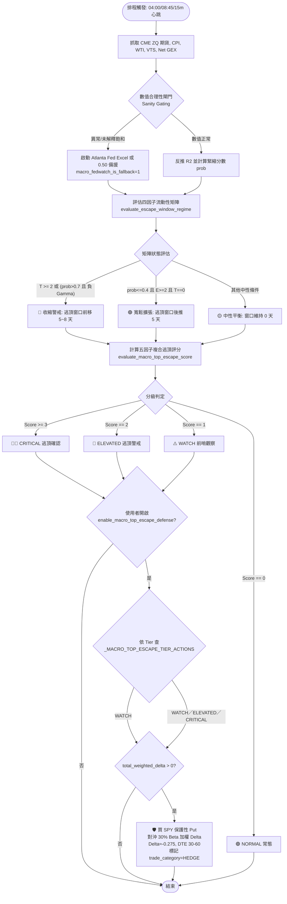

# 宏觀逃頂推演矩陣與流動性退潮防禦規格書

---

## 1. 核心哲學與適用市場環境

### 1.1 核心哲學
在現代美股選擇權市場中，做市商（Market Makers）的流動性供應與 Gamma 曝險水位，根本性地受到總體經濟貨幣政策與資金利率定價的制約。傳統技術分析的擇時指標（例如均線死叉或超買振盪器指標）屬於落後指標，當個股價格確認向下破位時，做市商往往早已因流動性退潮而撤除流動性買單，引發買賣價差（Bid-Ask Spread）擴大與滑價衝擊。

Nexus Seeker 確立**「宏觀流動性引導窗口平移，微觀微結構確認踩踏臨界」**之核心哲學，建構兩套互為表裡的宏觀防禦引擎：
1. **即時流動性窗口平移矩陣（Escape Window Regime Matrix）**：監控 FOMC 聯準會利率期貨、通膨/能源（CPI/WTI）、VIX 期限結構與大盤 Net GEX，動態計算轉倉與防禦窗口的平移天數（前移收縮 vs 後推擴張）。
2. **五因子複合逃頂評分階梯（Macro Top-Escape Score）**：疊加極端市場情緒（CNN Fear & Greed 指數）與使用者衛星持倉的亢奮廣度（Euphoria Breadth），形成多頭極致過熱的領先量化預警階梯，依 WATCH／ELEVATED／CRITICAL 三級分別聯動動態轉倉引擎之情境 6（Scenario 6）採取動作——一律建議買保護性 Put 保留上檔，不減碼（見 §2.5）。

### 1.2 適用市場環境與制度角色
- **牛市末期極度亢奮**：當市場指數屢創新高、零售情緒陷入極度貪婪，但利率期貨已悄然隱含鷹派緊縮、或 VIX 期限結構出現倒掛時，系統提前收緊持倉窗口。
- **降息預期落空與流動性再定價**：在 FOMC 會議前夕，若利率定價發生劇烈階梯位移，系統主動提前逃頂防禦窗口，防範流動性踩踏。
- **大盤負 Gamma 踩踏加速區間**：當大盤微觀結構跌入負 Gamma 區間時，做市商將由「逢低買進逆向穩定」轉為「順向追殺放量對沖」，系統將緊縮閥門調至最高警戒。

---

## 2. 數學模型與量化推導

### 2.1 CME 30 天聯邦基金期貨 (ZQ) 官方階梯定價反推模型
聯邦公開市場委員會（FOMC）利率決策定價由芝加哥商業交易所（CBOT）30 天期聯邦基金期貨合約（合約代號格式 `ZQ{MonthCode}{YearSuffix}.CBT`）即時反推。

期貨報價 $P_{ZQ}$ 反映該月份隔夜有效聯邦基金利率（EFFR）的日曆日算術平均值：
$$\bar{R} = 100.0 - P_{ZQ}$$

設當前目標 FOMC 會議月份的總日曆天數為 $N$。會議召開於該月第 $d_{prior}$ 天，則會議前維持舊利率 $R_1$ 之天數為 $d_{prior}$ 天，會議後新基準利率 $R_2$ 之生效天數為：
$$d_{post} = \max(1, N - d_{prior})$$

會議月份取自 `fomc_schedule` 中第一個不早於今天的**決議日**（兩日會議的第二天，依 [Fed 官方日程](https://www.federalreserve.gov/monetarypolicy/fomccalendars.htm) 逐年維護，目前涵蓋至 2028-01-26）。日程用盡時直接拋錯轉備援，不推估日期——錯一週就會錨錯合約月份（2026-10 曾把 10/28 寫成 11/04）。

$R_1$／$R_2$ 的錨定依 CME 慣例分兩種：
- **(a) 前一月份無會議**：前月合約均價即進入會議月時的利率，$R_1 = 100.0 - P_{prior}$，再以下式反推 $R_2$。
- **(b) 前一月份本身有會議、且次月無會議**：前月均價混合了會前與會後利率，不能當 $R_1$；改以次月合約均價作為會後利率 $R_2 = 100.0 - P_{post}$，反推 $R_1 = (N \cdot \bar{R} - d_{post} \cdot R_2) / d_{prior}$。例：2026-10-28 會議的前月 9 月有 9/16 會議，必須走 (b)；誤用 9 月合約會算出 +570% 加息。

兩者皆無報價時，以 13 週美國國庫券利率（`^IRX`）動態推導之利率區間中位數作為 $R_1$ 錨點。注意 $R_1$ 取自期貨隱含均價而非 EFFR 實際值，與 CME 官網 FedWatch 可能有約 10pp 的落差。

根據日曆加權平均等式：
$$N \cdot \bar{R} = d_{prior} \cdot R_1 + d_{post} \cdot R_2$$

推導出會議後隱含目標利率 $R_2$ 與利率變動預期 $\Delta R$：
$$R_2 = \frac{N \cdot \bar{R} - d_{prior} \cdot R_1}{d_{post}}$$
$$\Delta R = R_2 - R_1$$

以聯準會標準 25 個基點（25 bp = 0.25%）為一階梯單位，進行多桶階梯分解（Ladder Decomposition）：
$$\text{steps} = \frac{|\Delta R|}{0.25}$$
$$\text{floor\_steps} = \lfloor \text{steps} \rfloor$$
$$\text{frac\_pct} = \operatorname{round}\left( (\text{steps} - \text{floor\_steps}) \times 100.0, 1 \right)$$
$$\text{ladder\_saturated} = (\text{floor\_steps} \ge 1)$$

在降息情境（$\Delta R < 0$）下的離散機率分佈推導如下：
$$P_{\text{cut}} = \begin{cases} \text{frac\_pct} & \text{floor\_steps} = 0 \\ 100.0 & \text{floor\_steps} \ge 1 \end{cases}$$
$$P_{\text{cut\_25}} = \begin{cases} \text{frac\_pct} & \text{floor\_steps} = 0 \\ 100.0 - \text{frac\_pct} & \text{floor\_steps} = 1 \\ 0.0 & \text{floor\_steps} \ge 2 \end{cases}$$
$$P_{\text{cut\_50}} = \begin{cases} 0.0 & \text{floor\_steps} = 0 \\ \text{frac\_pct} & \text{floor\_steps} = 1 \\ 100.0 & \text{floor\_steps} \ge 2 \end{cases}$$
$$P_{\text{maintain}} = 100.0 - P_{\text{cut}}$$

在升息情境（$\Delta R \ge 0$）下的機率分佈採對稱推導。

### 2.2 鷹派傾向純量壓縮分數 (Hawkish Intensity Probability)
為了將離散的升息/降息百分比轉化為可納入全域風控矩陣的連續純量 $prob \in [0.05, 0.95]$，系統實施以下分段壓縮映射：
$$prob = \begin{cases}
\min\left(0.95, \frac{50.0 + P_{\text{hike}} / 2.0}{100.0}\right) & \text{若 } P_{\text{hike}} \ge 50.0 \lor (P_{\text{hike}} \ge 30.0 \land P_{\text{hike}} > P_{\text{cut}} \land P_{\text{hike}} > P_{\text{maintain}}) \\
\max\left(0.05, \frac{50.0 - P_{\text{cut}} / 2.0}{100.0}\right) & \text{若 } P_{\text{cut}} \ge 50.0 \lor (P_{\text{cut}} \ge 30.0 \land P_{\text{cut}} > P_{\text{hike}} \land P_{\text{cut}} > P_{\text{maintain}}) \\
\operatorname{clamp}\left(0.05, 0.95, \frac{50.0 + (P_{\text{hike}} - P_{\text{cut}}) / 2.0}{100.0}\right) & \text{其餘中性維持或分歧情境}
\end{cases}$$

### 2.3 四因子宏觀流動性矩陣與窗口平移推導
`evaluate_escape_window_regime` 整合四項宏觀總經與微觀結構因子：
1. **因子 1：FedWatch 利率定價**
   $$\text{緊縮評分 } T_1 = \mathbb{I}(prob > 0.70), \quad \text{寬鬆評分 } E_1 = \mathbb{I}(prob \le 0.40)$$
2. **因子 2：通膨與原油衝擊 (CPI / WTI)**
   $$\text{緊縮評分 } T_2 = \mathbb{I}(cpi\_dev > 0.1 \lor wti > 85.0), \quad \text{寬鬆評分 } E_2 = \mathbb{I}(cpi\_dev \le 0.0 \land wti \le 80.0)$$
3. **因子 3：VIX 期限結構比例 (VTS Ratio)**
   $$VTS = \frac{VIX}{VIX3M}$$
   $$\text{緊縮評分 } T_3 = \mathbb{I}(VTS \ge 1.0), \quad \text{寬鬆評分 } E_3 = \mathbb{I}(VTS < 0.90)$$
4. **因子 4：大盤微觀結構 Net GEX 狀態**
   $$\text{緊縮評分 } T_4 = \mathbb{I}(is\_negative\_gamma = \text{True}), \quad \text{寬鬆評分 } E_4 = \mathbb{I}(is\_negative\_gamma = \text{False})$$

   `/market` 面板（`cogs/unified_terminal/utils.py`）的 $is\_negative\_gamma$ 以 SPY 現價對 SPY Gamma Flip 判定；Flip 快取逾 3 天時傳入 `None`（面板仍顯示 Flip 並標示「N 天前快取・不納入判定」）。VTS 快取逾 3 天同樣視為 `None`。

   **離群 Flip 同樣傳 `None` 或自癒**：Flip 相對現價落在大盤合理性區間外（高於現價 $> 20\%$ 或低於現價 $> 8\%$，`is_macro_gamma_flip_outlier`，規格見 [`../microstructure/03_gamma_flip_estimation.md`](../microstructure/03_gamma_flip_estimation.md) §2.2）時，面板先丟棄 KV 值並走自癒（重抓大盤端點，仍缺值或離群再以 SPY 個股期權鏈估算）；自癒成功即以新值判定，失敗才傳入 `None`。`get_market_regime()` 與 last-known-good 快取套用同一判定。上方容許 20% 是為了在崩跌（Flip 遠高於現價的真負 Gamma）時保留訊號。

**未知輸入不計分**：任一因子的輸入未知（`None`，例如 CPI 偏差未公布、WTI／VTS 抓取失敗、`is_negative_gamma` 因 Gamma Flip 缺值或大盤 GEX 快取逾 `MACRO_GEX_STALE_MAX_AGE_SECONDS`（3 天）而無法判定）時，該因子的 $T_i = E_i = 0$——不再以 $cpi\_dev = 0$、$wti = 75$、$VTS = 0.88$ 之類偏寬鬆的常數補值，否則「資料缺失」會被算成寬鬆而延後逃頂窗口。因子 2 只要任一已知值超標即計緊縮，必須 CPI 與 WTI 皆已知且平穩才計寬鬆；$prob$ 未知時 $prob > 0.70$ 與 $prob \le 0.40$ 皆不成立。

加總總緊縮分 $T = \sum_{i=1}^4 T_i$ 與總寬鬆分 $E = \sum_{i=1}^4 E_i$。窗口位移天數 $\Delta D_{shift}$ 與狀態分級遵循：
$$\Delta D_{shift} = \begin{cases}
-8 \text{ 天 (前移)} & \text{若 } T \ge 3 \\
-5 \text{ 天 (前移)} & \text{若 } T = 2 \lor (prob > 0.70 \land is\_negative\_gamma) \\
+5 \text{ 天 (後推)} & \text{若 } prob \le 0.40 \land E \ge 2 \land T = 0 \\
0 \text{ 天 (維持)} & \text{其餘中性平衡情況}
\end{cases}$$

**前移歸因標籤**：前移時狀態文字為「⚠️ 前移 N 天 (標籤₁+標籤₂+…)」，每個計入 $T_i = 1$ 的因子各一個標籤，判定門檻與上方計分**完全相同**，因此標籤數恆等於 $T$，全數列出不截斷（$T \ge 3$ 時不會擠掉第三個因子）：

| 因子 | 計分條件 | 標籤 |
| :--- | :--- | :--- |
| $T_1$ | $prob > 0.70$ | 高利率 |
| $T_2$ | $cpi\_dev > 0.1$ 且 $wti > 85.0$ | 通膨油價雙升 |
| $T_2$ | 僅 $cpi\_dev > 0.1$ | 通膨升溫 |
| $T_2$ | 僅 $wti > 85.0$ | 高油價 |
| $T_3$ | $VTS \ge 1.0$ | 波動倒掛 |
| $T_4$ | $is\_negative\_gamma = \text{True}$ | 結構承壓 |

CPI 與 WTI 同屬因子 2，只占一個標籤。面板著色：含「前移」為紅色，其餘（後推、正常窗口）為綠色；`evaluate_escape_window_regime` 不會產生「未知／資料不足」文字。

### 2.4 五因子複合逃頂評分階梯 (Macro Top-Escape Score)
`evaluate_macro_top_escape_score` 計算逃頂綜合評分 $S_{esc} \in [0, 5]$，融合持倉端微觀過熱廣度：
$$S_{esc} = \mathbb{I}(VTS \ge 1.0) + \mathbb{I}(FearGreed \ge 75.0) + \mathbb{I}(prob > 0.70) + \mathbb{I}(is\_negative\_gamma) + \mathbb{I}(Ratio_{sat} \ge 0.50)$$

其中衛星持倉亢奮比例 $Ratio_{sat}$ 計算如下：
$$Ratio_{sat} = \frac{\sum_{k \in \text{Satellite}} \left[ \mathbb{I}(Spot_k \ge CallWall_k \lor \frac{|Spot_k - CallWall_k|}{CallWall_k} < 0.005) \lor \mathbb{I}(Skew_k < 0 \land SkewPct_k \le 20.0\%) \right]}{N_{\text{Satellite}}}$$

若使用者未持有任何衛星持倉，則該項傳入 `None`，不參與評分。$VTS$、$FearGreed$、$prob$、$is\_negative\_gamma$ 未知時同樣不計分並顯示「資料不足」（不補 $0.88$／$48$）；此時 $S_{esc}$ 只是下限，若已知分數為 $0$ 但把未知因子計入後可能落入更高分級，回傳 `UNKNOWN` 而非 `NORMAL`，讓以 `NORMAL` 為放行條件的閘門（例如 `PYRAMID_ADD`）fail-closed。分級判斷：
$$\text{Tier} = \begin{cases}
\text{CRITICAL (🚨🚨 逃頂確認)} & S_{esc} \ge 3 \\
\text{ELEVATED (🚨 逃頂警戒)} & S_{esc} = 2 \\
\text{WATCH (⚠️ 前哨觀察)} & S_{esc} = 1 \\
\text{NORMAL (🟢 常態)} & S_{esc} = 0
\end{cases}$$

### 2.5 聯動情境 6 宏觀逃頂防禦：保護性 Put

情境 6 只有一種動作：買入 SPY 保護性 Put（組合層級單一建議）。WATCH／ELEVATED／CRITICAL 三級都建議買 Put，$\text{Tier} = \text{NORMAL}$ 無動作。原 ELEVATED／CRITICAL 的「衛星減碼轉入 BOXX」分支（25%／50%）已隨引擎精簡刪除——系統以買入並持有為主，減碼會放棄上檔並壓低 Sortino（見 [`../strategies/04_dynamic_rollover_state_machine.md`](../strategies/04_dynamic_rollover_state_machine.md) §2.10）。

**保護性 Put，不減碼**（適用所有分級）——減碼會放棄上檔曝險；改買大盤 ETF 保護性 Put，保留 100% 上檔曝險，只付出權利金成本，是唯一能同時滿足「不錯過上漲」與「暴跌前出場」兩個需求的機制：

$$
Q_{\text{put}} = \left\lceil \frac{\Delta_{\beta\text{-weighted}} \times \_WATCH\_TIER\_HEDGE\_RATIO}{|\Delta_{\text{put}}| \times 100} \right\rceil, \qquad \_WATCH\_TIER\_HEDGE\_RATIO = 0.30
$$

$\Delta_{\beta\text{-weighted}}$ 直接複用 `user_ctx.total_weighted_delta`（[`01_beta_weighted_greeks.md`](../risk_portfolio/01_beta_weighted_greeks.md) 的單一權威來源，`hedging.py` 對沖建議引擎已採同一欄位）；標的固定為 $\_MACRO\_TOP\_ESCAPE\_HEDGE\_SYMBOL = \text{SPY}$（沿用 `hedging.py` 既有以 SPY 作為組合對沖代理的慣例——逃頂訊號是系統性的，指數 Put 的流動性與價差優於個股）；建議合約 Delta $\approx -0.275$（範圍 $-0.25 \sim -0.30$）、DTE $30\sim60$ 天。組合已淨平/淨空（$\Delta_{\beta\text{-weighted}} \le 0$）時無下檔方向性曝險可對沖，fail-safe 不建議一筆語意矛盾的「加碼防護」。

⚠️ **保護性 Put 指令必須標記 `trade_category = "HEDGE"`**：`hedging._sum_hedge_only_delta` 以此欄位區分「對沖」與「刻意建立的方向性部位」，標記錯誤會導致對沖績效引擎誤判、在多頭共振訊號出現時建議使用者平掉自己的保護。

### 2.6 安全提領紅線（RRP 流動性退潮）
`/market` 面板「安全提領紅線」由 `get_safety_payout_threshold()`（`market_analysis/trading_orchestration.py`）決定應保留的現金底線，依序判定：
$$\text{Payout} = \begin{cases}
\$18{,}000 & \text{若 } RRP \ge \$20\text{B} \land \Delta RRP_{30d} > 20\% \\
\$16{,}500 & \text{若未來 4 天內有 FOMC／CPI／PCE 事件（總經日曆）} \\
\$13{,}000 & \text{其餘常態}
\end{cases}$$

- **$\Delta RRP_{30d}$ 一律是百分比**：edge `core_metrics` 以 $(RRP_t - RRP_{t-30}) / RRP_{t-30} \times 100$ 計算後寫入 `macro_rrp_change_30d`。系統只認百分比，不相容小數比例——否則 $+0.5\%$ 會被讀成 $+50\%$ 而誤觸 \$18,000。無法解析的值視為 $0\%$。
- **\$20B 小基數門檻**：RRP 餘額已從 2022 年的 \$2.5T 高峰降到約 \$1B，此時 \$0.8B 的微幅變動就能產生 $+400\%$ 的百分比跳升。餘額低於 \$20B 時百分比變動不具系統意義，不觸發 \$18,000；餘額未知時保守視為具實質規模（不因缺值放寬紅線）。
- 不存在獨立的「RRP 突波」旗標：舊版讀取的 `macro_rrp_spike` 沒有任何寫入者，已刪除。

### 2.7 /market 面板呈現層標示（僅呈現，不接任何閘門）

以下四項只改 `build_market_macro_overview_embed()` 的文字，`short_gamma_critical` 三條件與 `get_safety_payout_threshold()` 的判定完全不動：

- **零 Gamma 踩踏三態**：以 SPY 現價與 SPY Gamma Flip（與閘門同基準，避開 SPX/SPY 10 倍基差）計算緩衝 $buf = (S_{SPY} - Flip_{SPY}) / Flip_{SPY} \times 100$。判定順序：(1) `short_gamma_critical` 成立 → 🚨 CRITICAL（既有）；(2) $buf < 0$ → 🟡 負 Gamma 區（低於 Flip），註明 VIX／VTS 未達危機門檻、網格維持；(3) $0 \le buf <$ `_FLIP_KNIFE_EDGE_PCT`（0.5%）→ 🟡 臨界，盤中轉負即踩踏；(4) 其餘 🟢 NORMAL。Flip 或 SPY 現價缺值、或 GEX 快取過期時不算緩衝，維持原顯示。GEX Flip 行另附 `(SPY 緩衝 ±x.xx%)`。2026-10-09 實跑稽查：SPY 773.93／Flip 774.17（緩衝 −0.03%），SPX 7765.36／Flip 線 7767.77，兩個尺度一致、快取無過期，未重現 −520 點。現行程式碼下基差結構上不可能造成 520 點（`unified_terminal/utils.py` 在 SPX/SPY 比值落於 [9.8, 10.3] 時以該比值換算 Flip 線，兩尺度的百分比恆等）；可能是不同時點的快照，或 edge Flip 高於現價且落在離群閘門 20% 上限以內的雜訊（520 點約為 SPX 的 6.7%）。比值超出該區間時，Flip 行不附 SPY 緩衝後綴。🟡 負 Gamma 區文案只列出實際未成立的條件（VIX ≤ 20、VTS 未倒掛／缺值時依 VIX > 25）；🟡 狀態的邊框為警示色。
- **CP−T-Bill 利差（TED 代理）**：edge 計算的是 $DCPF3M - DTB3$（金融商業本票減國庫券），是融資成本利差，**不反映二級市場訂單簿深度**，故使用者可見標籤由「TED Spread (流動性指標)」改為「CP−T-Bill 利差 (TED 代理)」。kv key `macro_ted_spread` 與 $0.5$ 警戒判定不變。
- **RRP 小基數**：現值與 30 天前（$past = RRP / (1 + \Delta\%/100)$）兩端皆低於 `RRP_MATERIAL_BALANCE_BILLIONS`（\$20B）時，30 日變動百分比不具意義，面板改顯示絕對變動 `(30天 +x.xB，小基數不計%)`（$past = RRP / (1 + \Delta\%/100)$）；$\Delta\% \le -100$ 時無法反推 $past$，仍印百分比。
- **低波自滿（參考級）**：VIX < `_COMPLACENCY_VIX_MAX`（16）且下列任一成立時，於風控面板末端附加一行：10Y ≥ `_COMPLACENCY_US10Y`（5.0%）、WTI ≥ `_COMPLACENCY_WTI`（\$90）、FedWatch 升息機率 ≥ `_COMPLACENCY_HIKE_PROB_PCT`（15%，資料過期、缺值或備援值略過）。四個常數皆為 PRE_CALIBRATION／僅呈現。

---

## 3. 決策邏輯與狀態機 / 流程圖

### 3.1 總經流動性評估與逃頂推演決策流程

```mermaid
flowchart TD
    Start([排程觸發: 04:00/08:45/15m 心跳]) --> FetchMacro[抓取 CME ZQ 期貨, CPI, WTI, VTS, Net GEX]
    FetchMacro --> SanityCheck{"數值合理性閘門<br/>Sanity Gating"}

    SanityCheck -- 異常/未解釋飽和 --> FallbackState["啟動 Atlanta Fed Excel 或 0.50 備援<br/>macro_fedwatch_is_fallback=1"]
    SanityCheck -- 數值正常 --> CalculateProb[反推 R2 並計算緊縮分數 prob]

    FallbackState --> EscapeRegime["評估四因子流動性矩陣<br/>evaluate_escape_window_regime"]
    CalculateProb --> EscapeRegime

    EscapeRegime --> WindowShift{矩陣狀態評估}
    WindowShift -- "T >= 2 或 (prob>0.7 且 負Gamma)" --> ShiftEarly[🚨 收縮警戒: 逃頂窗口前移 5~8 天]
    WindowShift -- "prob<=0.4 且 E>=2 且 T==0" --> ShiftLate[🟢 寬鬆擴張: 逃頂窗口後推 5 天]
    WindowShift -- 其他中性條件 --> ShiftNeutral[🟡 中性平衡: 窗口維持 0 天]

    ShiftEarly --> TopEscapeScore["計算五因子複合逃頂評分<br/>evaluate_macro_top_escape_score"]
    ShiftLate --> TopEscapeScore
    ShiftNeutral --> TopEscapeScore

    TopEscapeScore --> CheckTier{分級判定}
    CheckTier -- "Score >= 3" --> CriticalTier[🚨🚨 CRITICAL 逃頂確認]
    CheckTier -- "Score == 2" --> ElevatedTier[🚨 ELEVATED 逃頂警戒]
    CheckTier -- "Score == 1" --> WatchTier[⚠️ WATCH 前哨觀察]
    CheckTier -- "Score == 0" --> NormalTier[🟢 NORMAL 常態]

    CriticalTier --> Scenario6Gate{"使用者開啟<br/>enable_macro_top_escape_defense?"}
    ElevatedTier --> Scenario6Gate
    WatchTier --> Scenario6Gate

    Scenario6Gate -- 否 --> EndReport[僅呈現終端 Embed 警報]
    Scenario6Gate -- 是 --> TierAction{"依 Tier 查<br/>_MACRO_TOP_ESCAPE_TIER_ACTIONS"}

    TierAction -- WATCH --> DeltaCheck{"total_weighted_delta > 0?"}
    DeltaCheck -- 否 --> EndReport
    DeltaCheck -- 是 --> BuyPut["🛡️ 買 SPY 保護性 Put<br/>對沖 30% Beta 加權 Delta<br/>Delta≈-0.275, DTE 30-60<br/>標記 trade_category=HEDGE"]

    TierAction -- "WATCH／ELEVATED／CRITICAL" --> DeltaCheck

    NormalTier --> EndReport
    BuyPut --> EndReport([結束])
```

---

## 4. 關鍵具名常數與物理約束

| 常數名稱 | 數值 / 門檻 | 物理約束與代碼意涵 | 程式碼檔案路徑 |
| :--- | :--- | :--- | :--- |
| `_MACRO_ESCAPE_WATCH_THRESHOLD` | `1` | 逃頂評分 WATCH 前哨觀察門檻 | `nexus_core/market_analysis/index_microstructure.py:934` |
| `_MACRO_ESCAPE_ELEVATED_THRESHOLD` | `2` | 逃頂評分 ELEVATED 警戒門檻 | `nexus_core/market_analysis/index_microstructure.py:935` |
| `_MACRO_ESCAPE_CRITICAL_THRESHOLD` | `3` | 逃頂評分 CRITICAL 確認門檻（啟動情境 6 保護性 Put） | `nexus_core/market_analysis/index_microstructure.py:936` |
| `_MACRO_ESCAPE_BREADTH_TRIGGER_RATIO`| `0.5` | 衛星持倉亢奮廣度門檻（超過 50% 標的觸頂則觸發因子） | `nexus_core/market_analysis/index_microstructure.py:937` |
| `_FEAR_GREED_EXTREME_GREED_BOUND` | `75.0` | CNN 恐懼貪婪指數極度貪婪臨界值 | `nexus_core/market_analysis/constants.py:141` |
| `_MACRO_TOP_ESCAPE_HEDGE_SYMBOL` | `"SPY"` | WATCH 級保護性 Put 的固定標的（大盤 ETF 而非個股） | `nexus_core/market_analysis/dynamic_rollover/constants.py` |
| `_MACRO_TOP_ESCAPE_HEDGE_RATIO` | `0.30` (30%) | 對沖比例（WATCH／ELEVATED／CRITICAL 共用）：對沖 30% 的組合 Beta 加權方向性曝險 | `nexus_core/market_analysis/dynamic_rollover/constants.py` |
| `_MACRO_TOP_ESCAPE_PUT_TARGET_DELTA` | `-0.275` | WATCH 級建議合約 Delta 中位數（範圍 $-0.25\sim-0.30$） | `nexus_core/market_analysis/dynamic_rollover/constants.py` |
| `_MACRO_TOP_ESCAPE_PUT_DTE_MIN` / `_MAX` | `30` / `60` | WATCH 級建議合約 DTE 範圍 | `nexus_core/market_analysis/dynamic_rollover/constants.py` |
| `_PROFIT_UNLOCK_TOLERANCE` | `0.005` (0.5%) | 衛星持倉現價逼近 Call Wall 的判斷容差 | `nexus_core/market_analysis/dynamic_rollover/constants.py:14` |
| `_EUPHORIA_SKEW_PERCENTILE` | `20.0` | 衛星持倉 Skew 倒掛亢奮門檻 | `nexus_core/market_analysis/dynamic_rollover/constants.py:11` |
| `SAFETY_PAYOUT_LIQUIDITY_STRESS` | `18000.0` | RRP 實質規模下 30 日變動率 $> 20\%$ 的最高戒備提領紅線（§2.6） | `nexus_core/market_analysis/trading_orchestration.py` |
| `SAFETY_PAYOUT_EVENT_WEEK` | `16500.0` | 4 天內有 FOMC／CPI／PCE 的事件週提領紅線 | `nexus_core/market_analysis/trading_orchestration.py` |
| `SAFETY_PAYOUT_BASE` | `13000.0` | 常態提領紅線 | `nexus_core/market_analysis/trading_orchestration.py` |
| `RRP_CHANGE_30D_STRESS_PCT` | `20.0` (%) | RRP 30 日變動率門檻（百分比，嚴格大於） | `nexus_core/market_analysis/trading_orchestration.py` |
| `RRP_MATERIAL_BALANCE_BILLIONS` | `20.0` ($B) | RRP 小基數門檻：餘額低於此值時百分比變動不觸發 | `nexus_core/market_analysis/trading_orchestration.py` |
| `MACRO_GEX_FLIP_MAX_ABOVE_SPOT_PCT` / `_BELOW_` | `0.20` / `0.08` | 因子 4 所用大盤 Flip 的非對稱合理性區間（§2.3） | `nexus_core/market_analysis/index_microstructure.py` |

---

## 5. 邊界條件、風控熔斷與例外處理

### 5.1 CME 期貨休市與數據源異常阻斷（Sanity Gating）
- **假日與休市保護**：當交易所週末或國定假日休市時，`ZQ` 期貨報價為空，系統自動 fallback 讀取次選 `ZQ=F`，若仍為空則呼叫 Atlanta Fed Excel 檔案（`mpt_histdata.xlsx`）進行歷史分佈解析；若均不可用，回傳預設中性 50% 基準值，並標記 `macro_fedwatch_is_fallback = 1`。
- **異常數值攔截（Sanity Gating）**：
  在 `services/calendar_service.py` 寫入 SQLite 快取前，強制執行合理性檢查：
  若滿足下列任一條件：
  1. $prob \ge 0.99$ 或 $prob \le 0.01$
  2. $(P_{\text{cut}} \ge 99.0 \lor P_{\text{hike}} \ge 99.0) \land \neg (\text{ladder\_saturated} \lor \text{"Atlanta Fed"} \in source)$

  系統判定為歷史污染或失真數值，立即觸發防禦阻斷，中止資料庫寫入並在快取記錄 `macro_fedwatch_is_fallback = 1`。

### 5.2 零除與邊界防護
- **除數保護**：在計算 $\Delta R$ 權重時，會議後天數嚴格約束為 $d_{post} = \max(1, N - d_{prior})$，杜絕月底最後一日開會導致除以零崩潰。
- **種子預設值清除**：`v050` 曾以 `INSERT OR IGNORE` 為總經快取種下常數（sahm $0.35$、US10Y $4.25$、VIX $18$、Fear & Greed $48$ 等），未設定 `TUNNEL_URL` 時部分鍵永遠不會被覆寫而被當成真實讀值。`v089` 刪除仍與種子逐字相同的列，之後缺值由讀取端走未知路徑。
- **衛星持倉空集合**：當使用者投資組合中無任何 `SATELLITE` 資產時，`satellite_euphoria_ratio` 返回 `None`，五因子模型自動無縫退化為四因子模型，門檻常數保持一致。

### 5.3 減碼執行衝突隔離（Conflict Isolation）
- 在 `dynamic_rollover` 排程派發器中，情境 6 刻意排在最後順序（3 → 1 → 4 → 6）。
- 若某檔標的已在情境 3（Call Wall 亢奮獲利鎖定）、情境 4（流動性危機停損）或情境 5（核心配置超額）被標記處理，情境 6 自動將該標的加入 `already_flagged_symbols` 跳過，嚴禁對同一標的下發相互矛盾的指令。PROTECTIVE_PUT 分支是組合層級的單一建議、不逐一針對個別持倉，不受 `already_flagged_symbols` 篩選。
- **不減碼**：情境 6 只建議組合層級的保護性 Put（固定標的 `SPY`），不針對個別持倉，因此與 Buy & Hold 策略相容。

### 5.4 WATCH 級 `trade_category` 誤標的下游後果
若買進的保護性 Put 未以 `trade_category = "HEDGE"` 登錄，`hedging._sum_hedge_only_delta` 會把它排除在「可解除的對沖曝險」之外，視為一筆刻意建立的方向性部位。後果不僅是統計失真：當多頭共振訊號出現、對沖建議引擎判斷「有對沖可解除」時，會反過來建議使用者**平掉自己剛買的保護**——這與 [`06_brinson_performance_attribution.md`](../risk_portfolio/06_brinson_performance_attribution.md) §5.3 記載的 `suggest_hedge_unlock()` 早期誤把「組合總 Delta < 0」等同於「有對沖掛著」是同一類錯誤。

### 5.5 WATCH 級組合已淨平/淨空的 Fail-Safe
`total_weighted_delta <= 0` 代表組合已無下檔方向性曝險（淨平或淨空），此時買進保護性 Put 在邏輯上是「加碼防護一個不存在的風險」，語意矛盾。系統偵測到此情形時直接回傳空指令列表，不建議任何動作。

### 5.6 分級文案、同日升級與推播閘門
- **三級同一動作、文案分級**：WATCH／ELEVATED／CRITICAL 都建議同一筆 SPY 保護性 Put（對沖比例同為 `_MACRO_TOP_ESCAPE_HEDGE_RATIO`），只有判讀文案隨分級升高（WATCH「前哨訊號初現」、ELEVATED「警戒升高」、CRITICAL「確認級」）。分級加碼比例沒有校準依據，因此不設。
- **同日升級再推播**：指令攜帶 `macro_tier`，派發端把它併入每日 dedup key；同日由 WATCH 升至 ELEVATED／CRITICAL 會再推播一次。`total_weighted_delta` 已含使用者登錄的期權部位（含先前買進的 HEDGE Put），因此升級後重算的數量是既有對沖之上的增量。
- **不受 `OPTIONS_ROLLOVER_DRY_RUN` 攔截**：該閘門針對尚未經實際流量驗證的期權轉倉指令；逃頂保護性 Put 是使用者 opt-in 的純告知（無執行按鈕），一律實際推播。

---

## 6. 核心程式碼檔案路徑關聯

- `nexus_core/market_analysis/index_microstructure.py`
  - `evaluate_escape_window_regime`: 四因子宏觀流動性矩陣與窗口位移計算
  - `evaluate_macro_top_escape_score`: 五因子複合逃頂評分階梯
  - `is_macro_gamma_flip_outlier`: 因子 4 大盤 Gamma Flip 合理性閘門
- `nexus_core/market_analysis/trading_orchestration.py`
  - `get_safety_payout_threshold`: 安全提領紅線（§2.6）
- `nexus_core/cogs/unified_terminal/utils.py`
  - `get_macro_overview_data`: `/market` 面板四因子輸入組裝、離群 Flip 自癒
- `nexus_edge_scraper/local_api/macro.py`
  - `scrape_fedwatch`: CME 30 天期聯邦基金期貨（ZQ）反推及階梯定價演算法
- `nexus_core/services/calendar_service.py`
  - `update_economic_calendar`: CME FedWatch 定價寫入與數值合理性閘門（Sanity Gating）
- `nexus_core/market_analysis/dynamic_rollover/macro_top_escape_defense.py`
  - `evaluate_macro_top_escape_defense_impl`: 情境 6 三級階梯化動作分派
  - `_build_protective_put_instruction`: WATCH 級保護性 Put 倉位計算與指令組裝
- `nexus_core/market_analysis/dynamic_rollover/constants.py`
  - 具名常數 `_MACRO_TOP_ESCAPE_HEDGE_SYMBOL`、`_MACRO_TOP_ESCAPE_HEDGE_RATIO`、`_MACRO_TOP_ESCAPE_PUT_TARGET_DELTA`、`_MACRO_TOP_ESCAPE_PUT_DTE_MIN`／`_MAX`
- `nexus_core/database/user_settings.py`
  - `UserContext.total_weighted_delta`：WATCH 級 Put 倉位計算的組合 Beta 加權 Delta 來源
- `nexus_core/cogs/embed_builders/rollover_embeds.py`
  - `create_protective_put_embed`: WATCH 級保護性 Put 專屬 Embed
- `nexus_core/cogs/trading/portfolio_monitor.py`
  - `action == "BUY_PROTECTIVE_PUT"` 分派分支（不掛互動按鈕，需自行至券商終端下單）
- `nexus_core/tests/unit/test_macro_top_escape_defense.py`
  - WATCH／ELEVATED／CRITICAL 三級動作測試、組合已淨平無對沖需求 fail-safe 測試
