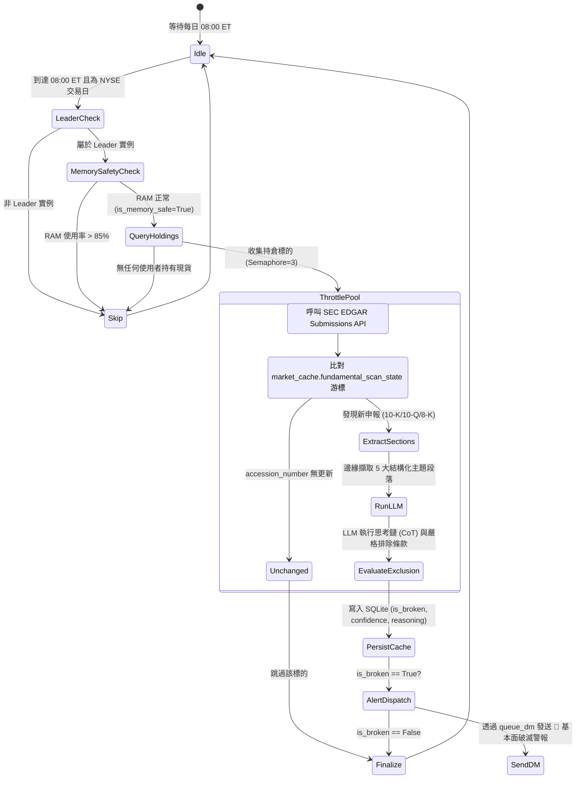

# SEC 財報護城河自動掃描器與嚴格排除條款規格書

---

## 1. 核心哲學與適用市場環境

### 1.1 核心哲學
在價值投資與長線選擇權策略中，標的資產的長期護城河（Economic Moat）是承擔時間價值損耗（Theta）與執行賣方防守的基石。然而，交易員在面臨財報發布與即時重大事件時，往往容易落入兩種心理認知偏誤：
1. **雜訊過度反應（Noise Overreaction）**：將總體經濟降息週期、通膨成本上升、匯率波動（FX Headwinds）或單季營收微幅落後等短期週期性逆風，誤判為企業基本面質變，導致在估值底部恐慌停損。
2. **結構沉沒盲區（Structural Sunk-Cost Blindness）**：在企業定價權瓦解、市佔率永久性流失或核心商業模式被顛覆時，盲目向下攤平轉倉，最終遭受毀滅性虧損。

Nexus Seeker 設計了**「每日 08:00 持倉自動掃描 ＋ 邊緣正則段落擷取 ＋ LLM 嚴格排除條款（Strict Exclusion Rule）」**的量化質化混合防禦體系，嚴格區隔「週期性總經逆風」與「個體結構性質變」，並搭配 5–14 天靜默期避讓（`avoid_silent_period`）及 1.4 倍 Event Loading 波動率風險懲罰溢價。

### 1.2 適用市場環境與制度角色
- **財報發布季（Earnings Season）**：持倉標的發布 10-K（年度報告）、10-Q（季度報告）或 8-K（重大事件當前報告）時，自動觸發即時質化評估。
- **重大突發事件（Breaking Events）**：CEO/CFO 突發解職（Item 5.02）、重大重整或資產減損（Item 2.05）、重編財報（Item 4.02）或重大合約終止（Item 1.02）時之即時預警。
- **盤前風險過濾**：於每日 08:00 ET 開盤前完成所有持倉標的掃描，結果直接存入 SQLite 快取，為盤中動態轉倉引擎（情境 1 原型假設破滅）提供零延遲判定依據。

---

## 2. 數學模型與量化推導

### 2.1 結構化段落擷取與字元窗格約束模型
SEC EDGAR 原始申報文本通常包含數萬至數十萬字元之 HTML/XML 標籤雜訊。邊緣服務 `nexus_edge_scraper/section_extractor.py` 透過預編譯正規表示式錨點（Regex Anchor Patterns），針對五大核心主題進行上下文窗格擷取：
- 窗格前後抓取長度：$C_{\text{context}} = 800$ 字元。
- 單一主題段落最大累計字元上限：$L_{\text{section}} = 5000$ 字元。
- 8-K 獨立關鍵事件項目上限：$L_{\text{item}} = 1200$ 字元。

對於本文中匹配之第 $j$ 個關鍵字位置 $pos_j$，其擷取區間 $[Start_j, End_j]$ 定義為：
$$Start_j = \max(0, pos_j - C_{\text{context}})$$
$$End_j = \min(|Text|, pos_j + len(match_j) + C_{\text{context}})$$
區間重疊部分自動合併（Interval Merging），總字元數受控於：
$$\sum |Interval_k| \le L_{\text{section}} = 5000$$

### 2.2 靜默期避讓機制與 Event Loading 波動率懲罰推導
在量化掃描與 Radar Terminal 中，當啟動 `avoid_silent_period` 篩選時，系統評估即將到來的財報與總經衝擊：
$$has\_earnings\_event = \mathbb{I}(t_{\text{today}} \le t_{\text{earnings}} \le t_{\text{today}} + 14 \text{ 天})$$
$$has\_macro\_event = \mathbb{I}(\exists e \in \text{Events}_{[t, t+14]}: \text{Impact}(e) = \text{"HIGH"} \lor \text{Type}(e) \in \{\text{"FOMC"}, \text{"CPI"}, \text{"NFP"}, \text{"FED DECISION"}\})$$

若 $has\_earnings\_event \lor has\_macro\_event$，該標的在雷達過濾中直接標記為不通過（`passed = False`）。

此外，在期權定價與 IVR 計算時，若即時隱含波動率（IV）抓取失敗而回退至快取值或歷史波動率代理值（`STORED_IV` 或 `HV_PROXY`）時，因歷史數值無法反映即將到來的二元事件跳空風險，系統強制乘上 1.4 倍 Event Loading 溢價因子：
$$IV_{\text{adjusted}} = IV_{\text{proxy}} \times 1.40$$
該調整後之 $IV_{\text{adjusted}}$ 將直接推升預期波幅（Expected Move）並壓低賣方適宜度，達成嚴格風控：
$$EM_{\text{adjusted}} = Spot \times IV_{\text{adjusted}} \times \sqrt{\frac{DTE}{365}}$$

### 2.3 護城河評估四維度與嚴格排除判定邏輯
LLM 核心推理框架建立在四維特徵空間與排除式二元分類器之上：
$$\mathbf{X} = [x_1, x_2, x_3, x_4]^T$$
其中：
1. $x_1$ (Forward Guidance)：未來財測大幅下修或撤回。
2. $x_2$ (Margin Compression)：毛利率或營業利益率結構性收縮，顯示終端定價權（Pricing Power）喪失。
3. $x_3$ (Market Share & Competition)：核心市場份額遭競爭對手實質侵蝕或主要客戶流失。
4. $x_4$ (Core Strategy)：管理層因核心業務失敗而被迫重大重組轉向。

**嚴格排除條款（Strict Exclusion Rule）之布林判斷式**：
設事件驅動因子集合為 $\Omega_{\text{drivers}}$：
$$\Omega_{\text{macro}} = \{\text{利率週期}, \text{通膨逆風}, \text{匯率 FX 波動}, \text{總體產業下行}, \text{單季微幅 Miss 但長期壁壘完整}\}$$
$$\Omega_{\text{structural}} = \{\text{定價權永久喪失}, \text{核心技術被替代淘汰}, \text{關鍵客戶不可逆流失}, \text{合約重大違約解約}\}$$

判斷邏輯：
$$is\_broken = \begin{cases}
\text{False} & \text{若 } \Omega_{\text{drivers}} \subseteq \Omega_{\text{macro}} \\
\text{True} & \text{若且唯若 } \exists d \in \Omega_{\text{structural}} \land \mathbf{X} \text{ 滿足結構性惡化}
\end{cases}$$

---

## 3. 決策邏輯與狀態機 / 流程圖

### 3.1 每日 08:00 持倉財報掃描與 LLM 推理狀態機

---

## 4. 關鍵具名常數與物理約束

| 常數名稱 | 數值 / 門檻 | 物理約束與代碼意涵 | 程式碼檔案路徑 |
| :--- | :--- | :--- | :--- |
| `SECTION_CHAR_LIMIT` | `5000` 字元 | 單一結構化段落最大字元擷取上限（防止 Token 暴增） | `nexus_edge_scraper/section_extractor.py:16` |
| `_KEY_EVENT_ITEM_CHAR_LIMIT` | `1200` 字元 | 8-K 獨立 Item 事件擷取硬上限（避免單一事件佔滿窗格） | `nexus_edge_scraper/section_extractor.py:119` |
| `_8K_ITEM_HEADER_PATTERN` | 正則比對 | 8-K Dotted Item 標題定位正則 (`Item \d+\.\d{2}`) | `nexus_edge_scraper/section_extractor.py:113` |
| `RAM_SAFETY_LIMIT` | `85.0%` | VPS 記憶體防護水位門檻（超過則中斷 LLM 呼叫） | `nexus_core/services/llm_service.py` |
| `EVENT_LOADING_MULTIPLIER` | `1.40` (1.4x) | 缺乏即時 IV 且處於事件前夕時的波動率補償倍數 | `nexus_core/market_analysis/sentiment/iv_metrics.py:513` |
| `SILENT_PERIOD_BUFFER_DAYS` | `14` 天 | 總經重大事件與財報事件靜默期前瞻天數 | `nexus_core/market_analysis/sentiment/iv_metrics.py:486` |
| `HOLDINGS_SCAN_CONCURRENCY` | `3` (Semaphore) | 盤前持倉掃描併發連線數上限 | `nexus_core/cogs/trading/fundamental_filing_monitor.py:85` |

---

## 5. 邊界條件、風控熔斷與例外處理

### 5.1 申報類型專屬適配提示詞（Form-Type Prompt Adaptation）
不同申報表單具有截然不同的資訊噪音比與審計深度，系統自動於提示詞中動態附帶表單適配準則：
1. **10-K（年度報告）**：高權重全年度趨勢與跨年度結構性變化，將 Risk Factors 與 MD&A 中的增刪陳述視為董事會審定之重大訊號。
2. **10-Q（季度報告）**：雜訊顯著高於年報。嚴格執行排除條款，單一季度業績不如預期、季節性放緩或一次性減損，一律判定為 `is_broken = false`；僅當呈現跨季度連續利潤率收縮或連續下修時才考慮採納。
3. **8-K（重大事件報告）**：不具備完整財務論述，採事件項目精確權重分流：
   - **高信號（High Signal）**：`Item 2.05`（業務退出/資產減損）、`Item 2.02`（業績發布伴隨財測下修）、`Item 4.02`（財報不可信賴/重編）、`Item 5.02`（非正常之 CEO/CFO 突發解職）、`Item 1.01/1.02`（核心重大合約終止）。
   - **低信號/行政程序（Low Signal）**：`Item 7.01`（常規投資人簡報）、`Item 8.01`（其他行政公告）、計劃內之董事退休。
4. **NEWS（新聞/電話會議節錄）**：嚴格區分官方證實消息與未經證實之市場傳言，置信度上限強制約束在 $\le 0.75$。

### 5.2 VPS 資源安全防護與失敗隔離
- **記憶體熔斷**：在執行任何 LLM 結構化推論前，必須檢查 `is_memory_safe()`。若 VPS 記憶體使用率 $> 85\%$，立即終止該輪掃描，游標不推進，於次日排程重試，避免造成 Discord Bot 主行程崩潰。
- **游標去重（Accession Cursor）**：透過比對 SEC 最新發配之 `accession_number`，若與 SQLite 資料庫內紀錄相同，代表無新申報，立即略過後續段落擷取與 LLM 調用，保護 API 限額。

---

## 6. 核心程式碼檔案路徑關聯

- `nexus_core/cogs/trading/fundamental_filing_monitor.py`
  - `fundamental_filing_scan`: 每日 08:00 ET 持倉標的自動化掃描排程器
  - `_scan_holdings_for_new_filings`: 收集持倉並透過 `Semaphore(3)` 限速掃描
- `nexus_edge_scraper/section_extractor.py`
  - `ExtractedSections`: 5 大主題結構化段落資料容器
  - `_FORWARD_GUIDANCE_KEYWORDS`, `_MARGIN_KEYWORDS`, `_MARKET_SHARE_KEYWORDS`: 正則錨點庫
  - `_8K_ITEM_HEADER_PATTERN`: 8-K Dotted Item 正則定位
- `nexus_core/market_analysis/dynamic_rollover/fundamental_thesis.py`
  - `evaluate_fundamental_thesis_impl`: LLM 護城河判定核心實作與思考鏈框架
  - `_FORM_TYPE_PROMPT_NOTES`: 10-K, 10-Q, 8-K, NEWS 專屬提示詞附錄
- `nexus_core/market_analysis/sentiment/iv_metrics.py`
  - 14 天財報/總經靜默期檢測與 1.4x Event Loading 溢價計算
- `nexus_core/cogs/unified_terminal/batch_scan.py`
  - `avoid_silent_period` 量化雷達過濾閘門
