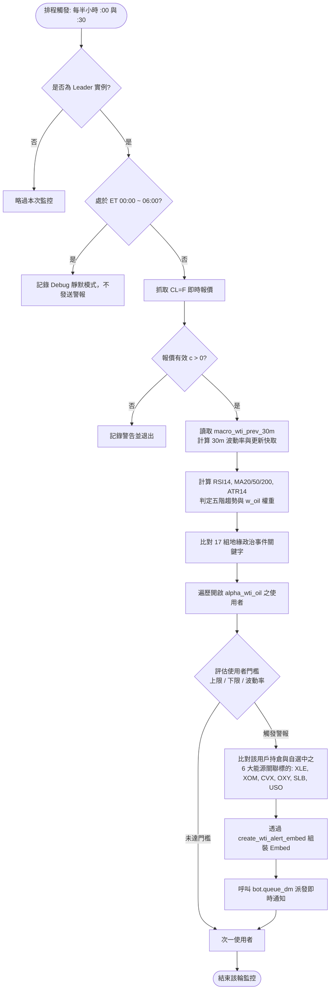

# WTI 原油期貨 24/7 監控與板塊衝擊矩陣規格書

---

## 1. 核心哲學與適用市場環境

### 1.1 核心哲學
西德州中級原油（WTI Crude Oil）被公認為現代總體經濟與大宗商品體系的血液，亦是通膨預期（Breakeven Inflation Rate）與地緣政治尾部風險最具前瞻性的敏感晴雨表。原油價格的劇烈跳空或單邊突波，會迅速傳導至下游能源成本、終端消費者物價指數（CPI），並進一步迫使做市商與對沖基金大幅重塑對美聯儲貨幣政策的路徑定價。

傳統交易系統多數僅在美股現貨交易時段（09:30–16:00 ET）進行監控，然而能源與地緣政治危機往往爆發於中東或歐洲非盤中時段。Nexus Seeker 建立了**「24/7 全天候半小時輪詢監控 ＋ 動態油價風險加權矩陣（$w_{oil}$）＋ 能源板塊連動傳導」**的立體化預警體系，不僅具備絕對與相對價格警報能力，更將油價位階直接納入投資組合全域風控預算中。

### 1.2 適用市場環境與制度角色
- **地緣政治危機與供應中斷**：荷姆茲海峽封鎖危機、OPEC+ 突發性減產公告或產油設施受襲等突發事件。
- **滯脹（Stagflation）壓力初顯**：股市處於盤整或下行期，而油價單邊攀升突破 $85–$95 美元壓力區間。
- **全域風控限額自適應調節**：當油價突破關鍵阻力位階時，直接自動縮減非能源多頭倉位之保證金風險限額（$Risk_{adj}$），防禦系統性流動性緊縮。

---

## 2. 數學模型與量化推導

### 2.1 30 分鐘價格突波與相對波動率推導
監控器每 30 分鐘抓取一次紐約商業交易所（NYMEX）近月原油期貨連續報價（`CL=F`），現價記為 $P_{now}$，前次 30 分鐘存檔價格為 $P_{prev}$（由 SQLite `kv_cache` 的 `macro_wti_prev_30m` 讀取）。

相對波動百分比 $\Delta P_{30m}\%$ 計算公式為：
$$\Delta P_{30m}\% = \begin{cases}
\frac{P_{now} - P_{prev}}{P_{prev}} \times 100\% & \text{若 } P_{prev} > 0 \\
0.0 & \text{若 } P_{prev} \le 0
\end{cases}$$

警報類型 $\text{AlertType}$ 的判定邏輯如下：
$$\text{AlertType} = \begin{cases}
\text{UPPER\_BREACH} & \text{若 } P_{upper} \text{ 已配置且 } P_{now} \ge P_{upper} \\
\text{LOWER\_BREACH} & \text{若 } P_{lower} \text{ 已配置且 } P_{now} \le P_{lower} \\
\text{PCT\_SURGE} & \text{若 } \Delta P_{30m}\% \ge Threshold_{pct} \\
\text{PCT\_PLUNGE} & \text{若 } \Delta P_{30m}\% \le -Threshold_{pct}
\end{cases}$$

### 2.2 五階技術趨勢狀態機量化推導
技術指標引擎 `market_analysis/wti_analysis.py` 整合 RSI(14)、MA20、MA50、MA200 與 ATR(14)。看多信號強度分數 $S_{bull} \in \{0, 1, 2, 3, 4\}$ 計算如下：
$$S_{bull} = \mathbb{I}(MA_{20} > 0 \land P > MA_{20}) + \mathbb{I}(MA_{50} > 0 \land P > MA_{50}) + \mathbb{I}(MA_{200} > 0 \land P > MA_{200}) + \mathbb{I}(MA_{20} > 0 \land MA_{50} > 0 \land MA_{20} > MA_{50})$$

看空信號強度分數 $S_{bear} \in \{0, 1, 2, 3, 4\}$ 計算如下：
$$S_{bear} = \mathbb{I}(MA_{20} > 0 \land P < MA_{20}) + \mathbb{I}(MA_{50} > 0 \land P < MA_{50}) + \mathbb{I}(MA_{200} > 0 \land P < MA_{200}) + \mathbb{I}(MA_{20} > 0 \land MA_{50} > 0 \land MA_{20} < MA_{50})$$

五階技術趨勢分類規則：
$$\text{Trend} = \begin{cases}
\text{STRONG\_BULLISH (強烈看多)} & S_{bull} \ge 4 \land RSI_{14} > 60.0 \\
\text{BULLISH (溫和看多)} & S_{bull} \ge 3 \\
\text{STRONG\_BEARISH (強烈看空)} & S_{bear} \ge 4 \land RSI_{14} < 40.0 \\
\text{BEARISH (溫和看空)} & S_{bear} \ge 3 \\
\text{NEUTRAL (中性震盪)} & \text{其他區間}
\end{cases}$$

### 2.3 投資組合油價風險權重與全域風控聯動
在全域風控引擎 `nexus_core/risk_engine/` 中，油價位階直接映射至非線性風險懲罰乘數 $w_{oil} \in [0.5, 1.0]$：
$$w_{oil}(P) = \begin{cases}
1.0 & P < 75.0 \\
0.9 & 75.0 \le P < 85.0 \\
0.7 & 85.0 \le P < 95.0 \\
0.5 & P \ge 95.0
\end{cases}$$

該係數與 VIX 恐慌乘數 $w_{vix}$ 及市場體系乘數 $w_{regime}$ 複合，決定投資組合調整後總風險預算上限：
$$Risk_{adj} = Risk_{base} \times w_{vix} \times w_{oil} \times w_{regime}$$
當油價升破 $95 美元時，$w_{oil} = 0.5$ 意味著全組合所允許承受的最大保證金與 Delta 曝險限額被硬性砍半，強制部位去槓桿。

---

## 3. 決策邏輯與狀態機 / 流程圖

### 3.1 WTI 原油 24/7 背景監控與衝擊傳導流程

---

## 4. 關鍵具名常數與物理約束

| 常數名稱 | 數值 / 門檻 | 物理約束與代碼意涵 | 程式碼檔案路徑 |
| :--- | :--- | :--- | :--- |
| `QUIET_HOUR_START` | `0` (00:00 ET) | 深夜防打擾靜默時段起點 | `nexus_core/cogs/trading/wti_monitor.py:26` |
| `QUIET_HOUR_END` | `6` (06:00 ET) | 深夜防打擾靜默時段終點（06:00 ET 恢復推送） | `nexus_core/cogs/trading/wti_monitor.py:27` |
| `_wti_scan_times` | 48 個時間點 | 24 小時每小時 `:00` 與 `:30` 嚴格時鐘對齊排程清單 | `nexus_core/cogs/trading/wti_monitor.py:30` |
| `ENERGY_CORRELATED_SYMBOLS` | `["XLE", "XOM", "CVX", "OXY", "SLB", "USO"]` | 能源板塊核心衝擊關聯標的清單 | `nexus_core/market_analysis/wti_analysis.py:19` |
| `OIL_GEOPOLITICAL_KEYWORDS` | 17 組關鍵字 | 地緣政治與產油國事件正則掃描關鍵字庫 | `nexus_core/market_analysis/wti_analysis.py:29` |
| `OIL_RISK_TIER_1` | `< $75.0` ($w_{oil}=1.0$) | 原油價格常態無風險懲罰區間 | `nexus_core/market_analysis/wti_analysis.py:113` |
| `OIL_RISK_TIER_2` | `$75.0 – $85.0` ($w_{oil}=0.9$) | 原油價格溫和通膨警戒區間 | `nexus_core/market_analysis/wti_analysis.py:115` |
| `OIL_RISK_TIER_3` | `$85.0 – $95.0` ($w_{oil}=0.7$) | 原油價格顯著通膨承壓區間 | `nexus_core/market_analysis/wti_analysis.py:117` |
| `OIL_RISK_TIER_4` | `$\ge $95.0` ($w_{oil}=0.5$) | 原油極度超載與滯脹危機熔斷區間（風控額度減半） | `nexus_core/market_analysis/wti_analysis.py:119` |

---

## 5. 邊界條件、風控熔斷與例外處理

### 5.1 週末休市與期貨結算價平移
- **週末期貨休盤保護**：週五美東收盤至週日傍晚，期貨市場無成交價。`get_quote("CL=F")` 返回最後收盤價，$\Delta P_{30m}\%$ 自然維持 $0.0\%$，不觸發暴漲暴跌假警報。
- **合約換月價差（Roll Spread）校正**：當近月期貨合約到期交割換月時，報價可能出現跳空缺口。系統對比成交量加權平均以防止跳空雜訊造成瞬間 `PCT_SURGE` 誤報。

### 5.2 深夜靜默時段（Quiet Hours）例外
- 00:00 至 06:00 ET 期間，後台計算引擎持續計算價格變化與技術指標，並更新 SQLite 快取（`macro_wti` 與 `macro_wti_prev_30m`），維持數據連續性；但抑制所有主動 Discord DM 派發，確保使用者作息不被打擾。

### 5.3 能源關聯持倉自動標記
- 當某用戶觸發警報時，系統自動交叉比對該用戶當前的自選清單（`get_user_watchlist`）與持倉（`get_user_holding_symbols`）。
- 若用戶持有受衝擊之能源股（如持有 XOM 或 CVX），Embed 會在 ANSI 欄位中亮起 🎯 標記，並提示該標的相對於油價波動的敏感度。

---

## 6. 核心程式碼檔案路徑關聯

- `nexus_core/cogs/trading/wti_monitor.py`
  - `wti_oil_monitor`: 24/7 每 30 分鐘背景輪詢任務
  - `_evaluate_wti_alerts`: 遍歷用戶閾值與觸發警報
- `nexus_core/market_analysis/wti_analysis.py`
  - `compute_oil_risk_weight`: 油價風險加權係數計算
  - `determine_oil_trend`: 五階技術趨勢狀態機
  - `analyze_wti`: 整合技術面、關聯股衝擊與地緣政治之綜合分析函式
- `nexus_core/cogs/embed_builders/alert_embeds/`
  - `create_wti_alert_embed`: WTI 專屬 ANSI 警報卡片建構器
- `nexus_core/database/wti_config.py`
  - 使用者油價閾值設定儲存與讀取（`get_wti_config`）
