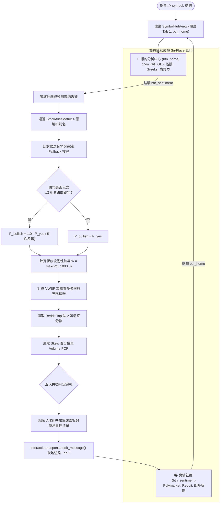

# Polymarket VWBP 加權勝率與雙頁籤輿情共振雷達規格書

---

## 1. 核心哲學與適用市場環境

### 1.1 核心哲學
在資訊不對稱的美股金融市場中，不同群體的資金行為具有顯著的特徵差異：
1. **去中心化預測市場（Prediction Markets，如 Polymarket）**：參與者以真金白銀在智能合約上下注離散二元事件（如「聯準會 9 月降息 2 碼？」、「輝達 Q3 營收超過 350 億？」）。因資金成本真實存在，其定價往往比賣方分析師研究報告更能反映聰明錢（Smart Money）與巨鯨的真實機率分佈。
2. **社群論壇（Social Feeds，如 Reddit WSB/Stocks）**：反映了高度散戶化的群眾心理（Retail Sentiment），極易出現群聚效應（Herd Behavior）、非理性亢奮（FOMO）或集體恐慌（Panic Selling）。
3. **做市商期權微觀結構（Option Microstructure，如 Skew 與 Volume PCR）**：反映了機構造市商對極端尾部風險的真實避險定價成本。

Nexus Seeker 設計了**「多層別名矩陣（StockAliasMatrix）自動關聯 ＋ 成交量加權看多勝率（VWBP）數學模型 ＋ 雙頁籤互動架構 ＋ 四維共振雷達」**，將預測市場巨鯨、社群散戶與期權做市商的定價信號融合為一體，揭示多空背離（Divergence）或全域共振（Resonance）的關鍵交易契機。

### 1.2 適用市場環境與制度角色
- **重大財報與產品發布會前夕**：比對預測市場對公司關鍵指標達標的機率與 Reddit 散戶情緒。
- **極端情緒背離頂底捕捉**：當散戶極度樂觀但機構大舉購買 Put 避險（Skew > 80%）時發出逃頂警報；或散戶恐慌拋售但巨鯨在預測市場看多且 Skew 極度低廉（< 20%）時發出左側抄底指引。
- **終端深度分析（Symbol Hub）**：於 `/x symbol:` 中提供秒級回應的雙頁籤切換體驗（`btn_home` 微結構主頁 vs `btn_sentiment` 輿情社群頁）。

---

## 2. 數學模型與量化推導

### 2.1 13 組看跌問句方向性標準化（Polarity Normalization）
Polymarket 上針對個股或事件的問句存在兩種相反的語義方向。例如「Will NVDA drop below $100?」的 "Yes" 代表看空；而「Will NVDA reach $150?」的 "Yes" 代表看多。

系統建立 13 組看跌關鍵字庫：
$$\Omega_{\text{bearish}} = \{\text{"drop"}, \text{"fall"}, \text{"down"}, \text{"below"}, \text{"under"}, \text{"crash"}, \text{"miss"}, \text{"loss"}, \text{"decline"}, \text{"bear"}, \text{"recession"}, \text{"bankruptcy"}\}$$

對於第 $i$ 個匹配合約，其問句文本記為 $Q_i$。其標準化看多機率 $P_{bullish, i}$ 定義為：
$$P_{bullish, i} = \begin{cases}
1.0 - P_{yes, i} & \text{若 } \exists k \in \Omega_{\text{bearish}} : k \in \operatorname{lower}(Q_i) \\
P_{yes, i} & \text{否則}
\end{cases}$$

### 2.2 成交量加權看多勝率 (VWBP) 演算法
在預測市場中，各合約的資金流動性極不均衡。若採簡單算術平均，極低流動性合約（例如池量僅數十美元）的雜訊會扭曲整體勝率；若直接以成交量為權重，零成交量合約將完全被除名。

Nexus Seeker 引入**名義保底流動性權重（Nominal Floor Liquidity Weight）**機制：
$$w_i = \max(Vol_i, 1000.0)$$

其中 $Vol_i$ 為該合約之累計成交量（單位：美元）。
綜合成交量加權看多勝率（Volume-Weighted Bullish Probability, VWBP）推導公式為：
$$\text{VWBP} = \frac{\sum_{i=1}^n \left( P_{bullish, i} \times w_i \right)}{\sum_{i=1}^n w_i}$$

同時累計真實市場總池量：
$$Vol_{\text{actual}} = \sum_{i=1}^n Vol_i$$

綜合看多百分比 $\text{VWBP}\% = \text{VWBP} \times 100.0\%$，其三階分類門檻如下：
$$\text{Whale Tag} = \begin{cases}
\text{🟢 } \text{VWBP}\% \text{ 巨鯨看多} & \text{VWBP}\% \ge 55.0\% \\
\text{🔴 } \text{VWBP}\% \text{ 巨鯨偏空} & \text{VWBP}\% \le 45.0\% \\
\text{⚖️ } \text{VWBP}\% \text{ 中性分歧} & 45.0\% < \text{VWBP}\% < 55.0\%
\end{cases}$$

### 2.3 StockAliasMatrix 4 層別名解析矩陣
Polymarket 合約問句鮮少直接使用 Ticker 代號，多使用高管姓名或產品名。`StockAliasMatrix` 提供四層拓撲對齊：
1. **Level 1 (Ticker 代號)**：如 `NVDA`, `TSLA`, `AAPL`。
2. **Level 2 (公司正式與俗稱)**：如 `Nvidia`, `Tesla`, `Apple`。
3. **Level 3 (旗艦產品與關鍵技術)**：如 `Blackwell`, `H100`, `Cybertruck`, `FSD`, `Vision Pro`。
4. **Level 4 (核心靈魂人物與高管)**：如 `Jensen Huang`（黃仁勳）, `Elon Musk`（馬斯克）, `Tim Cook`（庫克）。

只要問句文本命中任一層別名，即建立該合約與標的之拓撲映射。

**別名資料的自動填充解析架構（與上述比對層級為正交概念）**：上方 4 層是「文本比對哪一種別名」，`StockAliasMatrix` 另有一套獨立的「別名資料從哪裡取得」4 層快取解析架構，兩者不可混淆：
1. **Tier 1（靜態表 `STOCK_ALIAS_MAP`）**：內建 100+ 檔美股科技/生技/能源/金融個股與大盤 ETF 的預編譯字典，0ms 查詢延遲。
2. **Tier 2（記憶體 LRU 快取 `_dynamic_alias_cache`）**：已解析過的非內建標的直接快取於記憶體，供同一進程生命週期內瞬時複用。
3. **Tier 3（SQLite 持久化快取 `kv_cache`，鍵值前綴 `stock_aliases_{symbol}`）**：跨服務重啟仍保留已動態解析過的別名，避免每次啟動都重新打 API。
4. **Tier 4（Finnhub / yfinance 公司檔案自動衍生）**：對完全陌生的標的（如 `RKLB`、`ASTS`、`SOFI`），即時抓取公司檔案，透過 `clean_company_name()` 清除法律尾綴（`Inc.`、`Corp.`、`Ltd.`、`Holdings`）並保留具辨識度的雙字品牌（如 `Super Micro`、`Taiwan Semiconductor`），寫回 Tier 2/3 供後續查詢命中。

### 2.4 四維輿情共振雷達與五大情境判定矩陣
共振雷達整合：
- $Whale \in \{\text{Bullish}, \text{Bearish}, \text{Neutral}\}$（來自 VWBP）
- $Retail \in \{\text{Bullish}, \text{Bearish}, \text{Neutral}\}$（來自 Reddit 貼文情感分析）
- $SkewPercentile \in [0, 100]\%$（25-Delta Put/Call 波動率偏斜百分位）
- $PCR_{\text{volume}}$（期權成交量沽購比）

五大共振情境判定準則：
1. **情境 1：散戶極度 FOMO vs 機構買 Put 避險 (Skew > 80%)**
   - 條件：$Retail = \text{Bullish} \land SkewPercentile > 80.0\%$
   - 評級：`⚠️ 散戶極度 FOMO 但機構買 Put 避險 (Skew > 80%)`
   - 指引：短線嚴禁追高買權；現貨建議逢高落袋或建立保護性賣權。
2. **情境 2：散戶恐慌拋售 vs 機構偏斜低廉/巨鯨護航**
   - 條件：$Retail = \text{Bearish} \land (SkewPercentile < 20.0\% \lor Whale = \text{Bullish})$
   - 評級：`💡 散戶恐慌拋售 vs 機構偏斜低廉/巨鯨護航`
   - 指引：勿盲目殺跌；具左側反彈潛力，可評估逢低分批接刀或賣出 Put。
3. **情境 3：巨鯨散戶同步看多且期權微結構健康**
   - 條件：$Retail = \text{Bullish} \land (Whale = \text{Bullish} \lor SkewPercentile \le 80.0\%)$
   - 評級：`💎 巨鯨散戶同步看多，期權結構健康`
   - 指引：現貨續抱；做多期權優先選擇平值或順勢牛市價差策略。
4. **情境 4：多重共振偏空，期權沽購比升溫**
   - 條件：$Retail = \text{Bearish} \land (Whale = \text{Bearish} \lor PCR_{\text{volume}} > 1.2)$
   - 評級：`💀 多重共振偏空，期權沽購比升溫`
   - 指引：防守為上；降低多頭曝險，嚴守支撐位並配置保護性頭寸。
5. **情境 5：輿情多空分歧**
   - 條件：其他無明確共振之平衡狀態。
   - 評級：`⚖️ 輿情多空分歧，期權籌碼處於平衡區間`
   - 指引：保持觀察；等待催化事件或方向性共振突破。

---

## 3. 決策邏輯與狀態機 / 流程圖

### 3.1 雙頁籤終端切換與輿情共振雷達生成流程

---

## 4. 關鍵具名常數與物理約束

| 常數名稱 | 數值 / 門檻 | 物理約束與代碼意涵 | 程式碼檔案路徑 |
| :--- | :--- | :--- | :--- |
| `MIN_NOMINAL_WEIGHT` | `1000.0` (美元) | 預測市場保底名義流動性權重（防止零量合約被抹除或除零） | `nexus_core/cogs/unified_terminal/utils.py:386` |
| `BULLISH_THRESHOLD_PCT` | `55.0%` | 巨鯨看多判定門檻 | `nexus_core/cogs/unified_terminal/utils.py:400` |
| `BEARISH_THRESHOLD_PCT` | `45.0%` | 巨鯨偏空判定門檻 | `nexus_core/cogs/unified_terminal/utils.py:402` |
| `BEARISH_KEYWORDS_COUNT`| `13` 組關鍵字 | 語義看跌反轉判定關鍵字庫總數 | `nexus_core/cogs/unified_terminal/utils.py:274` |
| `SKEW_HIGH_PERCENTILE` | `80.0%` | 機構極度買 Put 避險警戒線 | `nexus_core/cogs/embed_builders/alert_embeds/sentiment_feeds.py:113` |
| `SKEW_LOW_PERCENTILE`  | `20.0%` | 機構偏斜極度低廉/無看空踩踏線 | `nexus_core/cogs/embed_builders/alert_embeds/sentiment_feeds.py:114` |
| `PCR_BEARISH_THRESHOLD` | `1.20` | Volume PCR 沽購比高於此值視為空頭顯著升溫 | `nexus_core/cogs/embed_builders/alert_embeds/sentiment_feeds.py:103` |
| `PCR_BULLISH_THRESHOLD` | `0.70` | Volume PCR 沽購比低於此值視為多頭買氣旺盛 | `nexus_core/cogs/embed_builders/alert_embeds/sentiment_feeds.py:105` |

---

## 5. 邊界條件、風控熔斷與例外處理

### 5.1 Polymarket API 延遲與在線搜尋回退（Online Fallback）
- **快照優先**：系統優先在背景排程抓取的快照候選合約（`candidate_markets`）中進行別名過濾，達成 0 延遲渲染。
- **在線回退搜尋**：若快照中未命中任何合約，自動透過 `bot.polymarket_service.get_symbol_markets(symbol, limit=5, active_only=True)` 發起在線搜尋；若依然無合約，雷達面板中顯示 ` └─ 狀態: 暫無預測市場數據`，共振引擎安全將巨鯨信號標記為中性，不阻斷其他模組。

### 5.2 零成交量與極端小資金合約防護
- 當預測合約無人下注（$Vol_i = 0$）時，保底權重 $w_i = 1000.0$ 保證其機率仍以微弱名義比重參與平均，且分母絕對大於 0（$\sum w_i \ge 1000 > 0$），徹底杜絕 ZeroDivisionError。
- 在呈現層，若 $Vol_{\text{actual}} = 0$，格式化標籤會自動省略池量顯示，僅標記 `(N檔加權)`，向交易員誠實揭露流動性真實性。

### 5.3 雙頁籤就地切換與 Discord Token 逾時防禦
- `SymbolHubView` 內建 300 秒超時機制。所有的按鈕切換均採用 `interaction.response.edit_message()` 就地更新單一訊息，完全不建立新的 Followup 訊息，杜絕 Discord API 40094 限制，並維持界面潔淨。

---

## 6. 核心程式碼檔案路徑關聯

- `nexus_core/cogs/unified_terminal/utils.py`
  - `calculate_polymarket_weighted_odds`: VWBP 加權看多勝率計算演算法
  - `_is_bearish_market_question`: 13 組看跌關鍵字反轉判定函式
  - `_get_matched_poly_markets`: Polymarket 合約別名過濾與線上回退
- `nexus_core/market_analysis/stock_alias_matrix.py`
  - `StockAliasMatrix`: 4 層拓撲別名對齊庫
  - `_dynamic_alias_cache` / `clean_company_name`: 別名自動填充解析架構之 Tier 2 記憶體快取與公司名稱清理函式
- `nexus_core/cogs/unified_terminal/symbol_view.py`
  - `SymbolHubView`: 雙頁籤互動視圖控制器（`btn_home` 與 `btn_sentiment`）
- `nexus_core/cogs/embed_builders/alert_embeds/sentiment_feeds.py`
  - `create_media_sentiment_embed`: 四維輿情與期權共振雷達 ANSI 面板建構器
