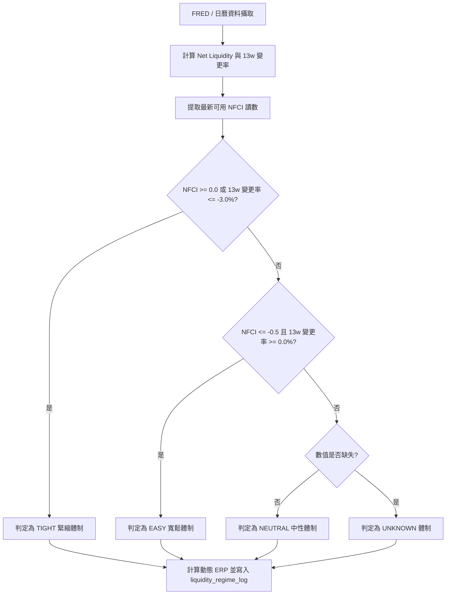

# 央行淨流動性體制與宏觀預期差標準化規格書

---

## 1. 核心哲學與適用市場環境

### 1.1 核心哲學
總體經濟流動性是美股全市場估值倍數與資產定價的總水喉。在現代央行體系下，資產價格的擴張與收縮高度取決於聯準會實質向銀行體系注入或抽離的準備金水位。傳統新聞媒體單純關注聯準會總資產負債表規模，卻往往忽略財政部存款帳戶（TGA）與隔夜逆回購（ON RRP）對市場資金池的強大沖銷作用。

Nexus Seeker 引進華爾街機構等級之**央行淨流動性指標（Fed Net Liquidity）**與**芝加哥聯準會金融狀況指數（NFCI）**雙維度檢驗，構建**流動性三態狀態機（EASY / NEUTRAL / TIGHT）**，並對折現模型中的股權風險溢價（ERP）進行動態線性擾動。

在個體總經事件層面，傳統百分比變更率 $\frac{A - F}{F}$ 在基數接近零軸的指標（如月增率 CPI MoM）上存在除以零與極端發散的奇點缺陷。本架構統一採用**歷史波動率標準化預期差（Standardized Surprise Z-Score）**，以過去 12 期滾動樣本標準差消除量綱差異，精確捕捉市場預期差衝擊。

### 1.2 適用市場環境
- **量化緊縮 (QT) 與流動性拐點**：在 TGA 補庫存或逆回購耗盡時，淨流動性急速萎縮，觸發 TIGHT 體制警報。
- **降息循環與流動性擴張**：在資金面轉向寬鬆且金融狀況指數低於 -0.5 時，確認 EASY 體制。
- **非農就業與通膨公布窗口**：在美東時間 08:30 與 10:00 關鍵總經數據發布時，即時量化實質預期差標準分數。

---

## 2. 數學模型與量化推導

### 2.1 央行淨流動性模型 (Fed Net Liquidity)
央行淨流動性反映扣除財政部在聯準會之存款與貨幣市場吸收工具後的真實可用銀行體系流動性：
$$\text{Net Liquidity}_t = \text{WALCL}_t - \text{WTREGEN}_t - \text{RRPONTSYD}_t$$
其中各項物理單位均折算為十億美元（Billion USD）：
- $\text{WALCL}_t$：聯準會總資產（單位：百萬美元，換算需除以 $1000$）。
- $\text{WTREGEN}_t$：財政部一般帳戶餘額（TGA，單位：百萬美元，換算需除以 $1000$）。
- $\text{RRPONTSYD}_t$：紐約聯準銀行隔夜逆回購用量（單位：十億美元）。

13 週季化動態變更率：
$$\Delta_{13w} = \frac{\text{Net Liquidity}_t - \text{Net Liquidity}_{t-13w}}{\text{Net Liquidity}_{t-13w}} \times 100\%$$

### 2.2 流動性體制狀態機 (Liquidity Regime Machine)
$$\text{Regime} = \begin{cases}
\text{TIGHT} & \text{若 } \text{NFCI}_t \ge 0.0 \lor \Delta_{13w} \le -3.0\% \\
\text{EASY} & \text{若 } \text{NFCI}_t \le -0.5 \land \Delta_{13w} \ge 0.0\% \\
\text{NEUTRAL} & \text{其他一般狀況} \\
\text{UNKNOWN} & \text{關鍵觀測值缺失或前視窗口尚未到達可用日}
\end{cases}$$

### 2.3 動態股權風險溢價模型 (Dynamic ERP)
以芝加哥聯準會金融狀況指數（NFCI）對市場基準股權風險溢價進行線性擾動：
$$\text{ERP}_t = \text{ERP}_{\text{BASE}} + \lambda_{\text{NFCI}} \cdot \text{clip}(\text{NFCI}_t, -1.0, +2.0)$$
- 基準溢價：$\text{ERP}_{\text{BASE}} = 0.045$（4.5%）。
- 敏感度係數：$\lambda_{\text{NFCI}} = 0.010$（NFCI 緊縮 1 個標準差，ERP 上調 100 bps）。

### 2.4 宏觀預期差標準化模型 (Standardized Macro Surprise)
$$z_t = \frac{A_t - F_t}{\sigma_{12}(A - F)}$$
其中：
- $A_t$：實際公布數值。
- $F_t$：發布前市場共識預測值。
- $\sigma_{12}(A - F)$：過去 12 期已公布之歷史預期差樣本標準差（自由度 $N - 1$）：
$$\sigma_{12} = \sqrt{\frac{1}{N - 1} \sum_{i=1}^{N} \left( (A_i - F_i) - \overline{(A - F)} \right)^2}$$
- 最小樣本防禦：若歷史樣本數 $N < 6$，不計算 $z$ 值（標記為 `None`），僅保留原始差值 $\text{raw\_diff} = A_t - F_t$。
- 極端值箝制：$z_t = \text{clip}(z_t, -4.0, +4.0)$。

---

## 3. 決策邏輯與狀態機 / 流程圖

---

## 4. 關鍵具名常數與物理約束

| 具名常數 | 數值 / 類型 | 物理意義與約束說明 |
|---|---|---|
| `DEFAULT_BASE_ERP` | `0.045` (float) | 基準股權風險溢價 (4.5%) |
| `DEFAULT_LAMBDA_NFCI` | `0.010` (float) | NFCI 敏感度因子 (每標準差 100 bps) |
| `NFCI_TIGHT_THRESHOLD` | `0.0` (float) | 金融狀況緊縮門檻 |
| `NET_LIQ_13W_TIGHT_PCT` | `-3.0` (float) | 淨流動性 13 週季化緊縮門檻百分比 |
| `NFCI_EASY_THRESHOLD` | `-0.5` (float) | 金融狀況寬鬆門檻 |
| `NET_LIQ_13W_EASY_PCT` | `0.0` (float) | 淨流動性 13 週擴張門檻百分比 |
| `MIN_SURPRISE_SAMPLES` | `6` (int) | 計算 Z 分數之最少歷史預期差樣本數 |
| `MAX_SURPRISE_LOOKBACK` | `12` (int) | 歷史預期差回溯樣本上限 |
| `Z_SCORE_CLIP_MIN` | `-4.0` (float) | Z 分數極小值箝制下限 |
| `Z_SCORE_CLIP_MAX` | `4.0` (float) | Z 分數極大值箝制上限 |

---

## 5. 邊界條件、風控熔斷與例外處理
- **樣本不足防護**：若總經指標公布歷史少於 6 期，系統強制將 $z$ 分數置為 `None`，僅記錄原始差值，防止高波動性小樣本導致定價模型除法溢位。
- **除以零與方差為零防護**：若歷史預期差完全相同（方差 $\le 10^{-9}$），強制將 $z$ 分數置為 `None`。
- **量綱自動對齊**：日曆字串解析自動識別 `%`、`K`、`M`、`B`，確保實際值與共識預測值維持一致量綱尺度。
- **可用日延遲防前視偏差**：FRED 序列依其官方公布節奏（`weekly_nfci` 延遲 5 天，`weekly_h41` 延遲 2 天）設定可用日，回測與前向驗證嚴禁引用尚未發布之未來數據。

---

## 6. 核心程式碼檔案路徑關聯
- `nexus_core/market_analysis/fundamental_pipeline/liquidity_regime.py`
- `nexus_core/market_analysis/fundamental_pipeline/macro_surprise.py`
- `nexus_core/market_analysis/fundamental_pipeline/models.py`
- `nexus_core/services/liquidity_service.py`
- `nexus_core/services/macro_surprise_service.py`
- `nexus_core/database/fundamental_pipeline.py`
- `nexus_core/database/migrations/v090_add_liquidity_and_macro_surprise.py`
