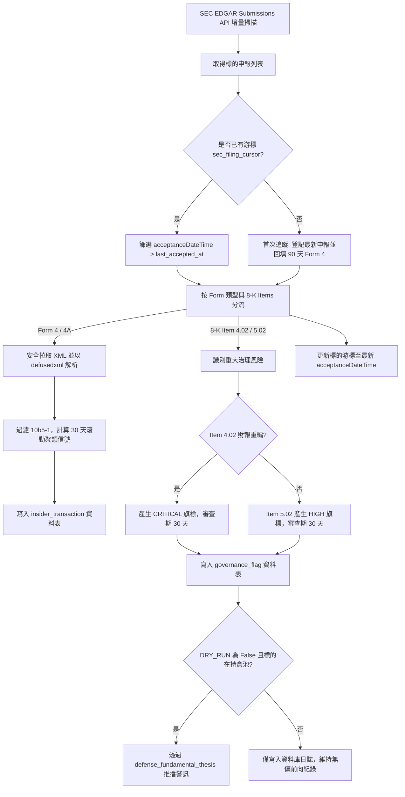

# SEC EDGAR 申報直連、內部人交易解析與治理審查閘門規格書

---

## 1. 核心哲學與適用市場環境

### 1.1 核心哲學
在公開資本市場中，資訊不對稱性往往在重大監管申報（SEC Filings）中達到頂峰。當企業內部出現基本面瓦解或公司治理危機時，管理層的第一反應往往體現在 8-K 重大事件披露與內部人資金調度上。

Nexus Seeker 基本面分析管線 PR2 直接串接美國證券交易委員會（SEC EDGAR）官方系統，架構核心哲學如下：
1. **零延遲直連與串流防護**：由核心容器直連 SEC API，繞過邊緣節點；硬性限制請求頻率（$\le 8\text{ req/s}$）與 1.5MB 串流截斷，保障 1GB–2GB VPS 的記憶體安全。
2. **防禦性 XML 解析**：全面採用 `defusedxml.ElementTree` 解析 Form 4 與 8-K 文件，徹底杜絕 XML 外部實體注入（XXE）與實體膨脹（Billion Laughs）漏洞。
3. **高管內部人行為意圖識別**：量化過濾 10b5-1 預先排程計畫，聚焦真正具備資訊優勢之非排程自費增持（P 代碼）與減持（S 代碼），識別「內部人聚類買入」（Cluster Buy）與巨額非排程拋售。
4. **重大治理紅旗閘門 (Governance Gate)**：監控 8-K Item 4.02（財報重編/會計不可信賴性，CRITICAL 等級）與 Item 5.02（核心決策層解職離任，HIGH 等級），自動啟動為期 30 天之風控審查期。
5. **零交易執行不變量 (Zero-Execution Invariant)**：所有治理評級與內部人訊號均為純顧問性提示，絕無自動平倉、下單或對沖觸發。

### 1.2 適用市場環境
- **財報重編與會計醜聞審查**：標的發布 8-K 4.02 時，即刻提示假設破滅並凍結買入推薦。
- **高管非正常異動突發期**：CEO / CFO 無預警解職或與董事會分歧離任（8-K 5.02），啟動治理警戒。
- **內部人集體逢低增持**：在市場恐慌或底部震盪期間，多位董事與 C-Suite 高管於公開市場自費增持，捕捉信心共振。
- **激進投資人進駐與延遲申報**：Schedule 13D 披露激進意圖（要求席次、推動分拆、併購），且檢查是否逾期申報（> 5 營業日）。

---

## 2. 數學模型與量化推導

### 2.1 交易時段映射狀態機 (Filing Session Classification)
依據 SEC EDGAR 系統之受理時間戳記（美東時間 US/Eastern）將申報分流為四個交易時段：

$$\text{Session} = \begin{cases}
\text{BMO} & 04:00 \le t_{\text{ET}} < 09:30 \quad (\text{盤前窗口}) \\
\text{RTH} & 09:30 \le t_{\text{ET}} < 16:00 \quad (\text{常規交易時段}) \\
\text{AMC} & 16:00 \le t_{\text{ET}} < 20:00 \quad (\text{盤後窗口}) \\
\text{OVERNIGHT} & 20:00 \le t_{\text{ET}} < 04:00 \quad (\text{夜間時段})
\end{cases}$$

### 2.2 內部人交易清洗與聚類信號模型
對 Form 4 申報中滾動 $W = 30$ 天內的非衍生品交易（Non-Derivative Transactions）進行結構化聚合：
- 自費增持金額與股數：
  $$\text{Net Bought USD} = \sum_{i \in \text{Buys}} \text{Shares}_i \times \text{Price}_i, \quad (\text{代碼 } P, \text{Acquired } A)$$
- 自主減持金額（排除 10b5-1 預先排程計畫）：
  $$\text{Sold USD}_{\text{non-10b5-1}} = \sum_{j \in \text{Sales, } \text{is\_10b5\_1} = 0} \text{Shares}_j \times \text{Price}_j, \quad (\text{代碼 } S, \text{Disposed } D)$$

信號仲裁狀態機：
$$\text{Verdict} = \begin{cases}
\text{HEAVY\_INSIDER\_SALE} & \text{若 } (\text{Net Bought USD} < \text{Sold USD}_{\text{non-10b5-1}}) \land (N_{\text{sellers, non-10b5-1}} \ge 3 \lor \text{Sold USD}_{\text{non-10b5-1}} \ge \$5,000,000) \\
\text{CLUSTER\_BUY} & \text{若 } (\text{Net Bought USD} \ge \text{Sold USD}_{\text{non-10b5-1}}) \land (N_{\text{buyers}} \ge 2 \lor (N_{\text{C-Suite}} \ge 1 \land \text{Net Bought USD} \ge \$100,000)) \\
\text{NEUTRAL} & \text{其他一般狀況}
\end{cases}$$

### 2.3 激進投資人 13D 及時性度量
依據 SEC Rule 13d-1(a) 條款，自突破 5% 持股事件日 $D_{\text{event}}$ 至申報受理日 $D_{\text{filing}}$：
$$\text{Business Days} = \sum_{d = D_{\text{event}} + 1}^{D_{\text{filing}}} \mathbb{I}(\text{Weekday}(d) \in \{\text{Mon, Tue, Wed, Thu, Fri}\})$$
$$\text{Delayed Flag} \iff \text{Business Days} > 5$$

---

## 3. 決策邏輯與狀態機 / 流程圖

---

## 4. 關鍵具名常數與物理約束

| 具名常數 | 數值 / 類型 | 物理意義與約束說明 |
|---|---|---|
| `SEC_LIMITER_MAX_RATE` | `8` (float) | SEC API 每秒請求上限（官方上限 10 req/s，硬性安全餘量） |
| `SEC_STREAM_BYTE_CAP` | `1_500_000` (int) | SEC 文件串流拉取位元組硬截斷上限（1.5MB，防禦 VPS OOM） |
| `DEFAULT_REVIEW_DAYS` | `30` (int) | 治理審查旗標預設有效風控天數 |
| `MIN_CLUSTER_BUY_INSIDERS` | `2` (int) | 觸發聚類增持的最少獨立內部人人數門檻 |
| `C_SUITE_MIN_BUY_USD` | `100_000.0` (float) | 單一 C-Suite 高管買入達此金額即可構成聚類信號 |
| `MIN_CLUSTER_SALE_INSIDERS` | `3` (int) | 觸發非排程集體拋售的最少獨立內部人人數門檻 |
| `HEAVY_SALE_USD_THRESHOLD` | `5_000_000.0` (float) | 非排程內部人拋售金額警戒門檻 |
| `RULE_13D_MAX_BUSINESS_DAYS`| `5` (int) | Schedule 13D 跨越 5% 門檻後合法申報營業日上限 |
| `BACKFILL_FORM4_DAYS` | `90` (int) | 標的首次加入宇宙時回填內部人交易之天數上限 |

---

## 5. 邊界條件、風控熔斷與例外處理
- **缺少合規 User-Agent 防禦**：若 `SEC_USER_AGENT` 未配置或未包含 `@` 聯絡信箱，系統拋出 `SecConfigError`，完全阻止未授權連線導致伺服器 IP 被 SEC 官方封鎖（HTTP 403）。
- **CIK 補零與雙重股權代碼轉換**：所有 CIK 強制補滿 10 位數（如 `str(cik).zfill(10)`）；代碼中帶有 `.` 或 `-` 之雙重股權標的（如 `BRK.B`）在向 SEC 查詢時進行標準化映射。
- **巨額文件串流截斷**：當 10-K 或 S-4 包含大量影像或附件超過 1.5MB 時，串流生成器立即中止讀取並安全閉合連線，避免記憶體暴增觸發 85% 守衛。
- **無交易副作用保證**：所有推播與終端指令均不包含下單、平倉或對沖按鈕，嚴守純顧問性通報原則。

---

## 6. 核心程式碼檔案路徑關聯
- `nexus_core/market_analysis/fundamental_pipeline/sec_item_router.py`
- `nexus_core/market_analysis/fundamental_pipeline/form4_parser.py`
- `nexus_core/market_analysis/fundamental_pipeline/insider_signal.py`
- `nexus_core/market_analysis/fundamental_pipeline/activist_gate.py`
- `nexus_core/market_analysis/fundamental_pipeline/governance_gate.py`
- `nexus_core/market_analysis/fundamental_pipeline/models.py`
- `nexus_core/services/sec_edgar_client.py`
- `nexus_core/services/filing_event_service.py`
- `nexus_core/cogs/fundamental_terminal.py`
- `nexus_core/cogs/embed_builders/fundamental_embeds.py`
- `nexus_core/database/fundamental_pipeline.py`
- `nexus_core/database/migrations/v091_add_sec_event_stream.py`
