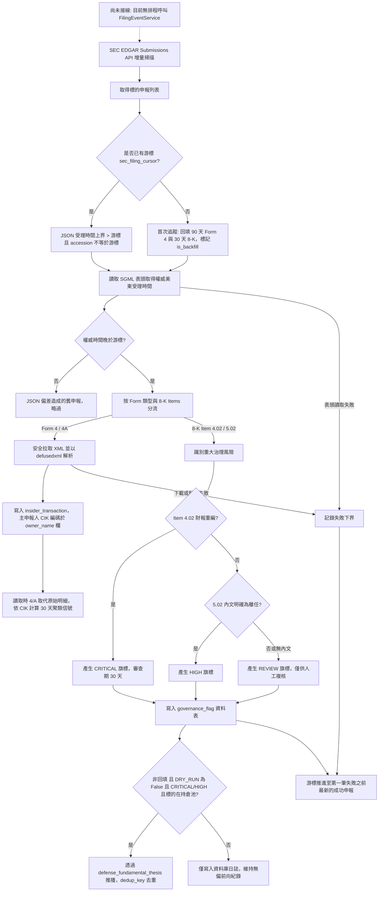

# SEC EDGAR 申報直連、內部人交易解析與治理審查閘門規格書

---

## 1. 核心哲學與適用市場環境

### 1.1 核心哲學
在公開資本市場中，資訊不對稱性往往在重大監管申報（SEC Filings）中達到頂峰。當企業內部出現基本面瓦解或公司治理危機時，管理層的第一反應往往體現在 8-K 重大事件披露與內部人資金調度上。

Nexus Seeker 基本面分析管線 PR2 直接串接美國證券交易委員會（SEC EDGAR）官方系統，架構核心哲學如下。

> **接線狀態（尚未接線）**：SEC 申報同步服務 `FilingEventService`（`sync_symbol_filings` / `sync_universe_filings`）目前**沒有任何 production 排程或呼叫端**，`sec_filing_cursor`、`sec_filing_event`、`insider_transaction`、`governance_flag` 四張表在正式環境不會自動產生資料；13D 激進投資人閘門 `activist_gate.evaluate_activist_filing` 同樣尚未接線（沒有下載 13D 內文的呼叫端）。`/fa` 的治理區塊在標的從未同步（無游標）時會明示「⚪ 尚無申報同步資料（SEC 申報同步管線尚未排程）」，不會把「沒有資料」顯示成正常或 NEUTRAL。以下各節描述的是模組行為與接線後的預期流程。

1. **零延遲直連與串流防護**：由核心容器直連 SEC API，繞過邊緣節點；硬性限制請求頻率（$\le 8\text{ req/s}$）與 1.5MB 串流截斷，保障 1GB–2GB VPS 的記憶體安全。
2. **防禦性 XML 解析**：全面採用 `defusedxml.ElementTree` 解析 Form 4 與 8-K 文件，徹底杜絕 XML 外部實體注入（XXE）與實體膨脹（Billion Laughs）漏洞。
3. **高管內部人行為意圖識別**：量化過濾 10b5-1 預先排程計畫，聚焦真正具備資訊優勢之非排程自費增持（P 代碼）與減持（S 代碼），識別「內部人聚類買入」（Cluster Buy）與巨額非排程拋售。
4. **重大治理紅旗閘門 (Governance Gate)**：監控 8-K Item 4.02（財報重編/會計不可信賴性，CRITICAL 等級）與 Item 5.02（高管 / 董事異動），自動啟動為期 30 天之審查期。Item 5.02 同時涵蓋離任 (b)、新任 (c)、董事選任 (d) 與薪酬協議 (e)，僅憑 item code 無法區分，因此**預設為 REVIEW**（待人工複核，不推播、不作為候選排除依據）；只有內文明確指出辭職 / 退休 / 解職時才升為 HIGH。目前同步服務只取得 submissions JSON 的 item code、未下載 8-K 內文，所以 5.02 一律為 REVIEW。
5. **零交易執行不變量 (Zero-Execution Invariant)**：所有治理評級與內部人訊號均為純顧問性提示，絕無自動平倉、下單或對沖觸發。

### 1.2 適用市場環境
- **財報重編與會計醜聞審查**：標的發布 8-K 4.02 時產生 CRITICAL 旗標並向持倉者推播顧問性警訊（需同步服務接線且關閉乾跑）。「凍結買入推薦」屬**規劃中、尚未實作**：目前沒有任何買入推薦流程讀取治理旗標。
- **高管異動**：8-K 5.02 預設產生 REVIEW 旗標供 `/fa` 人工複核；僅在取得內文且明確為 CEO / CFO 等離任時升為 HIGH 並推播。
- **內部人集體逢低增持**：在市場恐慌或底部震盪期間，多位董事與 C-Suite 高管於公開市場自費增持，捕捉信心共振。
- **激進投資人進駐與延遲申報（尚未接線）**：Schedule 13D 披露激進意圖（要求席次、推動分拆、併購），且檢查是否逾期申報（> 5 個 SEC 營業日）。模組已實作，但沒有 production 呼叫端。

---

## 2. 數學模型與量化推導

### 2.1 交易時段映射狀態機 (Filing Session Classification)
依據 SEC EDGAR 系統之受理時間戳記（美東時間 US/Eastern）將申報分流為四個交易時段。

**權威受理時間來源**：每筆申報 SGML 表頭 `{accession}.hdr.sgml` 的 `<ACCEPTANCE-DATETIME>`（緊湊格式 `YYYYMMDDHHMMSS`，**美東牆上時間**，與 EDGAR index 頁 Accepted 欄一致）。submissions JSON（`data.sec.gov/submissions/CIK##########.json`）的 `acceptanceDateTime` 雖標示 `Z`，2026-10 實測**並非一律為真實 UTC**：

| 樣本 | JSON `acceptanceDateTime` | SGML 表頭（美東） | JSON − 真實 UTC |
|---|---|---|---|
| AAPL Form 4 `0001140361-26-038674` | `2026-10-06T02:42:45Z` | `20261005184245` | +4h（夏令） |
| AAPL 10-Q `0000320193-26-000020` | `2026-07-31T14:01:02Z` | `20260731060102` | +4h（夏令） |
| AAPL 8-K `0000320193-26-000005` | `2026-01-30T02:30:33Z` | `20260129163033` | +5h（冬令） |
| AMZN 8-A12B `0001104659-26-110227` | `2026-09-24T16:30:49Z` | `20260924083049` | +4h（夏令） |
| MSFT 8-K `0001193125-26-380280` | `2026-09-02T20:30:24Z` | `20260902163024` | 0 |
| AMZN 3/A `0001595602-26-000009` | `2026-10-06T21:27:29Z` | `20261006172729` | 0 |

偏差因公司、甚至同一公司新舊筆而異，無法以固定公式還原（例如 AAPL 10-Q 若把 JSON 當 UTC 會得到 10:01 ET 的 RTH，實際為 06:01 ET 的 BMO）。因此 JSON 值只當作真實時間的**上界**：

$$t_{\text{true}} \in \left[\, t_{\text{JSON}} - \Delta_{\max},\; t_{\text{JSON}} \,\right], \qquad \Delta_{\max} = 5\text{h}$$

同步服務以上界做初步篩選，每筆實際處理的申報都改讀 SGML 表頭取得 $t_{\text{true}}$，事件與游標一律儲存正規化後的美東 ISO 8601（例如 `2026-10-05T18:42:45-04:00`）。樣本保存於 `nexus_core/tests/unit/fixtures/sec/`。

時段劃分：

$$\text{Session} = \begin{cases}
\text{BMO} & 04:00 \le t_{\text{ET}} < 09:30 \quad (\text{盤前窗口}) \\
\text{RTH} & 09:30 \le t_{\text{ET}} < 16:00 \quad (\text{常規交易時段}) \\
\text{AMC} & 16:00 \le t_{\text{ET}} < 20:00 \quad (\text{盤後窗口}) \\
\text{OVERNIGHT} & 20:00 \le t_{\text{ET}} < 04:00 \quad (\text{夜間時段})
\end{cases}$$

### 2.2 內部人交易清洗與聚類信號模型
對 Form 4 申報中滾動 $W = 30$ 天內的非衍生品交易（Non-Derivative Transactions）進行結構化聚合：
- 自費增持金額與股數：
  $$\text{Net Bought USD} = \sum_{i \in \text{Buys}} \text{Shares}_i \times \text{Price}_i, \quad (\text{代碼 } P, \text{Acquired } A)$$
- 自主減持金額（排除 10b5-1 預先排程計畫）：
  $$\text{Sold USD}_{\text{non-10b5-1}} = \sum_{j \in \text{Sales, } \text{is\_10b5\_1} = 0} \text{Shares}_j \times \text{Price}_j, \quad (\text{代碼 } S, \text{Disposed } D)$$

聚合前的清洗規則：
- **內部人身分鍵**：以主申報人 CIK（`rptOwnerCik`，補零 10 位）判斷是否為同一內部人；共同申報時優先取具董事 / 高管身分者的 CIK，否則取文件第一位。無 CIK 時退回正規化名稱。
- **修正申報去重**：依 (身分鍵, 交易日) 分組，組內若有 Form 4/A，只保留受理時間最新的一份 4/A 明細，原始 Form 4 與較舊 4/A 捨棄，避免重複聚合：
  $$\text{Keep}(g) = \begin{cases} \{\, t \in g : \text{acc}(t) = \arg\max_{a \in A_g} t_{\text{accepted}}(a) \,\} & A_g \neq \varnothing \\ g & A_g = \varnothing \end{cases}$$
  其中 $A_g$ 為組 $g$ 內的 4/A 申報集合。
- **10b5-1 標記**：`aff10b5One` 勾選，或交易引用的腳註**肯定地**提及 10b5-1；同一子句內關鍵字前方出現否定語（not / no / neither / nor / never / without / n't）者不計入，例如 "not made pursuant to a Rule 10b5-1 plan"。
- **C-Suite 職稱**：`PRESIDENT` 排除 Vice President / Vice-President 前綴（SVP、EVP 等副總層級不算 C-Suite，除非職稱另含 CFO 等關鍵字）。

信號仲裁狀態機：
$$\text{Verdict} = \begin{cases}
\text{HEAVY\_INSIDER\_SALE} & \text{若 } (\text{Net Bought USD} < \text{Sold USD}_{\text{non-10b5-1}}) \land (N_{\text{sellers, non-10b5-1}} \ge 3 \lor \text{Sold USD}_{\text{non-10b5-1}} \ge \$5,000,000) \\
\text{CLUSTER\_BUY} & \text{若 } (\text{Net Bought USD} \ge \text{Sold USD}_{\text{non-10b5-1}}) \land (N_{\text{buyers}} \ge 2 \lor (N_{\text{C-Suite}} \ge 1 \land \text{Net Bought USD} \ge \$100,000)) \\
\text{NEUTRAL} & \text{其他一般狀況}
\end{cases}$$

### 2.3 激進投資人 13D 及時性度量（尚未接線）
依據 SEC Rule 13d-1(a) 條款，自突破 5% 持股事件日 $D_{\text{event}}$ 至申報受理日 $D_{\text{filing}}$。營業日依 Exchange Act Rule 14d-1(g)(3) 定義為週六、週日與**聯邦假日**以外的日子（與 NYSE 交易日不同：耶穌受難日 NYSE 休市但 SEC 上班；哥倫布日、退伍軍人節 SEC 休息但 NYSE 開市），以 `pandas` 的 `USFederalHolidayCalendar` 判定：
$$\text{Business Days} = \sum_{d = D_{\text{event}} + 1}^{D_{\text{filing}}} \mathbb{I}(\text{Weekday}(d) \in \{\text{Mon, …, Fri}\}) \cdot \mathbb{I}(d \notin \mathcal{H}_{\text{federal}})$$
$$\text{Delayed Flag} \iff \text{Business Days} > 5$$

---

## 3. 決策邏輯與狀態機 / 流程圖

---

## 4. 關鍵具名常數與物理約束

| 具名常數 | 數值 / 類型 | 物理意義與約束說明 |
|---|---|---|
| `SEC_LIMITER_MAX_RATE` | `8` (float) | SEC API 每秒請求上限（官方上限 10 req/s，硬性安全餘量） |
| `SEC_STREAM_BYTE_CAP` | `1_500_000` (int) | SEC 文件串流拉取位元組硬截斷上限（1.5MB，防禦 VPS OOM） |
| `DEFAULT_REVIEW_DAYS` | `30` (int) | 治理審查旗標預設有效風控天數 |
| `MIN_CLUSTER_BUY_INSIDERS` | `2` (int) | 觸發聚類增持的最少獨立內部人人數門檻 |
| `C_SUITE_MIN_BUY_USD` | `100_000.0` (float) | 單一 C-Suite 高管買入達此金額即可構成聚類信號 |
| `MIN_CLUSTER_SALE_INSIDERS` | `3` (int) | 觸發非排程集體拋售的最少獨立內部人人數門檻 |
| `HEAVY_SALE_USD_THRESHOLD` | `5_000_000.0` (float) | 非排程內部人拋售金額警戒門檻 |
| `RULE_13D_MAX_BUSINESS_DAYS`| `5` (int) | Schedule 13D 跨越 5% 門檻後合法申報 SEC 營業日上限（排除聯邦假日） |
| `BACKFILL_FORM4_DAYS` | `90` (int) | 標的首次加入宇宙時回填內部人交易之天數上限 |
| `SEC_JSON_ACCEPTANCE_MAX_SKEW` | `timedelta(hours=5)` | submissions JSON 受理時間相對真實時間的最大正偏差（冬令美東偏移），真實時間 $\in [t_{\text{JSON}} - 5\text{h}, t_{\text{JSON}}]$ |
| `_SGML_HEADER_BYTE_CAP` | `65_536` (int) | `.hdr.sgml` 表頭讀取上限（實際約 1KB） |
| `_TICKER_MAP_TTL_SECONDS` | `86_400` (float) | `company_tickers.json` 映射表快取有效期；期間內查無代碼直接回傳 None（負向快取） |
| `_TICKER_MAP_FAILURE_BACKOFF_SECONDS` | `600` (float) | 映射表下載失敗後的重試冷卻 |
| 治理推播去重鍵 | `governance_flag_{user_id}_{symbol}_{flag_kind}_{事件日}` | 前綴登記於 `_KV_CACHE_DEDUP_KEY_PREFIXES`，03:00 ET 清除 3 天前旗標 |

---

## 5. 邊界條件、風控熔斷與例外處理
- **缺少合規 User-Agent 防禦**：若 `SEC_USER_AGENT` 未配置或未包含 `@` 聯絡信箱，系統拋出 `SecConfigError`，完全阻止未授權連線導致伺服器 IP 被 SEC 官方封鎖（HTTP 403）。
- **CIK 補零與雙重股權代碼轉換**：所有 CIK 強制補滿 10 位數（如 `str(cik).zfill(10)`）；代碼中帶有 `.` 或 `-` 之雙重股權標的（如 `BRK.B`）在向 SEC 查詢時進行標準化映射。
- **巨額文件串流截斷**：當 10-K 或 S-4 包含大量影像或附件超過 1.5MB 時，串流生成器立即中止讀取並安全閉合連線，避免記憶體暴增觸發 85% 守衛。
- **無交易副作用保證**：所有推播與終端指令均不包含下單、平倉或對沖按鈕，嚴守純顧問性通報原則。
- **游標不跳過失敗申報**：任一筆申報的 SGML 表頭、Form 4 下載或 XML 解析失敗時，游標只推進到「第一筆失敗之前」最新的成功申報（表頭失敗時以 $t_{\text{JSON}} - \Delta_{\max}$ 作為失敗下界），失敗者下次重試；較新的成功申報會被重處理，寫入為冪等 upsert，推播由 dedup_key 擋下。首次回填只要有失敗就不建立游標，下次仍以回填模式（不推播）重跑。永久性失敗（例如文件 404）會讓游標停住，需由日誌人工排查。
- **回填不推播**：首次回填（`is_backfill`）的治理旗標只入庫，不推播。
- **併發錯誤可觀測**：`sync_universe_filings` 先建立客戶端，缺少 `SEC_USER_AGENT` 時在併發前即拋出 `SecConfigError`；個別標的的例外以 `logger.error` 逐檔記錄，不中斷其他標的。
- **CIK 查詢合併**：`company_tickers.json` 的併發 miss 經 `SingleFlightManager` 合併為一次下載。
- **主申報人 CIK 的保存方式**：v091 已部署至正式 DB 且不可修改，後續 migration 編號已被其他分支占用，因此不新增欄位，改在 `insider_transaction.owner_name` 欄以 `{cik}|{names}` 編碼保存，讀取時由 `database/fundamental_pipeline.py` 還原；修正申報與受理時間由 `LEFT JOIN sec_filing_event` 還原。
- **`/fa` 資料狀態**：無游標（從未同步）時顯示「⚪ 尚無申報同步資料」，有游標且無生效旗標才顯示「🟢 已同步」；REVIEW 旗標顯示為 🟡 待人工複核。
- **REVIEW 與下游排除**：下游若依 HIGH / CRITICAL 排除候選標的，5.02 降為 REVIEW 後不再觸發排除；REVIEW 只代表「有高管異動、待人工判讀」。

---

## 6. 核心程式碼檔案路徑關聯
- `nexus_core/market_analysis/fundamental_pipeline/sec_item_router.py`
- `nexus_core/market_analysis/fundamental_pipeline/form4_parser.py`
- `nexus_core/market_analysis/fundamental_pipeline/insider_signal.py`
- `nexus_core/market_analysis/fundamental_pipeline/activist_gate.py`
- `nexus_core/market_analysis/fundamental_pipeline/governance_gate.py`
- `nexus_core/market_analysis/fundamental_pipeline/models.py`
- `nexus_core/services/sec_edgar_client.py`
- `nexus_core/services/filing_event_service.py`
- `nexus_core/cogs/fundamental_terminal.py`
- `nexus_core/cogs/embed_builders/fundamental_embeds.py`
- `nexus_core/database/fundamental_pipeline.py`
- `nexus_core/database/migrations/v091_add_sec_event_stream.py`
- `nexus_core/database/cache.py`
- `nexus_core/tests/unit/fixtures/sec/submissions_acceptance_samples.json`
