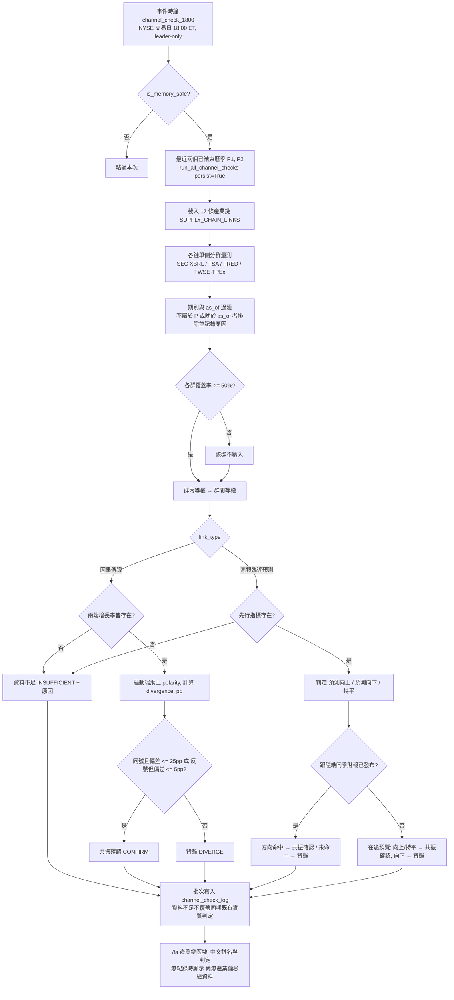

# 實體替代數據攝取與 17 條產業鏈因果檢驗規格書

---

## 1. 核心哲學與適用市場環境

### 1.1 核心哲學
傳統基本面分析往往受限於單一企業季度財務報表的嚴重落後性（發布時點落後季末 30 至 60 天）。在現代資本市場與高科技超級週期中，重大資本開支（Capex）、訂單積壓（RPO）與上游零部件採購呈現出可檢驗的產業鏈傳導關係。

Nexus Seeker 基本面分析管線 PR4 建立實體替代數據（Alternative Data）攝取與 17 條產業鏈交叉驗證矩陣，核心量化哲學如下：
1. **結構化因果傳導 (`CAUSAL`，介面標示「因果傳導」)**：上游超大規模雲端巨頭（Microsoft、Amazon、Alphabet、Meta、Oracle）的資本支出，與下游伺服器、散熱機櫃與晶片代工廠營收應同向擴張或收縮。若兩端在同一曆季的年增率方向相反或幅度差距過大，系統標註結構性背離。
2. **高頻實體與臨近預測 (`NOWCAST`，介面標示「高頻臨近預測」)**：整合美國運輸安全局（TSA）每日客流、聖路易聯準銀行（FRED）鐵路車皮裝載與汽車銷量、以及台灣證券交易所（TWSE）與櫃買中心（TPEx）每月 10 日前發布的月營收，先行判斷低頻（季度）業績方向。
3. **前沿科技與太空生態全景覆蓋**：聚焦「總體核心、商業太空與國防前沿、先進科技生態矩陣」三大維度，涵蓋 AI 算力資本支出、Starlink 低軌寬頻、國防訂單積壓、CoWoS 先進封裝、SMR 核電、液冷散熱、自主移動載具與具身機器人精密組件。SpaceX (`SPCX`) 為非公開實體，無 SEC 申報，一律排除於計算與覆蓋率分母。
4. **實驗性標籤隔離（介面標示「🧪實驗性」）**：處於產業早期驗證階段之鏈條（地球遙測 ACV、SMR 早期協議、具身機器人試產），系統強制標註實驗性，提示使用者數據處於驗證觀察期。
5. **免費公開數據、只記錄不推播、零執行不變量**：全面採用官方開放資料端點；排程只寫入 `channel_check_log`，不發送任何推播；全流程為純顧問性評級，絕無自動下單或部位干預。

### 1.2 適用市場環境
- **AI 算力基礎設施擴張期**：驗證雲端巨頭 Capex 擴張是否同步反映在輝達（NVDA）、Arista、Dell、Vertiv 與台系伺服器供應鏈營收。
- **商業航天與國防前沿景氣**：追蹤星系營運商資本支出、低軌衛星天線台廠月營收與國防承包商剩餘履約義務（RPO）。
- **總體經濟實體活動監測**：透過 TSA 客流與鐵路貨運量，先於季度財報觀察航空與鐵路運輸景氣拐點。
- **財報發布前夕方向性校準**：在季報公布前利用台灣高頻供應鏈月營收，對特斯拉（TSLA）等跟隨端進行方向性臨近驗證。

---

## 2. 數學模型與量化推導

### 2.1 期別對齊契約 (Period Alignment)
每一筆檢驗都針對單一曆年季度 $P$（`as_of_period`，固定格式 `YYYY-Qn`，例如 `2026-Q2`；寫入端與服務入口皆以正規表示式驗證，其他格式一律拒絕）。兩端所有成員的觀測值都必須屬於同一個 $P$：

- **期間型數值**（capex、營收、銷貨成本）：離散單季 $[s, e]$ 以期間中點 $s + (e - s)/2$ 所屬曆季對應，與 SEC frames 對非曆年制公司的歸屬一致（例如 NVDA 季末 7 月下旬、WMT 季末 7/31 皆歸 Q2）。12／16 週制等造成兩個財季對應同一曆季時，取季末較晚者，另一曆季可能缺值。
- **時點型數值**（存貨、RPO）：以「季末日 − 45 天」所屬曆季對應。
- **TSA**：只取 $P$ 內、且不晚於 `as_of` 的日資料（季內至今）。
- **FRED 月度**：只取 $P$ 內、且依 `available_date <= as_of` 已公布的月份。
- **台股月營收**：`資料年月`（民國年月）所屬曆季必須等於 $P$，且 `出表日期 <= as_of`；否則該成員排除並記錄原因。

**尚未實作領先落後位移**：`lead_lag_quarters`（如 `1-2Q`）目前僅為說明欄位，`CAUSAL` 判定比較的是兩端在**同一曆季**的年增率，並非「驅動端 $P-k$ 對跟隨端 $P$」。

### 2.2 各來源年增率口徑 (YoY Definitions)
$$\text{YoY} = \frac{X_P - X_{P-4}}{X_{P-4}} \times 100\% \quad (X_{P-4} \le 0 \text{ 時視為不可得})$$

| 來源 | 指標 | 口徑 |
|---|---|---|
| SEC XBRL `PaymentsToAcquirePropertyPlantAndEquipment`（備援 `PaymentsToAcquireProductiveAssets`） | capex | 單季 vs 去年同季 |
| SEC XBRL `RevenueRemainingPerformanceObligation` | rpo | 季末時點值 vs 去年同季季末 |
| SEC XBRL `InventoryNet` ÷ `CostOfGoodsAndServicesSold`（備援 `CostOfRevenue`、`CostOfGoodsSold`） | dio | 自行計算 DIO 後，單季 vs 去年同季 |
| SEC XBRL `RevenueFromContractWithCustomerExcludingAssessedTax`（備援 `Revenues`、`RevenueFromContractWithCustomerIncludingAssessedTax`、`SalesRevenueNet`） | revenue | 單季 vs 去年同季 |
| TSA 每日安檢客流 | 客流 | 季內日均 vs 52 週前同星期幾之日均（需 ≥ 28 個配對日） |
| FRED `RAILFRTCARLOADSD11`、`TOTALSA` | 月度 | 季內已公布月份均值 vs 去年同月份均值（缺去年同月即不可得，不改用月增率） |
| TWSE `t187ap05_L`／TPEx `mopsfin_t187ap05_O` | 月營收 | 該季內最新單月「營業收入-去年同月增減(%)」 |

標籤依序嘗試，取第一個能同時提供 $P$ 與 $P-4$ 的標籤（例如 AMZN 2018 年後改用 `PaymentsToAcquireProductiveAssets`，NVDA 營收使用 `Revenues`）。

**SEC XBRL 單季推導**：10-Q 現金流量表多為年初至今累計，10-K 只有全年值。對同一起始日 $s$ 的兩個累計期間 $[s, e_1]$、$[s, e_2]$（$e_2 - e_1$ 為 70–120 天），離散單季 $= V_{[s,e_2]} - V_{[s,e_1]}$（例如 Q4 = FY − 9M）；直接申報的 70–120 天單季優先。

**DIO 計算**：
$$\text{DIO}_P = \frac{\text{Inventory}_{e}}{\text{COGS}_{[s,e]}} \times (e - s + 1)$$
存貨取與該季銷貨成本季末同日之時點值。**不得以周轉率（turnover）代替 DIO**。

### 2.3 群組等權與覆蓋率門檻
單側（驅動端或跟隨端）成員依來源分為「總經高頻（TSA／FRED）」「美股（SEC XBRL）」「台股（月營收）」三群，各群等權平均後，再以群為單位等權合併：

$$g_{\text{side}} = \frac{1}{|G_{\text{valid}}|} \sum_{G \in G_{\text{valid}}} \bar{g}_G, \qquad \bar{g}_G = \frac{1}{|K_G|}\sum_{k \in K_G} \text{YoY}_k$$

美股與台股群各自需滿足覆蓋率 $|K_G| \ge \lceil 0.5 \cdot N_G \rceil$（$N_G$ 不含非公開實體），未達門檻的群不納入並記錄「覆蓋 x/y 低於門檻」。台股群不再壓過美股群：例如 `AI_CAPEX` 跟隨端的 NVDA／ANET／DELL／VRT 與台系伺服器廠分別計算後等權合併。

### 2.4 因果傳導鏈背離度點數模型 (Causal Transmission Divergence)
令傳導極性 $\pi \in \{+1, -1\}$（`SupplyChainLink.polarity`，預設 $+1$；`BRAND_RETAIL_INVENTORY` 為 $-1$：零售商 DIO 上升代表渠道堵塞，壓制上游品牌廠出貨）。判定前先將驅動端乘上極性：

$$g'_{\text{driver}} = \pi \cdot g_{\text{driver}}, \qquad \text{Divergence}_{\text{pp}} = g_{\text{follower}} - g'_{\text{driver}}$$

`driver_growth` 欄位保存原始量測值 $g_{\text{driver}}$，`divergence_pp` 為套用極性後的偏差。

**決策狀態機與判定函數**：
$$\text{Verdict}_{\text{causal}} = \begin{cases}
\text{INSUFFICIENT（資料不足）} & \text{若 } g_{\text{driver}} \text{ 缺失} \lor g_{\text{follower}} \text{ 缺失} \\
\text{CONFIRM（共振確認）} & \text{若 } \text{sign}(g'_{\text{driver}}) = \text{sign}(g_{\text{follower}}) \land |\text{Divergence}_{\text{pp}}| \le \theta_{\text{causal}} \\
\text{CONFIRM（共振確認）} & \text{若 } \text{sign}(g'_{\text{driver}}) \neq \text{sign}(g_{\text{follower}}) \land |\text{Divergence}_{\text{pp}}| \le 5.0\text{ pp} \\
\text{DIVERGE（背離）} & \text{其他}
\end{cases}$$

預設因果容忍閾值 $\theta_{\text{causal}} = 25.0\text{ pp}$。

### 2.5 高頻臨近預測方向性命中率 (Nowcast Direction & Hit Rate)
$$\text{Direction}_{\text{nowcast}} = \begin{cases}
\text{NOWCAST\_UP（預測向上）} & \text{若 } \pi \cdot g_{\text{hf}} \ge +\theta_{\text{dir}} \\
\text{NOWCAST\_DOWN（預測向下）} & \text{若 } \pi \cdot g_{\text{hf}} \le -\theta_{\text{dir}} \\
\text{FLAT（持平）} & \text{若 } |g_{\text{hf}}| < \theta_{\text{dir}}
\end{cases}$$

預設方向敏感度閾值 $\theta_{\text{dir}} = 2.0\%$。

**季度實績發布後之方向命中檢驗**：
$$\text{Hit}_{\text{nowcast}} = \begin{cases}
\text{True} & \text{若 } (\text{UP} \land g_{\text{target}} > 0) \lor (\text{DOWN} \land g_{\text{target}} < 0) \lor (\text{FLAT} \land |g_{\text{target}}| \le \theta_{\text{dir}}) \\
\text{False} & \text{其他方向不符狀況} \\
\text{None} & \text{若跟隨端同季財報尚未發布（在途預測）}
\end{cases}$$

TSA 驅動端與跟隨端營收同為「曆季 $P$ 對去年同季」，已不再出現「TSA 28 日均值 vs 跟隨端 TTM」期間不重疊的不可比問題。

### 2.6 歷史觀測序列皮爾森積差相關係數 (Rolling Pearson Correlation)
當驅動端與跟隨端具備歷史觀測序列時，計算其歷史同向性程度（樣本數 $N \ge 4$）：

$$r = \frac{\sum_{i=1}^{N} (x_i - \bar{x})(y_i - \bar{y})}{\sqrt{\sum_{i=1}^{N}(x_i - \bar{x})^2 \cdot \sum_{i=1}^{N}(y_i - \bar{y})^2}}, \qquad r_{\text{bounded}} = \text{clip}(r, -1.0, +1.0)$$

若分母小於 $10^{-9}$（常數序列無變異），強制回傳 $0.0$。目前排程不提供歷史序列，`correlation` 欄位恆為空值。

---

## 3. 決策邏輯與狀態機 / 流程圖

---

## 4. 關鍵具名常數與物理約束

| 具名常數 | 數值 / 類型 | 物理意義與約束說明 |
|---|---|---|
| `DEFAULT_CAUSAL_DIVERGENCE_THRESHOLD_PP` | `25.0` (float) | 因果傳導鏈允許之上游與下游增長率最大偏差點數門檻 (pp) |
| `DEFAULT_NOWCAST_DIRECTION_THRESHOLD_PCT` | `2.0` (float) | 高頻臨近預測先行指標之方向性判定臨界門檻 (%) |
| `MIN_CORRELATION_SAMPLE_SIZE` | `4` (int) | 計算皮爾森相關係數所需之最小非缺失觀測期數 |
| `MIN_GROUP_COVERAGE_RATIO` | `0.5` (float) | 美股／台股群組採用均值所需的最低成員覆蓋率（分母不含非公開實體） |
| `QUARTER_MIN_DAYS` / `QUARTER_MAX_DAYS` | `70` / `120` (int) | XBRL 期間被視為單季的天數範圍（涵蓋 12／13／16 週制） |
| `INSTANT_PERIOD_OFFSET_DAYS` | `45` (int) | 時點值（存貨、RPO）以季末日往前 45 天對應曆季 |
| `TSA_YOY_ALIGN_DAYS` / `TSA_MIN_MATCHED_DAYS` | `364` / `28` (int) | TSA 以 52 週前同星期幾配對；季內至少 28 個配對日 |
| `DEFAULT_CACHE_TTL_SECONDS` | `3600.0` (float) | TSA 當年度頁與台股月營收記憶體快取（歷年 TSA 頁 24 小時） |
| `SEC_CONCEPT_CACHE_TTL_SECONDS` / `SEC_CONCEPT_CACHE_MAX_ENTRIES` | `86400.0` / `512` | SEC companyconcept 精簡事實快取（404 亦快取；抓取失敗不快取） |
| `CHANNEL_CHECK_PERIODS_PER_RUN` | `2` (int) | 排程每次檢驗的已結束曆季數（較新一季多半仍在財報季，前一季通常已完整） |
| `CORE_SUPPLY_CHAIN_COUNT` | `17` (int) | 排程、`/fa` 反查與鍵值查詢共用的唯一產業鏈清單長度（原量子運算擴充鏈已移除） |

---

## 5. 邊界條件、風控熔斷與例外處理

- **領先落後尚未實作**：`lead_lag_quarters` 只是說明欄位；目前僅比較兩端在同一曆季的年增率（見 §2.1），因此「上游 Capex 領先 1–2 季」的傳導在本版判定中只會表現為同季幅度差異，解讀時須留意。
- **資料來源與 Finnhub 欄位實測**：Finnhub `/stock/metric?metric=all` 沒有 capex 年增率、RPO 或 DIO 欄位（只有 `capexCagr5Y` 五年複合成長率與 `inventoryTurnoverTTM` 周轉率，語意不符），因此驅動端改由 SEC XBRL 計算；Finnhub 的 `revenueGrowthQuarterlyYoy` 沒有觀測期間，無法做期別對齊，亦不採用。
- **選用 companyconcept 而非 companyfacts**：單一公司 companyfacts 解壓後約 5MB、JSON 解析峰值約 26MB；companyconcept 每個標籤僅數十 KB。服務只快取解析後的 `(start, end, val, filed)` 精簡事實，符合 1–2GB VPS 限制。所有請求經 `SecEdgarClient`（合規 User-Agent、經 `rate_gate` 的 sec 閘門限速 `SEC_LIMITER_MAX_RATE`＝8 req/s、429 與 `Request Rate Threshold` 403 觸發冷卻）與 `SingleFlightManager` 合併。
- **SEC_USER_AGENT 未設定**：`SecEdgarClient` 拒絕建立，所有 XBRL 成員判為不可得，鏈條以「資料不足」記錄原因，不拋出未捕捉例外。SEC 申報同步（`sec_filing_sync_hourly`）同樣依賴此祕密，未設定時只記一次 error 後每輪略過；兩者並存不衝突。
- **SEC 客戶端共用**：`alt_data_service` 與 SEC 申報同步（`SecFilingSyncRunner`）共用同一個 `SecEdgarClient`（同一份 CIK 快取）；SEC 限速本身在全域的 sec 閘門，因此即使有多個客戶端實例，18:00 兩者同時打 SEC 時合計仍不會超過 8 req/s（上限 10 req/s）；誰先建立客戶端，另一方就沿用（`AltDataService.attach_sec_client`，用於共用 ticker map 快取）。
- **非公開與外國申報實體**：`SPCX` 等非公開實體回傳「非公開實體，無 SEC 申報」並排除於覆蓋率分母；只申報 IFRS（20-F）的外國公司（如 TSM、ASML）無 us-gaap 標籤，記錄為不可得。
- **無前視偏差保護 (Look-ahead Shield)**：SEC 事實以 `filed <= as_of` 過濾、同一期間取最新申報；FRED 以 `available_date <= as_of`；TSA 只取 `<= as_of` 日資料；台股月營收檢查 `出表日期 <= as_of`。台股 OpenAPI 只提供最新一個月，**不是 point-in-time 資料**，歷史期別通常因 `資料年月` 不符而排除。
- **TSA 反爬蟲**：tsa.gov 位於 Akamai 之後，部分網路環境（例如開發機以 curl 實測）回應 HTTP 403；此時 TSA 判為不可得並記錄「TSA 頁面無法取得或格式不符」，`AIR_TRAVEL` 以資料不足記錄。頁面為兩欄表格（Date／Numbers），當年度頁由新到舊、歷年頁 `/travel/passenger-volumes/{year}` 由舊到新，依日期合併。
- **資料不足不覆蓋實質判定**：寫入採 UPSERT，但 `INSUFFICIENT` 不覆蓋同一 `(link_key, as_of_period)` 既有的 `CONFIRM`／`DIVERGE`；實質判定可互相覆蓋。
- **寫入端列舉值驗證**：v093 的 `CHECK(nowcast_direction IN (..., NULL))` 在 SQLite 中等同無約束；v093 已在正式 DB 執行，不再新增遷移，改由 `save_channel_check_log(s)` 在 Python 層驗證 `link_type`、`verdict`、`nowcast_direction` 與期別格式，不合法時整批拒寫。
- **標的反查**：`/fa` 只依靜態對照表取得 `link_key` 後以 `IN (...)` 精確查詢，不再對 `members_json` 做 `LIKE` 模糊比對（避免 `F`、`PL` 等短代碼誤配）。
- **例外隔離**：單一成員抓取失敗只影響該成員；單條鏈例外不中斷其餘 16 條；單一期別失敗不影響另一期別。
- **零交易執行不變量**：所有交叉驗證結果均為純顧問性研究展示，不推播、不含任何下單或部位執行掛鉤。

---

## 6. 核心程式碼檔案路徑關聯

- `nexus_core/market_analysis/fundamental_pipeline/supply_chain_map.py`
- `nexus_core/market_analysis/fundamental_pipeline/channel_check.py`
- `nexus_core/market_analysis/fundamental_pipeline/alt_data_metrics.py`
- `nexus_core/market_analysis/fundamental_pipeline/models.py`
- `nexus_core/services/alt_data_service.py`
- `nexus_core/services/sec_edgar_client.py`
- `nexus_core/cogs/trading/fundamental_pipeline_monitor.py`
- `nexus_core/cogs/fundamental_terminal.py`
- `nexus_core/database/fundamental_pipeline.py`
- `nexus_core/database/migrations/v093_add_channel_check_log.py`
