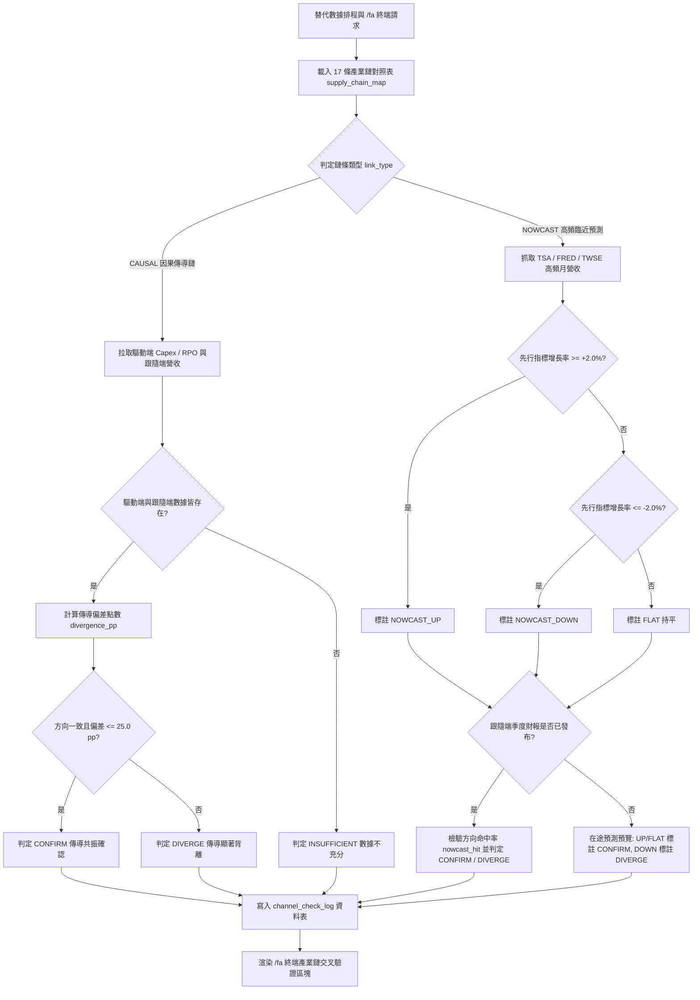

# 實體替代數據攝取與 17 條產業鏈因果檢驗規格書

---

## 1. 核心哲學與適用市場環境

### 1.1 核心哲學
傳統基本面分析往往受限於單一企業季度財務報表的嚴重落後性（發布時點落後季末 30 至 60 天）。在現代資本市場與高科技超級週期中，重大資本開支（Capex）、訂單積壓（RPO）與上游零部件採購呈現出高度確定性的宏觀經濟學傳導規律。

Nexus Seeker 基本面分析管線 PR4 建立實體替代數據（Alternative Data）攝取與 17 條產業鏈交叉驗證矩陣，核心量化哲學如下：
1. **結構化因果傳導 (`CAUSAL`)**：上游超大規模雲端巨頭（Microsoft、Meta、SpaceXSI）的資本支出，領先 1 至 2 季傳導至下游伺服器、散熱機櫃與晶片代工廠營收。若下游股價過度炒作而上游資本支出顯著收縮，系統立即標註結構性背離。
2. **高頻實體與臨近預測 (`NOWCAST`)**：整合美國運輸安全局（TSA）每日客流、聖路易聯準銀行（FRED）重工業鐵路車皮裝載、以及台灣證券交易所（TWSE）與櫃買中心（TPEx）每月 10 日前發布的高頻月度營業收入，先行預測低頻（季度）業績方向。
3. **前沿科技與太空生態全景覆蓋**：聚焦「總體核心、商業太空與國防前沿、先進科技生態矩陣」三大維度，完整納入 SpaceX (SPCX / SpaceXSI) 算力資本支出、Starlink 低軌寬頻、Starshield 國防星盾、CoWoS 先進封裝、SMR 小型模組核反應爐、次世代液冷散熱、自主移動載具（Robotaxi）與實體 AI 具身機器人精密組件。
4. **實驗性標籤隔離 (`[NOWCAST 🧪]`)**：處於產業早期驗證階段之鏈條（如地球遙測 ACV、SMR 早期協議、具身機器人滾珠螺桿試產），系統強制標註實驗性標籤，提示使用者數據處於驗證觀察期。
5. **100% 免費數據與零執行不變量**：全面採用官方開放資料端點（OpenAPI）與公開無版權資料源，付費資料庫一律掛載 Null 介面實作；全流程為純顧問性評級，絕無自動下單或部位干預。

### 1.2 適用市場環境
- **AI 算力基礎設施擴張期**：驗證雲端巨頭 Capex 擴張是否如期傳導至輝達（NVDA）、台積電（TSM）與伺服器供應鏈。
- **商業航天與國防前沿景氣**：追蹤星系發射載具、低軌衛星天線高頻採購與國防承包商未履行合約（RPO）的釋放進度。
- **總體經濟實體活動監測**：透過 TSA 客流與鐵路貨運量，先於官方 GDP 與季度財報洞察航空航運與重工業週期拐點。
- **財報發布前夕方向性校準**：在季報公布前利用台灣高頻供應鏈月營收，對特斯拉（TSLA）與科技龍頭進行方向性臨近驗證。

---

## 2. 數學模型與量化推導

### 2.1 因果傳導鏈背離度點數模型 (Causal Transmission Divergence)
針對具備確定因果傳導之產業鏈，計算跟隨端增長率相較於驅動端先行指標之偏差點數（Percentage Points, pp）：

$$\text{Divergence}_{\text{pp}} = g_{\text{follower}} - g_{\text{driver}}$$

其中：
- $g_{\text{driver}}$：驅動端綜合增長率（例如超級雲端巨頭資本支出平均年增率，單位：%）。
- $g_{\text{follower}}$：跟隨端綜合增長率（例如代工廠或零組件營收年增率，單位：%）。

**決策狀態機與判定函數**：
$$\text{Verdict}_{\text{causal}} = \begin{cases}
\text{INSUFFICIENT} & \text{若 } g_{\text{driver}} \text{ 缺失} \lor g_{\text{follower}} \text{ 缺失} \\
\text{CONFIRM} & \text{若 } \text{sign}(g_{\text{driver}}) == \text{sign}(g_{\text{follower}}) \land |\text{Divergence}_{\text{pp}}| \le \theta_{\text{causal}} \\
\text{CONFIRM} & \text{若 } |\text{Divergence}_{\text{pp}}| \le 5.0\text{ pp} \quad (\text{兩端均處於零軸附近持平}) \\
\text{DIVERGE} & \text{若 } \text{sign}(g_{\text{driver}}) \neq \text{sign}(g_{\text{follower}}) \land |\text{Divergence}_{\text{pp}}| > 5.0\text{ pp} \\
\text{DIVERGE} & \text{若 } |\text{Divergence}_{\text{pp}}| > \theta_{\text{causal}}
\end{cases}$$

預設因果容忍閾值 $\theta_{\text{causal}} = 25.0\text{ pp}$。

### 2.2 高頻臨近預測方向性命中率 (Nowcast Direction & Hit Rate)
針對以月度或日度高頻指標先行預測季度業績之鏈條，建立方向判定與命中狀態機：

$$\text{Direction}_{\text{nowcast}} = \begin{cases}
\text{NOWCAST\_UP} & \text{若 } g_{\text{hf}} \ge +\theta_{\text{dir}} \\
\text{NOWCAST\_DOWN} & \text{若 } g_{\text{hf}} \le -\theta_{\text{dir}} \\
\text{FLAT} & \text{若 } |g_{\text{hf}}| < \theta_{\text{dir}}
\end{cases}$$

預設方向敏感度閾值 $\theta_{\text{dir}} = 2.0\%$。

**季度實績發布後之方向命中檢驗**：
$$\text{Hit}_{\text{nowcast}} = \begin{cases}
\text{True} & \text{若 } (\text{Direction} == \text{NOWCAST\_UP} \land g_{\text{target}} > 0) \lor (\text{Direction} == \text{NOWCAST\_DOWN} \land g_{\text{target}} < 0) \\
\text{True} & \text{若 } \text{Direction} == \text{FLAT} \land |g_{\text{target}}| \le \theta_{\text{dir}} \\
\text{False} & \text{其他方向不符狀況} \\
\text{None} & \text{若跟隨端目標財報尚未發布 (在途預測)}
\end{cases}$$

### 2.3 歷史觀測序列皮爾森積差相關係數 (Rolling Pearson Correlation)
當驅動端與跟隨端具備歷史觀測序列時，計算其歷史同向性程度（樣本數 $N \ge 4$）：

$$r = \frac{\sum_{i=1}^{N} (x_i - \bar{x})(y_i - \bar{y})}{\sqrt{\sum_{i=1}^{N}(x_i - \bar{x})^2 \cdot \sum_{i=1}^{N}(y_i - \bar{y})^2}}$$

物理邊界防護：
$$r_{\text{bounded}} = \text{clip}(r, -1.0, +1.0)$$
若分母小於 $10^{-9}$（常數序列無變異），強制回傳 $0.0$ 防範除零例外。

### 2.4 台股供應鏈高頻營收等權複合年增率
針對台系核心供應鏈群聚（如低軌衛星接收站、電動車動力線束與機構模組），計算整體聚類之等權平均營收年增率：

$$g_{\text{cluster}} = \frac{1}{|K_{\text{valid}}|} \sum_{k \in K_{\text{valid}}} \text{YoY}_k$$

其中 $\text{YoY}_k$ 取自台灣證交所與櫃買中心公開 OpenAPI 之「營業收入-去年同月增減(%)」。

---

## 3. 決策邏輯與狀態機 / 流程圖

---

## 4. 關鍵具名常數與物理約束

| 具名常數 | 數值 / 類型 | 物理意義與約束說明 |
|---|---|---|
| `DEFAULT_CAUSAL_DIVERGENCE_THRESHOLD_PP` | `25.0` (float) | 因果傳導鏈允許之上游與下游增長率最大偏差點數門檻 (pp) |
| `DEFAULT_NOWCAST_DIRECTION_THRESHOLD_PCT` | `2.0` (float) | 高頻臨近預測先行指標之方向性判定臨界門檻 (%) |
| `MIN_CORRELATION_SAMPLE_SIZE` | `4` (int) | 計算皮爾森相關係數所需之最小非缺失觀測期數 |
| `DEFAULT_CACHE_TTL_SECONDS` | `3600.0` (float) | OpenAPI 與實體高頻數據在記憶體中的有效快取存活時間（1 小時） |
| `ALT_DATA_CONCURRENCY_LIMIT` | `3` (int) | 非同步網絡請求之並行限流上限 (`asyncio.Semaphore(3)`) |
| `CORE_SUPPLY_CHAIN_COUNT` | `17` (int) | 核心產業鏈矩陣總數量（5 總體核心 + 5 商業太空 + 7 先進科技） |

---

## 5. 邊界條件、風控熔斷與例外處理

- **未上市非公開實體降級處理**：針對 SpaceX (`SPCX`) 等非公開申報實體，系統將其驅動端自動標註為非公開估算；當該鏈條包含其他公開巨頭（如微軟、亞馬遜等）時自動採用現存公開實體均值，若完全無公開數據則優雅降級為 `INSUFFICIENT`，絕不中斷分析流程。
- **無前視偏差保護 (Look-ahead Shield)**：FRED 經濟序列（如鐵路貨運月度數據）公布延遲約 60 天；系統強制過濾 `available_date <= as_of_date`，確保歷史回測與前向日誌嚴格鎖定於當時已知數據。
- **開放端點斷網與異常狀態碼容錯**：當 TWSE、TPEx 或 TSA 官方網站發生網絡逾時（HTTP 408/504）或反爬蟲封鎖時，`SingleFlightManager` 自動捕獲異常並回退至記憶體 TTL 快取或 `None`，絕不引發未捕獲例外（Unhandled Exception）。
- **零除數與單一常數數列防禦**：若歷史數列所有觀測值完全相等（變異數為零），皮爾森積差相關係數計算函數直接回傳 `0.0`，杜絕數學運算溢位（ZeroDivisionError）。
- **零交易執行不變量**：所有交叉驗證結果均為純顧問性研究展示，終端 Embed 介面不包含任何下單或部位執行掛鉤。

---

## 6. 核心程式碼檔案路徑關聯

- `nexus_core/market_analysis/fundamental_pipeline/supply_chain_map.py`
- `nexus_core/market_analysis/fundamental_pipeline/channel_check.py`
- `nexus_core/market_analysis/fundamental_pipeline/models.py`
- `nexus_core/services/alt_data_service.py`
- `nexus_core/cogs/fundamental_terminal.py`
- `nexus_core/cogs/embed_builders/fundamental_embeds.py`
- `nexus_core/database/fundamental_pipeline.py`
- `nexus_core/database/migrations/v093_add_channel_check_log.py`
