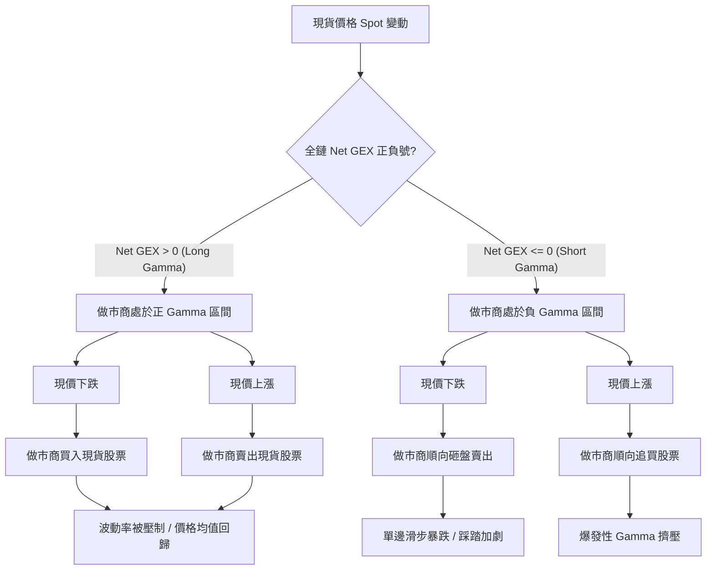
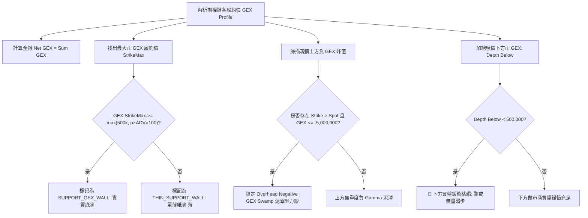

# 做市商 Net GEX 拓撲與三階牆體體系技術規格書

## 1. 核心哲學與適用市場環境

美股期權市場的日內走勢與波動特徵，在微觀層面上高度受到**期權做市商（Option Market Makers）動態對沖盤**的支配。做市商作為期權訂單流的對手方，通常維持投資組合的 Delta 中性（Delta-Neutral）。當標的現貨價格波動時，期權的 Delta 會隨之改變（即二階導數 Gamma），逼使做市商必須在現貨或期貨市場買賣相應股數進行連續對沖。

做市商的總體伽馬曝險（Gamma Exposure, GEX）決定了市場的根本物理體系（Regime）：
1. **Long Gamma 體系（全鏈 $\text{Net GEX} > 0$）**：
   做市商持有正 Gamma 頭寸。當價格下跌時，做市商 Delta 變空，必須在現貨市場**買入股票**進行再平衡；當價格上漲時，做市商 Delta 變多，必須在現貨市場**賣出股票**獲利了結。這種「低買高賣」的被動對沖行為對市場波動形成天然的自穩定壓制，使價格傾向於在關鍵履約價之間進行均值回歸收斂。
2. **Short Gamma 體系（全鏈 $\text{Net GEX} \le 0$）**：
   做市商持有負 Gamma 頭寸。當價格下跌時，做市商被迫**順向砸盤賣出股票**；當價格上漲時，被迫**順向追買股票**。這種「追漲殺跌」的被動行為會極度放大市場波動，引發單邊滑步暴跌或爆發性擠壓（Gamma Squeeze）。

Nexus Seeker 的微觀結構引擎構建了**三階做市商牆體體系**與**泥淖拓撲模型**，精準量化做市商意圖映射，杜絕在流動性泥淖中盲目做多。

---

## 2. 數學模型與量化推導

### 2.1 履約價簽約 GEX 與全鏈 Net GEX
在 Black-Scholes-Merton 框架下，單一口期權的 Gamma 定義為標的價格 $S$ 對 Delta $\Delta$ 的一階偏導數：
$$
\Gamma = \frac{\partial^2 V}{\partial S^2} = \frac{N'(d_1)}{S \sigma \sqrt{T}}
$$
其中 $d_1 = \frac{\ln(S/K) + (r - q + \frac{1}{2}\sigma^2)T}{\sigma \sqrt{T}}$。

針對履約價 $K$，期權做市商在該價位的美元伽馬曝險（Dollar GEX）計算如下：
$$
\text{GEX}(K) = \big(\text{Call OI}(K) \times \Gamma_{\text{Call}}(K) - \text{Put OI}(K) \times \Gamma_{\text{Put}}(K)\big) \times S^2 \times 100
$$
全鏈總體淨伽馬曝險（Net GEX）為所有履約價的代數和：
$$
\text{Net GEX} = \sum_{i=1}^N \text{GEX}(K_i)
$$
- $\text{Net GEX} > 0 \implies \text{LONG\_GAMMA}$（自穩定均值回歸環境）
- $\text{Net GEX} \le 0 \implies \text{SHORT\_GAMMA}$（高波動順向放大環境）

### 2.2 三階做市商牆體分類體系 (`classify_gex_wall`)
令全鏈最大正 GEX 曝險值為 $M_{\text{pos}} = \max_{K} \{\text{GEX}(K) \mid \text{GEX}(K) > 0\}$。對任一履約價的曝險值 $\text{GEX}(K)$，做市商意圖映射函式定義如下：
$$
\text{Wall Type} =
\begin{cases}
\text{SUPPORT\_GEX\_WALL}, & \text{若 } \text{GEX}(K) > 0 \land |\text{GEX}(K) - M_{\text{pos}}| < 10^{-6} \land \text{GEX}(K) \ge \text{GEX\_THIN\_WALL\_THRESHOLD} \\
\text{THIN\_SUPPORT\_WALL}, & \text{若 } \text{GEX}(K) > 0 \land |\text{GEX}(K) - M_{\text{pos}}| < 10^{-6} \land \text{GEX}(K) < \text{GEX\_THIN\_WALL\_THRESHOLD} \\
\text{RESISTANCE\_CALL\_WALL}, & \text{若 } \text{GEX}(K) < 0 \lor \text{is\_heavy\_otm\_call} == \text{True} \\
\text{NEUTRAL}, & \text{其他中性區域}
\end{cases}
$$
其中薄牆門檻依標的流動性正規化，且不低於絕對下限：
$$\text{GEX\_THIN\_WALL\_THRESHOLD}(\text{ADV}) = \max\left(500{,}000,\ \rho_{\min} \times \text{ADV}_{20} \times 100\right), \quad \rho_{\min} = 10^{-5}$$

GEX 原始值為 $OI \times 100 \times \Gamma \times S^2$，是「每 100% 價格變動」的尺度；乘 0.01 才是每 1% 變動的做市商避險名目。$\rho = (\text{GEX} \times 0.01) / \text{ADV}_{20}$ 稱為**牆體深度比**（每 1% 避險名目 ÷ 20 日平均成交額）。固定的 500k 門檻對大型股形同虛設（原始值隨 $S^2$ 與合約數成長），因此正規化項只會讓門檻**變嚴**、只對 ADV > \$500M 的標的生效；小型股仍以 500k 為下限（避險名目過小的牆不論標的多小都是紙牆）。成交額未知時門檻即為 500k。
- **`SUPPORT_GEX_WALL`**：做市商實質護盤底牆，逢低具備充裕被動買盤。
- **`THIN_SUPPORT_WALL`**：單薄紙牆（終端標註 `(薄)`）。其曝險不足 50 萬美元，在量化策略進場檢核（如右側條件二）中，保守設計直接視為無支撐，不予採信。
- **`RESISTANCE_CALL_WALL`**：上方阻力天花板，做市商順向拋售或避險阻尼。

### 2.3 上方負 Gamma 泥淖 (Overhead Negative GEX Swamp)
當標的現價上方聚集極大規模的負 GEX 峰值時，價格反彈觸及該區域將遭遇做市商劇烈拋售壓制，形成阻力泥淖：
$$
\text{Swamp Strike} = \operatorname{argmin}_{K > \text{Spot}, \; \text{GEX}(K) \le -5,000,000} \big(\text{GEX}(K)\big)
$$
若存在此類履約價，系統將其標註為 `阻$K`（例如 `阻$500`），並作為 Covered Call 賣出履約價的物理下限依據。

### 2.4 現價下方正 GEX 總厚度 (Positive GEX Depth Below)
衡量當前價格下方做市商被動買盤緩衝的深厚程度：
$$
\text{Depth}_{\text{Below}} = \sum_{K < \text{Spot}, \; \text{GEX}(K) > 0} \text{GEX}(K)
$$
- **枯竭警報**：若 $\text{Depth}_{\text{Below}} < 500,000$，代表現價下方做市商被動買盤幾近真空。一旦遭遇突發拋單，極易引發「無量滑步暴跌」（Air Pocket Crash）。

---

## 3. 決策邏輯與狀態機 / 流程圖

### 3.1 做市商避險行為與市場環境對照

### 3.2 GEX 牆體分類與泥淖識別管線

---

## 4. 關鍵具名常數與物理約束

| 常數名稱 | 數值 / 門檻 | 物理 / 代碼約束 | 程式碼檔案路徑 |
| :--- | :--- | :--- | :--- |
| `GEX_THIN_WALL_THRESHOLD` | `500,000.0` | 薄牆門檻的絕對下限（成交額未知時即為門檻） | `nexus_core/market_analysis/index_microstructure.py` |
| `min_negative_threshold` | `-5,000,000.0` | 上方負 Gamma 泥淖（阻力天花板）判定門檻 | `nexus_core/market_analysis/index_microstructure.py` |
| `_MICROSTRUCTURE_SL_NET_GEX_THRESHOLD` | `0.0` | 個股 Net GEX 翻轉視為做市商避險邏輯消亡 | `nexus_core/market_analysis/dynamic_rollover/constants.py` |
| `min_effective_gex` | `thin_wall_threshold(ADV)` | `classify_gex_wall` 底牆有效性門檻（`structural_signals` 以 `gex_profile_data["adv_dollar_20d"]` 計算） | `nexus_core/market_analysis/dynamic_rollover/structural_signals.py` |
| `GEX_WALL_MIN_DEPTH_RATIO` | `1e-5` | 牆體深度比下限 $\rho_{\min}$。依 2026-09-22 的 94 檔橫斷面快照：$\rho < 10^{-5}$ 的牆幾乎都距現價 8–66%（雜訊牆），$\rho \ge 3\times10^{-5}$ 的都貼近現價。PRE_CALIBRATION，守住率以 `calibration micro-report` 逐日累積的標註驗證 | `nexus_core/market_analysis/gex_wall_depth.py` |

---

## 5. 邊界條件、風控熔斷與例外處理

1. **單薄紙牆的保守落空設計**：
   在 `_scan_gex_walls` 掃描函式中，當某履約價被分類為 `THIN_SUPPORT_WALL` 時，代碼刻意不為其建立有效支撐回傳，使其維持 `support_wall = 0.0`。此舉杜絕了系統對低於 `thin_wall_threshold(ADV)`（§2 的成交額正規化門檻，下限 500k）之微弱紙牆產生錯誤的避險信任。成交額來自雷達資料的 `gex_profile_data["adv_dollar_20d"]`；缺值時退回 500k，行為與改版前相同。
2. **負 Gamma 泥淖的極值唯一性**：
   若現價上方存在多個 $\le -5,000,000$ 的負 GEX 峰值，`find_overhead_negative_gex_swamp` 透過 `argmin` 鎖定最深凹陷的最小 GEX 履約價，提供做市商最強砸盤拋售阻力的精確定位。
3. **數據畸形與非數值過濾**：
   解析 `gex_profile` 字典時，若履約價或 GEX 曝險值含有 NaN、Inf 或無法轉為浮點數之無效字串，一律在日誌除錯層級記錄並跳過該筆，防止污染累積加總。

4. **牆體深度比門檻的後續觀察事項**：
   `GEX_WALL_MIN_DEPTH_RATIO = 1e-5` 只依據單日（2026-09-22，94 面支撐牆）的橫斷面分布決定，**尚未**以事後守住率驗證。需要觀察：
   - **守住率 × 深度四分位**：`calibration micro-report` 直接讀取 edge 盤中累積的 `gex_snapshot_history`（每個交易日取收盤前最後一個 15 分鐘分桶），不需另外排程抓取；可標註的日期達 $\ge 20$ 個後判讀。每組至少 30 次 tested 才下結論：若 Q1（最淺）與 Q2 的守住率相近，代表門檻過嚴、可下調；若 Q2 仍明顯低於 Q3/Q4，代表門檻應上調到 Q2/Q3 分界。
   - **production 前向驗證**：`regime_evaluation_log.features_json` 記錄了 `support_gex` 與 `adv_dollar_20d`，`calibration forward-report` 的「牆體深度比四分位」表以事後走勢分組，每組 $n \ge 100$ 後可與 `micro-report` 交叉確認。
   - **觸發面變化**：改版後 ADV \$500M–\$5B 的標的通過率由 84% 降到 75%（ORCL、CRM、XOM、COST 等遠處薄牆被剔除）。右側條件二、做空條件二與 Regime 分類都依賴這道門檻，上線後留意這類標的的 `ENTRY_RIGHT` 通過率是否明顯下降。
5. **edge GEX 只涵蓋最近一檔到期日（已知結構限制）**：
   `nexus_edge_scraper/gex_scraper.py` 解析的是 Yahoo 期權頁的預設表格，也就是最近一檔到期日，牆的深度因此普遍偏淺（週選集中的大型股較不受影響）。深度比門檻是在同一個限制下校準的，所以兩者一致；若日後 edge 改為多到期日加總，`GEX_WALL_MIN_DEPTH_RATIO` 必須重新校準。

---

## 6. 核心程式碼檔案路徑關聯

- `nexus_core/market_analysis/index_microstructure.py`：
  - 核心常量：`GEX_THIN_WALL_THRESHOLD`、`GEX_WALL_MIN_DEPTH_RATIO`、`thin_wall_threshold()`（`nexus_core/market_analysis/gex_wall_depth.py`，stdlib 葉模組，`index_microstructure.py` 重新匯出）
  - 有效性檢驗：`is_gex_wall_effective()`（第 546–551 行）
  - 負 Gamma 泥淖搜索：`find_overhead_negative_gex_swamp()`（第 553–576 行）
  - 下方正 GEX 深度計算：`calculate_positive_gex_depth_below()`（第 578–595 行）
  - 牆體意圖分類：`classify_gex_wall()`（第 597–626 行）
- `nexus_core/market_analysis/dynamic_rollover/structural_signals.py`：`_scan_gex_walls()`
- `nexus_core/cogs/embed_builders/market_embeds.py`：Radar Terminal 終端機 GEX 牆體渲染
