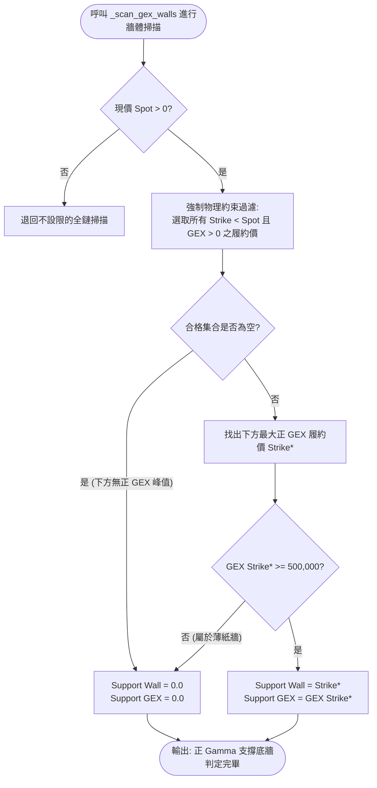

# 做市商底牆現價物理約束定理技術規格書

## 1. 核心哲學與適用市場環境

在量化交易與做市商微觀結構分析中，「支撐」與「阻力」具有不可違背的物理空間定義：
- **支撐底牆（Support Wall）**：在物理定義上必然位於當前標的價格的**下方**（$K < \text{Spot}$），代表當價格下跌觸及該處時，做市商的被動買盤與多頭籌碼將對下行形成物理阻尼。
- **阻力天花板（Resistance / Call Wall）**：在物理定義上必然位於當前標的價格的**上方**（$K > \text{Spot}$），代表價格上漲將遭遇做市商拋售對沖或獲利了結壓制。

### 歷史系統性缺陷與架構重構
在早期期權分析演算法中，普遍存在一個嚴重的邏輯漏洞：直接以「全鏈期權最大正 GEX 峰值」作為支撐牆。當個股上方存在極其龐大的價外 Call Wall（例如大量散戶買入 OTM Call 導致做市商在上方聚集巨大正 Gamma 峰值）時，傳統演算法會將這個遠在現價「上方」的阻力峰值錯誤識別為「支撐底牆」。

這種「指天為地」的致命缺陷會引發災難性後果：
1. **進場檢核誤殺或盲信**：策略誤以為現價「站在巨大支撐之上」，甚至在現價早已跌破真正支撐時，仍因上方虛假支撐而給出安全信號。
2. **停損計算紊亂**：以現價上方的價位減去 ATR 計算停損，導致算出的「停損價位竟高於現價」，引發交易邏輯崩潰。

Nexus Seeker 在 `_scan_gex_walls` 與 `structural_signals.py` 中正式確立並實作了**做市商底牆現價物理約束定理**，在數學層面上強制將支撐牆候選範圍約束在現價下方，徹底消除了此類誤判。

---

## 2. 數學模型與量化推導

### 2.1 底牆現價物理約束定理 (The Physical Constraint Theorem)
給定期權鏈履約價集合 $\mathcal{K} = \{K_1, K_2, \dots, K_N\}$ 及其對應的淨 GEX 曝險函數 $\text{GEX}(K)$。當前標的現貨價格為 $\text{Spot} > 0$。

定義合格支撐履約價子集 $\Omega_{\text{Support}}$ 必須嚴格滿足物理空間約束：
$$
\Omega_{\text{Support}} = \{K \in \mathcal{K} \mid K < \text{Spot} \land \text{GEX}(K) > 0\}
$$

支撐底牆的確定依據以下兩階段判定：
1. **極值檢索**：
   若 $\Omega_{\text{Support}} \neq \emptyset$，則最大正 Gamma 支撐候選履約價 $K^*$ 為：
   $$
   K^* = \operatorname{argmax}_{K \in \Omega_{\text{Support}}} \big(\text{GEX}(K)\big)
   $$
2. **深度有效性驗證**：
   $$
   \text{Support Wall} =
   \begin{cases}
   K^*, & \text{若 } \Omega_{\text{Support}} \neq \emptyset \land \text{GEX}(K^*) \ge \text{GEX\_THIN\_WALL\_THRESHOLD} \\
   0.0, & \text{若 } \Omega_{\text{Support}} = \emptyset \lor \text{GEX}(K^*) < \text{GEX\_THIN\_WALL\_THRESHOLD}
   \end{cases}
   $$
   其中 $\text{GEX\_THIN\_WALL\_THRESHOLD} = 500,000$ 美元。

**推論**：若標的價格持續下殺，跌破所有現價下方的正 GEX 峰值，則 $\Omega_{\text{Support}} = \emptyset$。此時系統強制返回 $\text{Support Wall} = 0.0$，代表下方無任何有效做市商防護底牆，絕不向現價上方借取 Call Wall 作為替代。

### 2.2 阻力牆帶正負號距離判定
傳統邏輯往往默認 Call Wall 必然在現價上方。當價格突破或貫穿 Call Wall 時，若僅計算絕對值距離，會誤判為「阻力空間無限大」。

系統採用帶正負號的相對距離公式：
$$
\Delta_{\text{CallWall}} = \frac{\text{CallWall} - \text{Spot}}{\text{Spot}}
$$
- 當 $\Delta_{\text{CallWall}} < \text{Threshold}_{\text{dynamic}} = \max\big(2.2 \times \text{Risk}_{\text{actual}},\ 1.5 \times \text{ATR}_{1D\_pct},\ 0.035\big)$ 時（門檻自固定 $5\%$ 升級為動態自適應波動率門檻，完整推導見 [`../strategies/06_dynamic_adaptive_room_threshold.md`](../strategies/06_dynamic_adaptive_room_threshold.md)）：
  - 若 $\Delta_{\text{CallWall}} \in [0, 0.05)$：上方空間過窄，盈虧比不足。
  - 若 $\Delta_{\text{CallWall}} \le 0$：現價已觸及或跌破 Call Wall（即現價 $\ge$ Call Wall），做市商阻尼與滯留拋售壓制依然存在，此負值明確表示「空間耗竭且壓制沉重」，判定空間不足拒絕進場。

### 2.2.1 阻力頂牆鏡像定理 (Resistance Wall Mirror Theorem)

做空系統需要的是現價**上方**的壓制頂牆，其物理約束與支撐底牆完整鏡像：

$$\text{ResistanceWall} = \underset{K > \text{Spot}}{\arg\max}\ \text{NetGEX}(K), \qquad \text{NetGEX}(K) > 0$$

物理意義同樣對稱：做市商在該履約價持有大量正 Gamma，價格漲上去時必須賣出對沖形成天花板；正如支撐牆處他們必須買進對沖而形成地板。牆體厚度沿用同一套 $\text{GEX} \ge 500{,}000$ 薄紙牆門檻。

⚠️ 此掃描**刻意不重用** `_scan_gex_walls()` 既有的 `resistance_wall` 回傳值：那一路分支走的是 `classify_gex_wall(...) == "RESISTANCE_CALL_WALL"`（針對重倉價外 Call 的分類），且**沒有** $K > \text{Spot}$ 的物理約束，語意與本定理不同；改動它會連帶影響 `anti_washout.py` 的 `_correct_wall_topology`，故另立函式 `_scan_resistance_wall_above_spot()`。

### 2.2.2 牆體現價動態重錨 (Dynamic Wall Re-anchoring)

期權未平倉量快取每交易日僅更新一次（隔夜），而現價在盤前與盤中連續移動。因此**快取中的牆體隨時可能失效**：現價跌穿 Put Wall、或漲過 Call Wall。此時該牆體既不再提供物理防護，也不該被當成有效數據渲染或餵進風控計算。

設 $\epsilon = 10^{-4}$ 為平值判定容差。牆體有效性判定與重錨規則：

$$
\text{PutWall}_{\text{eff}} =
\begin{cases}
\text{PutWall}_{\text{cache}}, & \text{若 } \text{PutWall}_{\text{cache}} < \text{Spot} - \epsilon \\[4pt]
\underset{K < \text{Spot}}{\arg\max}\ \text{NetGEX}(K), & \text{否則，且下方存在合格正 GEX 峰值} \\[4pt]
0.0, & \text{否則}
\end{cases}
$$

$$
\text{CallWall}_{\text{eff}} =
\begin{cases}
\text{CallWall}_{\text{cache}}, & \text{若 } \text{CallWall}_{\text{cache}} > \text{Spot} + \epsilon \\[4pt]
\underset{K > \text{Spot}}{\arg\max}\ \text{NetGEX}(K), & \text{否則，且上方存在合格正 GEX 峰值} \\[4pt]
0.0, & \text{否則}
\end{cases}
$$

三項關鍵語意：

1. **平值（$|K - \text{Spot}| \le \epsilon$）一律排除**。牆體恰落在現價上時緩衝為 $0.00\%$，在物理上不構成支撐或阻力；把它算成有效牆體會讓下游把 $0.00\%$ 的牆距當成真實數據渲染。此容差同時消除浮點誤差使 ATM 巨額 GEX 在兩側候選池之間來回翻轉的不確定性。
2. **重錨不成功時歸 $0.0$，絕不向另一側借牆**——沿用 §2.1 的推論。
3. **重錨是風控必要條件，不只是顯示修正**。失效底牆會讓動態空間門檻的停損推導落入拓撲逆轉 fallback（$\text{Stop} = \text{Spot} - 2.0 \times \text{ATR}_{15m}$），使 $\text{Risk}_{\text{actual}}$ 退化成與真實支撐位置完全脫鉤的固定 ATR 代理而**系統性低估**風險。數值範例：現價 $\$100$、失效底牆 $\$102$、次一道真實支撐 $\$90$、$\text{ATR}_{15m} = 1.0$ 時，代理值給出 $\text{Risk} = 2.0\%$（門檻 $4.4\%$），重錨後為 $\text{Risk} = 10.5\%$（門檻 $23.1\%$）——相差逾五倍。

### 2.3 拓撲逆轉修復公式 (Topology Inversion Correction)
在異常期權結構或資料源偶發翻轉時，若偵測到 $\text{Put Wall} > \text{Call Wall}$，系統啟動拓撲逆轉修復：
$$
\text{Anchor Base} = \min(\text{Put Wall}, \; \text{Call Wall})
$$
$$
\text{Effective Resistance Wall} = \max(\text{Put Wall}, \; \text{Call Wall})
$$
確保較低者歸位為防守底牆，較高者歸位為天花板。

---

## 3. 決策邏輯與狀態機 / 流程圖

---

## 4. 關鍵具名常數與物理約束

| 常數名稱 | 數值 / 門檻 | 物理 / 代碼約束 | 程式碼檔案路徑 |
| :--- | :--- | :--- | :--- |
| `GEX_THIN_WALL_THRESHOLD` | `500,000.0` | 支撐底牆有效性之最低 GEX 深度門檻 | `nexus_core/market_analysis/index_microstructure.py` |
| `_ENTRY_SUPPORT_WALL_MAX_DISTANCE_PCT` | `0.05` ($5\%$) | ATR 兩項皆缺時退回的舊版單邊上限（降級路徑） | `nexus_core/market_analysis/dynamic_rollover/constants.py` |
| `_ROOM_RISK_MULTIPLIER` / `_ROOM_ATR_1D_MULTIPLIER` / `_ROOM_ABSOLUTE_FLOOR_PCT` | `2.2` / `1.5` / `0.035` | 帶正負號 Call Wall 空間率的動態門檻三項；取代退役的 `_ENTRY_ASYMMETRIC_ROOM_PCT` 固定 $5\%$ | `nexus_core/market_analysis/room_threshold.py` |
| `_BUFFER_MULTIPLIERS` | `RIGHT/SHORT: (2.5, 1.8)`, `LEFT: (1.0, 1.2)` | 牆體緩衝雙邊界倍率；取代退役的固定 $5\%$ 上限 | `nexus_core/market_analysis/room_threshold.py` |

---

## 5. 邊界條件、風控熔斷與例外處理

1. **現價缺失或無效時的回退機制**：
   若呼叫端傳入 $\text{Spot} \le 0$（例如極早期尚未取得最新報價），代碼自動退回不設限的全鏈掃描，以維持舊有組件的向後相容性。但只要在實時交易與進場檢核路徑中，現價皆保證大於零，強制啟用 $K < \text{Spot}$ 約束。
2. **多個相同正 GEX 峰值之唯一性選取**：
   若現價下方存在多個相同數值的正 GEX 峰值，Python 內建的列表推導與 `max` 函式將按排序穩定返回，確保演算法執行的確定性（Deterministic）。
3. **Call Wall 穿透後的狀態標記**：
   當現價突破 Call Wall 時，系統不會將阻力標記為「無阻力」，而是透過 $\Delta_{\text{CallWall}} \le 0$ 觸發 TP2 獲利了結，同時在進場端關閉買進權限，防範高位滯留風險。
4. **空候選集的缺失 sentinel 為 $0.0$**：
   邊緣爬蟲 (`nexus_edge_scraper/gex_scraper.py`) 在某一側無任何合格候選履約價時回傳 $0.0$，**不回傳現價**。回傳現價與「確實存在一道牆且恰落在現價上」在數值上無法區分，會讓下游把 $0.00\%$ 牆距渲染成真實數據；$0.0$ 與該檔硬失敗時的 `FALLBACK_GEX` 共用同一個「缺失」語意，而 `nexus_core` 全部消費端皆以 `> 0` 為閘門。
5. **重錨失敗時的強制揭露**：
   重錨歸 $0.0$ 後，動態空間門檻的 $\text{Risk}$ 項會被自 $\max()$ 中剔除並標記 `is_degraded`。分析中心的 GEX 空間欄位**一律**輸出該降級原因，不限於「判定不利」時——空間充足的結論若建立在降級門檻上，靜默通過等於讓使用者誤以為那是完整數據下的判定（見 [`../strategies/06_dynamic_adaptive_room_threshold.md`](../strategies/06_dynamic_adaptive_room_threshold.md) §5）。

---

## 6. 核心程式碼檔案路徑關聯

- `nexus_core/market_analysis/dynamic_rollover/structural_signals.py`：
  - 核心實作函式：`_scan_gex_walls()`（第 67–151 行）
  - 錨點解析與拓撲修復：`_resolve_canonical_anchor_base()`（第 38–65 行）
- `nexus_core/market_analysis/dynamic_rollover/opportunity_cost.py`：
  - 條件二約束檢核：`_confirm_entry_condition2_support_wall()`（第 257–303 行）
  - 條件三帶符號空間檢核：`_confirm_entry_condition3_no_physical_cap()`（第 305–349 行）
- `nexus_core/market_analysis/index_microstructure.py`：`classify_gex_wall()`, `GEX_THIN_WALL_THRESHOLD`
- `nexus_core/market_analysis/dynamic_rollover/anti_washout.py`：`_correct_wall_topology()`
- `nexus_core/market_analysis/dynamic_rollover/_shared.py`：`resolve_room_threshold_inputs()` 的 `target_spot` 物理約束校驗（§2.2.2 的 Put Wall 重錨在進場鐵律側的唯一入口；右側條件三與左側條件三皆經此路徑，做空側刻意不經過——其停損牆在現價上方）
- `nexus_core/market_analysis/dynamic_rollover/short_side_entry.py`：`_find_next_negative_gex_peak()`（破位追空次級節點，同樣套用 $\epsilon$ 平值排除）
- `nexus_core/cogs/embed_builders/portfolio_embeds.py`：分析中心 GEX Profile 欄位的雙側重錨渲染與 `(動態重錨)` 標記、`valid_put_stop_wall` 過濾
- `nexus_edge_scraper/gex_scraper.py`：`scrape_symbol_gex_core()` 的兩側候選池 $\epsilon$ 平值排除與 $0.0$ 缺失 sentinel
