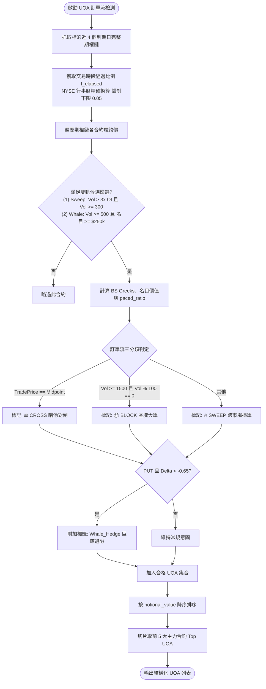

# 異常期權活動 (UOA) 權利金排序與時段進度正規化技術規格書

## 1. 核心哲學與適用市場環境

異常期權活動（Unusual Options Activity, UOA）代表機構主力、對沖基金或知情交易者（Informed Traders）利用期權市場的高槓桿非線性特性，建立大規模方向性押注或極端尾部避險的微觀訂單流痕跡。

在傳統期權掃描系統中，普遍存在兩大扭曲實質資金流向的痛點：
1. **成交量（Volume）排序陷阱**：
   若單純依成交口數排序，低價投機股（如股價 $2、權利金 $0.05）的 5,000 口成交（名目金額僅 $25,000 美元），會輕易排在權值龍頭（如 NVDA 股價 $130、權利金 $8.00）的 1,500 口成交（名目金額高達 $1,200,000 美元）之前。這會導致雷達終端充斥著無關痛癢的散戶廉價合約，而遺漏真正的機構巨鯨大單。
2. **盤中時間維度的累積失真**：
   期權未平倉量（Open Interest, OI）是前一交易日結算後的靜態固定值，而盤中成交量（Volume）則隨開盤時間持續累加。若設定固定的比值門檻（例如 $\text{Volume}/\text{OI} \ge 1.0$）：
   - 在開盤後 10 分鐘出現 $1.0\text{x}$，代表短短 10 分鐘內成交量已超過前日總未平倉，具備極端猛烈的衝擊強度；
   - 在收盤前 10 分鐘累積達到 $1.0\text{x}$，則僅是全天正常流動性換手的結果。
   兩者在量化意義上天差地別，固定比值門檻在早盤過於遲鈍、在尾盤又產生過多偽陽性。

Nexus Seeker 的 UOA 遙測模組全面推行了**名目價值權利金排序（Notional-Value Ranking）**、**時段進度正規化（`paced_ratio`）**與**三分類標籤體系（SWEEP / BLOCK / CROSS）**，重塑真實訂單流的量化標準。

---

## 2. 數學模型與量化推導

### 2.1 權利金名目價值排序 (Notional-Value Ranking)
對於期權鏈上的任一交易候選列，其實質投入的名目權利金（Notional Premium）計算如下：
$$
\text{Notional Value} = \text{Trade Price} \times \text{Volume} \times 100
$$
- `Trade Price`：期權最近成交價（或最後報價）。
- `Volume`：當日累積成交口數。
- 乘數 `100`：每口標準美股期權對應 100 股現貨。

在 `detect_uoa` 與 `detect_uoa_with_physical_caps` 中，系統在候選篩選階段計算出 `notional_value`，並將最終前 5 大主力單的排序依據從成交量降序全面升級為：
$$
\text{Rank Order} = \operatorname{sort\_descending}(\text{UOA List}, \; \text{key} = \text{notional\_value})[:5]
$$
這保證了終端呈現的「最強主力單」（Top UOA）必然是全市場實質資金下注規模最龐大的合約。

### 2.2 交易時段進度經過比例與鉗制公式
在紐約證券交易所（NYSE）常規交易時間（09:30 至 16:00 ET，總計 390 分鐘 = 23,400 秒）內，定義當前時間戳 $t$ 的交易時段經過比例 $f_{\text{elapsed}}$：
$$
f_{\text{elapsed}} = \frac{t - t_{\text{open}}}{t_{\text{close}} - t_{\text{open}}} \in (0.0, \; 1.0]
$$

為防止在開盤極早期（前 20 分鐘）分母趨近於零導致倍數失真爆炸，引入分母下限鉗制（Clamp）：
$$
\hat{f}_{\text{elapsed}} = \max\big(0.05, \; \min(1.0, \; f_{\text{elapsed}})\big)
$$
- **開盤前 20 分鐘**：$\hat{f}_{\text{elapsed}} = 0.05$，犧牲極早期靈敏度以換取數值穩定性。
- **非交易時段（盤前、盤後、週末、假日）或查詢例外**：$\hat{f}_{\text{elapsed}} = 1.0$，等同不作任何放大。

### 2.3 時段進度正規化比值 (`paced_ratio`)
將原始放量比外推至全天收盤預估比值：
$$
\text{paced\_ratio} = \frac{\text{Volume} / \text{OI}}{\hat{f}_{\text{elapsed}}}
$$
- **統計意義**：`paced_ratio` 衡量的是「若標的在全天剩餘時間維持當前流速，收盤時預計將達到的 Volume/OI 比值」。
- **架構原則**：`paced_ratio` 為純附加欄位，專供微觀結構出場（如 `SL-主力對沖`）進行橫跨全天的均勻靈敏度捕捉；既有已校準的各項常規門檻（如進場鐵律的 `ratio >= 0.8x`）維持原始 `ratio` 不變，實現零破壞性升級。

### 2.4 SWEEP / BLOCK / CROSS 三分類訂單流標籤
結合訂單形狀啟發式與執行價 Bid/Ask 位置，演算法將訂單流分類為三種微觀屬性：
$$
\text{Trade Classification} =
\begin{cases}
\text{⚖️ CROSS}, & \text{若 } |\text{Trade Price} - \frac{\text{Bid} + \text{Ask}}{2}| < 10^{-4} \quad (\text{暗池場外對倒印刷，優先度最高}) \\
\text{📦 BLOCK}, & \text{若 } \text{Volume} \ge 1,500 \land (\text{Volume} \bmod 100 == 0) \quad (\text{整百手大額區塊交易}) \\
\text{🔥 SWEEP}, & \text{其他跨市場主動掃單 (Intermarket Sweep Order)}
\end{cases}
$$

### 2.5 Whale Hedge 巨鯨避險排除標籤
若偵測到大額 PUT 買單，且 Delta 呈現深價內特徵：
$$
\text{Type} == \text{"PUT"} \land \Delta < -0.65
$$
自動在意圖欄位標註 `｜Whale_Hedge (巨鯨避險)`。量化策略禁止將該單據計入看跌放空信號，認定其為機構持有龐大現貨底倉時所配置的被動對沖保險單。

---

## 3. 決策邏輯與狀態機 / 流程圖

---

## 4. 關鍵具名常數與物理約束

| 常數名稱 | 數值 / 門檻 | 物理 / 代碼約束 | 程式碼檔案路徑 |
| :--- | :--- | :--- | :--- |
| `max_expiries` | `4` | UOA 掃描抓取的最大到期日數量 | `nexus_core/market_analysis/sentiment/uoa_detector.py` |
| `vol_oi_ratio` | `3.0` | Sweep 候選篩選最低 Volume/OI 門檻 | `nexus_core/market_analysis/sentiment/uoa_detector.py` |
| `min_volume` | `300` | 候選篩選最低合約成交口數 | `nexus_core/market_analysis/sentiment/uoa_detector.py` |
| `max_non_index_nominal` | `$500,000,000.0` | 個股單場合約名目上限（防範異常壞數據） | `nexus_core/market_analysis/sentiment/uoa_detector.py` |
| `min_fraction` | `0.05` ($5\%$) | 開盤時段進度正規化分母下限鉗制值（約開盤 20 分鐘） | `nexus_core/market_time.py` |
| `_ENTRY_UOA_MIN_NOTIONAL_USD` | `$200,000.0` | 右側進場條件四認可之主力最低名目金額 | `nexus_core/market_analysis/dynamic_rollover/constants.py` |
| `_MICROSTRUCTURE_SL_WHALE_PUT_MIN_NOTIONAL_USD` | `$500,000.0` | SL-主力對沖單筆 PUT BTO 最低名目金額 | `nexus_core/market_analysis/dynamic_rollover/constants.py` |

---

## 5. 邊界條件、風控熔斷與例外處理

1. **時段進度單次快照共用設計**：
   在 `detect_uoa` 與 `detect_uoa_with_physical_caps` 入口處，`market_time.get_trading_day_elapsed_fraction()` 僅執行一次，傳入下游所有候選列。此舉避免在數百列期權數據迴圈中反覆查詢 NYSE 行事曆與時區轉換，消除不必要的 CPU 負擔。
2. **壞數據熔斷防護 (`max_non_index_nominal`)**：
   在極少數爬蟲異常情況下，若數據源提供錯誤的價格或成交量，導致名目價值被放大至荒謬的天文數字，代碼內建 5 億美元的名目價值天花板，超越此值之單據直接剔除，防止污染排名。
3. **除零防護**：
   若標的未平倉量 $\text{OI} == 0$，在候選篩選階段 `openInterest > 0` 的遮罩直接將其過濾，根絕零除例外（ZeroDivisionError）。

---

## 6. 核心程式碼檔案路徑關聯

- `nexus_core/market_analysis/sentiment/uoa_detector.py`：
  - 候選列向量篩選：`_select_uoa_candidate_rows()`（第 85–107 行）
  - 核心處理與時段正規化：`_process_uoa_candidate_rows()`（第 109–282 行）
  - 權利金排序與對外入口：`detect_uoa()`（第 285–337 行）
  - 全鏈物理封頂版入口：`detect_uoa_with_physical_caps()`（第 339–458 行）
- `nexus_core/market_time.py`：`get_trading_day_elapsed_fraction()`（第 81–121 行）
- `nexus_core/market_analysis/uoa_telemetry.py`：`generate_uoa_ascii_table()`
- `nexus_core/cogs/embed_builders/portfolio_embeds.py`：Symbol Hub UOA 欄位呈現與三分類標籤
