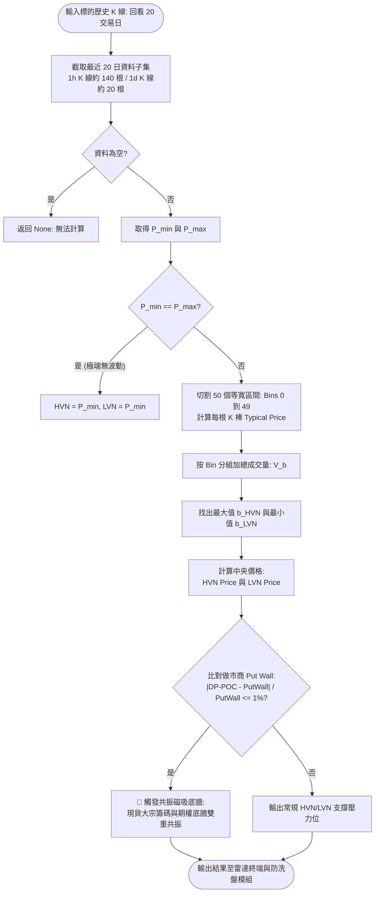

# 成交量分佈 (Volume Profile) 與暗池 DP-POC 磁吸模型技術規格書

## 1. 核心哲學與適用市場環境

傳統技術分析主要關注「價格隨時間的演變」（Price-Time），但在美股機構量化微觀結構中，「價格與成交量的關係」（Price-Volume）更具備決定性意義。**成交量分佈（Volume Profile, VP）**透過將特定時間段內的成交量橫向投影在各價格區間上，精準揭示了真實籌碼的沉澱與分佈結構：
1. **高成交量節點（High Volume Node, HVN / Volume-POC）**：
   代表市場各方在該價位進行了最充分的換手與博弈，買賣雙方達成價值共識（Fair Value）。該區域流動性極其充沛，是價格回撤時的強力物理支撐或反彈阻力。
2. **低成交量節點（Low Volume Node, LVN / 流動性真空區）**：
   代表價格在該區間快速滑動、換手極少，缺乏實質籌碼沉澱。當行情再次進入 LVN 區間時，由於缺乏掛單阻尼，價格極易發動「無量滑步」式的加速暴跌或暴漲。

### 暗池 DP-POC 與 1% 共振磁吸模型
在美股市場中，另類交易系統（Alternative Trading Systems, ATS / 暗池）佔據了超過 40% 的機構大宗交易量。機構資金為避免在公眾訂單簿（Lit Exchanges）引起價格滑價，通常在暗池建立龐大頭寸。

Nexus Seeker 的量化引擎將現貨籌碼分佈（Volume-POC）與做市商期權底牆（Put Wall）相結合，構建了 **1% 共振磁吸底牆模型**：
- 當現貨籌碼控制中心（DP-POC / HVN）與期權做市商護盤底牆（Put Wall）的價位重合在 1% 誤差之內時，現貨實質籌碼防線與期權做市商對沖買盤產生**共振支撐（Magnetic Resonance Floor）**，構成全系統最高置信度的防守壁壘。

*重要資料架構揭露：當前生產環境中，`nexus_edge_scraper` 未直接接入 ATS 逐筆暗池數據源，系統以 20 日 50-Bin Volume Profile HVN（或 Redis/SQLite 快取中的 `volume_poc`）作為暗池 DP-POC 之量化代理指標，所有終端呈現皆遵循此代理原則。*

---

## 2. 數學模型與量化推導

### 2.1 典型價格 (Typical Price)
為全面捕捉每根 K 棒的內部流動性重心，演算法採用典型價格作為成交量賦予基準：
$$
\text{Typical Price}_t = \frac{\text{High}_t + \text{Low}_t + \text{Close}_t}{3}
$$

### 2.2 50-Bin 等寬價格分箱演算法
選取標的過去 20 個交易日（以 1 小時 K 線為例，約 $20 \times 7 = 140$ 根 K 棒；日 K 則為 20 根）的歷史數據子集，定義價格極值：
$$
P_{\min} = \min_{t} \{\text{Low}_t\}, \quad P_{\max} = \max_{t} \{\text{High}_t\}
$$
將極值區間等分為 $\text{num\_bins} = 50$ 個離散區間：
$$
\text{BinWidth} = \frac{P_{\max} - P_{\min}}{50}
$$
各區間邊界點為：
$$
B_k = P_{\min} + k \times \text{BinWidth}, \quad k \in \{0, 1, 2, \dots, 50\}
$$

### 2.3 籌碼分佈聚合與節點識別 (HVN / LVN)
將每根 K 棒的成交量 $\text{Volume}_t$ 歸入其典型價格所在的 Bin $b \in \{0, 1, \dots, 49\}$，累加計算各分箱之成交總量：
$$
V(b) = \sum_{\{t \mid \text{Typical}_t \in [B_b, B_{b+1})\}} \text{Volume}_t
$$
進而解析出籌碼最大密集點與流動性真空點：
1. **HVN（High Volume Node / Volume-POC）**：
   $$
   b_{\text{HVN}} = \operatorname{argmax}_{b} \{V(b)\}
   $$
   $$
   \text{HVN Price} = P_{\min} + (b_{\text{HVN}} + 0.5) \times \text{BinWidth}
   $$
2. **LVN（Low Volume Node / Vacuum Area）**：
   $$
   b_{\text{LVN}} = \operatorname{argmin}_{b} \{V(b)\}
   $$
   $$
   \text{LVN Price} = P_{\min} + (b_{\text{LVN}} + 0.5) \times \text{BinWidth}
   $$

### 2.4 🧲 1% 共振磁吸底牆判定公式
將做市商期權底牆 $\text{Put Wall}$ 與籌碼控制中心 $\text{DP-POC}$（即 $\text{HVN Price}$）進行相對偏差度量：
$$
\delta_{\text{resonance}} = \frac{|\text{DP-POC} - \text{PutWall}|}{\text{PutWall}}
$$
- **判定門檻**：
  $$
  \delta_{\text{resonance}} \le 0.01 \quad (1.0\%)
  $$
- 當此條件滿足時，終端標記為 `🧲 共振磁吸底牆`。代表現貨多頭的換手成本底線與期權做市商的 Gamma 轉折點完全鎖定，形成極難被單邊突破的剛性支撐。

---

## 3. 決策邏輯與狀態機 / 流程圖

---

## 4. 關鍵具名常數與物理約束

| 常數名稱 | 數值 / 門檻 | 物理 / 代碼約束 | 程式碼檔案路徑 |
| :--- | :--- | :--- | :--- |
| `num_bins` | `50` | Volume Profile 等寬分箱數量 | `nexus_core/market_analysis/volume_profile.py` |
| `days` | `20` | 籌碼分佈回看之交易日天數 | `nexus_core/market_analysis/volume_profile.py` |
| `Resonance Tolerance` | `0.01` ($1\%$) | DP-POC 與 Put Wall 判定共振之最大相對誤差 | `nexus_core/cogs/embed_builders/market_embeds.py` |
| `LVN Trap Tolerance` | `0.015` ($1.5\%$) | 停損落入 LVN 真空區之判定容差 | `nexus_core/market_analysis/dynamic_rollover/anti_washout.py` |

---

## 5. 邊界條件、風控熔斷與例外處理

1. **價格區間退化防呆 (`min_price == max_price`)**：
   在停牌、新上市或成交極度萎縮的標的中，若子集內最高價與最低價完全相同，演算法直接返回該數值作為 HVN 與 LVN，防止計算 `(max_price - min_price) / num_bins` 時觸發除以零例外。
2. **K 線樣本不足保護**：
   若歷史子集經過過濾後為空，函式安全返回 `None`。下游模組在取得 `None` 時自動退回以 `Gamma Flip` 或 `Spot` 作為錨點，杜絕連鎖崩潰。
3. **LVN 停損排斥防衛**：
   在 `anti_washout.py` 中，計算出的初步停損價位若距離 LVN 在 1.5% 容差之內，系統禁止停留在該處，強制調用量價拓撲吸附演算法，將停損平移至次級 HVN 上緣或下探離開真空帶，保護投資人免於滑步衝擊。

---

## 6. 核心程式碼檔案路徑關聯

- `nexus_core/market_analysis/volume_profile.py`：
  - DataFrame 向量化分箱：`calculate_volume_profile_from_df()`（第 10–60 行）
  - 歷史抓取與對外入口：`calculate_volume_profile()`（第 62–78 行）
- `nexus_core/market_analysis/dynamic_rollover/anti_washout.py`：
  - LVN 陷阱吸附演算法：`_compute_anti_washout_stop()`（第 127–142 行）
- `nexus_core/cogs/unified_terminal/radar_data.py`：`volume_profile` 與 `volume_poc` 資料組裝（第 205–215 行）
- `nexus_core/cogs/embed_builders/market_embeds.py`：🧲 共振磁吸底牆渲染判定（第 630–640 行、第 1494 行）
