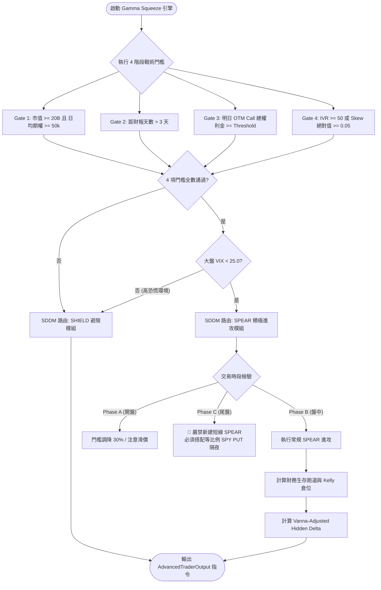

# Gamma Squeeze 引擎與 SPEAR 進攻訊號體系技術規格書

## 1. 核心哲學與適用市場環境

**Gamma 擠壓（Gamma Squeeze）**是美股衍生品市場中爆發力最強大的非對稱動能結構。當市場參與者在短期內大量買入虛值看漲期權（OTM Calls）時，作為對手方的期權做市商持有大量空頭 Call（Short Call）頭寸。隨著現貨價格逼近履約價，這批期權的 Delta 將迅速由 0 飆升至 1（此一變化速率即二階導數 Gamma）。為了維持 Delta 中性，做市商必須在現貨市場買入天量股票，從而引發：
$$
\text{現價上漲} \longrightarrow \text{做市商 Delta 缺口擴大} \longrightarrow \text{做市商被動買入現貨} \longrightarrow \text{推升現價進一步暴漲}
$$
這種正反饋自我強化閉環，能在短時間內引發極端暴力拉升。

然而，盲目追逐 Gamma 擠壓常伴隨巨大風險：散戶極易落入低流動性陷阱、在財報前夕遭受波動率崩塌（IV Crush），或在市場恐慌時被反向清算。

Nexus Seeker 的量化決策引擎（`NexusGammaSqueezeEngine`）構建了全方位的風控進攻體系：
1. **四階段戰術硬性門檻（4-Stage Tactical Gates）**：嚴格過濾無流動性、事件風險或偽擠壓標的。
2. **SDDM 戰術操作路由（SPEAR / SHIELD / WAIT）**：依大盤恐慌指數（VIX）與門檻驗證結果進行全局模式切換。
3. **帳戶財務生存跑道分析（Financial Runway Analysis）**：將投機規模嚴格約束在帳戶生存安全邊界內。
4. **Vanna-Adjusted Hidden Delta 對沖**：提前對沖現貨與波動率同向暴漲引發的非線性風險。
5. **盤後歸因自我進化閉環（Post-Market Feedback Loop）**：依據真實對沖保護得分，動態調節明日進攻權利金門檻。

---

## 2. 數學模型與量化推導

### 2.1 四階段戰術硬性門檻 (4-Stage Tactical Gates)
對任一目標標的，必須同時通過以下四項硬性檢驗，方具備進攻資格：

#### Gate 1: 流動性門檻 (Liquidity Gate)
$$
\text{Market Cap} \ge \$20\text{B} \land \text{Avg Option Volume} \ge 50,000 \quad (\text{口/日})
$$
- 物理約束：排除中小盤流動性黑洞，確保機構期權鏈具備足夠做市商對沖承載力。

#### Gate 2: 事件風險門檻 (Event Risk Gate)
$$
\text{Days Until Earnings} > 3 \quad (\text{天})
$$
- 物理約束：距離財報發布小於等於 3 天者嚴禁進攻，徹底杜絕財報二元事件引發的 IV Crush 滅頂陷阱。

#### Gate 3: 資金效率門檻 (Capital Efficiency Gate)
明日到期（Next-Day Expiry）OTM Call 的總成交權利金必須達到當前動態門檻 $T_{\text{Gate3}}$：
$$
\text{Premium}_{\text{Tomorrow OTM Calls}} \ge T_{\text{Gate3}}
$$
- 基準門檻：$T_{\text{base}} = \$1,000,000.0$。
- **盤中時段動態調降**：在開盤前一小時（`Phase A`, 09:30–10:30 ET），因開盤定價混亂與成交量尚未充分累積，門檻自動降低 30%：
  $$
  T_{\text{Gate3}} = T_{\text{base}} \times 0.70 = \$700,000.0
  $$

#### Gate 4: 跨市場驗證門檻 (Cross-Market Validation Gate)
$$
\text{IV Rank} \ge 50.0 \lor |\text{Option Skew}| \ge 0.05
$$
- 物理約束：標的自身波動率位階必須已處於擴張態，或做市商偏斜度已反映機構單向搶籌，確認期權定價已進入非線性加速區。

---

### 2.2 SDDM 戰術操作路由 (Strategic Decision & Direction Module)
根據標的適用性、門檻檢驗與市場全局恐慌指數 $\text{VIX}$ 進行三分流判定：
$$
\text{SDDM Route} =
\begin{cases}
\text{WAIT}, & \text{若市場休市或非交易時段} \\
\text{SHIELD}, & \text{若任一 Gate 未通過} \lor \text{Current VIX} \ge 25.0 \\
\text{SPEAR}, & \text{若 4 階段 Gates 全數通過} \land \text{Current VIX} < 25.0
\end{cases}
$$
- **`SPEAR`（進攻）**：解鎖積極進攻模組，允許開立 OTM Call 多頭倉位。
- **`SHIELD`（避險）**：限制主動投機交易，全面進入 Delta 中性平衡與尾盤保護性 Put 防禦。
- **`WAIT`（觀望）**：非盤中時段靜默等待。

---

### 2.3 Gamma 磁吸目標價 (Magnet Target)
在 Gamma 擠壓啟動時，做市商對沖買盤將推動現價向上磁吸至下一個整數期權履約價：
$$
\text{Magnet Target} = \lceil\text{Spot} / 5.0\rceil \times 5.0
$$
若計算結果與現價過於貼近（$|\text{Magnet Target} - \text{Spot}| < 0.01$），向上順延一個履約價區間：
$$
\text{Magnet Target} = \text{Magnet Target} + 5.0
$$

---

### 2.4 帳戶財務生存跑道分析 (Financial Runway Analysis)
將交易員的生活開銷與投資組合的 Theta 現金流整合為生存天數指標：
$$
\text{Daily Burn Rate} = \frac{\text{Monthly Burn Rate}}{30}
$$
$$
\text{Projected Daily Theta} = \sum_{i} \big(\text{Theta}_i \times \text{Quantity}_i \times 100\big)
$$
$$
\text{Financial Runway Days} = \operatorname{int}\left(\max\left(0, \; \frac{\text{Cash Reserve} + \text{Projected Daily Theta}}{\text{Daily Burn Rate}}\right)\right)
$$
$$
\text{Theta Coverage Pct} = \frac{\text{Projected Daily Theta}}{\text{Daily Burn Rate}} \times 100\%
$$
- **風控分級紅線**：
  - $\ge 180$ 天：🟢 極其安全，運營資金結構優良。
  - $90 \sim 179$ 天：🟡 良好防守狀態。
  - $30 \sim 89$ 天：🟠 中等警戒，精簡持倉。
  - $< 30$ 天：🔴 🚨 極度危險！系統強制凍結任何高槓桿或買方投機交易。

---

### 2.5 凱利公式動態倉位縮放 (Kelly Position Sizing)
以基準分數凱利 $\text{Base Kelly} = 0.25$（對應 55% 勝率、1.5 盈虧比）為底層，依據大盤波動率進行縮放：
$$
\text{Kelly Scaling} =
\begin{cases}
0.25 \times 1.0 = 25.0\%, & \text{若 } \text{VIX} < 15.0 \quad (\text{低波牛市: 全力進攻}) \\
0.25 \times 0.6 = 15.0\%, & \text{若 } 15.0 \le \text{VIX} < 25.0 \quad (\text{常規波動: 減速警惕}) \\
0.25 \times 0.1 = 2.5\%, & \text{若 } \text{VIX} \ge 25.0 \quad (\text{極端恐慌: 極限防守})
\end{cases}
$$

---

### 2.6 Vanna-Adjusted Hidden Delta 對沖
Vanna 是期權 Delta 對波動率 $\sigma$ 的一階偏導數（亦即 Vega 對現價 $S$ 的一階偏導數）：
$$
\text{Vanna} = \frac{\partial \Delta}{\partial \sigma} = \frac{\partial \mathcal{V}}{\partial S} = -\frac{N'(d_1) d_2}{\sigma}
$$
在劇烈的 Gamma 擠壓中，現貨價格暴漲通常伴隨隱含波動率的急劇飆升（$+10\%$，即 $d\sigma = 0.10$）。由此引發的「隱性 Delta 漂移」（Hidden Delta）計算如下：
$$
\Delta_{\text{Hidden}} = \text{Portfolio Vanna} \times 0.10 \times 100
$$
換算為對標大盤 Beta 加權的 SPY 對沖股數：
$$
\text{SPY Hedge Shares} = -\operatorname{round}\big(\Delta_{\text{Hidden}} \times \beta\big)
$$
- 若 $\text{Shares} < 0$：發出賣出 SPY 現貨指令以恢復投資組合 Delta 中性。

---

### 2.7 盤後對沖歸因與自我進化機制 (Attribution Feedback Loop)
每日美東時間 16:30，系統計算當日對沖保護得分 $\text{Protection Score} \in [0, 100]$：
$$
\text{Protection Score} =
\begin{cases}
\min\left(100, \; \frac{\text{Hedge PnL}}{|\text{Portfolio PnL}|} \times 100\right), & \text{若 } \text{Portfolio PnL} < 0 \land \text{Hedge PnL} > 0 \\
0.0, & \text{若 } \text{Portfolio PnL} < 0 \land \text{Hedge PnL} \le 0 \\
\max\left(0, \; \min\left(100, \; 100 + \frac{\text{Hedge PnL}}{\text{Portfolio PnL}} \times 100\right)\right), & \text{若 } \text{Portfolio PnL} \ge 0
\end{cases}
$$
- **反饋動態調節明日 Gate 3 門檻**：
  - 若 $\text{Score} \ge 70.0$（防守效率極佳）：
    $$
    T_{\text{Gate3, next}} = \max\big(\$500,000.0, \; T_{\text{Gate3}} \times 0.90\big)
    $$
    調降門檻 10%，釋放進攻流動性。
  - 若 $\text{Score} < 40.0$（防守失效或拖累過大）：
    $$
    T_{\text{Gate3, next}} = \min\big(\$2,000,000.0, \; T_{\text{Gate3}} \times 1.15\big)
    $$
    調升門檻 15%，嚴格收緊進攻標準。
  - 若 $40.0 \le \text{Score} < 70.0$：維持原門檻。

---

## 3. 決策邏輯與狀態機 / 流程圖

---

## 4. 關鍵具名常數與物理約束

| 常數名稱 | 數值 / 門檻 | 物理 / 代碼約束 | 程式碼檔案路徑 |
| :--- | :--- | :--- | :--- |
| `base_gate_3_threshold` | `$1,000,000.0` | 明日到期 OTM Call 權利金基準進攻門檻 | `nexus_core/market_analysis/gamma_squeeze_engine.py` |
| `Phase A Discount` | `0.70` ($-30\%$) | 開盤前小時流動性門檻自動調降比例 | `nexus_core/market_analysis/gamma_squeeze_engine.py` |
| `Gate 3 Floor` | `$500,000.0` | 盤後歸因進化放寬之最低絕對下限 | `nexus_core/market_analysis/gamma_squeeze_engine.py` |
| `Gate 3 Ceiling` | `$2,000,000.0` | 盤後歸因進化收緊之最高絕對上限 | `nexus_core/market_analysis/gamma_squeeze_engine.py` |
| `base_kelly` | `0.25` ($25\%$) | 基準分數凱利倉位配比 | `nexus_core/market_analysis/gamma_squeeze_engine.py` |
| `VIX Panic Line` | `25.0` | 全局強制切換 SHIELD 避險之 VIX 門檻 | `nexus_core/market_analysis/gamma_squeeze_engine.py` |
| `d_vol` | `0.10` ($10\%$) | Vanna 對沖計算之盤中波動率預期瞬時漂移量 | `nexus_core/market_analysis/gamma_squeeze_engine.py` |
| `protection_history_maxlen` | `252` | 盤後歸因歷史記錄長度上限（約 1 個交易年） | `nexus_core/market_analysis/gamma_squeeze_engine.py` |

---

## 5. 邊界條件、風控熔斷與例外處理

1. **尾盤對沖硬鎖（Phase C Lockout）**：
   在美東時間 15:30 至 16:00（`Phase C`），為規避隔夜跳空與 Gamma 崩塌風險，系統發出警報：**嚴格禁止新建短線純買方 SPEAR 部位**；若強行建倉，必須搭配等比例 SPY PUT 進行隔夜 Delta 中性防禦。
2. **長駐單例記憶體溢出防範**：
   `NexusGammaSqueezeEngine` 在 Scheduler 中作為長駐單例運行。對沖歷史分數容器採用 `collections.deque(maxlen=252)` 實現，超出 252 個交易日（一年）自動淘汰最舊紀錄，杜絕記憶體洩漏。
3. **零支出生存跑道防呆**：
   若帳戶生活月開銷 $\text{monthly\_burn\_rate} \le 0$，每日消耗速率為零，系統將生存跑道天數自動設定為 `9999` 天，防止除以零崩潰。

---

## 6. 核心程式碼檔案路徑關聯

- `nexus_core/market_analysis/gamma_squeeze_engine.py`：
  - 核心引擎：`NexusGammaSqueezeEngine`（第 27–339 行）
  - 4 階段門檻驗證：`validate_gates()`（第 41–81 行）
  - 全功能分析：`analyze_ticker()`（第 83–266 行）
  - 盤後歸因進化：`run_post_market_attribution()`（第 268–338 行）
- `nexus_core/market_analysis/models/trader_models.py`：`AdvancedTraderOutput`, `TickerMarketData`, `TraderAccountState`
- `nexus_core/market_analysis/intraday_pipeline/pipeline.py`：`IntradayScanPipeline._dispatch_gamma_squeeze_alert()`
