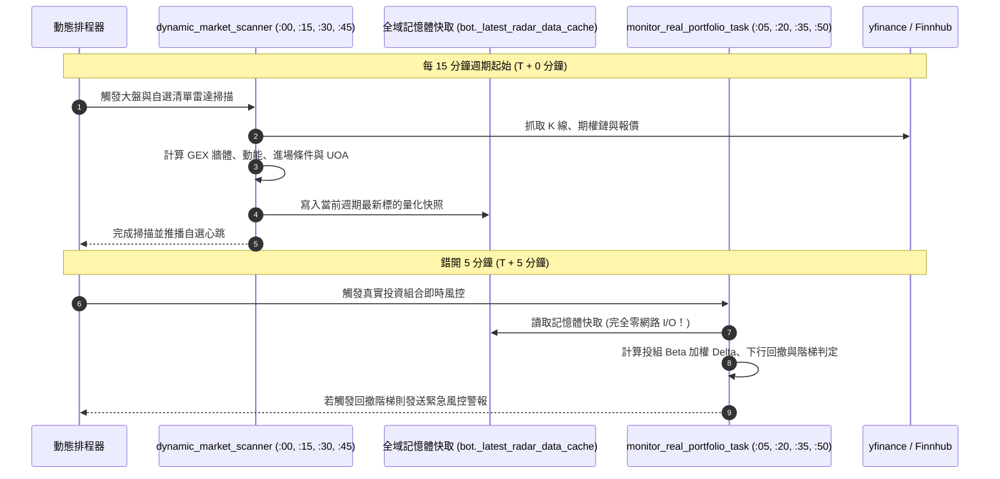
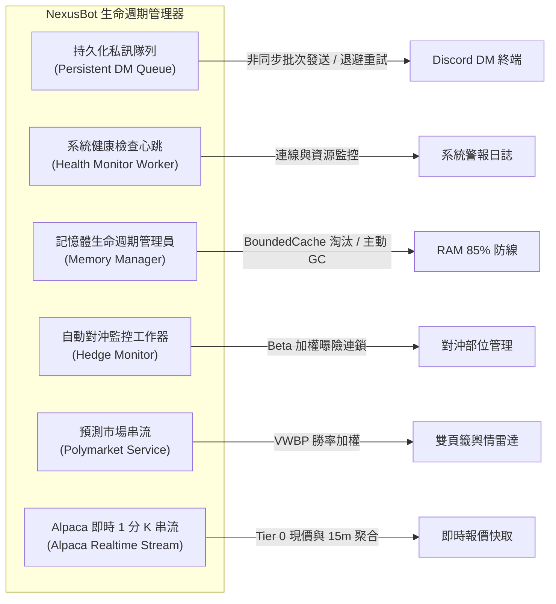

# 背景排程與系統自動化管線規格書

## 1. 系統架構與設計哲學

Nexus Seeker 作為 24/7 全年無休運行的 Discord 美股期權量化風控系統，核心依賴精確協同的背景自動化管線。在極度受限的雲端 VPS（1GB–2GB RAM）環境下，為確保系統穩定性並徹底杜絕外部 API 限速與資料庫爭用，背景任務遵循以下核心設計原則：

1. **Leader 實例隔離（Leader-Only Execution）**：
   在藍綠部署（Blue-Green Deployment）或多容器環境中，同一份 SQLite 資料庫可能會被新舊兩個容器同時掛載。所有涉及定時推播、外部市場資料抓取與歷史資料回填的排程任務，均嚴格透過 `bot._is_leader_instance is True` 守衛保護。非 Leader 實例僅維持唯讀閘道與互動監聽，絕不觸發背景任務，杜絕重複推播與網路資源浪費。
2. **低記憶體 VPS 熔斷守衛（`is_memory_safe()` 85% RAM Gate）**：
   重型計算排程（如 `regime_outcome_labeler`、`pre_market_risk_monitor`、LLM 分析師報告）在執行任何高負載邏輯前，必須先呼叫 `is_memory_safe()` 判定當前主機實體記憶體水位。若記憶體佔用率超過 85%，任務立即記錄警告並主動跳過或執行降級回退，防止引發 Linux OOM Killer 導致 Bot 程序終止。
3. **統一美東時區規範（US/Eastern Timezone Standard）**：
   美股市場運作嚴格依循美東時區。全系統所有定時任務一律以 `US/Eastern` 為基準時區，自動處理夏令時間（EDT, UTC-4）與冬令時間（EST, UTC-5）切換。非交易日（週末與美股休市日）自動跳過盤中排程。
4. **共享記憶體錯開調度（Staggered Cache-Aside Pattern）**：
   盤中監控任務透過時間交錯（Staggering）避免併發高峰。例如投組風控排程精確落後於大盤掃描排程 5 分鐘，直接消費後者產出之記憶體快取，實現「零額外 API 請求」的即時投組風控。

---

## 2. 24 小時全景排程時間軸矩陣

系統每日排程依照市場時鐘嚴格編排，涵蓋深夜維護、盤前預熱、盤中監控與盤後結算四大階段：

| 時間 (美東 ET) | 任務識別名稱 | 核心模組與入口 | 執行頻率與條件 | 核心職責與下游影響 |
| :--- | :--- | :--- | :--- | :--- |
| **03:00** | `kv_cache_dedup_purge` 等離峰維護 | `cogs/trading/scheduler.py` | 每日離峰（非交易日亦執行） | 1. 刪除 `kv_cache` 逾 3 日單日去重標記； 2. 清理 `uoa_history` 逾 10 交易日異常大單； 3. 歸檔過期持倉與委託； 4. 清理 `sentiment_history`（60 日）與 `sentiment_daily_canonical`（260 日）； 5. 執行 SQLite WAL Checkpoint 與 `PRAGMA optimize`。 |
| **03:30** | `regime_outcome_labeler` | `services/regime_outcome_labeler.py` | 每日盤前（Leader-Only，85% RAM 守衛） | 1. 為 `regime_evaluation_log` 滿 5 交易日的紀錄抓取歷史 K 線回填前向報酬標籤； 2. 執行 `run_dispatch_outcome_labeling` 為滿 20/60 交易日的可行動通知計算「照做 vs 持有」反事實報酬。 |
| **08:00** | `fundamental_filing_scan` | `cogs/trading/fundamental_filing_monitor.py` | 僅美股交易日 | 針對持倉標的掃描最新 SEC 10-K / 10-Q / 8-K 申報，以 `fundamental_scan_state` 游標去重，驅動動態轉倉情境 1。 |
| **08:30** | `daily_reddit_update` | `cogs/trading/scheduler.py` | 每日開盤前 | 抓取 Reddit 財經子版輿情貼文，更新社群情緒指標與邊界熱度。 |
| **08:45** | `pre_market_risk_monitor` | `cogs/trading/pre_market.py` | 僅美股交易日（開盤前 45 分） | 1. 錯開預熱：量化指標、IV 位階、最大痛點、Gamma 擠壓指標； 2. 補償前一日若遺漏之情緒歷史快照； 3. 預熱每位使用者的投組模擬年化日報酬率序列。 |
| **09:00** | `pre_market_loop` | `cogs/analyst_agent.py` | 僅美股交易日（開盤前 30 分） | Analyst Agent 盤前速報：整合前日盤後與當晨最新宏觀數據、財報評估與盤前波動預期。 |
| **09:30–16:00** *(:00, :15, :30, :45)* | `dynamic_market_scanner` | `cogs/trading/heartbeat.py` | 盤中每 15 分鐘 | 自選標的 15 分鐘動態雷達心跳：評估 GEX 牆體、相對強弱、動能向量與右側/左側/做空進場條件，寫入 `uoa_history` 並更新 `bot._latest_radar_data_cache`。 |
| **09:30–16:00** *(:00, :15, :30, :45)* | `price_volume_alert_monitor` | `cogs/trading/price_volume_alert_monitor.py` | 盤中每 15 分鐘 | 15 分鐘個股價量突破警報：`Semaphore(3)` 併發控制，比對放量與均線突破；支援 Alpaca 串流影子比對。 |
| **09:30–16:00** *(:05, :20, :35, :50)* | `monitor_real_portfolio_task` | `cogs/trading/portfolio_monitor.py` | 盤中每 15 分鐘（精確錯開 5 分） | 真實投組風控監控：直接消費 5 分鐘前大盤掃描之記憶體快取，零外部請求評估投組 Greeks、下行回撤階梯（10%/15%/20%）與重新武裝狀態。 |
| **09:30–16:00** *(每 30 分鐘)* | `IntradayScanPipeline` | `market_analysis/intraday_pipeline/pipeline.py` | 盤中每 30 分鐘 | 「標的分析中心 2.0」深度自選心跳：評估 Gamma 擠壓、成交量分佈（Volume Profile / POC）與主力期權流，與 15 分鐘心跳路徑完全隔離。 |
| **24/7 每 30 分鐘** | `wti_oil_monitor` | `cogs/trading/wti_monitor.py` | 全天候（00:00–06:00 靜默） | 監控 WTI 原油期貨異動與板塊衝擊矩陣，於異動超過門檻時發送即時推播。 |
| **每 4 小時** | `event_checker` | `cogs/calendar.py` | 全天候 | 檢查即將發布之宏觀經濟指標（CPI/PPI/FOMC）與財報日曆，定期更新 CME FedWatch 利率決策機率。 |
| **16:15** | `dynamic_after_market_report` | `cogs/trading/after_market.py` | 僅美股交易日（收盤後 15 分） | 1. 收盤日常維護； 2. 寫入當日 `sentiment_daily_canonical` 快照； 3. 重建日報酬序列並寫入 `portfolio_nav_daily`； 4. 精算 VaR/CVaR 預算消耗與尾部體制轉換判定； 5. 總經訊號乾跑記錄：抓取 FRED 與市場資料、計算 9 個候選指標與三態判定，寫入 `macro_signal_log`／`macro_regime_log`（**只記錄、不推播**，`ENABLE_MACRO_SIGNAL_LOG`）。 |
| **收盤後** | `post_market_loop` | `cogs/analyst_agent.py` | 僅美股交易日 | Analyst Agent 盤後報告：產出全日市場總結、板塊強弱、異常期權金流匯總與隔夜策略展望。 |
| **週五 17:05** | `weekly_vtr_report_task` | `cogs/trading/scheduler.py` | 週五盤後 | 虛擬交易室（VTR）週度結算：總結每週模擬與實盤投資組合表現、對沖績效 Brinson 歸因與勝率統計。 |

---

## 3. 交易時段併發控制與錯開快取架構

在美股 09:30 至 16:00 的常規交易時段中，每 15 分鐘與每 30 分鐘的密集排程如果同時向市場發動請求，將引發 API 頻寬暴增與 VPS CPU 峰值。系統透過以下兩大架構化解爭用：

### 3.1 錯開 5 分鐘共享快取機制（Staggered 5-Minute Offset）

1. **零成本複用**：投資組合風控需要的現價、Delta 與波動率指標，95% 以上與大盤動態掃描標的重疊。錯開 5 分鐘確保大盤快照已精確寫入 `bot._latest_radar_data_cache`，投組風控直接記憶體命中，避免重複拉取期權鏈。
2. **平滑 CPU 負載**：將密集計算時間點由單一峰值分散為兩段相隔 5 分鐘的小峰值，防止 VPS 負載超過 1.0 觸發 Discord 閘道心跳逾時。

### 3.2 雙自選標的心跳管線完全隔離

系統內存在兩條平行的自選心跳推播管線，彼此在資料源、計算模組、執行週期與頻道設定上完全獨立，詳見 [`01_dual_watchlist_pipelines.md`](../architecture/01_dual_watchlist_pipelines.md)：

- **15 分鐘動態雷達心跳**（`dynamic_market_scanner`）：專注於技術結構、右側突破、左側超跌接刀與做空進場條件；推播至 `/notif_settings` 的「動態雷達心跳」頻道。
- **30 分鐘標的分析中心 2.0 深度心跳**（`IntradayScanPipeline`）：專注於 Gamma 擠壓、量價分佈（Volume Profile / DP-POC）與做市商拓撲深潛；推播至「標的分析中心 2.0」專屬頻道。

---

## 4. 常駐背景守護行程（Persistent Daemon Workers）

除了定時 Cron 排程外，`bot.py` 的生命週期中管理著 6 大常駐背景守護 Worker，隨 Bot 啟動建立並於關機時優雅關閉（Graceful Shutdown）：

1. **持久化私訊隊列工作器（Persistent DM Queue Worker）**：
   - 負責全系統向用戶派送 Discord DM 的單一窗口。支援程式碼區塊友善的 2000 字元自動分段、Discord API 429 速率限制指數退避與訊息持久化重試，詳見 [`05_embed_architecture_and_dm_queue.md`](05_embed_architecture_and_dm_queue.md)。
2. **系統健康檢查心跳工作器（Health Worker）**：
   - 每 60 秒檢查一次系統健康狀態，監控 WebSocket 連線延遲、資料庫連線池健康度與背景 Task 存活狀況。
3. **記憶體生命週期管理員（Memory Manager）**：
   - 監控全域記憶體消耗，定期觸發 Python 記憶體垃圾回收（`gc.collect()`），管理 `BoundedCache` 的 LRU 淘汰清理，確保長期運行無記憶體洩漏。
4. **自動對沖監控工作器（Hedge Monitor）**：
   - 追蹤組合淨 Delta 曝險與對沖工具（如 SPY Put、反向 ETF），在對沖條件滿足時進行動態調整與收益歸因計算。
5. **Polymarket 預測市場服務（Polymarket Service）**：
   - 追蹤宏觀與地緣政治重大預測合約之成交量加權勝率（VWBP），向市場情報雷達提供情緒共振數據，詳見 [`04_polymarket_vwbp_sentiment_radar.md`](../macro_sentiment/04_polymarket_vwbp_sentiment_radar.md)。
6. **Alpaca 即時 1 分 K 串流工作器（Alpaca Realtime Stream Worker）**：
   - 僅在 Leader 實例運行且具備金鑰時啟用。提供 Tier 0 秒級報價以取代部分盤中 REST 輪詢，並聚合 15 分 K 提供價量警報影子比對，詳見 [`07_alpaca_realtime_stream.md`](07_alpaca_realtime_stream.md)。

---

## 5. 邊界防衛、資源控管與自癒修復規範

### 5.1 資料庫單一寫入者與離峰 Checkpoint
全系統所有背景排程產生的寫入操作，必須一律排入 `nexus-db-writer` 佇列進行序列化寫入（詳見 [`04_engineering_standards.md`](../architecture/04_engineering_standards.md)）。每日 03:00 ET 離峰維護排程呼叫 `run_maintenance()` 執行 WAL Checkpoint 與 `PRAGMA optimize`，主動壓縮資料庫實體體積並重建查詢最佳化統計資料。

### 5.2 資料保留期策略（Retention Policy）
為維持 SQLite 資料庫在輕量 VPS 上的極致查詢速度，離峰清理排程落實嚴格的生命週期管理：
- **`kv_cache` 防重複鍵**：白名單前綴（如 `alert_daily_dedup_`）保留 3 個交易日後自動清除，永久設定快取絕不觸碰。
- **`uoa_history` 異常金流**：保留 10 個交易日，過期紀錄自動清空以防全表掃描效能劣化。
- **`sentiment_history` / `canonical`**：原始情緒歷史保留 60 交易日；每日正規快照 `sentiment_daily_canonical` 保留 260 交易日（約 1 個完整交易年）。
- **`regime_evaluation_log`**：前向標註完成後，依保留期設定自動歸檔修剪。

### 5.3 跨程序藍綠部署防死鎖協同
藍綠部署過程中，新舊兩個容器會同時存在 1–3 分鐘：
- 寫入端以 `database/connection.py` 內建的指數退避重試（Jittered Backoff）解決跨程序 WAL 寫入鎖爭用。
- 排程端依靠 Leader 判定，確保背景任務由舊容器安全交接至新容器，不產生雙重執行。

---

## 6. 核心程式碼檔案路徑關聯

| 排程名稱 / 功能模組 | 原始程式碼檔案路徑 | 關聯技術規格書 |
| :--- | :--- | :--- |
| 交易排程器與週報任務 | `nexus_core/cogs/trading/scheduler.py` | [`01_dual_watchlist_pipelines.md`](../architecture/01_dual_watchlist_pipelines.md) |
| 15 分鐘動態雷達心跳發送 | `nexus_core/cogs/trading/heartbeat.py` | [`01_dual_watchlist_pipelines.md`](../architecture/01_dual_watchlist_pipelines.md) |
| WTI 原油全天候監控循環 | `nexus_core/cogs/trading/wti_monitor.py` | [`03_wti_crude_oil_monitor.md`](../macro_sentiment/03_wti_crude_oil_monitor.md) |
| 15 分鐘價量突破警報循環 | `nexus_core/cogs/trading/price_volume_alert_monitor.py` | [`06_price_volume_alert_system.md`](06_price_volume_alert_system.md) |
| 每日自動 SEC 財報掃描排程 | `nexus_core/cogs/trading/fundamental_filing_monitor.py` | [`02_sec_filing_moat_scanner.md`](../macro_sentiment/02_sec_filing_moat_scanner.md) |
| 前向報酬標註與反事實標註 | `nexus_core/services/regime_outcome_labeler.py` | [`05_calibration_harness_and_forward_collection.md`](../architecture/05_calibration_harness_and_forward_collection.md) |
| 盤前盤後分析師代理人循環 | `nexus_core/cogs/analyst_agent.py` | [`01_analyst_agent_reporting.md`](01_analyst_agent_reporting.md) |
| 財經事件日曆與 FedWatch 循環 | `nexus_core/cogs/calendar.py` | [`04_calendar_translation_engine.md`](04_calendar_translation_engine.md) |
| 投組下行風險評估與收盤結算 | `nexus_core/services/downside_risk_service.py` | [`07_downside_risk_sortino_var_cvar.md`](../risk_portfolio/07_downside_risk_sortino_var_cvar.md) |
| 總經訊號乾跑記錄（只記錄、不推播） | `nexus_core/services/macro_signal_service.py` | [`05_calibration_harness_and_forward_collection.md`](../architecture/05_calibration_harness_and_forward_collection.md) |
| 盤中 30 分鐘深度掃描管線 | `nexus_core/market_analysis/intraday_pipeline/pipeline.py` | [`06_gamma_squeeze_engine_and_spear.md`](../microstructure/06_gamma_squeeze_engine_and_spear.md) |
| Alpaca 即時 1 分 K 串流服務 | `nexus_core/services/alpaca_stream_service.py` | [`07_alpaca_realtime_stream.md`](07_alpaca_realtime_stream.md) |
| Bot 生命週期與常駐 Worker 管理 | `nexus_core/bot.py` | [`05_embed_architecture_and_dm_queue.md`](05_embed_architecture_and_dm_queue.md) |
| 資料庫單一寫入者與維護入口 | `nexus_core/database/connection.py` | [`04_engineering_standards.md`](../architecture/04_engineering_standards.md) |
