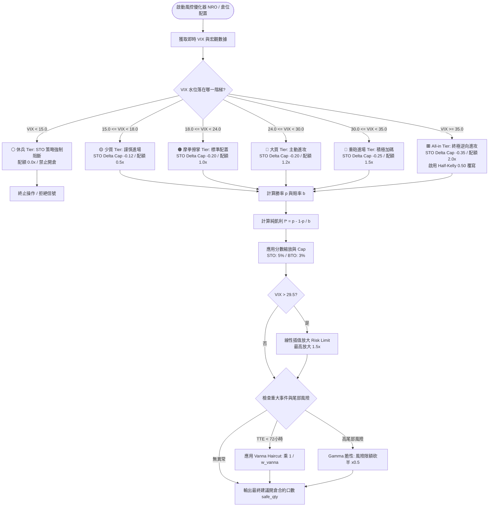
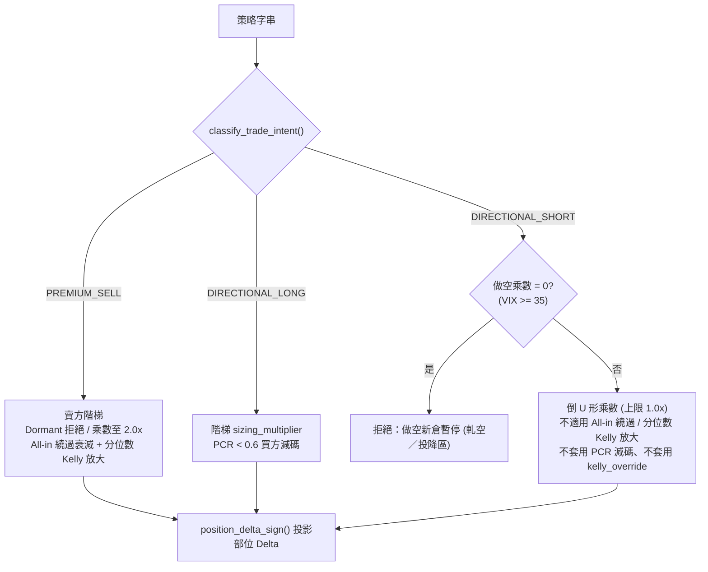

# VIX 戰情階梯 6 階矩陣與動態分數凱利資金配置公式 (VIX Battle Ladder & Dynamic Fractional Kelly Criterion)

## 1. 核心哲學與適用市場環境

### 1.1 逆向流動性定價哲學
在量化期權交易中，最常見的致命錯誤是「在市場平靜時重倉賣期權，在市場暴跌恐慌時停損砍倉」。
- 當市場平靜時（VIX < 15），隱含波動率被壓縮至極致，期權權利金極度廉價。此時賣出賣權（Put）宛如在壓路機前撿一分錢，一旦黑天鵝降臨，微薄的利潤將在瞬間被非線性虧損吞噬；
- 反之，當市場遭遇系統性拋售（VIX 飆升至 25、30 甚至 35 以上），隱含波動率極度超買，市場瀰漫著非理性的恐慌溢價。此時期權賣方收取的權利金具備深厚的安全墊，是長期期望值最高、勝率賠率俱佳的黃金進攻窗口。

Nexus Seeker 將此逆向哲學規格化為 **VIX 戰情階梯（VIX Battle Ladder）**：由低至高劃分為 6 大戰情等級。**VIX 越低，系統越約束賣方行為；VIX 越高，系統越主動放大進攻資金配額**。

### 1.2 分數凱利公式 (Fractional Kelly Criterion) 的資金生存底線
約翰·凱利（John L. Kelly）於 1956 年提出的純凱利公式，旨在最大化長期資產組合的幾何平均增長率。然而，純凱利公式假設交易者具備無限資本且能承受極端的短期回撤（例如 80% 本金回撤）。在真實金融市場中，過度激進的純凱利下注將在遭遇連輸時引發破產或心理崩潰。

因此，系統嚴格採取**分數凱利（Fractional Kelly）體系**：
- 默認採用 **四分之一凱利（Quarter-Kelly, 0.25x）** 至 **半凱利（Half-Kelly, 0.50x）** 縮放；
- 對單筆交易設立物理硬上限（賣方策略最高 5%，買方策略最高 3%）；
- 結合 VIX 歷史分位數進行動態插值，在宏觀極端恐慌時，才謹慎調升至半凱利。

### 1.3 賣方 vs 方向性做空：同一個 VIX，相反的前提
上述逆向哲學**只對「賣出權利金」成立**：高 VIX 等於高權利金溢價，是賣方的安全墊。對**方向性做空**（Long Put、Bear Call Spread、空頭現貨、`SHORT_SIDE`／Regime V）而言，前提正好相反——VIX $\ge 35$ 的恐慌區是投降賣壓出清、政策干預與暴力軋空最密集的時點，追空在此給出最大侵略性等於在最容易被軋的位置加碼。

### 1.4 使用者風險偏好的組合層級旋鈕 (`RiskAppetite`)

上述 VIX 戰情階梯與凱利先驗是**盤中即時**的單筆倉位風控，回答「這一筆現在能下多大」。`RiskAppetite`（`DEFENSIVE`／`AGGRESSIVE`）是正交的另一個旋鈕，回答「動態轉倉引擎整體要多快減碼、多快轉倉、多敢部署」，作用在 TP1 執行比例、機會成本轉倉 EV 門檻、核心資金部署比例與衛星預算上限四個組合層級參數上，兩者不互相覆寫。

`DEFENSIVE` 為現行、已上線的預設行為，未選擇的使用者一律沿用，零行為變化；`AGGRESSIVE` 的數值全部來自 [`04_dynamic_rollover_state_machine.md`](../strategies/04_dynamic_rollover_state_machine.md) §2.10 的 2025 回測動能進攻型模式（採用當時依據為早期引擎版本「報酬／MDD／Sharpe 三項皆優於 Defensive」）。⚠️ 2026-09-23 以現行程式碼與 **Sortino 為主**的判準重跑，Defensive（1.45）優於 Aggressive（1.13），此前提已不成立；是否調整屬人工決策，參數尚未變更。詳細數值見 §4.4 與 [`07_downside_risk_sortino_var_cvar.md`](07_downside_risk_sortino_var_cvar.md)。

因此系統以**交易意圖**（`classify_trade_intent()`）分流，而不是以 `"STO"`／`"BTO"` 字串分流：

| 交易意圖 | 範例 | VIX 乘數 | 凱利勝率先驗 |
| :--- | :--- | :--- | :--- |
| `PREMIUM_SELL` | `STO_PUT`、`STO_CALL`、Covered Call、CSP、Short Put、Bull Put | 階梯 `sizing_multiplier`（單調遞增至 $2.0$） | 賣方 Delta 映射 (§2.2) |
| `DIRECTIONAL_LONG` | `BTO_CALL`、Buy Shares、Bull Call Spread | 階梯 `sizing_multiplier` | `LONG` 先驗表 |
| `DIRECTIONAL_SHORT` | `BTO_PUT`、Long Put、Bear Call／Put Spread、`SHORT_SIDE`、`OPEN_SHORT` | **倒 U 形** `short_sizing_multiplier`（上限 $1.0$） | `SHORT` 先驗表（結構性不高於 `LONG`） |

做空係數與先驗**刻意不是機械翻轉**——把倍率取負或把先驗反轉，只是用一個未經驗證的假設取代另一個。校準前一律取保守值，由 [`05_calibration_harness_and_forward_collection.md`](../architecture/05_calibration_harness_and_forward_collection.md) 的工具產出建議、人工審核後以 PR 修改。

---

## 2. 數學模型與量化推導

### 2.1 凱利公式推導 (Capital Growth Maximization)
設單筆交易的資金下注比例為 $f$。當獲勝時，淨賠率為 $b$（每下注 1 單位淨賺 $b$ 單位）；失敗時損失全部下注額 1 單位。設獲勝概率為 $p$，失敗概率為 $q = 1 - p$。
經過 $N$ 次交易後，投資組合的總資產增長率期望值為：
$$G(f) = \mathbb{E}[\ln(W_N / W_0)] = p \ln(1 + b f) + (1 - p) \ln(1 - f)$$

為了求解最佳資金下注比例 $f^*$，對 $f$ 進行一階求導並令導數為零：
$$\frac{d G}{d f} = \frac{p \cdot b}{1 + b f} - \frac{1 - p}{1 - f} = 0$$
$$p \cdot b (1 - f) = (1 - p)(1 + b f)$$
$$p b - p b f = 1 + b f - p - p b f$$
$$p b - 1 + p = b f \implies f^* = \frac{p b - (1 - p)}{b} = p - \frac{1 - p}{b}$$

### 2.2 期權交易的勝率 ($p$) 與賠率 ($b$) 映射模型
選擇權具備非線性的合約特徵，系統依據 BSM 定價 Greeks 與預期波幅進行精確映射：

#### 1. 賣方策略 (STO_PUT / STO_CALL)
- **勝率映射**：賣方的主要獲利來源是期權歸零失效，其到期處於價外的理論概率由 Delta 近似：
  $$p_{\text{STO}} = 1.0 - |\Delta_{\text{BSM}}|$$
- **賠率映射**：收益為收取的權利金（Bid），承擔的最大保證金風險為 $\text{Margin Required}$：
  $$b_{\text{STO}} = \frac{\text{Bid}}{\text{Margin Required}}$$

#### 2. 買方策略 (BTO_CALL / BTO_PUT)
- **勝率映射**：買方期權在到期日具備內含價值的概率由 Delta 定義：
  $$p_{\text{BTO}} = |\Delta_{\text{BSM}}|$$
- **賠率映射**：潛在期望收益由 7 天預期波幅（Expected Move）扣除買入權利金（Ask）決定：
  $$\text{Potential Profit} = \max(0, \text{Expected Move} - \text{Ask})$$
  $$b_{\text{BTO}} = \frac{\text{Potential Profit}}{\text{Ask}}$$

### 2.3 分數凱利縮放與物理倉位上限
由核心函式 `kelly_position_fraction()` 實現縮放與截斷：
$$f_{\text{allocated}} = \max\Big(0.0, \; \min\big(f^* \times \text{kelly\_scale}, \; \text{Cap}\big)\Big)$$
- 若 $b \le 0$ 或 $f^* \le 0$：期望值為負，強制 $f_{\text{allocated}} = 0.0$；
- **賣方倉位天花板**：$\text{Cap}_{\text{STO}} = 0.05$（單筆最高不超過總資金 5%）；
- **買方倉位天花板**：$\text{Cap}_{\text{BTO}} = 0.03$（單筆最高不超過總資金 3%）。

### 2.4 VIX 歷史分位數動態線性插值模型
系統採樣 VIX 歷史 10 年分佈，設定第 90 百分位上限：
$$\text{VIX}_{\text{upper\_10}} = 29.5, \quad \text{VIX}_{\text{ceiling}} = 45.0$$

當市場 VIX 突破 29.5 時，系統啟動動態 Kelly 縮放，在 29.5 至 45.0 之間對帳戶風險額度進行線性插值放大：
$$t = \min\left( \frac{\text{VIX} - 29.5}{45.0 - 29.5}, \; 1.0 \right)$$
$$\text{Kelly Scale Factor} = 1.0 + 0.5 t \quad (\in [1.0, 1.5])$$
$$\text{Effective Risk Limit} \leftarrow \text{Current Risk Limit} \times \text{Kelly Scale Factor}$$

### 2.5 日曆 Vanna 與尾部風險折價 (Calendar Vanna & Tail Risk Haircuts)
1. **日曆事件 Vanna 折價**：
   若標的距離重大事件（如財報、FDA 開牌）小於 72 小時：
   $$w_{\text{vanna}} = 1.5 + \max\left(0, \frac{72.0 - \text{TTE}}{72.0}\right)$$
   $$\text{Current Risk Limit} \leftarrow \text{Current Risk Limit} \times \left(\frac{1}{w_{\text{vanna}}}\right)$$
2. **高尾部風險 Gamma 脆性折價**：
   若標的微觀結構顯示正 Gamma 枯竭（$\text{is\_high\_tail\_risk} == \text{True}$），風險限額直接砍半：
   $$\text{Current Risk Limit} \leftarrow \text{Current Risk Limit} \times 0.50$$

### 2.6 方向性做空的倒 U 形 VIX 乘數
$$m_{\text{VIX}}^{\text{short}}(\text{VIX}) = \begin{cases}
0.50 & \text{VIX} < 15\\
0.75 & 15 \le \text{VIX} < 18\\
1.00 & 18 \le \text{VIX} < 30\\
0.50 & 30 \le \text{VIX} < 35\\
0.00 & \text{VIX} \ge 35 \quad \text{（禁止新開空單）}\\
0.50 & \text{VIX 未知}
\end{cases}$$

VIX 未知時刻意**不**沿用 `get_vix_tier(None)` 的 Ready（$1.0$）：那個預設是為了「資料遺失時不要硬拒所有賣方訊號」，對做空而言，資料抓取失敗絕不能是最寬鬆的情況。

### 2.7 方向感知的凱利勝率先驗
`ExecutionRouter` 與做空倉位 (`short_entry_sizing.py`) 共用單一先驗表 `kelly_priors.py`：

$$p_{\text{LONG}}(\text{RSI}) = \begin{cases} 0.55 & \text{RSI} < 50\\ 0.45 & \text{RSI} \ge 50 \end{cases}, \qquad
p_{\text{SHORT}}(\text{RSI}) = \min\Big(\begin{cases} 0.45 & \text{RSI} < 50\\ 0.40 & \text{RSI} \ge 50 \end{cases},\ p_{\text{LONG}}(\text{RSI})\Big)$$

$$f = \text{clip}\Big(0.5 \times \big(p - \tfrac{1-p}{1.8}\big),\ 0,\ \text{Cap}_{\text{side}}\Big), \qquad \text{Cap}_{\text{LONG}} = 0.15,\ \text{Cap}_{\text{SHORT}} = 0.10$$

外層 $\min$ 是**結構性夾制**：即使日後誤改表，做空先驗也不會比做多激進。RSI 缺失時取該方向所有桶的最小值。多頭路徑與改動前位元一致（`RSI < 50 ⇒ 0.55`，賠率 $1.8$，Half-Kelly，封頂 $15\%$）。

### 2.8 候選交易的部位 Delta 投影乘數
NRO 以帶號合約 Delta 投影新部位對組合 Delta 的影響，乘數回答「**買進還是賣出該工具**」，不是「方向看多還是看空」：

$$\Delta_{\text{position}} = \Delta_{\text{contract}} \times s, \qquad s = \begin{cases} -1 & \text{賣出 (STO／Short Put／Bear Call／CSP／空頭現貨)}\\ +1 & \text{買進 (BTO_CALL／BTO_PUT／Long Put／現貨)} \end{cases}$$

買進 Put 的 $\Delta_{\text{contract}} < 0$ 已表達空頭，$s = +1$；若以「是否為空頭意圖」當乘數，會得到 $-0.5 \times -1 = +0.5$，把買進的 Put 當成增加多頭 Delta。

---

## 3. 決策邏輯與狀態機 / 流程圖



交易意圖分流（`optimize_position_risk` / `analyze_symbol` / Stage 1 Macro / VTR 共用同一個分類）：



---

## 4. 關鍵具名常數與物理約束

### 4.1 VIX 戰情階梯 6 階矩陣 (`VIX_LADDER_CONFIG`)

| 階梯名稱 (Tier) | VIX 區間 $[V_{\min}, V_{\max})$ | 訊號許可 (`allow_signal`) | STO Delta 上限 (`sto_delta_cap`) | 倉位乘數 (`sizing_multiplier`) | 做空倉位乘數 (`short_sizing_multiplier`) | 凱利覆寫 (`kelly_fraction_override`) | VTR 許可 | 狀態視覺 |
|---|---|---|---|---|---|---|---|---|
| **休兵 (Dormant)** | $[0.0, 15.0)$ | `False` | $0.00$ | $0.0\times$ | $0.50\times$ | `None` | `False`（做空依乘數 $> 0$） | ⚪ 灰色 |
| **少買 (Caution)** | $[15.0, 18.0)$ | `True` | $-0.12$ | $0.5\times$ | $0.75\times$ | `None` | `True` | 🟡 金黃 |
| **摩拳擦掌 (Ready)** | $[18.0, 24.0)$ | `True` | $-0.20$ | $1.0\times$ | $1.00\times$ | `None` | `True` | 🟠 橙色 |
| **大買 (Aggressive)** | $[24.0, 30.0)$ | `True` | $-0.20$ | $1.2\times$ | $1.00\times$ | `None` | `True` | 🔴 紅色 |
| **重砲進場 (Heavy)** | $[30.0, 35.0)$ | `True` | $-0.25$ | $1.5\times$ | $0.50\times$ | `None` | `True` | 🔴 深紅 |
| **All-in (Extreme)** | $[35.0, 999.0)$ | `True` | $-0.35$ | $2.0\times$ | $0.00\times$（禁止新空單） | $0.50$ (Half-Kelly，做空不適用) | `True`（做空禁止） | 🟥 暗紅 |

### 4.2 歷史分位數與風控參數 (`VIX_QUANTILE_BOUNDS`)

| 常數名稱 | 數值 / 設定 | 物理約束與代碼功能 | 核心程式碼路徑 |
|---|---|---|---|
| `upper_10` | `29.5` | VIX 歷史第 90 百分位，動態 Kelly 插值觸發起點 | `nexus_core/config.py` |
| `vix_ceiling` | `45.0` | 動態 Kelly 線性插值天花板，防止無窮外推 | `nexus_core/market_analysis/risk_engine.py` |
| `sto_kelly_cap` | `0.05` ($5.0\%$) | 單筆賣方交易佔總資本之凱利物理硬上限 | `nexus_core/market_analysis/strategy/liquidity_risk.py` |
| `bto_kelly_cap` | `0.03` ($3.0\%$) | 單筆買方交易佔總資本之凱利物理硬上限 | `nexus_core/market_analysis/strategy/liquidity_risk.py` |
| `event_tte_limit` | `72.0` 小時 | 觸發日曆 Vanna 隱含 Delta 折價的時間窗口 | `nexus_core/market_analysis/risk_engine.py` |
| `SHORT_VIX_UNKNOWN_MULTIPLIER` | `0.5` | VIX 未知時的做空乘數（不沿用 Ready 的 1.0） | `nexus_core/config.py` |

### 4.3 凱利勝率先驗表 (`KELLY_WIN_RATE_PRIORS`，`KELLY_PRIOR_STATUS = "PRE_CALIBRATION"`)

| 方向 | RSI $< 50$ | RSI $\ge 50$ | 賠率 `KELLY_PRIOR_ODDS` | 縮放 `KELLY_PRIOR_SCALE` | 上限 `KELLY_PRIOR_CAP` | 程式碼路徑 |
|---|---|---|---|---|---|---|
| `LONG` | $0.55$ | $0.45$ | $1.8$ | $0.5$ | $0.15$ | `nexus_core/market_analysis/kelly_priors.py` |
| `SHORT` | $0.45$ | $0.40$ | $1.8$ | $0.5$ | $0.10$ | `nexus_core/market_analysis/kelly_priors.py` |

### 4.4 使用者風險偏好查表 (`RiskAppetite` / `RiskProfile`)

| 欄位 (`RiskProfile`) | `DEFENSIVE`（預設） | `AGGRESSIVE` | 消費端 |
|---|---|---|---|
| `tp1_ratio` | $0.50$（現行行為） | $0.30$ | `anti_washout.py::_evaluate_microstructure_tp_ladder` TP1 執行比例 |
| `ev_hurdle` | $0.05$（`_EV_SPREAD_MIN_THRESHOLD`，現行行為） | $0.02$ | `opportunity_cost.py` 機會成本轉倉 EV Spread 門檻基礎分量 |
| `rotation_cooldown_days` | $5$ | $3$ | 保留欄位，供既有輪動冷卻邏輯串接 |
| `core_deploy_ratio` | $0.50$（現行行為） | $0.80$ | `core_deployment.py::evaluate_core_deployment` 機會分支部署比例 |
| `max_satellite_budget_pct` | $0.15$ | $0.25$ | `pyramid_add.py` 條件七單筆衛星預算上限 |

$\text{resolve\_risk\_profile}(\text{appetite})$ 對未知值或 `None` 一律 fail-safe 回退 `DEFENSIVE`（大小寫不敏感）。三個既有消費端皆在各自函式入口**解析一次後往下傳**，不在熱路徑迴圈內對每筆持倉重複查表。

⚠️ `ev_hurdle` 的 `DEFENSIVE` 值刻意**不是** $\_EV\_SPREAD\_MIN\_THRESHOLD + \_ESTIMATED\_ROUND\_TRIP\_COST\_PCT$（即不含 §2.2 情境二的 $0.3\%$ 往返成本）——`opportunity_cost.py` 對近價期權合約會以實際 Bid-Ask 點差動態放大摩擦成本，若把往返成本併入本欄位的靜態基礎值，會蓋掉那個已驗證的動態機制、失去自動放大效果。

---

## 5. 邊界條件、風控熔斷與例外處理

### 5.1 VIX < 15.0 休兵狀態一票否決 (Dormant Tier Lockout)
當 VIX 低於 15.0 時，市場波動率過低。若有交易員嘗試執行 STO 賣方建倉，`risk_engine.py:275` 設置絕對熔斷：
```python
if macro_data.vix < 15.0 and intent == "PREMIUM_SELL":
    logger.info(f"NRO Reject: VIX {macro_data.vix:.1f} is in Dormant tier. STO entry forbidden.")
    return OptimizationResult(
        suggested_contracts=0, exposure_pct=0.0, warnings=["VIX Dormant: STO 禁用"]
    )
```
此規則直接返回 `suggested_contracts = 0`，防止在低波動死水區過早消耗保證金。

### 5.2 賠率為零或為負防護 (Zero or Negative Odds Guard)
若因為數據延遲或深度價外，期權權利金報價為零（`bid <= 0`）或潛在利潤為負，賠率 $b \le 0$。若直接套入公式將引發除以零錯誤。`risk_engine.py:229` 設置前置防護：
```python
if odds <= 0:
    return 0.0
```
保證在無實質勝率空間時，輸出倉位配額精確為零。

### 5.3 部位方向的推導：`quantity` 正負號優先，策略字串僅為候選交易的代理
NRO 倉位模型的 $\text{val\_adj\_unit\_delta}$ 需要知道一筆**尚未成交**的候選交易會帶來多頭還是空頭曝險，而候選交易還沒有 `quantity`，只有策略標籤。

早期實作在三個檔案裡各自寫了 `-1 if "STO" in strategy else 1`。該判定只涵蓋「賣出選擇權收權利金」一種空頭形式，對做空進場系統新增的路徑（`SHORT_SIDE`、`Long Put`、`Bear Call Spread`、空頭現貨）**全部誤判為多頭**，使倉位模型把一筆空單當成「增加多頭 Delta」來編列預算，`safe_qty` 因此落在風險帶的錯誤一側。

現行作法把兩個語意拆成兩個單一來源函式，理由與 `kelly_position_fraction` 相同——同一個判斷散在多處必然漂移：

- `position_delta_sign()`：投影用的 Delta 乘數（買進 $+1$／賣出 $-1$，見 §2.8）。`STO` 的比對排除 `STOCK`，否則 `LONG_STOCK` 會被誤判為賣出。
- `classify_trade_intent()`：三種交易意圖，VIX 閘門與凱利先驗的分流鍵。
- `is_short_exposure_strategy()`：淨方向布林旗標（方向性做空，或賣出 Call）。Short Put／CSP 是看多的賣方，回傳 `False`。**不可拿它當 Delta 乘數**。

⚠️ 此函式是**代理判定**，不是權威來源。已成交部位一律以 `quantity` 正負號為準。

### 5.4 VIX 戰情階梯與凱利勝率先驗的方向感知化
做空進場系統上線時，本篇兩個模型都建立在「多頭或賣出權利金」的前提上：閘門以 `"STO"`／`"BTO"` 字串為鍵（方向性做空不經過任何一道）、VIX $\ge 35$ 給追空最大侵略性、凱利先驗 `RSI < 50 ⇒ 勝率較高` 是多頭均值回歸先驗。現已逐項改為以交易意圖分流：

| 消費端 | 修正 |
| :--- | :--- |
| `optimize_position_risk` | Dormant 拒絕限 `PREMIUM_SELL`；做空改用倒 U 形乘數，$0$ 時回傳 0 口（宏觀資料缺失時同樣判定）；All-in 繞過與分位數 Kelly 放大不適用做空；PCR $< 0.6$ 減碼限 `DIRECTIONAL_LONG`（原本連 `BTO_PUT` 也被砍） |
| `strategy/analyze.py` | `vix_sizing_multiplier` 依意圖取值；`kelly_fraction_override` 不套用於做空；輸出 `trade_intent` |
| `trading_service/execution.py` Stage 1 | STO 拒絕限 `PREMIUM_SELL`；新增做空乘數 $0$ 拒絕 |
| `trading_service/vtr.py` | 做空建倉依做空乘數 $> 0$；其餘沿用 `vtr_entry_allowed` |
| `trading_service/market_scan.py` 與 VIX 狀態欄位 | 顯示意圖專屬乘數並標示「做空倉位乘數」；`0.0` 不再被 `or` 當成缺值而顯示為 $1.0$ |
| `ExecutionRouter` | `MarketCondition.side`（預設 `LONG`）查 `kelly_priors.py`；目前只發多頭訊號，行為不變 |

**校準證據**：2026-09 的離線試跑顯示做空期望值隨 VIX 單調惡化（VIX $\ge 35$ 為 $-0.30\text{R}$，區間完全在零以下），支持極端區乘數為 $0$，但不支持中段乘數 $1.0$；凱利勝率實測亦低於現行先驗。當時未修改常數，基準數據與調整準則見 [`05_calibration_harness_and_forward_collection.md`](../architecture/05_calibration_harness_and_forward_collection.md) §5.8–§5.9。

**刻意不改**：`get_macro_risk_metrics` 的 `heat_limit = 80 \times \text{sizing\_multiplier}` 是**組合層**保證金熱度上限，不是單筆倉位，對多空部位一視同仁；`hedge_monitor_service` 的階梯跳動提醒屬資訊性通知。

### 5.5 `RiskAppetite` 未設定時的逐位元不變保證

新增 `user_settings.risk_appetite` 欄位（`v076` migration，`TEXT DEFAULT 'DEFENSIVE'`，無 `CHECK` 約束）時的硬性驗收標準：**未設定或設定失敗的使用者，行為必須與改動前逐位元相同**。`resolve_risk_profile()` 讀取失敗（例如 `get_full_user_context` 例外）時三個消費端一律各自 `try/except` 回退 `resolve_risk_profile(None)` → `DEFENSIVE`，其數值與改動前的硬編碼常數完全相等，不存在「讀取失敗時退回一個新預設值」的分歧空間。`tests/unit/test_risk_appetite.py` 對三個消費端各有專屬的 `DEFENSIVE` 逐位元不變回歸測試。

### 5.6 All-in 模式的宏觀修正因子繞過 (Bypass Attenuation in All-in Mode)
在一般市場狀況下，若原油暴漲或 Skew 偏大，宏觀修正因子（$d_{\text{oil}}, d_{\text{regime}}$）會衰減風險限額。然而，當 $\text{VIX} \ge 35.0$ 時，系統判定這屬於歷史級世紀大底，此時若繼續套用原油或偏斜衰減將錯失最佳逆向建倉良機。因此 `risk_engine.py:296` 特別設計：
```python
if vix_spot is not None and vix_spot >= 35.0:
    current_risk_limit = risk_limit * d_vix  # d_vix = 2.0
    warnings.append("VIX Extreme: All-in 模式啟動")
```
直接以雙倍基準限額（$2.0\times$）繞過衰減，全力提供流動性支持。**方向性做空不適用**：做空在此區乘數為 $0$，已在前置閘門拒絕；即使日後校準放寬，也不應繞過油價與 Regime 衰減。

---

## 6. 核心程式碼檔案路徑關聯

- **VIX 戰情階梯與分位數配置**:
  - `nexus_core/config.py`: `VIX_LADDER_CONFIG`, `VIX_QUANTILE_BOUNDS`
- **凱利公式核心運算與 NRO 風險優化器**:
  - `nexus_core/market_analysis/risk_engine.py`: `kelly_position_fraction()`, `optimize_position_risk()`, `get_macro_modifiers()`
  - `nexus_core/market_analysis/risk_engine.py`: `classify_trade_intent()`、`position_delta_sign()`、`is_short_exposure_strategy()`（見 §5.3）
  - `nexus_core/config.py`: `get_short_vix_multiplier()`、`get_vix_sizing_multiplier()`、`TradeIntent`
  - `nexus_core/market_analysis/kelly_priors.py`: `get_win_rate_prior()`、先驗表（見 §4.3）
  - `nexus_core/services/execution_router.py`: `_calculate_kelly_size()`；`nexus_core/models/execution.py`: `MarketCondition.side`
  - `nexus_core/tests/unit/test_short_position_risk.py`、`test_risk_engine.py`、`test_kelly_priors.py`、`test_trade_intent_gates.py`: 意圖分類、Delta 投影、做空乘數與先驗的迴歸鎖定
- **策略層流動性與倉位分配執行**:
  - `nexus_core/market_analysis/strategy/liquidity_risk.py`: lines 234–259
- **下單路由與執行閘門**:
  - `nexus_core/services/trading_service/execution.py`: `_validate_trade_pipeline()` Stage 1
  - `nexus_core/services/trading_service/vtr.py`: `execute_vtr_auto_entry()`
  - `nexus_core/market_analysis/strategy/analyze.py`: VIX 戰情階梯閘門區段
- **使用者風險偏好參數化** (見 §1.4／§4.4／§5.5):
  - `nexus_core/database/migrations/v076_add_risk_appetite.py`: 新增 `user_settings.risk_appetite` 欄位
  - `nexus_core/market_analysis/dynamic_rollover/models.py`: `RiskAppetite(str, Enum)`
  - `nexus_core/market_analysis/dynamic_rollover/constants.py`: `RiskProfile`、`_RISK_PROFILES`、`resolve_risk_profile()`
  - `nexus_core/cogs/settings_ui.py`: `RiskAppetiteSelectView`（比照 `TradingStrategySelectView`）
  - `nexus_core/tests/unit/test_risk_appetite.py`: 查表函式、未知值回退、`DEFENSIVE` 逐位元不變、三消費端 threading 迴歸測試
