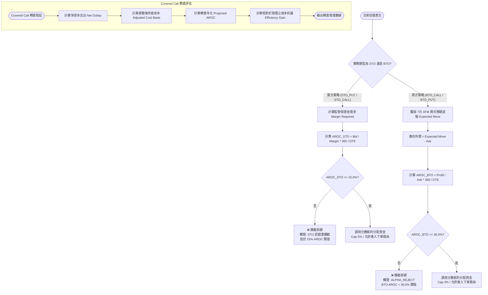

# 年化資本回報率 (AROC) 資本效率衡量與進場硬鎖閘門 (Annualized Return on Capital & Entry Hard Gates)

## 1. 核心哲學與適用市場環境

### 1.1 資本效率與機會成本的微觀哲學
在衍生性金融商品交易中，許多初學者容易被「勝率」迷惑，忽視了金融學中最嚴肅的課題——**資本回報率（Return on Capital）與時間價值（Time Value of Money）**。

例如：賣出一手行使價 \$200、到期天數為 45 天的現金擔保賣權（CSP），需要凍結約 \$20,000 美元的流動資金。若此合約僅能收取 \$60 美元的權利金：
- 雖然在統計學上該合約到期歸零的概率可能高達 90%；
- 但其資本報酬率僅為 $\frac{60}{20000} = 0.3\%$，換算年化回報率僅約 $2.43\%$，甚至遠低於美國國庫券（T-Bill）的無風險利率；
- 然而，投資人卻承擔了標的公司突發暴跌穿價的全部下行風險。

這種交易被稱為**「負資本效率陷阱」**——以巨額的資本鎖定與實質的非線性尾部風險，換取微不足道的收益。

### 1.2 AROC 作為進場一票否決硬鎖
Nexus Seeker 將 **年化資本回報率（Annualized Return on Capital, AROC）** 置於交易執行管線的最核心位置，作為所有訂單流在進入交易所前的**前置物理硬鎖**：
1. **賣方策略（STO）**：年化收益率必須顯著超越無風險利率與流動性溢價，硬性規定 $\text{AROC} \ge 15.0\%$。未達標者，系統直接拒絕下單，絕不浪費一分錢保證金；
2. **買方策略（BTO）**：買方承擔權利金全額歸零的時間耗損（Theta Decay），因此要求更高的預期年化收益補償，硬性規定 $\text{AROC} \ge 30.0\%$。

### 1.3 Covered Call 轉倉之資本效率重估
當投資組合進行正股持有並賣出買權（Covered Call）或由虧損期權部位轉倉（Roll）至正股策略時，系統以**淨資本投入（Net Capital Outlay）** 作為分母重新校準 AROC，精確衡量每一筆轉倉操作相對於直接持有現貨的「成本折讓效率增益（Capital Efficiency Gain）」。

---

## 2. 數學模型與量化推導

### 2.1 賣方策略 (STO) 保證金需求與 AROC 數學模型

#### 1. 保證金需求計算 ($\text{Margin Required}$)
根據監管機構規則與經紀商保證金物理約束：
- **現金擔保賣權 (STO_PUT)**：
  必須凍結履約價全額扣除已收取的權利金：
  $$\text{Margin}_{\text{PUT}} = \text{Strike} - \text{Bid}$$
- **備兌買權 (STO_CALL, Covered)**：
  以持有正股的實際購入成本為保證金基礎：
  $$\text{Margin}_{\text{CALL, covered}} = \text{Stock Cost}$$
- **無擔保裸買權 (STO_CALL, Naked)**：
  依據 FINRA Rule 4210 標準保證金公式，取下述兩者之最大值：
  $$\text{Margin}_{\text{CALL, naked}} = \max\Big(0.20 \times S - \max(0, K - S) + \text{Bid}, \; 0.10 \times S + \text{Bid}\Big)$$

#### 2. STO AROC 計算公式
將單筆期權在持有天數內的收益率標準化為 365 日年化百分比：
$$\text{AROC}_{\text{STO}} = \left( \frac{\text{Bid}}{\text{Margin Required}} \right) \times \left( \frac{365.0}{\max(\text{DTE}, 1)} \right) \times 100\%$$

**進場硬鎖條件**：
$$\text{Gate}_{\text{STO}} = \begin{cases} \text{PASS}, & \text{若 } \text{AROC}_{\text{STO}} \ge 15.0\% \\ \text{REJECT}, & \text{若 } \text{AROC}_{\text{STO}} < 15.0\% \end{cases}$$
未通過時觸發執行阻斷：`STO 訊號遭攔截：低於 15% AROC 閾值`。

### 2.2 買方策略 (BTO) 預期 AROC 數學模型
買方策略的資本投入為付出的權利金（$\text{Ask}$）。其收益上限並非無限，而是由造市商 1-Sigma 預期波幅（Expected Move, EM）所錨定的預期合理獲利空間決定：
$$\text{Potential Profit} = \max(0, \text{Expected Move} - \text{Ask})$$

#### BTO AROC 計算公式
$$\text{AROC}_{\text{BTO}} = \begin{cases} \left( \frac{\text{Potential Profit}}{\text{Ask}} \right) \times \left( \frac{365.0}{\max(\text{DTE}, 1)} \right) \times 100\%, & \text{若 } \text{Potential Profit} > 0 \\ 0.0\%, & \text{若 } \text{Potential Profit} \le 0 \end{cases}$$

**進場硬鎖條件**：
$$\text{Gate}_{\text{BTO}} = \begin{cases} \text{PASS}, & \text{若 } \text{AROC}_{\text{BTO}} \ge 30.0\% \\ \text{REJECT}, & \text{若 } \text{AROC}_{\text{BTO}} < 30.0\% \end{cases}$$
未通過時觸發執行阻斷：`ALPHA_REJECT: BTO AROC < 30.0% 閾值`。

### 2.3 Covered Call 轉倉資本效率增益模型
在 `pro_management.py` 中，當投資人由期權部位轉入正股＋備兌買權時，系統進行資本結構重整：

1. **淨資本支出 (Net Capital Outlay)**：
   $$\text{Net Outlay} = \text{Purchase Cost} - \text{Net Option Proceeds} - \text{CC Total Premium}$$
2. **調整後每股持有成本 (Adjusted Cost Basis)**：
   $$\text{Adjusted Basis} = \frac{\text{Net Outlay}}{\text{Lot Size}}$$
3. **轉倉預期 AROC (Projected AROC)**：
   $$\text{Projected AROC} = \begin{cases} \left( \frac{\text{CC Total Premium}}{\text{Net Outlay}} \right) \times \left( \frac{365.0}{\text{DTE}} \right) \times 100\%, & \text{若 } \text{Net Outlay} > 0 \\ 0.0\%, & \text{若 } \text{Net Outlay} \le 0 \end{cases}$$
4. **資本效率增益 (Capital Efficiency Gain)**：
   衡量相對於現有市價 $S_{\text{spot}}$ 的實質折價安全邊際：
   $$\text{Efficiency Gain} = \left( 1 - \frac{\text{Adjusted Basis}}{S_{\text{spot}}} \right) \times 100\%$$

---

## 3. 決策邏輯與狀態機 / 流程圖



---

## 4. 關鍵具名常數與物理約束

| 常數名稱 / 門檻 | 數值 / 設定 | 物理意義與代碼約束 | 核心程式碼檔案路徑 |
|---|---|---|---|
| `_AROC_STO_MIN_THRESHOLD` | $15.0\%$ | 賣方策略最小允許年化回報率，低於此值硬鎖攔截 | `nexus_core/market_analysis/strategy/liquidity_risk.py` |
| `_AROC_BTO_MIN_THRESHOLD` | $30.0\%$ | 買方策略最小允許年化回報率，低於此值硬鎖攔截 | `nexus_core/market_analysis/strategy/liquidity_risk.py` |
| `DAYS_IN_YEAR` | $365.0$ | 年化回報標準化基準天數 | `nexus_core/market_analysis/strategy/liquidity_risk.py` |
| `MIN_DTE_FLOOR` | `1` 天 | 計算分母防除以零之天數下限約束 $\max(\text{DTE}, 1)$ | `nexus_core/market_analysis/strategy/liquidity_risk.py` |
| `OPTION_SHARES_PER_CONTRACT` | `100` | 美股標準期權股數乘數 | `nexus_core/market_analysis/strategy/liquidity_risk.py` |

---

## 5. 邊界條件、風控熔斷與例外處理

### 5.1 0-DTE 到期日除以零物理防護 (Zero Division Protection)
當交易員嘗試在當日結算（0-DTE）開立期權部位時，$\text{DTE} = 0$。若直接除以 DTE 將觸發嚴重的 `ZeroDivisionError`。代碼在所有 AROC 計算中嚴格採用：
```python
365.0 / max(days_to_expiry, 1)
```
確保 0-DTE 部位以 1 日基準進行極限折算，杜絕數值崩潰。

### 5.2 淨資本支出為負之極端套利防護 (Negative Outlay Guard)
在 Covered Call 轉倉中，若前期期權收益與新賣出 CC 權利金總和超過了購買正股的成本，會出現 $\text{Net Capital Outlay} \le 0$ 的罕見極端利潤鎖定狀態（此時已實現零成本持有）。若機械式以 $\text{Net Outlay}$ 為分母計算 AROC，將得出荒謬的負回報率。`pro_management.py:53` 明確防護：
```python
projected_aroc = (
    (cc_total_premium / net_capital_outlay * (365 / dte) * 100)
    if net_capital_outlay > 0
    else 0.0
)
```
確保在此類無本金風險狀態下安全賦值為 `0.0`，並由 `efficiency_gain` 完整體現超額資本優勢。

---

## 6. 核心程式碼檔案路徑關聯

- **策略流動性風控與 AROC 硬鎖閘門**:
  - `nexus_core/market_analysis/strategy/liquidity_risk.py`: lines 219–261
- **訂單執行路由與拒絕攔截器**:
  - `nexus_core/services/trading_service/execution.py`: lines 175–181
- **專業資產管理與 Covered Call 轉倉資本效率**:
  - `nexus_core/market_analysis/pro_management.py`: lines 51–74 (`simulate_cc_transition()`, `TransitionResult`)
