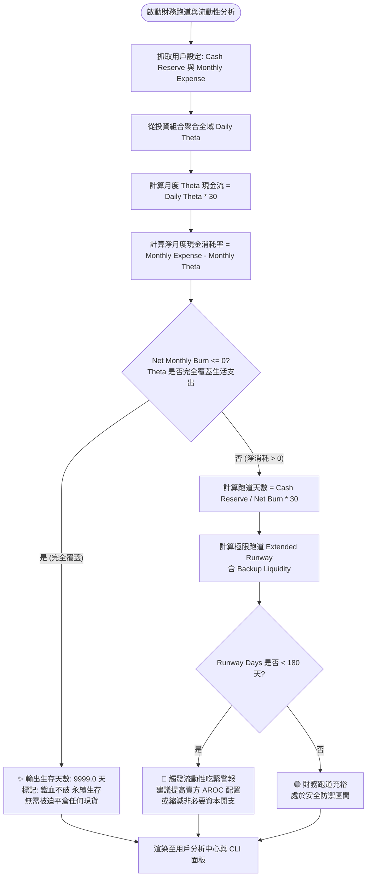

# 財務生存跑道分析與 Theta 現金流防禦緩衝模型 (Financial Survival Runway & Theta Cashflow Buffer)

## 1. 核心哲學與適用市場環境

### 1.1 全職交易員的生死線：現金流斷裂與被迫割肉
在專業期權交易與資產管理領域，決定交易員能否穿越週期的最關鍵因素往往不是「選股能力」，而是**「資本耐久力（Capital Endurance）」**。

多數個人交易員與新興量化基金的失敗路徑高度一致：
1. 市場遭遇長達數月的震盪陰跌或流動性嚴冬；
2. 交易員帳戶出現階段性浮動回撤（Drawdown）；
3. 由於日常生活成本（房貸、生活費、稅費）持續發生，交易員被迫在市場最底部「按月提領現金」；
4. 這種在低點被動割肉清倉的行為，永久性摧毀了複利增長的本金基底，導致當大牛市行情來臨時已無籌碼可言。

### 1.2 財務生存跑道 (Survival Runway) 的量化思維
Nexus Seeker 借鑑現代高科技新創企業的**現金消耗率（Cash Burn Rate）** 模型，將交易員的資產負債表與期權投資組合的時間價值微觀結構進行深度融合：
- 不僅審計帳戶的現金儲備（Cash Reserve）；
- 更將期權賣方每日產出的**時間價值衰減（Daily Theta, $\Theta_{\text{daily}}$）** 轉化為抵禦日常開支的「防禦性現金流緩衝墊」。

### 1.3 Theta 永續覆蓋：鐵血不破的 9999 天境界
當一個精心構建的期權投資組合所產生的每日 Theta 收益，在按月折算後**大於等於當月的全部生活支出**時：
- 投資組合的淨現金消耗率降為零甚至轉為正增長（Net Monthly Burn $\le 0$）；
- 交易員在生活開支層面達到了物理上的**自我造血循環**；
- 系統將此狀態定義為 **`9999.0 天 (無限生存跑道，鐵血不破)`**。此時無論外部金融市場如何暴跌，交易員均無須被迫賣出任何一股底倉現貨，擁有無限的耐心等待均值回歸與宏觀週期的反轉。

---

## 2. 數學模型與量化推導

### 2.1 每日 Theta 現金流與淨月度現金消耗率

#### 1. 月度 Theta 時間價值收益折算
從投資組合中所有未平倉期權合約計算日度時間價值總和 $\Theta_{\text{daily}}$（美元/日）。以每個月 30 天為標準基準月：
$$\text{Theta Cashflow}_{\text{monthly}} = \Theta_{\text{daily}} \times 30.0$$

#### 2. 淨月度現金消耗率 (Net Monthly Burn Rate)
設使用者設定的每月剛性生活總支出為 $\text{Monthly Expense}$：
$$\text{Net Monthly Burn} = \text{Monthly Expense} - \text{Theta Cashflow}_{\text{monthly}} = \text{Monthly Expense} - (\Theta_{\text{daily}} \times 30.0)$$

- 當 $\text{Net Monthly Burn} \le 0$：Theta 現金流完全覆蓋生活支出，帳戶資產無需補貼生活；
- 當 $\text{Net Monthly Burn} > 0$：Theta 現金流不足，帳戶每月必須實質消耗淨現金。

### 2.2 核心生存跑道 (Core Survival Runway) 計算公式
以帳戶目前可用無風險現金儲備 $\text{Cash Reserve}$ 為基礎，計算在無外部收入情況下帳戶能維持正常運轉的極限天數：
$$\text{Runway Days} = \begin{cases} 9999.0, & \text{若 } \text{Net Monthly Burn} \le 0 \\ \operatorname{round}\left( \frac{\text{Cash Reserve}}{\text{Net Monthly Burn}} \times 30.0, \; 1 \right), & \text{若 } \text{Net Monthly Burn} > 0 \end{cases}$$

### 2.3 備用流動性極限跑道 (Extended Runway with Backup Liquidity)
在極端壓力測試環境下，若計入使用者在經紀商之外可動用的低成本備用流動性（如信用額度、應急存款 $\text{Backup Liquidity}$）：
$$\text{Extended Runway Days} = \begin{cases} 9999.0, & \text{若 } \text{Net Monthly Burn} \le 0 \\ \operatorname{round}\left( \frac{\text{Cash Reserve} + \text{Backup Liquidity}}{\text{Net Monthly Burn}} \times 30.0, \; 1 \right), & \text{若 } \text{Net Monthly Burn} > 0 \end{cases}$$

### 2.4 Theta 現金流生活支出覆蓋率 (Theta Coverage Ratio)
定義 Theta 產出相對於生活支出的比率指標：
$$\text{Theta Coverage \%} = \left( \frac{\Theta_{\text{daily}} \times 30.0}{\text{Monthly Expense}} \right) \times 100\%$$

系統劃分三大生存警戒位階：
$$\text{Runway Health} = \begin{cases} \text{🟢 鐵血不破 (無限天)}, & \text{若 } \text{Theta Coverage} \ge 100\% \text{ 且 } \text{Runway Days} = 9999.0 \\ \text{🟡 穩健緩衝}, & \text{若 } 50\% \le \text{Theta Coverage} < 100\% \text{ 或 } \text{Runway Days} \ge 365.0 \\ \text{🔴 流動性警戒}, & \text{若 } \text{Theta Coverage} < 50\% \text{ 且 } \text{Runway Days} < 180.0 \end{cases}$$

---

## 3. 決策邏輯與狀態機 / 流程圖



---

## 4. 關鍵具名常數與物理約束

| 常數名稱 / 門檻 | 數值 / 設定 | 物理意義與代碼約束 | 核心程式碼檔案路徑 |
|---|---|---|---|
| `RUNWAY_INFINITE_VAL` | `9999.0` 天 | 當淨消耗為負或零時代表無限生存天數的系統哨兵值 | `nexus_core/market_analysis/pro_management.py` |
| `DAYS_PER_MONTH` | `30.0` 天 | 月度現金流折算與天數乘積基準常數 | `nexus_core/market_analysis/pro_management.py` |
| `THETA_SELF_SUSTAIN_PCT` | $100.0\%$ | 達到完全覆蓋、零現金消耗的門檻百分比 | `nexus_core/cogs/embed_builders/portfolio_embeds.py` |
| `RUNWAY_CRITICAL_DAYS` | $180.0$ 天 | 觸發流動性警戒的生存天數下限閾值 | `nexus_core/cogs/embed_builders/portfolio_embeds.py` |

---

## 5. 邊界條件、風控熔斷與例外處理

### 5.1 零消耗或負消耗哨兵處理 (Zero or Negative Burn Sentinel)
當交易員的時間價值收益超過生活開支時，$\text{Net Monthly Burn} \le 0$。若此時進行除法 $\frac{\text{Cash Reserve}}{\text{Net Monthly Burn}}$，會得出無意義的負數天數（例如 -120 天）。`pro_management.py:85` 明確設計哨兵防護：
```python
net_monthly_burn = monthly_expense - (daily_theta * 30)
if net_monthly_burn <= 0:
    return 9999.0
runway_months = cash_reserve / net_monthly_burn
return round(runway_months * 30, 1)
```
確保直接返回 `9999.0`，在 UI 與演算法層面代表「無限天數」。

### 5.2 投資組合總 Theta 為負之極端加速消耗 (Negative Theta Acceleration)
若投資人持有大量買方期權（Long Call / Long Put），總體 $\Theta_{\text{daily}} < 0$。此時 $\text{Net Monthly Burn} = \text{Monthly Expense} - (-|\Theta| \times 30) = \text{Monthly Expense} + |\Theta| \times 30$。
數學模型能自然適應此邊界條件：負 Theta 將作為「額外支出」自動放大現金消耗率，使生存跑道天數迅速縮短，精確向交易員揭示買方持倉的時間侵蝕代價。

---

## 6. 核心程式碼檔案路徑關聯

- **專業資產管理生存跑道算法**:
  - `nexus_core/market_analysis/pro_management.py`: `calculate_survival_runway()`, `calculate_financial_runway` (lines 77–93)
- **分析中心投資組合執行管線**:
  - `nexus_core/market_analysis/analyst_runners/portfolio_runner.py`: lines 83–94
- **個人資產面板與 Discord Embed 渲染**:
  - `nexus_core/cogs/embed_builders/portfolio_embeds.py`: lines 381–415
- **CLI 命令列終端監控展現**:
  - `nexus_core/cli.py`: lines 255–285
