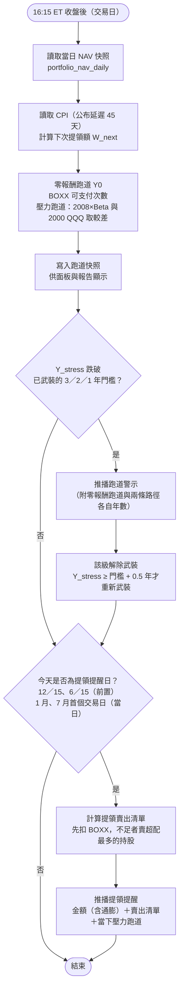

# 提領跑道與歷史壓力重演 (Withdrawal Runway & Historical Stress Replay)

> **狀態：階段一（計算核心與設定）已實作；階段二、三尚未實作。** 本文取代舊版「Theta 現金流生存跑道」（`pro_management.calculate_survival_runway()`）。舊版以手動輸入的 `cash_reserve` 除以「月支出 − Theta × 30」計算天數，不看股票部位、不看市場路徑，也從不推播；介面上一律標示「鐵血不破」，無資料時寫死顯示「4.6+ 年」。實作分三個階段，每個階段上線前另行確認（見 §6）。階段一僅新增純邏輯模組與設定欄位，不改任何顯示或推播。

## 1. 核心哲學與適用市場環境

### 1.1 帳戶是「有使用年限的生活費」
使用者的帳戶同時是投資部位與生活費來源：總資產約 10 萬美元，每年 1 月與 7 月各提領 1 萬美元（以 2026-09 購買力計，隨 CPI 調整），**年提領率約 20%**。在這個提領率下，任何配置都不能保證帳戶長期存續，系統的任務因此不是「讓帳戶永續」，而是：

1. 隨時告訴使用者「如果崩跌從今天開始，還能提領幾年」；
2. 在每次提領前給出金額與賣出清單，把提領順便變成再平衡；
3. 跑道跌破門檻時推播警示，由使用者決定是否少提、延後或補入資金。

系統**不代為下單**，也**不根據市場訊號切換配置**。

### 1.2 為什麼不擇時、不留固定 BOXX
配置為 100% 科技股（使用者選定的 D 方案）；BOXX 是避風港，由使用者自行判斷進出，不是固定配置的一部分。以下兩項結論來自 2007–2025 日線回測（`calibration/static_allocation_backtest.py` 的固定比例與總經三態模擬，另以臨時腳本加上提領），起點為 2007-01 → 2015-12 的每個月初（108 個）：

| 規則（每半年提 1 萬、隨 CPI） | 存活年數最差 | 中位數 | 2025 年底前耗盡比例 |
|---|---:|---:|---:|
| 一直持有科技池 | 5.5 | 13.0 | 18% |
| 科技 80% + BOXX 20%，每年再平衡 | 6.0 | 13.0 | 23% |
| 總經三態（好 → 科技、轉差 → VOO、最差 → BOXX） | 5.0 | 12.8 | 23% |
| 任一總經警訊 → BOXX | 5.5 | 11.9 | 41% |
| SPY 連 3 日低於 200 日線 → BOXX | 5.5 | 11.8 | 45% |
| BOXX 固定保留 2 次提領，股票回撤 < 10% 才補 | 5.5 | 11.8 | 33% |
| 參考：一直持有 VOO | 4.0 | 7.5 | 100% |

- 避風港切換與分桶都**沒有**延長跑道：訊號落後，躲進 BOXX 時多半已跌了一段，回場時已反彈，損失大於「在 BOXX 中提領、不必低點賣股」的好處。總經訊號仍由 `macro_signal_log` 乾跑蒐集（[`../architecture/05_calibration_harness_and_forward_collection.md`](../architecture/05_calibration_harness_and_forward_collection.md) §5.15），驗證前不接入本功能。
- 提領月份（1+7 月 … 6+12 月六組）對存活年數的影響在 0.2 年內，且在 2007–2010 與 2011–2015 兩段起點的排序不一致；1 月與 7 月依使用者實際用錢時間選定。
- 科技池是事後挑選的成分股，報酬嚴重高估；VOO 列才是較可信的量級。**唯一能穩定延長跑道的變數是提領金額**（VOO 80/20 走過 2007／2008 起點，只撐得住每年 4–6%）。

### 1.3 壓力跑道：以歷史崩跌重演，取較差者
「還能提領幾年」不能只用零報酬估計（目前 4.8 年），因為崩跌期間必須在低點賣股提領，會永久侵蝕本金。本系統把兩段歷史崩跌從今天開始重演，取較短的一個作為**壓力跑道**：

- **2008 金融海嘯**：SPY 自 2007-10-09 高點起的逐日報酬，乘上投組 Beta；
- **2000 網路泡沫**：QQQ 自 2000-03-10 高點起的逐日報酬，乘上股票部位占比（科技持股與那斯達克 100 高度同向，不再乘 Beta）。

2026-09-30 以 10 萬美元試算：零報酬 4.8 年、2008 × Beta 1.0 為 3.8 年、2008 × Beta 1.3 為 3.3 年、**2000 QQQ 為 2.3 年**。網路泡沫路徑不在 2007 年起的回測範圍內，卻是 100% 科技持股最接近的最壞情境；因此上線當下壓力跑道即低於 3 年，第一級警示會立即觸發。這是刻意的，不是誤報。

---

## 2. 數學模型與量化推導

### 2.1 通膨調整後的提領額
設使用者設定的基準提領額為 $W_0$（每次，基準月的購買力），基準月 CPI 為 $\text{CPI}_{\text{anchor}}$。第 $n$ 次提領額：
$$W_n = W_0 \times \frac{\text{CPI}_{t_n - L}}{\text{CPI}_{\text{anchor}}}$$
其中 $\text{CPI}$ 取 FRED `CPIAUCSL`，$L = 45$ 天為公布延遲（只用當時已公布的值）。

### 2.2 零報酬跑道與 BOXX 可支付次數
$$Y_0 = \frac{\text{NAV}}{2 \times W_{\text{next}}}, \qquad N_{\text{BOXX}} = \left\lfloor \frac{V_{\text{BOXX}}}{W_{\text{next}}} \right\rfloor$$
$\text{NAV}$ 取 16:15 ET 寫入 `portfolio_nav_daily` 的當日淨值；$Y_0$ 只作對照，不觸發警示。

### 2.3 壓力跑道（歷史重演）
對路徑 $p \in \{\text{GFC}, \text{DOTCOM}\}$，令 $r^{p}_k$ 為該路徑自高點起第 $k$ 個交易日的報酬，$d_k$ 為「今天起第 $k$ 個交易日」：
$$\text{NAV}_{k} = \text{NAV}_{k-1} \times \left(1 + s_p \cdot r^{p}_k\right) - \sum_{n:\, t_n = d_k} W_n$$
$$s_{\text{GFC}} = \operatorname{clip}(\beta_{\text{port}},\ 0.5,\ 2.0), \qquad s_{\text{DOTCOM}} = 1 - \frac{V_{\text{BOXX}}}{\text{NAV}}$$
其中 $W_n$ 以今天的 $W_{\text{next}}$ 依該路徑同期的歷史 CPI 漲幅外推。第一個 $\text{NAV}_k \le 0$ 的 $k$ 換算成年數即 $Y_p$：
$$Y_{\text{stress}} = \min\left(Y_{\text{GFC}},\ Y_{\text{DOTCOM}}\right)$$
重演期間 BOXX 部分不計利息（保守）；兩條路徑各取 10 年，重演 10 年仍未耗盡者記為「≥ 10 年」。

### 2.4 提領賣出清單（兼作再平衡）
令科技持股 $i$ 的市值為 $V_i$、目標權重為 $w^*_i$（預設為現有科技持股等權，可在設定中覆寫），提領後的股票部位為 $E' = \sum_i V_i - \max(0,\ W - V_{\text{BOXX}})$。超配金額：
$$X_i = V_i - w^*_i \cdot E'$$
先用 BOXX 支付；不足的 $R = W - V_{\text{BOXX}}$ 由 $X_i$ 最大者依序賣出，直到累計賣出金額 $\ge R$；若所有 $X_i \le 0$ 仍不足，其餘按 $w^*_i$ 比例賣出。1 月那次提領同時是年度再平衡，不另外產生交易建議。

### 2.5 警示分級與重新武裝
門檻 $T \in \{3, 2, 1\}$ 年。第 $j$ 級在 $Y_{\text{stress}} < T_j$ 時推播一次並解除武裝；只有在 $Y_{\text{stress}} \ge T_j + 0.5$ 時才重新武裝（比照投組回撤警報的重新武裝緩衝，避免在門檻附近反覆推播）。推播未送達時不前進狀態。

---

## 3. 決策邏輯與狀態機 / 流程圖

```mermaid
flowchart TD
    Start(["16:15 ET 收盤後（交易日）"]) --> Nav["讀取當日 NAV 快照<br/>portfolio_nav_daily"]
    Nav --> Cpi["讀取 CPI（公布延遲 45 天）<br/>計算下次提領額 W_next"]
    Cpi --> Calc["零報酬跑道 Y0<br/>BOXX 可支付次數<br/>壓力跑道：2008×Beta 與 2000 QQQ 取較差"]
    Calc --> Store["寫入跑道快照<br/>供面板與報告顯示"]
    Store --> Tier{"Y_stress 跌破<br/>已武裝的 3／2／1 年門檻？"}
    Tier -- 是 --> Warn["推播跑道警示<br/>（附零報酬跑道與兩條路徑各自年數）"]
    Warn --> Disarm["該級解除武裝<br/>Y_stress ≥ 門檻 + 0.5 年才重新武裝"]
    Tier -- 否 --> Sched
    Disarm --> Sched{"今天是否為提領提醒日？<br/>12／15、6／15（前置）<br/>1 月、7 月首個交易日（當日）"}
    Sched -- 是 --> Plan["計算提領賣出清單<br/>先扣 BOXX，不足者賣超配最多的持股"]
    Plan --> Remind["推播提領提醒<br/>金額（含通膨）＋賣出清單＋當下壓力跑道"]
    Sched -- 否 --> End([結束])
    Remind --> End
```

---

## 4. 關鍵具名常數與物理約束

| 常數名稱 / 門檻 | 數值 / 設定 | 物理意義與代碼約束 | 核心程式碼檔案路徑 |
|---|---|---|---|
| `WITHDRAWAL_MONTHS` | `(1, 7)` | 每年提領月份；1 月那次兼作年度再平衡 | `nexus_core/market_analysis/withdrawal_runway.py` |
| `WITHDRAWAL_BASE_AMOUNT` | $10{,}000$ 美元／次（使用者設定） | 基準月購買力下的每次提領額 $W_0$ | `nexus_core/database/user_settings.py`（`withdrawal_amount`） |
| `CPI_SERIES` | `CPIAUCSL` | 通膨調整所用的 FRED 月資料序列 | `nexus_core/services/macro_signal_service.py`（沿用 FRED 抓取） |
| `CPI_RELEASE_LAG_DAYS` | $45$ 天 | 只用當時已公布的 CPI，避免前視 | `nexus_core/market_analysis/withdrawal_runway.py` |
| `STRESS_PATH_GFC` | SPY，2007-10-09 起 10 年 | 2008 金融海嘯重演路徑，乘投組 Beta | `nexus_core/market_analysis/data/stress_paths.csv`（隨程式碼提交的靜態資料，由 `scripts/build_stress_paths.py` 產生） |
| `STRESS_PATH_DOTCOM` | QQQ，2000-03-10 起 10 年 | 2000 網路泡沫重演路徑，乘股票部位占比 | 同上 |
| `STRESS_BETA_CLAMP` | $[0.5,\ 2.0]$ | 投組 Beta 的上下限，避免資料異常放大路徑 | `nexus_core/market_analysis/withdrawal_runway.py` |
| `STRESS_BETA_FALLBACK` | $1.3$ | 無法計算 Beta 時的保守預設（科技持股典型值） | 同上 |
| `RUNWAY_WARN_TIERS_YEARS` | $(3,\ 2,\ 1)$ | 壓力跑道警示分級 | 同上 |
| `RUNWAY_REARM_BUFFER_YEARS` | $0.5$ 年 | 回升超過門檻 + 0.5 年才重新武裝 | 同上 |
| `PRE_REMINDER_DAY` | 前一個月 15 日 | 提領前置提醒日（12／15、6／15，遇假日順延至下一交易日） | 同上 |

---

## 5. 邊界條件、風控熔斷與例外處理

### 5.1 資料缺漏
- **當日無 NAV 快照**（非交易日、16:15 任務失敗）：沿用最近一筆快照，面板標註快照日期；超過 5 個交易日未更新則不推播警示，只在面板顯示「資料過期」。
- **CPI 抓取失敗**：沿用快取中最近一筆已公布值；從未抓到 CPI 時以 $W_0$ 不調整計算，並在提醒中註明「未含通膨調整」。
- **Beta 無法計算**（持股歷史不足一年等）：使用 `STRESS_BETA_FALLBACK = 1.3`，並在警示中註明。

### 5.2 持倉邊界
- **沒有任何持倉**：跑道 = 0，不推播警示（避免在清倉或資料未同步時誤報），面板顯示「無持倉」。
- **空頭或期權部位**：股票部位以帶號市值加總（空頭為負，不取 `abs()`），因為提領靠的是淨資產；期權以 Delta 等值股數計入（沿用 `downside_risk_service` 的模擬報酬序列作法）。賣出清單只列現股多頭。
- **持股不足以支付提領**：清單列出全部可賣部位並標示差額，不產生負部位。

### 5.3 推播與狀態
- 所有推播經 `services/notification_dispatcher.py` 發送；警示狀態以 kv 快取保存（`runway_state_` 前綴，比照 `downside_state_` 不列入去重清理白名單），推播未送達時狀態不前進。
- 提領提醒是資訊性的：系統無法得知使用者是否真的提領，下一次計算直接以實際 NAV 反映。

### 5.4 不作為預測
壓力跑道是「歷史最壞路徑若從今天重演」的條件式數字，不是機率預測，也不隱含下一次崩跌會與歷史相同；面板與推播都附上兩條路徑各自的年數與零報酬跑道，讓使用者看到區間而非單一數字。

---

## 6. 核心程式碼檔案路徑關聯

**分階段實作（每階段上線前另行確認）**：

1. **階段一：計算核心與設定（已實作）**
   - `nexus_core/market_analysis/withdrawal_runway.py`（純邏輯葉模組）：提領額通膨調整、零報酬跑道、壓力重演、賣出清單、警示分級。
   - `nexus_core/market_analysis/data/stress_paths.csv`：兩條路徑的逐日報酬與 CPI 累積比值靜態資料；`nexus_core/scripts/build_stress_paths.py` 於開發機一次性產生（需網路），正式環境只讀 CSV。
   - `nexus_core/database/migrations/v085_add_withdrawal_settings.py`：`user_settings` 加入提領基準額、基準月、提領月份、目標權重覆寫；`database/user_settings.py` 的 `upsert_user_config` 對基準月與月份做格式驗證（非法值不覆寫既有設定）。
   - 測試：`nexus_core/tests/unit/test_withdrawal_runway.py`。
2. **階段二：顯示並取代舊跑道**
   - `nexus_core/services/withdrawal_runway_service.py`（新增）：16:15 ET 於 NAV 快照之後計算並寫入跑道快照。
   - `nexus_core/cogs/embed_builders/_embed_helpers.py`、`report_embeds.py`、`portfolio_embeds.py`、`nexus_core/cogs/unified_terminal/portfolio_view.py`、`nexus_core/cogs/analyst_agent.py`、`nexus_core/cli.py`：改顯示新跑道，移除「鐵血不破」與寫死的「4.6+ 年」。
   - `nexus_core/market_analysis/pro_management.py`：移除 `calculate_survival_runway()`／`calculate_financial_runway`；`cash_reserve` 仍供 `/stress_test` 現金赤字精算使用，不移除；`monthly_expense` 設定由提領基準額取代。
3. **階段三：推播**
   - `nexus_core/services/withdrawal_runway_service.py`：提領提醒與跑道警示，經 `nexus_core/services/notification_dispatcher.py` 發送。
   - 排程同步更新 [`../platform/08_scheduled_jobs_and_background_pipelines.md`](../platform/08_scheduled_jobs_and_background_pipelines.md)。

**沿用的既有元件**：
- `nexus_core/services/downside_risk_service.py`：`portfolio_nav_daily` NAV 快照（16:15 ET）。
- `nexus_core/market_analysis/downside_monitor.py`：重新武裝緩衝的設計（`DRAWDOWN_REARM_BUFFER`）。
- `nexus_core/services/macro_signal_service.py`：`fetch_fred_series()`（FRED CSV 抓取）。
- `nexus_core/market_analysis/risk_engine.py`：`calculate_beta()`。

**回測依據**：`nexus_core/calibration/static_allocation_backtest.py`、`nexus_core/calibration/macro_regime.py`（固定比例與總經三態，見 [`../strategies/09_static_allocation_rebalance.md`](../strategies/09_static_allocation_rebalance.md)）。
