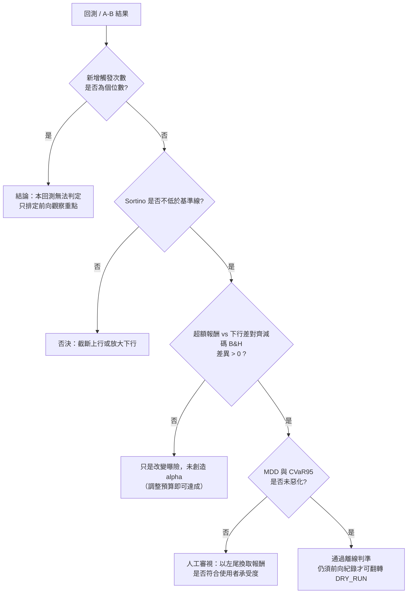
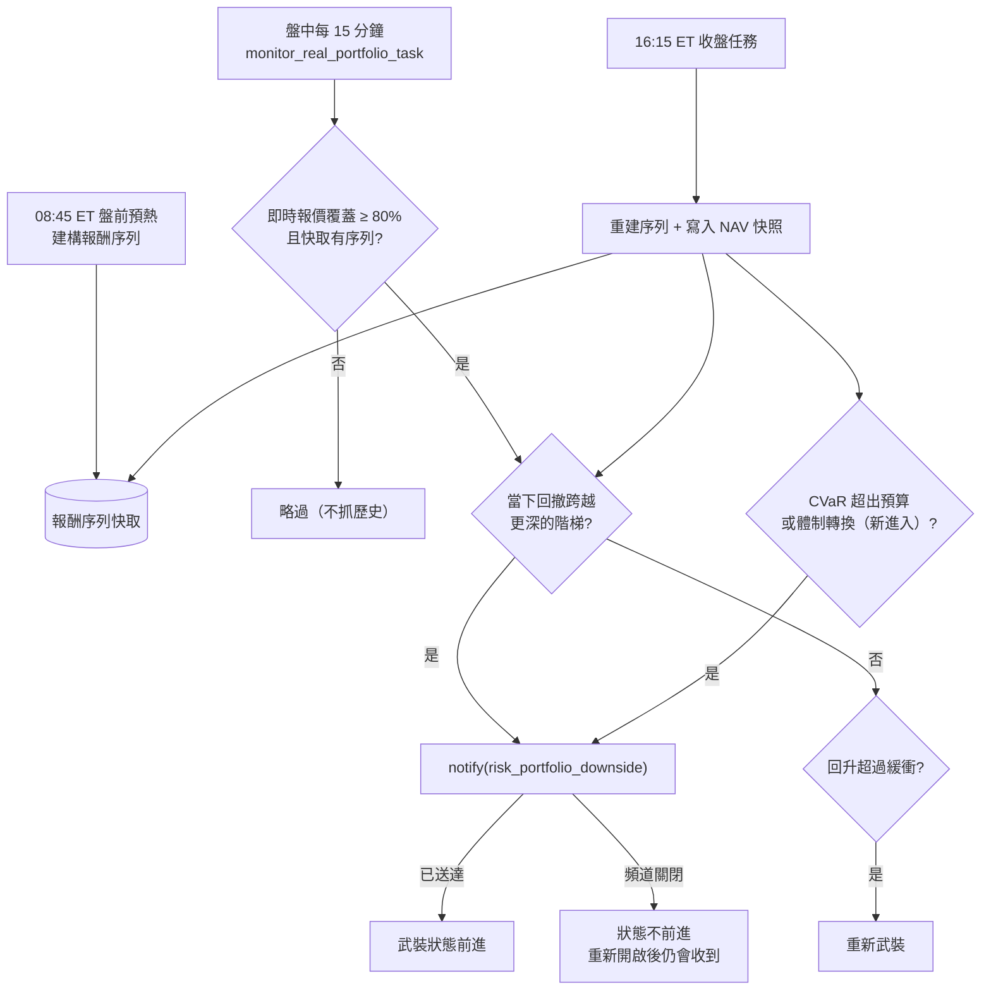

# 下行風險評估體系：索提諾比率、最大回撤與 VaR / CVaR (Downside Risk: Sortino, MDD, VaR / CVaR)

## 1. 核心哲學與適用市場環境

### 1.1 為什麼以 Sortino 為主，而不是 Sharpe
使用者的主策略是 **Buy & Hold**。對長期持有者而言，「風險」指的是淨值向下的偏離——被迫在低點認賠、回撤過深而無法等待均值回歸——而不是淨值向上的波動。

- **夏普比率 (Sharpe)** 以總標準差為分母，上漲與下跌一視同仁。任何「在上漲中分批停利」的操作都會降低總波動，使 Sharpe 看起來改善，即使它只是把上行砍掉、下行一分未減。
- **索提諾比率 (Sortino)** 只以「低於最低可接受報酬 (MAR) 的部分」為分母。截斷上行不會讓分母變小，只會讓分子變小——它正確地把「砍獲利部位」判為淨損失。

因此本系統的評估優先序為：**Sortino 為主判讀指標，最大回撤 (MDD) 與 VaR / CVaR 為輔**。Sharpe、Calmar、勝率與交易頻率只保留為回測報告中的描述欄位，**不得作為任何判讀、放行或優化目標**。

### 1.2 三個輔助指標各自回答的問題
| 指標 | 回答的問題 | 為什麼 Sortino 不夠 |
| :--- | :--- | :--- |
| 最大回撤 (MDD) | 最壞時從高點跌了多深 | Sortino 是平均意義的下行，看不到路徑上的單一深谷；深谷才是 B&H 投資人被迫出場的時點 |
| VaR95（1 日） | 正常的壞日子會虧多少 | 描述左尾的起點 |
| CVaR95（1 日，Expected Shortfall） | 真正的壞日子平均虧多少 | VaR 對分位數以下的尾部形狀完全盲目；CVaR 是尾部的期望值，對肥尾敏感 |

### 1.3 適用範圍
- 離線回測：`calibration/backtest_engine_2025.py` 的 `BacktestMetrics`、`scripts/run_rollover_backtest_2025.py` 報告與 `--ab-compare` 摘要。
- 即時投組監控：`services/downside_risk_service.py` 以使用者目前的部位建構模擬報酬序列，盤中檢查回撤、收盤檢查回撤與 CVaR，經 `risk_portfolio_downside` 頻道推播；盤後戰報與 VTR 週報附上快照欄位。
- 任何新的績效或風險評估（包括通知成效評估）都必須呼叫同一個模組 `market_analysis/downside_risk.py`，不得另行實作。

### 1.4 即時監控：為什麼推播回撤與 CVaR，而不推播 Sortino
Sortino 是一年尺度的平均意義指標，一天之內幾乎不動，也沒有「越過某條線就該行動」的自然門檻，因此只出現在戰報與週報中用於評估。會在數日內惡化到需要檢視部位的是左尾：**回撤深度**（B&H 投資人被迫認賠的直接原因）與**尾部損失的量級與體制轉換**（CVaR）。推播只由這兩者觸發。

---

## 2. 數學模型與量化推導

### 2.1 下行差 (Downside Deviation)
對單期報酬序列 $r_1, \dots, r_N$ 與單期 MAR $m = \text{MAR}_{\text{年}} / P$（$P = 252$）：

$$
DD = \sqrt{\frac{1}{N} \sum_{t=1}^{N} \min(0,\ r_t - m)^2}, \qquad DD_{\text{年}} = DD \times \sqrt{P}
$$

分母為**全部樣本數 $N$**。只對負報酬樣本取均值（舊版回測的作法）會讓「虧損次數少但每次都大」與「虧損次數多但每次都小」得到相同的下行差，等於丟掉了虧損頻率。

### 2.2 索提諾比率
$$
\text{Sortino} = \frac{R_{\text{年}} - \text{MAR}_{\text{年}}}{DD_{\text{年}}}
$$

$R_{\text{年}}$ 為年化幾何報酬（回測呼叫端傳入以期初本金精算的 CAGR）。本系統取 $\text{MAR} = R_f = 4.5\%$，使分子與分母以同一條基準線衡量。

### 2.3 最大回撤
$$
\text{MDD} = \max_{t} \frac{\max_{s \le t} V_s - V_t}{\max_{s \le t} V_s}
$$

### 2.4 歷史模擬 VaR 與 CVaR
以信賴水準 $c = 0.95$，$q = Q_{1-c}(r)$ 為報酬的 5% 分位數：

$$
\text{VaR}_c = \max(0,\ -q), \qquad \text{CVaR}_c = \max\!\Big(0,\ -\mathbb{E}\big[r \mid r \le q\big]\Big)
$$

兩者皆以**正值的損失比例**表示，且恆有 $\text{CVaR} \ge \text{VaR}$。

### 2.5 減碼 B&H 對照組：以下行差對齊
策略的下行風險若只有 B&H 的一半，報酬低於 B&H 是必然的。對照組取與策略**同等下行差**的「$w$ × B&H + $(1-w)$ × 無風險資產」：

$$
w = \operatorname{clip}\!\left(\frac{DD_{\text{策略}}}{DD_{\text{B\&H}}},\ 0,\ 1\right), \qquad
R_{\text{對照}} = w \cdot R_{\text{B\&H}} + (1 - w) \cdot R_f \cdot T
$$

**為什麼是下行差而不是總波動**：混合組合每期超額報酬為 $w (r^{\text{B\&H}}_t - R_f/P)$，因此

$$
DD\big(w\,r^{\text{B\&H}} + (1-w) R_f/P;\ \text{MAR}=R_f\big) = w \cdot DD\big(r^{\text{B\&H}};\ \text{MAR}=R_f\big)
$$

對照組與策略承擔**完全相同的 Sortino 分母**，其 Sortino 近似等於 B&H 本身。以總波動對齊（Sharpe 式建構）則會把策略「砍掉的上行波動」也算成降低的風險，替對照組多扣曝險；該版本保留為描述欄位 `excess_return_vs_vol_scaled`。

### 2.6 即時監控的報酬序列：現權重 × 一年歷史
系統沒有淨值歷史，因此以**目前的部位**回推過去一年。對標的 $i$ 的帶號 Delta 等值股數 $q_i$（現貨為股數；期權為 $\Delta_i \times$ 口數 $\times 100$）與最後收盤價 $P_i$：

$$
V = \sum_{i \in \text{現貨}} |q_i| P_i + \sum_{j \in \text{期權}} |n_j| \cdot 100 \cdot c_j + C, \qquad
w_i = \frac{q_i P_i}{V}, \qquad
r_t = \sum_i w_i \, r_{i,t}
$$

$c_j$ 為進場權利金、$C$ 為現金儲備（報酬視為 0）。權重固定（等同每日再平衡），只取所有標的共同交易日，保留最近 252 日。盤中的當下報酬為 $r_{\text{今日}} = \sum_i w_i (P_i^{\text{即時}} / P_i - 1)$，附加在序列尾端計算當下回撤。

### 2.7 已實現淨值：免疫加減碼的日報酬
每個交易日 16:15 ET 寫入 `portfolio_nav_daily`（NAV 與各標的持股、收盤價）。日報酬以**前一日的持股**計算：

$$
r_t = \frac{\sum_i q_{i,t-1} \, (P_{i,t} - P_{i,t-1})}{V_{t-1}}
$$

加碼、減碼、入金只改變下一天的 $q$ 與 $V$，不會被算成當天的報酬。累積 $\ge 60$ 個交易日後，戰報並列顯示已實現的 Sortino / MDD / CVaR。

### 2.8 推播條件
- **回撤階梯**：當下回撤 $DD$ 跨越 $\{10\%, 15\%, 20\%\}$ 中比已觸發階梯更深的一階時推播最深的那一階；$DD$ 回升到「已觸發階梯 $- 2.5\%$」之上才重新武裝。
- **CVaR 預算**：$\text{CVaR}_{95} > \text{risk\_limit} \times 0.20$（risk_limit 預設 15% → 預算 3.0%）。
- **尾部體制轉換**：近 63 日 $\text{CVaR}_{95} \ge 1.5 \times$ 過去 60 個交易日滾動 63 日 $\text{CVaR}_{95}$ 的中位數。
- CVaR 條件只在「進入」時推播一次，持續超出不重複；條件解除後再次進入才會再推。

---

## 3. 決策邏輯與狀態機 / 流程圖

回測或 A/B 對照的判讀順序：

Sharpe、Calmar、勝率不出現在這條路徑上。

即時監控的判定流程（`risk_portfolio_downside` 頻道）：

**2025 回測現況（2026-09-23 重跑）**：Defensive Sortino 1.45、Aggressive 1.13，皆低於 B&H 1.73，超額報酬 vs 減碼 B&H 分別為 −2.08 / −4.44 pp；唯一在 Sortino 上超越 B&H 的組合是 Aggressive + `PYRAMID_ADD`（1.87，+1.01 pp）。逃頂三級階梯雖使 MDD 與 CVaR95 下降，Sortino 卻降至 0.21（Aggressive），是「以截斷上行換取低回撤」的典型。詳見 [`../strategies/04_dynamic_rollover_state_machine.md`](../strategies/04_dynamic_rollover_state_machine.md) §2.10 與 [`../architecture/05_calibration_harness_and_forward_collection.md`](../architecture/05_calibration_harness_and_forward_collection.md) §5.12。

---

## 4. 關鍵具名常數與物理約束

| 常數 | 值 | 說明 | 位置 |
| :--- | :--- | :--- | :--- |
| `TRADING_DAYS_PER_YEAR` | $252$ | 年化期數 | `market_analysis/downside_risk.py` |
| `DEFAULT_VAR_CONFIDENCE` | $0.95$ | VaR / CVaR 信賴水準 | 同上 |
| `MIN_VAR_SAMPLES` | $60$ | 歷史模擬的最低樣本數；95% 下左尾僅 3 筆，再少只是在描述單一事件 | 同上 |
| 回測 MAR / $R_f$ | $4.5\%$ | 2025 年無風險利率基準，兼作 Sortino 的 MAR | `calibration/backtest_engine_2025.py::calculate_metrics` |
| 減碼權重上限 | $w \le 1$ | 本引擎不使用槓桿，$w > 1$ 只會是估計雜訊，放行會讓對照組憑空虛增 | 同上 |
| `LOOKBACK_DAYS` | $252$ | 模擬報酬序列長度 | `market_analysis/downside_monitor.py` |
| `SORTINO_WINDOWS` | $(63, 252)$ | 戰報顯示的 Sortino 視窗（一季、一年） | 同上 |
| `DRAWDOWN_TIERS` | $(10\%, 15\%, 20\%)$ | 距一年高點的回撤階梯（PRE_CALIBRATION） | 同上 |
| `DRAWDOWN_REARM_BUFFER` | $2.5\%$ | 重新武裝緩衝（PRE_CALIBRATION） | 同上 |
| `CVAR_BUDGET_PER_RISK_LIMIT` | $0.20$ | 1 日 CVaR95 預算 = risk_limit × 此係數（PRE_CALIBRATION） | 同上 |
| `CVAR_SHORT_WINDOW` / `CVAR_BASELINE_DAYS` | $63$ / $60$ | 尾部體制轉換的短窗與基準天數 | 同上 |
| `CVAR_EXPANSION_RATIO` | $1.5$ | 尾部體制轉換倍數（PRE_CALIBRATION） | 同上 |
| `_FALLBACK_OPTION_DELTA` | $\pm 0.5$ | 舊期權資料缺原始 Delta 時的近似（Call 正、Put 負） | `services/downside_risk_service.py` |
| `_MIN_LIVE_PRICE_COVERAGE` | $80\%$ | 盤中報酬所需的即時報價權重覆蓋率 | 同上 |

---

## 5. 邊界條件、風控熔斷與例外處理

- **下行差為 0**（整段期間沒有任何一期低於 MAR）：`sortino_ratio()` 回傳 $0.0$ 而非無限大，避免排序與比較失去意義。
- **VaR / CVaR 樣本不足**：`historical_var_cvar()` 回傳 `None`，呼叫端必須視為「無法評估」而非「零風險」；回測報告在此情況填 $0.0$。
- **左尾仍為正報酬**：VaR / CVaR 以 $0$ 為下限，不回報負的損失。
- **非有限值**：NaN / inf 在計算前濾除。
- **淨值非正**：幾何年化報酬回傳 $-1.0$；MDD 對非正高點視為 $0$ 回撤。
- **Sortino 定義修正使既有回測數字改變**：這是預期行為。總報酬與 MDD 不受影響；早期文件中的 Sortino 值不得與新值直接比較。
- **期權以 Delta 等值近似**：忽略 Gamma / Vega，對深價外或臨到期合約會低估尾部；`TradeMetadata.delta` 為舊資料的 `None` 時以 $\pm 0.5$ 近似，直到下一次 `refresh_portfolio_greeks`。
- **盤中不抓歷史**：盤中檢查只使用 08:45 預熱或 16:15 建好的快取序列；程序在盤中重啟且尚未預熱時，當天盤中不檢查，16:15 收盤任務照常執行。
- **盤中建構丟棄今日 K 棒**：yfinance 日線在盤中會含未完成的今日 K 棒，建構時丟棄，使「最後收盤價」恆為前一交易日收盤。
- **頻道關閉不前進武裝狀態**：推播未送達時回撤階梯狀態不前進，使用者重新開啟後仍會收到仍在回撤中的階梯。武裝狀態鍵刻意使用 `downside_state_` 前綴（不在 03:00 ET 去重清理白名單內），否則三天後會在仍處回撤中時重複推播同一階。
- **遷移順序**：`v082` 依賴遷移執行器「只套用大於目前最大版本」的行為；部署時必須先套用 `v081`（通知頻道分類重整），否則 `v081` 會被永久跳過。
- **判讀政策**：若新判準推翻既有預設（例如 `RiskAppetite.AGGRESSIVE` 的採用前提），只在文件與報告中標記並交由人工決策，不自動變更預設值。

---

## 6. 核心程式碼檔案路徑關聯

- `nexus_core/market_analysis/downside_risk.py`：下行差、Sortino、MDD、歷史模擬 VaR / CVaR 的單一權威實作（numpy 葉模組）；`sharpe_ratio()` 僅供回測描述。
- `nexus_core/calibration/backtest_engine_2025.py`：`BacktestMetrics` 判讀欄位（`sortino_ratio`、`max_drawdown`、`var_95`、`cvar_95`、下行差對齊的 `excess_return_vs_scaled`）與描述欄位（`sharpe_ratio`、`calmar_ratio`、`excess_return_vs_vol_scaled`）。
- `nexus_core/scripts/run_rollover_backtest_2025.py`：報告與 `--ab-compare` 摘要以 Sortino 為首列，Sharpe / Calmar 移至描述性指標區。
- `nexus_core/tests/unit/test_downside_risk.py`：全樣本分母、MAR 界線、上行波動不影響 Sortino、VaR / CVaR 手算、下行差線性縮放性質。
- `nexus_core/tests/unit/test_rollover_backtest_2025.py`：端到端回測的判讀欄位有限性與下行差對齊權重。
- `nexus_core/market_analysis/downside_monitor.py`：即時監控的純邏輯（快照、回撤階梯與重新武裝、CVaR 預算與體制轉換、NAV 快照報酬還原）與 PRE_CALIBRATION 常數。
- `nexus_core/services/downside_risk_service.py`：持倉曝險讀取、模擬報酬序列與快取、盤中 / 收盤檢查、NAV 快照寫入、戰報快照。
- `nexus_core/database/migrations/v082_add_portfolio_nav_daily.py`：`portfolio_nav_daily` 表。
- `nexus_core/cogs/embed_builders/alert_embeds/downside_alerts.py`：`create_portfolio_downside_alert_embed()`、`create_downside_snapshot_fields()`。
- `nexus_core/cogs/trading/pre_market.py`（08:45 預熱）、`cogs/trading/portfolio_monitor.py`（盤中檢查、VTR 週報快照）、`cogs/trading/after_market.py`（16:15 收盤任務）、`cogs/analyst_agent.py`（盤後戰報快照）。
- `nexus_core/tests/unit/test_downside_monitor.py`、`test_downside_risk_service.py`：階梯與重新武裝、CVaR 只在進入時推播、加碼不被算成報酬、盤中只走快取、頻道關閉不前進狀態。
