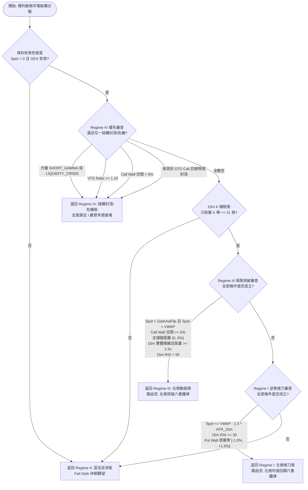

# 4-Regime 市場環境動態路由矩陣技術規格書

## 1. 核心哲學與適用市場環境

在多變的美股量化交易實務中，單一指標或固定偏向的操盤模型（例如純順勢突破或純逆勢抄底）在市場結構轉換時往往遭受重大虧損。當市場處於強趨勢時，逆勢接刀將面臨連續追殺；而在區間震盪或流動性陷阱中，追漲買突破則容易落入做市商假突破洗盤。更危險的是，當系統性流動性危機爆發或上方存在龐大期權實體封頂時，任何未經環境過濾的多頭進場皆屬致命風險。

Nexus Seeker 的核心架構導入了 **4-Regime 市場結構動態路由矩陣**（`DynamicRegime`），將市場行情精確劃分為四種微觀拓撲狀態：
1. **Regime IV（結構封頂／危機態，全面鎖定）**：最高優先級判定。當大盤爆發系統性流動性危機（`SYSTEMIC_LIQUIDITY_CRISIS`）、做市商集體翻入負 Gamma 順向踩踏（`SHORT_GAMMA_CRITICAL`）、VIX 期限結構深度倒掛（Front-month 溢價超過 10%）、上方阻力牆空間小於 5%、或偵測到機構級單筆大額 STO Call 巨鯨物理封頂時觸發。此狀態下系統硬性凍結一切多頭新開倉與轉倉部署，只允許執行防禦性對沖或清倉。
2. **Regime III（右側動能態，突破順勢）**：次級優先判定。標的現價確認站穩做市商自穩定分界線（Gamma Flip）與當日成交量加權均價（Session VWAP），且上方具備充裕獲利空間（Call Wall 空間 $\ge 5\%$），下方有有效正 Gamma 支撐牆貼身防禦（距離 $\le 5\%$），同時伴隨 15 分鐘實體陽線與 1.5 倍放量突破，RSI 位於強勢多頭區間（$> 55$）。此狀態路由至「右側動能六重鐵律」。
3. **Regime I（左側接刀態，極端負乖離吸籌）**：第三優先判定。標的價格短線遭遇非理性恐慌拋售，現價嚴重偏離當日均價達 $1.5 \times \text{ATR}_{15m}$ 以上，15 分鐘 RSI 進入極度超賣區（$\le 30$），但下方精準密著做市商 Put Wall 底牆（$-1.0\% \sim +1.5\%$ 容差帶）。此狀態下預期做市商被動買盤將提供強力緩衝，路由至「左側均值回歸六重鐵律」。
4. **Regime II（混沌泥淖態，全系統休眠）**：兜底分支。當標的處於無人區過渡震盪，既未展現右側突破動能，亦未到達極端左側做市商底牆，或任何關鍵量化數據（現價、GEX Profile、15m K 線）缺失時，系統啟用 Fail-Safe 機制，自動休眠觀望，嚴禁盲目交易。

### 資料快照複用設計 (RegimeMarketData Snapshot)
傳統量化架構中，「盤勢分類器」與「進場鐵律檢核」往往各自獨立請求市場數據（如 15m K 線、Session VWAP、ATR）。這不僅造成重複的網路 I/O 延遲，更會因為毫秒級的時間差取得不同的數據快照，引發「分類器判定為 Regime I，但進場檢核時 K 線更新導致條件失效」的邏輯分歧。Nexus Seeker 設計了 `RegimeMarketData` 命名元組，將分類過程中實際取得與計算的數據快照原樣傳遞至後續進場確認管線，確保系統決策建立在不可變的同一時空切片之上。

---

## 2. 數學模型與量化推導

### 2.1 VIX 期限結構倒掛率 (VTS Ratio)
VIX 期限結構是衡量全市場流動性緊縮與恐慌程度的領先指標：
$$
\text{VTS Ratio} = \frac{\text{VIX}}{\text{VIX3M}}
$$
- 當 $\text{VTS Ratio} \ge \text{\_REGIME\_IV\_VTS\_BACKWARDATION\_RATIO} = 1.10$ 時，代表即期市場避險情緒較 3 個月期出現超過 10% 的極端倒掛溢價，標誌著短期流動性極度匱乏與市場結構性斷裂，強制觸發 Regime IV。

### 2.2 帶正負號的阻力牆空間率 (Call Wall Proximity Pct)
阻力空間判定摒棄「Call Wall 必然在現價上方」的假設，採用帶正負號的相對距離公式：
$$
\Delta_{\text{CallWall}} = \frac{\text{CallWall} - \text{Spot}}{\text{Spot}}
$$
- 若 $\Delta_{\text{CallWall}} < \text{\_REGIME\_IV\_CALL\_WALL\_PROXIMITY\_PCT} = 0.05$（即空間不足 5%，或現價已穿過／跌破 Call Wall 導致值為負數），代表上方做市商正 Gamma 吸收或負 Gamma 拋售壓制極近，不具備多頭獲利盈虧比，觸發 Regime IV 鎖定。
- 若 $\Delta_{\text{CallWall}} \ge \text{\_REGIME\_III\_CALL\_WALL\_MIN\_ROOM\_PCT} = 0.05$，則滿足 Regime III 右側動能的阻力空間要求。

### 2.3 做市商正 Gamma 支撐牆即時防禦距離
支撐位在物理定義上必須位於現價下方，有效防禦距離計算如下：
$$
d_{\text{Support}} = \frac{\text{Spot} - \text{SupportWall}}{\text{Spot}}
$$
- 約束條件：$0 < d_{\text{Support}} \le \text{\_REGIME\_III\_SUPPORT\_WALL\_MAX\_DIST\_PCT} = 0.05$。
- 若 $d_{\text{Support}} > 0.05$，代表支撐牆距離現價過遠，即使現價在其上方，也無法對當前價格形成即時有效的吸收保護；若 $d_{\text{Support}} \le 0$，代表支撐牆已被擊穿或無效。

### 2.4 15 分鐘放量突破倍數
回看基準採用排除未成型當前根的前 20 根 15 分鐘已收盤 K 棒平均成交量：
$$
\overline{\text{Volume}}_{20} = \frac{1}{20} \sum_{i=1}^{20} \text{Volume}_{t-i}
$$
$$
\text{Surge Ratio} = \frac{\text{Volume}_{t}}{\overline{\text{Volume}}_{20}} \ge \text{\_REGIME\_III\_VOLUME\_SURGE\_MULT} = 1.5
$$
配合實體陽線條件：$\text{Close}_t > \text{Open}_t$。

### 2.5 左側極端負乖離與 Put Wall 密著帶
左側接刀要求現價向下深度偏離 Session VWAP 超過 1.5 倍的 15 分鐘 ATR：
$$
\text{Spot} \le \text{SessionVWAP} - \text{\_REGIME\_I\_VWAP\_ATR\_MULT} \times \text{ATR}_{15m}
$$
其中，做市商 Put Wall 密著容差帶定義為：
$$
d_{\text{Put}} = \frac{\text{Spot} - \text{PutWall}}{\text{Spot}} \in [-0.010, \; +0.015]
$$
即現價允許在 Put Wall 下方 1.0%（微幅跌破洗盤）至上方 1.5% 的極窄區間內。同時疊加 RSI 極端超賣：$\text{RSI}_{14} \le \text{\_REGIME\_I\_RSI\_MAX} = 30.0$。

---

## 3. 決策邏輯與狀態機 / 流程圖

---

## 4. 關鍵具名常數與物理約束

| 常數名稱 | 數值 / 門檻 | 物理 / 代碼約束 | 程式碼檔案路徑 |
| :--- | :--- | :--- | :--- |
| `_REGIME_IV_VTS_BACKWARDATION_RATIO` | `1.10` | Front-month VIX 溢價 3-month 超過 10% 視為流動性危機 | `nexus_core/market_analysis/dynamic_rollover/constants.py` |
| `_REGIME_IV_CALL_WALL_PROXIMITY_PCT` | `0.05` ($5\%$) | 上方阻力牆剩餘空間不足 5% 視為結構封頂 | `nexus_core/market_analysis/dynamic_rollover/constants.py` |
| `_ENTRY_UOA_CAP_RATIO_THRESHOLD` | `1.5` | STO Call 視為物理封頂的單筆 Volume/OI 門檻 | `nexus_core/market_analysis/dynamic_rollover/constants.py` |
| `_REGIME_III_CALL_WALL_MIN_ROOM_PCT` | `0.05` ($5\%$) | 右側動能進場最低向上獲利空間要求 | `nexus_core/market_analysis/dynamic_rollover/constants.py` |
| `_REGIME_III_SUPPORT_WALL_MAX_DIST_PCT` | `0.05` ($5\%$) | 現價距離正 Gamma 支撐牆之最大即時防禦距離 | `nexus_core/market_analysis/dynamic_rollover/constants.py` |
| `_REGIME_III_VOLUME_SURGE_MULT` | `1.5` | 15m K 棒成交量相對於過去 20 根均量的放大倍數 | `nexus_core/market_analysis/dynamic_rollover/constants.py` |
| `_REGIME_III_RSI_MIN` | `55.0` | 右側動能突破 15m RSI 最低多頭門檻 | `nexus_core/market_analysis/dynamic_rollover/constants.py` |
| `_REGIME_I_VWAP_ATR_MULT` | `1.5` | 左側負乖離門檻：$\text{Spot} \le \text{VWAP} - 1.5 \times \text{ATR}_{15m}$ | `nexus_core/market_analysis/dynamic_rollover/constants.py` |
| `_REGIME_I_RSI_MAX` | `30.0` | 左側接刀 15m RSI 最高超賣門檻 | `nexus_core/market_analysis/dynamic_rollover/constants.py` |
| `_REGIME_I_PUT_WALL_LOWER_PCT` | `-0.01` ($-1.0\%$) | 左側現價距 Put Wall 允許下穿洗盤之下界 | `nexus_core/market_analysis/dynamic_rollover/constants.py` |
| `_REGIME_I_PUT_WALL_UPPER_PCT` | `0.015` ($+1.5\%$) | 左側現價距 Put Wall 允許密著吸附之上界 | `nexus_core/market_analysis/dynamic_rollover/constants.py` |
| `_ENTRY_VOLUME_LOOKBACK_BARS` | `20` | 成交量基準回看已收盤 15m K 棒根數 | `nexus_core/market_analysis/dynamic_rollover/constants.py` |

---

## 5. 邊界條件、風控熔斷與例外處理

1. **未成型 K 棒雜訊消除 (`trim_to_confirmed_15m_bars`)**：
   盤中當前最後一根 15 分鐘 K 棒仍在跳動，其成交量僅累積部分時間，若直接計算放量倍數會造成放量誤判，或在左側誤判為「縮量窒息」。分類器強制調用截斷函式，嚴格使用最近一根**已收盤**的完整 K 棒。若可用已收盤 K 棒不足 $20 + 1 = 21$ 根，一律回退至 Regime II。
2. **零除防護與負距離語意**：
   在計算 $\Delta_{\text{CallWall}}$ 與 $d_{\text{Support}}$ 時，皆先校驗 $\text{Spot} > 0$。若現價大於 Call Wall，$\Delta_{\text{CallWall}}$ 計算結果為負數，代碼利用 `< 0.05` 直接覆蓋此情境，判定空間不足（非誤判為已突破無限空間）。
3. **大盤總經 API 異常防禦**：
   呼叫 `get_market_regime()` 或 `get_vix_term_structure()` 若遭遇超時或網路例外，日誌發出警告，大盤狀態預設降級為 `"NORMAL"`，VTS Ratio 預設為 `0.0`，由個股微觀結構條件承擔最終風控，避免因外部 API 抖動癱瘓整個排程。
4. **極端單邊 Gamma 分佈 Fallback**：
   當標的期權分佈極端導致累積 GEX 無零交叉點時（`estimate_symbol_gamma_flip <= 0`），Regime III 的 `Spot > GammaFlip` 判定將無法滿足，系統將自動拒絕 Regime III 並導向後續審查，防止在無法界定 Gamma 翻轉線時進行高風險追漲。

---

## 6. 核心程式碼檔案路徑關聯

- `nexus_core/market_analysis/dynamic_rollover/regime_classifier.py`：核心函式 `classify_dynamic_regime()`
- `nexus_core/market_analysis/dynamic_rollover/models.py`：枚舉 `DynamicRegime`, `TradingStrategyMode` 及資料載體 `RegimeMarketData`
- `nexus_core/market_analysis/dynamic_rollover/constants.py`：所有門檻常數定義與物理約束
- `nexus_core/market_analysis/dynamic_rollover/structural_signals.py`：正負 Gamma 牆體掃描 `_scan_gex_walls()`
- `nexus_core/market_analysis/index_microstructure.py`：`detect_uoa_sto_call_physical_cap()`, `estimate_symbol_gamma_flip()`, `get_market_regime()`
- `nexus_core/market_analysis/vwap_utils.py`：日內加權均價抓取 `fetch_session_vwap()`
- `nexus_core/market_analysis/atr_utils.py`：`compute_atr_15m_from_df()`
- `nexus_core/market_analysis/price_volume_alert.py`：`trim_to_confirmed_15m_bars()`
