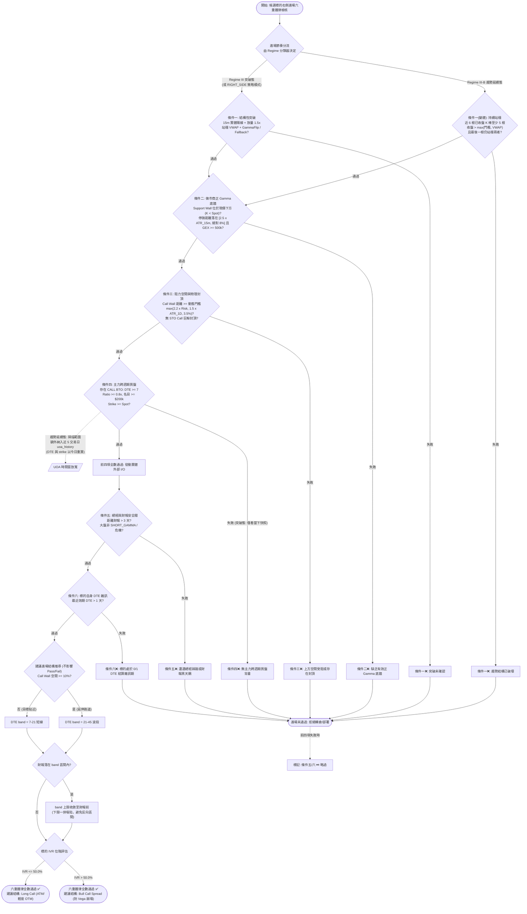

# 右側動能進場六重鐵律技術規格書

## 1. 核心哲學與適用市場環境

右側動能突破交易（Right-Side Momentum Breakout）的核心哲學在於「順應做市商對沖驅動力，絕不在無結構支撐的半山腰猜測底部」。當股價向上突破關鍵結構臨界點時，做市商的 Gamma 曝險由負翻正，其避險行為將由「追漲殺跌順向砸盤」轉化為「逢低買入自穩定護盤」；若此時疊加機構主力的跨週期認可與充足的向上獲利空間，突破的勝率與期望值將達到極致。

在 Nexus Seeker 系統中，右側六重鐵律是以下兩大核心業務管線的**唯一放行閘門**：
1. **機會成本轉倉 (`OPPORTUNITY_COST`)**：當現有衛星部位動能衰退，系統欲調度資金轉向更具爆發力的候選標的（Candidate）時，該候選標的必須 100% 通過六重鐵律。
2. **核心資金部署 (`CORE_DEPLOYMENT` 機會分支)**：當核心防禦資產（如 VOO）超額配置欲部署至進攻性衛星標的時，亦強制要求標的滿足六重鐵律。

### 兩種進場節奏：突破態與趨勢延續態

同一套六重鐵律承載兩種進場節奏，由 [`01_regime_routing_matrix.md`](01_regime_routing_matrix.md) 的分類器決定套用哪一種：

| 節奏 | 觸發 Regime | 條件一 | 條件四 | 條件二／三／五／六 |
| :--- | :--- | :--- | :--- | :--- |
| **突破態**（預設） | Regime III，以及 `RIGHT_SIDE` 策略模式的全部評估 | 放量實體陽線（§2.1） | 評估當下必須存在（§2.4） | 不變 |
| **趨勢延續態** | Regime III-B | 持續站穩結構（§2.1.1） | 5 個交易日回看窗（§2.4.1） | **完全不變** |

**只放寬進場節奏，不放寬風控**。條件二（底牆緩衝雙邊界）、條件三（非對稱空間與物理封頂）、條件五（財報／總經安全閥）、條件六（0/1 DTE 雜訊）在兩種節奏下逐字相同。放寬進場頻率是趨勢延續路徑的目的，放寬風險承擔不是。

⚠️ 刻意**不另開一套「趨勢延續六重鐵律」**（相對於左側／做空各自獨立成套的作法）：條件二/三/五/六是風控，重寫一份必然隨時間漂移，這正是 [`06_dynamic_adaptive_room_threshold.md`](06_dynamic_adaptive_room_threshold.md) 當初把散落 7 處的固定百分比收斂成單一權威演算法所依據的同一個理由。

### 階梯過濾與短路優化哲學
六重鐵律設計具備嚴格的計算階梯：
- **前四項條件（條件一至四）**：純記憶體與快取內的量價微觀結構運算，不依賴耗時的外部 I/O。
- **後兩項條件（條件五與六）**：涉及財報行事曆、總經狀態與標的期權到期鏈的實體網路 I/O。只有當前四項條件全數綠燈放行時，系統才會發動條件五與六的外部查詢。若前置條件失敗，條件五與六將短路略過，但仍在回報清單中補上「⏭️ 略過」標記，確保使用者在前端「進場鐵律檢核面板」永遠看到完整的六項檢驗，維持介面知情權的一致性。

---

## 2. 數學模型與量化推導

### 2.1 條件一：結構性右側放量突破與 Gamma Flip 替代模型
標的必須在 15 分鐘級別展現結構性放量突破，排除假突破灌壓。

1. **基本放量與站穩條件**：
   $$
   \text{Close}_{15m} > \text{GammaFlip}
   $$
   $$
   \text{Volume}_{15m} \ge \overline{\text{Volume}}_{20} \times \text{\_ENTRY\_VOLUME\_SURGE\_MULTIPLIER} = 1.5
   $$
   $$
   \text{Close}_{15m} > \text{Open}_{15m} \quad (\text{實體陽線，排除陰線放量摜壓})
   $$
   $$
   \text{Close}_{15m} > \text{SessionVWAP}
   $$

2. **極端單邊 Gamma 分佈與 Fallback 替代方案**：
   當標的期權鏈分佈極度單邊，導致累積 GEX 無法在有效區間內捕捉到零交叉點（$\text{GammaFlip} \le 0$）時：
   - **若全鏈動態 $\text{Net GEX} < 0$**：確認標的處於全域 Short Gamma 泥淖，做市商對沖行為為助跌順向拋售，判定為結構性空頭，條件一**直接不通過**。
   - **若全鏈動態 $\text{Net GEX} > 0$**：代表全鏈做市商整體處於正 Gamma 吸收波動的自穩定狀態。此時若強求 Gamma Flip 門檻將造成「誤殺」，故啟用 Fallback 替代突破門檻：
     $$
     \text{Breakout Threshold} = \text{SessionVWAP} + 0.5 \times \text{ATR}_{15m}
     $$
     要求 15 分鐘收盤價站穩該門檻：$\text{Close}_{15m} > \text{Breakout Threshold}$。
   - 若數據缺失或 $\text{Net GEX} == 0$：Fail-Safe 判定未通過。

#### 2.1.1 趨勢延續變體（Regime III-B 專用）

放量與實體陽線兩項**被取代**（而非追加一條替代路徑）：

$$
\sum_{i=t-N+1}^{t} \mathbb{1}\big[\text{Close}_i > \max(\text{BreakoutThreshold},\ \text{SessionVWAP})\big] \ge \text{\_REGIME\_III\_B\_MIN\_HELD\_BARS} = 5
$$

其中 $N = \text{\_REGIME\_III\_B\_LOOKBACK\_BARS} = 6$，$\text{BreakoutThreshold}$ 沿用本條件既有的 Gamma Flip 估算值（或全域 Long Gamma 的 $\text{SessionVWAP} + 0.5 \times \text{ATR}_{15m}$ 替代門檻）。

**為什麼必須取代而非追加**：放量突破與實體陽線正是「事件式進場」的兩項特徵，而 Regime III-B 的存在理由就是趨勢續航段沒有它們。若保留原判定作為必要條件，III-B 在建構上永遠通不過條件一，整條路徑將成為死碼。

**兩項不放寬**：站穩結構門檻（$\text{Close}_t > \text{BreakoutThreshold}$）與站穩 Session VWAP（$\text{Close}_t > \text{SessionVWAP}$）維持原樣——它們是做市商自穩定區的定義本身，放寬等同容許在負 Gamma 區追多。

**資料來源一致性**：本變體自行呼叫 `trim_to_confirmed_15m_bars()` 截斷至已收盤 K 棒。DYNAMIC 路徑透過 `RegimeMarketData.df_15m` 傳入的是**未截斷**的原始 frame（分類器只在內部持有 `df_confirmed`），盤中最後一根仍在跳動；若直接納入計數，「站穩」判定會隨每一次 tick 抖動。最後一根的收盤價判定亦改用同一份已截斷 frame，避免「站穩根數」數已收盤 K 棒而「收盤價」取自當前未成型根的自相矛盾。

### 2.2 條件二：做市商正 Gamma 底牆完好與物理約束
進場點下方必須有實質的做市商被動買盤作為防守護甲。

1. **底牆現價物理約束定理**：
   支撐位在物理定義上必須位於現價下方。掃描範圍強制約束在現價下方：
   $$
   \text{Support Wall} = \operatorname{argmax}_{K < \text{Spot}} \big(\text{Net GEX}(K)\big)
   $$
   - 若現價下方無正 GEX 峰值，或該峰值低於薄紙牆門檻 $\text{GEX\_THIN\_WALL\_THRESHOLD} = 500,000$，則 $\text{Support Wall} = 0.0$，條件二直接判定未通過。此約束徹底杜絕了將現價上方龐大的 Call Wall 阻力誤判為支撐底牆的系統性缺陷。
2. **即時有效防禦距離：停損距離雙邊界約束**：
   判定自固定上限 $5\%$ 升級為緩衝雙邊界（完整推導見 [`06_dynamic_adaptive_room_threshold.md`](06_dynamic_adaptive_room_threshold.md) 公式 B，`profile="RIGHT"`）。量的是**停損距離**而非牆距：
   $$
   2.5 \times \frac{\text{ATR}_{15m}}{\text{Spot}} \le \frac{\text{Spot} - (\text{SupportWall} - 0.5 \times \text{ATR}_{15m})}{\text{Spot}} \le 0.08
   $$
   - **下界**防「停損落在日內雜訊帶內」：停損就在腳邊時，任何日內隨機雜訊都會先掃穿它再回頭，即遭做市商 Liquidity Sweep 洗出場。舊版的 $0 < d$ 只要求牆在下方，對此完全無防護。
   - **上界為絕對 $8\%$**，純粹的絕對風險兜底。刻意不用 ATR 縮放——那會與條件三的 $2.2 \times \text{Risk}$ 重複定價同一風險，且低波標的的可接受帶會窄於一個履約價間距（實測見 `06` 的 §2.2）。
   - $\text{ATR}_{15m}$ 不可得時自動退回舊版的 $0 < d \le 5\%$ 單邊牆距判定。

### 2.3 條件三：做市商阻力結構與非對稱空間
1. **無 UOA 巨鯨物理封頂**：
   以 Call Wall 作為履約價基準，調用 `detect_uoa_sto_call_physical_cap`，嚴禁存在 $\text{Ratio} \ge \text{\_ENTRY\_UOA\_CAP\_RATIO\_THRESHOLD} = 1.5\text{x}$ 且 $\text{Strike} \ge \text{CallWall}$ 的單筆 STO Call 大單。
2. **非對稱向上獲利空間（帶正負號距離，動態門檻）**：
   $$
   \Delta_{\text{CallWall}} = \frac{\text{CallWall} - \text{Spot}}{\text{Spot}} \ge \max\Big(2.2 \times \text{Risk}_{\text{actual}},\ 1.5 \times \frac{\text{ATR}_{1D}}{\text{Spot}},\ 0.035\Big)
   $$
   $$
   \text{Risk}_{\text{actual}} = \frac{\text{Spot} - (\text{PutWall} - 0.5 \times \text{ATR}_{15m})}{\text{Spot}}
   $$
   門檻自固定 $5\%$ 升級為動態自適應波動率門檻：「上方要留多少空間」由「下方實際要冒多少風險」反推，使 2.2:1 的盈虧比成為結構性保證，而非對高波標的失效、對低波標的過嚴的一刀切數字。完整推導與降級階梯見 [`06_dynamic_adaptive_room_threshold.md`](06_dynamic_adaptive_room_threshold.md)。

   若現價已觸及或跌破 Call Wall（距離為負值），視為做市商壓制仍在且向上空間耗竭，拒絕進場。

### 2.4 條件四：主力跨週期買盤認證與雜訊過濾
必須在 UOA 清單（按名目價值 `notional_value` 降序排列）中尋找到至少一筆機構級 CALL BTO，同時滿足四重過濾：
1. **合約效期**：$\text{DTE} \ge \text{\_ENTRY\_UOA\_MIN\_DTE} = 7$ 天（排除 0~6 DTE 賭博或日內造市單）。
2. **異動放量比**：$\text{Ratio} (\text{Volume}/\text{OI}) \ge \text{\_ENTRY\_UOA\_MIN\_RATIO} = 0.8\text{x}$。
3. **權利金名目價值**：
   $$
   \text{Notional Value} = \text{Trade Price} \times \text{Volume} \times 100 \ge \text{\_ENTRY\_UOA\_MIN\_NOTIONAL\_USD} = \$200,000
   $$
4. **履約價物理約束**：$\text{Strike} \ge \text{Spot}$（排除深價內實值 Call 買單，後者通常為 Delta 對沖或領息操作，非實質方向性進攻）。

#### 2.4.1 趨勢延續變體：交易日回看窗（Regime III-B 專用）

$$
\text{C4}_{\text{relaxed}} = \exists\, u \in \big(\text{UOA}_{\text{live}} \cup \text{UOA}_{\text{hist}}\big) \;:\; u \text{ 滿足上述四重過濾}
$$

其中 $\text{UOA}_{\text{hist}}$ 為最近 $\text{\_ENTRY\_UOA\_LOOKBACK\_DAYS} = 5$ 個**交易日**內觀測到的 UOA 歷史紀錄。

**為什麼以交易日而非日曆日計**：UOA 只在開盤時段產生。以日曆日回看 5 天，遇到週末就只剩 3 個交易日、遇到連假只剩 2 個——同一個「5 日回看窗」在一週內不同日子所代表的樣本量相差近一倍，門檻等於隨機漂移。回看基準點由 NYSE 行事曆推得，且只計入**已開盤**的交易日（盤前執行時今天雖在行事曆內卻尚未產生任何 UOA，計入會實質縮短一天）。

**兩項過濾以「今天」為基準重算，而非沿用紀錄當時的值**——時間窗放寬的是「何時觀測到」，不是「現在是否仍然成立」：

| 過濾項 | 重算基準 | 理由 |
| :--- | :--- | :--- |
| $\text{DTE} \ge 7$ | $\text{expiry} - \text{今日}$ | 5 天前的 DTE 14 合約今天只剩 9 天；若已跌破門檻就不該再算數 |
| $\text{Strike} \ge \text{Spot}$ | **現價** | 主力當初買的價外 Call，若現價已衝過該履約價，那筆買盤已完成使命，不構成對「再往上」的背書 |

兩者都是**收緊**而非放寬。

**資料來源**：UOA 歷史由 15 分鐘心跳在計算完 UOA 後一併寫入 `uoa_history`（與既有的 `kv_cache` 快取共用同一份資料，零額外期權鏈抓取成本）。`kv_cache` 的 `uoa_{SYMBOL}` 是 `ON CONFLICT DO UPDATE` 的 upsert，每輪覆蓋前一輪，結構上無法回看，因此必須另立資料表。保留期 10 天（覆蓋 5 個交易日窗加上連假緩衝），由 03:00 ET 離峰排程清理。

### 2.5 條件五：二元宏觀與財報事件安全閥
前四項通過後發動實體檢查：
1. **距財報公佈天數**：
   $$
   \text{Days to Earnings} > \text{\_EARNINGS\_PRE\_EVENT\_BUFFER\_DAYS} = 3 \quad (\text{天})
   $$
   避開財報前夕隱含波動率崩塌（IV Crush）與二元跳空風險。
2. **大盤系統性風控狀態**：
   $$
   \text{Macro Regime} \notin \{\text{"SHORT\_GAMMA\_CRITICAL"}, \text{"SYSTEMIC\_LIQUIDITY\_CRISIS"}\}
   $$

### 2.6 條件六：標的自身最近效期選擇權週期雜訊過濾與建議進場結構
1. 抓取標的完整選擇權到期日列表，取得最近效期合約到期天數 $\text{DTE}_{\text{nearest}}$。
2. 雜訊過濾約束（**唯一決定本條件 Pass/Fail 的判準**）：
   $$
   \text{DTE}_{\text{nearest}} > \text{\_ENTRY\_CANDIDATE\_MIN\_DTE} = 1 \quad (\text{天})
   $$
   嚴禁在標的自身處於 0/1 DTE 結算日當日或前夕開倉，徹底規避末日合約結算引發的做市商流動性抽離與劇烈針狀洗盤。

3. **建議進場結構 (`structure_directive`) 之推導**：
   通過上述判準後，額外輸出一組「建議合約天期 (DTE band) 與部位結構」。此輸出**不參與 Pass/Fail 判定**，且三個輸入全部取自六重鐵律評估過程中本來就已算好／查到的值（條件三的 Call Wall 空間、`candidate_radar` 既有的 IV Rank、條件五既有的距財報天數），**零額外網路 I/O**。

   - **天期分流（跑道長度）**：
     $$
     [\text{DTE}_{lo}, \text{DTE}_{hi}] =
     \begin{cases}
     (21, 45) \text{ 波段} & \text{若} \Delta_{\text{CallWall}} \ge \text{\_ENTRY\_ROOM\_EXTENDED\_PCT} = 10\% \\
     (7, 21) \text{ 短線} & \text{否則}
     \end{cases}
     $$
     物理意義：目標價位就是上方的 Call Wall。空間不足 10% 代表目標近在咫尺，不需要長跑道承擔額外 Theta；空間充足才值得用波段天期換取行情延展。現價已觸及或跌破 Call Wall（$\Delta_{\text{CallWall}} < 0$）一律歸入短線。

   - **財報收斂**：
     $$
     \text{若 } 0 < \text{DaysToEarnings} < \text{DTE}_{hi}
     \;\Rightarrow\;
     \text{DTE}_{hi} \leftarrow \text{DaysToEarnings},\;
     \text{DTE}_{lo} \leftarrow \min(\text{DTE}_{lo}, \text{DTE}_{hi})
     $$
     不建議持有跨越財報的合約。條件五已保證距財報 $> 3$ 天，故此處只會收斂、不會歸零；$\text{DTE}_{lo}$ 一併塌陷是為了避免輸出 `21-10` 這類反向區間。

   - **結構分流（IVR）**：與左側條件六**共用同一門檻、同一理由**：
     $$
     \begin{cases}
     \text{Long Call (ATM/輕度 OTM)} & \text{若 IVR} \le \text{\_ENTRY\_IVR\_SPREAD\_THRESHOLD} = 50\% \\
     \text{Bull Call Spread} & \text{若 IVR} > 50\%
     \end{cases}
     $$
     高隱波位階下開單腳買方，一旦行情兌現引發 IV Crush 將遭遇 Vega 崩塌，故強制轉為垂直價差。

4. **設計原則：天期是輸出參數，不是部位標籤**。
   `structure_directive` 於**每一輪重評時依當下市況重新計算**，不會在進場當下蓋章後固定於部位上。這是刻意的設計約束：`transition_engine.py` 早期版本的路徑 2/3/4 正是因為把部位存亡綁在進場時貼上、之後永不更新的 `entry_regime` 標籤而被整批移除（演化後的部位因標籤陳舊而失去所有例行停損）。天期恰恰是最容易隨市況改變的屬性，若以標籤實作必然重蹈覆轍。

5. **與 `suggested_strategy` 的職責分界**：
   `structure_directive` 以**獨立欄位**攜帶於 `RolloverInstruction`，**不覆寫** `suggested_strategy`。後者由 `_calculate_rollover_decision()` 自行決策「用什麼工具進場」（`Buy Shares` / `Shares + ITM Call`），前者回答「若以期權表達，該選哪個天期與結構」，兩者互補而非互斥。若以覆寫實作，`Shares + ITM Call` 連同它自帶的 ITM 70Δ 履約價與 30-45 DTE 指引會被一併抹除。

   ⚠️ **核心資金部署 (Scenario 5) 機會分支刻意不消費此欄位**：該分支產生的指令為 `instrument_type="SPOT"` / `suggested_strategy="Buy Shares"`，是把 CORE 超額現金部署為候選標的的**現貨股票**，附上期權天期／價差建議會直接誤導使用者。

---

## 3. 決策邏輯與狀態機 / 流程圖

---

## 4. 關鍵具名常數與物理約束

| 常數名稱 | 數值 / 門檻 | 物理 / 代碼約束 | 程式碼檔案路徑 |
| :--- | :--- | :--- | :--- |
| `_ENTRY_VOLUME_LOOKBACK_BARS` | `20` | 15m K 線均量回看根數（排除當前根） | `nexus_core/market_analysis/dynamic_rollover/constants.py` |
| `_ENTRY_VOLUME_SURGE_MULTIPLIER` | `1.5` | 15m 突破放量倍數門檻 | `nexus_core/market_analysis/dynamic_rollover/constants.py` |
| `_BUFFER_LOWER_MULTIPLIERS["RIGHT"]` | `2.5` | 停損距離下界倍率（×ATR₁₅ₘ） | `nexus_core/market_analysis/room_threshold.py` |
| `_BUFFER_MAX_STOP_DISTANCE_PCT` | `0.08` ($8\%$) | 停損距離的絕對上限兜底 | `nexus_core/market_analysis/room_threshold.py` |
| `_ENTRY_SUPPORT_WALL_MAX_DISTANCE_PCT` | `0.05` ($5\%$) | ATR 兩項皆缺時退回的舊版單邊上限（降級路徑） | `nexus_core/market_analysis/dynamic_rollover/constants.py` |
| `_ENTRY_UOA_CAP_RATIO_THRESHOLD` | `1.5` | 單筆 STO Call 判定為物理封頂之最低 Volume/OI 比值 | `nexus_core/market_analysis/dynamic_rollover/constants.py` |
| `_ROOM_RISK_MULTIPLIER` | `2.2` | 盈虧比要求；取代退役的 `_ENTRY_ASYMMETRIC_ROOM_PCT` 固定 $5\%$ | `nexus_core/market_analysis/room_threshold.py` |
| `_ROOM_ATR_1D_MULTIPLIER` | `1.5` | 空間至少須涵蓋 1.5 個單日波幅 | `nexus_core/market_analysis/room_threshold.py` |
| `_ROOM_ABSOLUTE_FLOOR_PCT` | `0.035` ($3.5\%$) | 動態門檻的絕對底線與資料缺失時的退回值 | `nexus_core/market_analysis/room_threshold.py` |
| `_ROOM_STOP_ATR_15M_MULTIPLIER` | `0.5` | 停損墊片；必須與軌道一的 `_MICROSTRUCTURE_SL_STRUCTURAL_ATR_MULT` 同步 | `nexus_core/market_analysis/room_threshold.py` |
| `_ENTRY_UOA_MIN_DTE` | `7` | 主力 UOA 買盤最低到期天數 | `nexus_core/market_analysis/dynamic_rollover/constants.py` |
| `_ENTRY_UOA_MIN_RATIO` | `0.8` | 主力 UOA 買盤最低 Volume/OI 比值 | `nexus_core/market_analysis/dynamic_rollover/constants.py` |
| `_ENTRY_UOA_MIN_NOTIONAL_USD` | `$200,000.0` | 主力 UOA 買盤最低權利金名目金額 | `nexus_core/market_analysis/dynamic_rollover/constants.py` |
| `_ENTRY_UOA_LOOKBACK_DAYS` | `5` | **僅 Regime III-B** 套用的條件四回看窗，以**交易日**計；Regime III 維持「評估當下必須存在」 | `nexus_core/market_analysis/dynamic_rollover/constants.py` |
| `_REGIME_III_B_LOOKBACK_BARS` / `_REGIME_III_B_MIN_HELD_BARS` | `6` / `5` | 條件一趨勢延續變體的回看窗與最低站穩根數；$5/6$ 容差允許 1 根洗盤針 | `nexus_core/market_analysis/dynamic_rollover/constants.py` |
| `_EARNINGS_PRE_EVENT_BUFFER_DAYS` | `3` | 避開財報發布的最小安全天數緩衝 | `nexus_core/market_analysis/dynamic_rollover/constants.py` |
| `_ENTRY_CANDIDATE_MIN_DTE` | `1` | 標的自身最近效期選擇權最低 DTE 要求（避開 0/1 DTE） | `nexus_core/market_analysis/dynamic_rollover/constants.py` |
| `_ENTRY_ROOM_EXTENDED_PCT` | `0.10` ($10\%$) | Call Wall 空間達此值視為「延伸跑道」，建議波段天期（僅影響建議文字） | `nexus_core/market_analysis/dynamic_rollover/constants.py` |
| `_ENTRY_DTE_BAND_SHORT` | `(7, 21)` | 短線建議 DTE band，沿用 `transition_engine.py` 路徑一加碼的既有天期慣例 | `nexus_core/market_analysis/dynamic_rollover/constants.py` |
| `_ENTRY_DTE_BAND_SWING` | `(21, 45)` | 波段建議 DTE band，沿用既有「次月合約」慣例 | `nexus_core/market_analysis/dynamic_rollover/constants.py` |
| `_ENTRY_IVR_SPREAD_THRESHOLD` | `50.0` ($50\%$) | IVR 高於此值改建議 Bull Call Spread（與左側 `_LEFT_ENTRY_IVR_SPREAD_THRESHOLD` 同值同理由） | `nexus_core/market_analysis/dynamic_rollover/constants.py` |
| `GEX_THIN_WALL_THRESHOLD` | `500,000.0` | 做市商有效正 Gamma 牆體之最低曝險深度門檻 | `nexus_core/market_analysis/index_microstructure.py` |

---

## 5. 邊界條件、風控熔斷與例外處理

1. **底牆現價物理約束之嚴格執行**：
   在 `_scan_gex_walls` 中，若現價下方無任何正 GEX 峰值，支撐牆回傳 `0.0`。條件二代碼嚴格檢查 `support_wall > 0`，並將牆距交由緩衝雙邊界判定，防止在無支撐保護的懸崖結構中進場。
2. **⚠️ 條件二的行為變化與進場頻率影響**：
   支撐牆極貼現價（例如 $0.5\%$）在舊版的 $0 < d \le 5\%$ 判定下會**通過**條件二，改版後判為 `TOO_TIGHT` 而**不通過**。這正是新增下界閘門的目的（防 Liquidity Sweep 掃損）。

   252 點參數掃描的實測結果：舊版固定 $5\%/5\%$ 的通過率 $59.5\%$ 中，有 $46.7\%$ 屬於「本來就不該進」（真實 $\text{R:R} < 2.2$ 佔 $17.3\%$、停損落在雜訊帶內佔 $30.0\%$；舊版最差 $\text{R:R}$ 僅 $0.91$，即賠率比 $1:1$ 還差）。新規則的通過率為 $37.3\%$，最差 $\text{R:R}$ 為 $2.23$，且「本來就該通過」的格點保留率為 $100\%$。頻率下降是正當淘汰，不是誤殺——但上線後仍應監控機會成本轉倉的實際觸發次數。
3. **動態門檻的降級揭露義務**：
   ATR 或 Put Wall 缺失時，門檻退回 $3.5\%$ 絕對底線並標記降級。條件二／三的逐項判定字串會以 `｜⚠️` 前綴附加降級原因，該字串流入「進場鐵律檢核」面板——使用者有權知道看到的門檻不是完整推導出來的。
4. **全鏈 Short Gamma 泥淖即時熔斷**：
   在條件一中，若 `gamma_flip_est <= 0` 且 `effective_net_gex < 0`，系統立即終止後續判定，回報「全域 Short Gamma 泥淖，結構性空頭直接不通過」，防止在市場極端單邊下殺時誤觸發突破買進。
5. **外部行事曆與到期日異常防呆**：
   若財報快取讀取失敗，或無法取得選擇權到期日清單，系統遵循 Fail-Closed 原則，一律判定該條件未通過，拒絕承擔未知的事件風險。
6. **條件四回看窗的 fail-closed**：
   `uoa_history` 讀取失敗（資料表尚未建立、查詢例外）時，條件四**退回「只看當下快照」的嚴格語意**，而不是放行。放寬門檻在資料缺失時必須收斂回原行為——這與動態空間門檻刻意選擇 fail-open（見 §5.3）方向相反，兩者的理由並不衝突：空間門檻缺資料時誤判會把正常標的鎖進危機態、連帶封鎖整個轉倉引擎（代價是漏做），而進場放寬缺資料時誤判是**在沒有證據的情況下開倉**（代價是做錯）。
   同理，本表上線後的最初 5 個交易日內 `uoa_history` 必然尚未累積足量紀錄，條件四的實際行為與放寬前相同——這是預期中的暖機期，不是缺陷。
7. **趨勢延續變體的同一交易時段約束**：
   條件一變體的 6 根回看窗必須全屬同一交易日，否則 fail-safe 不通過。完整理由見 [`01_regime_routing_matrix.md`](01_regime_routing_matrix.md) §5.3（`session_vwap` 為單一時段純量，跨日比較無意義）。實務效果是趨勢延續進場最早於 11:00 ET 才可能成立。
8. **乾跑閘門為跨情境**：
   `REGIME_III_B_DRY_RUN` 攔截的是**由 III-B 確認出來的指令**，而這些指令會同時出現在 `OPPORTUNITY_COST` 與 `CORE_DEPLOYMENT` 兩個情境底下。因此該閘門以指令的 `entry_regime` 欄位為鍵，而非比照 `SHORT_ENTRY_DRY_RUN` / `PYRAMID_ADD_DRY_RUN` 以 `scenario` 為鍵。核心資金部署的機會分支必須把 `entry_regime` 掛上指令，否則它產生的建議會繞過乾跑閘門直接推播。
9. **短路展示一致性保證**：
   當前四項條件有任一項未通過時，條件五與六不會發起任何 HTTP 或資料庫查詢，但在 `reasons` 陣列中主動寫入 `條件五⏭️` 與 `條件六⏭️`，避免前端視圖只渲染四項條件造成的使用者混淆。

---

## 6. 核心程式碼檔案路徑關聯

- `nexus_core/market_analysis/dynamic_rollover/opportunity_cost.py`：
  - 核心檢核入口：`_confirm_entry_signal()`（第 801 行起，回傳 `(是否通過, 逐項原因, structure_directive)`）
  - 條件一實作：`_confirm_entry_condition1_breakout()`（第 59 行起）
  - 條件二實作：`_confirm_entry_condition2_support_wall()`（第 261 行起）
  - 條件三實作：`_confirm_entry_condition3_no_physical_cap()`（第 309 行起）
  - 條件四實作：`_confirm_entry_condition4_uoa_dte()`（第 355 行起）
  - 條件五實作：`_confirm_entry_condition5_macro_earnings_gate()`（第 401 行起，另回傳距財報天數供條件六收斂 DTE band）
  - 建議結構推導：`_derive_entry_structure_directive()`（第 461 行起，純函式、零 I/O）
  - 條件六實作：`_confirm_entry_condition6_candidate_dte()`（第 509 行起）
- `nexus_core/market_analysis/dynamic_rollover/models.py`：`RolloverInstruction.structure_directive` 欄位
- `nexus_core/cogs/embed_builders/rollover_embeds.py`：`create_dynamic_rollover_embed(structure_directive=...)` 於「📥 轉入資產」區塊渲染
- `nexus_core/cogs/embed_builders/portfolio_embeds.py`：`create_entry_rules_embed(structure_directive=...)` 於「🔐 進場鐵律檢核」頁籤渲染「🎯 建議進場結構」欄位
- `nexus_core/market_analysis/dynamic_rollover/constants.py`：具名常數 `_ENTRY_*`
- `nexus_core/market_analysis/dynamic_rollover/structural_signals.py`：支撐牆掃描 `_scan_gex_walls()`
- `nexus_core/market_analysis/index_microstructure.py`：`estimate_symbol_gamma_flip()`, `detect_uoa_sto_call_physical_cap()`, `get_market_regime()`
- `nexus_core/market_analysis/vwap_utils.py`：`fetch_session_vwap()`
- `nexus_core/market_analysis/atr_utils.py`：`fetch_atr_15m()`
- `nexus_core/database/calendar_cache.py`：財報快取查詢 `get_cached_earnings()`
- `nexus_core/market_analysis/dynamic_rollover/structural_signals.py`：條件一趨勢延續變體的持續站穩根數統計 `count_structure_held_bars()`（與路由層 `regime_classifier.py` 共用同一份演算法）
- `nexus_core/database/uoa_history.py`：條件四回看窗的資料來源 `get_recent_uoa()` / 心跳寫入 `save_uoa_observations()` / 保留期清理 `purge_stale_uoa_history()`
- `nexus_core/database/migrations/v077_add_uoa_history.py`：`uoa_history` 資料表定義（去重鍵為 symbol + 15m bar + 合約識別，避免同一事實被多次記錄）
- `nexus_core/market_time.py`：回看窗基準點 `get_trading_days_ago_utc()`（NYSE 行事曆，只計入已開盤的交易日）
- `nexus_core/tests/unit/test_regime_iii_b_trend_continuation.py`：條件一／條件四兩項放寬的專屬測試，含「同一份資料在嚴格模式下必須不通過」的對照測項
