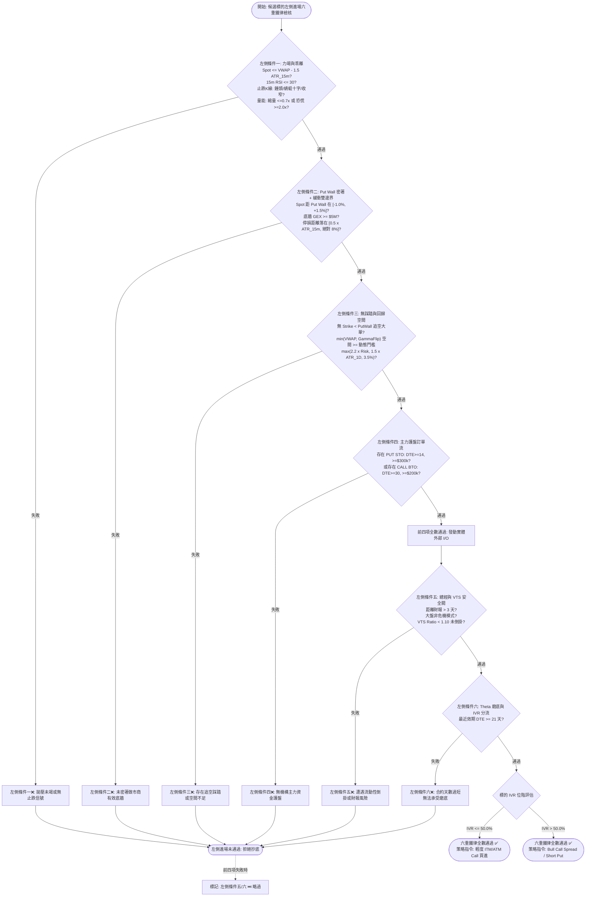

# 左側均值回歸接刀六重鐵律技術規格書

## 1. 核心哲學與適用市場環境

左側逆勢均值回歸交易（Left-Side Mean-Reversion Catching）的哲學在於「在市場陷入非理性極度恐慌、空頭能量耗竭的瞬間，借助做市商底牆的強大被動防護與主力護盤印花，以極高盈虧比（Risk-to-Reward Ratio）建立具有結構防護的部位」。

左側交易最大的致命陷阱在於「接在無底深淵的半空中」。若盲目依靠技術面超賣指標（如純 RSI 或布林通道下軌）抄底，極易遭受做市商在負 Gamma 區間順向砸盤的毀滅性打擊。Nexus Seeker 構建的**左側六重鐵律**（`_confirm_left_entry_signal`）實行嚴格的做市商微觀結構驗證，唯有在空頭拋壓確認衰竭、價格密著龐大 Put Wall、下檔無追空踩踏、主力大額護盤進場、且總經流動性未倒掛時，才獲準以長天期或價差結構進場。

---

## 2. 數學模型與量化推導

### 2.1 左側條件一：結構性空頭力竭與極值乖離確認
此條件要求標的同時滿足「極端負乖離」、「超賣指標力竭」、「K 棒形態拒絕摜壓」與「量能異常」四大要素。

1. **極度負乖離與 RSI 超賣**：
   $$
   \text{Spot} \le \text{SessionVWAP} - \text{\_LEFT\_ENTRY\_VWAP\_ATR\_MULT} \times \text{ATR}_{15m} \quad (\text{倍數} = 1.5)
   $$
   $$
   \text{RSI}_{14} \le \text{\_LEFT\_ENTRY\_RSI\_MAX} = 30.0
   $$

2. **K 棒形態拒絕摜壓演算法 (`_detect_bullish_reversal_candle_pattern`)**：
   - 首先排除「大陰線實體灌破」形態（收盤貼近最低價）：
     $$
     \text{Close} < \text{Open} \land \frac{\text{Close} - \text{Low}}{\text{High} - \text{Low}} < \text{\_LEFT\_ENTRY\_CAPITULATION\_RANGE\_RATIO} = 0.10
     $$
     若此式成立，代表拋壓仍在加速釋放，嚴禁進場。
   - 必須出現以下三者之一的止跌訊號：
     - **(a) 錘頭線 / Pin Bar**：
       $$
       \text{Lower Wick} \ge \text{Body} \times \text{\_LEFT\_ENTRY\_PIN\_BAR\_WICK\_RATIO} \quad (1.5) \land \text{Body} > 0
       $$
     - **(b) 蜻蜓十字 (Dragonfly Doji)**：針對實體趨近於零時錘頭公式退化之防呆修正，以全距比例判定：
       $$
       \text{Body} \le (\text{High} - \text{Low}) \times 0.10 \land \text{Lower Wick} \ge (\text{High} - \text{Low}) \times 0.60
       $$
     - **(c) 連續 2 根實體收窄且未破前低**：孕線雛形代理，顯示下殺動能收斂。

3. **量能特徵（二擇一通過）**：
   - **縮量窒息**：賣盤竭盡，$\text{Volume}_{15m} \le \overline{\text{Volume}}_{20} \times \text{\_LEFT\_ENTRY\_VOLUME\_EXHAUST\_MULT} = 0.7$。
   - **恐慌吸收**：巨量換手吸籌，$\text{Volume}_{15m} \ge \overline{\text{Volume}}_{20} \times \text{\_LEFT\_ENTRY\_VOLUME\_PANIC\_MULT} = 2.0$ 且未收於最低價區間。

### 2.2 左側條件二：做市商 Put Wall 密著截擊與防禦厚度代理
現價必須精確落入做市商 Put Wall 底牆的磁吸防禦帶之內：
$$
-1.0\% \le \frac{\text{Spot} - \text{PutWall}}{\text{Spot}} \le +1.5\%
$$
- **下界 $-1.0\%$**：允許盤中極短線穿刺洗盤（下影線流動性獵殺）。
- **上界 $+1.5\%$**：嚴禁在離底牆過遠的位置接刀。
- **防禦厚度代理指標**：
  $$
  \text{PutWall GEX Magnitude} \ge \text{\_LEFT\_ENTRY\_PUT\_WALL\_GEX\_PROXY\_THRESHOLD} = \$5,000,000
  $$
  *（註：因即時資料源缺乏單一履約價名目 OI 金額，代碼採用該履約價絕對 GEX 曝險量級作為防禦厚度代理指標）。*

### 2.3 左側條件三：下檔無恐慌踩踏斷崖 + 向上均值回歸空間
1. **下檔追空踩踏過濾**：
   掃描 UOA 清單，嚴禁存在履約價低於 Put Wall 且具備追空特徵的大單：
   $$
   \text{Type} == \text{"PUT"} \land \text{Action} == \text{"BTO"} \land \text{Ratio} > 1.2\text{x} \land \text{Notional} \ge \$200,000 \land \text{Strike} < \text{PutWall}
   $$
2. **向上均值回歸空間門檻（動態自適應）**：
   選取上方第一道關鍵均值回歸阻力位：
   $$
   \text{Reference Level} = \min(\text{SessionVWAP}, \text{GammaFlip})
   $$
   要求向上回歸空間達動態自適應波動率門檻（完整推導見 [`06_dynamic_adaptive_room_threshold.md`](06_dynamic_adaptive_room_threshold.md) 公式 A）：
   $$
   \frac{\text{Reference Level} - \text{Spot}}{\text{Spot}} \ge \max\Big(2.2 \times \text{Risk}_{\text{actual}},\ 1.5 \times \frac{\text{ATR}_{1D}}{\text{Spot}},\ 0.035\Big)
   $$
   $$
   \text{Risk}_{\text{actual}} = \frac{\text{Spot} - (\text{PutWall} - 0.5 \times \text{ATR}_{15m})}{\text{Spot}}
   $$
   $3.5\%$ 自「主要判據」降格為 $\max()$ 中的**絕對底線**——它現在只在 Put Wall 或 ATR 缺失、無從推導風險時才會勝出。

### 2.3.1 左側條件二附加：Liquidity Sweep 緩衝雙邊界
在既有的密著帶與防禦厚度判定之上，額外疊加一道依標的波動率伸縮的緩衝檢查（公式 B，`profile="LEFT"`）：
$$
0.5 \times \frac{\text{ATR}_{15m}}{\text{Spot}} \le \Delta S_{\text{stop}} \le 0.08
$$
左側下界刻意遠低於右側的 $2.5\times$——理由見 §5.2。

### 2.4 左側條件四：主力大額 PUT STO 護盤或長天期 CALL BTO 佈局
必須在 UOA 清單中偵測到以下任一主力真金白銀護盤印花：
1. **機構 PUT STO 賣出開倉護盤**：
   $$
   \text{DTE} \ge 14 \land \text{Ratio} \ge 1.0\text{x} \land \text{Notional Value} \ge \$300,000 \land \text{Strike} \le \text{Spot}
   $$
2. **機構長天期 CALL BTO 底層潛伏**：
   $$
   \text{DTE} \ge 30 \land \text{Ratio} \ge 0.8\text{x} \land \text{Notional Value} \ge \$200,000
   $$

### 2.5 左側條件五：總經流動性危機與財報黑天鵝安全閥
前四項通過後，除檢驗大盤非危機模式及財報避開 3 天外，額外疊加 **VIX 期限結構倒掛防線**：
$$
\text{VTS Ratio} = \frac{\text{VIX}}{\text{VIX3M}} < \text{\_LEFT\_ENTRY\_VTS\_BACKWARDATION\_RATIO} = 1.10
$$
若 $\text{VTS Ratio} \ge 1.10$，代表全市場即期避險成本暴漲，恐慌抛售存在連鎖踩踏風險，禁止左側逆勢接刀。

### 2.6 左側條件六：標的自身 Theta 磨底防禦與 IVR 分流
左側接刀後標的往往需要經歷長達數日的築底震盪，因此對合約選擇有特殊約束：
1. **嚴禁短天期合約**：
   $$
   \text{DTE}_{\text{nearest}} \ge \text{\_LEFT\_ENTRY\_CANDIDATE\_MIN\_DTE} = 21 \quad (\text{天})
   $$
   嚴禁 0–7 DTE 末日合約，合約效期必須承受底部築底的時間磨損。
2. **隱含波動率位階 (IVR) 策略分流架構**：
   - **若 $\text{IVR} \le \text{\_LEFT\_ENTRY\_IVR\_SPREAD_THRESHOLD} = 50.0\%$**：
     波動率處於合理區間，輸出策略指示：`輕度 ITM/ATM Call 買進`。
   - **若 $\text{IVR} > 50.0\%$**：
     標的恐慌拋售導致 IV 劇烈飆升，為防範進場後行情止跌引發的 Vega 崩塌（IV Crush），強制分流輸出：`Bull Call Spread 或 Short Put`，禁止單腳 Call 買方。

---

## 3. 決策邏輯與狀態機 / 流程圖

---

## 4. 關鍵具名常數與物理約束

| 常數名稱 | 數值 / 門檻 | 物理 / 代碼約束 | 程式碼檔案路徑 |
| :--- | :--- | :--- | :--- |
| `_LEFT_ENTRY_VWAP_ATR_MULT` | `1.5` | 左側負乖離倍數：$\text{VWAP} - 1.5 \times \text{ATR}_{15m}$ | `nexus_core/market_analysis/dynamic_rollover/constants.py` |
| `_LEFT_ENTRY_RSI_MAX` | `30.0` | 左側 15m RSI 最高超賣門檻 | `nexus_core/market_analysis/dynamic_rollover/constants.py` |
| `_LEFT_ENTRY_PIN_BAR_WICK_RATIO` | `1.5` | 錘頭下影線長度與實體之最低比值 | `nexus_core/market_analysis/dynamic_rollover/constants.py` |
| `_LEFT_ENTRY_DOJI_BODY_RANGE_RATIO` | `0.10` | 蜻蜓十字實體佔全距之最高上限 | `nexus_core/market_analysis/dynamic_rollover/constants.py` |
| `_LEFT_ENTRY_DRAGONFLY_WICK_RANGE_RATIO` | `0.60` | 蜻蜓十字下影線佔全距之最低下限 | `nexus_core/market_analysis/dynamic_rollover/constants.py` |
| `_LEFT_ENTRY_VOLUME_EXHAUST_MULT` | `0.7` | 縮量窒息門檻：$\le \overline{\text{Volume}}_{20} \times 0.7$ | `nexus_core/market_analysis/dynamic_rollover/constants.py` |
| `_LEFT_ENTRY_VOLUME_PANIC_MULT` | `2.0` | 恐慌吸收門檻：$\ge \overline{\text{Volume}}_{20} \times 2.0$ | `nexus_core/market_analysis/dynamic_rollover/constants.py` |
| `_LEFT_ENTRY_CAPITULATION_RANGE_RATIO` | `0.10` | 大陰線實體灌破判定比例 $(\text{Close}-\text{Low})/(\text{High}-\text{Low})$ | `nexus_core/market_analysis/dynamic_rollover/constants.py` |
| `_LEFT_ENTRY_PUT_WALL_LOWER_PCT` | `-0.01` ($-1.0\%$) | 現價跌破 Put Wall 允許下穿洗盤下界 | `nexus_core/market_analysis/dynamic_rollover/constants.py` |
| `_LEFT_ENTRY_PUT_WALL_UPPER_PCT` | `0.015` ($+1.5\%$) | 現價高於 Put Wall 允許密著吸附上界 | `nexus_core/market_analysis/dynamic_rollover/constants.py` |
| `_LEFT_ENTRY_PUT_WALL_GEX_PROXY_THRESHOLD` | `$5,000,000.0` | 做市商 Put Wall 防禦厚度代理門檻（GEX 曝險量級） | `nexus_core/market_analysis/dynamic_rollover/constants.py` |
| `_LEFT_ENTRY_UOA_CHASE_RATIO_THRESHOLD` | `1.2` | 追空踩踏 PUT BTO 的 Volume/OI 門檻 | `nexus_core/market_analysis/dynamic_rollover/constants.py` |
| `_LEFT_ENTRY_UOA_CHASE_MIN_PREMIUM_USD` | `$200,000.0` | 追空踩踏 PUT BTO 的最低權利金金額 | `nexus_core/market_analysis/dynamic_rollover/constants.py` |
| `_ROOM_RISK_MULTIPLIER` / `_ROOM_ATR_1D_MULTIPLIER` / `_ROOM_ABSOLUTE_FLOOR_PCT` | `2.2` / `1.5` / `0.035` | 動態空間門檻三項；取代退役的 `_LEFT_ENTRY_ASYMMETRIC_ROOM_PCT` 固定 $3.5\%$ | `nexus_core/market_analysis/room_threshold.py` |
| `_BUFFER_LOWER_MULTIPLIERS["LEFT"]` | `0.5` | 條件二停損距離下界倍率；**必須 $\le$ 停損墊片倍數**（見 §5.2） | `nexus_core/market_analysis/room_threshold.py` |
| `_LEFT_ENTRY_PUT_STO_MIN_DTE` | `14` | 主力護盤 PUT STO 最低到期天數 | `nexus_core/market_analysis/dynamic_rollover/constants.py` |
| `_LEFT_ENTRY_PUT_STO_MIN_RATIO` | `1.0` | 主力護盤 PUT STO 最低 Volume/OI 比值 | `nexus_core/market_analysis/dynamic_rollover/constants.py` |
| `_LEFT_ENTRY_PUT_STO_MIN_NOTIONAL_USD` | `$300,000.0` | 主力護盤 PUT STO 最低名目金額 | `nexus_core/market_analysis/dynamic_rollover/constants.py` |
| `_LEFT_ENTRY_CALL_BTO_MIN_DTE` | `30` | 機構底層潛伏 CALL BTO 最低到期天數 | `nexus_core/market_analysis/dynamic_rollover/constants.py` |
| `_LEFT_ENTRY_CALL_BTO_MIN_RATIO` | `0.8` | 機構底層潛伏 CALL BTO 最低 Volume/OI 比值 | `nexus_core/market_analysis/dynamic_rollover/constants.py` |
| `_LEFT_ENTRY_CALL_BTO_MIN_NOTIONAL_USD` | `$200,000.0` | 機構底層潛伏 CALL BTO 最低名目金額 | `nexus_core/market_analysis/dynamic_rollover/constants.py` |
| `_LEFT_ENTRY_VTS_BACKWARDATION_RATIO` | `1.10` | 左側 VIX 期限結構倒掛防禦門檻 | `nexus_core/market_analysis/dynamic_rollover/constants.py` |
| `_LEFT_ENTRY_CANDIDATE_MIN_DTE` | `21` | 左側接刀合約最低 DTE（嚴禁 0–7 DTE 承受磨底） | `nexus_core/market_analysis/dynamic_rollover/constants.py` |
| `_LEFT_ENTRY_IVR_SPREAD_THRESHOLD` | `50.0` ($50\%$) | 強制改用 Bull Call Spread / Short Put 之 IVR 門檻 | `nexus_core/market_analysis/dynamic_rollover/constants.py` |

---

## 5. 邊界條件、風控熔斷與例外處理

1. **蜻蜓十字形態之數學防呆修正**：
   在傳統錘頭判定中，公式為 $\text{Lower Wick} \ge \text{Body} \times 1.5$。當實體趨近於零時，任何非負數皆大於等於零，此公式將退化為恆真，甚至把長上影線的墓碑十字（Bearish Gravestone Doji）誤判為反轉信號。代碼在引入 `body > 0` 排除墓碑十字的同時，透過全距比例門檻（`_LEFT_ENTRY_DOJI_BODY_RANGE_RATIO` 與 `_LEFT_ENTRY_DRAGONFLY_WICK_RANGE_RATIO`）單獨補足蜻蜓十字判定，消除數學邊界奇異點。
2. **左側緩衝必須量停損距離，不可量牆距**：
   條件二的本質就是要求現價**密著** Put Wall（密著帶 $[-1.0\%, +1.5\%]$），牆距在設計上趨近於零。若對左側也採用右側的牆距量測，下界 $1.0 \times \text{ATR}_{15m}$（典型約 $1.2\%$）會把「現價正好貼齊 Put Wall」這個教科書級的理想進場點直接判為緩衝過窄，只留下密著帶裡 $[1.2\%, 1.5\%]$ 的一條縫，等於讓左側六重鐵律近乎永遠無法通過條件二。故左側剖面改量停損距離：
   $$
   \Delta S_{\text{stop}} = \frac{\text{Spot} - (\text{PutWall} - 0.5 \times \text{ATR}_{15m})}{\text{Spot}}
   $$
   **下界 $0.5$ 與停損墊片 $0.5$ 是一條強制不變式**：現價正好貼齊 Put Wall（$\Delta S_{\text{wall}} = 0$）時，停損距離**恆等於** $0.5 \times \text{ATR}_{15m}$。下界一旦大於它，就會把該策略的設計中心點本身判為過窄——那不是過濾風險，是刪掉策略。設為 $0.5$ 之後，這道閘門的語意收斂成一句可驗證的話：「允許貼牆，但不允許現價已經跌到停損線附近」，仍能正確擋下現價穿刺 Put Wall、停損就在腳邊的情境。此不變式有單元測試鎖定。
3. **舊版盈虧比校準缺陷已由動態門檻消除**：
   舊版固定 $3.5\%$ 門檻附有一段校準備註坦承：在停損設於 Put Wall 下方 $1.0\%$ 的假設下，只有現價貼齊 Put Wall（偏離 $\le 0.168\%$）時風報比才達 $3:1$；在密著帶允許的上界 $+1.5\%$ 處實際風報比僅 $1.41:1$。而該「Put Wall 下方 $1\%$」的停損**從未實作**——左側部位走的是 `anti_washout.py` 的錨點停損體系。改用動態門檻後，密著帶內任一位置的盈虧比都由 $2.2 \times \text{Risk}_{\text{actual}}$ 直接保證，該缺陷不復存在，原校準備註已隨常數一併移除。
4. **UOA 逐筆成交時間戳之代碼代理性揭露**：
   由於市場選擇權爬蟲提供的是當日累積的 Volume 與前日 OI 快照，而非即時 Tick Tape，因此代碼未對條件四的主力單進行「4 小時時間戳」過濾，而是仰賴時段正規化指標 `paced_ratio` 確保異常度的統計穩定性。
5. **IV 泡沫下的賣方保護**：
   若標的 IVR 飆升至極端水準，條件六強制拒絕單純的買方開倉，自動分流為垂直價差或賣方策略，杜絕在隱波頂點接刀後遭遇雙殺。

---

## 6. 核心程式碼檔案路徑關聯

- `nexus_core/market_analysis/dynamic_rollover/left_side_entry.py`：
  - 核心檢核入口：`_confirm_left_entry_signal()`（第 531–580 行）
  - K 棒形態識別：`_detect_bullish_reversal_candle_pattern()`（第 44–113 行）
  - 條件一實作：`_confirm_left_entry_condition1_exhaustion_reversal()`（第 115–228 行）
  - 條件二實作：`_confirm_left_entry_condition2_put_wall_test()`（第 230–285 行）
  - 條件三實作：`_confirm_left_entry_condition3_no_panic_cliff()`（第 287–360 行）
  - 條件四實作：`_confirm_left_entry_condition4_smart_money_absorption()`（第 362–424 行）
  - 條件五實作：`_confirm_left_entry_condition5_macro_earnings_vts_gate()`（第 426–472 行）
  - 條件六實作：`_confirm_left_entry_condition6_candidate_dte_ivr()`（第 474–529 行）
- `nexus_core/market_analysis/dynamic_rollover/constants.py`：具名常數 `_LEFT_ENTRY_*`
- `nexus_core/market_analysis/dynamic_rollover/opportunity_cost.py`：條件五共用總經/財報檢查
- `nexus_core/services/market_data_service.py`：`get_vix_term_structure()`, `get_all_option_expiries()`
- `nexus_core/market_analysis/price_volume_alert.py`：`trim_to_confirmed_15m_bars()`
