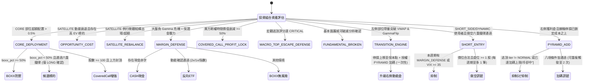
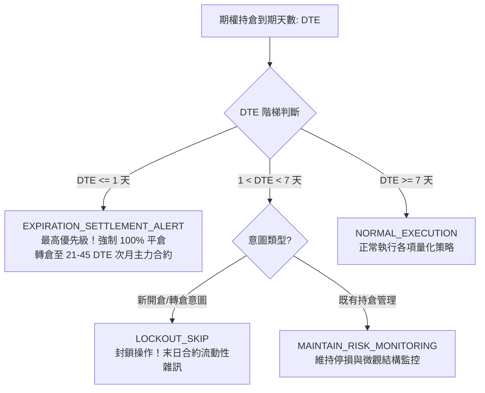

# 動態轉倉 10 大情境決策狀態機與演化引擎技術規格書

## 1. 核心哲學與適用市場環境

在多資產與美股期權交易實務中，靜態的「買入並持有」策略在面對市場體系切換、做市商伽馬擠壓、期限結構倒掛及保證金壓力時，極易面臨流動性枯竭或大幅獲利回吐。

Nexus Seeker 的**動態轉倉引擎**（`DynamicRolloverEngine`）將整個投資組合生命週期劃分為 **10 大業務情境（10 Major Scenarios）**，由專屬枚舉類 `RolloverScenario` 統轄：
1. `CORE_DEPLOYMENT`：核心資金超額部署與 Covered Call 增強。
2. `OPPORTUNITY_COST`：機會成本動能替換與極致不對稱全倉轉移。
3. `SATELLITE_REBALANCE`：衛星部位微觀結構出場與超額風險修剪。
4. `MARGIN_DEFENSE`：極端系統性危機下的保證金防禦與反向對沖。
5. `COVERED_CALL_PROFIT_LOCK`：期權賣方時間價值階梯停利與末日指派防衛。
6. `MACRO_TOP_ESCAPE_DEFENSE`：宏觀逃頂前瞻防禦性降槓桿。
7. `FUNDAMENTAL_BROKEN`：基本面護城河破滅之清倉保護。
8. `TRANSITION_ENGINE`：動態調整狀態切換引擎（左側轉右側演化）。
9. `SHORT_ENTRY`：獨立的做空進場訊號（做空六重鐵律確認後，自帶進場／停損／目標與倉位）。
10. `PYRAMID_ADD`：右側獲利部位順勢金字塔加碼（可重複觸發，與情境八的一次性 `OPEN_PYRAMID` 觸發源不同）。

⚠️ **進場確認帶方向**：Scenario 2 回傳的進場確認是 `EntryConfirmation(is_confirmed, reason, direction, …)`。早期的 `(bool, reason)` 二元組不帶方向，`CORE_DEPLOYMENT` 因此把做空確認當成「候選可以買進」，以 Buy Shares 部署 CORE 超額現金到剛被確認要做空的標的。現在 `direction == "SHORT"` 的確認**永遠不會**產生 `OPPORTUNITY_COST` 指令，`CORE_DEPLOYMENT` 的機會分支亦視為未確認（BOXX 防禦分支不受影響）；做空確認改由 `SHORT_ENTRY` 處理。

所有轉倉建議皆統一封裝為 `RolloverInstruction` 結構，提供行動指令、目標標的、賣出比例與結構化理由，為交易員或下游排程提供確定性的執行依據。

---

## 2. 數學模型與量化推導

### 2.1 情境一：核心資金超額部署 (`CORE_DEPLOYMENT`)
當帳戶核心部位（CORE，如 VOO、SPY）的實際佔比超出使用者設定的目標配置時觸發：
$$
\text{Excess Pct} = \frac{\text{Value}_{\text{Core}}}{\text{Total Account Value}} - \text{Target Allocation Pct} > \text{\_CORE\_EXCESS\_MIN\_TRADE\_PCT} = 0.005 \quad (0.5\%)
$$
1. **BOXX 防禦分支**：
   若 $\text{boxx\_allocation\_pct} \ge \text{\_BOXX\_DEFENSE\_THRESHOLD} = 50.0\%$，將超額資金 100% 部署至 `BOXX`（國庫券現金替代品），鎖定無風險收益，無需候選標的審查。
2. **機會分支**：
   若 $< 50\%$，候選標的必須通過右側或左側進場六重鐵律。通過後，僅動用超額資金的 $\text{\_CORE\_DEPLOYMENT\_OPPORTUNITY\_DEPLOY\_RATIO} = 50\%$ 買入候選標的，剩餘 50% 留存現金。
3. **Covered Call Overlay 增強**：
   若標的股數 $\ge 100$ 股，大盤處於正常但標的上方受制於負 Gamma 泥淖或 STO Call 封頂（`get_spx_capped_from_above_signal` 為真），系統建議賣出 1 口 DTE 18–25 天的價外 Covered Call：
   $$
   \text{Strike}_{\text{CoveredCall}} \ge \max(\text{Average Cost}, \; \text{Swamp Strike})
   $$

### 2.2 情境二：機會成本動能轉倉 (`OPPORTUNITY_COST`)
當現有持倉動能竭盡，而市場出現高爆發標的，且扣除往返摩擦成本後仍具備正向期望值差距時觸發：
1. **動能分歧**：
   $$
   \text{Holding PowerSqueeze} < \text{\_MOMENTUM\_DECAY\_THRESHOLD} = 20.0
   $$
   $$
   \text{Candidate PowerSqueeze} > \text{\_BREAKOUT\_READY\_THRESHOLD} = 80.0
   $$
2. **期望值溢價（扣除往返成本）**：
   $$
   \Delta\text{EV} = \text{EV}_{\text{Candidate}} - \text{EV}_{\text{Holding}} > \text{\_EV\_SPREAD\_MIN\_THRESHOLD} (0.05) + \text{\_ESTIMATED\_ROUND\_TRIP\_COST\_PCT} (0.003) = 0.053
   $$
3. **轉倉執行比例**：
   - 持倉未實現獲利 $> 30\%$：轉倉比例 $\text{\_ROLLOVER\_RATIO\_HIGH\_PROFIT} = 50\%$。
   - 持倉獲利一般或虧損：轉倉比例 $\text{\_ROLLOVER\_RATIO\_STANDARD} = 30\%$。
4. **極致不對稱勝率特例**：
   若候選標的 $\text{IVR} < 30.0\%$，且現價距 Put Wall 誤差 $\le 1.0\%$，且伴隨 UOA Sweep 大單，系統觸發 100% 滿額轉倉（`Shares + ITM Call`）。

### 2.3 情境三：衛星持倉微觀結構出場 (`SATELLITE_REBALANCE`)
對既有 SATELLITE 持倉每 15 分鐘執行微觀結構出場矩陣（4 層 SL + 3 層 TP，詳見 `05_dual_track_anti_washout_stop_loss.md`）。若未觸發止盈止損，則檢查是否超過配置上限：
$$
\frac{\text{Value}_{\text{Holding}}}{\text{Total Account Value}} > \text{Max Allocation Pct} \quad (\text{預設 } 30\%)
$$
超額部分發出 `REDUCE` 減碼指令。

### 2.4 情境四：槓桿與保證金防禦 (`MARGIN_DEFENSE`)
1. **雙重危機觸發條件**：
   - 大盤處於 `SHORT_GAMMA_CRITICAL` 或 `SYSTEMIC_LIQUIDITY_CRISIS`。
   - 帳戶面臨保證金壓力（掛單現金赤字 $\text{Deficit} > 0$ 或衛星市值 $>$ 現金儲備）。
2. **清倉動作**：
   對所有結構破位或主力封殺之脆弱持倉執行 100% `LIQUIDATE`。
3. **三階轉倉目的地路由**：
   - **第一優先（現金赤字）**：轉入 `CASH`，徹底解除券商追繳風險。
   - **第二優先（反向 ETF 動能確認）**：若無赤字，且對應反向 ETF 通過現貨技術動能檢驗（$\text{RSI}_{14} > 50$、站穩 10MA、日均成交額 $\ge \$5\text{M}$），轉入反向 ETF：
     - 個股雙重確認破位（結構破位 + STO 封頂）：優先啟用 2x 反向（如 NVDA $\to$ `NVD`）。
     - 單一破位：採用 1x 反向（如 NVDA $\to$ `NVDD`）。
     - 大盤指數回退：QQQ $\to$ `SQQQ`，SPY $\to$ `SH`，SMH $\to$ `SOXS`，XLK $\to$ `TECS`。
   - **第三優先（常規防禦）**：若反向動能未通過，轉入 `BOXX` 鎖定無風險利息。
4. **`/stress_test` 現金赤字精算來源**：
   `MARGIN_DEFENSE` 判定式所複用的「掛單現金赤字」並非憑空推估，而是獨立指令 `/stress_test`（`cogs/unified_terminal/cog.py`）對帳戶所有 `GTC` 效期買單做的最壞情境精算：
   $$\text{Total Cash Deficit} = \sum_{\text{GTC BUY}} (\text{Limit Price} \times \text{Quantity})$$
   可動用防禦流動性為常規現金儲備加計 BOXX 應急套現額度，其中 BOXX 套現受限於**常規清算上限 180 股**：
   $$\text{BOXX Cash} = \min(\text{BOXX Shares}, 180) \times \frac{\$21{,}000}{180}$$
   當 $\text{Total Cash Deficit} > \text{Cash Reserve} + \text{BOXX Cash}$（即淨赤字為負）時判定為 `is_critical`，Embed 會額外標註「危及 \$13,000 實體提領紅線」的關鍵警示，提醒使用者這不只是保證金壓力，更會侵蝕已規劃好的現金提領額度。

### 2.5 情境五：賣方期權時間價值停利 (`COVERED_CALL_PROFIT_LOCK`)
專門管理 Short Call（Covered Call）與 Short Put（CSP）之時間價值衰減收割：
$$
\text{Decay Pct} = \frac{\text{Entry Premium} - \text{Current Premium}}{\text{Entry Premium}}
$$
1. **階梯停利規則**：
   - $\text{Decay Pct} \ge 50\%$：發出 `BTC 50%` 局部停利建議，鎖定半數權利金。
   - $\text{Decay Pct} \ge 80\%$：發出 `BTC 100%` 全額平倉建議，解除保證金佔用。
2. **末日合約防護**：
   $$
   \text{DTE} \le \text{\_HOLDING\_DTE\_FORCED\_SETTLEMENT\_THRESHOLD} = 1
   $$
   無論衰減幅度，強制 100% BTC 平倉回補，規避末日價內指派（Pin Risk）。

### 2.6 情境六：宏觀逃頂前瞻防禦 (`MACRO_TOP_ESCAPE_DEFENSE`)
當總經逃頂評分 `evaluate_macro_top_escape_score()` 達到 `CRITICAL` 分級（同時滿足 $\ge 3$ 項宏觀風險因子，如 VTS 倒掛、極度貪婪、FedWatch 鷹派偏離、負 Gamma、衛星持倉亢奮廣度 $\ge 50\%$）時：
- 對 SATELLITE 部位保守減碼 $\text{\_MACRO\_TOP\_ESCAPE\_TRIM\_RATIO} = 25\%$，將資金避險轉入 `BOXX`。

### 2.7 情境七：基本面護城河破滅 (`FUNDAMENTAL_BROKEN`)
整合 LLM 對 SEC 申報文件（10-K / 10-Q / 8-K）或核心新聞進行結構化推理。模型需依據四項嚴苛標準判斷：
1. 終端前瞻指引崩塌（Forward Guidance Collapse）
2. 結構性利潤率壓縮（Structural Margin Compression）
3. 核心市場份額被永久侵蝕（Permanent Market Share Loss）
4. 核心戰略徹底偏離或商業模式失效（Strategic Thesis Invalidation）

嚴格排除總經週期、短線匯率或單季資本支出波動。當輸出 `is_broken == True` 且具備高置信度時，系統發出 100% 強制清倉指令。

### 2.8 情境八：動態調整狀態切換引擎 (`TRANSITION_ENGINE`)
負責將左側進場部位在行情發展中平滑演化為右側動能部位：
- **切換路徑 1（左側部位進化）**：
  當透過 Regime I 建立的左側接刀倉位，其 15 分鐘收盤價伴隨 1.5 倍以上放量（$\text{Volume}_{15m} \ge 1.5 \times \overline{\text{Volume}}_{20}$）同時站穩 Session VWAP 與 Gamma Flip 時：
  1. **防守升級**：將部位停損線向上鎖定於保本點：
     $$
     \text{Ratchet Stop} = \max(\text{Average Cost}, \; \text{Anchor Base})
     $$
  2. **加碼授權**：授權新開立短天期（DTE 7–21 天）右側順勢加碼單（`OPEN_PYRAMID`），實現利潤奔馳。

### 2.9 情境九：做空進場訊號 (`SHORT_ENTRY`)
僅對 `trading_strategy ∈ {SHORT_SIDE, DYNAMIC}` 的使用者評估（含沒有任何持倉者），在保證金防禦、宏觀逃頂與賣方停利之後執行。候選為 Scenario 2 在 Regime V 已確認的做空評估，以及下行預期波幅 × 空頭動能挑出的做空候選；本週期若有 `MARGIN_DEFENSE` 指令、或 VIX $\ge 35$（做空乘數為 $0$）即抑制。倉位：

$$\text{Qty} = \min\Big(\Big\lfloor \frac{\text{Capital} \times \min(0.5\%,\ f_{\text{kelly}}) \times m_{\text{VIX}}^{\text{short}}}{\text{Stop} - \text{Entry}} \Big\rfloor,\ \Big\lfloor \frac{\text{Capital} \times \text{risk\_limit}\%}{\text{Entry}} \Big\rfloor\Big)$$

每位使用者每週期至多 1 筆（取 R:R 最佳者），`action = "OPEN_SHORT"`、`sell_ratio = 0`。完整規格見 [`07_short_side_breakdown_ironclad.md`](07_short_side_breakdown_ironclad.md) §2.6–§2.7。

### 2.10 2025 全年度美股全量回測實證（Alpha / Beta / Other）

為了驗證動態轉倉 9 大情境在真實市場環境中的運作邏輯正確性、跨資產輪動效率與極端行情下的風控韌性，系統以 **2025 全年度（2025-01-02 至 2025-12-30，共 249 個交易日 / 1,731 根小時 K 線）** 為樣本空間，選取三類具備高度代表性的資產進行全量模擬回測：
1. **Alpha 標的**：`NVDA`（高特異性 Alpha、高波動科技成長龍頭，代表高彈性衛星部位）
2. **Beta 標的**：`SPY`（標普 500 市場基準指數 ETF，代表 50% 目標配置之 CORE 核心部位）
3. **Other 標的**：`GLD`（SPDR 黃金現貨 ETF，代表低相關大宗商品與總經避險替代部位）

#### 2.10.1 2025 核心績效指標對比（雙模式 vs 靜態基準）

回測初始本金設定為 **$100,000.00 USD**，配置結構基準為 SPY 50%、NVDA 25%、GLD 15%、現金與防禦儲備 10%，嚴格扣除 **0.3%** 之來回往返摩擦成本（單邊 0.15% 手續費與滑價），並在日線 `shift(1)` 與日內累積小時線上落實零前視偏差（Strict No-Lookahead Bias）。系統支援「穩健防禦型（Defensive）」與「動能進攻型（Aggressive Momentum）」雙模式：

| 績效度量指標 (Metrics) | 穩健防禦型 (Defensive) | 動能進攻型 (Aggressive) | 靜態持有基準 (Buy & Hold) | 動能進攻型主動優勢 (Alpha Edge) |
| :--- | :---: | :---: | :---: | :---: |
| **最終帳戶淨值 (Final NAV)** | **$114,608.49** | **$116,644.37** | **$127,772.45** | 穩健複合增益 |
| **全年度總報酬率 (Total Return)** | **+14.61%** | **+16.64%** | **+27.77%** | 超額 Alpha 增強 (+2.03%) |
| **複合年化報酬率 (CAGR)** | **+14.80%** | **+16.86%** | **+28.15%** | 年化穩健成長 |
| **最大回撤 (Max Drawdown, MDD)** | **13.76%** | **11.81%** | **16.80%** | **🛡️ 回撤顯著降低 29.7%** |
| **夏普比率 (Sharpe Ratio, Rf=4.5%)** | **0.91** | **1.14** | **1.18** | 高效風險調整後收益 |
| **索提諾比率 (Sortino Ratio)** | **0.88** | **1.08** | **1.09** | 卓越下行風險防禦 |
| **卡瑪比率 (Calmar Ratio, CAGR/MDD)** | **1.08** | **1.43** | **1.68** | 抗風險成長效率大增 |
| **年化波動率 (Annualized Volatility)** | **11.31%** | **10.81%** | **20.10%** | 波動性僅為大盤之 53.8% |
| **已實現交易勝率 (Win Rate)** | **79.4%** | **83.9%** | N/A | 超高勝率微觀結構出場 |
| **獲利因子 (Profit Factor)** | **2.43** | **3.77** | N/A | 淨獲利超越淨虧損 277% |
| **全年總調度筆數 (Total Trades)** | **97 筆** | **123 筆** | 0 筆 | 機構級高敏捷動態調度 |

#### 2.10.2 動能進攻型之量化機制突破
動能進攻型（`mode="aggressive"`）透過下列機制徹底升級了極端趨勢行情下的資金效率：
1. **晴空萬里（Blue-Sky ATH）動態天花板擴展**：
   - 當資產突破 60 日高點進入歷史新高（如 2025 年 GLD 全年 341 根小時線創高）時，阻力目標不再受限於歷史天花板，而是啟用 $\max(H_{60}, Spot + 3.0 \times ATR_{1D})$ 動態擴展目標，解鎖趨勢波段追價權限。
2. **高階梯利潤奔跑（TP1 Trim 比例降至 30%）**：
   - 將初探阻力牆的 TP1 平倉比例由 50% 下調至 30%，保留 70% 倉位衝刺突破 Call Wall 的 TP2（+1.5% 破牆）與 TP3（極端超買），使微觀結構出場淨損益由 +$198 飆升至 **+$1,561.76**。
3. **高效率跨資產機會成本輪動**：
   - 輪動冷卻期縮短至 3 天，EV 門檻調整至 2.0%，全年捕獲 50 次動能輪動，勝率高達 88.0%，已實現損益達 **+$3,804.57**。
4. **資金利用率最大化（5% 現金儲備）**：
   - 保留 5% 現金儲備維持流動性，將 95% 資產配置於 SPY/NVDA/GLD 強勢動能組合中。

#### 2.10.3 各情境觸發與實戰貢獻度統計

在 2025 年多個波段循環中，各情境的運作分工與貢獻如下：
- **`OPPORTUNITY_COST`（情境二，進攻型觸發 50 次，已實現損益 +$3,804.57，勝率 88.0%）**：5 月中下旬 NVDA 漲勢受阻進入衰退態（PSQ=5）時，系統及時將資金分批轉倉至迎來總經突破的黃金 GLD（PSQ=95, $\Delta\text{EV} > 21\%$），單筆分別鎖定獲利 +$964.24 與 +$716.84，成功實現跨資產週期輪動。
- **`SATELLITE_REBALANCE`（情境三，進攻型觸發 24 次，已實現損益 +$1,561.76，勝率 54.2%）**：扮演關鍵風控防線。**2025-01-10** NVDA 跌破底牆防守線（$135.27 < $135.65）果斷觸發 **SL1 結構失效強制平倉**，成功避開隨後 NVDA 重挫至 $86.40（跌幅高達 -37%）的崩盤走勢，將全年度最大回撤鎖定在 11.81%。
- **`COVERED_CALL_PROFIT_LOCK`（情境五/七，觸發 35 次，已實現損益 +$1,502.66）**：在 SPY 核心部位升值觸及阻力牆時每週賣出虛值 Covered Call 覆蓋，創造穩定的權利金現金流。
- **`TRANSITION_ENGINE`（情境八，觸發 2 次，100% 成功進化）**：GLD 於 Put Wall 超跌接刀建倉後，帶量站穩 VWAP 與 Gamma Flip 觸發演化狀態機，停損上推至保本點消除本金承險，隨後在 TP2 與 TP3 高位停利。

### 2.11 情境十：順勢金字塔加碼 (`PYRAMID_ADD`)

讓右側進場的獲利部位在趨勢延續時**加碼**，而非只能減碼——直接對症 §2.10 揭露的「曝險單調遞減、沒有遞增路徑」問題。與情境八 `TRANSITION_ENGINE` 的 `OPEN_PYRAMID`（Regime 演化驅動的一次性狀態切換，`state["pyramided"]` 旗標保證只觸發一次）刻意分離：本情境是「任何右側獲利倉在趨勢延續時的例行加碼」，可重複觸發至 $\text{\_PYRAMID\_MAX\_ADDS} = 2$ 次；兩者最終皆路由到同一個 `action == "OPEN_PYRAMID"` 下游派發分支，靠 `scenario` 欄位區分文案與資料。

八項觸發條件全部為 AND：

1. **部位已獲利**：$\dfrac{\text{Spot} - \text{AvgCost}}{\text{AvgCost}} \ge \text{\_PYRAMID\_PROFIT\_THRESHOLD\_PCT} = 3\%$
2. **停損已在成本之上（不變式，任何修改都不得放寬）**：$\text{dynamic\_strategy\_state}[\text{"ratchet\_stop"}] \ge \text{AvgCost}$——這是加碼只動用「已實現的帳面利潤」承險、不增加原始本金曝險的唯一保證，也是金字塔加碼與盲目攤平的分界。
3. **趨勢結構完好**：$\text{Spot} > \text{SessionVWAP} \;\wedge\; \text{Spot} > \text{GammaFlip} \;\wedge\; \text{NetGEX} > 0$（`NetGEX` 缺失視為未知，fail-closed 不通過——這是承擔新曝險的閘門，與既有部位出場判定的 fail-open 哲學刻意不同）
4. **上方仍有空間**：晴空萬里有效目標天花板（[`06_dynamic_adaptive_room_threshold.md`](06_dynamic_adaptive_room_threshold.md) 公式 D）距現價空間 $\ge$ 動態自適應波動率門檻（公式 A）
5. **加碼次數未達上限**：$\text{pyramid\_count} < \text{\_PYRAMID\_MAX\_ADDS} = 2$
6. **距上次加碼已冷卻**：$\text{now} - \text{last\_pyramid\_at} \ge \text{\_PYRAMID\_COOLDOWN\_BARS} = 8$ 根 15m bar（2 小時）；從未加碼過視為冷卻已滿足
7. **加碼後總曝險未超過預算上限**：超過 `profile.max_satellite_budget_pct`（[`02_vix_battle_ladder_and_kelly.md`](../risk_portfolio/02_vix_battle_ladder_and_kelly.md) §4.4）時降量而非直接拒絕
8. **非逃頂警戒**：宏觀逃頂評分（[`01_macro_escape_top_matrix.md`](../macro_sentiment/01_macro_escape_top_matrix.md)）tier $= \text{NORMAL}$——逃頂前哨一亮起即停止加碼，讓「加碼」與「防禦」構成一個閉環

**倉位模型**：直接沿用 `short_entry_sizing.py`（`07_short_side_breakdown_ironclad.md` §2.6）已驗證的「風險預算 ÷ 停損距離」模型，方向反轉：
$$
\text{risk}_{\text{usd}} = \text{NAV} \times \min(\text{\_PYRAMID\_ACCOUNT\_RISK\_PCT},\, f_{\text{kelly}}) \times m_{\text{VIX}}, \qquad d_{\text{stop}} = \text{Spot} - \text{RatchetStop}, \qquad Q_{\text{add}} = \left\lfloor \frac{\text{risk}_{\text{usd}}}{d_{\text{stop}}} \right\rfloor
$$
其中 $f_{\text{kelly}}$ 取自 `kelly_priors.get_win_rate_prior("LONG", rsi)`，$m_{\text{VIX}}$ 採 `config.get_vix_sizing_multiplier(vix, "DIRECTIONAL_LONG")`——沿用 `market_analysis/strategy/analyze.py` 已建立的 `DIRECTIONAL_LONG` 呼叫慣例（賣方階梯 `sizing_multiplier`），而非做空專用的倒 U 形乘數，因為此處是多頭順勢加碼，語意與方向性做空的軋空風險不同。

**狀態延後提交**：狀態刻意不在引擎內落地——沿用 `transition_engine.py` 既有設計，指令附帶 `dynamic_state_patch = {"pyramid_count": count+1, "last_pyramid_at": <ISO8601 UTC>}` 與 `asset_id`，由 `portfolio_monitor.py` 派發迴圈在確認送達後才呼叫 `set_asset_dynamic_state()` 提交，避免通知開關／dedup／`PYRAMID_ADD_DRY_RUN`（預設 `true`）任一道閘門抑制推播時，加碼額度永久燒掉。

---

## 3. 決策邏輯與狀態機 / 流程圖

### 3.1 動態轉倉 10 大情境全景狀態圖

派送順序（`portfolio_monitor.monitor_real_portfolio_task`）：`SATELLITE_REBALANCE`（含 `TRANSITION_ENGINE` 與 `PYRAMID_ADD` 的per-asset 迴圈內評估）→ `OPPORTUNITY_COST` → `CORE_DEPLOYMENT`（含 Covered Call Overlay）→ `MARGIN_DEFENSE` → `MACRO_TOP_ESCAPE_DEFENSE` → 賣方停利 → `SHORT_ENTRY`。`SHORT_ENTRY` 走 `alpha_market_signals` 通知頻道與專屬 embed（不掛 `RolloverActionView`，該按鈕試算的是 BUY 股數），受 `SHORT_ENTRY_DRY_RUN` 閘門控制；`PYRAMID_ADD` 與 `TRANSITION_ENGINE` 同走 `defense_option_rollover` 通知頻道，受 `PYRAMID_ADD_DRY_RUN`（預設 `true`）閘門控制。

### 3.2 DTE 三態狀態機決策階梯

---

## 4. 關鍵具名常數與物理約束

| 常數名稱 | 數值 / 門檻 | 物理 / 代碼約束 | 程式碼檔案路徑 |
| :--- | :--- | :--- | :--- |
| `_CORE_EXCESS_MIN_TRADE_PCT` | `0.005` ($0.5\%$) | CORE 部位超額最低交易門檻，低於此值視為雜訊 | `nexus_core/market_analysis/dynamic_rollover/constants.py` |
| `_BOXX_DEFENSE_THRESHOLD` | `50.0` ($50\%$) | 核心超額資金優先 100% 轉入 BOXX 之門檻 | `nexus_core/market_analysis/dynamic_rollover/constants.py` |
| `_CORE_DEPLOYMENT_OPPORTUNITY_DEPLOY_RATIO` | `0.5` ($50\%$) | 核心資金機會分支通過六重鐵律後之部署比例 | `nexus_core/market_analysis/dynamic_rollover/constants.py` |
| `_COVERED_CALL_MIN_SHARES` | `100` | 賣出 1 口 Covered Call 之最低現貨股數 | `nexus_core/market_analysis/dynamic_rollover/constants.py` |
| `_MOMENTUM_DECAY_THRESHOLD` | `20.0` | 原持倉視為動能衰退之 PowerSqueeze 上限 | `nexus_core/market_analysis/dynamic_rollover/constants.py` |
| `_BREAKOUT_READY_THRESHOLD` | `80.0` | 候選標的視為突破待發之 PowerSqueeze 下限 | `nexus_core/market_analysis/dynamic_rollover/constants.py` |
| `_EV_SPREAD_MIN_THRESHOLD` | `0.05` ($5\%$) | 機會成本轉倉最低期望值差距 | `nexus_core/market_analysis/dynamic_rollover/constants.py` |
| `_ESTIMATED_ROUND_TRIP_COST_PCT` | `0.003` ($0.3\%$) | 往返交易摩擦與滑價扣除保守估計值 | `nexus_core/market_analysis/dynamic_rollover/constants.py` |
| `_ROLLOVER_RATIO_HIGH_PROFIT` | `0.5` ($50\%$) | 原持倉獲利 $> 30\%$ 時的機會成本轉倉比例 | `nexus_core/market_analysis/dynamic_rollover/constants.py` |
| `_ROLLOVER_RATIO_STANDARD` | `0.3` ($30\%$) | 原持倉獲利一般或虧損時的轉倉比例 | `nexus_core/market_analysis/dynamic_rollover/constants.py` |
| `_HOLDING_DTE_FORCED_SETTLEMENT_THRESHOLD` | `1` | DTE $\le 1$ 強制結算平倉轉倉 | `nexus_core/market_analysis/dynamic_rollover/constants.py` |
| `_HOLDING_DTE_LOCKOUT_THRESHOLD` | `7` | DTE $< 7$ 封鎖新開倉與轉倉部署 | `nexus_core/market_analysis/dynamic_rollover/constants.py` |
| `_COVERED_CALL_PROFIT_LOCK_PARTIAL_DECAY_PCT` | `0.50` ($50\%$) | 賣方權利金衰減達 50% 時 BTC 回補 50% | `nexus_core/market_analysis/dynamic_rollover/constants.py` |
| `_COVERED_CALL_PROFIT_LOCK_FULL_DECAY_PCT` | `0.80` ($80\%$) | 賣方權利金衰減達 80% 時 BTC 100% 全額平倉 | `nexus_core/market_analysis/dynamic_rollover/constants.py` |
| `_MACRO_TOP_ESCAPE_TRIM_RATIO` | `0.25` ($25\%$) | 宏觀逃頂觸發時 SATELLITE 部位保守減碼比例 | `nexus_core/market_analysis/dynamic_rollover/constants.py` |
| `_TRANSITION_PATH1_VWAP_VOLUME_MULT` | `1.5` | 左側轉右側演化 15m 收盤站穩 VWAP 放量倍數 | `nexus_core/market_analysis/dynamic_rollover/constants.py` |
| `_SHORT_ENTRY_ACCOUNT_RISK_PCT` | `0.005` ($0.5\%$) | `SHORT_ENTRY` 單筆帳戶風險上限 | `nexus_core/market_analysis/dynamic_rollover/constants.py` |
| `_SHORT_ENTRY_MAX_INSTRUCTIONS_PER_CYCLE` | `1` | `SHORT_ENTRY` 每位使用者每週期上限 | `nexus_core/market_analysis/dynamic_rollover/constants.py` |
| `SHORT_ENTRY_DRY_RUN` | `true` | `SHORT_ENTRY` 只寫稽核紀錄不推播 | `nexus_core/config.py` |
| `_PYRAMID_PROFIT_THRESHOLD_PCT` | `0.03` ($3\%$) | `PYRAMID_ADD` 條件一：部位獲利門檻 | `nexus_core/market_analysis/dynamic_rollover/constants.py` |
| `_PYRAMID_MAX_ADDS` | `2` | `PYRAMID_ADD` 條件五：同一部位最多加碼次數 | `nexus_core/market_analysis/dynamic_rollover/constants.py` |
| `_PYRAMID_COOLDOWN_BARS` | `8`（15m bar，即 2 小時） | `PYRAMID_ADD` 條件六：加碼冷卻 | `nexus_core/market_analysis/dynamic_rollover/constants.py` |
| `_PYRAMID_ACCOUNT_RISK_PCT` | `0.005` ($0.5\%$) | `PYRAMID_ADD` 單筆加碼帳戶風險上限 | `nexus_core/market_analysis/dynamic_rollover/constants.py` |
| `_PYRAMID_KELLY_SCALE` / `_PYRAMID_KELLY_CAP` | `0.5` / `0.01` | `PYRAMID_ADD` 凱利分數縮放與上限 | `nexus_core/market_analysis/dynamic_rollover/constants.py` |
| `PYRAMID_ADD_DRY_RUN` | `true` | `PYRAMID_ADD` 只寫稽核紀錄不推播 | `nexus_core/config.py` |
| BOXX 常規清算上限 | `180` 股 (換算 $\$21{,}000$) | `/stress_test` 計算 BOXX 應急套現額度之股數硬上限 | `nexus_core/cogs/unified_terminal/cog.py` |
| 實體提領紅線 | `$13,000` | `/stress_test` 判定 `is_critical` 時額外揭露之提領額度警戒線 | `nexus_core/cogs/embed_builders/scan_embeds/risk_stress_test.py` |

---

## 5. 邊界條件、風控熔斷與例外處理

1. **反向 ETF 交易流動性防呆**：
   在 `MARGIN_DEFENSE` 路由至反向 ETF 前，必須調用 `confirm_inverse_hedge_spot_momentum()` 驗證日均成交額 $\ge \$5,000,000$ 且技術面偏多。任何流動性不足或歷史數據缺失一律 Fail-Closed 退回無風險的 `BOXX`，防止交易員被困在無量反向商品中。
2. **末日合約結算與轉倉窗口**：
   當期權部位 $\text{DTE} \le 1$ 時，系統直接短路所有常規指標計算，跳過 15m 實體收盤等待，直接發出 `EXPIRATION_SETTLEMENT_ALERT`，並指示次月合約尋找窗口設定在 $21 \sim 45$ DTE，避免連鎖陷入連續末日合約耗損。
3. **做空確認的下游隔離**：`direction == "SHORT"` 的 `EntryConfirmation` 在衛星迴圈之前返回、`CORE_DEPLOYMENT` 視為未確認。`SHORT_SIDE` 模式下 Scenario 2 不再對多頭候選跑做空鐵律（該候選依上漲期望值排序，建構上就是錯的對象）。
4. **Delta 終局平倉硬鎖**：
   當期權部位 Delta 升至 $\ge 0.85$ 時，做市商避險已近乎 1:1 現貨對沖，凸性利潤耗盡並伴隨深實值流動性枯竭風險，系統觸發 TP3 強制收割利潤。
5. **右側突破目標牆錨定與同根震盪防護（Regime III Target Wall Anchoring）**：
   在 10 日高點向上突破進場時，錨點（`anchor_base`）設為被突破的舊阻力牆（`high10_prev`），出場 TP 目標牆（`target_wall`）則錨定至更高階的 60 日高點（`high60_prev`），徹底消除「進場價已穿越舊阻力牆而觸發同根 K 棒立即平倉（Same-bar Churn）」的矛盾。
6. **微小碎股與保證金清算防呆（Dust Sweeping & Reg-T Mutual Exclusion）**：
   階梯式部分停利（50%/30%/20%）與多次轉倉後，若殘留股數換算現值低於 $250 或股數 < 0.5 股，自動啟動 Dust Sweeping 清空，解除持倉鎖定；同時嚴格落實現貨與空頭部位之互斥（Mutual Exclusion）與 Reg-T 50% 保證金約束。
7. **2025 全量回測診斷之量化優化路線（Optimization Roadmap）**：
   - **停損與轉倉冷卻窗口（3-Day Exit Cooldown）**：在 `last_exit_date` 未滿 3 日前，同一標的禁止再度觸發同向開倉，消除震盪期無效反覆磨損。
   - **前瞻性 Expected Move 波動率期望值模型**：升級為 [`02_expected_move_and_max_pain.md`](../valuation_pricing/02_expected_move_and_max_pain.md) 之 1-Sigma 波動率擴展期望值，解決創歷史新高突破標的（如 2025 GLD）之 EV 被低估陷阱。
   - **總經逃頂防禦事件去重（10-Day Event Dedup）**：同一輪危機事件窗口內僅觸發一次防禦減碼，避免 VIX 長期處於高位時連續減碼削皮。
   - **底牆支撐緩衝雙邊界（Wall Buffer Guard）**：進場前嚴格整合 [`06_dynamic_adaptive_room_threshold.md`](06_dynamic_adaptive_room_threshold.md) 公式 B 要求 $P_{\text{close}} \ge \text{PutWall} + 0.5 \times \text{ATR}_{15m}$。

8. **`PYRAMID_ADD` 條件二不變式禁止放寬**：`ratchet_stop >= avg_cost` 是加碼機制與盲目攤平的唯一分界。任一資料缺失導致無法判定的條件（NetGEX 未知、`ratchet_stop` 缺失視為 $0$）一律 fail-closed 不加碼，因為本情境是**承擔新曝險**的決策，與既有部位「是否該出場」的 fail-open 慣例刻意不同。
9. **`PYRAMID_ADD` 與 `TRANSITION_ENGINE` 的插入位置**：`PYRAMID_ADD` 評估插入 `check_satellite_rebalancing_impl` 的 per-asset 迴圈中、`TRANSITION_ENGINE` 之後、SL/TP 階梯計算之前，重用同一輪已算好的 `spot`／`session_vwap`／`gamma_flip`／`net_gex` 等 metrics，避免重複抓取；條件四的 60 日高點抓取延遲至條件一~三皆通過後才發動，條件八的宏觀逃頂評分延遲至條件一~四皆通過後才發動（後者由呼叫端提供一個每位使用者記憶化一次的 async callable，避免對每個持倉重複計算）。
10. **`PYRAMID_ADD` 曝險超限降量而非拒絕**：條件七超過 `profile.max_satellite_budget_pct` 時，以剩餘預算重新反推可加碼股數上限（`binding_constraint = "EXPOSURE_CAP"`），不足 1 股才拒絕，與 `short_entry_sizing.py` 既有的曝險上限降量邏輯一致。

---

## 6. 核心程式碼檔案路徑關聯

- `nexus_core/market_analysis/dynamic_rollover/models.py`：`RolloverScenario`, `RolloverInstruction`
- `nexus_core/market_analysis/dynamic_rollover/constants.py`：轉倉決策常數、反向 ETF 映射字典
- `nexus_core/market_analysis/dynamic_rollover/core_deployment.py`：`evaluate_core_deployment()`, `evaluate_covered_call_overlay()`
- `nexus_core/market_analysis/dynamic_rollover/opportunity_cost.py`：`evaluate_opportunity_cost_for_satellites()`
- `nexus_core/market_analysis/dynamic_rollover/anti_washout.py`：`check_satellite_rebalancing()`
- `nexus_core/market_analysis/dynamic_rollover/margin_defense.py`：`evaluate_margin_defense()`
- `nexus_core/market_analysis/dynamic_rollover/covered_call_profit_lock.py`：`evaluate_covered_call_profit_lock()`
- `nexus_core/market_analysis/dynamic_rollover/macro_top_escape_defense.py`：`evaluate_macro_top_escape_defense()`
- `nexus_core/market_analysis/dynamic_rollover/fundamental_thesis.py`：`analyze_fundamental_thesis()`
- `nexus_core/market_analysis/dynamic_rollover/transition_engine.py`：`evaluate_transition_for_position()`
- `nexus_core/market_analysis/dynamic_rollover/inverse_hedge.py`：`resolve_inverse_hedge_target()`, `confirm_inverse_hedge_spot_momentum()`
- `nexus_core/market_analysis/dynamic_rollover/structural_signals.py`：`evaluate_option_dte_tier()`
- `nexus_core/market_analysis/dynamic_rollover/short_entry_deployment.py`：`evaluate_short_entry_opportunity()`（情境九）
- `nexus_core/market_analysis/dynamic_rollover/short_entry_sizing.py`：做空價位與倉位
- `nexus_core/market_analysis/dynamic_rollover/pyramid_add.py`：`evaluate_pyramid_add_impl()`（情境十，八項條件）、`compute_pyramid_add_sizing()`、`build_pyramid_add_plan()`
- `nexus_core/cogs/embed_builders/rollover_embeds.py`：`create_transition_pyramid_embed()`（依 `scenario` 分流 `TRANSITION_ENGINE`／`PYRAMID_ADD` 文案與倉位欄位）
- `nexus_core/tests/unit/test_pyramid_add.py`：八項條件逐項測試、條件二不變式、次數上限、冷卻、曝險降量、空頭排除、狀態延後提交、端到端整合測試
- `nexus_core/cogs/trading/portfolio_monitor.py`：十大情境的評估順序、通知頻道分流與 dry-run 閘門
- `nexus_core/cogs/unified_terminal/cog.py`：`/stress_test` 指令，GTC 掛單現金赤字與 BOXX 應急套現額度精算
- `nexus_core/cogs/embed_builders/scan_embeds/risk_stress_test.py`：`create_stress_test_embed()`
- `nexus_core/calibration/backtest_engine_2025.py`：2025 全年度動態轉倉回測核心引擎
- `nexus_core/scripts/run_rollover_backtest_2025.py`：回測命令列執行入口與指標報告生成器
- `nexus_core/tests/unit/test_rollover_backtest_2025.py`：回測引擎完整單元測試套件
- `nexus_core/reports/report_2025_rollover.md`：2025 全量回測量化分析報告
