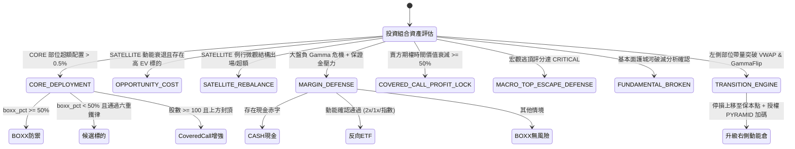
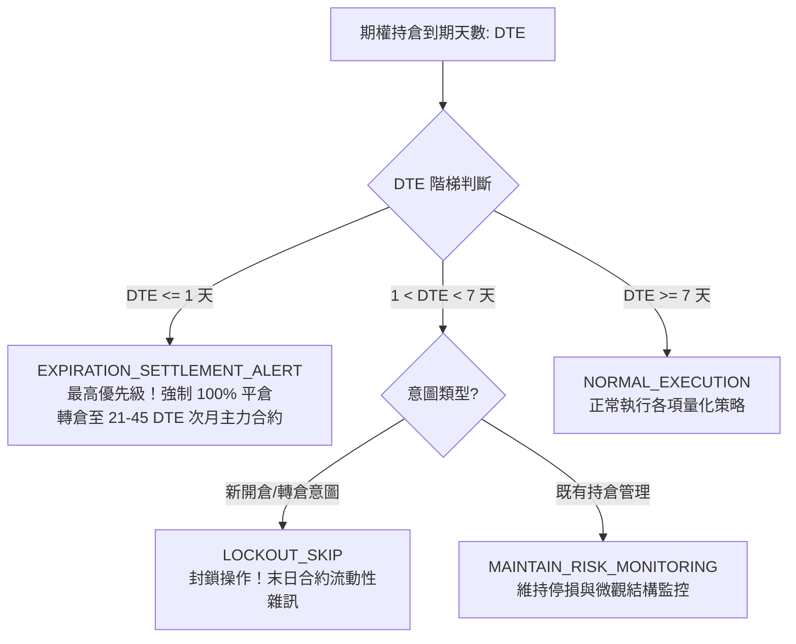

# 動態轉倉 8 大情境決策狀態機與演化引擎技術規格書

## 1. 核心哲學與適用市場環境

在多資產與美股期權交易實務中，靜態的「買入並持有」策略在面對市場體系切換、做市商伽馬擠壓、期限結構倒掛及保證金壓力時，極易面臨流動性枯竭或大幅獲利回吐。

Nexus Seeker 的**動態轉倉引擎**（`DynamicRolloverEngine`）將整個投資組合生命週期劃分為 **8 大業務情境（8 Major Scenarios）**，由專屬枚舉類 `RolloverScenario` 統轄：
1. `CORE_DEPLOYMENT`：核心資金超額部署與 Covered Call 增強。
2. `OPPORTUNITY_COST`：機會成本動能替換與極致不對稱全倉轉移。
3. `SATELLITE_REBALANCE`：衛星部位微觀結構出場與超額風險修剪。
4. `MARGIN_DEFENSE`：極端系統性危機下的保證金防禦與反向對沖。
5. `COVERED_CALL_PROFIT_LOCK`：期權賣方時間價值階梯停利與末日指派防衛。
6. `MACRO_TOP_ESCAPE_DEFENSE`：宏觀逃頂前瞻防禦性降槓桿。
7. `FUNDAMENTAL_BROKEN`：基本面護城河破滅之清倉保護。
8. `TRANSITION_ENGINE`：動態調整狀態切換引擎（左側轉右側演化）。

所有轉倉建議皆統一封裝為 `RolloverInstruction` 結構，提供行動指令、目標標的、賣出比例與結構化理由，為交易員或下游排程提供確定性的執行依據。

---

## 2. 數學模型與量化推導

### 2.1 情境一：核心資金超額部署 (`CORE_DEPLOYMENT`)
當帳戶核心部位（CORE，如 VOO、SPY）的實際佔比超出使用者設定的目標配置時觸發：
$$
\text{Excess Pct} = \frac{\text{Value}_{\text{Core}}}{\text{Total Account Value}} - \text{Target Allocation Pct} > \text{\_CORE\_EXCESS\_MIN\_TRADE\_PCT} = 0.005 \quad (0.5\%)
$$
1. **BOXX 防禦分支**：
   若 $\text{boxx\_allocation\_pct} \ge \text{\_BOXX\_DEFENSE\_THRESHOLD} = 50.0\%$，將超額資金 100% 部署至 `BOXX`（國庫券現金替代品），鎖定無風險收益，無需候選標的審查。
2. **機會分支**：
   若 $< 50\%$，候選標的必須通過右側或左側進場六重鐵律。通過後，僅動用超額資金的 $\text{\_CORE\_DEPLOYMENT\_OPPORTUNITY\_DEPLOY\_RATIO} = 50\%$ 買入候選標的，剩餘 50% 留存現金。
3. **Covered Call Overlay 增強**：
   若標的股數 $\ge 100$ 股，大盤處於正常但標的上方受制於負 Gamma 泥淖或 STO Call 封頂（`get_spx_capped_from_above_signal` 為真），系統建議賣出 1 口 DTE 18–25 天的價外 Covered Call：
   $$
   \text{Strike}_{\text{CoveredCall}} \ge \max(\text{Average Cost}, \; \text{Swamp Strike})
   $$

### 2.2 情境二：機會成本動能轉倉 (`OPPORTUNITY_COST`)
當現有持倉動能竭盡，而市場出現高爆發標的，且扣除往返摩擦成本後仍具備正向期望值差距時觸發：
1. **動能分歧**：
   $$
   \text{Holding PowerSqueeze} < \text{\_MOMENTUM\_DECAY\_THRESHOLD} = 20.0
   $$
   $$
   \text{Candidate PowerSqueeze} > \text{\_BREAKOUT\_READY\_THRESHOLD} = 80.0
   $$
2. **期望值溢價（扣除往返成本）**：
   $$
   \Delta\text{EV} = \text{EV}_{\text{Candidate}} - \text{EV}_{\text{Holding}} > \text{\_EV\_SPREAD\_MIN\_THRESHOLD} (0.05) + \text{\_ESTIMATED\_ROUND\_TRIP\_COST\_PCT} (0.003) = 0.053
   $$
3. **轉倉執行比例**：
   - 持倉未實現獲利 $> 30\%$：轉倉比例 $\text{\_ROLLOVER\_RATIO\_HIGH\_PROFIT} = 50\%$。
   - 持倉獲利一般或虧損：轉倉比例 $\text{\_ROLLOVER\_RATIO\_STANDARD} = 30\%$。
4. **極致不對稱勝率特例**：
   若候選標的 $\text{IVR} < 30.0\%$，且現價距 Put Wall 誤差 $\le 1.0\%$，且伴隨 UOA Sweep 大單，系統觸發 100% 滿額轉倉（`Shares + ITM Call`）。

### 2.3 情境三：衛星持倉微觀結構出場 (`SATELLITE_REBALANCE`)
對既有 SATELLITE 持倉每 15 分鐘執行微觀結構出場矩陣（4 層 SL + 3 層 TP，詳見 `05_dual_track_anti_washout_stop_loss.md`）。若未觸發止盈止損，則檢查是否超過配置上限：
$$
\frac{\text{Value}_{\text{Holding}}}{\text{Total Account Value}} > \text{Max Allocation Pct} \quad (\text{預設 } 30\%)
$$
超額部分發出 `REDUCE` 減碼指令。

### 2.4 情境四：槓桿與保證金防禦 (`MARGIN_DEFENSE`)
1. **雙重危機觸發條件**：
   - 大盤處於 `SHORT_GAMMA_CRITICAL` 或 `SYSTEMIC_LIQUIDITY_CRISIS`。
   - 帳戶面臨保證金壓力（掛單現金赤字 $\text{Deficit} > 0$ 或衛星市值 $>$ 現金儲備）。
2. **清倉動作**：
   對所有結構破位或主力封殺之脆弱持倉執行 100% `LIQUIDATE`。
3. **三階轉倉目的地路由**：
   - **第一優先（現金赤字）**：轉入 `CASH`，徹底解除券商追繳風險。
   - **第二優先（反向 ETF 動能確認）**：若無赤字，且對應反向 ETF 通過現貨技術動能檢驗（$\text{RSI}_{14} > 50$、站穩 10MA、日均成交額 $\ge \$5\text{M}$），轉入反向 ETF：
     - 個股雙重確認破位（結構破位 + STO 封頂）：優先啟用 2x 反向（如 NVDA $\to$ `NVD`）。
     - 單一破位：採用 1x 反向（如 NVDA $\to$ `NVDD`）。
     - 大盤指數回退：QQQ $\to$ `SQQQ`，SPY $\to$ `SH`，SMH $\to$ `SOXS`，XLK $\to$ `TECS`。
   - **第三優先（常規防禦）**：若反向動能未通過，轉入 `BOXX` 鎖定無風險利息。

### 2.5 情境五：賣方期權時間價值停利 (`COVERED_CALL_PROFIT_LOCK`)
專門管理 Short Call（Covered Call）與 Short Put（CSP）之時間價值衰減收割：
$$
\text{Decay Pct} = \frac{\text{Entry Premium} - \text{Current Premium}}{\text{Entry Premium}}
$$
1. **階梯停利規則**：
   - $\text{Decay Pct} \ge 50\%$：發出 `BTC 50%` 局部停利建議，鎖定半數權利金。
   - $\text{Decay Pct} \ge 80\%$：發出 `BTC 100%` 全額平倉建議，解除保證金佔用。
2. **末日合約防護**：
   $$
   \text{DTE} \le \text{\_HOLDING\_DTE\_FORCED\_SETTLEMENT\_THRESHOLD} = 1
   $$
   無論衰減幅度，強制 100% BTC 平倉回補，規避末日價內指派（Pin Risk）。

### 2.6 情境六：宏觀逃頂前瞻防禦 (`MACRO_TOP_ESCAPE_DEFENSE`)
當總經逃頂評分 `evaluate_macro_top_escape_score()` 達到 `CRITICAL` 分級（同時滿足 $\ge 3$ 項宏觀風險因子，如 VTS 倒掛、極度貪婪、FedWatch 鷹派偏離、負 Gamma、衛星持倉亢奮廣度 $\ge 50\%$）時：
- 對 SATELLITE 部位保守減碼 $\text{\_MACRO\_TOP\_ESCAPE\_TRIM\_RATIO} = 25\%$，將資金避險轉入 `BOXX`。

### 2.7 情境七：基本面護城河破滅 (`FUNDAMENTAL_BROKEN`)
整合 LLM 對 SEC 申報文件（10-K / 10-Q / 8-K）或核心新聞進行結構化推理。模型需依據四項嚴苛標準判斷：
1. 終端前瞻指引崩塌（Forward Guidance Collapse）
2. 結構性利潤率壓縮（Structural Margin Compression）
3. 核心市場份額被永久侵蝕（Permanent Market Share Loss）
4. 核心戰略徹底偏離或商業模式失效（Strategic Thesis Invalidation）

嚴格排除總經週期、短線匯率或單季資本支出波動。當輸出 `is_broken == True` 且具備高置信度時，系統發出 100% 強制清倉指令。

### 2.8 情境八：動態調整狀態切換引擎 (`TRANSITION_ENGINE`)
負責將左側進場部位在行情發展中平滑演化為右側動能部位：
- **切換路徑 1（左側部位進化）**：
  當透過 Regime I 建立的左側接刀倉位，其 15 分鐘收盤價伴隨 1.5 倍以上放量（$\text{Volume}_{15m} \ge 1.5 \times \overline{\text{Volume}}_{20}$）同時站穩 Session VWAP 與 Gamma Flip 時：
  1. **防守升級**：將部位停損線向上鎖定於保本點：
     $$
     \text{Ratchet Stop} = \max(\text{Average Cost}, \; \text{Anchor Base})
     $$
  2. **加碼授權**：授權新開立短天期（DTE 7–21 天）右側順勢加碼單（`OPEN_PYRAMID`），實現利潤奔馳。

---

## 3. 決策邏輯與狀態機 / 流程圖

### 3.1 動態轉倉 8 大情境全景狀態圖

### 3.2 DTE 三態狀態機決策階梯

---

## 4. 關鍵具名常數與物理約束

| 常數名稱 | 數值 / 門檻 | 物理 / 代碼約束 | 程式碼檔案路徑 |
| :--- | :--- | :--- | :--- |
| `_CORE_EXCESS_MIN_TRADE_PCT` | `0.005` ($0.5\%$) | CORE 部位超額最低交易門檻，低於此值視為雜訊 | `nexus_core/market_analysis/dynamic_rollover/constants.py` |
| `_BOXX_DEFENSE_THRESHOLD` | `50.0` ($50\%$) | 核心超額資金優先 100% 轉入 BOXX 之門檻 | `nexus_core/market_analysis/dynamic_rollover/constants.py` |
| `_CORE_DEPLOYMENT_OPPORTUNITY_DEPLOY_RATIO` | `0.5` ($50\%$) | 核心資金機會分支通過六重鐵律後之部署比例 | `nexus_core/market_analysis/dynamic_rollover/constants.py` |
| `_COVERED_CALL_MIN_SHARES` | `100` | 賣出 1 口 Covered Call 之最低現貨股數 | `nexus_core/market_analysis/dynamic_rollover/constants.py` |
| `_MOMENTUM_DECAY_THRESHOLD` | `20.0` | 原持倉視為動能衰退之 PowerSqueeze 上限 | `nexus_core/market_analysis/dynamic_rollover/constants.py` |
| `_BREAKOUT_READY_THRESHOLD` | `80.0` | 候選標的視為突破待發之 PowerSqueeze 下限 | `nexus_core/market_analysis/dynamic_rollover/constants.py` |
| `_EV_SPREAD_MIN_THRESHOLD` | `0.05` ($5\%$) | 機會成本轉倉最低期望值差距 | `nexus_core/market_analysis/dynamic_rollover/constants.py` |
| `_ESTIMATED_ROUND_TRIP_COST_PCT` | `0.003` ($0.3\%$) | 往返交易摩擦與滑價扣除保守估計值 | `nexus_core/market_analysis/dynamic_rollover/constants.py` |
| `_ROLLOVER_RATIO_HIGH_PROFIT` | `0.5` ($50\%$) | 原持倉獲利 $> 30\%$ 時的機會成本轉倉比例 | `nexus_core/market_analysis/dynamic_rollover/constants.py` |
| `_ROLLOVER_RATIO_STANDARD` | `0.3` ($30\%$) | 原持倉獲利一般或虧損時的轉倉比例 | `nexus_core/market_analysis/dynamic_rollover/constants.py` |
| `_HOLDING_DTE_FORCED_SETTLEMENT_THRESHOLD` | `1` | DTE $\le 1$ 強制結算平倉轉倉 | `nexus_core/market_analysis/dynamic_rollover/constants.py` |
| `_HOLDING_DTE_LOCKOUT_THRESHOLD` | `7` | DTE $< 7$ 封鎖新開倉與轉倉部署 | `nexus_core/market_analysis/dynamic_rollover/constants.py` |
| `_COVERED_CALL_PROFIT_LOCK_PARTIAL_DECAY_PCT` | `0.50` ($50\%$) | 賣方權利金衰減達 50% 時 BTC 回補 50% | `nexus_core/market_analysis/dynamic_rollover/constants.py` |
| `_COVERED_CALL_PROFIT_LOCK_FULL_DECAY_PCT` | `0.80` ($80\%$) | 賣方權利金衰減達 80% 時 BTC 100% 全額平倉 | `nexus_core/market_analysis/dynamic_rollover/constants.py` |
| `_MACRO_TOP_ESCAPE_TRIM_RATIO` | `0.25` ($25\%$) | 宏觀逃頂觸發時 SATELLITE 部位保守減碼比例 | `nexus_core/market_analysis/dynamic_rollover/constants.py` |
| `_TRANSITION_PATH1_VWAP_VOLUME_MULT` | `1.5` | 左側轉右側演化 15m 收盤站穩 VWAP 放量倍數 | `nexus_core/market_analysis/dynamic_rollover/constants.py` |

---

## 5. 邊界條件、風控熔斷與例外處理

1. **反向 ETF 交易流動性防呆**：
   在 `MARGIN_DEFENSE` 路由至反向 ETF 前，必須調用 `confirm_inverse_hedge_spot_momentum()` 驗證日均成交額 $\ge \$5,000,000$ 且技術面偏多。任何流動性不足或歷史數據缺失一律 Fail-Closed 退回無風險的 `BOXX`，防止交易員被困在無量反向商品中。
2. **末日合約結算與轉倉窗口**：
   當期權部位 $\text{DTE} \le 1$ 時，系統直接短路所有常規指標計算，跳過 15m 實體收盤等待，直接發出 `EXPIRATION_SETTLEMENT_ALERT`，並指示次月合約尋找窗口設定在 $21 \sim 45$ DTE，避免連鎖陷入連續末日合約耗損。
3. **Delta 終局平倉硬鎖**：
   當期權部位 Delta 升至 $\ge 0.85$ 時，做市商避險已近乎 1:1 現貨對沖，凸性利潤耗盡並伴隨深實值流動性枯竭風險，系統觸發 TP3 強制收割利潤。

---

## 6. 核心程式碼檔案路徑關聯

- `nexus_core/market_analysis/dynamic_rollover/models.py`：`RolloverScenario`, `RolloverInstruction`
- `nexus_core/market_analysis/dynamic_rollover/constants.py`：轉倉決策常數、反向 ETF 映射字典
- `nexus_core/market_analysis/dynamic_rollover/core_deployment.py`：`evaluate_core_deployment()`, `evaluate_covered_call_overlay()`
- `nexus_core/market_analysis/dynamic_rollover/opportunity_cost.py`：`evaluate_opportunity_cost_for_satellites()`
- `nexus_core/market_analysis/dynamic_rollover/anti_washout.py`：`check_satellite_rebalancing()`
- `nexus_core/market_analysis/dynamic_rollover/margin_defense.py`：`evaluate_margin_defense()`
- `nexus_core/market_analysis/dynamic_rollover/covered_call_profit_lock.py`：`evaluate_covered_call_profit_lock()`
- `nexus_core/market_analysis/dynamic_rollover/macro_top_escape_defense.py`：`evaluate_macro_top_escape_defense()`
- `nexus_core/market_analysis/dynamic_rollover/fundamental_thesis.py`：`analyze_fundamental_thesis()`
- `nexus_core/market_analysis/dynamic_rollover/transition_engine.py`：`evaluate_transition_for_position()`
- `nexus_core/market_analysis/dynamic_rollover/inverse_hedge.py`：`resolve_inverse_hedge_target()`, `confirm_inverse_hedge_spot_momentum()`
- `nexus_core/market_analysis/dynamic_rollover/structural_signals.py`：`evaluate_option_dte_tier()`
