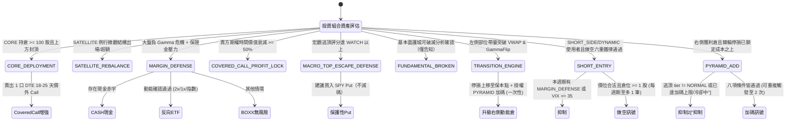
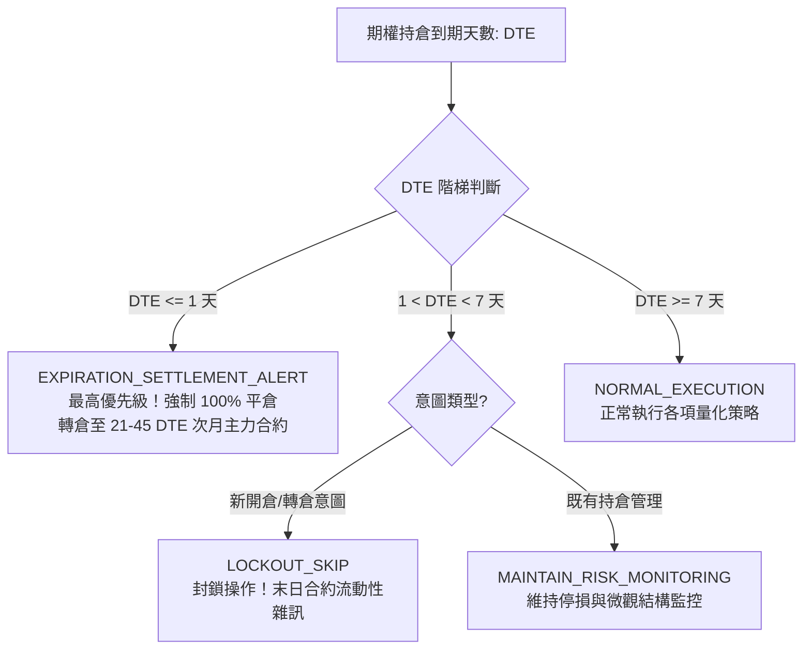

# 動態轉倉情境決策狀態機與演化引擎技術規格書

## 1. 核心哲學與適用市場環境

在多資產與美股期權交易實務中，靜態的「買入並持有」策略在面對市場體系切換、做市商伽馬擠壓、期限結構倒掛及保證金壓力時，極易面臨流動性枯竭或大幅獲利回吐。

Nexus Seeker 的**動態轉倉引擎**（`DynamicRolloverEngine`）以**買入並持有（B&H）為主要策略**（見 §2.10.1 的回測結論），引擎已精簡為顧問式的風控與告知層，不再代替使用者換股或把資金轉入 BOXX。情境編號沿用歷史編號以利對照；已刪除者標註於下，由專屬枚舉類 `RolloverScenario` 統轄現存情境：
1. `CORE_DEPLOYMENT`：僅保留 CORE 持倉的 Covered Call 增強（原「超額資金部署」的 BOXX 防禦與機會分支已刪除）。
2. ~~`OPPORTUNITY_COST`~~：**已刪除**（機會成本動能換股）；其進場六重鐵律函式保留給 `SHORT_ENTRY` 與 `SATELLITE_REBALANCE` 的 TP 輪動目標挑選使用。
3. `SATELLITE_REBALANCE`：衛星部位微觀結構出場與超額風險修剪。
4. `MARGIN_DEFENSE`：極端系統性危機下的保證金防禦與反向對沖。
5. `COVERED_CALL_PROFIT_LOCK`：期權賣方時間價值階梯停利與末日指派防衛。
6. `MACRO_TOP_ESCAPE_DEFENSE`：宏觀逃頂前瞻防禦，僅建議買入 SPY 保護性 Put，不減碼、不轉入 BOXX。
7. `FUNDAMENTAL_BROKEN`：基本面護城河破滅**告知**（不附清倉指令與按鈕）。
8. `TRANSITION_ENGINE`：動態調整狀態切換引擎（左側轉右側演化）。
9. `SHORT_ENTRY`：獨立的做空進場訊號（做空六重鐵律確認後，自帶進場／停損／目標與倉位）。
10. `PYRAMID_ADD`：右側獲利部位順勢金字塔加碼（可重複觸發，與情境八的一次性 `OPEN_PYRAMID` 觸發源不同）。

⚠️ **進場確認帶方向**：進場六重鐵律回傳 `EntryConfirmation(is_confirmed, reason, direction, …)`。`direction == "SHORT"` 的確認**永遠不會**進入任何買進候選流程；做空確認僅由 `SHORT_ENTRY` 處理。

所有轉倉建議皆統一封裝為 `RolloverInstruction` 結構，提供行動指令、目標標的、賣出比例與結構化理由，為交易員或下游排程提供確定性的執行依據。

---

## 2. 數學模型與量化推導

### 2.1 情境一：Covered Call 增強 (`CORE_DEPLOYMENT`)
> 原「核心資金超額部署」（超額資金轉入 BOXX 的防禦分支、通過六重鐵律後買入候選標的的機會分支）已刪除：賣出 CORE 贏家做擇時輪動與 B&H 策略相悖。`target_allocation_pct` 設定與持倉頁的超限顯示仍保留。

**Covered Call Overlay**：若 CORE 標的股數 $\ge 100$ 股，大盤處於正常但標的上方受制於負 Gamma 泥淖或 STO Call 封頂（`get_spx_capped_from_above_signal` 為真），系統建議賣出 1 口 DTE 18–25 天的價外 Covered Call：
$$
\text{Strike}_{\text{CoveredCall}} \ge \max(\text{Average Cost}, \; \text{Swamp Strike})
$$

### 2.2 情境二：機會成本動能轉倉（已刪除）
原 `OPPORTUNITY_COST`（動能衰退持倉換入高 EV 候選標的）已於引擎精簡時刪除。2022–2025 多資產回測顯示換股版本全面被 B&H 支配（§2.10）。

### 2.3 情境三：衛星持倉微觀結構出場 (`SATELLITE_REBALANCE`)
對既有 SATELLITE 持倉每 15 分鐘執行微觀結構出場矩陣（4 層 SL + 3 層 TP，詳見 `05_dual_track_anti_washout_stop_loss.md`）。若未觸發止盈止損，則檢查是否超過配置上限：
$$
\frac{\text{Value}_{\text{Holding}}}{\text{Total Account Value}} > \text{Max Allocation Pct} \quad (\text{預設 } 30\%)
$$
超額部分發出 `REDUCE` 減碼指令。

### 2.4 情境四：槓桿與保證金防禦 (`MARGIN_DEFENSE`)
1. **雙重危機觸發條件**：
   - 大盤處於 `SHORT_GAMMA_CRITICAL` 或 `SYSTEMIC_LIQUIDITY_CRISIS`。
   - 帳戶面臨保證金壓力（掛單現金赤字 $\text{Deficit} > 0$ 或衛星市值 $>$ 現金儲備）。
2. **清倉動作**：
   對所有結構破位或主力封殺之脆弱持倉執行 100% `LIQUIDATE`。
3. **三階轉倉目的地路由**：
   - **第一優先（現金赤字）**：轉入 `CASH`，徹底解除券商追繳風險。
   - **第二優先（反向 ETF 動能確認）**：若無赤字，且對應反向 ETF 通過現貨技術動能檢驗（$\text{RSI}_{14} > 50$、站穩 10MA、日均成交額 $\ge \$5\text{M}$），轉入反向 ETF：
     - 個股雙重確認破位（結構破位 + STO 封頂）：優先啟用 2x 反向（如 NVDA $\to$ `NVD`）。
     - 單一破位：採用 1x 反向（如 NVDA $\to$ `NVDD`）。
     - 大盤指數回退：QQQ $\to$ `SQQQ`，SPY $\to$ `SH`，SMH $\to$ `SOXS`，XLK $\to$ `TECS`。
   - **第三優先（常規防禦）**：若反向動能未通過，轉入 `BOXX` 鎖定無風險利息。
4. **`/stress_test` 現金赤字精算來源**：
   `MARGIN_DEFENSE` 判定式所複用的「掛單現金赤字」並非憑空推估，而是獨立指令 `/stress_test`（`cogs/unified_terminal/cog.py`）對帳戶所有 `GTC` 效期買單做的最壞情境精算：
   $$\text{Total Cash Deficit} = \sum_{\text{GTC BUY}} (\text{Limit Price} \times \text{Quantity})$$
   可動用防禦流動性為常規現金儲備加計 BOXX 應急套現額度，其中 BOXX 套現受限於**常規清算上限 180 股**：
   $$\text{BOXX Cash} = \min(\text{BOXX Shares}, 180) \times \frac{\$21{,}000}{180}$$
   當 $\text{Total Cash Deficit} > \text{Cash Reserve} + \text{BOXX Cash}$（即淨赤字為負）時判定為 `is_critical`，Embed 會額外標註「危及 \$13,000 實體提領紅線」的關鍵警示，提醒使用者這不只是保證金壓力，更會侵蝕已規劃好的現金提領額度。

### 2.5 情境五：賣方期權時間價值停利 (`COVERED_CALL_PROFIT_LOCK`)
專門管理 Short Call（Covered Call）與 Short Put（CSP）之時間價值衰減收割：
$$
\text{Decay Pct} = \frac{\text{Entry Premium} - \text{Current Premium}}{\text{Entry Premium}}
$$
1. **階梯停利規則**：
   - $\text{Decay Pct} \ge 50\%$：發出 `BTC 50%` 局部停利建議，鎖定半數權利金。
   - $\text{Decay Pct} \ge 80\%$：發出 `BTC 100%` 全額平倉建議，解除保證金佔用。
2. **末日合約防護**：
   $$
   \text{DTE} \le \text{\_HOLDING\_DTE\_FORCED\_SETTLEMENT\_THRESHOLD} = 1
   $$
   無論衰減幅度，強制 100% BTC 平倉回補，規避末日價內指派（Pin Risk）。

### 2.6 情境六：宏觀逃頂前瞻防禦 (`MACRO_TOP_ESCAPE_DEFENSE`)
當總經逃頂評分 `evaluate_macro_top_escape_score()` 達到 `WATCH` 以上分級（WATCH $\ge 1$、ELEVATED $\ge 2$、CRITICAL $\ge 3$ 項宏觀風險因子，如 VTS 倒掛、極度貪婪、FedWatch 鷹派偏離、負 Gamma、衛星持倉亢奮廣度 $\ge 50\%$）時：
- 建議買入 SPY 保護性 Put 作為尾部避險（WATCH／ELEVATED／CRITICAL 皆如此）。不減碼 SATELLITE、不轉入 `BOXX`——截斷上行的減碼會壓低 Sortino（§2.10.1）。
- 判讀文案依分級不同；分級納入每日 dedup key（同日升級再推播），且不受 `OPTIONS_ROLLOVER_DRY_RUN` 攔截（[`macro_sentiment/01`](../macro_sentiment/01_macro_escape_top_matrix.md) §5.6）。

### 2.7 情境七：基本面護城河破滅 (`FUNDAMENTAL_BROKEN`)
整合 LLM 對 SEC 申報文件（10-K / 10-Q / 8-K）或核心新聞進行結構化推理。模型需依據四項嚴苛標準判斷：
1. 終端前瞻指引崩塌（Forward Guidance Collapse）
2. 結構性利潤率壓縮（Structural Margin Compression）
3. 核心市場份額被永久侵蝕（Permanent Market Share Loss）
4. 核心戰略徹底偏離或商業模式失效（Strategic Thesis Invalidation）

嚴格排除總經週期、短線匯率或單季資本支出波動。當輸出 `is_broken == True` 時，系統只推播**告知**（判讀理由、信心與資料來源），不附清倉／轉倉指令與執行按鈕，是否調整持倉由使用者自行判斷。

### 2.8 情境八：動態調整狀態切換引擎 (`TRANSITION_ENGINE`)
負責將左側進場部位在行情發展中平滑演化為右側動能部位：
- **切換路徑 1（左側部位進化）**：
  當透過 Regime I 建立的左側接刀倉位，其 15 分鐘收盤價伴隨 1.5 倍以上放量（$\text{Volume}_{15m} \ge 1.5 \times \overline{\text{Volume}}_{20}$）同時站穩 Session VWAP 與 Gamma Flip 時：
  1. **防守升級**：將部位停損線向上鎖定於保本點：
     $$
     \text{Ratchet Stop} = \max(\text{Average Cost}, \; \text{Anchor Base})
     $$
  2. **加碼授權**：授權新開立短天期（DTE 7–21 天）右側順勢加碼單（`OPEN_PYRAMID`），實現利潤奔馳。

### 2.9 情境九：做空進場訊號 (`SHORT_ENTRY`)
僅對 `trading_strategy ∈ {SHORT_SIDE, DYNAMIC}` 的使用者評估（含沒有任何持倉者），在保證金防禦、宏觀逃頂與賣方停利之後執行。候選為下行預期波幅 × 空頭動能挑出的做空候選（`_find_best_short_target`）；本週期若有 `MARGIN_DEFENSE` 指令、或 VIX $\ge 35$（做空乘數為 $0$）即抑制。倉位：

$$\text{Qty} = \min\Big(\Big\lfloor \frac{\text{Capital} \times \min(0.5\%,\ f_{\text{kelly}}) \times m_{\text{VIX}}^{\text{short}}}{\text{Stop} - \text{Entry}} \Big\rfloor,\ \Big\lfloor \frac{\text{Capital} \times \text{risk\_limit}\%}{\text{Entry}} \Big\rfloor\Big)$$

每位使用者每週期至多 1 筆（取 R:R 最佳者），`action = "OPEN_SHORT"`、`sell_ratio = 0`。完整規格見 [`07_short_side_breakdown_ironclad.md`](07_short_side_breakdown_ironclad.md) §2.6–§2.7。

### 2.10 回測實證摘要（離線回測程式已刪除）

早期以 2025 全年度（SPY／NVDA／GLD）與 2022–2025 多資產（VOO 核心 + 8 檔個股衛星 + GLD）兩組回測檢驗過整套動態轉倉引擎；離線回測引擎（`calibration/backtest_engine_2025.py`）與腳本已隨引擎精簡刪除，結論保留於此。判讀指標以**索提諾比率（Sortino，MAR = 無風險利率 4.5%）為主**，最大回撤與 VaR／CVaR 為輔（定義見 [`../risk_portfolio/07_downside_risk_sortino_var_cvar.md`](../risk_portfolio/07_downside_risk_sortino_var_cvar.md)）；夏普比率對上下行波動一視同仁，會把「砍掉獲利部位」誤判為風險改善，只作描述。

| 回測 | 引擎 Sortino | B&H Sortino | 超額報酬 vs 減碼 B&H |
| :--- | ---: | ---: | ---: |
| 2025 單年，防禦型 | 1.45 | 1.73 | −2.08 pp |
| 2025 單年，進攻型 | 1.13 | 1.73 | −4.44 pp |
| 2022–2025 多資產，防禦型 | 0.41 | 1.17 | −34.5 pp |
| 2022–2025 多資產，進攻型 | 0.28 | 1.17 | −65.6 pp |

多資產期間 B&H 的 MDD 為 33.6%、引擎為 15.7%–23.8%，但每承擔一單位下行風險換到的報酬更差（2022 空頭年 Sortino −2.2 vs −1.6），隨後三年只拿到 B&H 報酬的三到五成；結果對冷卻、換股門檻等參數高度敏感，沒有任何一組穩健勝出。

#### 2.10.1 判讀：引擎被「減碼 B&H」支配，勝率不再是 KPI

高勝率與低回撤**不代表引擎創造了 alpha**。兩個模式的年化下行差都只有 B&H 的約 55%，等於平均只承擔約一半的下行曝險。拿同等下行差的「$w$ × B&H + $(1-w)$ × 現金（$R_f = 4.5\%$）」當對照組——此混合組合的超額報酬恰為 $w \times (R_{\text{B\&H}} - R_f)$，其下行差（MAR = $R_f$）精確等於 $w$ × B&H 下行差，因此與策略承擔**完全相同的 Sortino 分母**：

$$
w = \frac{DD_{\text{strategy}}}{DD_{\text{B\&H}}} \approx 0.545, \qquad
R_{\text{scaled}} \approx 0.545 \times 27.77\% + 0.455 \times 4.5\% \approx 17.16\%, \qquad
\text{Sortino}_{\text{scaled}} \approx \text{Sortino}_{\text{B\&H}} = 1.73
$$

2025 單年進攻型 12.72%、Sortino 1.13，兩項都輸給這個對照組——整套情境引擎被「單純減碼持有」支配。勝率是反覆砍獲利部位造成的低賺賠比副產品，不是優勢。後續的曝險遞增三件套（TP1 趨勢豁免、§2.11 `PYRAMID_ADD`、晴空萬里天花板）與 Regime III-B 都是為了讓部位曝險在趨勢中能夠**遞增**，而非持續遞減；任何「再加一道風控閘門」方向的提案都會讓問題惡化——Sortino 不懲罰上行波動，截斷上行的閘門只會壓低分子。

> 早期以總年化波動對齊的減碼對照組（Sharpe 式建構）會把策略「砍掉的上行波動」也算成降低的風險，替對照組多扣曝險；現已改為下行差對齊，總波動版保留為報告中的描述欄位（`excess_return_vs_vol_scaled`）。

**策略績效 KPI（依重要性排序）**：

| 指標 | 定義 | 目標 |
| :--- | :--- | :--- |
| **索提諾比率** | $(\text{CAGR} - \text{MAR}) / DD_{\text{年化}}$，MAR = $R_f$ | **> B&H**（2025：1.73） |
| **超額報酬 vs 減碼 B&H** | $R_{\text{strategy}} - R_{\text{同等下行差的 B\&H + 現金}}$ | **> 0**（回答「是創造 alpha，還是只是降低曝險」） |
| 最大回撤 | 淨值距歷史高點最深跌幅 | < B&H |
| CVaR95（1 日） | 最差 5% 交易日的平均虧損 | < B&H |
| 賺賠比 | 平均獲利 / 平均虧損 | > 1.5 |

夏普比率、卡瑪比率、勝率與交易頻率**只作描述**，不得作為判讀或優化目標。

任何新策略的回測報告都必須附上「超額報酬 vs 減碼 B&H」對照組；判讀準則見 [`05_calibration_harness_and_forward_collection.md`](../architecture/05_calibration_harness_and_forward_collection.md)。**已實現勝率僅作描述，不得作為優化目標。**

### 2.11 情境十：順勢金字塔加碼 (`PYRAMID_ADD`)

讓右側進場的獲利部位在趨勢延續時**加碼**，而非只能減碼——直接對症 §2.10 揭露的「曝險單調遞減、沒有遞增路徑」問題。與情境八 `TRANSITION_ENGINE` 的 `OPEN_PYRAMID`（Regime 演化驅動的一次性狀態切換，`state["pyramided"]` 旗標保證只觸發一次）刻意分離：本情境是「任何右側獲利倉在趨勢延續時的例行加碼」，可重複觸發至 $\text{\_PYRAMID\_MAX\_ADDS} = 2$ 次；兩者最終皆路由到同一個 `action == "OPEN_PYRAMID"` 下游派發分支，靠 `scenario` 欄位區分文案與資料。

八項觸發條件全部為 AND：

1. **部位已獲利**：$\dfrac{\text{Spot} - \text{AvgCost}}{\text{AvgCost}} \ge \text{\_PYRAMID\_PROFIT\_THRESHOLD\_PCT} = 3\%$
2. **停損已在成本之上（不變式，任何修改都不得放寬）**：擠壓參考停損 $\min(\text{D 擠壓區間低點}, \text{SMA}^{D}_{20}) - 0.5\times\text{ATR}_{1D} \ge \text{AvgCost}$（算不出來 fail-closed）——這是加碼只動用「已實現的帳面利潤」承險、不增加原始本金曝險的唯一保證，也是金字塔加碼與盲目攤平的分界。2026-10 前讀取 `dynamic_strategy_state["ratchet_stop"]`，但顧問模式丟棄 HOLD 指令的狀態補丁，該值對所有多頭現貨永遠不會寫入，條件二恆不成立；改為即時計算，不變式語意不變（見 [`10_multi_timeframe_squeeze_entry.md`](10_multi_timeframe_squeeze_entry.md) §1.2）。
3. **趨勢延續訊號**：D 動能 $> 0$，且 65m／D／3D／W 任一出現 Green Dot（擠壓剛解除），或收盤站上自動偵測的壓力區（`10` §2.3）
4. **不在壓力區下緣**：現價未進入「尚未突破的壓力區下緣 $0.5\times\text{ATR}_{1D}$ 以內」
5. **加碼次數未達上限**：$\text{pyramid\_count} < \text{\_PYRAMID\_MAX\_ADDS} = 2$
6. **距上次加碼已冷卻**：$\text{now} - \text{last\_pyramid\_at} \ge \text{\_PYRAMID\_COOLDOWN\_BARS} = 8$ 根 15m bar（2 小時）；從未加碼過視為冷卻已滿足
7. **加碼後總曝險未超過預算上限**：超過 `profile.max_satellite_budget_pct`（[`02_vix_battle_ladder_and_kelly.md`](../risk_portfolio/02_vix_battle_ladder_and_kelly.md) §4.4）時降量而非直接拒絕
8. **非逃頂警戒**：宏觀逃頂評分（[`01_macro_escape_top_matrix.md`](../macro_sentiment/01_macro_escape_top_matrix.md)）tier $= \text{NORMAL}$——逃頂前哨一亮起即停止加碼，讓「加碼」與「防禦」構成一個閉環

**倉位模型**：直接沿用 `short_entry_sizing.py`（`07_short_side_breakdown_ironclad.md` §2.6）已驗證的「風險預算 ÷ 停損距離」模型，方向反轉：
$$
\text{risk}_{\text{usd}} = \text{NAV} \times \min(\text{\_PYRAMID\_ACCOUNT\_RISK\_PCT},\, f_{\text{kelly}}), \qquad d_{\text{stop}} = \text{Spot} - \text{Stop}_{\text{squeeze}}, \qquad Q_{\text{add}} = \left\lfloor \frac{\text{risk}_{\text{usd}}}{d_{\text{stop}}} \right\rfloor
$$
其中 $f_{\text{kelly}}$ 取自 `kelly_priors.get_win_rate_prior("LONG", rsi)`。2026-10-04 起**不再乘 VIX 倍數**（使用者決定）：原本的 `get_vix_sizing_multiplier(vix, "DIRECTIONAL_LONG")` 是賣方階梯，VIX < 15 時乘數為 0，會讓加碼股數恆為 0；`vix_multiplier` 欄位固定 1.0，VIX 階梯只作顯示。

**狀態延後提交**：狀態刻意不在引擎內落地——沿用 `transition_engine.py` 既有設計，指令附帶 `dynamic_state_patch = {"pyramid_count": count+1, "last_pyramid_at": <ISO8601 UTC>}` 與 `asset_id`，由 `portfolio_monitor.py` 派發迴圈在確認送達後才呼叫 `set_asset_dynamic_state()` 提交，避免通知開關／dedup／`PYRAMID_ADD_DRY_RUN`（預設 `true`）任一道閘門抑制推播時，加碼額度永久燒掉。

---

## 3. 決策邏輯與狀態機 / 流程圖

### 3.1 動態轉倉情境全景狀態圖

```mermaid
stateDiagram-v2
    [*] --> 投資組合資產評估

    投資組合資產評估 --> CORE_DEPLOYMENT: CORE 持倉 >= 100 股且上方封頂
    投資組合資產評估 --> SATELLITE_REBALANCE: SATELLITE 例行微觀結構出場/超額
    投資組合資產評估 --> MARGIN_DEFENSE: 大盤負 Gamma 危機 + 保證金壓力
    投資組合資產評估 --> COVERED_CALL_PROFIT_LOCK: 賣方期權時間價值衰減 >= 50%
    投資組合資產評估 --> MACRO_TOP_ESCAPE_DEFENSE: 宏觀逃頂評分達 WATCH 以上
    投資組合資產評估 --> FUNDAMENTAL_BROKEN: 基本面護城河破滅分析確認（僅告知）
    投資組合資產評估 --> TRANSITION_ENGINE: 左側部位帶量突破 VWAP & GammaFlip
    投資組合資產評估 --> SHORT_ENTRY: SHORT_SIDE/DYNAMIC 使用者且做空六重鐵律通過
    投資組合資產評估 --> PYRAMID_ADD: 右側獲利倉且棘輪停損已鎖定成本之上

    CORE_DEPLOYMENT --> CoveredCall增強: 賣出 1 口 DTE 18-25 天價外 Call

    MACRO_TOP_ESCAPE_DEFENSE --> 保護性Put: 建議買入 SPY Put（不減碼）

    MARGIN_DEFENSE --> CASH現金: 存在現金赤字
    MARGIN_DEFENSE --> 反向ETF: 動能確認通過 (2x/1x/指數)
    MARGIN_DEFENSE --> BOXX無風險: 其他情境

    TRANSITION_ENGINE --> 升級右側動能倉: 停損上移至保本點 + 授權 PYRAMID 加碼 (一次性)

    SHORT_ENTRY --> 抑制: 本週期有 MARGIN_DEFENSE 或 VIX >= 35
    SHORT_ENTRY --> 做空訊號: 價位合法且倉位 >= 1 股 (每週期至多 1 筆)

    PYRAMID_ADD --> 抑制2["抑制: 逃頂 tier != NORMAL 或已達加碼上限/冷卻中"]
    PYRAMID_ADD --> 加碼訊號: 八項條件皆通過 (可重複觸發至 2 次)
```

派送順序（`portfolio_monitor.monitor_real_portfolio_task`）：`SATELLITE_REBALANCE`（含 `TRANSITION_ENGINE` 與 `PYRAMID_ADD` 的per-asset 迴圈內評估）→ `CORE_DEPLOYMENT`（Covered Call Overlay）→ `MARGIN_DEFENSE` → `MACRO_TOP_ESCAPE_DEFENSE` → 賣方停利 → `SHORT_ENTRY`。`SHORT_ENTRY` 走 `alpha_market_signals` 通知頻道與專屬 embed（不掛 `RolloverActionView`，該按鈕試算的是 BUY 股數），受 `SHORT_ENTRY_DRY_RUN` 閘門控制；`PYRAMID_ADD` 與 `TRANSITION_ENGINE` 同走 `defense_option_rollover` 通知頻道，受 `PYRAMID_ADD_DRY_RUN`（預設 `true`）閘門控制。另有一道**跨情境**閘門：由 Regime III-B（右側趨勢延續態，見 [`01_regime_routing_matrix.md`](01_regime_routing_matrix.md) §1）確認出的指令受 `REGIME_III_B_DRY_RUN`（預設 `true`）抑制，該閘門依 `instruction["entry_regime"]` 判斷而非 `scenario`。

### 3.2 DTE 三態狀態機決策階梯

```mermaid
flowchart TD
    DTE_Input[期權持倉到期天數: DTE] --> DTE_Check{DTE 階梯判斷}

    DTE_Check -- "DTE <= 1 天" --> ForceSettle["EXPIRATION_SETTLEMENT_ALERT<br/>最高優先級！強制 100% 平倉<br/>轉倉至 21-45 DTE 次月主力合約"]

    DTE_Check -- "1 < DTE < 7 天" --> IntentCheck{意圖類型?}
    IntentCheck -- 新開倉/轉倉意圖 --> Lockout["LOCKOUT_SKIP<br/>封鎖操作！末日合約流動性雜訊"]
    IntentCheck -- 既有持倉管理 --> MaintainRisk["MAINTAIN_RISK_MONITORING<br/>維持停損與微觀結構監控"]

    DTE_Check -- "DTE >= 7 天" --> NormalExec["NORMAL_EXECUTION<br/>正常執行各項量化策略"]
```

---

## 4. 關鍵具名常數與物理約束

| 常數名稱 | 數值 / 門檻 | 物理 / 代碼約束 | 程式碼檔案路徑 |
| :--- | :--- | :--- | :--- |
| `_COVERED_CALL_MIN_SHARES` | `100` | 賣出 1 口 Covered Call 之最低現貨股數 | `nexus_core/market_analysis/dynamic_rollover/constants.py` |
| `_EV_SPREAD_MIN_THRESHOLD` | `0.05` ($5\%$) | 多空候選挑選最低期望值差距 | `nexus_core/market_analysis/dynamic_rollover/constants.py` |
| `_HOLDING_DTE_FORCED_SETTLEMENT_THRESHOLD` | `1` | DTE $\le 1$ 強制結算平倉轉倉 | `nexus_core/market_analysis/dynamic_rollover/constants.py` |
| `_HOLDING_DTE_LOCKOUT_THRESHOLD` | `7` | DTE $< 7$ 封鎖新開倉與轉倉部署 | `nexus_core/market_analysis/dynamic_rollover/constants.py` |
| `_COVERED_CALL_PROFIT_LOCK_PARTIAL_DECAY_PCT` | `0.50` ($50\%$) | 賣方權利金衰減達 50% 時 BTC 回補 50% | `nexus_core/market_analysis/dynamic_rollover/constants.py` |
| `_COVERED_CALL_PROFIT_LOCK_FULL_DECAY_PCT` | `0.80` ($80\%$) | 賣方權利金衰減達 80% 時 BTC 100% 全額平倉 | `nexus_core/market_analysis/dynamic_rollover/constants.py` |
| `_TRANSITION_PATH1_VWAP_VOLUME_MULT` | `1.5` | 左側轉右側演化 15m 收盤站穩 VWAP 放量倍數 | `nexus_core/market_analysis/dynamic_rollover/constants.py` |
| `_SHORT_ENTRY_ACCOUNT_RISK_PCT` | `0.005` ($0.5\%$) | `SHORT_ENTRY` 單筆帳戶風險上限 | `nexus_core/market_analysis/dynamic_rollover/constants.py` |
| `_SHORT_ENTRY_MAX_INSTRUCTIONS_PER_CYCLE` | `1` | `SHORT_ENTRY` 每位使用者每週期上限 | `nexus_core/market_analysis/dynamic_rollover/constants.py` |
| `SHORT_ENTRY_DRY_RUN` | `true` | `SHORT_ENTRY` 只寫稽核紀錄不推播 | `nexus_core/config.py` |
| `_PYRAMID_PROFIT_THRESHOLD_PCT` | `0.03` ($3\%$) | `PYRAMID_ADD` 條件一：部位獲利門檻 | `nexus_core/market_analysis/dynamic_rollover/constants.py` |
| `_PYRAMID_MAX_ADDS` | `2` | `PYRAMID_ADD` 條件五：同一部位最多加碼次數 | `nexus_core/market_analysis/dynamic_rollover/constants.py` |
| `_PYRAMID_COOLDOWN_BARS` | `8`（15m bar，即 2 小時） | `PYRAMID_ADD` 條件六：加碼冷卻 | `nexus_core/market_analysis/dynamic_rollover/constants.py` |
| `_PYRAMID_ACCOUNT_RISK_PCT` | `0.005` ($0.5\%$) | `PYRAMID_ADD` 單筆加碼帳戶風險上限 | `nexus_core/market_analysis/dynamic_rollover/constants.py` |
| `_PYRAMID_KELLY_SCALE` / `_PYRAMID_KELLY_CAP` | `0.5` / `0.01` | `PYRAMID_ADD` 凱利分數縮放與上限 | `nexus_core/market_analysis/dynamic_rollover/constants.py` |
| `PYRAMID_ADD_DRY_RUN` | `true` | `PYRAMID_ADD` 只寫稽核紀錄不推播；翻轉判準見 [`05_calibration_harness_and_forward_collection.md`](../architecture/05_calibration_harness_and_forward_collection.md) §5.8 F | `nexus_core/config.py` |
| `REGIME_III_B_DRY_RUN` | `true` | 由 Regime III-B（右側趨勢延續態）確認出的指令只寫稽核紀錄不推播。⚠️ 本閘門以指令的 `entry_regime` 欄位為鍵，**不是** `scenario`——III-B 放寬的是進場判定 | `nexus_core/config.py` |
| BOXX 常規清算上限 | `180` 股 (換算 $\$21{,}000$) | `/stress_test` 計算 BOXX 應急套現額度之股數硬上限 | `nexus_core/cogs/unified_terminal/cog.py` |
| 實體提領紅線 | `$13,000` | `/stress_test` 判定 `is_critical` 時額外揭露之提領額度警戒線 | `nexus_core/cogs/embed_builders/scan_embeds/risk_stress_test.py` |

---

## 5. 邊界條件、風控熔斷與例外處理

1. **反向 ETF 交易流動性防呆**：
   在 `MARGIN_DEFENSE` 路由至反向 ETF 前，必須調用 `confirm_inverse_hedge_spot_momentum()` 驗證日均成交額 $\ge \$5,000,000$ 且技術面偏多。任何流動性不足或歷史數據缺失一律 Fail-Closed 退回無風險的 `BOXX`，防止交易員被困在無量反向商品中。
2. **末日合約結算與轉倉窗口**：
   當期權部位 $\text{DTE} \le 1$ 時，系統直接短路所有常規指標計算，跳過 15m 實體收盤等待，直接發出 `EXPIRATION_SETTLEMENT_ALERT`，並指示次月合約尋找窗口設定在 $21 \sim 45$ DTE，避免連鎖陷入連續末日合約耗損。
3. **做空確認的下游隔離**：`direction == "SHORT"` 的 `EntryConfirmation` 不得進入任何買進候選流程；做空只走 `SHORT_ENTRY`（`_find_best_short_target`）。
4. **Delta 終局平倉硬鎖**：
   當期權部位 Delta 升至 $\ge 0.85$ 時，做市商避險已近乎 1:1 現貨對沖，凸性利潤耗盡並伴隨深實值流動性枯竭風險，系統觸發 TP3 強制收割利潤。
5. **右側突破目標牆錨定與同根震盪防護（Regime III Target Wall Anchoring）**：
   在 10 日高點向上突破進場時，錨點（`anchor_base`）設為被突破的舊阻力牆（`high10_prev`），出場 TP 目標牆（`target_wall`）則錨定至更高階的 60 日高點（`high60_prev`），徹底消除「進場價已穿越舊阻力牆而觸發同根 K 棒立即平倉（Same-bar Churn）」的矛盾。
6. **微小碎股與保證金清算防呆（Dust Sweeping & Reg-T Mutual Exclusion）**：
   階梯式部分停利（50%/30%/20%）與多次轉倉後，若殘留股數換算現值低於 $250 或股數 < 0.5 股，自動啟動 Dust Sweeping 清空，解除持倉鎖定；同時嚴格落實現貨與空頭部位之互斥（Mutual Exclusion）與 Reg-T 50% 保證金約束。
7. **回測診斷沿革之量化優化路線（Optimization Roadmap，早期 2025 回測的結論，仍適用於保留的情境）**：
   - **停損與轉倉冷卻窗口（3-Day Exit Cooldown）**：在 `last_exit_date` 未滿 3 日前，同一標的禁止再度觸發同向開倉，消除震盪期無效反覆磨損。
   - **前瞻性 Expected Move 波動率期望值模型**：升級為 [`02_expected_move_and_max_pain.md`](../valuation_pricing/02_expected_move_and_max_pain.md) 之 1-Sigma 波動率擴展期望值，解決創歷史新高突破標的（如 2025 GLD）之 EV 被低估陷阱。
   - **總經逃頂防禦事件去重（10-Day Event Dedup）**：同一輪危機事件窗口內僅觸發一次防禦減碼，避免 VIX 長期處於高位時連續減碼削皮。
   - **底牆支撐緩衝雙邊界（Wall Buffer Guard）**：進場前嚴格整合 [`06_dynamic_adaptive_room_threshold.md`](06_dynamic_adaptive_room_threshold.md) 公式 B 要求 $P_{\text{close}} \ge \text{PutWall} + 0.5 \times \text{ATR}_{15m}$。

8. **`PYRAMID_ADD` 條件二不變式禁止放寬**：擠壓參考停損 $\ge$ `avg_cost` 是加碼機制與盲目攤平的唯一分界。任一資料缺失導致無法判定的條件（D／W K 線缺失、參考停損算不出來）一律 fail-closed 不加碼，因為本情境是**承擔新曝險**的決策，與既有部位「是否該出場」的 fail-open 慣例刻意不同。
9. **`PYRAMID_ADD` 與 `TRANSITION_ENGINE` 的插入位置**：`PYRAMID_ADD` 評估插入 `check_satellite_rebalancing_impl` 的 per-asset 迴圈中、`TRANSITION_ENGINE` 之後、SL/TP 階梯計算之前，重用同一輪已算好的 `spot`／`session_vwap`／`gamma_flip`／`net_gex` 等 metrics，避免重複抓取；條件四的 60 日高點抓取延遲至條件一~三皆通過後才發動，條件八的宏觀逃頂評分延遲至條件一~四皆通過後才發動（後者由呼叫端提供一個每位使用者記憶化一次的 async callable，避免對每個持倉重複計算）。
10. **`PYRAMID_ADD` 曝險超限降量而非拒絕**：條件七超過 `profile.max_satellite_budget_pct` 時，以剩餘預算重新反推可加碼股數上限（`binding_constraint = "EXPOSURE_CAP"`），不足 1 股才拒絕，與 `short_entry_sizing.py` 既有的曝險上限降量邏輯一致。
11. **多頭現貨一律顧問化**：多頭現貨持倉的情境三（`SATELLITE_REBALANCE`）指令固定摺疊為位階告知或丟棄（原 `portfolio_mode` COMMAND／ADVISORY 切換已移除，欄位與遷移 v079 保留但不再讀寫），情境四（`MARGIN_DEFENSE`，帳戶生存線）不受影響。轉換規則、丟棄項與唯一防護（`RolloverInstruction.action` 為純 `str`）詳見 [`05_dual_track_anti_washout_stop_loss.md`](05_dual_track_anti_washout_stop_loss.md) §3.1／§5.9。`PYRAMID_ADD`（情境十）刻意**不**受影響：加碼是新增曝險而非減碼，與 B&H 策略相容。

---

## 6. 核心程式碼檔案路徑關聯

- `nexus_core/market_analysis/dynamic_rollover/models.py`：`RolloverScenario`, `RolloverInstruction`
- `nexus_core/market_analysis/dynamic_rollover/constants.py`：轉倉決策常數、反向 ETF 映射字典
- `nexus_core/market_analysis/dynamic_rollover/core_deployment.py`：`evaluate_covered_call_overlay()`
- `nexus_core/market_analysis/dynamic_rollover/opportunity_cost.py`：進場六重鐵律條件函式與 `_find_best_rollover_target`（情境二本體已刪除，僅保留給 `SHORT_ENTRY`／TP 輪動目標使用）
- `nexus_core/market_analysis/dynamic_rollover/anti_washout.py`：`check_satellite_rebalancing()`
- `nexus_core/market_analysis/dynamic_rollover/margin_defense.py`：`evaluate_margin_defense()`
- `nexus_core/market_analysis/dynamic_rollover/covered_call_profit_lock.py`：`evaluate_covered_call_profit_lock()`
- `nexus_core/market_analysis/dynamic_rollover/macro_top_escape_defense.py`：`evaluate_macro_top_escape_defense()`
- `nexus_core/market_analysis/dynamic_rollover/fundamental_thesis.py`：`analyze_fundamental_thesis()`
- `nexus_core/market_analysis/dynamic_rollover/transition_engine.py`：`evaluate_transition_for_position()`
- `nexus_core/market_analysis/dynamic_rollover/inverse_hedge.py`：`resolve_inverse_hedge_target()`, `confirm_inverse_hedge_spot_momentum()`
- `nexus_core/market_analysis/dynamic_rollover/structural_signals.py`：`evaluate_option_dte_tier()`
- `nexus_core/market_analysis/dynamic_rollover/short_entry_deployment.py`：`evaluate_short_entry_opportunity()`（情境九）
- `nexus_core/market_analysis/dynamic_rollover/short_entry_sizing.py`：做空價位與倉位
- `nexus_core/market_analysis/dynamic_rollover/pyramid_add.py`：`evaluate_pyramid_add_impl()`（情境十，八項條件；條件二～四呼叫 `squeeze_entry.evaluate_symbol()`）、`compute_pyramid_add_sizing()`、`build_pyramid_add_plan()`
- `nexus_core/cogs/embed_builders/rollover_embeds.py`：`create_transition_pyramid_embed()`（依 `scenario` 分流 `TRANSITION_ENGINE`／`PYRAMID_ADD` 文案與倉位欄位）
- `nexus_core/tests/unit/test_pyramid_add.py`：八項條件逐項測試、條件二不變式、次數上限、冷卻、曝險降量、空頭排除、狀態延後提交、端到端整合測試
- `nexus_core/cogs/trading/portfolio_monitor.py`：十大情境的評估順序、通知頻道分流與 dry-run 閘門
- `nexus_core/cogs/unified_terminal/cog.py`：`/stress_test` 指令，GTC 掛單現金赤字與 BOXX 應急套現額度精算
- `nexus_core/cogs/embed_builders/scan_embeds/risk_stress_test.py`：`create_stress_test_embed()`
