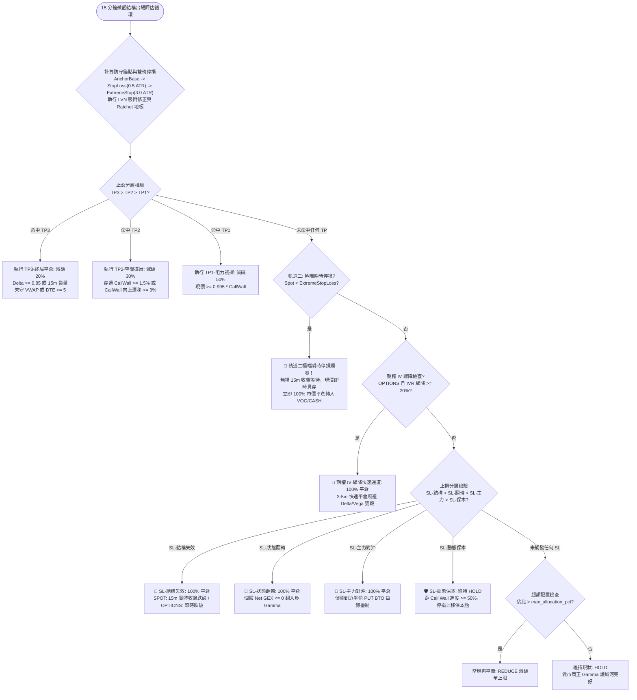

# 雙軌防洗盤動態停損與微觀結構出場矩陣技術規格書

## 1. 核心哲學與適用市場環境

在美股市場中，傳統固定百分比（如固定跌 5% 或 8% 平倉）或靜態均線停損存在致命缺陷：做市商與機構演算法頻繁利用流動性真空區發動下影線獵殺（Liquidity Hunt / Stop Hunting），在摜破散戶常見停損價位後迅速拉回並展開主升浪，導致投資人「被洗在最低點」。

Nexus Seeker 的**雙軌防洗盤動態停損與出場決策矩陣**（`anti_washout.py`）提出兩大核心防護支柱：
1. **雙軌時間與價格分離防守體系**：
   - **軌道一（結構性防守線，Track 1）**：錨定做市商底牆結構加上動態 ATR 緩衝。針對 **SPOT 現貨部位**，嚴格要求等待 **15 分鐘實體 K 棒收盤價跌破**才確認清倉，徹底過濾盤中毛刺與下影線流動性獵殺；針對 **OPTIONS 期權部位**，則以現價即時貫穿為觸發依據，防範期權非線性 Delta/Vega 瞬間歸零。
   - **軌道二（極端瞬時熔斷線，Track 2）**：錨定底牆下方 3.0 倍 ATR。此為現貨與期權皆適用的最後黑天鵝熔斷防線，現價即時貫穿**立即市價清倉**，無視 15 分鐘收盤等待，果斷阻斷突發極端踩踏與流動性真空滑步。
2. **微觀結構多維出場決策矩陣**：
   摒棄二元獲利了結，整合做市商阻力初探（TP1）、阻力擴展與遷移（TP2）、趨勢終局平倉（TP3）三階止盈，以及結構失效、做市商狀態翻轉、主力對沖、動態保本四階止損，實現科學的階梯式分批獲利回收與風險鎖死。

---

## 2. 數學模型與量化推導

### 2.1 單一權威防守錨點解析序 (Canonical Anchor Base Resolution)
為杜絕因數據缺失造成「結構破位判定」與「停損價位呈現」引用不同基準的分歧，系統依嚴格優先級解析唯一權威錨點 $\text{Anchor Base}$：
$$
\text{Anchor Base} =
\begin{cases}
\text{Support Wall}, & \text{若 } \text{Support Wall} > 0 \\
\min(\text{Put Wall}, \text{Call Wall}), & \text{若 } \text{Put Wall} > 0 \land \text{Call Wall} > 0 \land \text{Put Wall} > \text{Call Wall} \quad (\text{拓撲逆轉修復}) \\
\text{Put Wall}, & \text{若 } \text{Put Wall} > 0 \\
\text{Gamma Flip}, & \text{若 } \text{Gamma Flip} > 0 \\
\text{HVN}, & \text{若 } \text{HVN} > 0 \\
\text{Spot}, & \text{兜底回退}
\end{cases}
$$

### 2.2 軌道一：結構性防守線 (Track 1)
以權威錨點扣除 0.5 倍 15 分鐘 ATR：
$$
\text{Raw Stop Loss} = \text{Anchor Base} - \text{\_MICROSTRUCTURE\_SL\_STRUCTURAL\_ATR\_MULT} \times \text{ATR}_{15m} \quad (\text{倍數} = 0.5)
$$
若無有效錨點，回退至現價 4% 緩衝：$\text{Spot} \times 0.96$。

### 2.3 量價拓撲吸附演算法 (LVN Avoidance)
低成交量區（LVN）是流動性真空陷阱，若停損點正好落於 LVN 附近，極易被極少量拋單穿透。當 $|\text{Stop Loss} - \text{LVN}| / \text{LVN} \le 0.015$（1.5% 容差）時觸發吸附：
1. **若下方存在有效籌碼支撐節點**（$\text{Target HVN} < \text{LVN}$，依序檢索次級 HVN、主 HVN、Anchor Base）：
   $$
   \text{Adjusted Stop Loss} = \text{Target HVN} + 0.2 \times \text{ATR}_{15m}
   $$
   將停損點向上吸附至密集成交區上緣，利用實質成交堆積抵禦衝擊。
2. **若下方無任何有效籌碼支撐**：
   $$
   \text{Adjusted Stop Loss} = \text{LVN} - 1.0 \times \text{ATR}_{15m}
   $$
   主動避開真空區，將停損向下平移至真空帶之外。

### 2.4 保本地板向上棘輪 (Ratchet Floor) 與限價單計算
若狀態切換引擎已確立保本地板 $\text{Ratchet Stop} = \max(\text{Average Cost}, \text{Anchor Base})$，停損線只升不降：
$$
\text{Stop Loss} = \max(\text{Adjusted Stop Loss}, \; \text{Ratchet Stop})
$$
對應的限價單保護價位：
$$
\text{Limit Price} = \max\big(\text{Stop Loss} - 0.5 \times \text{ATR}_{15m}, \; \text{Stop Loss} \times 0.995\big)
$$

### 2.5 軌道二：極端瞬時停損 (Track 2)
獨立於 LVN 吸附管線之外，作為黑天鵝最後防線：
$$
\text{Extreme Stop Loss} = \text{Anchor Base} - \text{\_ANTI\_WASHOUT\_EXTREME\_ATR\_MULT} \times \text{ATR}_{15m} \quad (\text{倍數} = 3.0)
$$
- **觸發機制**：無論現貨或期權，即時報價 $\text{Spot} < \text{Extreme Stop Loss}$ 瞬間觸發 100% 市價清倉。

### 2.6 微觀結構出場決策矩陣

#### 2.6.1 止盈分層 (TP Ladder，優先序 TP3 > TP2 > TP1)
1. **TP3-終局平倉（平倉 20%）**：
   滿足以下任一條件觸發，鎖定非線性波段頂點利潤：
   - 期權 $\text{Delta} \ge \text{\_MICROSTRUCTURE\_TP3\_DELTA\_THRESHOLD} = 0.85$（深實值做市商 1:1 對沖，凸性耗盡）。
   - 15 分鐘收盤價放量跌破 Session VWAP（`vwap_loss_with_volume == True`）。
   - 期權效期逼近：$1 < \text{DTE} \le \text{\_MICROSTRUCTURE\_TP3\_DTE\_THRESHOLD} = 5$（非線性 Theta 耗損加速）。
2. **TP2-空間擴展（平倉 30%）**：
   做市商防線被向上擊潰：
   - 現價突破 Call Wall 幅度 $\frac{\text{Spot} - \text{CallWall}}{\text{CallWall}} \ge \text{\_MICROSTRUCTURE\_TP2\_WALL\_BREAK\_PCT} = 1.5\%$。
   - 或 Call Wall 向上遷移 $\ge 3\%$ 且現價站穩舊阻力位（$\text{CallWall} \ge \text{CallWall}_{\text{prev}} \times 1.03 \land \text{Spot} \ge \text{CallWall}_{\text{prev}}$）。
3. **TP1-阻力初探（平倉 50%）**：
   現價抵達阻力牆門前：
   $$
   \text{Spot} \ge \text{CallWall} \times \text{\_MICROSTRUCTURE\_TP1\_CALLWALL\_PCT} = 0.995 \times \text{CallWall}
   $$

#### 2.6.2 止損分層 (SL Ladder，由硬到軟依序判定)
1. **SL-結構失效（100% 平倉）**：
   - SPOT 部位：$\text{Price}_{15m\_\text{close}} < \text{Stop Loss}$（嚴格 15 分鐘實體收盤跌破）。
   - OPTIONS 部位：$\text{Spot} < \text{Stop Loss}$（即時貫穿）。
2. **SL-狀態翻轉（100% 平倉）**：
   個股全鏈 $\text{Net GEX} \le \text{\_MICROSTRUCTURE\_SL\_NET\_GEX\_THRESHOLD} = 0.0$。做市商轉為 Short Gamma 助跌順向踩踏，自穩定避險邏輯消亡。
3. **SL-主力對沖（100% 平倉）**：
   偵測到近平值單筆機構級 PUT BTO 大單：
   $$
   \text{Notional} \ge \$500,000 \land \text{Ratio} \ge 1.5\text{x} \land \frac{|\text{Strike} - \text{Spot}|}{\text{Spot}} \le 5\%
   $$
4. **SL-動態保本（HOLD，停損上移）**：
   現價自錨點推進至 Call Wall 之進度已達 50%：
   $$
   \frac{\text{Spot} - \text{Anchor Base}}{\text{Call Wall} - \text{Anchor Base}} \ge \text{\_MICROSTRUCTURE\_SL\_TRAILING\_CALLWALL\_PROGRESS\_PCT} = 0.50
   $$
   停損點上移至保本點：$\text{New Stop} = \max(\text{Average Cost}, \; \text{Anchor Base})$。

### 2.7 做空部位鏡像矩陣

做空部位（股數／口數為負）走完整鏡像的同一套矩陣，方向全面反轉。多頭路徑在位元層級完全不變——鏡像以「另立方法 + 入口分流」實作，而非在既有方法內埋方向分支。

| 分層 | 多頭 | 做空（鏡像） |
| :--- | :--- | :--- |
| 錨點 | $\text{AnchorBase}$ = 下方支撐牆階梯 | $\text{AnchorShort}$ = 上方阻力頂牆階梯 |
| 拓撲逆轉修復 | $\min(\text{PutWall}, \text{CallWall})$ | $\max(\text{PutWall}, \text{CallWall})$ |
| 軌道一 SL-結構失效 | $\text{Anchor} - 0.5 \times \text{ATR}_{15m}$ | $\text{Anchor} + 0.5 \times \text{ATR}_{15m}$ |
| 軌道二極端瞬時停損 | $\text{Anchor} - 3.0 \times \text{ATR}_{15m}$ | $\text{Anchor} + 3.0 \times \text{ATR}_{15m}$ |
| 結構失效觸發方向 | 現價**跌破**停損 | 現價**升穿**停損 |
| SL-狀態翻轉 | $\text{NetGEX} \le 0$ | $\text{NetGEX} \ge 0$（做市商回到正 Gamma 吸收波動，順勢助跌路徑消失） |
| SL-主力對沖 | 近平值大額 **PUT** BTO | 近平值大額 **CALL** BTO（逼空起點） |
| SL-動態保本 | $\dfrac{\text{Spot} - \text{Anchor}}{\text{CallWall} - \text{Anchor}} \ge 0.5$ | $\dfrac{\text{Anchor} - \text{Spot}}{\text{Anchor} - \text{PutWall}} \ge 0.5$ |
| 保本棘輪 | $\max(\cdot)$，停損只上移 | $\min(\cdot)$，停損只下移 |
| TP1 | $\text{Spot} \ge \text{CallWall} \times 0.995$ | $\text{Spot} \le \text{Target} \times 1.005$ |
| TP2 | 突破 CallWall $1.5\%$ 或牆**上**移 $3\%$ | 跌破 Target $1.5\%$ 或 PutWall 牆**下**移 $3\%$（資料通路見 §5.7） |

做空的目標牆 $\text{Target}$ 依現價位置替換：

$$\text{Target} = \begin{cases} \text{NextNegativeNode} & \text{Spot} < \text{PutWall} \ \wedge\ 0 < \text{NextNegativeNode} < \text{PutWall}\\ \text{PutWall} & \text{否則} \end{cases}$$

「跌破 Put Wall $1.5\%$」正是破位追空的**進場條件**；若不替換，部位一登錄就落在 TP2 內，下一個週期即建議回補。`portfolio_monitor` 以 `_find_next_negative_gex_peak()` 補上 `metrics["next_negative_node"]`，取不到時為 $0$ 並退回原行為。
| TP3 | $\Delta \ge 0.85$、DTE $\le 5$、VWAP 帶量**失守** | $\Delta \le -0.85$、DTE $\le 5$、VWAP 帶量**收復** |
| LVN 吸附 | 往**下**推至次級 HVN 上緣 $+0.2 \times \text{ATR}_{15m}$ | 往**上**推至次級 HVN 下緣 $-0.2 \times \text{ATR}_{15m}$ |

ATR 倍數與名目金額門檻刻意與多頭版共用同一組常數——衡量的是同一件事（做市商結構被穿透的幅度、單筆近平值巨鯨大單的異常程度），沒有理由對空頭採用不同的靈敏度。

**部位方向識別**：沿用既有的「股數／口數為負即空頭」慣例，**不新增資料庫欄位**。四個入口（`_correct_wall_topology` / `_compute_anti_washout_stop` / TP ladder / SL ladder）皆依此分流；未標記方向的既有部位一律視為多頭，確保零行為變化。

### 2.8 與動態空間門檻的停損墊片同步不變式

動態自適應波動率空間門檻（[`06_dynamic_adaptive_room_threshold.md`](06_dynamic_adaptive_room_threshold.md) 公式 A/B）的 $\text{Risk}_{\text{actual}}$ 與緩衝距離，量的都是「現價到**軌道一**停損」的距離：

$$\text{Stop} = \text{Wall} \mp 0.5 \times \text{ATR}_{15m}, \qquad 0.5 \equiv \text{\_MICROSTRUCTURE\_SL\_STRUCTURAL\_ATR\_MULT}$$

**兩者必須恆等**。早期版本的公式 A 依文獻規格使用 $1.5$，與本規格書的 $0.5$ 脫鉤，造成兩個後果：$\text{Risk}_{\text{actual}}$ 系統性高估真實停損距離（門檻過嚴，實測使「應保留進場格點」的保留率自 $100\%$ 掉到 $92.5\%$），且 $2.2:1$ 從可直接驗證的實際盈虧比退化成無法驗證的保守下界。

修改 `_MICROSTRUCTURE_SL_STRUCTURAL_ATR_MULT` 時必須同步 `_ROOM_STOP_ATR_15M_MULTIPLIER`，否則門檻會再次與真實停損脫鉤。軌道二的 $3.0$ 不參與此不變式——它是黑天鵝最後防線，不是常規停損。

---

## 3. 決策邏輯與狀態機 / 流程圖



---

## 4. 關鍵具名常數與物理約束

| 常數名稱 | 數值 / 門檻 | 物理 / 代碼約束 | 程式碼檔案路徑 |
| :--- | :--- | :--- | :--- |
| `_MICROSTRUCTURE_SL_STRUCTURAL_ATR_MULT` | `0.5` | 軌道一結構性停損 ATR 墊片倍數 | `nexus_core/market_analysis/dynamic_rollover/constants.py` |
| `_ANTI_WASHOUT_EXTREME_ATR_MULT` | `3.0` | 軌道二極端瞬時停損 ATR 墊片倍數 | `nexus_core/market_analysis/dynamic_rollover/constants.py` |
| `_MICROSTRUCTURE_SL_NET_GEX_THRESHOLD` | `0.0` | 個股 Net GEX 翻轉判定做市商邏輯消亡門檻 | `nexus_core/market_analysis/dynamic_rollover/constants.py` |
| `_MICROSTRUCTURE_SL_WHALE_PUT_MIN_NOTIONAL_USD` | `$500,000.0` | SL-主力對沖單筆 PUT BTO 最低名目金額 | `nexus_core/market_analysis/dynamic_rollover/constants.py` |
| `_MICROSTRUCTURE_SL_WHALE_PUT_MIN_RATIO` | `1.5` | SL-主力對沖單筆 PUT BTO 最低 Volume/OI 比值 | `nexus_core/market_analysis/dynamic_rollover/constants.py` |
| `_MICROSTRUCTURE_SL_WHALE_PUT_NEAR_ATM_PCT` | `0.05` ($5\%$) | SL-主力對沖近平值容差 $|\text{Strike}-\text{Spot}|/\text{Spot}$ | `nexus_core/market_analysis/dynamic_rollover/constants.py` |
| `_MICROSTRUCTURE_SL_TRAILING_CALLWALL_PROGRESS_PCT` | `0.5` ($50\%$) | 觸發停損上移至保本點之 Call Wall 進度比例 | `nexus_core/market_analysis/dynamic_rollover/constants.py` |
| `_MICROSTRUCTURE_TP1_CALLWALL_PCT` | `0.995` ($99.5\%$) | TP1-阻力初探價格觸達門檻 | `nexus_core/market_analysis/dynamic_rollover/constants.py` |
| `_MICROSTRUCTURE_TP1_RATIO` | `0.5` ($50\%$) | TP1 執行平倉比例 | `nexus_core/market_analysis/dynamic_rollover/constants.py` |
| `_MICROSTRUCTURE_TP2_WALL_BREAK_PCT` | `0.015` ($1.5\%$) | TP2 現價穿越 Call Wall 幅度門檻 | `nexus_core/market_analysis/dynamic_rollover/constants.py` |
| `_MICROSTRUCTURE_TP2_WALL_MIGRATION_PCT` | `0.03` ($3.0\%$) | TP2 Call Wall 向上遷移有效擴展門檻 | `nexus_core/market_analysis/dynamic_rollover/constants.py` |
| `_MICROSTRUCTURE_TP2_RATIO` | `0.3` ($30\%$) | TP2 執行平倉比例 | `nexus_core/market_analysis/dynamic_rollover/constants.py` |
| `_MICROSTRUCTURE_TP3_DELTA_THRESHOLD` | `0.85` | TP3 期權 Delta 趨勢耗竭平倉門檻 | `nexus_core/market_analysis/dynamic_rollover/constants.py` |
| `_MICROSTRUCTURE_TP3_DTE_THRESHOLD` | `5` | TP3 期權到期天數耗竭平倉門檻 ($1 < \text{DTE} \le 5$) | `nexus_core/market_analysis/dynamic_rollover/constants.py` |
| `_MICROSTRUCTURE_TP3_RATIO` | `0.2` ($20\%$) | TP3 執行平倉比例 | `nexus_core/market_analysis/dynamic_rollover/constants.py` |

---

## 5. 邊界條件、風控熔斷與例外處理

1. **`not tp_tier` 與極端停損之敘事衝突修復**：
   在歷史版本中，曾發生標的現價暴漲突破 Call Wall（觸發獲利了結），但同時跌破以遠端 GEX Support Wall 算出的極端熔斷線，導致下游同時回傳 True，使通知呈現「獲利了結達成」內文卻疊加「🆘 立即人工執行」紅色警報的矛盾狀態。代碼在 `_apply_decision_matrix` 中嚴格加入 `is_extreme_tick_breach = not tp_tier and (...)` 守衛，確立止盈優先於停損的絕對裁決權限。
2. **現貨等待 15m 收盤 vs 期權即時貫穿的精確實現**：
   在 `_evaluate_microstructure_sl_ladder` 條件 1 中：
   ```python
   is_structural_break = (
       (spot > 0 and spot < stop_loss)
       if asset_class == "OPTIONS"
       else (price_15m_close > 0 and price_15m_close < stop_loss)
   ) and stop_loss > 0
   ```
   嚴格區分資產類別，阻斷對現貨日內下影線的誤殺，同時保護期權部位免於 Gamma 瞬時暴跌。
3. **Net GEX 資料缺失之 Fail-Safe**：
   在判定 SL-狀態翻轉時，若 `net_gex is None`（代表端點抓取失敗或數據未初始化，而非數值已確認為負），系統一律不觸發該止損，防止因網路抖動對全體健康部位造成災難性清倉。
4. **LVN 絕對吸附防呆**：
   若計算出的停損點與 LVN 價位重合，演算法堅持使用量價支撐節點進行絕對吸附，禁止使用無微觀意義的固定百分比平移。做空鏡像時吸附方向反轉——把落在流動性真空的停損往**上**推，流動性真空區的價格會被一次貫穿，停損留在裡面等於保證滑價。
5. **極端瞬時停損的方向分流**：
   `_apply_decision_matrix` 內的 `is_extreme_tick_breach` 與外層 gate 皆依部位方向分流：多頭是 $\text{Spot} < \text{ExtremeStop}$，做空是 $\text{Spot} > \text{ExtremeStop}$。兩處定義必須保持一致，否則會出現「外層判定已熔斷、內層卻按一般流程處理」的分歧。
6. **牆體遷移判定的資料通路依賴**：
   TP2 的「牆體遷移」分支依賴跨週期持久化的 `previous_call_wall` / `previous_put_wall`（`market_cache` 欄位，分別由 `v069` 與 `v074` 建立）。若該欄位缺失或為 0，遷移分支會**靜默**退回單純的 $1.5\%$ 突破／跌破判定——不會報錯，只會少一條觸發路徑。做空側在 `v074` 之前正是處於這個狀態。新增鏡像分層時務必一併確認資料通路存在，否則等於寫了一段永遠不會執行的程式碼。
7. **做空部位的組合層風控（已方向感知化）**：
   組合層的保證金、資本、對沖門檻已依「量值 vs 帶號」原則修正（見 [`07_short_side_breakdown_ironclad.md`](07_short_side_breakdown_ironclad.md) §5）；VIX 戰情階梯與凱利先驗改以交易意圖分流（見 [`02_vix_battle_ladder_and_kelly.md`](../risk_portfolio/02_vix_battle_ladder_and_kelly.md) §5.4）。做空出場矩陣的錨點邏輯已抽成純函式 `resolve_short_anchor()`，與 SHORT_ENTRY 倉位計算共用，確保倉位依據的停損與出場引擎實際執行的停損一致。

---

## 6. 核心程式碼檔案路徑關聯

- `nexus_core/market_analysis/dynamic_rollover/anti_washout.py`：
  - 核心檢驗入口：`check_satellite_rebalancing()`
  - 牆體拓撲校正：`_correct_wall_topology()`（第 66–94 行）
  - 雙軌防洗盤計算：`_compute_anti_washout_stop()`（第 95–174 行）
  - 止盈階梯判定：`_evaluate_microstructure_tp_ladder()`（第 175–256 行）
  - 止損階梯判定：`_evaluate_microstructure_sl_ladder()`（第 258–343 行）
  - 統一決策矩陣：`_apply_decision_matrix()`（第 448–580 行）
- `nexus_core/market_analysis/dynamic_rollover/constants.py`：具名常數 `_MICROSTRUCTURE_*`, `_ANTI_WASHOUT_*`
- `nexus_core/market_analysis/dynamic_rollover/structural_signals.py`：`_resolve_canonical_anchor_base()`, `_detect_whale_put_bto_block()`
- `nexus_core/market_analysis/dynamic_rollover/anti_washout.py`：做空錨點純函式 `resolve_short_anchor()`、做空止盈目標牆替換 (`_evaluate_microstructure_tp_ladder_short()`)
- `nexus_core/market_analysis/volume_profile.py`：`calculate_volume_profile()` (HVN/LVN)
- `nexus_core/market_analysis/atr_utils.py`：`compute_atr_15m_from_df()`
