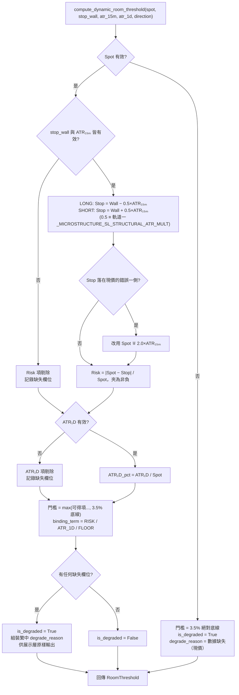

# 動態自適應波動率空間門檻技術規格書

## 1. 核心哲學與適用市場環境

本系統早期的「空間門檻」——進場前要求標的距目標位須保留的獲利空間——是散落在七個位置的固定百分比：四個具名常數（$5\%$ ×3、$3.5\%$ ×1）與三處硬編碼（`spot * 1.05` ×2、`5.0` ×2）。

固定百分比的根本缺陷是**它與標的自身的波動率完全無關**。對單日 ATR 僅 $0.8\%$ 的公用事業股，$5\%$ 是一個月都走不到的天花板，等同於永久封鎖；對單日 ATR 達 $4\%$ 的高波動科技股，$5\%$ 連一根日線的振幅都吃不掉，等同於沒有任何盈虧比保護。同一個數字在兩端都是錯的。

`constants.py` 曾附有一段校準備註坦承左側 $3.5\%$ 門檻「宣稱風報比 3:1，但該推導只在現價幾乎正好貼齊 Put Wall 時成立」——在條件二允許的密著帶上界 $+1.5\%$ 處，實際風報比僅 1.41。這是固定門檻失效的直接證據，也是本規格書存在的原因。

本模型改以「該標的實際要冒的下行風險」與「該標的單日波幅」共同推導門檻，讓 2.2:1 的盈虧比成為結構性保證，而非在特定價位上的巧合。

**適用市場環境**：全域。三套進場鐵律（右側動能、左側均值回歸、做空破位）、五態 Regime 路由分類器、Gamma Squeeze SPEAR 磁吸目標價，以及分析中心的 GEX 空間欄位，全部共用同一條演算法。共用的是**演算法**而非常數值——各站點仍各自獨立呼叫、各自持有輸入，路由層與進場確認層的職責邊界不因此被破壞。

---

## 2. 數學模型與量化推導

### 2.1 公式 A：方向性空間門檻

$$\text{Threshold}_{\text{dynamic}} = \max\Big(2.2 \times \text{Risk}_{\text{actual}},\; 1.5 \times \text{ATR}_{1D\_pct},\; 0.035\Big)$$

三項各自回答一個獨立的問題，取最大值代表「三道防線中最嚴格者說了算」：

1. $2.2 \times \text{Risk}_{\text{actual}}$：**盈虧比要求**。獎酬須達實際風險的 2.2 倍。
2. $1.5 \times \text{ATR}_{1D\_pct}$：**波幅覆蓋要求**。空間至少須涵蓋 1.5 個單日波幅，否則一天的隨機遊走就能把目標位走完。
3. $0.035$：**絕對底線**。任何情況下都不低於 $3.5\%$，涵蓋極低波動標的與資料缺失情境。

其中 $\text{Risk}_{\text{actual}}$ 的推導依部位方向鏡像：

| | 多頭（LONG） | 做空（SHORT） |
| :--- | :--- | :--- |
| 停損參考 | $\text{Stop} = \text{PutWall} - 0.5 \times \text{ATR}_{15m}$ | $\text{Stop} = \text{CallWall} + 0.5 \times \text{ATR}_{15m}$ |
| 實際風險 | $\text{Risk} = \dfrac{\text{Spot} - \text{Stop}}{\text{Spot}}$ | $\text{Risk} = \dfrac{\text{Stop} - \text{Spot}}{\text{Spot}}$ |
| 獎酬參考位 | Call Wall（上行空間） | Put Wall（下行空間） |

$$\text{ATR}_{1D\_pct} = \frac{\text{ATR}_{1D}}{\text{Spot}}$$

**墊片倍數 $0.5$ 必須與引擎實際執行的停損一致**：`anti_washout.py` 軌道一的 `_MICROSTRUCTURE_SL_STRUCTURAL_ATR_MULT` 就是 $0.5$。$\text{Risk}_{\text{actual}}$ 量的是「現價到引擎真正會掛的那一條停損」的距離，兩者一旦脫鉤，$2.2:1$ 就從可驗證的實際盈虧比退化成無法驗證的保守下界。

**牆體拓撲異常時的替代墊片**：若 LONG 的 $\text{Stop} \ge \text{Spot}$（Put Wall 資料異常高於現價，即牆體拓撲逆轉），改用 $\text{Spot} - 2.0 \times \text{ATR}_{15m}$；SHORT 的 $\text{Stop} \le \text{Spot}$ 時鏡像同理。此墊片沿用呈現層既有的「PutWall 異常降級」慣例，不另立第二套邏輯。

$\text{Risk} < 0$ 時夾為 $0$——停損落在進場價的錯誤一側時數學上退化，該項不應反向壓低門檻。

### 2.2 公式 B：牆體緩衝雙邊界

**三種剖面統一量「停損距離」，不是牆距**：

$$\Delta S_{\text{stop}} = \frac{|\text{Spot} - \text{Stop}|}{\text{Spot}}, \qquad \text{Stop} = \text{Wall} \mp 0.5 \times \text{ATR}_{15m}$$

與公式 A 的 $\text{Risk}_{\text{actual}}$ 是**同一條停損、同一個推導**。這道閘門要防的是「停損被日內雜訊掃掉」，那取決於停損離進場價多遠，不是牆離進場價多遠。左側尤其必須如此——條件二本來就要求現價密著 Put Wall，牆距在設計上趨近於零，量牆距會把「現價正好貼齊 Put Wall」這個教科書級的理想進場點判為過窄。

$$\text{通過} \iff m_{\text{low}} \times \frac{\text{ATR}_{15m}}{\text{Spot}} \le \Delta S_{\text{stop}} \le 0.08$$

- **下界（依剖面分流，$\times \text{ATR}_{15m}$）**防「停損落在日內雜訊帶內」，即遭做市商 Liquidity Sweep 洗出場。這是條件三的 $2.2 \times \text{Risk}$ **完全沒有定價**的風險，故必須獨立成閘門。
- **上界（絕對 $8\%$，不分剖面）**是純粹的絕對風險兜底。

**為何上界不能用 ATR 縮放**（這是實測推翻的早期設計，$1.8 \times \text{ATR}_{1D}$）：

1. **重複定價**。它與條件三的 $2.2 \times \text{Risk}$ 在防同一件事（牆太遠 = 風險太大），而條件三已對該風險做了**連續**定價（要求等比例更多的上行空間）；ATR 上界等於同一個風險收第二次費，且第二次是**二元否決**。
2. **量綱錯誤**。$\text{ATR}_{1D} = 0.8\%$ 的低波標的，可接受帶寬僅 $1.05\%$，而 \$100 標的的履約價間距是 \$2.50（$2.5\%$）。**帶寬窄於一個履約價間距**時，GEX 牆能否落進帶內純屬運氣——那不是風控，是抽籤。

| 現價 | 履約價間距 | $\text{ATR}_{1D}$ | 舊上界帶寬 | 帶內可容納履約價數 |
| :--- | :--- | :--- | :--- | :--- |
| \$100 | \$2.50 | $0.8\%$ | $1.05\%$ | **0.42** |
| \$100 | \$2.50 | $1.8\%$ | $2.36\%$ | **0.94** |
| \$200 | \$5.00 | $1.8\%$ | $2.36\%$ | **0.94** |

### 2.3 公式 C：破位追空次級節點空間

$$\text{NextStrikeSpace} = \frac{\text{Spot} - \text{NextPutPeak}}{\text{Spot}} \ge 2.0 \times \text{ATR}_{1D\_pct}$$

$\text{NextPutPeak}$ 為現價下方第一個顯著負 GEX 節點（做市商順勢助跌拋壓的落點），取「現價下方、GEX 為負、絕對曝險最大」的履約價。公式 C 只判定**目標空間**、不含停損項；「收復剛跌破的 Put Wall」是論點失效訊號，SHORT_ENTRY 的實際倉位停損以頂牆錨點 $+ 0.5 \times \text{ATR}_{15m}$ 與出場引擎停損取較遠者計算（見 [`07_short_side_breakdown_ironclad.md`](07_short_side_breakdown_ironclad.md) §2.6）。

### 2.4 ATR 量綱折算

美股單日 390 分鐘 = 26 根 15 分鐘 K 棒，依隨機遊走平方根法則：

$$\text{ATR}_{15m} \approx \frac{\text{ATR}_{1D}}{\sqrt{26}} \approx \frac{\text{ATR}_{1D}}{5.099}$$

真實 15m K 棒 ATR 優先；缺失時由日線 ATR 折算；兩者皆無則視為缺失並觸發降級。

---

## 3. 決策邏輯與狀態機 / 流程圖

---

## 4. 關鍵具名常數與物理約束

| 常數名稱 | 數值 / 門檻 | 物理 / 代碼約束 | 程式碼檔案路徑 |
| :--- | :--- | :--- | :--- |
| `_ROOM_RISK_MULTIPLIER` | `2.2` | 盈虧比要求：獎酬須達實際風險的 2.2 倍 | `nexus_core/market_analysis/room_threshold.py` |
| `_ROOM_ATR_1D_MULTIPLIER` | `1.5` | 空間至少須涵蓋 1.5 個單日波幅 | `nexus_core/market_analysis/room_threshold.py` |
| `_ROOM_ABSOLUTE_FLOOR_PCT` | `0.035` ($3.5\%$) | 絕對底線，任何情況下都不低於此值 | `nexus_core/market_analysis/room_threshold.py` |
| `_ROOM_STOP_ATR_15M_MULTIPLIER` | `0.5` | 停損墊片 $\text{Stop} = \text{Wall} \mp 0.5 \times \text{ATR}_{15m}$；**必須**與 `_MICROSTRUCTURE_SL_STRUCTURAL_ATR_MULT` 同步 | `nexus_core/market_analysis/room_threshold.py` |
| `_ROOM_STOP_FALLBACK_ATR_15M_MULTIPLIER` | `2.0` | 牆體拓撲異常時的替代墊片 | `nexus_core/market_analysis/room_threshold.py` |
| `_BREAKDOWN_NEXT_STRIKE_ATR_1D_MULTIPLIER` | `2.0` | 破位追空次級節點空間之最低倍數 | `nexus_core/market_analysis/room_threshold.py` |
| `_BUFFER_LOWER_MULTIPLIERS["RIGHT"]` | `2.5` | Regime III 右側動能態的停損距離下界倍率 | `nexus_core/market_analysis/room_threshold.py` |
| `_BUFFER_LOWER_MULTIPLIERS["LEFT"]` | `0.5` | Regime I 左側接刀態；**必須 $\le$ 停損墊片倍數**，否則貼牆進場恆不通過 | `nexus_core/market_analysis/room_threshold.py` |
| `_BUFFER_LOWER_MULTIPLIERS["SHORT"]` | `2.5` | Regime V 破位追空態；測距對象為上方阻力牆 | `nexus_core/market_analysis/room_threshold.py` |
| `_BUFFER_MAX_STOP_DISTANCE_PCT` | `0.08` ($8\%$) | 停損距離的**絕對**上限兜底，不隨 ATR 伸縮 | `nexus_core/market_analysis/room_threshold.py` |
| `_LEGACY_BUFFER_MAX_PCT` | `0.05` ($5\%$) | ATR 兩項皆缺時退回的舊版單邊上限 | `nexus_core/market_analysis/room_threshold.py` |
| `_BARS_PER_SESSION` | `26.0` | 美股單日 390 分鐘 / 15 分鐘 = 26 根 K 棒 | `nexus_core/market_analysis/room_threshold.py` |
| `_ATR_14_PLACEHOLDER` | `0.01` | `EnhancedWatchlistMetrics.atr_14` 因 `gt=0.0` 無法寫 0 的佔位值，須視為缺失 | `nexus_core/market_analysis/room_threshold.py` |

**校準狀態**：`_ROOM_ATR_1D_MULTIPLIER`、`_BREAKDOWN_NEXT_STRIKE_ATR_1D_MULTIPLIER` 已登錄為可校準參數，由離線事件研究以純價格代理產出建議（GEX 牆體以前 10／60 日高低點代理，證據力有限）；`_ROOM_ABSOLUTE_FLOOR_PCT` 屬風險政策，只報告不提案。GEX 相關門檻的正式調整須等待前向蒐集資料，見 [`05_calibration_harness_and_forward_collection.md`](../architecture/05_calibration_harness_and_forward_collection.md)。

---

## 5. 邊界條件、風控熔斷與例外處理

1. **降級階梯與強制揭露**：任一輸入缺失，該項即自 $\max()$ 中剔除，其餘項與 $3.5\%$ 絕對底線照常參與；三項皆不可得時門檻即為 $3.5\%$。任何降級都會標記 `is_degraded` 並附上可直接呈現的繁體中文原因字串，呼叫端**有義務**向使用者揭露——分析中心的 GEX 空間欄位會在旗標下方獨立一行輸出該原因，六重鐵律的逐項判定字串則以 `｜⚠️` 前綴附加。

2. **`0.01` 佔位值陷阱**：`EnhancedWatchlistMetrics.atr_14` 的欄位約束是 `gt=0.0`，因此「日線 ATR 取不到」時寫入的是 `0.01` 佔位值而非 `0`。判定有效性時必須排除此值，否則會得到一個約 $0.015$ 美元的假緩衝。`resolve_atr_15m()` 內建此排除。

3. **NaN / Inf 輸入**：所有輸入一律經 `math.isfinite()` 與正值檢查，不合格者視為缺失並走降級路徑，絕不拋例外——所有呼叫端都是盤中熱路徑。

4. **停損墊片與軌道一的強制同步不變式**：公式 A/B 的 $0.5$ 必須恆等於 `anti_washout.py` 軌道一的 `_MICROSTRUCTURE_SL_STRUCTURAL_ATR_MULT`。早期版本依文獻規格使用 $1.5$，與引擎實際執行的 $0.5$ 脫鉤，使 $\text{Risk}_{\text{actual}}$ 系統性高估真實風險（252 點參數掃描顯示該分歧單獨造成「應保留進場格點」的保留率自 $100\%$ 掉到 $92.5\%$），且讓 $2.2:1$ 退化成無法驗證的保守下界。另有一條連帶不變式：`_BUFFER_LOWER_MULTIPLIERS["LEFT"]` 必須 $\le$ 本墊片倍數——貼牆進場時停損距離恆等於墊片倍數 $\times \text{ATR}_{15m}$，下界一旦高於它，左側策略的設計中心點本身就永遠無法通過。兩條不變式皆有單元測試鎖定。

5. **統一量停損距離的必要性**：三種剖面全部量停損距離（見 §2.2），不再有「量牆距 vs 量停損距離」的分歧。若退回牆距量測，左側六重鐵律的條件二將近乎永遠無法通過——左側條件二本來就要求現價密著 Put Wall，牆距在設計上趨近於零。修改量測基準前必須先確認左側密著帶定義未一併調整。

6. **`stop_wall` 的現價物理約束前置義務**：傳入公式 A 的 `stop_wall` 必須是**已通過現價物理約束校驗**的牆體。`compute_reference_stop()` 對「牆體落在現價錯誤一側」有一道拓撲逆轉 fallback（LONG 改用 $\text{Spot} - 2.0 \times \text{ATR}_{15m}$），它保證停損不會落在進場價的錯誤一側，但代價是 $\text{Risk}_{\text{actual}}$ 退化成一個**與真實支撐位置完全脫鉤的固定 ATR 代理**。快取牆體已失效（現價跌穿 Put Wall）而次一道真實支撐遠在下方時，門檻會被系統性低估——現價 $\$100$／失效底牆 $\$102$／真實支撐 $\$90$／$\text{ATR}_{15m} = 1.0$ 的數值範例是門檻 $4.4\%$ vs $23.1\%$。因此呼叫端**有義務**先經 `resolve_room_threshold_inputs(target_spot=...)` 重錨（規則見 [`../microstructure/02_wall_physical_constraints.md`](../microstructure/02_wall_physical_constraints.md) §2.2.2），重錨不到則傳 $0.0$ 讓 $\text{Risk}$ 項走降級剔除而非假值。

7. **降級揭露不得因判定有利而省略**：`is_degraded` 的揭露義務與判定結果無關。空間充足、緩衝落在甜蜜點等**有利**結論若建立在降級門檻上，同樣必須輸出 `degrade_reason`——否則使用者會誤以為那是完整數據下的判定。分析中心 GEX 欄位的兩側（PutWall 緩衝三態、CallWall 空間）皆已統一為「一律揭露」。

8. **ATR₁D 取數的網路成本**：`fetch_atr_1d()` 刻意**不**使用 `force_refresh`——日線 ATR 的量級在盤中幾乎不動，既有的日線快取足以覆蓋整個交易日。呼叫端應優先沿用手上已有的 `atr_14`（radar 快取、`EnhancedWatchlistMetrics` 皆已攜帶），只有真的取不到才發動抓取。

---

## 6. 核心程式碼檔案路徑關聯

- `nexus_core/market_analysis/room_threshold.py`：
  - 公式 A：`compute_dynamic_room_threshold()`
  - 公式 B：`evaluate_wall_buffer()`、下界倍率表 `_BUFFER_LOWER_MULTIPLIERS`、絕對上界 `_BUFFER_MAX_STOP_DISTANCE_PCT`
  - 公式 C：`evaluate_next_strike_space()`
  - 量綱折算：`resolve_atr_15m()`
  - 停損推導：`compute_reference_stop()`（公開，SHORT_ENTRY 倉位計算共用；保留私有別名 `_compute_reference_stop`）
- `nexus_core/market_analysis/atr_utils.py`：`fetch_atr_1d()`、`fetch_atr_15m()`、`compute_atr_15m_from_df()`、`compute_atr_14_from_daily_df()`
- `nexus_core/market_analysis/dynamic_rollover/_shared.py`：`resolve_room_threshold_inputs()`（三項輸入的集中解析、取數優先序，以及 `target_spot` 的 Put Wall 現價物理約束校驗）
- `nexus_core/market_analysis/dynamic_rollover/opportunity_cost.py`：右側條件二／條件三（**已**套用 `target_spot` 重錨，重錨值經 `put_wall=` 餵入條件三）
- `nexus_core/market_analysis/dynamic_rollover/left_side_entry.py`：左側條件二／條件三（**已**套用 `target_spot` 重錨，重錨值經 `stop_wall=` 餵入條件三；條件二刻意仍用 raw Put Wall——它量的是「距原始底牆多遠」的密著帶，餵重錨值會讓該語意失效）
- `nexus_core/market_analysis/dynamic_rollover/short_side_entry.py`：做空條件二／條件三（**刻意不**套用——做空的停損牆是現價上方的 Call Wall，由條件二的 `_scan_resistance_wall_above_spot()` 自行解析並以 `resistance_wall` 傳給條件三）
- `nexus_core/market_analysis/dynamic_rollover/regime_classifier.py`：Regime III / IV / V 的空間與緩衝判定
- `nexus_core/market_analysis/gamma_squeeze_engine.py`：SPEAR 磁吸目標價的向上空間要求
- `nexus_core/cogs/embed_builders/portfolio_embeds.py`：分析中心 GEX 上檔壓力／下檔支撐欄位的旗標渲染
- `nexus_core/tests/unit/test_room_threshold.py`：三組公式與降級階梯的單元測試
