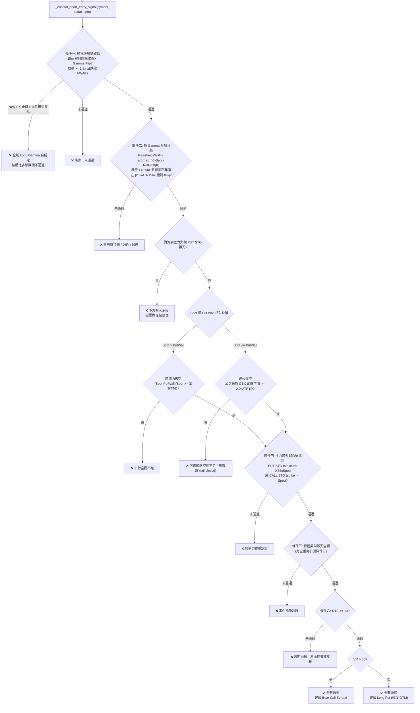

# 做空交易六重嚴格過濾鐵律技術規格書

## 1. 核心哲學與適用市場環境

**本規格書描述的是本系統唯一的空頭方向進場路徑。** 在此之前 `trading_strategy` 的三個值（`RIGHT_SIDE` / `LEFT_SIDE` / `DYNAMIC`）全部是做多——左側交易儘管技術定義與右側相反，本質仍是逆勢均值回歸、做市商 Put Wall 底牆**接刀**：它的條件三算的是「**向上**」回歸空間，條件六在高 IVR 時建議的是 Bull Call Spread / Short Put。把左側誤讀為做空，是理解本系統時最容易犯的錯。

做空的核心哲學是**利用做市商在負 Gamma 區的順勢助跌拋壓**。當現價跌破 Gamma Flip 使做市商翻入負 Gamma，他們的 Delta 對沖行為由「買跌賣漲吸收波動」反轉為「跌則加賣」，形成自我強化的下行螺旋。做空系統的任務是在這個螺旋啟動的當下切入，而不是在任何一根紅 K 上摸頂。

本系統將做空拆為兩個共用同一套六重鐵律的子模式，差異只在條件三的空間判定：

| 子模式 | 觸發條件 | 獲利目標 | 停損位置 |
| :--- | :--- | :--- | :--- |
| **區間內做空** | $\text{Spot} > \text{PutWall}$ | Put Wall（做市商正 Gamma 底牆） | 上方阻力頂牆 $+ 1.5 \times \text{ATR}_{15m}$ |
| **破位追空** | $\text{Spot} \le \text{PutWall}$ | 現價下方第一個顯著負 GEX 節點 | 貼緊剛跌破的 Put Wall（回站上即停損） |

**適用市場環境**：Regime V 破位追空態（`DYNAMIC` 模式自動路由），或使用者於 `/settings` 手動選擇 `SHORT_SIDE`。**不適用**於 Regime IV 的宏觀鎖定分支——系統性流動性危機與大盤負 Gamma 踩踏下，做空同樣會被劇烈軋空，該分支對做多做空一視同仁地全面封鎖。

---

## 2. 數學模型與量化推導

### 2.1 條件一：結構性放量破位確認

全面鏡像右側條件一，方向反轉。四項要素須同時成立：

$$
\begin{aligned}
&\text{(1)}\quad \text{Close}_{15m} < \text{BreakdownLevel} \\
&\text{(2)}\quad \text{Volume}_{15m} \ge 1.5 \times \overline{\text{Volume}}_{20} \\
&\text{(3)}\quad \text{Close}_{15m} < \text{Open}_{15m} \quad \text{（實體陰線）} \\
&\text{(4)}\quad \text{Close}_{15m} < \text{SessionVWAP}
\end{aligned}
$$

$\text{BreakdownLevel}$ 的取值依 Gamma Flip 可得性分流：

$$\text{BreakdownLevel} = \begin{cases}
\text{GammaFlip} & \text{存在零交叉點}\\
\text{SessionVWAP} - 0.5 \times \text{ATR}_{15m} & \text{無交叉點且 } \text{NetGEX}_{\text{全鏈}} < 0\\
\text{（直接判定未通過）} & \text{無交叉點且 } \text{NetGEX}_{\text{全鏈}} > 0
\end{cases}$$

第三種情形是右側「$\text{NetGEX} < 0$ 直接不通過」的精確鏡像：全鏈正 Gamma 代表做市商處於買跌賣漲的自穩定狀態，順勢助跌的物理前提不存在，屬結構性多頭。$\text{NetGEX} = 0$ 或數據缺失一律 fail-safe 判定未通過。

### 2.2 條件二：做市商負 Gamma 壓制頂牆完好

阻力位在物理定義上必須位於現價**上方**，掃描範圍強制約束：

$$\text{ResistanceWall} = \underset{K > \text{Spot}}{\arg\max}\ \text{NetGEX}(K), \qquad \text{NetGEX}(K) > 0$$

此為支撐牆定理 $\text{SupportWall} = \arg\max_{K < \text{Spot}} \text{NetGEX}(K)$ 的完整鏡像。物理意義同樣對稱：做市商在該履約價持有大量正 Gamma，價格漲上去時必須賣出對沖，形成天花板；正如支撐牆處他們必須買進對沖而形成地板。

牆體厚度沿用同一套薄紙牆門檻 $\text{GEX}(\text{Wall}) \ge 500{,}000$，低於此值視為「未偵測到有效頂牆」而非信任一面隨時會被打穿的薄牆。

緩衝距離走 [`06_dynamic_adaptive_room_threshold.md`](06_dynamic_adaptive_room_threshold.md) 的公式 B（`profile="SHORT"`）：

$$2.5 \times \frac{\text{ATR}_{15m}}{\text{Spot}} \le \frac{(\text{ResistanceWall} + 0.5 \times \text{ATR}_{15m}) - \text{Spot}}{\text{Spot}} \le 0.08$$

量的是**停損距離**（空單停損設在頂牆上方 $0.5 \times \text{ATR}_{15m}$）。下界防停損落在日內雜訊帶內——牆體太近時任何反抽都會先掃穿它；上界為絕對 $8\%$ 的風險兜底。

### 2.3 條件三：下行獲利空間 + 無主力接刀

**接刀過濾器**（鏡像左側條件三的「追空踩踏」偵測，方向反轉為 PUT STO）：

$$\text{否決} \iff \exists\ \text{UOA}: \text{PUT} \wedge \text{STO} \wedge \text{ratio} > 1.2\text{x} \wedge \text{Notional} \ge \$200{,}000 \wedge \text{Strike} \le \text{Spot}$$

主力大額賣出 PUT 是在為下跌提供流動性接盤（做市商據此買進現貨對沖），代表有人正在承接，追空的拋壓路徑會被墊住。

**空間判定**依子模式分流：

區間內做空（$\text{Spot} > \text{PutWall}$）：

$$\text{Reward}_{\text{down}} = \frac{\text{Spot} - \text{PutWall}}{\text{Spot}} \ge \max\Big(2.2 \times \text{Risk},\ 1.5 \times \text{ATR}_{1D\_pct},\ 0.035\Big)$$

$$\text{Risk} = \frac{(\text{CallWall} + 0.5 \times \text{ATR}_{15m}) - \text{Spot}}{\text{Spot}}$$

破位追空（$\text{Spot} \le \text{PutWall}$）改走公式 C：

$$\frac{\text{Spot} - \text{NextPutPeak}}{\text{Spot}} \ge 2.0 \times \frac{\text{ATR}_{1D}}{\text{Spot}}$$

$\text{NextPutPeak}$ 取現價下方、GEX 為負、絕對曝險最大的履約價。找不到候選一律 fail-closed——追空是進攻動作，無法確認空間即不進場。

### 2.4 條件四：主力跨週期賣壓認證

二擇一即可，皆須同時滿足 $\text{DTE} \ge 7$、$\text{ratio} \ge 0.8\text{x}$、$\text{Notional} \ge \$200{,}000$：

$$
\begin{aligned}
&\text{(A) PUT BTO 方向性押注：} \quad \text{Strike} \ge 0.85 \times \text{Spot}\\
&\text{(B) CALL STO 上方築頂：} \quad \text{Strike} \ge \text{Spot}
\end{aligned}
$$

(A) 的 strike 下限排除深度價外的低成本尾部樂透單——那不代表機構對方向有真實信心，與右側條件四排除「深實值避險單」的用意對稱。(B) 的 strike 下限排除賣出價內 Call 的平倉單。

### 2.5 條件五與條件六

**條件五**完全重用右側的 `_confirm_entry_condition5_macro_earnings_gate`（財報緩衝期 + 大盤 Regime）。二元事件風險對做多做空同樣致命——空單遇上優於預期的財報會被跳空軋空，門檻校準沒有理由分家。

刻意**不**疊加左側的 VIX 期限結構倒掛檢查：左側把倒掛視為「流動性凍結、不可接刀」，但對做空而言倒掛正是順風，兩者語意相反，硬套會方向性地誤殺。

**條件六**的 DTE 門檻為 $14$（高於右側的 $1$、接近左側的 $21$）：破位後常有劇烈反抽回測前低，空單需要承受震盪期，短天期會在回測過程中被 Theta 與 Vega 雙殺。IVR 分流方向與左右側一致——高隱波下不當單腳買方：

$$\text{Structure} = \begin{cases}
\text{Long Put（輕度 OTM）} & \text{IVR} \le 50\\
\text{Bear Call Spread} & \text{IVR} > 50
\end{cases}$$

---

## 3. 決策邏輯與狀態機 / 流程圖

---

## 4. 關鍵具名常數與物理約束

| 常數名稱 | 數值 / 門檻 | 物理 / 代碼約束 | 程式碼檔案路徑 |
| :--- | :--- | :--- | :--- |
| `_SHORT_ENTRY_VOLUME_SURGE_MULTIPLIER` | `1.5` | 條件一放量門檻，須達前 20 根均量的 1.5 倍 | `nexus_core/market_analysis/dynamic_rollover/constants.py` |
| `GEX_THIN_WALL_THRESHOLD` | `500,000.0` | 條件二頂牆有效性之最低 GEX 深度門檻 | `nexus_core/market_analysis/index_microstructure.py` |
| `_BUFFER_LOWER_MULTIPLIERS["SHORT"]` | `2.5` | 條件二停損距離下界倍率（×ATR₁₅ₘ） | `nexus_core/market_analysis/room_threshold.py` |
| `_BUFFER_MAX_STOP_DISTANCE_PCT` | `0.08` ($8\%$) | 停損距離的絕對上限兜底 | `nexus_core/market_analysis/room_threshold.py` |
| `_SHORT_ENTRY_UOA_CATCH_RATIO_THRESHOLD` | `1.2` | 條件三主力 PUT STO 接刀單之 ratio 門檻 | `nexus_core/market_analysis/dynamic_rollover/constants.py` |
| `_SHORT_ENTRY_UOA_CATCH_MIN_PREMIUM_USD` | `200,000.0` | 條件三接刀單之最低權利金名目金額 | `nexus_core/market_analysis/dynamic_rollover/constants.py` |
| `_BREAKDOWN_NEXT_STRIKE_ATR_1D_MULTIPLIER` | `2.0` | 破位追空次級節點空間最低倍數 | `nexus_core/market_analysis/room_threshold.py` |
| `_SHORT_ENTRY_UOA_MIN_DTE` | `7` | 條件四主力賣壓最低 DTE 要求 | `nexus_core/market_analysis/dynamic_rollover/constants.py` |
| `_SHORT_ENTRY_UOA_MIN_RATIO` | `0.8` | 條件四最低 ratio (Volume/OI) 要求 | `nexus_core/market_analysis/dynamic_rollover/constants.py` |
| `_SHORT_ENTRY_UOA_MIN_NOTIONAL_USD` | `200,000.0` | 條件四最低權利金名目金額要求 | `nexus_core/market_analysis/dynamic_rollover/constants.py` |
| `_SHORT_ENTRY_CANDIDATE_MIN_DTE` | `14` | 條件六：破位後反抽期需要的最低效期 | `nexus_core/market_analysis/dynamic_rollover/constants.py` |
| `_SHORT_ENTRY_IVR_SPREAD_THRESHOLD` | `50.0` | 條件六：IVR 超過即改 Bear Call Spread | `nexus_core/market_analysis/dynamic_rollover/constants.py` |
| `_REGIME_V_RSI_MAX` | `45.0` | Regime V 路由層的 15m RSI 上限（未經回測校準） | `nexus_core/market_analysis/dynamic_rollover/constants.py` |
| `_REGIME_V_VOLUME_SURGE_MULT` | `1.5` | Regime V 路由層的放量倍數門檻 | `nexus_core/market_analysis/dynamic_rollover/constants.py` |

做空部位的出場矩陣常數與多頭共用同一組（`_MICROSTRUCTURE_SL_*` / `_MICROSTRUCTURE_TP*`），僅方向反轉，詳見 [`05_dual_track_anti_washout_stop_loss.md`](05_dual_track_anti_washout_stop_loss.md)。

---

## 5. 邊界條件、風控熔斷與例外處理

1. **Fail-safe 原則**：比照左右側鐵律，任何一項條件所需資料缺失、抓取失敗或無法確認，一律判定該條件未通過（不進場），不預設通過、不略過。破位追空的次級節點缺失同樣 fail-closed。

2. **短路略過**：條件五、六在前四項未全數通過時短路略過（標記 `⏭️`），避免對已確定失敗的整體結果仍發動真實 I/O（財報行事曆、大盤 Regime、選擇權到期日清單）。六項條件在輸出字串中永遠完整列出。

3. **UOA 時間窗無法實作**：規格中的「須在過去 N 小時內偵測到」與左側條件四同樣無法實作——UOA 清單來自對選擇權鏈的**當日累計快照**（`volume` 為當日累計、`oi` 為前一交易日收盤），並非逐筆 time-and-sales tape，每一列都不帶成交時間戳。

4. **Regime 判定優先序**：宏觀鎖定分支（`SYSTEMIC_LIQUIDITY_CRISIS` / `SHORT_GAMMA_CRITICAL` / VIX 深度倒掛）壓過一切，做多做空皆禁；其次才是 Regime V。Regime V **優先於** Regime IV 的個股結構封頂分支——壓頂與破位可以同時成立，若不拆分優先序，做空將永遠被 Regime IV 遮蔽而無法觸發。詳見 [`01_regime_routing_matrix.md`](01_regime_routing_matrix.md)。

5. **⚠️ `_REGIME_V_RSI_MAX = 45.0` 未經回測校準**：該值是對 `_REGIME_III_RSI_MIN = 55.0` 以 50 為軸的鏡像推導值。破位追空的假訊號成本高於右側動能（空頭軋空的尾部風險不對稱），上線後應優先觀察此門檻的實際觸發率與勝率再行調整。

6. **組合層風控的方向感知化（已補強）**：做空部位進入組合後，以下路徑原本建立在「全部部位為多頭」的假設上，已逐項修正：

   | 缺口 | 原行為 | 修正 |
   | :--- | :--- | :--- |
   | `database/portfolio.py` 的 `if qty > 0` | 空頭現貨對全站持倉饋送**完全隱形** | 改為 `qty != 0` |
   | `/add_holding` 驗證 | `quantity <= 0` 直接拒絕，空頭現貨無法登錄 | 改為僅拒絕 `quantity == 0` |
   | `margin.py` 無 `stock` 分支 | 空頭現貨保證金恆為 $0$，`portfolio_heat` 顯示 $0\%$，$30\%/50\%$ 熱度煞車完全失效 | 新增 Reg-T 初始保證金（市值 $\times 50\%$） |
   | `calculate_auto_capital` 用帶號 `quantity` | 空頭從總資本中**扣除**自身名目，壓縮所有百分比的共同分母 | 改取絕對值（帳戶規模是量值） |
   | `hedging.evaluate_rehedge_necessity` 單邊比較 | 淨空頭曝險再大都不觸發個人風險上限 | 改為 `abs(exposure) > risk_limit` 雙邊判定 |
   | `hedging.suggest_hedge_unlock` 把負 Delta 等同對沖 | 在多頭共振訊號時建議平掉使用者刻意建立的做空論點 | 新增 `_sum_hedge_only_delta()`，僅計入 `trade_category == "HEDGE"` 的部位 |
   | `anti_washout` 的 `current_alloc` 為負 | 衛星再平衡**永遠無法削減過大的空頭** | 分子分母同步取絕對值 |
   | `portfolio_monitor` 的 `total_val` 帶號加總 | 多空互相抵銷，高估其餘部位的配置比例 | 改取絕對值 |
   | `margin_defense` 的 `satellite_value` 帶號加總 | 空頭**降低**測得曝險，恰在槓桿最高時抑制保證金訊號 | 改取絕對值 |
   | 三處 `-1 if "STO" in strategy else 1` | `SHORT_SIDE` / `Long Put` / `Bear Call Spread` 皆無 "STO" 字串，被誤判為多頭 | 抽出 `risk_engine.is_short_exposure_strategy()` 單一判定並共用 |
   | 現貨 P&L 未依方向翻號 | 空頭現貨回報反向損益 | 比照選擇權分支加上 `quantity < 0` 翻轉 |

   ⚠️ **仍未處理**：VIX 戰情階梯的所有閘門都以 `"STO"`/`"BTO"` 字串為鍵，做空進場不經過任何一道；且該階梯的前提對做空是反的（高 VIX 給最大侵略性，那對賣權利金正確、對追空錯誤）。`execution_router` 的凱利勝率先驗 `RSI < 50 ⇒ 勝率較高` 同樣是多頭先驗。兩者都需要獨立的做空校準，不宜以機械翻轉處理。

7. **部位方向的識別**：做空部位沿用既有的「股數/口數為負」慣例識別，不新增資料庫欄位。出場矩陣的四個入口皆依此分流至鏡像版，未標記方向的既有部位一律視為多頭，確保零行為變化。

---

## 6. 核心程式碼檔案路徑關聯

- `nexus_core/market_analysis/dynamic_rollover/short_side_entry.py`：
  - Orchestrator：`_confirm_short_entry_signal()`
  - 條件一～六：`_confirm_short_entry_condition{1..6}_*()`
  - 次級節點探測：`_find_next_negative_gex_peak()`
- `nexus_core/market_analysis/dynamic_rollover/structural_signals.py`：`_scan_resistance_wall_above_spot()`（$K > \text{Spot}$ 阻力頂牆掃描）、`_detect_whale_call_bto_block()`（做空的 SL-主力對沖偵測）
- `nexus_core/market_analysis/dynamic_rollover/regime_classifier.py`：Regime V 破位追空態的分類與優先序
- `nexus_core/market_analysis/dynamic_rollover/anti_washout.py`：做空鏡像出場矩陣（`_correct_wall_topology_short()`、`_compute_short_anti_washout_stop()`、`_evaluate_microstructure_tp_ladder_short()`、`_evaluate_microstructure_sl_ladder_short()`）
- `nexus_core/market_analysis/dynamic_rollover/opportunity_cost.py`：`SHORT_SIDE` 與 Regime V 的策略路由分支
- `nexus_core/market_analysis/dynamic_rollover/models.py`：`TradingStrategyMode.SHORT_SIDE`、`DynamicRegime.REGIME_V_BREAKDOWN_CHASE`
- `nexus_core/database/migrations/v074_add_previous_put_wall.py`／`nexus_core/database/market_cache.py`：`previous_put_wall` 的持久化通路（做空 TP2 牆體向下遷移判定所需，鏡像 `v069`）
- `nexus_core/cogs/settings_ui.py`：交易策略 4 選 1 選單與方向標註
- `nexus_core/cogs/embed_builders/portfolio_embeds.py`：做空鐵律說明區塊 `_ENTRY_RULES_DETAIL_SHORT`
- `nexus_core/tests/unit/test_short_side_entry.py`：六重鐵律逐條單元測試
- `nexus_core/tests/unit/test_short_exit_matrix.py`：做空 SL/TP 矩陣與方向分流測試
