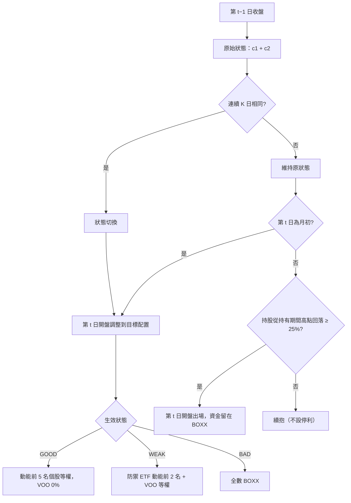

# 大盤三態切換 + 動能輪動策略 (Regime-Switched Momentum Rotation)

> **狀態：候選策略、僅有離線回測。** 本策略是取代動態轉倉引擎（[`04_dynamic_rollover_state_machine.md`](04_dynamic_rollover_state_machine.md)）的候選，尚未接入任何 production 路徑。2007–2025 回測**未通過**使用者的及格標準（見 §3.2），不得據此上線或移除舊引擎。

## 1. 核心哲學與適用市場環境

### 1.1 為什麼需要新策略
動態轉倉引擎在 2025 單年（SPY／NVDA／GLD）、2022–2025 十標的與科技股三組回測中，都被「同等下行風險的固定比例股票 + BOXX」（減碼 B&H）支配：它的回撤較淺，但那是因為平均持股比例較低，而非選時；在同等下行風險下報酬低 30–90 個百分點。使用者（主策略 Buy & Hold）因此要求擬定以**降低暴跌風險為主、停利盡量放寬**的新策略。

### 1.2 策略構想
- **行情好**：不持有指數核心（VOO 0%），資金全數投入近期動能最強的個股，讓贏家持續跑。
- **行情轉弱**：轉入防禦型產業 ETF（必需消費、醫療、公用、黃金）中動能最強者，並退守 VOO。
- **行情很差**：全部退到 BOXX（1–3 個月箱型價差 ETF，報酬接近短期國庫券）。
- **不設停利**；只以「從持有期間高點回落」截斷崩跌中的個股。

### 1.3 設計原則
- **只用日線、每月調整**：規則少、交易頻率低，降低過度擬合；也因此能回測到 2007 年，涵蓋 2008、2020、2022 三段崩跌。
- **無前視**：第 $t$ 日的決策只用第 $t-1$ 日收盤為止的資料，第 $t$ 日開盤成交。
- **控制事後挑選偏差**：選股池刻意包含當年強勢、後來崩跌或長期落後的標的，並以「等權持有同一選股池」作為對照，量測策略本身而非選股池的價值。

## 2. 數學模型與量化推導

### 2.1 大盤三態
以 SPY 收盤 $P_t$、50 日均線 $\text{SMA}^{50}_t$、200 日均線 $\text{SMA}^{200}_t$：

$$
c_1 = \mathbb{1}\left[P_t > \text{SMA}^{200}_t\right], \qquad
c_2 = \mathbb{1}\left[\text{SMA}^{50}_t > \text{SMA}^{200}_t\right]
$$

$$
\text{Regime}^{\text{raw}}_t =
\begin{cases}
\text{GOOD} & c_1 + c_2 = 2 \\
\text{WEAK} & c_1 + c_2 = 1 \\
\text{BAD} & c_1 + c_2 = 0
\end{cases}
$$

生效狀態只在原始狀態連續 $K$（預設 3）個交易日相同時才切換。

### 2.2 12-1 動能
$$
M_{i,t} = \frac{P_{i,\,t-21}}{P_{i,\,t-252}} - 1
$$

只有在 $t$ 時已累積至少 $253$ 筆有效收盤的標的才有分數（point-in-time 可用性）；未上市或剛上市者不入選。

### 2.3 目標配置
$$
w_{i,t} =
\begin{cases}
\dfrac{1}{N}, & \text{GOOD 且 } i \in \operatorname{Top}_N(M_{\cdot,t-1}),\ N = 5 \\[4pt]
\dfrac{1}{3}, & \text{WEAK 且 } i \in \operatorname{Top}_2(M^{\text{def}}_{\cdot,t-1}) \cup \{\text{VOO}\} \\[4pt]
1, & \text{BAD 且 } i = \text{BOXX}
\end{cases}
$$

### 2.4 回落出場
個股 $i$ 自進場日 $e$ 起的持有期間最高收盤 $H_{i,t} = \max_{e \le s \le t} P_{i,s}$；當

$$
P_{i,t} \le (1 - \delta)\, H_{i,t}, \qquad \delta = 0.25
$$

於 $t+1$ 日開盤出場，資金留在 BOXX 直到下一次調整。

### 2.5 評估
Sortino 以期間內 BOXX（BIL 代理）的實際年化報酬為 MAR；減碼 B&H 以下行差對齊：

$$
w = \operatorname{clip}\!\left(\frac{DD_{\text{策略}}}{DD_{\text{對照}}}, 0, 1\right), \qquad
r^{\text{scaled}}_t = w\, r^{\text{對照}}_t + (1-w)\, r^{\text{BOXX}}_t
$$

## 3. 決策邏輯與狀態機 / 流程圖

### 3.1 2007–2025 回測結果（日線，初始 $100k，單邊成本 0.15%）

MAR = 期間 BOXX／BIL 實際年化報酬 1.38%。

| 組合 | Sortino | 年化超額 vs 減碼 VOO | 年化超額 vs 減碼等權池 | MDD | 1 日 CVaR95 | CAGR |
| :--- | ---: | ---: | ---: | ---: | ---: | ---: |
| **策略** | **1.42** | +16.0 pp | **−0.4 pp** | 39.6% | 4.0% | 26.8% |
| a. B&H VOO | 0.66 | — | — | 55.2% | 3.0% | 10.7% |
| b. B&H 等權選股池 | 1.44 | — | — | 55.3% | 3.9% | 28.2% |

| 崩跌區間 | 策略 MDD | VOO MDD | 等權池 MDD |
| :--- | ---: | ---: | ---: |
| 2008 金融海嘯（2007-10～2009-03） | **18.2%** | 55.2% | 55.3% |
| 2020 疫情（2020-02～03） | **39.1%** | 34.0% | 29.7% |
| 2022 空頭 | 26.6% | 24.5% | 43.2% |

### 3.2 及格判定（使用者標準：同等下行風險下優於減碼 B&H，且三段崩跌 MDD ≤ 對照 × 0.75）

| 項目 | 結果 |
| :--- | :---: |
| Sortino > 減碼 VOO | ✅ |
| Sortino > 減碼等權選股池 | ❌（1.42 vs 1.44） |
| 年化超額 vs 減碼 VOO > 0 | ✅ |
| 年化超額 vs 減碼等權選股池 > 0 | ❌（−0.4 pp） |
| 三段崩跌 MDD 皆 ≤ VOO × 0.75 | ❌（2020、2022 未通過） |
| 三段崩跌 MDD 皆 ≤ 等權池 × 0.75 | ❌（2020 未通過） |

**整體：不通過。** 策略相對 VOO 大幅勝出，但相對「等權持有同一選股池」沒有增益——勝出主要來自選股池本身（大型科技成長股），而非動能輪動或狀態切換。狀態切換只在 2008 這種緩跌型空頭有效；2020 這種急跌，50／200 日均線加 3 日確認反應太慢，集中持有的高 Beta 個股反而比 VOO 跌得更深。

### 3.3 穩健性
- **參數敏感度**（一次改一個）：Sortino 介於 1.15（前 3 名）到 1.48（確認 5 日）；相對等權池的年化超額介於 −3.2 到 +0.7 pp，正負隨參數翻轉，屬雜訊範圍。
- **子期間**：2007–2015 策略 Sortino 1.57、優於減碼等權池（1.15，年化超額 +6.0 pp）；2016–2025 策略 1.38、輸給減碼等權池（1.74，−4.5 pp）。兩段結論相反。
- **交易特性**：狀態切換 63 次，其中 23 次在 20 個交易日內切回（whipsaw）；單邊年換手率約 500%；個股平均持有 47 個交易日；回落停損 44 次（TSLA 11、AMD 7、MRNA 6、COIN 5）；平均 BOXX 權重 18.8%。

## 4. 關鍵具名常數與物理約束

| 常數（`RegimeMomentumParams`） | 值 | 說明 |
| :--- | :--- | :--- |
| `sma_fast` / `sma_slow` | 50 / 200 | 大盤三態均線 |
| `confirm_days` | 3 | 狀態切換需連續成立的交易日數 |
| `top_n` | 5 | GOOD 狀態持有的動能個股數 |
| `defensive_top_n` | 2 | WEAK 狀態持有的防禦 ETF 數（另加 VOO） |
| `momentum_lookback` / `momentum_skip` | 252 / 21 | 12-1 動能 |
| `trailing_stop` | 0.25 | 從持有期間最高收盤回落出場 |
| `cost_rate` | 0.0015 | 單邊交易成本 |
| `fallback_cash_rate` | 0.045 | BOXX、BIL 皆無資料時的現金年化利率 |
| `CRASH_MDD_RATIO` | 0.75 | 「崩跌 MDD 明顯低於 B&H」的量化門檻（報告腳本） |

選股池（`DEFAULT_UNIVERSE`）：AAPL、MSFT、AMZN、GOOGL、META、NVDA、AMD、INTC、CSCO、ORCL、IBM、QCOM、TXN、ADBE、CRM、NFLX、TSLA、MU、AVGO、PLTR、MRNA、COIN。防禦 ETF：XLP、XLV、XLU、GLD。

## 5. 邊界條件、風控熔斷與例外處理

- **資料代理**：VOO 上市前（2010-09 前）以 SPY 報酬串接；BOXX 上市前（2022-12 前）以 BIL 日報酬代理，BIL 上市前（2007-05 前）以固定年化利率計息。BOXX 部位視為現金，進出不計成本。
- **均線或動能資料不足**：狀態為空時不交易、全數留在 BOXX；動能分數不足的標的不入選。
- **調整日遇到回落出場**：當日的調整決策優先；已觸發回落的個股若仍在新目標名單內會被重新買進。
- **回落出場只套用於選股池個股**：防禦 ETF 與 VOO 由狀態切換保護。
- **存活者偏差**：Yahoo 沒有已下市公司的資料，選股池只含至今仍存在的公司，且名單本身是 2026 年挑選的；絕對報酬偏樂觀。「策略 vs 等權持有同一選股池」承受同樣偏差，是較可信的比較。
- **成交**：以開盤價成交，未模擬滑價與稅；價格為 Yahoo 分割與股息調整後價格（總報酬近似）。

## 6. 核心程式碼檔案路徑關聯

- `nexus_core/calibration/regime_momentum_backtest.py`：`RegimeMomentumParams`、三態判定（`classify_regime_raw`／`confirm_regime`）、12-1 動能（`momentum_scores`）、逐日模擬（`simulate`）、對照組（`buy_and_hold`／`equal_weight_pit`）、減碼 B&H（`scaled_benchmark`）與指標（呼叫 `market_analysis/downside_risk.py`）。
- `nexus_core/scripts/run_regime_momentum_backtest.py`：補抓日線（`--fetch`）、主回測、逐年、三段崩跌、及格判定、參數敏感度與子期間，輸出 `reports/regime_momentum/`（gitignored）。
- `nexus_core/tests/unit/test_regime_momentum_backtest.py`：狀態判定與 3 日確認、無前視、point-in-time 選股、回落出場以持有期間高點計、BOXX／BIL 銜接、等權對照組的上市後加入規則。
