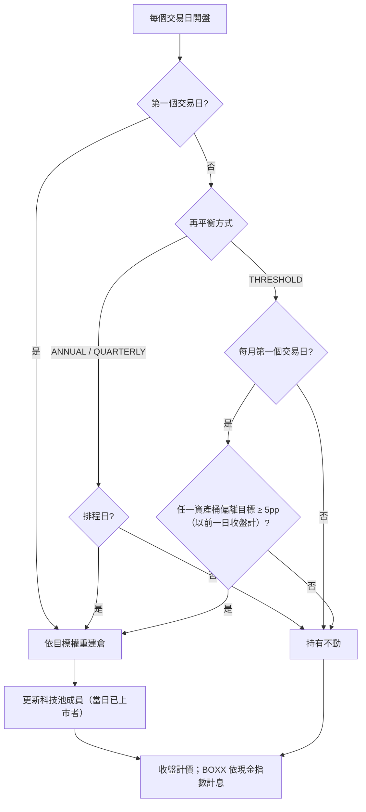
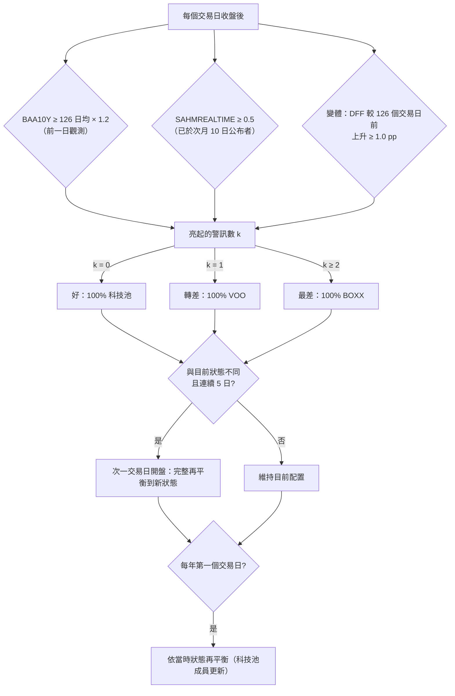

# 固定比例配置與定期再平衡（選項 A）(Static Allocation & Periodic Rebalancing)

## 1. 核心哲學與適用市場環境

### 1.1 為什麼放棄擇時
使用者主策略為 Buy & Hold，首要目標是**降低暴跌風險**，其次才是報酬。先前五份回測（動態轉倉引擎的三種配置與兩段期間、逃頂三級階梯、BOXX 大盤退場、[`08_regime_momentum_rotation.md`](08_regime_momentum_rotation.md) 的大盤三態 + 動能輪動）得到一致的結論：**沒有任何一種看價格訊號進出場的規則，能以比「固定地少持有一些股票」更便宜的代價降低暴跌風險。** 在同等下行風險下，這些規則的報酬都不優於「固定比例股票 + BOXX」，也就是一直被拿來當對照組的減碼 B&H。

因此選項 A 直接把這個對照組當成策略：股票與 BOXX 維持固定比例、定期再平衡，不做任何擇時。回撤主要由股票比例決定，使用者只需要回答一個問題：**我能承受多深的回撤？**

### 1.2 系統的角色
- 不再產生進出場、換股、停利建議。
- 只負責兩件事：**再平衡提醒**（到期或偏離門檻時），以及**真正的左尾警訊**（SEC 論點破滅、帳戶層級回撤與 CVaR，見 [`../risk_portfolio/07_downside_risk_sortino_var_cvar.md`](../risk_portfolio/07_downside_risk_sortino_var_cvar.md)）。
- 本文件目前只有離線回測；接入 production 前需另行規劃並經使用者同意。

### 1.3 適用與不適用
- 適用：長期持有、能接受「回撤大致與股票比例成正比」的投資人。
- 不適用：期待在急跌前全身而退的需求。固定比例不預測，只在事後以再平衡「逢低買回股票」。

### 1.4 總經三態配置（未通過驗證）
使用者的預設狀態是 **100% 科技池**，VOO 與 BOXX 只是例外的防守狀態；目標是最大回撤 ≤ 25%，
並希望依總經狀況決定何時防守：好 → 100% 科技池、轉差 → 100% VOO、最差 → 100% BOXX（使用者舉
2022 為最差的例子）。與選項 A 不同，回撤不再由固定持股比例保證，而是作為及格標準檢驗。

使用者選定兩個總經指標：信用利差與 Sahm 衰退指標（主版本）。由於 2022 年是升息造成、沒有衰退的
空頭，另設變體加入聯準會升息循環。結果見 §3.3：**兩個版本都不及格**，而且 2022 年都沒有進入
BOXX；在每一個回撤水準，「一直 X% 科技池 + (1−X)% BOXX」都優於三態切換。

額外對照「股票 40% 固定、股票內科技／VOO 切換」（BOXX 60% 不動）同樣未優於靜態 40%／60%。

---

## 2. 數學模型與量化推導

### 2.1 三個資產桶與目標權重
股票總比例 $E$、股票內科技池占比 $T$：

$$
w^{*}_{\text{TECH}} = E \cdot T, \qquad
w^{*}_{\text{VOO}} = E \cdot (1 - T), \qquad
w^{*}_{\text{BOXX}} = 1 - E
$$

科技池內部為 point-in-time 等權：再平衡當日「前一日有收盤、當日有開盤」的 $N_t$ 檔各 $w^{*}_{\text{TECH}} / N_t$。

### 2.2 再平衡觸發
- ANNUAL：每年第一個交易日。
- QUARTERLY：每季（1、4、7、10 月）第一個交易日。
- THRESHOLD：每月第一個交易日檢查，以前一日收盤計算資產桶權重 $w_{k}$，當

$$
\max_{k \in \{\text{TECH}, \text{VOO}, \text{BOXX}\}} \left| w_{k} - w^{*}_{k} \right| \ge \delta, \quad \delta = 5\ \text{pp}
$$

時才再平衡。

### 2.3 成本
再平衡當日開盤成交，股票成交金額 $\sum_i |\Delta q_i| \cdot P^{\text{open}}_i$ 乘上單邊成本 $c = 0.15\%$；BOXX 進出不計成本。成本自淨值扣除後，所有部位按比例縮減（與等權對照組相同作法）。

### 2.4 總經三態：指標、可用時點與配置
- 信用利差警訊（FRED `BAA10Y`，Moody's Baa 公司債 − 10 年公債，每日、不修正）：

$$
S^{\text{spread}}_{\tau} = \mathbb{1}\!\left[ s_{\tau} \ge m \cdot \frac{1}{L}\sum_{j=0}^{L-1} s_{\tau-j} \right], \quad L = 126,\ m = 1.2
$$

  觀測日 $\tau$ 的結果在嚴格晚於 $\tau$ 的第一個交易日才可用（H.15 次一營業日公布）。
- Sahm 警訊（FRED `SAHMREALTIME`，以當時公布的失業率計算，避免事後修正偏差）：$S^{\text{sahm}}_{M} = \mathbb{1}[\text{Sahm}_{M} \ge 0.5]$，月份 $M$ 的數值在 $M+1$ 月 10 日（遇非交易日順延）才可用。
- 升息循環警訊（變體；FRED `DFF` 聯邦基金有效利率，依可用時點對齊到交易日曆後）：$S^{\text{fed}}_t = \mathbb{1}[\text{DFF}_t - \text{DFF}_{t-126} \ge 1.0\ \text{pp}]$。
- 亮起的警訊數 $k_t$ 決定三態（任一指標尚無可用數值時為未知）：

$$
\text{state}_t = \begin{cases}
\text{好} & k_t = 0 \\
\text{轉差} & k_t = 1 \\
\text{最差} & k_t \ge 2
\end{cases}
\qquad
(w_{\text{TECH}}, w_{\text{VOO}}, w_{\text{BOXX}}) = \begin{cases}
(1, 0, 0) & \text{好} \\
(0, 1, 0) & \text{轉差} \\
(0, 0, 1) & \text{最差}
\end{cases}
$$

- 狀態切換需原始狀態連續 $K = 5$ 個交易日一致；以收盤後已知資訊判定，次一交易日開盤完整再平衡到新狀態的配置；每年第一個交易日依當時狀態再平衡一次（科技池成員更新）。
- 取捨分析：好／轉差的股票部位乘上 $X$，其餘放 BOXX（最差仍 100% BOXX），與「一直 $X$ 科技池 + $(1-X)$ BOXX」對等比較。

### 2.5 回撤體驗指標
除 Sortino（主）、MDD、CVaR95 外，另計：
- 最差 12 個月報酬：$\min_t \left( V_t / V_{t-252} - 1 \right)$
- 回撤恢復時間：最大回撤的高點 $t_p$ 到淨值首次收復 $V_{t_p}$ 的交易日數。

---

## 3. 決策邏輯與狀態機 / 流程圖

### 3.1 總經三態流程

### 3.2 回測結果（2007-01-03 → 2025-12-31，日線）

Sortino 的 MAR 為期間內 BOXX／BIL 的實際年化報酬 1.38%。

**依目標最大回撤查表（每年再平衡，全期間 CAGR 最高者）**：

| 目標 MDD ≤ | 只用 VOO（最可信） | 科技 50% | 科技 100% |
|---|---|---|---|
| 25% | 股 40%：CAGR 5.5%、Sortino 0.78、MDD 23.7% | 股 40%：9.7%、1.33、20.9% | 股 40%：13.7%、1.61、21.5% |
| 30% | 股 50%：6.5%、0.76、29.6% | 股 50%：11.6%、1.31、26.3% | 股 50%：16.4%、1.59、27.3% |
| 35% | 股 50%：6.5%、0.76、29.6%（股 60% 的 MDD 35.2% 略超過目標） | 股 60%：13.4%、1.29、31.5% | 股 60%：19.0%、1.57、33.0% |
| 40% | 股 60%：7.4%、0.74、35.2% | 股 70%：15.2%、1.26、36.7% | 股 70%：21.5%、1.54、38.6% |

目標 MDD ≤ 20% 需要股票比例低於 40%，不在本次格點內。

**三段崩跌的區間回撤（每年再平衡）**：

| 配置 | 2008 | 2020 | 2022 | MDD 恢復時間 |
|---|---:|---:|---:|---|
| B&H VOO | 55.2% | 34.0% | 24.5% | 1,224 日 |
| B&H 等權科技池 | 55.3% | 29.7% | 43.2% | 506 日 |
| #19 大盤三態 + 動能 | 18.2% | 39.1% | 26.6% | 536 日 |
| 股 60%／VOO | 35.2% | 20.6% | 14.5% | 893 日 |
| 股 60%／科技 50% | 31.5% | 18.6% | 20.1% | 514 日 |
| 股 50%／科技 100% | 27.3% | 15.8% | 21.4% | 437 日 |

**觀察**：
1. 回撤幾乎與股票比例成正比：股 60% 的 2020 回撤約為 B&H 的 60%。固定比例在**急跌**（2020）的保護比 #19 的擇時策略好；#19 只在 2008 這種緩跌型空頭較好。
2. 再平衡方式：含科技池的配置，**每年一次**全面優於季度與偏離門檻（CAGR 高 1–4 個百分點、MDD 低 2–5 個百分點、換手較少）——季度再平衡在上漲趨勢中過早賣出贏家，偏離門檻模式的科技池成員名單很少更新（見 §5）。只用 VOO 的配置三種方式差距在 0.1 個百分點內。
3. Sortino 隨股票比例下降而**上升**（科技 100%：股 100% 1.44 → 股 40% 1.61），因為 BOXX 的報酬高於 MAR、且幾乎沒有下行。
4. 子期間：每個配置在 2007–2015 與 2016–2025 的 MDD 排序一致，CAGR 在後段一律較高。以全期間查表選出的配置，在兩段子期間的 MDD 都未超過目標；但若只看 2016–2025，同一目標會選到高出 10–40 個百分點的股票比例——**只用近 10 年資料挑比例，會低估回撤**；2007–2015 的最佳選擇則與全期間相同（2008 是決定性的一段）。

### 3.3 總經三態回測結果（2007-01-03 → 2025-12-31）

`BAMLH0A0HYM2`（ICE BofA 高收益債 OAS）在 FRED 只有 2023-09 起的資料，信用利差改用 `BAA10Y`。

| 配置 | CAGR | Sortino | MDD | 2008 | 2020 | 2022 | 好／轉差／最差 時間占比 |
|---|---:|---:|---:|---:|---:|---:|---|
| 三態主版本（利差 + Sahm） | 22.3% | 1.25 | 48.4% | 40.5% | 34.0% | 46.0% | 77.4%／20.8%／1.8% |
| 三態變體（+ 升息） | 21.1% | 1.21 | 44.3% | 40.5% | 34.0% | 41.6% | 72.0%／26.2%／1.8% |
| **B&H 100% 科技池（使用者預設狀態）** | 28.2% | 1.44 | 55.3% | 55.3% | 29.7% | 43.2% | — |
| 靜態 40% 全科技池 + 60% BOXX | 13.7% | 1.61 | 21.5% | 21.5% | 12.8% | 17.0% | — |
| 額外對照：股 40% 固定、股票內切換（任一亮） | 10.2% | 1.24 | 24.3% | 24.3% | 14.7% | 18.1% | — |

**相對「一直 100% 科技池」**：主版本 MDD 淺 6.9 個百分點、2008 淺 14.8 個百分點，但 2020 深 4.3、2022 深 2.7 個百分點；代價是 CAGR 少 5.9 個百分點、Sortino 少 0.19。變體 MDD 淺 11.0 個百分點，CAGR 少 7.1 個百分點、Sortino 少 0.23。

**及格判定**：

| 標準 | 主版本 | 變體 |
|---|:---:|:---:|
| 1. 整體與三段崩跌 MDD 皆 ≤ 25% | ❌（48.4%） | ❌（44.3%） |
| 2. Sortino 與 CAGR 皆優於靜態 40% 全科技池 + 60% BOXX | ❌（Sortino 1.25 vs 1.61） | ❌（1.21 vs 1.61） |
| 3. 兩段子期間皆優於靜態 40%／60% | ❌ | ❌ |
| 4. 敏感度：結論不因單一參數翻轉（且本身及格） | ❌（0／7） | ❌（0／9） |

**2022 年是否進入 BOXX：兩個版本都沒有。** 主版本 2022 年只有 12 天處於轉差（2022-03-08 → 03-23）。變體的升息警訊到 2022-06-27 才轉為轉差（進入時科技池已從一年高點跌 36.7%），並一直停在 VOO 直到 2023-06-27，期間錯過科技池相對 VOO 多漲的 25 個百分點；因為信用利差與 Sahm 都沒亮，升息只貢獻 1 個警訊，達不到最差。

**訊號落後**：2020 年信用利差警訊於 2020-03-10 才可用（VOO 已自 2020-02-19 高點跌 14.8%），三態於 2020-03-17 開盤才轉為 VOO（已跌 24.7%）；Sahm 到 2020-05-11 才亮，三態於 2020-05-18 進入 BOXX 時市場早已反彈。兩段最長的防守區段（2009-01 → 2010-07、2020-06 → 2021-05）落在科技股強勢反彈期，科技池分別比 VOO 多漲約 76 與 33 個百分點。

**取捨：大部分時間 100% 科技池 vs MDD ≤ 25%**

| 股票比例 X | 三態主版本 CAGR／MDD | 三態變體 CAGR／MDD | 一直 X 科技池 + BOXX CAGR／MDD |
|---:|---|---|---|
| 100% | 22.3%／48.4% | 21.1%／44.3% | 28.2%／55.3% |
| 80% | 18.7%／40.0% | 17.6%／36.7% | 23.9%／44.2% |
| 60% | 14.8%／30.9% | 13.9%／28.5% | 19.0%／33.0% |
| 50% | 12.7%／26.1% | 11.9%／24.1% | 16.4%／27.3% |
| 40% | 10.6%／21.1% | 9.9%／19.6% | 13.7%／21.5% |

MDD ≤ 25% 的最大 X：主版本 40%、變體 50%，但同樣回撤下「一直 X 科技池 + BOXX」的 CAGR 都更高（例如變體 X = 50% 的 11.9%／24.1% 不如靜態 40% 的 13.7%／21.5%）。**「大部分時間 100% 科技池」與「MDD ≤ 25%」無法同時做到**：歷史上要守住 25%，需要把科技池長期降到約 40%；總經切換無法以更少的持股降低達到同樣的保護。

---

## 4. 關鍵具名常數與物理約束

| 常數 | 值 | 說明 | 位置 |
| :--- | :--- | :--- | :--- |
| `EQUITY_SHARES` | $\{1.0, 0.8, 0.7, 0.6, 0.5, 0.4\}$ | 股票總比例格點 $E$ | `calibration/static_allocation_backtest.py` |
| `TECH_SHARES` | $\{1.0, 0.5, 0.0\}$ | 股票內科技池占比格點 $T$ | 同上 |
| `REBALANCE_MODES` | ANNUAL／QUARTERLY／THRESHOLD | 再平衡方式 | 同上 |
| `drift_threshold` | $0.05$ | 偏離門檻 $\delta$ | `StaticAllocationParams` |
| `cost_rate` | $0.0015$ | 股票單邊交易成本，BOXX 不計 | 同上 |
| `TARGET_MDDS` | $\{20, 25, 30, 35, 40\}\%$ | 查表的目標最大回撤 | `scripts/run_static_allocation_backtest.py` |
| `SPREAD_SERIES` | `BAA10Y` | 信用利差序列（ICE 高收益債 OAS 歷史不足） | `calibration/macro_regime.py` |
| `SAHM_SERIES` | `SAHMREALTIME` | Sahm 即時版（當時公布值） | 同上 |
| `spread_ma_days` | $126$ | 利差均線長度 $L$（觀測筆數） | `MacroParams` |
| `spread_mult` | $1.2$ | 利差警訊倍數 $m$ | 同上 |
| `sahm_threshold` | $0.50$ | Sahm 警訊門檻 | 同上 |
| `sahm_release_day` | $10$ | 月資料於次月第幾日可用 | 同上 |
| `confirm_days` | $5$ | 狀態切換的連續確認交易日數 $K$ | 同上 |
| `combine` | ANY／ALL | 額外對照（股票內切換）：任一亮／兩者皆亮即「不好」 | 同上 |
| `FED_SERIES` | `DFF` | 聯邦基金有效利率（變體） | `calibration/macro_regime.py` |
| `hike_lookback` | $126$ | 升息比較的交易日數 | `MacroParams` |
| `hike_threshold` | $1.0$ pp | 升息警訊門檻 | 同上 |
| `worst_min_warnings` | $2$ | 亮起 ≥ 此數即「最差」；恰好 1 個為「轉差」 | 同上 |
| `STATE3_WEIGHTS` | 好 (1,0,0)／轉差 (0,1,0)／最差 (0,0,1) | 三態的（科技池, VOO, BOXX）目標配置 | 同上 |
| `MDD_LIMIT` | $0.25$ | 及格標準：整體與三段崩跌 MDD 上限 | `scripts/run_macro_switch_backtest.py` |
| `X_GRID` | $\{1.0, 0.9, \dots, 0.4\}$ | 取捨分析的股票比例 | 同上 |
| `WHIPSAW_WINDOW` | $60$ | 切換後幾個交易日內切回算 whipsaw | 同上 |

---

## 5. 邊界條件、風控熔斷與例外處理

- **存活者偏差與事後挑選**：科技池是 2026 年挑的 22 檔，且 Yahoo 沒有已下市公司資料；科技占比越高，絕對報酬越偏樂觀。VOO 與 BOXX 不受此影響，因此「只用 VOO」那一欄最可信，科技池欄位應視為上限。
- **偏離門檻模式只看資產桶層級**：只有單一資產桶時（例如股 100%／科技 100%）永遠不會觸發；科技池成員名單只在再平衡時更新，新上市標的可能長期不被納入。該模式的科技池結果以年度再平衡為準。
- **科技池無可交易標的時**：科技桶的資金自然留在 BOXX，直到下一次再平衡。
- **時序**：再平衡的觸發與偏離判定只用前一日收盤，於當日開盤成交、收盤計價，無前視。
- **資料代理**：VOO 上市前以 SPY 串接；BOXX 上市前以 BIL、BIL 上市前以固定利率 4.5% 計息。
- **價格**：分割與股息調整後價格，屬總報酬近似；未模擬滑價與稅。
- **總經資料的可用時點**：利差觀測日當天不可用、次一交易日才可用；Sahm 月值於次月 10 日（遇非交易日順延）才可用，實際公布日為次月第一個週五，此近似偏保守。只用 `SAHMREALTIME`（當時公布值），不用事後修正的序列。
- **總經指標未知**：任一指標尚無可用數值（暖機不足）時原始狀態為未知，沿用目前狀態；回測起點前尚無狀態時預設為「好」（2007 年兩序列皆已有長歷史，實際不會用到）。
- **三態換倉**：狀態改變的次一交易日開盤完整再平衡到新狀態的配置（`targets_by_day`）；年度再平衡依當時狀態。額外對照的股票內切換（`tech_share_by_day`）則以當下股票市值重新分配、BOXX 金額不動。兩者互斥；皆未提供時 `simulate_static()` 與固定比例逐位元相同（測試把關）。
- **2022 型空頭**：升息循環只貢獻 1 個警訊，在信用利差與 Sahm 都未亮時只能到「轉差」（VOO），無法進入 BOXX；且警訊在累積升息 1 pp 後才亮，落後於科技股的下跌。
- **科技池相對強弱的機會成本**：科技池為事後挑選，絕對報酬偏樂觀，因此「切換到 VOO 錯過的報酬」可能被高估；但即使扣除此偏差，兩段長「不好」區段仍落在科技股反彈期，結論方向不變。
- **一致性驗證**：股 100%／科技 100%／每年 與 [`08_regime_momentum_rotation.md`](08_regime_momentum_rotation.md) 的等權對照組逐位元一致；股 100%／VOO 與 B&H VOO 的 CAGR 與 MDD 一致（測試把關）。

---

## 6. 核心程式碼檔案路徑關聯

- `nexus_core/calibration/static_allocation_backtest.py`：`StaticAllocationParams`、`simulate_static()`、`rebalance_calendar()`、`needs_rebalance()`、`max_drawdown_episode()`、`worst_rolling_return()`。
- `nexus_core/calibration/daily_panel.py`：日線面板載入、VOO／BOXX 代理銜接（與 #19 共用，資料處理逐位元一致）。
- `nexus_core/scripts/run_static_allocation_backtest.py`：全格點、三段崩跌、目標回撤查表、子期間穩定性、與 #19 及 B&H 並列；報告輸出到 gitignored 的 `reports/static_allocation/`。
- `nexus_core/calibration/macro_regime.py`：`MacroParams`、FRED 抓取與解析（`fetch_fred()`／`load_fred()`，`python -m calibration fetch-fred`）、`spread_warning()`、`sahm_warning()`（公布延遲）、`fed_hike_warning()`、`raw_state3()`／`macro_states3()`（三態 + 連續確認 + 次日採用）、`targets_series()`（含取捨分析的股票比例 X）、額外對照用的 `raw_macro_state()`／`macro_states()`／`tech_share_series()`、`state_episodes()`、`whipsaw_count()`。
- `nexus_core/calibration/static_allocation_backtest.py`：`simulate_static()` 的 `targets_by_day`（三態完整再平衡）與 `tech_share_by_day`（股票內切換）。
- `nexus_core/scripts/run_macro_switch_backtest.py`：三態主版本／變體 vs B&H 100% 科技池與靜態 40%／60%、各狀態時間占比與每年非科技天數、每段防守區段的進入時跌幅與區段內報酬、2020 急跌各指標亮起時點、2022 是否進入 BOXX、取捨分析（X 格點與對等靜態配置）、敏感度、及格判定；報告輸出到 gitignored 的 `reports/macro_switch/`。
- `nexus_core/tests/unit/test_macro_regime.py`：FRED 缺值解析、Sahm 公布延遲與非交易日順延、利差與升息警訊的次日可用、三態警訊計數、5 日確認與無前視、目標配置與股票比例 X、狀態改變次日完整再平衡、年度再平衡沿用當下狀態、兩種換倉模式互斥、常數序列與無序列逐位元一致、股票內切換時 BOXX 不動與成本。
- `nexus_core/tests/unit/test_static_allocation_backtest.py`：再平衡時點、偏離門檻邊界、成本、與等權對照組逐位元一致、point-in-time 加入、BOXX 計息、回撤恢復時間。
